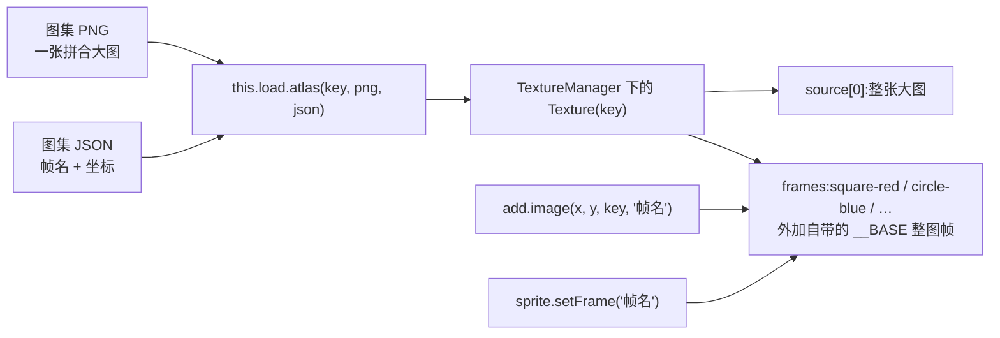

import { Canvas, Controls, Meta } from '@storybook/addon-docs/blocks';
import * as TextureAtlas from './texture-atlas.stories';

<Meta of={TextureAtlas} name="Docs" />

# 纹理图集

纹理图集(texture atlas)把许多张小图拼进一张大图,再配一份 JSON 标出每张小图的位置和尺寸;加载后整张大图注册为一个纹理 key,每张小图成为这个纹理下的一个**命名帧**,精灵用「纹理 key + 帧名」两级引用。对照上一课的单图加载——一张 PNG 一个 key、只能整张使用——图集用一次加载、一张纹理供给全部小图,这是它省内存、利于合批的根本原因。本课掌握三件事:图集 JSON 的结构(制作)、`load.atlas` 家族的加载方式、帧名引用与切换;并分清 spritesheet、multiatlas 与图集的关系。



加载方法家族速查(行为细节见正文对应小节):

| 方法 | 帧数据来源 | 帧引用方式 | 适用 |
| --- | --- | --- | --- |
| `load.atlas` | JSON 文件或 JSON 对象,Array / Hash 格式自动识别 | 帧名 | 通用首选,TexturePacker 等导出 |
| `load.multiatlas` | JSON,内含多页 `textures` 数组 | 帧名 | 一页装不下,多图共用一个 key |
| `load.spritesheet` | 无数据文件,加载时按 `frameConfig` 切格子 | 索引 `0, 1, 2…` | 等大格子的序列帧 |
| `load.atlasXML` | XML 数据文件 | 帧名 | Adobe Animate 等导出 |
| `load.unityAtlas` | Unity YAML 数据文件 | 帧名 | Unity 导出 |
| `load.atlasPCT` | Phaser 紧凑文本格式(Phaser 4 新增) | 帧名 | 体积敏感的紧凑管线 |
| `load.aseprite` | Aseprite JSON(含标签动画) | 帧名 | Aseprite 导出,动画用法见 [2.3.1 帧动画](?path=/docs/frame-animations--docs) |

关键默认值回查:

| 输入 | 默认值 | 说明 |
| --- | --- | --- |
| `load.atlas` 的 `textureURL` | `<key>.png` | 缺省时按 key 拼文件名 |
| `load.atlas` 的 `atlasURL` | `<key>.json` | 也可直接传 JSON 对象(不走网络) |
| `spritesheet` 的 `frameHeight` | 等于 `frameWidth` | `frameWidth` 必填 |
| `spritesheet` 的 `margin` / `spacing` | `0` | 格子边距 / 格子间距 |
| `spritesheet` 的 `endFrame` | `-1` | 切到图片末尾为止 |
| `getFrameNames()` 返回 | 不含 `__BASE` | `frameTotal` 则含 `__BASE` |

## 快速上手

`preload` 里一次 `load.atlas` 装载「大图 + JSON」,`create` 里在第四个参数位置直接给帧名——这就是图集的最小闭环:

```ts
class Demo extends Phaser.Scene {
  preload() {
    this.load.atlas('shapes', 'atlas-sheet.png', 'atlas.json');
  }
  create() {
    // 前两参与单图相同,第四参从图集里挑出名为 square-red 的帧
    this.add.image(100, 100, 'shapes', 'square-red');
  }
}
```

下面是本课工作区内的真实实例。素材是课程目录里手工构建的图集:`atlas-sheet.png`(256×256,六个纯色几何块)与 `atlas.json`(JSON Array 格式,坐标与像素一一对应);左侧对照组是同一块红方块的独立单图 PNG。同一张大图还用 JSON Hash 格式走了第二条加载通路,验证 `load.atlas` 对两种格式的自动识别。

<Canvas of={TextureAtlas.AtlasDemo} />
<Controls of={TextureAtlas.AtlasDemo} />

| 读者操作 | 可观察证据 |
| --- | --- |
| 初始加载 | 右侧精灵显示 `square-red`,与左侧单图完全同款——帧就是大图里的一个矩形区域 |
| 切换「当前帧」到 `circle-blue` / `diamond-green` 等 | 右侧精灵立即换成对应几何块;「当前帧」「frame 裁剪尺寸」同步变化 |
| 切换到 `bar-purple` | 精灵显示尺寸 `160 × 32`,而 frame 裁剪尺寸 `160 × 24`、sourceSize `160 × 32`——trim 的证据(见「制作图集」) |
| 切换到 `__BASE(整张图集)` | 右侧显示整张大图:图集本体就是一张普通纹理,帧只是它上面的矩形 |
| 关闭「显示单图对照」 | 左列整体隐藏,只剩图集通路 |
| 查看「图集帧数」与「hash 通路帧数」 | 两条通路都是 6,`frameTotal` 为 7(含 `__BASE`) |
| 打开 Show code | 看到该 Canvas 实际执行的 `atlas-demo.ts` 全文 |

实例滚出视口或页面切到后台时会整体休眠以省资源,回到视口自动恢复。

## 纹理与帧

图集之所以能用「key + 帧名」两级引用,是因为 Phaser 的纹理模型本来就是两层的:

- **TextureManager(`this.textures`)**——全局唯一的纹理管理器,以 key 索引所有 Texture;加载器注册纹理、精灵取用纹理都经过它。
- **Texture**——一个纹理 = `source[]`(源图像,通常是解码后的 PNG)+ `frames`(一组命名的矩形 Frame)。单图和图集在模型上是同一种东西:单图就是只有一个 `__BASE` 帧的纹理,图集只是多了一批命名帧。
- **Frame**——源图像上的一个矩形,记录裁剪坐标(`cutX` / `cutY` / `width` / `height`)与原始逻辑尺寸(`realWidth` / `realHeight`,即 JSON 里的 `sourceSize`)。精灵的显示尺寸由 Frame 决定。

每个 Texture 都自带一个覆盖整张源图像的 `__BASE` 帧:单图引用的其实就是它;对图集显式使用 `setFrame('__BASE')` 能把整张大图当一个精灵显示(上面实例可试)。解析器还会把 JSON 中 `frames` 之外的字段收进 `texture.customData`,把每个帧的原始 JSON 收进 `frame.customData`,需要回查导出工具的附加数据时从这里取。

运行时检查与遍历:

```ts
const texture = this.textures.get('shapes');        // 按 key 取 Texture
this.textures.exists('shapes');                     // 存在性检查(不打印警告)
texture.has('square-red');                          // 帧名检查
texture.get('square-red');                          // 取 Frame(可传名字或索引)
texture.getFrameNames();                            // 全部帧名,默认不含 __BASE
texture.frameTotal;                                 // 帧总数,含 __BASE
this.textures.getFrame('shapes', 'bar-purple');     // 一步取 Frame
this.textures.getTextureKeys();                     // 管理器里全部纹理 key
```

上面实例 readout 的「图集帧数 / frameTotal」就直接来自 `getFrameNames()` 与 `frameTotal`——6 个命名帧加 1 个 `__BASE`,共 7。

## 制作图集

真实项目里图集由打包工具生成:TexturePacker、Free Texture Packer、ShoeBox 等都能把散图拼页并导出 Phaser 支持的 JSON。要理解的核心不是工具操作,而是 JSON 本身——它决定了帧名怎么来、坐标怎么对。

**JSON Array 格式(主线)**:`frames` 是数组,每项一个帧,帧名在 `filename` 字段里。本课 `atlas.json` 的第一项:

```json
{
  "frames": [
    {
      "filename": "square-red",
      "frame": { "x": 4, "y": 4, "w": 64, "h": 64 },
      "rotated": false,
      "trimmed": false,
      "spriteSourceSize": { "x": 0, "y": 0, "w": 64, "h": 64 },
      "sourceSize": { "w": 64, "h": 64 },
      "pivot": { "x": 0.5, "y": 0.5 }
    }
  ]
}
```

字段含义(两种 JSON 格式通用):

| 字段 | 含义 | 关键影响 |
| --- | --- | --- |
| `filename` | 帧名,精灵引用它 | 同一 Texture 内必须唯一,重名帧被丢弃并告警 |
| `frame` | 在大图上的裁剪矩形 `x/y/w/h` | 决定精灵显示哪块像素 |
| `trimmed` | 是否裁掉过透明边 | `true` 时下面两个字段才生效 |
| `spriteSourceSize` | 裁剪区在原始图里的偏移和大小 | trim 后精灵的对位 |
| `sourceSize` | 原始逻辑尺寸(未 trim 前) | 精灵显示尺寸按它算 |
| `rotated` | 打包时是否旋转了 90° | 由打包工具写入并负责还原,手写保持 `false` |
| `pivot` | 帧的自定义轴点 `0~1`(解析时同样接受 `anchor` 字段) | 可选;缺省用精灵的 origin |

**JSON Hash 格式(对照)**:`frames` 从数组换成对象,键就是帧名,其余字段完全相同。本课 `atlas-hash.json` 与 `atlas.json` 描述的是同一张大图,内容等价。Phaser 4 的 `load.atlas` 按数据形状自动识别两种格式——不需要、也没有 Phaser 3 教程里那个单独的 `load.atlasJSONHash` 方法。

`trim` 的效果可以在实例里直接核对:切换到 `bar-purple`,紫条在大图上只占 24px 高(`frame` 的 `h: 24`),但它导出前是一块 160×32 的图,上下各 4px 是透明的,所以 `sourceSize` 记为 `160 × 32`——readout 里「精灵显示尺寸」按 sourceSize 显示 32 高,紫条在精灵框内垂直居中。打包工具用这招压缩空白,Phaser 用 `spriteSourceSize` 把画面放回原位。

本课素材是目录内 `generate-atlas.mjs` 用纯 Node 生成的:脚本按固定坐标在 256×256 画布上画六个几何块,两份 JSON 的坐标与之一一对应——这正是「图集 = 大图 + 坐标描述」最直接的示范。

## 加载与引用

`load.atlas` 的完整签名与两个细节:

```ts
this.load.atlas(key, textureURL, atlasURL);

// key 冲突或参数多时用配置对象形式
this.load.atlas({ key: 'shapes', textureURL: 'atlas-sheet.png', atlasURL: 'atlas.json' });

// atlasURL 可以直接传解析好的 JSON 对象,跳过一次网络请求
this.load.atlas('shapes', atlasPngUrl, atlasJsonObject);
```

- 两个 URL 缺省时分别取 `<key>.png` 与 `<key>.json`;相对路径会拼上加载器的 `baseURL` 与 `path`。
- `atlasURL` 传字符串走网络抓取,传 JSON 对象直接使用——上面实例的「array 通路」用的就是 `?raw` 导入 + `JSON.parse` 后直传,「hash 通路」用的 URL 抓取,两条通路效果相同。
- 纹理 key 在 Texture Manager 内必须唯一;重复加载同一个 key 只会得到警告,替换前要先 `this.textures.remove(key)`。

帧引用有三种等价入口:

```ts
// 1. 创建时第四参给帧名(spritesheet 用数字索引)
const sprite = this.add.image(x, y, 'shapes', 'circle-blue');

// 2. 之后用 setFrame 切换;可选参数控制是否重算尺寸与轴点(默认都为 true)
sprite.setFrame('diamond-green');

// 3. 直接换整个纹理:setTexture(key, frame) 一步到位
sprite.setTexture('shapes', 'bar-purple');
```

`setFrame` 与 `setTexture` 的 frame 参数都接受帧名、数字索引或 Frame 实例;不过数字索引只对 spritesheet(解析时以数字为键)有效,图集帧一律用帧名。切换帧后精灵的显示尺寸、裁剪都随 Frame 更新——实例里每次切换「当前帧」,「frame 裁剪尺寸」与「精灵显示尺寸」两行同步变化就是这条链路的读数。

图集加载同样是加载器队列里的一员:`preload` 中排队、`create` 前就绪;进度事件、`filecomplete` 监听与各类缓存的读取方式与单图一致,统一在 [2.1.1 资源加载器](?path=/docs/asset-loader--docs),本课不重讲。

## spritesheet 与图集

`spritesheet`(精灵表)是图集的特例:不需要数据文件,加载时按固定格子切:

```ts
// frameWidth 必填;frameHeight 缺省取 frameWidth;margin/spacing 默认 0
this.load.spritesheet('bot', 'robot.png', { frameWidth: 32, frameHeight: 38 });

this.add.image(x, y, 'bot', 0);   // 帧用索引引用,从 0 起,按行排列
this.add.image(x, y, 'bot', 7);
```

两者同源不同形,选型差异都在这几点上:

| | spritesheet | 图集(atlas) |
| --- | --- | --- |
| 帧数据 | 无,加载时按格子推算 | JSON / XML 等数据文件描述 |
| 帧尺寸 | 必须全部相同 | 每帧任意 |
| 帧引用 | 索引 `0, 1, 2…` | 帧名(也可用索引) |
| trim / 旋转 | 不支持 | 支持(工具自动处理) |
| 适合 | 等大序列帧(角色动画、图块) | 混杂尺寸的静态图与动画混合 |

同一张网格 PNG 换成 `load.atlas` 加载并不成立——图集必须有坐标数据;反过来,图集完全可以包含序列帧(帧名排号即可),还能用 `this.textures.addSpriteSheetFromAtlas(key, { atlas, frame, frameWidth, … })` 把图集里的某一帧再按格子切成一个新的 spritesheet 纹理。

已经在用的单图想补切帧,不必重新加载:`this.textures.addSpriteSheet('key', 纹理或图像, config)` 按同一套 frameConfig 在现有 Texture 上追加帧。帧动画对这些帧的消费方式见 [2.3.1 帧动画](?path=/docs/frame-animations--docs)。

## 多图集

一张图集页装不下所有素材时,TexturePacker 的 multi-atlas 导出会把素材分到多张 PNG,JSON 顶层变成 `textures` 数组,每页一项,页内再是熟悉的 `frames`:

```json
{
  "textures": [
    { "image": "level1-0.png", "frames": [ /* 第 1 页的帧 */ ] },
    { "image": "level1-1.png", "frames": [ /* 第 2 页的帧 */ ] }
  ]
}
```

加载它只需要一行——加载器解析 JSON 后自动把各页 PNG 依次排队,全部就绪后注册成**一个** key,帧名跨页直达:

```ts
this.load.multiatlas('level1', 'level1.json');   // 第 3 参可给各页图片所在 path
this.add.image(x, y, 'level1', 'hero-idle-0');   // 不需要知道帧在哪一页
```

模型层面,multiatlas 就是 `source[]` 有多个源图像的 Texture:每个 Frame 记得自己属于第几个源(`sourceIndex`)。图集的意义也因此更完整——渲染器在同一个纹理源内的精灵之间不必切换纹理绑定,更容易合批,draw call 更少;页数、纹理预算与批处理的深入权衡在 [6.1.1 性能优化](?path=/docs/performance--docs)。

## 最佳实践

- **按素材形态选容器。** 独立背景、全屏 UI 大图用单图 `load.image`(塞进图集反而被迫 trim / 拆页);角色、道具、图标、特效等大量中小图用图集;确有等大序列帧时 spritesheet 上手最快,但图集 + 排号帧名同样能做,还兼容混排。
- **帧名稳定、可枚举。** 帧名是代码与素材的接口:导出前定好命名(如 `hero-idle-0`、`hero-idle-1`),运行时才能用 `this.anims.generateFrameNames('key', { prefix, start, end, zeroPad })` 前缀 + 序号批量生成帧名数组(用法见 [2.3.1 帧动画](?path=/docs/frame-animations--docs));改素材不改编号,代码零改动。
- **手写 JSON 保持字段诚实。** `rotated` 恒为 `false`,`trimmed` 只有在 `spriteSourceSize` / `sourceSize` 确实描述了透明边时才为 `true`——字段与像素不符时精灵会错位或尺寸异常。
- **控制单页尺寸。** 一页图集不宜过大,移动端 WebGL 常以上限 2048² 或 4096² 为界(以目标设备为准);超出就按场景或界面拆成多个图集,或直接用 multiatlas。拆分粒度与合批收益的权衡见 [6.1.1 性能优化](?path=/docs/performance--docs)。

## 常见问题

- **精灵显示成绿黑棋盘格。** 这是 `__MISSING` 纹理:**纹理 key** 不存在(拼写错、还没加载完就创建精灵)。用 `this.textures.exists(key)` 断言;若 key 存在但**帧名**写错,现象不同——控制台告警并回退到图集第一帧,画面显示的是别的帧而不是棋盘格,用 `texture.has(帧名)` 断言。JSON Hash 格式里帧名是对象键,大小写敏感。
- **Phaser 3 教程里的 `load.atlasJSONHash` 报「不是函数」。** Phaser 4 移除了独立的 `atlasJSONHash` 方法:JSON Hash 与 JSON Array 都由 `load.atlas` 按数据形状自动识别,改用 `load.atlas` 即可。
- **重复加载同一个 key,画面还是旧纹理。** key 已占用时新加载只告警不生效;替换前先 `this.textures.remove(key)`,并确认没有精灵还引用着旧纹理(remove 后仍引用它的对象会在渲染时报错)。
- **`getFrameNames()` 数量比 JSON 里的帧少一个。** 不是丢了:`getFrameNames()` 默认不含 `__BASE`,`frameTotal` 才含;需要时传 `getFrameNames(true)`。
- **精灵尺寸与 JSON 的 `frame` 对不上。** 帧被 trim 过:显示尺寸按 `sourceSize`(`frame.realWidth/realHeight`)计算,`frame` 只是图集里的裁剪区;实例切到 `bar-purple` 即是 24 与 32 的对照。

## 总结回顾

摘要:

纹理图集把多张小图拼进一张大图,配 JSON 描述每个帧的位置,一次加载注册为一个 Texture key;精灵以「key + 帧名」引用其中的子矩形。模型上 TextureManager 管 Texture、Texture 由源图像与命名帧组成,单图只是只有 `__BASE` 帧的特例。JSON Array 与 JSON Hash 两种格式由 `load.atlas` 自动识别,手写 JSON 时 `filename` / `frame` 定位帧,`trimmed` / `sourceSize` 描述透明边;帧引用有创建时第四参、`setFrame`、`setTexture` 三个入口,显示尺寸随 Frame 更新。spritesheet 是免数据文件的等大格子特例,帧用索引;multiatlas 把多页 PNG 合成一个 key,是 `source[]` 多源的 Texture。图集减少纹理数量与切换,利于合批,深入权衡留给性能优化一课。

一句话:

> 图集是「一张大图 + 一份坐标 JSON」注册成的一个纹理,帧名是代码与素材之间的接口。

知识要点:

- `load.atlas(key, png, json)` 的第三参既能传 URL 也能直接传 JSON 对象,两种 JSON 格式如何被识别?
- 精灵引用图集帧的三个入口分别是什么?切换帧后显示尺寸由哪个字段决定?
- `__BASE` 是什么?怎么用它把整张图集显示成一个精灵?
- `getFrameNames()` 与 `frameTotal` 的差一是怎么来的?
- spritesheet 与图集在帧数据、帧尺寸、帧引用上的三点差异是什么?
- multiatlas 的 JSON 长什么样,为什么加载它只需要一行?

## 参考资料

- [Phaser 官方文档(Texture / TextureManager / Loader)](https://docs.phaser.io/)
- [官方示例库:纹理与图集分类](https://phaser.io/examples/)
- [Phaser 4 Labs 示例浏览器](https://labs.phaser.io/phaser4-index.html)
- [TexturePacker:How to create sprite sheets for Phaser](https://www.codeandweb.com/texturepacker/tutorials/how-to-create-sprite-sheets-for-phaser3?source=photonstorm)
- [Free Texture Packer(免费图集打包工具)](http://free-tex-packer.com/)
