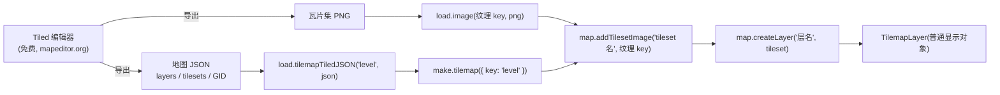

import { Canvas, Controls, Meta } from '@storybook/addon-docs/blocks';
import * as Tilemap from './tilemap.stories';

<Meta of={Tilemap} name="Docs" />

# 瓦片地图

瓦片地图(tilemap)用一张小图(瓦片集)按网格拼出大关卡:地图数据只记录「第几行第几列放哪个瓦片」,不存储像素。Phaser 不提供编辑器,行业标准做法是在免费的 [Tiled](https://www.mapeditor.org/) 里画图,导出 JSON,再由 Phaser 加载渲染。理解瓦片地图只需抓住三样东西的对应关系——**地图 JSON** 描述网格与图层,是纯数据;**瓦片集 PNG** 提供像素,按普通图片加载;`addTilesetImage` 把两者按名字接起来,`createLayer` 再把某个图层变成一个**普通显示对象**(TilemapLayer),深度、透明度、摄像机行为与精灵一致。本课用一份手工构建的 Tiled JSON(40×24,三个图层,两个瓦片集)走通完整链路:JSON 结构 → 加载装配 → 图层与深度 → 滚动与剔除 → 像素清晰。

瓦片碰撞、对象层实体与运行时改图属 [5.2 地图碰撞与交互](?path=/docs/tilemap-collision--docs);大地图的性能优化属 [6.1.1 性能优化](?path=/docs/performance--docs)。



关键 API 与属性速查(以下经 phaser@4.2.1 类型与源码核实):

| API / 属性 | 默认值 / 形式 | 回查要点 |
| --- | --- | --- |
| `load.tilemapTiledJSON(key, url)` | url 可为 URL 字符串或 JSON 对象 | 数据进 tilemap 缓存,不含像素 |
| `make.tilemap({ key })` | — | key 不在缓存时只告警,返回 10×10、32px 的空图 |
| `make.tilemap` 的 `insertNull` | `false` | `true` 时空格存 `null` 而非 -1 的 Tile,稀疏大图省内存 |
| `addTilesetImage(tilesetName, key?)` | key 缺省 = tilesetName | 名字取自 Tiled JSON;返回 Tileset,失败返回 `null` |
| `createLayer(layerID, tileset, x?, y?)` | x/y 默认取 Tiled 层偏移 | layerID 是层名字符串或索引;同一层不能创建两次 |
| `createLayer` 的 `gpu` | `false` | `true` 时建 TilemapGPULayer:仅 WebGL、仅正交、单 tileset |
| `map.width` / `height` | 瓦片数 | `widthInPixels = width × tileWidth` |
| `map.orientation` | `'orthogonal'` | 等距 / 六边 / 错位地图同样能解析 |
| `map.renderOrder` | `'right-down'` | 共 4 种绘制顺序,`setRenderOrder` 可改 |
| `layer.skipCull` / `cullPaddingX·Y` | `false` / `1` | 剔除开关与四周多留的瓦片数 |
| `layer.tilesDrawn` / `tilesTotal` | 每帧更新 | 实际进渲染列表的瓦片数 / 网格总数 |
| config 的 `pixelArt` | `false` | `true` = 关反走样 + `roundPixels` |

## 快速上手

「Tiled 导出 JSON + 瓦片集 PNG → 渲染出关卡」的最小闭环是固定五步:

```ts
class LevelScene extends Phaser.Scene {
  preload() {
    this.load.image('terrain', 'terrain.png');              // 1. 瓦片集按普通图片加载
    this.load.tilemapTiledJSON('level', 'level.json');      // 2. 地图数据进 tilemap 缓存
  }

  create() {
    const map = this.make.tilemap({ key: 'level' });        // 3. 解析成 Tilemap
    const tileset = map.addTilesetImage('terrain');         // 4. 数据 ↔ 纹理对接
    const ground = map.createLayer('地面', tileset);        // 5. 图层 → 显示对象
    this.cameras.main.setBounds(0, 0, map.widthInPixels, map.heightInPixels);
  }
}
```

`addTilesetImage('terrain')` 只传一个参数时,Phaser 用同名纹理 key 兜底——让纹理 key 与 Tiled 里的 tileset 同名是最省事的约定。地图大于画布时配合 `setBounds` 即可滚动,滚动与边界的行为复用 [2.5.1 摄像机控制](?path=/docs/camera-control--docs)。

## Tiled 与地图 JSON

[Tiled](https://www.mapeditor.org/) 是免费的桌面地图编辑器,在 Tiled 里铺瓦片、建图层,再导出(`Export As`)`.json` 即可交给 Phaser。工具操作不是本课重点,需要记的只有三条导出约定:**格式选 Tiled JSON**;**瓦片集要内嵌**(执行 Embed Tileset,外部引用的 tileset 带 `source` 字段,Phaser 解析时直接告警跳过);**Tile Layer Format 选 CSV 或未压缩的 Base64**——压缩的 Base64(gzip/zlib/zstd)整层被跳过并告警。现代 Tiled 导出的 `version` 是 `"1.10"` 这样的字符串,Phaser 4 的解析器同时接受 Tiled 1.x 与 2.x 的 JSON。

一份 JSON 地图的三层结构(字段名以 Phaser 解析源码为准):

```json
{
  "version": "1.10",           // 解析器按 version > 1 切换新旧行为
  "orientation": "orthogonal", // 本课只做正交;等距/六边/错位同样可解析
  "renderorder": "right-down", // 绘制顺序,共 4 种
  "width": 40, "height": 24,   // 地图尺寸,单位是瓦片
  "tilewidth": 32, "tileheight": 32,
  "infinite": false,           // 无限地图按 chunk 存,同样支持
  "tilesets": [ /* 见下 */ ],
  "layers": [ /* 见下 */ ]
}
```

**tilesets 数组**——每项描述一个瓦片集。注意 `image` 只是导出时的相对路径,**Phaser 不会按它加载图片**,图片的加载与 key 由你在代码里决定:

```json
{
  "name": "terrain",       // addTilesetImage 按它对接,必须一字不差
  "firstgid": 1,           // 本集第一个瓦片的全局编号
  "tilewidth": 32, "tileheight": 32,
  "spacing": 0, "margin": 0,
  "columns": 8, "tilecount": 8,
  "image": "terrain.png",  // 路径仅供回查,Phaser 不读它
  "imagewidth": 256, "imageheight": 32
}
```

**layers 数组**——每个 `type: "tilelayer"` 项是一个瓦片图层:

```json
{
  "name": "地面",          // createLayer 按它取层
  "id": 1,
  "width": 40, "height": 24,
  "data": [1, 1, 3, 0, 11, 0, 0, 0],  // 逐行展开的 GID,长度 = width × height
  "opacity": 1, "visible": true,
  "x": 0, "y": 0
}
```

`data` 里的数字是 **GID(全局瓦片编号)**:`瓦片集的 firstgid + 集内序号`。第一个瓦片集通常从 1 起,`0` 表示空格(不画任何瓦片)。两个瓦片集时编号连续衔接——本课 terrain 占 1–8,props 的 `firstgid` 就是 9、占 9–16。GID 的高位还打包了翻转标记(0x80000000 水平翻 / 0x40000000 垂直翻 / 0x20000000 对角翻),解析器自动拆成 `tile.flipX` / `rotation`,手写数据时不用管。层上的 `offsetx` / `offsety`(Tiled 的图层偏移)会被加进层的世界位置;`type: "group"` 的图层组不画瓦片,但其偏移、透明度与可见性会叠加到子层上,子层名拼接组名。

除 `tilelayer` 外,Tiled 还有 `objectgroup`(对象层)与 `imagelayer`(图片层)。对象层属 [5.2 地图碰撞与交互](?path=/docs/tilemap-collision--docs);图片层解析后存进 `map.images`,用途少,本课不展开。

本课素材是课程目录内手工构建的一套完整地图:`terrain.png`(草地 / 泥土 / 石板 / 水 / 沙等 8 个 32px 瓦片)、`props.png`(砖墙 / 栅栏 / 灌木 / 花丛 / 岩石 / 水晶 / 树桩 / 路牌 8 个)与 `level.json`(40×24,地面 / 装饰 / 前景三层,`data` 逐行排版可直接对照网格)。它没有经过 Tiled,但每个字段都按 Tiled 的导出格式与 Phaser 的解析行为书写——这正是理解两者接口的最短路径。

## 装配:从 key 到图层

装配链路每一步都是「名字对名字」的对接,任何一步对不上,后面的结果就是空——排查时沿链路找断点。

**第一步:加载。**`tilemapTiledJSON` 与图片加载一样进加载器队列,`preload` 里排队、`create` 时就绪;第二参也可以直接传解析好的 JSON 对象(跳过网络请求):

```ts
this.load.tilemapTiledJSON('level', levelJsonUrl);   // URL
this.load.tilemapTiledJSON('level', levelJsonObject); // 或 JSON 对象
```

瓦片集 PNG 用普通 `load.image` 加载。加载器的进度事件、baseURL / path、缓存读取等通用机制见 [2.1.1 资源加载器](?path=/docs/asset-loader--docs)。

**第二步:解析。**`this.make.tilemap({ key: 'level' })` 从 tilemap 缓存取出 JSON 并解析成 Tilemap:`width` / `height`(瓦片数)、`tileWidth` / `tileHeight`、`widthInPixels`(= `width × tileWidth`)、`orientation`、`renderOrder`、`layers`(LayerData 数组)、`tilesets` 全部来自 JSON。**key 写错不会抛错**,只在控制台告警 `No map data found for key`,然后返回一张 10×10、32px 的空图——地图「一片空」时先查这里。

不经过 JSON 也能建图:`make.tilemap({ data: number[][], tileWidth: 32, tileHeight: 32 })` 直接从二维数组创建(ARRAY_2D 格式),适合程序化生成的小图;稀疏大图加 `insertNull: true`,空格存 `null` 而不是 -1 的 Tile 对象,省内存但不利运行时改图(见 [5.2](?path=/docs/tilemap-collision--docs))。

**第三步:对接瓦片集。**`addTilesetImage(tilesetName, key?)` 把 JSON 里的 tileset 描述与已加载的纹理连接起来:

```ts
// 常规:纹理 key 与 tileset 名一致,一个参数即可
const terrain = map.addTilesetImage('terrain');
// 名字不一致:第二个参数指明纹理 key
const props = map.addTilesetImage('props', 'props-tiles');
```

两个名字来自两个世界:`tilesetName` 必须等于 Tiled JSON 里的 `tilesets[].name`(不是文件名);`key` 是 Texture Manager 里的纹理 key。返回值是解析好的 Tileset(含 `firstgid` / 行列数),**失败返回 `null`**——纹理没加载告警 `Texture key not found`,名字写错告警 `Tilemap has no tileset`,继续把 `null` 传给 `createLayer` 就会抛错,拿到就检查控制台。后面的 `tileWidth` / `tileHeight` / `margin` / `spacing` 参数只在「PNG 实际格子与 JSON 描述不一致」时才需要覆盖。

**第四步:创建图层。**`createLayer(layerID, tileset, x?, y?)` 把一个 tilelayer 的数据变成可渲染的 TilemapLayer:

```ts
const ground = map.createLayer('地面', terrain);          // 层名或索引(0 起)
const deco = map.createLayer('装饰', [terrain, props]);   // 数组 = 混用多 tileset
```

层名必须与 `layers[].name` 完全一致,写错时告警 `Invalid Tilemap Layer ID` 并顺手打印全部合法层名。`x` / `y` 缺省取 Tiled 的层偏移(层 JSON 的 `x` + `offsetx`)。返回的层已自动加入场景显示列表;同一层数据不能创建两次(告警 `Tilemap Layer ID already exists`)。第五个参数 `gpu: true` 改建 TilemapGPULayer——仅 WebGL、仅正交、单 tileset 的快速通道,机制见 [6.1.1 性能优化](?path=/docs/performance--docs)。

下面是本课主范例:三个图层按 0 / 1 / 2 深度装配,装饰层混用两个瓦片集。画布 720×405 只占地图 1280×768 的一部分,按住拖拽平移。

<Canvas of={Tilemap.TilemapLab} />
<Controls of={Tilemap.TilemapLab} />

| 读者操作 | 可观察证据 |
| --- | --- |
| 初始加载 | 三层地图完整渲染;readout 给出地图尺寸 `40 × 24(1280 × 768 px)`、瓦片 `32 × 32`、`orthogonal / right-down`、图层 `地面 / 装饰 / 前景`、tileset `terrain(firstgid 1) + props(firstgid 9)`——全部派生自 JSON |
| 按住画布拖拽平移 | 滚动读数变化,地图随指针移动;滚到地图边缘被 `setBounds` 钳制,边缘外露出画布底色(世界到头了) |
| 关闭「前景层」 | 顶部砖墙、右上栅栏与中部砖块消失;砖块压着的装饰层树桩露出来——`setDepth` 层叠顺序的直接证据 |
| 关闭「装饰层」 | 灌木、花丛、岩石、水晶消失;地面与前景不受影响——每层是独立的显示对象 |
| 关闭「地面层」 | 剩余层的空格露出画布底色,装饰瓦片仍在原网格位置——各层数据互不依赖 |
| 「zoom 缩放」调到 2 | 每个瓦片显示为 64px,同样画布只显示约 11×6 格;可见瓦片数(`tilesDrawn`)明显变少 |
| 「zoom 缩放」调到 0.5 | 可见范围 1440×810 超过整张地图,滚动锁死在地图居中位置(边界小于可见范围,见 2.5.1) |
| 保持默认(剔除开) | 「合计」远小于网格总数 2880;拖到地图不同角落数值随可见范围变化——剔除只画镜头内的瓦片 |
| 打开「skipCull 跳过剔除」 | 各层 `tilesDrawn` 稳定为该层非空瓦片总数(地面 960 · 装饰 29 · 前景 108),与镜头位置无关 |
| 打开 Show code | 看到该 Canvas 实际执行的 `tilemap-lab.ts` 全文 |

实例滚出视口或页面切到后台时会整体休眠以省资源,回到视口自动恢复。

## 图层管理

`createLayer` 返回的 TilemapLayer 是普通 GameObject:深度、透明度、可见性、滚动系数、tint 全部可用,与精灵同一套规则(深度排序详见 [2.2.5 深度与视觉状态](?path=/docs/depth--docs))。多图层关卡的标准做法是 Tiled 里分好层、代码里显式 `setDepth`:

```ts
ground.setDepth(0);      // 地形铺底
decoration.setDepth(1);  // 装饰叠上
foreground.setDepth(2);  // 前景(树冠、墙体)最上层
```

不调用 `setDepth` 时按创建顺序叠放——先 `createLayer` 的在下面;显式深度的好处是不受创建顺序影响,精灵、容器与瓦片层可以自由穿插(角色 `setDepth(1)` 走在装饰与前景之间)。层的 `alpha` 与 Tiled 的 `opacity` 字段直接对应,`visible` 对应 `visible` 字段——在 Tiled 里隐藏的层,创建出来就是 `visible: false`,需要先 `setVisible(true)` 才会显示。

遍历与查询的常用入口:

```ts
map.getTileLayerNames();        // 全部瓦片图层名(排查层名拼写)
map.layers;                     // LayerData[](解析后的层原始数据)
map.tilesets;                   // Tileset[](name / firstgid 都在这里查)
layer.layer;                    // 该渲染层对应的 LayerData
map.setLayer('装饰');           // 切换 map 的当前层(map 简化 API 作用于它)
```

> `map.setLayer` 影响的是 `map.getTileAt` / `map.putTileAt` 这类「不带 layer 参数」的简化方法默认作用层;带 layer 参数或直接用 `layer.getTileAt` 则不受影响。瓦片读写属 [5.2](?path=/docs/tilemap-collision--docs)。

**网格坐标与世界坐标互算**是图层上最常用的查询,地图与层两级都有同名方法:

```ts
const tile = map.getTileAtWorldXY(pointer.worldX, pointer.worldY, false, cam, layer);
const worldXY = map.tileToWorldXY(tileX, tileY);          // 瓦片格 → 左上角像素坐标
const tileXY = map.worldToTileXY(worldX, worldY);         // 像素 → 瓦片格(小数)
```

历史背景一笔带过:Phaser 3.60 之前教程里的 `createStaticLayer` / `createDynamicLayer`(StaticTilemapLayer / DynamicTilemapLayer)已合并为单一的 **TilemapLayer**——静态与动态之分在内部按需处理,Phaser 4 只有 `createLayer`。运行时新建空层用 `map.createBlankLayer(name, tileset, x, y, w, h)`,配合改图 API 属 [5.2](?path=/docs/tilemap-collision--docs)。

## 滚动与剔除

地图大于画布就要滚动,而滚动边界的正确来源是地图自身:`map.widthInPixels` / `heightInPixels`(`width × tileWidth`),比手写常量可靠——改地图尺寸时代码零改动:

```ts
const cam = this.cameras.main;
cam.setBounds(0, 0, map.widthInPixels, map.heightInPixels);
```

层放在 `setBounds` 之外并不会被裁掉,只是镜头追不过去;`skipCull`、`setCullPadding` 也不影响滚动(见下)。滚动、跟随、缩放的完整行为复用 [2.5.1 摄像机控制](?path=/docs/camera-control--docs),范例里的拖拽平移就是最简的手动滚动。

大地图不必担心「全部瓦片每帧都画」。**剔除(culling)默认开启**:每层每帧把镜头 `worldView` 对齐到瓦片网格,只有范围内的非空瓦片进入渲染列表,列表长度就是 `layer.tilesDrawn`——主范例里拖动镜头或开关 `skipCull` 可直接观察。两个开关:

- `layer.setSkipCull(true)`(或 `skipCull = true`):跳过剔除,整层瓦片都进列表。画满全屏的层跳过剔除偶尔反而更快(省去逐格判断),但大地图上通常更慢。
- `layer.setCullPadding(x, y)`:剔除边界四周多留的瓦片数(单位是格,默认 1)。层有平移补间或瓦片出格绘制时调大,防止边缘瓦片闪现消失。

还有一个自动规则:层的 `scrollFactorX` / `scrollFactorY` 不等于 1 时剔除自动失效(视差层要么全画、要么换成相机 `ignore` 方案,见 [2.5.2 摄像机效果](?path=/docs/camera-effects--docs))。剔除是渲染前的 CPU 过滤,与瓦片碰撞、`getTileAt` 等数据查询无关——查询单元格永远直接查 `data`,不受镜头位置影响。剔除与 TilemapGPULayer 等渲染层面的深入优化见 [6.1.1 性能优化](?path=/docs/performance--docs)。

## 像素清晰

瓦片是像素风素材时,模糊与瓦缝几乎总来自采样和亚像素定位,两道防线都在 game config:

```ts
new Phaser.Game({
  pixelArt: true,   // = antialias: false + antialiasGL: false + roundPixels: true
});
```

- `pixelArt: true` 让 WebGL 用最近邻采样,缩放时像素边缘保持锐利,同时把相机与渲染对齐到整像素——本课范例即用此配置。
- **保持整数 zoom 与整数瓦片尺寸**。非整数 zoom(如 1.5)既产生亚像素采样抖动,又破坏 `roundPixels` 取整;缩放瓦片纹理(`setScale` / displaySize)同理,应尽量避免。
- 出现**瓦片间细缝**时按序排查:相机 `roundPixels` 是否生效、层坐标是否整数(`createLayer` 的 x/y)、zoom 是否为整数——正交整格网格在这三件事做对后通常就不会有缝。

纹理本身的过滤、mipmap 等通用机制见 [2.1.2 纹理图集](?path=/docs/texture-atlas--docs)。

## 最佳实践

- **纹理 key 与 tileset 名保持一致。**导出前在 Tiled 里定好 tileset 名,加载时用同名 key,`addTilesetImage` 一个参数搞定;名字不一致的项目(多套皮肤共用一份数据)再显式传第二参,并把「哪套数据配哪个 key」集中在配置表里,不散落在场景代码。
- **层名与 GID 布局是代码与素材的接口。**层名改了 `createLayer` 就失配,tileset 增删会推移后续 `firstgid`——在 Tiled 里追加瓦片集要放在既有集合之后,否则数据里已画的 GID 全部错位。
- **按职责分层,别按素材分层。**地面 / 装饰 / 前景的划分决定渲染顺序与显隐粒度(范例三个开关就是三种调试视角);碰撞类的「实心层」单独一层,5.2 里按层配置碰撞最省事。
- **相机边界用 `map.widthInPixels` 推导,不手写数字。**地图迭代时尺寸常改,代码跟着 JSON 走才不会出现「滚动范围比地图小一截」的隐性 bug。

## 常见问题

- **地图一片空白,没有报错。**
  先看控制台有没有 `No map data found for key`:`make.tilemap` 的 key 与 `tilemapTiledJSON` 的 key 不一致,或地图在 `create` 之后才加载完,都会得到一张 10×10 的空图。确认加载都写在 `preload`、两个 key 一致。
- **`addTilesetImage` 返回 `null`,`createLayer` 抛错。**
  沿链路查两个告警:`Texture key "..." not found` 是瓦片集图片没加载(或 key 拼错);`Tilemap has no tileset "..."` 是第一个参数没对上 Tiled JSON 里的 `tilesets[].name`——它是 tileset 名,不是文件名也不是纹理 key。告警后面打印的 `Its tilesets are %o` 直接给出全部合法名字。
- **瓦片画出来了但位置错乱 / 花屏。**
  多半是格线对不上:JSON 的 `tilewidth` / `tileheight` 与 PNG 实际格子不一致,或 PNG 带了 JSON 没写的 `margin` / `spacing`。以 PNG 为准改 Tiled 里的瓦片集参数重新导出,不要在 `addTilesetImage` 里硬覆盖。
- **`createLayer('xxx')` 返回 `null`。**
  层名与 `layers[].name` 不一致(大小写、空格都算);控制台会打印 `Invalid Tilemap Layer ID` 与全部合法层名。同一层创建两次同样返回 `null`(告警 `already exists`)。
- **某些图层在 Tiled 里有,Phaser 里却不见了。**
  三个常见原因:层在 Tiled 里被隐藏(`visible: false`,创建后要先 `setVisible(true)`);导出成了外部 tileset(告警 `External tilesets unsupported`,在 Tiled 里 Embed 后重导);Tile Layer Format 选了压缩 Base64(整层被跳过,告警 `Layer compression is unsupported`)。
- **Phaser 3 教程里的 `createStaticLayer` / `createDynamicLayer` 报「不是函数」。**
  两者自 3.60 起合并为 `createLayer`(TilemapLayer),Phaser 4 只保留后者;静态 / 动态的区分不再需要。
- **镜头滚到某侧就滚不动了。**
  `setBounds` 已按地图尺寸钳制,到边即停,是设计内行为;确信没到边就检查 `widthInPixels` 是否被手写成了别的数,或 zoom 是否小于 1 使可见范围超过地图(2.5.1 的锁死规则)。

## 总结回顾

摘要:

瓦片地图把关卡拆成「数据 + 像素」:Tiled 导出的 JSON 描述网格、图层与 tileset(含 `firstgid` 起的 GID 编号与翻转标记),瓦片集 PNG 按普通图片加载,`addTilesetImage` 按 tileset 名对接纹理,`createLayer` 按层名把 tilelayer 变成 TilemapLayer 显示对象。每步都是名字对名字的匹配,key、tileset 名、层名对不上都只告警不抛错,排查沿链路看控制台。层是普通 GameObject,`setDepth` 定层叠、显隐与透明度独立控制;相机边界用 `widthInPixels` 推导;剔除默认只把镜头内的非空瓦片送进渲染(`tilesDrawn` 可观察,`skipCull` / `cullPadding` 可调);像素清晰靠 `pixelArt` 与整数 zoom / 整数坐标保证。

一句话:

> 地图 JSON 是不含像素的纯数据——瓦片集提供图、tileset 名与层名负责对接、GID 决定哪格画哪块,装配链上任何一环名字对不上,结果就是空。

知识要点:

- 一份 Tiled JSON 地图的顶层、tileset、tilelayer 各有哪些关键字段?`image` 字段 Phaser 用吗?
- GID 怎么由 firstgid 与集内序号算出?`0` 代表什么?两个 tileset 的编号如何衔接?
- `tilemapTiledJSON` → `make.tilemap` → `addTilesetImage` → `createLayer` 四步各自的输入是名字还是 key?失败时各告警什么?
- 多图层怎么定渲染顺序?Tiled 里隐藏的层在 Phaser 里是什么状态?
- 一个图层混用两个 tileset 时 `createLayer` 怎么写?
- 剔除默认怎么工作?`tilesDrawn` / `tilesTotal` 各统计什么?`skipCull` 何时考虑打开?
- 滚动边界应从哪个属性推导?zoom 0.5 时为什么滚动会锁死?
- 像素风瓦片保持清晰需要哪三件事?

## 参考资料

- [@官方@Phaser 官方文档](https://docs.phaser.io/) — Tilemaps 命名空间(Tilemap / TilemapLayer / Tileset)与加载器的 API 页
- [@官方@官方示例库](https://phaser.io/examples/) — tilemap 分类下的可运行示例
- [@官方@Phaser 4 Labs 示例浏览器](https://labs.phaser.io/phaser4-index.html) — Phaser 4 专用示例,含 tilemap 部分
- [Tiled 官网(mapeditor.org)](https://www.mapeditor.org/) — 地图编辑器下载与文档,本课地图的工具出处
