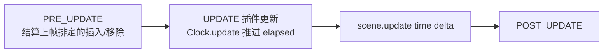

import { Canvas, Controls, Meta } from '@storybook/addon-docs/blocks';
import * as Timers from './timers.stories';

<Meta of={Timers} name="Docs" />

# 时钟与计时器

计时器(Timer Event)解决"让逻辑在 N 毫秒后执行一次,或按固定间隔反复执行"。每个场景有一个 Clock(`this.time`),它持有该场景的**游戏时间** `now` 与一组 TimerEvent。关键模型:TimerEvent 不是"定在某个墙钟时刻的闹钟",而是每帧把「平滑后的 delta × `Clock.timeScale` × 事件自身 `timeScale`」累计进 `elapsed`,`elapsed` 到达 `delay` 就触发回调。因此**暂停、后台、切场景期间时间根本不流逝,恢复后从冻结处继续、不跳跃也不补发**——这与用 `Date.now` 差值自己算时间的表现完全不同。本课主线:①游戏时间从哪来(`Clock`、`update(time, delta)`、`time.now` 与 `Date.now` 的取舍);②创建与配置(`delayedCall` / `addEvent`,`delay` / `repeat` / `loop` / `startAt` / `timeScale` / `paused`、`callbackScope` / `args`);③控制与读数(切 `paused` 属性、`remove` / `reset`、读数方法、Clock 批量清理与场景级暂停)。属性随时间的插值属于 [2.3.2 补间](?path=/docs/tweens--docs)(自带 `duration`,不用 TimerEvent);帧序列的帧间隔属于 [2.3.1 帧动画](?path=/docs/frame-animations--docs);本课只管"定时执行逻辑"。

`TimerEventConfig` 各项默认值(经 phaser@4.2.1 源码核实):

| 配置 | 默认值 | 回查要点 |
| --- | --- | --- |
| `delay` | `0` | 每轮触发间隔 ms;**没有独立的 loopDelay / repeatDelay**,每轮都是它 |
| `repeat` | `0` | 额外重复次数,共触发 `repeat + 1` 次;`-1` 无限 |
| `loop` | `false` | 无限循环,等价 `repeat: -1` |
| `callback` | 必填 | 触发时调用 |
| `callbackScope` | TimerEvent 自身 | 回调里的 `this` 默认**不是场景** |
| `args` | `[]` | 传给 `callback` 的参数数组 |
| `timeScale` | `1` | 事件级时间缩放,与 `Clock.timeScale` **相乘**生效 |
| `startAt` | `0` | 预置 `elapsed`,让首轮提前触发,不影响后续轮次 |
| `paused` | `false` | `true` 创建即冻结;Phaser 4 无 `pause()` / `resume()` 方法,切属性 |

## 快速上手

三个最小闭环:一次、定次、无限。

```ts
class Demo extends Phaser.Scene {
  create() {
    // 1 秒后执行一次(delayedCall 是一次性的)
    this.time.delayedCall(1000, () => this.spawnEnemy());

    // 每 500ms 执行一次,共 5 次:首次 + repeat 4 次重复
    this.time.addEvent({
      delay: 500,
      callback: () => this.spawnBullet(),
      repeat: 4,
    });

    // 无限循环,直到场景关闭或手动移除
    this.time.addEvent({
      delay: 2500,
      callback: () => this.spawnPowerUp(),
      loop: true,
    });
  }
}
```

两条使用常识:回调用箭头函数捕获 `this`,或传 `callbackScope: this`,否则回调里的 `this` 是 TimerEvent 而非场景;计时器随场景 shutdown 自动全部清理,但**跨场景持有的引用、运行中"重启"的计时器必须自己先移除**(见「常见问题」的叠加陷阱)。

## 游戏时间:Clock 与 update

`this.time` 是场景插件 Clock,除管理计时器外还提供两个时间读数:`now`(当前帧的游戏时间,来自主循环 rAF 高精度时间戳)与 `startTime`(场景本次启动时的游戏时间,`now - startTime` 即场景已运行的游戏毫秒数)。Clock 的 `update(time, delta)` 挂在场景 UPDATE 事件上,每帧先执行 `now = time`,再把事件往前推;场景每帧的实际执行顺序是:



所以在场景的 `update(time, delta)` 里,`time` 与 `this.time.now` 完全相等,`delta` 就是 Clock 用来累计的帧间隔。`delta` 由主循环 TimeStep 做**平滑与封顶**(默认 `minFps` 5,即单帧最多计入约 200ms),因此一次卡顿不会让计时器瞬间追出一大截。

**delta 累计制是全课最重要的判断。**`Clock.update` 对每个活跃事件执行 `elapsed += delta × timeScale × event.timeScale`,`elapsed >= delay` 时触发。没有帧就没有累计——暂停的真正含义是"这段时间不存在",而不是"这段时间过去了但没触发"。两类时间的取舍:

- **`this.time.now`(游戏时间):**与 delta 同源,随场景/游戏暂停冻结,恢复后连续。游戏内一切计时(技能冷却、buff 到期、出生保护)都用它。
- **`Date.now()`(墙钟):**后台标签页、暂停期间照走。只用于真实日历、防作弊校验、服务器对时,绝不与 `elapsed` / `time.now` 混算——暂停恢复后差值会"虚大",是计时逻辑瞬间跳变的常见根因。

## 创建计时器

创建计时器只有两个入口,`delayedCall` 是 `addEvent` 的一次性快捷方式;配置项的语义、重复结构与读数控制都在下面两小节展开。

### delayedCall 与 addEvent

```ts
// 一次性:delayedCall(delay, callback, args?, callbackScope?) 内部就是 addEvent
const timer = this.time.delayedCall(1000, (kind: string) => {
  this.spawn(kind);
}, ['boss'], this);

// 完整配置走 addEvent,返回 TimerEvent 实例供后续控制
const spawner = this.time.addEvent({
  delay: 800,
  callback: this.spawnBullet,       // 方法引用也可以
  callbackScope: this,              // 但必须显式给 scope,否则 this 不是场景
  args: [{ speed: 300 }],
  repeat: 2,
});
```

四个使用边界:

- **`callbackScope` 默认是 TimerEvent 自身**,这是最高频的坑:回调用方法引用时 `this` 不是场景。要么箭头函数捕获,要么显式传 `callbackScope: this`;`args` 数组作为普通参数传给回调。
- **`addEvent` 也接受 TimerEvent 实例**用于复用:会重置 `elapsed = startAt`、`hasDispatched = false` 并重算 `repeatCount`,且先把它从 Clock 移除再重新插入。已进入完成状态的实例不可复用;实例若还被**另一个场景的 Clock** 使用,会被两边同时推进(类型注释明确警告)。
- **`delay <= 0` 且会重复(`loop` 或 `repeat > 0`)会在构造时抛错** `'TimerEvent infinite loop created via zero delay'`;一次性的 `delayedCall(0, fn)` 合法,下一帧即触发。
- **新事件当帧只进入待插入列表**,下一帧 PRE_UPDATE 才真正开始计时,创建当帧不计时。

### repeat、loop 与 startAt

**触发次数语义:`repeat: n` 是"额外重复 n 次",总共触发 `n + 1` 次。**内部用 `repeatCount` 从 `n` 倒数到 0;`loop: true` 与 `repeat: -1` 完全等价,都是把 `repeatCount` 置为 `999999999999`(读数里可直接看到这个巨大整数)。TimerEvent **没有 `loopDelay` / `repeatDelay`**——不像[补间](?path=/docs/tweens--docs)可以给循环间隔单独设值,计时器每轮间隔永远是 `delay`;要"每轮间隔不同"只能在回调里重新 `delayedCall` 下一轮(注意先移除旧事件,见叠加陷阱)。

`startAt` 预置 `elapsed`:让长间隔循环的**首轮提前触发**,后续轮次仍按完整 `delay` 间隔。经典用法:"每 10 秒掉落补给"用 `startAt: 9500` 让玩家 500ms 内就见到第一次掉落。事件级 `timeScale` 只缩放这一个事件的流逝速度(与 Clock 的缩放相乘),`paused: true` 则以冻结状态创建。

触发后的收尾:最后一次触发当帧事件被排入移除列表,**下一帧 PRE_UPDATE 时销毁**(清空 callback / scope / args),数值属性仍可读。还有一条补发规则:某帧 delta 特别大(卡顿后,封顶约 200ms)且余量覆盖多个 `delay` 时,重复事件会在**同一帧内 while 循环连续补发**;一次性事件无论如何最多触发一次。

下面是配置实验台:进度条按 `elapsed / delay` 展示当前轮,圆点表示"已触发 / 预计触发",任一 Controls 参数变化都会**先 `removeEvent` 旧事件再按新参数重建**。

<Canvas of={Timers.TimerLab} />
<Controls of={Timers.TimerLab} />

| 读者操作 | 可观察证据 |
| --- | --- |
| 初始加载(delay 1000、repeat 0) | 进度条 1 秒走满,圆点点亮 1 枚,`getRemaining` 递减到 0 后读数冻结(事件已移除销毁) |
| 「重复次数」设 3 | 出现 4 枚圆点,每秒点亮 1 枚;`getRepeatCount` 从 3 递减到 0;`getOverallProgress` 把 4 轮计入全程 |
| 「重复次数」设 -1 | `getRepeatCount` 显示 `999999999999`,进度条每轮走满即回卷,永不停止 |
| 打开「无限循环」 | 与 repeat -1 表现一致(loop 与 repeat: -1 等价) |
| 「间隔」调到 2000 | 进度条变慢一倍,`getRemaining` 上限随之翻倍 |
| 「预置 elapsed」设 750 | 进度条出生即 75%,约 250ms 后就触发首轮;后续轮次仍是完整间隔 |
| 「事件时间缩放」设 3 | 进度条 3 倍速,约 333ms 触发一轮;`getRemaining` 按缩放后的速度递减 |
| 打开「暂停创建」 | 进度条冻在 `startAt` 位置,`事件 paused` 读数为 true;关闭后重建恢复 |
| 打开 Show code | 看到该 Canvas 实际执行的 `timer-lab.ts` 全文 |

实例滚出视口或页面切到后台时会整体休眠以省资源,回到视口自动恢复;休眠期间计时器不流逝,恢复后从冻结处继续。

## 控制与读数

计时器的控制分两层:TimerEvent 实例自身(paused、remove、reset、读数)与 Clock(`removeEvent` / `removeAllEvents` / `timeScale` / `paused` / 场景暂停)。

### TimerEvent:暂停、remove 与 reset

| 需求 | 入口 | 行为与边界 |
| --- | --- | --- |
| 暂停 / 恢复单个事件 | `timer.paused = true / false` | Phaser 4 **没有** `pause()` / `resume()` 方法,`elapsed` 冻结、恢复后继续 |
| 取消(静默) | `timer.remove()` | 立即 `elapsed = delay`、`repeatCount = 0`,下一帧移除并销毁,不再触发 |
| 提前触发并结束 | `timer.remove(true)` | 下一帧先补发一次回调再移除;"立刻执行剩余的那一次"用它 |
| 重置复用 | `timer.reset(config)` | 完整重建状态:`elapsed = startAt`、`repeatCount` 重算;**`callback` 必须重新传**,否则触发时无事发生 |
| 手动销毁 | `timer.destroy()` | **只清 callback / scope / args,不移除也不停止**——循环事件会空转占位直到场景 shutdown;停止别用它 |

读数方法(属性 `elapsed` / `repeatCount` / `hasDispatched` 同样公开):

| 读数 | 含义 |
| --- | --- |
| `getElapsed()` / `getElapsedSeconds()` | 当前轮累计 ms(含 `startAt` 预置) |
| `getProgress()` | 当前轮进度 `elapsed / delay` |
| `getOverallProgress()` | 全程进度;**仅 `repeat > 0` 时计入重复**,`loop` 退化为当前轮 |
| `getRemaining()` | 距下次触发 `delay - elapsed` |
| `getOverallRemaining()` | 距最后一次触发 `delay × (1 + repeatCount) - elapsed` |
| `getRepeatCount()` | 剩余重复次数;`loop` / `repeat: -1` 时是 `999999999999` |

`hasDispatched` 的语义:触发前先置 `true` 再执行回调,若还会重复则**立即复位 `false`**——它防的是同帧重复派发,也是移除判断的一环(实际条件:elapsed 到点、`repeatCount` 为 0 且 `hasDispatched` 为 true 才排入移除)。

下面是控制台范例:**双场景结构**——目标场景持有 `delay 1000、repeat 3` 的计时器,控制台场景常驻运行提供按钮与读数。这样目标场景被暂停时,按钮和 readout 仍在工作,两个场景的"游戏时长"读数并排就是场景级暂停的直接证据。

<Canvas of={Timers.TimerConsole} />
<Controls of={Timers.TimerConsole} />

| 读者操作 | 可观察证据 |
| --- | --- |
| 初始加载 | 每秒触发一次,4 枚圆点逐个点亮,`repeatCount` 从 3 递减 |
| 点「暂停/恢复事件」 | `事件 paused` 翻转,`elapsed` 冻结 / 继续;目标场景游戏时长不受影响 |
| 点「remove()」 | `progress` 立即跳到 100%、`距下次` 变 0,读数随即冻结——移除下一帧生效,不补发 |
| 点「remove(true)」 | 已触发次数先 +1(补发一次)再冻结移除 |
| 点「reset()」 | `elapsed` 回 0、`repeatCount` 回 3 重新倒数;已触发次数**不回零**——reset 只重置事件,业务计数要自理 |
| 点「叠加新建(陷阱)」 | 不清旧事件直接再建一个:触发频率翻倍,已触发次数每秒 +2,4 枚圆点很快不够点 |
| 点「新建(清理)」 | 先 `removeEvent` 再建,回到每秒 1 次、计数归零 |
| 点「removeAllEvents」 | 全部事件排入下一帧移除,一切读数冻结;再点「新建(清理)」恢复 |
| 「Clock 时间缩放」设 0 | 事件冻结,但**目标场景游戏时长继续增长**——`timeScale` 冻结的是事件,不是 `now` |
| 「Clock 时间缩放」设 2 | 触发频率翻倍(与事件级 timeScale 相乘的基数) |
| 点「场景暂停」 | 目标场景游戏时长与 `elapsed` **一起冻结**(update 停走),控制台场景游戏时长照常增长;再点「场景恢复」从冻结处继续,不跳跃 |
| 打开 Show code | 看到该 Canvas 实际执行的 `timer-console.ts` 全文 |

### Clock:批量清理与场景暂停

Clock 侧的清理入口有三个,生效时机不同:

- **`removeEvent(event | events[])`:立即**从活跃、待插入、待移除三个内部列表移除,事件可复用。重建前清理、"现在就要它消失"用它。
- **`removeAllEvents()`:下一帧生效**,把全部活跃事件排入移除(注意没有 `clearAllEvents` 这个名字)。场景收尾、重开一局时批量清场。
- **`clearPendingEvents()`:只清"本帧刚 `addEvent`、还没插入"**的待插入列表,用来撤销同帧的误创建。

Clock 自身还有两个开关:`paused = true` 冻结全部事件但场景照常更新(`now` 继续走);`timeScale` 缩放全部事件(0 等价冻结事件)。**场景级的 `pause()` / `sleep()` 是更强的冻结**:场景不再被主循环 step,`Clock.update` 根本不执行,`now` 与所有 `elapsed` 一起冻结;`resume()` / `wake()` 后从冻结处继续。`pause` 停 update 但仍渲染,`sleep` 两者都停。场景 shutdown / destroy 时 Clock 销毁其全部事件。

各层冻结手段对照(phaser@4.2.1 源码核实):

| 手段 | 作用范围 | 事件 elapsed | Clock.now | 边界 |
| --- | --- | --- | --- | --- |
| `event.paused` | 单个事件 | 冻结 | 继续 | 无方法,切属性 |
| `clock.paused` | 该 Clock 全部事件 | 冻结 | 继续 | 场景照常渲染更新 |
| `clock.timeScale = 0` | 该 Clock 全部事件 | 冻结 | 继续 | 可非整数慢放 / 加速 |
| `scene.pause()` | 整个场景 | 冻结 | **冻结** | 仍渲染,update 停走 |
| `scene.sleep()` | 整个场景 | 冻结 | **冻结** | 渲染也停,wake 恢复 |
| 页面后台 / `loop.sleep()` | 全游戏 | 冻结 | 冻结 | rAF 停止,无帧无累计 |

上表也解释了 `Clock.paused` 与场景暂停的分工:前者是"游戏继续跑、时间对计时器停摆"(比如 UI 动着但关卡计时冻结),后者是"这个场景连同它的一切都停"。每帧只结算一次的 delta 累计制保证任何一层恢复后都不跳变。

## 最佳实践

- **按需求选机制,不要都用计时器。**一次性延迟、固定间隔反复执行用本课的 Timer Event;随时间插值属性用[补间](?path=/docs/tweens--docs)(自带 `duration` / `repeat`,不需要也不创建 TimerEvent);帧序列播放的帧间隔属于[帧动画](?path=/docs/frame-animations--docs);多事件按时间轴编排(几秒后 A、再几秒后 B)用 `this.add.timeline`。游戏整体帧率目标是 `fps` 配置与 `game.loop` 的事(`targetFps` 默认 60),与计时器精度无关。
- **暂停选最小够用的层。**只停一个计时器切 `event.paused`;关卡整体冻结(连 `now` 都不走)用 `scene.pause()`;慢放 / 加速用 `clock.timeScale`,单个事件不同速率用事件级 `timeScale`。跨层叠加按乘法生效。
- **重启循环计时器必须"先移除再新建"。**保存 TimerEvent 引用,重启前 `removeEvent`(立即生效)或 `remove()`(下一帧);直接 `addEvent` 新的会与旧的并行,触发频率翻倍且旧事件泄漏。
- **游戏内时间戳一律 `time.now`。**冷却、buff、限时挑战与 `elapsed` 同源,暂停语义一致;`Date.now` 只服务真实世界时间,两套时间绝不混算。

## 常见问题

- **回调里 `this` 不是场景,访问 `this.add` 报 undefined。**
  `callbackScope` 默认是 TimerEvent 自身。回调用箭头函数捕获外层 `this`,或传方法引用并显式给 `callbackScope: this`。
- **"重启"循环计时器后触发频率翻倍。**
  旧事件没被移除,新旧两个循环并行。重启前先 `this.time.removeEvent(oldTimer)`(立即生效)再 `addEvent`;只调 `oldTimer.remove()` 的话要记得它下一帧才真正移除。本课控制台的「叠加新建(陷阱)」按钮就是这个故障的现场复现。
- **`remove()` 之后 readout 显示进度 100%、剩余 0,像是又触发了一次。**
  `remove()` 会立即把 `elapsed` 顶到 `delay`,这是移除路径的实现细节;下一帧才真正移除且不再派发。要"把剩下的那次立刻执行掉"用 `remove(true)`,它会先补发一次回调。
- **手动调用 `timer.destroy()` 后计时器没停。**
  `destroy()` 只清空 callback / scope / args,不移除事件也不停止更新——循环事件会带着巨大 `repeatCount` 一直空转。停止用 `remove()` 或 `removeEvent()`;`destroy()` 留给 Clock 在场景关闭时自动调用。
- **暂停恢复后计时器"少算时间"或自己写的倒计时"瞬间跳变"。**
  Timer Event 是 delta 累计制,暂停期不流逝是设计行为,恢复后从冻结处继续。瞬间跳变几乎都是混用了 `Date.now()` 差值——墙钟在暂停期间照走。统一改用 `time.now` / `elapsed`。
- **`delay: 0` 加 `loop: true` 直接抛错。**
  `'TimerEvent infinite loop created via zero delay'`:零延迟无限事件会在单帧内死循环,构造时就拒绝。一次性 `delayedCall(0, fn)` 不受影响。
- **`getOverallProgress()` 在循环事件上永远到不了 100%。**
  源码只在 `repeat > 0` 时把重复计入全程;`loop` / `repeat: -1` 退化为当前轮进度。循环事件做进度条请自己用 `(now - startTime) % delay` 之类的业务口径。
- **长卡顿后重复计时器一帧内连发多次。**
  单帧余量覆盖多个 `delay` 时 Clock 会在该帧 while 循环补发(delta 有约 200ms 封顶,不会无限)。介意连发就在回调里按 `time.now` 去抖,或把 `delay` 设得大于可能的卡顿。

## 总结回顾

摘要:

计时器由场景 Clock(`this.time`)管理:`delayedCall(delay, callback, args?, callbackScope?)` 是一次性快捷方式,`addEvent(config)` 支持完整配置——`delay` 每轮间隔(无独立 loopDelay)、`repeat` 额外次数(共 `repeat + 1` 次,`-1` 与 `loop: true` 等价为巨大 `repeatCount`)、`startAt` 预置 elapsed 让首轮提前、`timeScale` 事件级缩放与 Clock 相乘、`paused` 冻结创建;`callbackScope` 默认 TimerEvent 自身,回调要注意 `this`。时间模型是 delta 累计制:每帧 `elapsed += delta × clock.timeScale × event.timeScale`,到 `delay` 触发;场景 `update(time, delta)` 的 `time` 即 `this.time.now`,`delta` 平滑封顶(约 200ms),暂停 / 后台期间不累计、恢复不跳变,与 `Date.now` 墙钟严格区分。控制上,暂停切 `paused` 属性(Phaser 4 无 pause / resume 方法),`remove()` 静默取消、`remove(true)` 补发一次后结束、`reset(config)` 重置复用(callback 需重传),`destroy()` 只清引用不停止;读数用 `getElapsed` / `getProgress` / `getOverallProgress` / `getRemaining` / `getRepeatCount`。Clock 侧 `removeEvent` 立即移除、`removeAllEvents` 下一帧批量清场、`clearPendingEvents` 撤销同帧创建;`clock.paused` / `timeScale` 冻结或缩放事件而 `now` 照走,场景 `pause()` / `sleep()` 连 `now` 一起冻结(shutdown 自动清全部)。重启循环计时器必须先移除旧的再新建,否则叠加翻倍。

一句话:

> Timer Event 的 `elapsed` 是每帧 delta 的累计,而不是某个墙钟时刻——所以暂停时时间不存在,恢复后从冻结处继续。

知识要点:

- `delayedCall` 与 `addEvent` 的关系是什么?`callbackScope` 默认是谁,怎么避免回调里 `this` 失效?
- `repeat: n` 总共触发几次?`loop: true` 与 `repeat: -1` 在内部读数上等价于什么?
- `startAt` 影响哪一轮、不影响哪些轮?事件级与 Clock 级 `timeScale` 如何合成?
- 为什么计时器暂停恢复后不跳变、不补发?`update(time, delta)` 的两个参数与 `this.time` 的关系是什么?
- `time.now` 与 `Date.now` 各自适用什么场景?混用会发生什么?
- `remove()`、`remove(true)`、`reset()`、`destroy()` 分别做什么、各在什么时机生效?手动停止为什么不该用 `destroy()`?
- `removeEvent` / `removeAllEvents` / `clearPendingEvents` 三者的生效时机差别是什么?
- `clock.paused`、`clock.timeScale = 0`、`scene.pause()`、页面后台四种冻结在 `elapsed` 与 `now` 上各是什么表现?

## 参考资料

- [Phaser 官方文档](https://docs.phaser.io/):`Phaser.Time.Clock`、`Phaser.Time.TimerEvent` 与 `Phaser.Types.Time.TimerEventConfig` 的 API 核对。
- [官方示例库](https://phaser.io/examples/):Time 类目下计时器创建、重复与移除的可运行示例。
- [Phaser 4 Labs 示例浏览器](https://labs.phaser.io/phaser4-index.html):Phaser 4 专用示例,按主题检索 Clock 与 Timer Event 用法。
- [phaserjs/phaser 仓库](https://github.com/phaserjs/phaser):`src/time/Clock.js` 与 `src/time/TimerEvent.js` 源码,本文默认值、触发 / 移除 / 补发与多层冻结行为以 phaser@4.2.1 源码核实。
