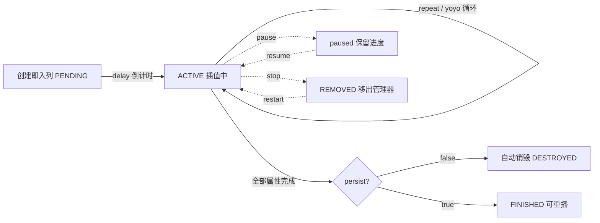

import { Canvas, Controls, Meta } from '@storybook/addon-docs/blocks';
import * as Tweens from './tweens.stories';

<Meta of={Tweens} name="Docs" />

# 补间

补间(tween)是 Phaser 对任意对象的数值属性做插值动画的统一机制:给一组 `targets` 和属性终点,TweenManager 每帧按 `duration` 与缓动曲线把属性从当前值逐步改写到目标值——`x`、`alpha`、`scale` 这类显示属性与普通 JS 对象上的数字字段同样可用。本课主线:① 配置怎么写(`tweens.add` 的属性终点多种写法);② 时间结构怎么拼(`duration` / `delay` / `repeat` / `yoyo` / `hold` / `repeatDelay` 组成的时间线,`repeat` 与 `loop` 的差别);③ 怎么控制播放与生命周期(fire-and-forget、`persist`、`pause` / `stop` / `seek`);④ 事件回调的时机与两套签名;⑤ 链式与并发(`chain`、`stagger`、多属性多目标);⑥ 全局 TweenManager 的查询、清理与时间缩放。帧序列动画属于 [2.3.1 帧动画](?path=/docs/frame-animations--docs);缓动曲线的形状与选型属于 [2.3.3 缓动](?path=/docs/easing--docs),本课 `ease` 只作参数名使用;定时执行逻辑属于 [2.3.4 时钟与计时器](?path=/docs/timers--docs)。

补间配置的默认值(以下经 phaser@4.2.1 类型与源码核实):

| 配置 | 默认值 | 回查要点 |
| --- | --- | --- |
| `targets` | 必填 | 对象或对象数组;下划线开头的属性不会被补间改写 |
| `duration` | `1000` | 单程播放毫秒数;不含 delay / repeat / hold 等等待 |
| `delay` | `0` | 启动前等待;多目标错开用 `this.tweens.stagger()` |
| `ease` | `'Power0'` | 即 Linear;曲线族与选型见 2.3.3 |
| `repeat` | `0` | 属性级重复次数,`-1` 无限(`isInfinite = true`) |
| `repeatDelay` | `0` | 两次 repeat 之间的等待 |
| `yoyo` | `false` | 到终点后按同 duration 折返(去程 + 回程) |
| `hold` | `0` | 到达终点后、yoyo / repeat 切换前的停留 |
| `loop` / `loopDelay` / `completeDelay` | `0` | 整个 tween 级循环次数、循环间等待、完成前等待 |
| `flipX` / `flipY` | `false` | 在 yoyo / repeat 换向时翻转目标(目标需支持该属性) |
| `paused` | `false` | `true` 创建即暂停,用 `play()` 启动 |
| `persist` | `false` | `false` 播完即自动销毁(fire-and-forget);`true` 保留待重播 |

## 快速上手

最小闭环:一个对象 + 一个配置对象,补间立即开始播放。

```ts
class Demo extends Phaser.Scene {
  create() {
    const ball = this.add.image(80, 200, 'ball'); // 纹理来源见 2.1.1;本课范例用 Graphics 程序生成

    this.tweens.add({
      targets: ball,
      x: 640,                    // 属性名: 终点值;起点取补间创建时的当前值
      alpha: 0.2,                // 多属性同时插值,默认共享同一组时间参数
      duration: 1000,
      delay: 200,                // 200ms 后才开始
      ease: 'Sine.easeInOut',    // 曲线选型见 2.3.3;默认 'Power0' 等于 Linear
      yoyo: true,                // 到终点后按同 duration 折返
      repeat: -1,                // 无限往返,永不触发 onComplete
    });
  }
}
```

**Phaser 4 写法提醒:`tweens.add` 只接受单个配置对象。**Phaser 3.x 教程里常见的双参写法 `tweens.add(targets, props)` 已移除;`this.add.tween(config)` 与 `this.tweens.add(config)` 等价,可任选。补间播完会自动销毁(fire-and-forget),要重播需 `persist: true` 或重新创建,细节见「播放控制与生命周期」。

## 创建补间

`this.tweens.add(config)`(或工厂快捷方式 `this.add.tween(config)`)传入一个配置对象,非保留字的键就是**要插值的属性**,值给**终点**;起点取创建那一刻属性的真实值。想延迟创建而不播放,用 `this.tweens.create(config)` 拿到未入列的 tween,之后 `this.tweens.existing(tween)` 入列播放(这也让 `onActive` 事件可被提前监听)。

属性终点的写法决定插值行为:

| 写法 | 含义 | 示例 |
| --- | --- | --- |
| 数字 | 插值到绝对值 | `x: 600` |
| `'+='` / `'-='` / `'*='` / `'/='` | 相对当前值的增量 | `x: '+=120'` |
| 数组 | 每次启动从数组中均匀随机取一个值;配合 `interpolation` 则按数组插值 | `x: [100, 400, 700]` |
| 函数 | 每次启动/重播调用求值 | `x: () => 100 + Math.random() * 500` |
| 对象 `{ value, ... }` | 终点 + 该属性专属时间参数,覆盖顶层设置 | `alpha: { value: 0, duration: 300, delay: 200 }` |

三个常用技巧:

- **多目标:**`targets` 传数组,一条配置同时插值所有对象;`delay: this.tweens.stagger(150)` 让各目标的 delay 依次错开 150ms(波浪、逐个入场)。
- **`scale` 捷径:**目标没有原生 `scale` 属性时,构建器自动拆成 `scaleX` + `scaleY` 两条属性补间,无需手写两行。
- **每属性独立时间线:**同一 tween 里不同属性可以有各自的 `duration` / `delay` / `repeat` / `ease`(写成对象形式),tween 的总时长取最长的属性;也可以干脆分成多个 tween 并发(见「链式与并发」)。

两条硬边界:属性必须是对象上**可写的数字**,`tween` 只做赋值不改方法;**下划线开头的属性被忽略**,想暴露私有状态请换名字。补间状态推进的完整生命周期如下:



## 时间结构:duration、repeat 与 yoyo

补间的时间线由两类参数拼出。**属性级**参数决定单个属性怎么播:`duration` 单程时长 → 到终点后 `hold` 停留 → `yoyo: true` 再用同一个 `duration` 折返 → `repeat` 把这整段再播 N 次,两次之间隔 `repeatDelay`。**tween 级**参数作用于整体:`loop` 让**全部属性**完整重播(触发 `onLoop` 而非 `onRepeat`),`loopDelay` 是循环间隔,`completeDelay` 是完成后派发 `onComplete` 前的等待;`delay` 只在启动前等待一次,不计入播放时长。

`repeat` 与 `loop` 的关键差别:`repeat` 是属性设置,每条属性补间各自计数,`onRepeat` 按目标×属性触发;`loop` 作用于整个 tween,所有属性都完成后才算一轮,`onLoop` 每轮触发一次。`repeat: -1` 时 `isInfinite` 为 `true`,tween 永不完成、`onComplete` 永不触发,除非调用 `stop()` / `complete()`。

各时长读数的换算(单属性单目标,已按 4.2.1 源码核实):

- `tween.duration`:最长的属性段全程 = `delay + duration + hold +(yoyo ? duration : 0)+ repeat ×(repeatDelay + duration + hold +(yoyo ? duration : 0))`。
- `tween.totalDuration`:在 `duration` 基础上加 `completeDelay` 和 `loop ×(duration + loopDelay)`;`repeat: -1` 时是一个巨大整数。
- `tween.elapsed` / `totalElapsed`:本次播放 / 含循环的累计毫秒;`progress` / `totalProgress`:对应的 0–1 进度。

下面是时间结构实验台:小球沿轨道从左端插值到右端,任一 Controls 参数变化都会**立即销毁旧补间并按新参数重建**。readout 给出 `totalProgress` 百分比、`x` 当前值、`elapsed / totalDuration`、`isPlaying / isPaused` 与状态名(即 `States` 枚举名)。

<Canvas of={Tweens.TweenLab} />
<Controls of={Tweens.TweenLab} />

| 读者操作 | 可观察证据 |
| --- | --- |
| 初始加载(duration 1200) | 小球从起点出发,`elapsed` 增长到 1200 后停在终点,状态从 `ACTIVE` 经 `PENDING_REMOVE` 到 `DESTROYED`(补间销毁后 `x` 定格) |
| 调「时长」到 3000 | 重建后走完全程耗时明显变长,`totalDuration` 读数同步变为 3000 |
| 「延迟」设 1000 | 前 1000ms `totalProgress` 保持 0%,小球停在起点;`totalDuration` 不含 delay |
| 「重复」设 2 | 到终点后立刻再走两次,`totalDuration` 变为 3 × 1200 = 3600 |
| 「重复」设 -1 | `isInfinite` 为 `true`,`totalDuration` 变为巨大整数,小球永不停止 |
| 打开「往返」 | 每程结束按原时长折返,`totalDuration` 翻倍为 2400;只有 yoyo 无 repeat 时全程是「去 + 回」一次 |
| 设「停留」500 + 往返 | 小球在终点停 500ms 才折返,`totalDuration` 变为 1200 + 500 + 1200 = 2900 |
| 设「重复间隔」500 + 重复 1 | 终点停留 500ms 后重走,`totalDuration` = 1200 + (500 + 1200) = 2900 |
| 「缓动」切到 Sine.easeInOut | 小球起停更柔和,读数不变——ease 只改时间→进度的映射,不改时长 |
| 打开「暂停创建」 | 重建后小球不动,`isPaused` 为 `true`、状态 `PENDING`;关掉后恢复播放 |
| 打开 Show code | 看到该 Canvas 实际执行的 `tween-lab.ts` 全文 |

实例滚出视口或页面切到后台时会整体休眠以省资源,回到视口自动恢复;readout 冻结只说明循环暂停。

## 播放控制与生命周期

补间默认 fire-and-forget:播完即被 TweenManager 销毁,引用继续留着也只能读到销毁后的状态。要"播完还能重播",创建时给 `persist: true`,播完进入 `FINISHED` 而非销毁,`play()` / `restart()` 都能再次播放;但**持久补间必须自己 `destroy()`**,否则永远留在内存里。运行中的控制方法(均返回 tween 自身,可链式):

| 方法 | 行为 | 边界 |
| --- | --- | --- |
| `play()` | 启动「以暂停状态创建」的补间 | 已在播放时无效;播完的 persist 补间会从头再播 |
| `pause()` / `resume()` | 暂停 / 恢复,保留进度 | 直接切换 `paused` 布尔属性也可,但不触发 pause / resume 事件 |
| `stop()` | 立即停止并移出 TweenManager | 非持久补间随后销毁;持久补间可 `restart()` |
| `restart()` | 回到起点重播 | 已销毁的补间只在控制台警告,不恢复 |
| `seek(ms)` | 跳到全程第 ms 毫秒处(含 delay / repeat / loop) | 跳转会静默重放,不触发任何事件回调;不改变暂停状态 |
| `forward(ms)` / `rewind(ms)` | 相对前进 / 后退当前这一程 | 只在当前程内移动,停于边界 |
| `complete(delay?)` | 立即标记完成,进度直接置 100%,属性停在当前位置 | 无限循环的补间也能借此触发 `onComplete` |
| `completeAfterLoop(loops?)` | 当前循环结束后再完成 | 收无限循环的优雅收尾 |
| `remove()` / `destroy()` | 移出管理器 / 彻底销毁 | `remove` 不销毁对象;`destroy` 后永不可用 |

状态读数:`isPlaying()`(真在推进)、`isPaused()`(即 `paused` 属性)、`isActive()`(处于 `ACTIVE` 状态)、`state`(枚举值,用 `Phaser.Tweens.States[state]` 转成名字)、`hasStarted`(是否已真正开始插值)。另外 `setTimeScale(v)` 只缩放这一个补间的时间流速,与全局时间缩放相乘生效。

下面是播放控制台:一个单程 2400ms 的 yoyo 无限往返补间,点击画布内按钮即时控制,readout 同步 `isPlaying / isPaused`、状态名、`elapsed` 与各事件触发次数(用配置回调计数,可直观看到 `onRepeat` / `onYoyo` 的真实频率)。

<Canvas of={Tweens.PlaybackConsole} />
<Controls of={Tweens.PlaybackConsole} />

| 读者操作 | 可观察证据 |
| --- | --- |
| 初始加载 | 小球往返,`isPlaying` 为 `true`,`onUpdate` 计数每帧递增,`onYoyo` 每次折返 +1 |
| 点「暂停」再点「恢复」 | `isPaused` 翻转,`elapsed` 冻结 / 继续,`onPause` / `onResume` 各触发一次 |
| 点「跳到 50%」 | 小球瞬移到首程中点,`progress` 约 50%;seek 跳转不触发事件,各计数不动 |
| 点「完成」 | 补间在原地收尾:`totalProgress` 直接 100%,`onComplete` +1,小球停在当前位置;persist 关闭时随即销毁,再点其他按钮无响应 |
| 点「停止」 | 状态经 `PENDING_REMOVE` 收尾,persist 关闭时最终 `DESTROYED`,persist 开启时停在 `FINISHED` 且可「重播」 |
| 打开「persist 保留补间」 | 切换即重建;此后点「完成」状态停在 `FINISHED` 而非销毁,点「重播」从头再播 |
| 关闭「persist 保留补间」 | 切换即重建;此后点「完成」`onComplete` +1 但对象随即销毁,「重播」只在控制台警告 |
| 打开 Show code | 看到该 Canvas 实际执行的 `tween-controls.ts` 全文 |

## 事件与回调

接事件有两套入口,时机相同、参数顺序不同,这是补间最高频的坑:

- **配置回调**(`onStart` / `onComplete` / ... 直接写在配置里,或 `setCallback(type, fn)` 补设):tween 级回调收到 `(tween, targets[, 自定义参数])`;每属性回调收到 `(tween, target, key, current, previous[, 自定义参数])`——**target 在前,key 在后**。
- **事件监听**(`tween.on('start', fn)` 等 EventEmitter 用法):tween 级事件参数同为 `(tween, targets)`;但每属性事件 `'update'` / `'repeat'` / `'yoyo'` 的参数是 `(tween, key, target, current, previous)`——**key 在前,target 在后**,与配置回调相反(以 4.2.1 源码为准)。

| 事件名 / 回调名 | 触发时机 | 级别 |
| --- | --- | --- |
| `active` / `onActive` | 进入 TweenManager 变为 active(可能还在 delay 中) | tween 级 |
| `start` / `onStart` | delay / 暂停结束后真正开始插值,只发一次 | tween 级 |
| `update` / `onUpdate` | 每帧每属性都触发,高频 | 属性级 |
| `repeat` / `onRepeat` | 某条属性补间 repeat 重新开始时 | 属性级 |
| `yoyo` / `onYoyo` | 某条属性补间开始折返时(hold 结束后) | 属性级 |
| `loop` / `onLoop` | tween 整体重播一轮时(loopDelay 结束后) | tween 级 |
| `complete` / `onComplete` | 整个补间彻底完成(completeDelay 结束后);无限循环永不触发,除非 `stop()` / `complete()` | tween 级 |
| `stop` / `onStop` | 仅 `stop()` 触发,自然完成不触发 | tween 级 |
| `pause` / `resume`(`onPause` / `onResume`) | 仅 `pause()` / `resume()` 触发;直接切 `paused` 属性、或 TweenManager 的 `pauseAll` 都不触发 | tween 级 |

三个使用要点:**每属性回调按目标数 × 属性数触发**——10 个目标改 2 个属性,一次 yoyo 要触发 20 次 `onYoyo`,别在里面做重活。回调里再创建新补间是安全的,但销毁目标要小心(见下节)。**`seek()` 期间所有事件与回调都被抑制**,计数不会虚增。**Phaser 4 没有 `destroyed` 事件**,销毁时机要自己掌握(在 `complete` / `stop` 里做,或用 `persist` 延后)。上面控制台的 readout 就是用配置回调计数的实例:`onRepeat` 与 `onYoyo` 的次数直接暴露两者的级别差异。

```ts
this.tweens.add({
  targets: ball,
  x: 600,
  duration: 1000,
  // 配置回调: (tween, target, key, current, previous)
  onUpdate: (tween, target, key, current, previous) => {
    // previous → current 即本帧插值增量
  },
});

tween.on('update', (tween, key, target, current, previous) => {
  // 事件监听: key 在 target 前,顺序相反
});
```

## 链式与并发

**串行用 `chain`:**`this.tweens.chain({ targets, tweens: [configA, configB, ...] })` 创建 TweenChain,子补间按顺序播放,前一个完成自动进入下一个;顶层 `targets` 会作为默认目标传给未指定 targets 的子补间。chain 整体支持 `loop` / `loopDelay` / `completeDelay` / `persist`,全部子补间播完才触发 `onComplete`。Phaser 4 的 `Tween` 实例上**没有** `chain()` 方法,串行只有 chain 配置或 `onComplete` 手动衔接两条路。

**并发有三种形态,语义不同:**

- **一个 tween 多属性:**`{ x: 600, alpha: 0.2 }` 同起同止(默认共享时间参数),属性间用对象写法也能错峰。
- **多个 tween 同目标:**各自独立时间线,`x` 走 1 秒、`alpha` 走 3 秒互不干扰;读取时 `getTweensOf(target)` 返回数组。
- **一个 tween 多目标 + stagger:**一条配置驱动所有目标,`delay: this.tweens.stagger(150)` 依次错开启动,波浪 / 列队动画的标准做法。

下面范例左侧演示 chain 三步串行(右移 → 淡出 → 回位,循环),右侧演示 stagger 多目标错峰;「错开间隔」设为 0 时退化为同时启动。

<Canvas of={Tweens.ChainAndStagger} />
<Controls of={Tweens.ChainAndStagger} />

| 读者操作 | 可观察证据 |
| --- | --- |
| 初始加载 | 左侧小球严格按三步顺序动作,「当前子步」从 1 走到 3 后整体从头循环(`loop: -1`);第二步读数显示属性 `alpha`,证明各步可插值不同属性 |
| 观察「当前子步进度」 | 每个子步内 0–100% 走满才切下一步——chain 是串行,不是并发 |
| 调「错开间隔」到 200 | 右侧五枚圆点从上到下依次启动,间隔 200ms;设回 0 后五点同步 |
| 观察「同目标补间数」 | 左侧恒为 1(chain 是一条 TweenChain),右侧恒为 1(一条 tween 管五个目标) |
| 打开 Show code | 看到该 Canvas 实际执行的 `tween-chain.ts` 全文 |

```ts
// 串行:三步走完才 onComplete
this.tweens.chain({
  targets: ball,
  tweens: [
    { x: 600 },                       // 继承顶层 targets 与默认 duration
    { alpha: 0.2, duration: 400 },
    { x: 80, alpha: 1, duration: 800 },
  ],
  loop: -1,
});

// 并发:两条独立时间线
this.tweens.add({ targets: ball, x: 600, duration: 1000 });
this.tweens.add({ targets: ball, alpha: 0.3, duration: 3000 });

// 错峰:一条 tween 管多目标
this.tweens.add({
  targets: dots,
  y: 300,
  duration: 800,
  ease: 'Sine.easeInOut',
  delay: this.tweens.stagger(150),
  yoyo: true,
  repeat: -1,
});
```

## 数值补间:addCounter

没有目标对象、只想让一个数从 A 走到 B 时,用 `addCounter`:`from` / `to` 给起止值(默认 0 → 1),`getValue()` 读当前值,时间参数与普通补间一致。它常用来驱动进度条、得分滚动,或在 `onUpdate` 里把数值映射到多个不相关属性上。

```ts
const counter = this.tweens.addCounter({
  from: 0,
  to: 100,
  duration: 2000,
  onUpdate: (tween) => {
    const value = tween.getValue();          // 0 → 100 的当前值
    bar.width = 4 * value;                   // 手动写到任意目标
    label.setText(`${Math.floor(value)}%`);
  },
});
```

注意 `getValue()` 读的是数值补间的值;普通属性补间上调用它返回的是第一条 TweenData 的当前插值,不要依赖。补间自带 duration,不依赖也不创建 TimerEvent,两者的取舍见 [2.3.4 时钟与计时器](?path=/docs/timers--docs)。

## TweenManager:查询、清理与全局时间

`this.tweens` 是场景级 TweenManager,场景 shutdown / destroy 时会自动销毁其全部补间。常用全局操作:

| 需求 | 入口 |
| --- | --- |
| 某对象上有哪些补间 | `getTweensOf(target)`;只要"有没有在播"用 `isTweening(target)` |
| 全部补间 | `getTweens()`;逐个遍历 `each(fn)`;`has(tween)` 判断归属 |
| 停掉某对象全部补间 | `killTweensOf(target)`(切场景 / 换装前先做) |
| 停掉全部补间 | `killAll()`;`remove(tween)` 只移出不销毁 |
| 全局暂停 / 恢复 | `pauseAll()` / `resumeAll()` 或 `paused` 属性;期间新建的补间也暂停,不触发 pause 事件 |
| 全局时间缩放 | `timeScale` 属性,或 `setGlobalTimeScale(v)` / `getGlobalTimeScale()`(慢放、加速、`0` 冻结) |
| 单补间缩放 | `tween.setTimeScale(v)`,与全局相乘生效 |
| 帧率与卡顿平滑 | `setFps(fps)`、`setLagSmooth(limit, skip)`(默认 500ms / 33ms) |

**目标销毁的自动清理(phaser@4 行为):**GameObject `destroy()` 后 `isDestroyed` 为 `true`,TweenManager 下一帧检测到会让相关补间**提前完成**并走正常收尾(触发 `onComplete`),不会对着已销毁对象继续写属性。但精确控制清理时机(尤其无限补间、回调里有依赖逻辑时)仍建议显式:`target.destroy()` 之前先 `this.tweens.killTweensOf(target)`,让停止发生在你选定的那一帧。普通 JS 对象目标没有 `isDestroyed` 机制,清理由你全权负责。

## 最佳实践

- **默认 fire-and-forget,确需重播才 persist。**一次性动效用默认配置,播完自动回收;要在 UI 上反复触发的动效用 `persist: true` + `restart()`,并把 `destroy()` 收进对象生命周期,防泄漏。
- **按结构选组合,而不是堆参数。**同一属性往返用 `yoyo`,几组属性各自重复用属性级 `repeat`,整体重播用 `loop`,多阶段顺序动作用 `chain`——把逻辑放进错误层级(比如用 `repeat` 硬凑三段动作)会让 `onRepeat` / `onLoop` 计数与 `totalDuration` 全部失真。
- **无限循环的收尾走 `completeAfterLoop()`。**`repeat: -1` 的循环动效要退出时,`stop()` 立即掐断(属性停在半路),`completeAfterLoop()` 让当前程走完再自然完成,视觉不跳变。
- **需要中途改终点用 `updateTo()`。**目标位置动态变化(跟随、吸附)时,`updateTo(key, value)` 在播放中改终点且不重置进度;直接重建补间会从新起点重走,手感不同。
- **回调里做重活前先算触发次数。**每属性回调按目标 × 属性数 × 帧频触发;重逻辑放 tween 级回调,或干脆在场景 `update` 里读属性,别挂在 `onUpdate` 上。

## 常见问题

- **改了 Controls / 重建了补间,动画从头开始。**
  补间的起点在创建时锁定;参数变化等于新补间。要"从当前状态继续"应在重建前读出当前值作为起点,或对运行中的补间用 `updateTo()`。
- **`onComplete` 永远不触发。**
  `repeat: -1` 或 `loop: -1` 的补间永不完成;`completeDelay` 也会让事件晚发。确认 `isInfinite` 读数,需要收尾时调用 `complete()` 或 `completeAfterLoop()`。
- **`tween.play()` 没反应或报错。**
  三种情况:`play()` 只对"以暂停状态创建"的补间有意义,已在播放时调用无效;补间播完且未 `persist` 时已被销毁,任何方法都不再生效(控制台出现 `Cannot restart destroyed Tween` 警告);场景曾 shutdown,TweenManager 已清空。
- **事件监听器里 target 与 key 的值对不上。**
  `tween.on('update', ...)` 的参数顺序是 `(tween, key, target, ...)`,与配置回调 `(tween, target, key, ...)` 相反。两种入口别混用同一套参数签名。
- **暂停后恢复,动画跳了一大截。**
  直接切 `paused` 属性或被 `pauseAll()` 波及的补间不经过 `pause()` / `resume()`;恢复后按真实经过时间推进。确认没有别的代码在改 `timeScale`,并检查 `pauseAll` 的作用范围。
- **目标 destroy 后偶发报错或属性被改。**
  Phaser 4 下 GameObject 目标销毁后补间会在下一帧自动提前完成,但**销毁当帧**回调里仍可能引用目标:在 `destroy()` 前先 `killTweensOf(target)`,或在回调里判空。普通 JS 对象目标没有自动清理。

## 总结回顾

摘要:

补间用 `this.tweens.add(config)`(Phaser 4 只收单配置对象)对 targets 的可写数字属性做插值;终点支持绝对值、`'+='` 相对值、随机数组、函数与每属性对象覆盖,`scale` 自动拆两轴。时间线由属性级参数 `duration` / `hold` / `yoyo` / `repeat` / `repeatDelay` 与 tween 级 `delay` / `loop` / `loopDelay` / `completeDelay` 拼出,`repeat` 作用于属性、`loop` 作用于整体,`-1` 即无限(`isInfinite`),读数用 `elapsed` / `totalElapsed` / `progress` / `totalProgress` / `totalDuration`。补间 fire-and-forget,播完自动销毁,`persist: true` 保留待 `restart()` / `play()` 重播;运行控制有 `pause` / `resume` / `stop` / `seek` / `forward` / `rewind` / `complete` / `completeAfterLoop`,状态读 `isPlaying()` / `isPaused()` / `state`。事件两套入口时机相同:tween 级回调与事件均为 `(tween, targets)`,属性级 `'update'` / `'repeat'` / `'yoyo'` 配置回调为 `(tween, target, key, current, previous)` 而事件监听为 `(tween, key, target, ...)`,顺序相反;seek 期间事件被抑制,Phaser 4 无 `destroyed` 事件。串行用 `chain`,并发用一个 tween 多属性、多 tween 同目标或多目标 + `stagger` 错峰;无目标数值插值用 `addCounter` + `getValue()`。全局经 TweenManager 查询(`getTweensOf` / `isTweening`)、清理(`killTweensOf` / `killAll`)、暂停(`pauseAll` / `resumeAll`)与时间缩放(`timeScale`);场景关闭自动清全部补间,GameObject 目标销毁后补间在下一帧自动提前完成,精确清理仍应显式 `killTweensOf`。

一句话:

> 补间把"属性怎么随时间变"声明成一个配置对象:时间结构参数决定时间线,事件参数决定副作用,而 persist 与 TweenManager 决定它的生死。

知识要点:

- `tweens.add` 在 Phaser 4 接受什么形式?属性终点有哪五种写法,各自什么语义?
- `duration` / `delay` / `hold` / `repeat` / `repeatDelay` / `yoyo` 各自作用在哪一段?`repeat` 与 `loop` 的差别是什么?
- `repeat: -1` 时 `isInfinite` / `totalDuration` / `onComplete` 各是什么表现?
- 补间默认播完后的命运是什么?`persist: true` 改变了什么,要付出什么代价?
- `pause()` 与直接切 `paused` 属性的差别?`stop()` 之后还能 `restart()` 吗,分几种情况?
- 属性级事件在配置回调与事件监听里的参数顺序分别是什么?
- 串行动作用什么?三种并发行态各适合什么场景?stagger 解决什么问题?
- 目标 GameObject destroy 后,它的补间什么时候、以什么方式结束?为什么仍建议显式 killTweensOf?

## 参考资料

- [Phaser 官方文档](https://docs.phaser.io/):`Phaser.Tweens.TweenManager`、`Tween` / `BaseTween` / `TweenChain` / `TweenData` 与 `Types.Tweens.*` 配置类型的 API 核对。
- [官方示例库](https://phaser.io/examples/):Tweens 类目下属性插值、chain、stagger 与播放控制的可运行示例。
- [Phaser 4 Labs 示例浏览器](https://labs.phaser.io/phaser4-index.html):Phaser 4 专用示例,按主题检索补间用法。
- [phaserjs/phaser 仓库](https://github.com/phaserjs/phaser):`src/tweens/` 源码,本文事件参数顺序、`totalDuration` 计算与目标销毁清理行为以 phaser@4.2.1 源码核实。
