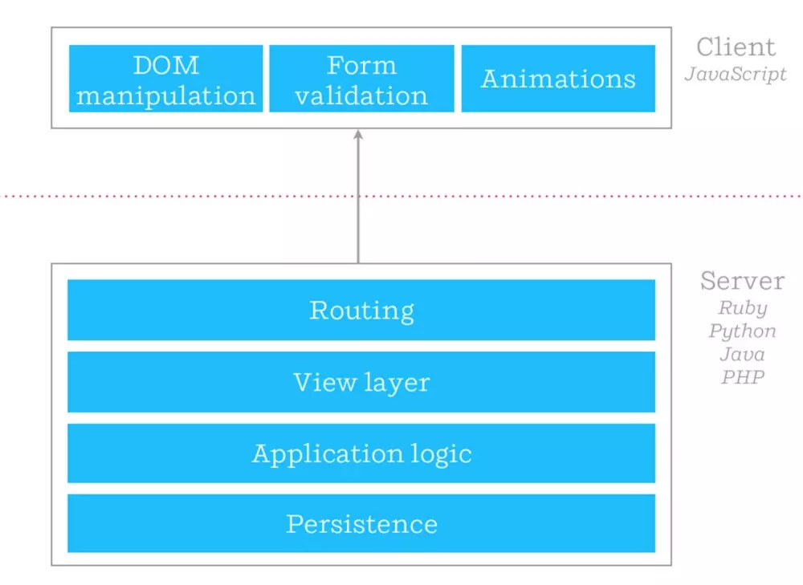
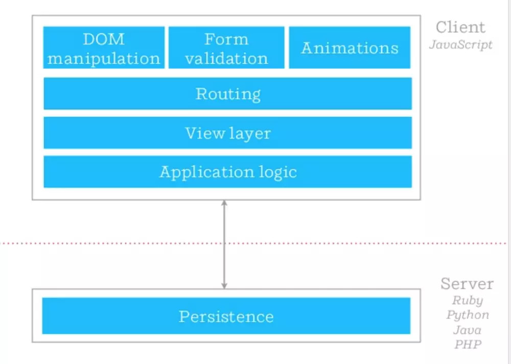
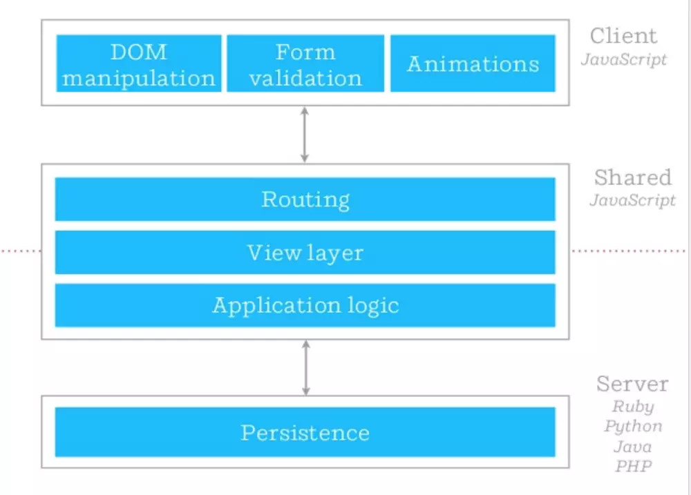
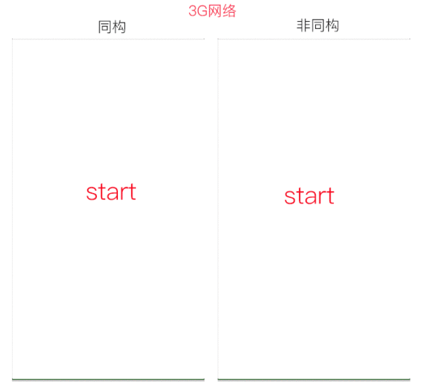
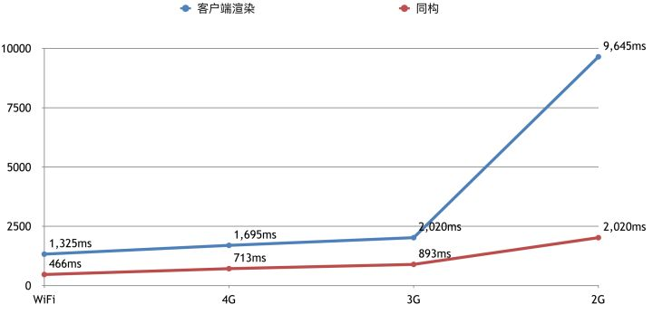

同构
---

## 是什么？

> 客户端渲染：页面在 JavaScript，CSS 等资源文件加载完毕后开始渲染，路由为客户端路由，也就是我们经常谈到的 SPA（Single Page Application）。
>
> 服务端渲染：页面由服务端直接返回给浏览器，路由为服务端路由，URL 的变更会刷新页面，原理与 ASP，PHP 等传统后端框架类似。
>
> 同构：英文表述为 Isomorphic 或 Universal，即编写的 JavaScript 代码可同时运行于浏览器及 Node.js 两套环境中，用服务端渲染来提升首屏的加载速度，首屏之后的路由由客户端控制，即在用户到达首屏后，整个应用仍是一个 SPA。

> 下面三张图摘自[同构(Isomorphic) web 是什么鬼？](https://www.jianshu.com/p/5ce23647e7e3)

参考文献：

- [What is an isomorphic application?](https://www.lullabot.com/articles/what-is-an-isomorphic-application)
- [同构(Isomorphic) web 是什么鬼？](https://www.jianshu.com/p/5ce23647e7e3)

## 为什么？

- SEO：服务端渲染对搜索引擎的爬取有着天然的优势；
- 性能：通过 Node 直出, 将传统的三次串行 HTTP 请求简化成一次 HTTP 请求，降低首屏渲染时间；
- 服务端和客户端维护一份代码就行了。

> 下两张图摘自 [D2 - 打造高可靠与高性能的React同构解决方案](https://zhuanlan.zhihu.com/p/32124393)

## 开源框架

- 脚手架

    - [razzle](https://github.com/jaredpalmer/razzle): Create server-rendered universal JavaScript applications with no configuration
    - [react-isomorphic-starterkit](https://github.com/RickWong/react-isomorphic-starterkit): Create an isomorphic React app in less than 5 minutes
    - [isomorphic-react-example](https://github.com/DavidWells/isomorphic-react-example): ReactJS + NodeJS ( express ) demo tutorial with video. Universal/Isomorphic JS = Shared JavaScript that runs on both the client & server.

- 集成方案

    - [next.js](https://github.com/zeit/next.js): The React Framework
    - [nuxt.js](https://github.com/topics/universal): The Vue.js Developers Framework
    - [React Server](https://github.com/redfin/react-server): Blazing fast page load and seamless navigation.
    - [reactGo](https://github.com/reactGo/reactGo): Your One-Stop solution for a full-stack universal Redux App!
    - [beidou](https://github.com/alibaba/beidou): Isomorphic framework for server-rendered React apps

## 存在问题

- 内存泄露

    - [Node应用内存泄漏分析方法论与实战](https://github.com/alibaba/beidou/blob/master/packages/beidou-docs/articles/node-memory-leak.md)

- 性能瓶颈

## 推荐书籍

- [《React 状态管理与同构实战》](https://book.douban.com/subject/30290509/)
- [《同构 JavaScript 应用开发》](http://www.ituring.com.cn/book/tupubarticle/18356)

## 参考文献

- http://isomorphic.net/
- [D2 - 打造高可靠与高性能的React同构解决方案](https://zhuanlan.zhihu.com/p/32124393)
- [安利一个React同构渲染脚手架 —— razzle](https://zhuanlan.zhihu.com/p/32241563)
- [服务端渲染与 Universal React App](https://zhuanlan.zhihu.com/p/30580569)
- [Webpack实战-构建同构应用](http://imweb.io/topic/5a39c971a192c3b460fce30d)
- [IMVC（同构 MVC）的前端实践 ](https://github.com/Lucifier129/Lucifier129.github.io/issues/14)
- [React同构直出优化总结](http://www.alloyteam.com/2016/06/react-isomorphic/)
- [同构 JavaScript 应用 —— Web 世界的未来？](https://zhuanlan.zhihu.com/p/19973091)
- [React+Redux 同构应用开发](http://www.aliued.com/?p=3077)
- [大哥哥们,能介绍下同构是什么嘛?](https://cnodejs.org/topic/563f57998e90ab7c391e9f70)
- [What is an isomorphic application?](https://www.lullabot.com/articles/what-is-an-isomorphic-application)
- [Here’s Why Client-side Rendering Won](https://medium.freecodecamp.org/heres-why-client-side-rendering-won-46a349fadb52)
- [The Pain and the Joy of creating isomorphic apps in ReactJS](https://reactjsnews.com/isomorphic-react-in-real-life)
- [React To The Future With Isomorphic Apps](https://www.smashingmagazine.com/2015/04/react-to-the-future-with-isomorphic-apps/)
- [Get an isomorphic web app up and running in 5 minutes](https://hackernoon.com/get-an-isomorphic-web-app-up-and-running-in-5-minutes-72da028c15dd)
- [Break Down Isomorphic and Universal Boilerplate: React-Redux server rendering](https://hackernoon.com/isomorphic-universal-boilerplate-react-redux-server-rendering-tutorial-example-webpack-compenent-6e22106ae285)
- [React Isomorphic/Universal App w/NodeJS, Redux, & React Router V4](https://codeburst.io/react-isomorphic-universal-app-w-nodejs-redux-react-router-v4-be80aa57dcaf)
- [深入淺出: Isomorphic 的核心架構: React-Redux Server Rendering](https://medium.com/@peterchang_82818/%E6%B7%B1%E5%85%A5%E6%B7%BA%E5%87%BA-isomorphic-%E7%9A%84%E6%A0%B8%E5%BF%83%E6%9E%B6%E6%A7%8B-react-redux-server-rendering-%E6%95%99%E5%AD%B8-%E7%AF%84%E4%BE%8B-1b37174e279d)
- [基于koa+fis3+swig前后端isomorphic同构实现](https://www.w3ctech.com/topic/1763)
- [React 同构实践与思考](http://www.codedata.cn/hacknews/14691734730407833)
- [React 中同构（SSR）原理脉络梳理](http://www.fly63.com/article/detial/1173)
- [再谈React同构应用：服务端下复用Redux Effects的实践](https://blog.chionlab.moe/2016/12/21/universal-react-app-reuse-effects-on-server-side/)
- https://www.processon.com/view/5715e6f1e4b0d89bd25ba93d
- [前后端同构之路 —— iconfont 架构变迁](https://blog.ymfe.org/Create-React-Universial-App/)
- [构建 React 同构应用及优化](http://www.infoq.com/cn/presentations/application-and-optimization-of-constructing-react-isomorphism)
- [前后端同构](http://fex.baidu.com/yog2/docs/advance/isomorphic.html)
- [揭秘React同构应用](https://yq.aliyun.com/articles/635123)
- [React 服务端渲染优化[react同构]](https://www.yaruyi.com/article/2017-12-07-jTAJ)
- [分享 (番外篇) 同构化的 React + Redux 服务端渲染](https://ruby-china.org/topics/29835)
- [教你如何搭建一个超完美的React.js服务端渲染开发环境](https://www.jianshu.com/p/0ecd727107bb)
- [Webpack实战-构建同构应用](http://imweb.io/topic/5a39c971a192c3b460fce30d)
- [同构并非想象中完美](https://www.css3.io/isomorphic-Is-not-perfect-as-you-think.html)
- [React 服务端渲染与同构](http://blog.pspgbhu.me/article/react-isomorphic/)
- [React 同构直出优化总结](https://cloud.tencent.com/developer/article/1005009)
- [Koa2 + React + Redux + antd 同构直出探索](http://coderlt.coding.me/2016/11/25/isomorphism-koa2-react-antd/)
- [React 同构实践与思考](https://segmentfault.com/a/1190000004671209)
- [React同构总结](https://segmentfault.com/a/1190000013609085)
- [Isomorphic Web Design with React and Scala](https://thebhwgroup.com/blog/isomorphic-web-design-react-scala)
- [App Isomorphic: la Single Page App parfaite ?](https://tech.m6web.fr/isomorphic-single-page-app-parfaite-react-flux/)
- https://react.rocks/tag/Isomorphic
- [Going Isomorphic with React](https://bensmithett.github.io/going-isomorphic-with-react/#/)
- [How to Load Your React Application Twice as Fast With Isomorphic Application](https://blog.theodo.fr/2017/02/how-to-load-your-react-applicatoin-twice-as-fast-with-isomorphic-application/)
- [How to Implement Node + React Isomorphic JavaScript & Why it Matters](https://developer.ibm.com/node/2015/06/10/node-js-react-isomorphic-javascript-why-it-matters/)
- [React for Beginners - Episode 2 - Creating isomorphic React+Redux App and deploying it on Heroku](https://blog.codingbox.io/react-for-beginners-creating-isomorphic-react-redux-app-and-deploying-it-on-heroku-6a313f8f3693)

---

- https://github.com/topics/isomorphic?o=desc&s=stars
- [director](https://github.com/flatiron/director)
- [universal-router](https://github.com/kriasoft/universal-router)
- [razzle](https://github.com/jaredpalmer/razzle)
- https://github.com/DavidWells/isomorphic-react-example
- https://github.com/spikebrehm/isomorphic-tutorial
- https://github.com/spikebrehm/isomorphic-tutorial
- https://github.com/halt-hammerzeit/webpack-isomorphic-tools

# 博文

- [精读前后端渲染之争](https://github.com/camsong/blog/issues/8)
- [Isomorphic JavaScript: The Future of Web Apps](https://medium.com/airbnb-engineering/isomorphic-javascript-the-future-of-web-apps-10882b7a2ebc)
- [Webpack实战-构建同构应用](https://juejin.im/post/5a38763af265da430a50b0d0)
- [聊一聊前端「同构」](https://webfe.kujiale.com/liao-yi-liao-qian-duan-tong-gou/)

---

## CSR/SSR/SSG/ISR/DPR

- [新一代Web技术栈的演进：SSR/SSG/ISR/DPR都在做什么？](https://cloud.tencent.com/developer/article/1819396)
- [服务端渲染到前端渲染，再到“服务端渲染](https://segmentfault.com/a/1190000015862685)
- [一体化 SSR/SPR](https://modernjs.dev/docs/guides/features/server-side/web/ssr-and-spr)
- [SSR VS CSR ,一次讲个通透](https://zhuanlan.zhihu.com/p/60975107)

---

- [next.js](https://github.com/zeit/next.js)
- [Server-Side React Rendering](https://css-tricks.com/server-side-react-rendering/)
- [ultimate-hot-reloading-example](https://github.com/glenjamin/ultimate-hot-reloading-example/blob/master/client/reducers/index.js)
- [react-webpack-server-side-example](https://github.com/webpack/react-webpack-server-side-example)
- [Which method is faster, express : Server-side rendering vs client-side rendering](https://stackoverflow.com/questions/33359504/which-method-is-faster-express-server-side-rendering-vs-client-side-rendering)
- [webpack-isomorphic-tools](https://github.com/halt-hammerzeit/webpack-isomorphic-tools)
- [universal-webpack](https://github.com/halt-hammerzeit/universal-webpack)
- https://github.com/DavidWells/isomorphic-react-example
- http://www.aliued.com/?p=3077
- https://github.com/joeyguo/blog/issues/9
- [React+Redux 同构应用开发](http://www.aliued.com/?p=3077)
- [react-universal-component](https://github.com/faceyspacey/react-universal-component)

