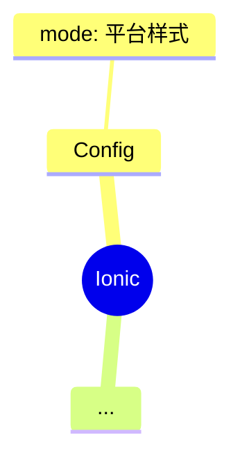

## 路由

存在问题

1. 在页面及子组件无法获取路由查询参数

    useRouteMatch 只能返回路径信息，而 useLocation 返回的事最新的路由信息。

    ps：可以自己额外封装一层。

2. 页面刷新后无法记住路由栈

    如果页面崩溃重新刷新，页面切换动画会出错，例如：从主页到二级页面，这个时候浏览器刷新，二级页面无法知道是否有前一个页面（canGoBack 返回的事 false，实际应该是 true），强制返回无页面切换动画。

    ps：可以根据 history state 来记录路由栈信息，从而恢复路由栈
