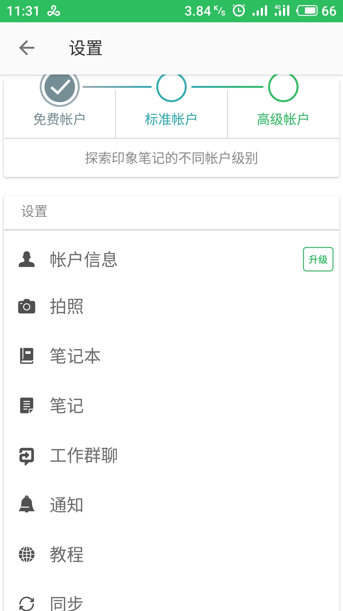

# 状态栏

| 功能/系统 | iOS | Android |
| --- | --- | --- |
| 隐藏 | 支持(`hidden`) | 支持(`hidden`) |
| 动画（状态栏颜色、背景色和隐藏切换效果） | 支持(`animated`) | 支持(`animated`) |
| 字体颜色 | 支持（亮色和暗色）(`barStyle`) | 不支持（安卓状态栏字体和图标颜色都是白色的） |
| 背景 | 不支持，但可以实现（状态栏只能以透明形式显示，可以在状态栏下方显示一个指定颜色的 View） | 支持（默认不是透明形式，可设置 `backgroundColor` 修改背景色，也可以设置 `translucent` 来将导航栏透明化实现类似 iOS 的沉浸式状态栏（Android 4.4 以上版本才支持）） |

ps：在 Android 6.0 的 Api 中提供了 `SYSTEM_UI_FLAG_LIGHT_STATUS_BAR` 这么一个常量，可以使状态栏文字设置为黑色，但对 6.0 以下是不起作用的（小米和魅族的手机也可以达到这个效果，要做一些特殊的处理）。但是 React Native 的 StatuBar 暂时不支持该配置。

## 实际案例

- 全屏隐藏

    - 展示形式：状态栏不显示
    - 应用场景：游戏等应用场景

- 状态栏和导航栏一致

    - 展示形式：状态栏背景色和导航栏颜色一致，状态栏字体和图标颜色根据背景而定（如果是亮色背景，那么显示黑色字体，否则显示白色）
    - 应用场景：

        

- 状态栏和导航栏不一致

    - 展示形式：状态栏背景色和导航栏颜色不一致，状态栏字体和图标颜色根据背景而定（如果是亮色背景，那么显示黑色字体，否则显示白色）
    - 应用场景：

        

        

- 沉浸式

    - 展示形式：

        - 状态栏背景是透明的，字体和图标颜色是白色；
        - 导航栏背景是透明的，字体和图片颜色是白色；
        - 页面顶部展示的是图片或者视频；在用户往上滑动页面时，导航栏透明度增加；在页面顶部图片快要滑出屏幕时，将状态栏字体和图标改成黑色的，导航栏背景是白色，字体和图标颜色是黑色的，但导航栏整体是半透明的；最终随着图片滑出屏幕，导航栏整体不再透明。

    - 应用场景：

        

        

        

## 实际应用

| 效果 / 系统 | iOS | Android |
| --- | --- | --- |
| 全屏隐藏 | 支持 | 支持 |
| 状态栏和导航栏一致 | 支持 | 部分支持（不支持亮色背景） |
| 状态栏和导航栏不一致 | 支持 | 支持 |
| 沉浸式 | 支持 | 部分支持（不支持亮色背景） |

ps：由于 Android 不支持修改状态栏字体和图标颜色，亮色背景效果无法实现。在遇到亮色背景时，需要给状态栏给个非亮色的背景，通常设置为半透明的黑色（例如 `rgba(0, 0, 0, 0.5)`）。

ps：在 React Native 0.4x 之后的版本支持通过 barStyle 来修改 Android 状态栏字体和图标颜色了

## 常见问题

### 设置 Android 状态栏字体颜色

- [Android沉浸式UI，看这一篇就够了](https://juejin.im/entry/5987c5a36fb9a03c3a25bfb6)

#### Anrdoid 4.x.x 不支持 translucent

- [[Android] StatusBar Translucent not working in Android 4.x.x after upgrading to react 0.23](https://github.com/facebook/react-native/issues/6876)
- https://source.android.com/source/build-numbers
