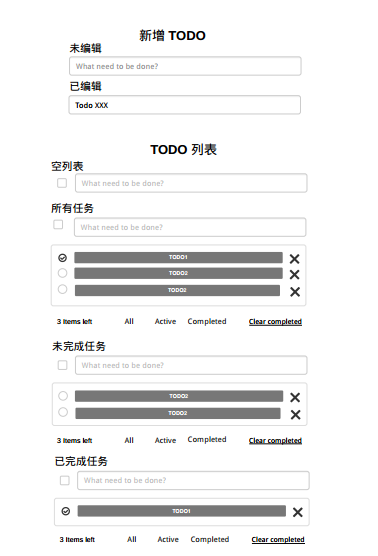

> 经典的 TodoMVC 示例。与 Todos 示例的目的相同，为了两者间比较罗列在此。

示例要点

- 将 Action Type 提取到单独的模块定义 —— constants
- 了解使用 redux 编写简单应用的开发思路

# 需求
## 功能
- 任务列表

    - 所有任务
    - 未完成任务
    - 已完成任务

- 增加任务
- 修改任务
- 完成任务/取消完成任务
- 完成所有任务/取消完成所有任务
- 清空完成的任务
- 删除任务

## 原型


- 新任务

    - 未编辑
    - 已编辑

- 任务列表

    - 空数据视图
    - 所有任务视图/活动任务视图/完成任务视图
    - 所有任务完成视图：可以完成所有任务
    - 所有任务未完成视图：可以清除任务，可以取消完成所有任务
    - 部分任务完成视图：可以清除

- 任务

    - 非编辑任务视图/编辑任务视图
    - 已完成任务视图/未完成任务视图
    - 删除任务：悬浮显示删除按钮

# 设计
- 新任务

    - 状态：无
    - 动作：新增任务

- 列表

    - 状态：任务列表，任务过滤
    - 动作：切换过滤，完成所有任务，清除完成的任务

- 任务

    - 状态：任务明细（id，内容，是否完成），任务编辑中，任务内容
    - 动作：开始编辑（双击任务），修改任务内容，提交任务内容（编辑完回车或点击空白处），完成任务，取消完成任务，删除任务

# 实现
## 动作
新任务

- addTodo(text)

列表：任务过滤交给组件内部实现

- completeAll
- clearCompleted

任务：任务内容编辑交给组件内部实现

- editTodo(id, text)
- deleteTodo(id)
- completeTodo(id)

## 状态
```
{
    todos: [
        {
            id: Number,
            text: String
            completed: Boolean,
        },
        ...
    ]
}
```

## 组件
- Header：负责新增任务
- MainSection + Footer：负责展示和操作任务列表
- TodoItem：负责维护任务项
- TodoTextInput：负责新任务和存在任务的编辑

## 容器
- App

    - mapStateToProps: todos
    - mapDispatchToProps: actions({ addTodo, editTodo, ...})

- ...
