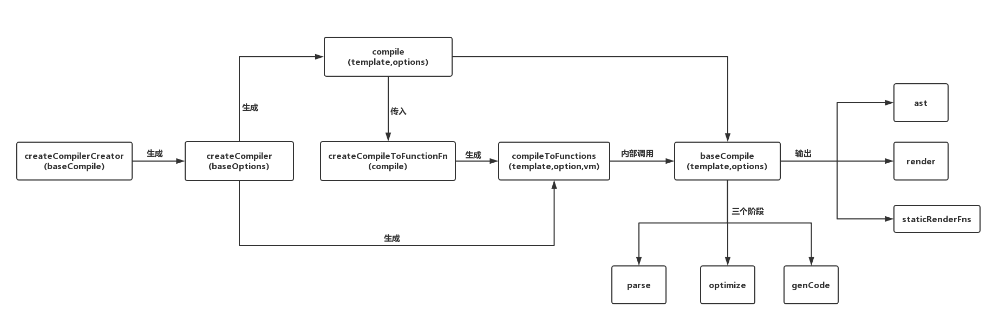

# Vue2

## 原理

### 变化侦测

### 虚拟 DOM

### 模板编译

1. 模板解析：将一堆模板字符串用正则等方式解析成抽象语法树 AST
2. 代码优化：遍历 AST，找出其中的静态节点，并打上标记；
3. 代码生成：将 AST 转换成渲染函数；

#### 模板解析

1. HTML 解析：标签、属性、注释
2. 文本解析：字符串
3. 过滤器解析

考点：

- HTML 解析原理？

    五种类型的内容：文本、HTML 注释、条件注释、DOCTYPE、开始和结束标签。

- 怎么解析 HTML 文本内容的特殊符号 `<` 或者 `>`？

    从文本开头到第一个 `<` 出现的位置都是文本内容，接着从第一个 `<` 的位置继续向后判断是否是非文本（例如：`1<2
`），如果后续文本没有匹配任意的非文本类型的内容，那么表明这个 `<` 也是文本。

- vue 怎么生成 AST 的节点层次关系？

    使用后进先出的栈数据结构。

- vue 怎么校验标签没有正常关闭的？

    Vue 在HTML解析器的开头定义了一个栈 stack，HTML 解析器在从前向后解析模板字符串时，每当遇到开始标签时就会调用 start 钩子函数，那么在 start 钩子函数内部我们可以将解析得到的开始标签推入栈中，而每当遇到结束标签时就会调用 end 钩子函数，那么我们也可以在 end 钩子函数内部将解析得到的结束标签所对应的开始标签从栈中弹出。当出栈的开始标签和结束标签不匹配时，就会抛出警告：‘tag has no matching end tag.’。

#### 代码优化

。。。

#### 代码生成

。。。

### 生命周期

。。。

### 应用实例

。。。

### 全局 API

。。。

### 过滤器

。。。

### 指令

。。。

### 内置组件

。。。

## 实现

### 代码结构

TODO
