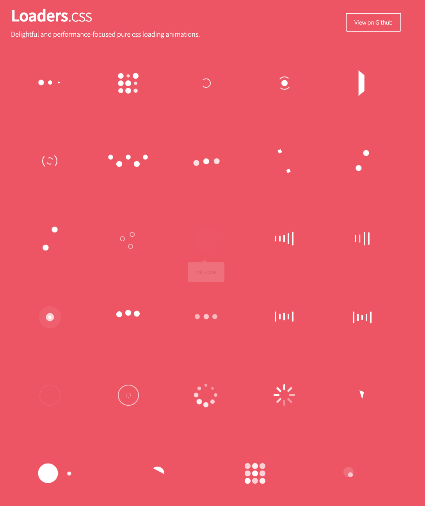
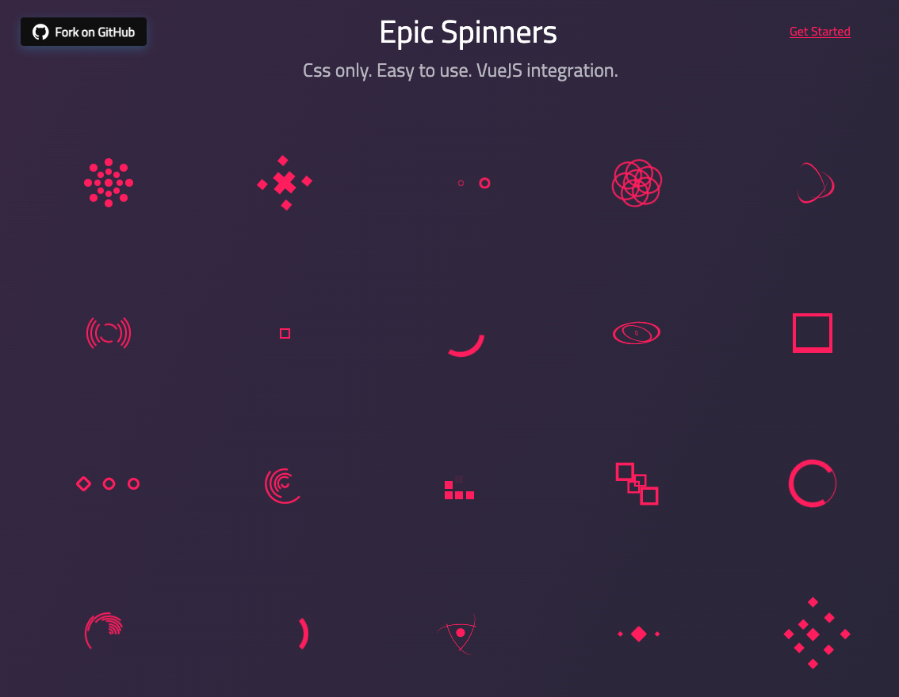
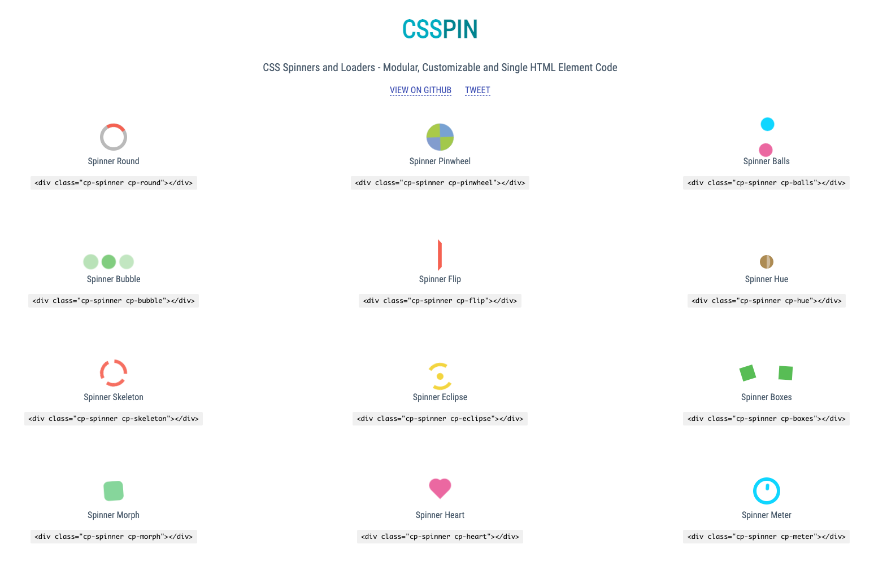
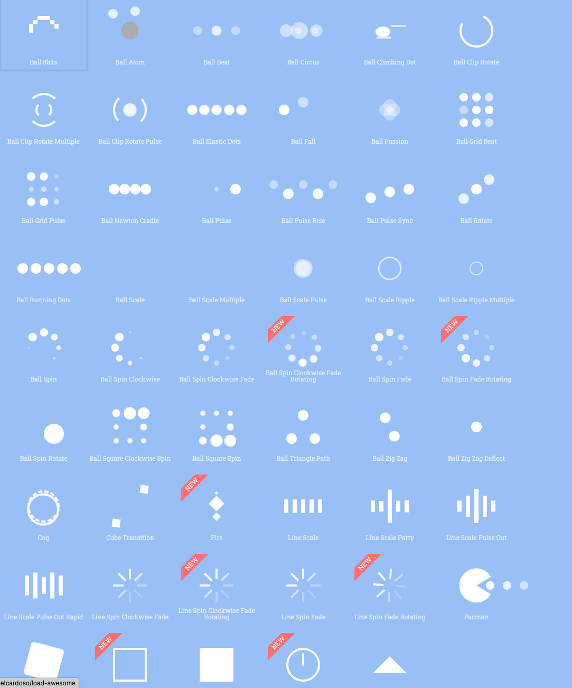

# Spinner

- [tobiasahlin/SpinKit](https://github.com/tobiasahlin/SpinKit) - 19.1K ★ - A collection of loading indicators animated with CSS

    

- [spin.js](https://github.com/fgnass/spin.js) - 9.3K ★ - A spinning activity indicator

    

- [lukehaas/css-loaders](https://github.com/lukehaas/css-loaders) - 10.2k ★ - A collection of loading spinners animated with CSS

    

- [epic-spinners](https://github.com/epicmaxco/epic-spinners) - 3.7k ★

    

- [csspin](https://github.com/webkul/csspin) - 1k ★ - CSS Spinners and Loaders - Modular, Customizable and Single HTML Element Code for Pure CSS Loader and Spinner

    

- [load-awesome](https://github.com/danielcardoso/load-awesome) - 1k ★ - About An awesome collection of — Pure CSS — Loaders and Spinners

    

- [css-loader](https://github.com/raphaelfabeni/css-loader) - 1.1k ★ - Simple loaders for your web applications using only one div and pure CSS

---

- https://loading.io/
- https://cssload.net/
