# State of CSS 2023

## 类型安全的 CSS 变量

- [The @property Rule](https://www.w3.org/TR/css-properties-values-api-1/#at-property-rule)
- [@property on MDN](https://developer.mozilla.org/zh-CN/docs/Web/CSS/@property)
- [@property on web.dev](https://web.dev/at-property/)
- [Zoom focus demo](https://codepen.io/argyleink/pen/rNwWwor)
- [CSS Tricks: Exploring @property and its animating powers](https://css-tricks.com/exploring-property-and-its-animating-powers/)

### 是什么

CSS 变量非常的灵活，允许将各种东西存储在一个命名的变量中，然后可以进行扩展、计算、共享等等。但是，太过灵活，也会存在一些问题。

下面是一个阴影样式使用自定义变量的场景，只有对应的变量值是有效的才能正常运行。例如 设置 `--x: red`，整个阴影就会中断。

```css
box-shadow: var(--x) var(--y) var(--blur) var(--spread) var(--color);
```

这就是 @property 的作用，它可以定义类型化的 CSS 变量，设置允许接收的值类型、初始值和是否继承。

### 怎么用

要使用 @property，需要在 CSS 样式表中定义自定义属性。例如，下面的代码定义了一个名为“--my-color”的属性：

```css
@property --my-color {
  syntax: '<color>';
  initial-value: red;
  inherits: false;
}
```

其中，syntax 表示属性的语法，initial-value 表示属性的初始值，inherits 表示属性是否可以继承。

在样式规则中，可以使用自定义属性来控制样式。例如，下面的代码使用了名为“--my-color”的自定义属性来控制颜色：

```css
.my-class {
  color: var(--my-color);
}
```

在 HTML 中，可以为需要应用样式的元素添加自定义属性的值。例如，下面的代码为一个 div 元素设置了自定义属性的值：

```html
<div class="my-class" style="--my-color: blue;">Hello World!</div>
```

- [`<syntax>`](https://www.w3.org/TR/css-properties-values-api-1/#supported-names)
- [演示示例](./property/property.html)

### 动画样式属性

除了类型安全之外，@property 让 CSS 变量支持动画。因为类型化的 CSS 属性可以让浏览器了解开发者在其他过于复杂的插值中的意图。它从本质上限制了可能性的范围，使浏览器可以对一个样式的某些方面进行动画处理，而以前是不可能的。

示例：

- [animation-variable.html](./property/animation-variable.html)
- [animation-property.html](./property/animation-property.html)

### 兼容性

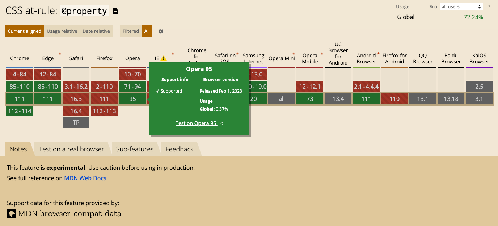

## Media Queries: Range Syntax

“Media Queries Range Syntax” 是对媒体查询语法的改进，可以和普通数学比较运算符一起使用： >, <, >=, 或 <=。

```css
/* 这两行的效果是等价的 */
@media (100px <= width <= 1900px) {}
@media (min-width: 100px) and (max-width: 1900px) {}
```

兼容性：可以使用 PostCSS 来提前使用该语法

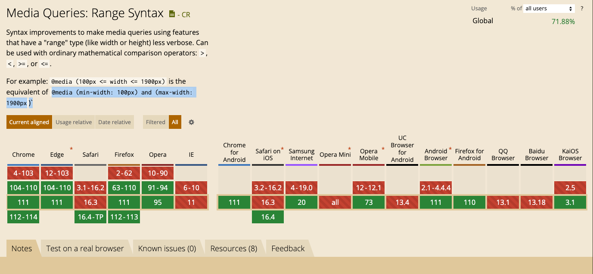

参考文献

- [Media query range syntax specification](https://www.w3.org/TR/mediaqueries-5/#mq-range-context)
- [Media query range syntax on MDN](https://developer.mozilla.org/docs/Web/CSS/Media_Queries/Using_media_queries#syntax_improvements_in_level_4)
- [Media query range syntax PostCSS plugin](https://github.com/postcss/postcss-media-minmax)

## Custom Media

- [Custom media queries specification](https://www.w3.org/TR/mediaqueries-5/#custom-mq)
- [Custom media queries PostCSS plugin](https://github.com/csstools/postcss-plugins/tree/main/plugins/postcss-custom-media)

### 是什么

CSS @custom-media 规则定义了自定义媒体查询，可以在 CSS 中重复使用，类似于自定义变量。

如下所示，假设很多模块都要设置大于等于 768px 的屏幕样式，那么每个地方都要重复的写 `@media (min-width: 768px)`，如果后期要做调整的话，需要遍历所有代码进行修改。

```css
/* page1 */
@media (min-width: 768px) {
}
/* page2 */
@media (min-width: 768px) {
}
```

### 怎么用

@custom-media 规则需要定义一个名称和一个表示式。名称必须以 `--` 开头，表示式则必须是有效的媒体查询，例如 `screen and (min-width: 768px)`。

```css
@custom-media --portrait      (orientation: portrait);
@custom-media --landscape     (orientation: landscape);

@custom-media --md-only       (480px <= width <= 768px);
@custom-media --md-n-above    (width >= 768px);
@custom-media --md-n-below    (width < 768px);
@custom-media --md-phone      (--md-only) and (--portrait);

@media (--md-n-above) {
  :root {
    …
  }
}
```

### 兼容性

虽然目前大部分浏览器都还不支持该功能，但我们可以使用 postcss 的插件 [postcss-custom-media](https://github.com/csstools/postcss-plugins/tree/main/plugins/postcss-custom-media) 来提前使用该语法。


## 嵌套选择器

- [@nest specification](https://www.w3.org/TR/css-nesting-1/)
- [@nest PostCSS plugin](https://github.com/csstools/postcss-plugins/tree/main/plugins/postcss-nesting)
- [Bramus: The future of CSS: Nesting Selectors](https://www.bram.us/2019/03/17/the-future-of-css-nesting-selectors/)

### 是什么

嵌套选择是 CSS 中的一种规则，它允许你将样式规则嵌套在另一个选择器内部。通过使用嵌套选择器，你可以将样式规则分组在一起，从而使样式更加简洁、易于阅读。

### 怎么用

使用方式基本和现有的 CSS 预处理器一致。例如，下面的代码将样式规则嵌套在名为“my-class”的选择器内部：

```html
<!DOCTYPE html>
<html lang="en">
  <head>
    <meta charset="UTF-8" />
    <meta http-equiv="X-UA-Compatible" content="IE=edge" />
    <meta name="viewport" content="width=device-width, initial-scale=1.0" />
    <style>
      .my-class {
        & .my-nested-class {
          color: red;

          &:hover {
            color: blue;
          }
        }
      }
    </style>
  </head>
  <body>
    <div class="my-class">
      <div class="my-nested-class">Hello World!</div>
    </div>
  </body>
</html>
```

### 兼容性

目前只有 Chrome 原生支持嵌套选择器，如果没有使用 CSS 预处理器的话，可以使用 PostCSS 的插件 [PostCSS Nesting](https://github.com/csstools/postcss-plugins/tree/main/plugins/postcss-nesting) 来提前使用该语法。

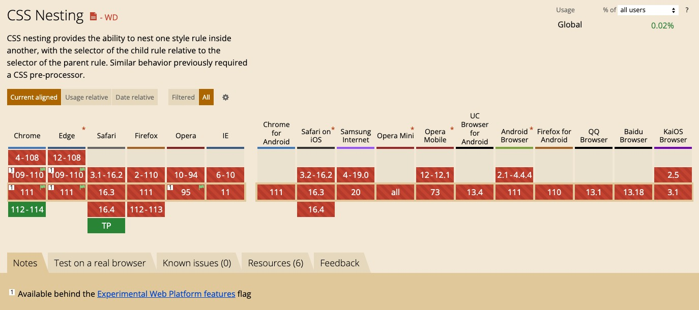

ps：CSS 规范里曾经使用了语法 `@nest` 来实现嵌套选择器，现在已经废弃了，在最新的规范里 `@nest` 已经被 `&` 取代了，这和主流的 CSS 预处理器的语法一致。

## Scoping styles

CSS @scope 允许将一组样式规则限定在一个指定的选择器范围内。通过这种方式，可以限制样式规则的作用范围，避免样式污染和选择器冲突的问题。

```css
.card__header {
  color: var(--text);
}

/* with @scope becomes */

@scope (.card) {
  header {
    color: var(--text);
  }
}
```

目前，@scope 规则还处于实验阶段，并未得到主流浏览器的支持（好像是因为实现后会影响渲染性能，所以没有实现），大家主要还是使用 Shadow DOM、BEM 规范、CSS Module 和 CSS In JS 等这些方案来实现作用域样式。

参考文献

- [@scope specification](https://www.w3.org/TR/css-scoping-1/)
- [@scope explainer](https://css.oddbird.net/scope/explainer/)
- [Remove `<style scoped>`](https://github.com/whatwg/html/issues/552)

## masonry layout(瀑布流布局)

- [Masonry layout specification](https://drafts.csswg.org/css-grid-3/#masonry-layout-algorithm)
- [Casonry-auto-flow on Can I Use](https://caniuse.com/mdn-css_properties_masonry-auto-flow)
- [Masonry layout on MDN](https://developer.mozilla.org/en-US/docs/Web/CSS/masonry-auto-flow)
- [Smashing Magazine: Native CSS Masonry Layout with CSS Grid](https://www.smashingmagazine.com/native-css-masonry-layout-css-grid/)

### 是什么

CSS Masonry Layout 是一种布局方式，用于实现瀑布流式的布局效果。它可以让元素自适应容器宽度，自动换行并对齐。

ps：在此之前，一般使用 JavaScript 来实现瀑布流布局，参考[图片瀑布流，就是如此简单（so easy）](https://juejin.cn/post/6963071339108237319)。

### 怎么用

使用 CSS Masonry Layout 需要设置以下几个属性：

```css
.masonry {
  display: grid;
  grid-template-columns: repeat(4, 1fr);
  grid-template-rows: masonry;
}
```

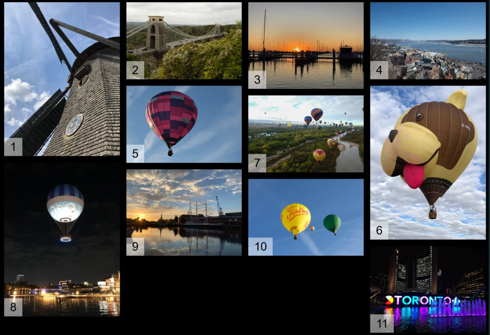

示例：[masonry-layout](./masonry-layout/index.html)

### 兼容性

目前只有 Firefox 版本的实现了该特性（需要开启实验性功能）。

## prefers-reduced-data

- [prefers-reduced-data on MDN](https://developer.mozilla.org/en-US/docs/Web/CSS/@media/prefers-reduced-data)
- [prefers-reduced-data on Can I Use](https://caniuse.com/mdn-css_at-rules_media_prefers-reduced-data)

### 是什么

prefers-reduced-data 是 CSS 的媒体功能，用来检测用户是否要求使用消耗较少互联网流量的网络内容。

### 怎么用

- no-preference：默认，未开启
- reduce：开启

如下所示，在开启节省流量的情况下，通过媒体查询来隐藏图片和视频，并且使用系统字体来显示文字。

```css
@media (prefers-reduced-data: reduce) {
  picture, video {
    display: none;
  }
}
@media (prefers-reduced-data: no-preference) {
  @font-face {
    font-family: Montserrat;
    font-style: normal;
    font-weight: 400;
    font-display: swap;
    /* latin */
    src: local("Montserrat Regular"), local("Montserrat-Regular"),
      url("fonts/montserrat-regular.woff2") format("woff2");
    unicode-range: U+0000-00FF, U+0131, U+0152-0153, U+02BB-02BC, U+02C6,
      U+02DA, U+02DC, U+2000-206F, U+2074, U+20AC, U+2122, U+2191, U+2193,
      U+2212, U+2215, U+FEFF, U+FFFD;
  }
}

body {
  font-family: Montserrat, -apple-system, BlinkMacSystemFont, "Segoe UI", Roboto,
    Helvetica, Arial, "Microsoft YaHei", sans-serif, "Apple Color Emoji", "Segoe UI Emoji",
    "Segoe UI Symbol";
}
```

### 兼容性

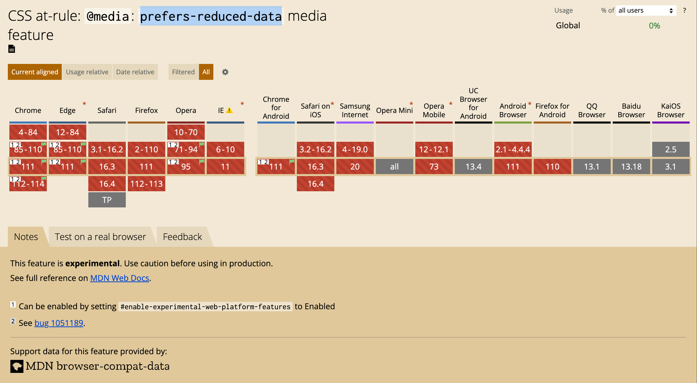

## Scroll Snap

- [scroll-snap-type](https://developer.mozilla.org/en-US/docs/Web/CSS/scroll-snap-type)
- [scroll-snap-align](https://developer.mozilla.org/en-US/docs/Web/CSS/scroll-snap-align)
- [scroll-snap-stop](https://developer.mozilla.org/en-US/docs/Web/CSS/scroll-snap-stop)
- [scroll-margin](https://developer.mozilla.org/en-US/docs/Web/CSS/scroll-margin)
- [scroll-padding](https://developer.mozilla.org/en-US/docs/Web/CSS/scroll-padding)

### 是什么

`scroll snap` 是一个 CSS 属性，用来实现走马灯和轮播等效果。它可以将滚动行为分割成独立的片段，并将页面内容停止在容器的特定位置。这可以使页面滚动更流畅、更可预测，同时提高用户体验。

### 怎么用

scroll snap 属性主要有两个子属性：scroll-snap-type 和 scroll-snap-align。

- `scroll-snap-type`：用于定义容器的滚动方式，可以设置为 x 或 y 表示水平或垂直滚动，并且可以将滚动行为设置为 mandatory、proximity 或 none，以定义滚动到每个片段的方式。
- `scroll-snap-align`：用于定义每个片段的对齐方式，可以设置为 start、end、center、none 等。

### New API

- `snapChanging()`：在释放一个 snap child 的时候触发

    ```js
    document.querySelector('.snap-carousel').addEventListener('snapchanging', event => {
        console.log('Snap is changing', event.snappedTargetsList);
    });
    ```

- `snapChanged()`：滑动到新的新的 snap child 的时候触发

    ```js
    document.querySelector('.snap-carousel').addEventListener('snapchanged', event => {
        console.log('Snap changed', event.snappedTargetsList);
    });
    ```

- `scroll-start`：设置初始化的滚动高度

    ```css
    :root { --nav-height: 100px }

    .snap-scroll-y {
        scroll-start-y: var(--nav-height);
    }
    ```

- `:snap-target`：伪类选择器，匹配当前滚动捕获的 child

    ```css
    .card:snapped {
        font-weight: 600;
    }
    ```

参考文献

- [Scroll Snap 2 draft specification](https://drafts.csswg.org/css-scroll-snap-2/)
- [Scroll Snap 2 explainers](https://github.com/argyleink/ScrollSnapExplainers/blob/main/css-snap-target/readme.md)
- [Snap demos](https://snap-gallery.netlify.app/)

### 兼容性

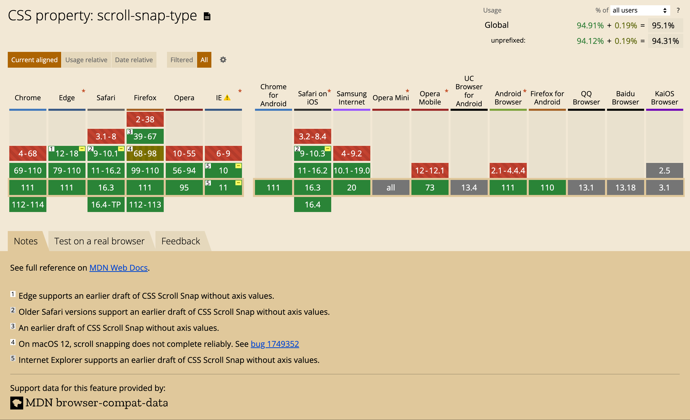

## Cascade layers

- [The Future of CSS: Cascade Layers (CSS @layer)](https://www.bram.us/2021/09/15/the-future-of-css-cascade-layers-css-at-layer/)


### 是什么

`@layer` 规则是一个 CSS Modules v3 中引入的新规则，它允许将样式表分解成多个层级，并指定这些层级之间的优先级顺序。

有了 @layer，入口文件可以预先定义层级和它们的顺序。然后，随着样式的加载，它们可以被放置在一个层中，允许保留样式覆盖的重要性，但没有细致管理的加载协调。


### 怎么用

```html
<!DOCTYPE html>
<html lang="en">
  <head>
    <meta charset="UTF-8" />
    <meta http-equiv="X-UA-Compatible" content="IE=edge" />
    <meta name="viewport" content="width=device-width, initial-scale=1.0" />
    <style>
      @layer libraries, components;
    </style>
    <style id="components">
      @layer components {
        .button {
          background-color: brown;
        }
        button {
          text-align: right;
        }
      }
    </style>
    <style id="libraries">
      @layer libraries {
        .button {
          min-width: 200px;
          text-align: center;
          background-color: yellow;
          color: white;
        }
      }
    </style>
  </head>
  <body>
    <button class="button">Beware of the zombies</button>
  </body>
</html>
```

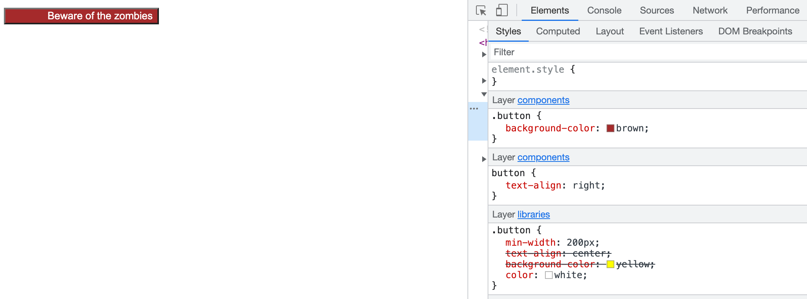

### 兼容性

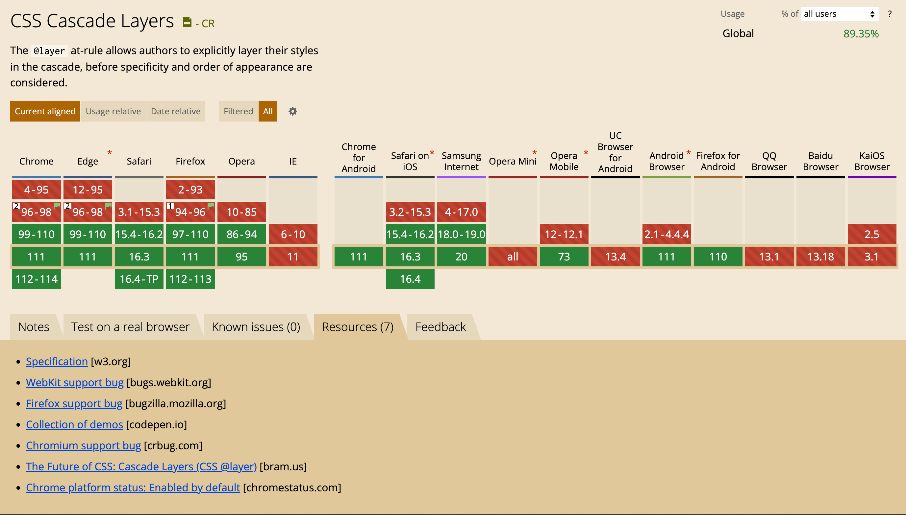

## Container queries

- [Container Queries specification](https://www.w3.org/TR/css-contain-3/#container-queries)
- [Container Queries on MDN](https://developer.mozilla.org/docs/Web/CSS/CSS_Container_Queries)
- [The new responsive on web.dev](https://web.dev/new-responsive/#responsive-to-the-container)
- [Awesome container queries collection](https://github.com/sturobson/Awesome-Container-Queries)
- [Ahmad Shadeed: Say Hello To CSS Container Queries](https://twitter.com/shadeed9)

### 是什么

CSS Container Queries 是一项新的 Web 标准，它允许开发人员基于容器的宽度、高度、比例和其他属性来编写响应式 CSS。它的目标是让开发者能够更加灵活地设计网站布局，使布局能够更好地适应不同的屏幕大小和设备类型。

### 怎么用

1. 声明容器上下文：

    ```css
    .xxx {
      container-type: inline-size;
      container-name: xxx;
    }
    ```

    - container-type：容器类型，用来创建容器上下文
    - container-name：容器名称，可选

2. 使用容器查询：

    ```css
    /** 按最近的父级容器查询 */
    @container (min-width: 700px) {
      .card h2 {
        font-size: 2em;
      }
    }
    /** 按指定名称的容器查询 */
    @container xxx (min-width: 700px) {
      .card h2 {
        font-size: 2em;
      }
    }
    ```

### 兼容性

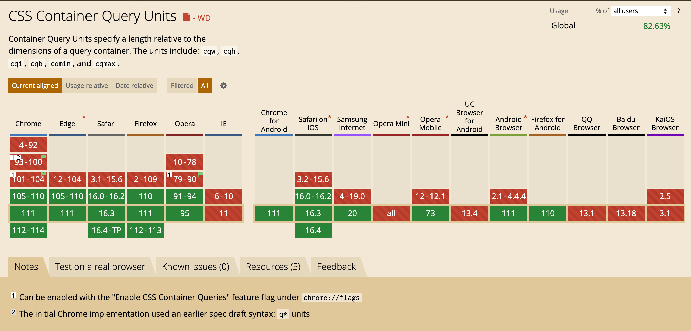

## `:has()` 

- [:has() on MDN](https://developer.mozilla.org/docs/Web/CSS/:has)
- [The CSS :has() selector is way more than a "parent selector"](https://www.bram.us/2021/12/21/the-css-has-selector-is-way-more-than-a-parent-selector/)

### 是什么

CSS :has() 是一项新的 CSS 选择器，允许开发人员选择包含特定元素的父元素。这个选择器被称为“影子选择器”，因为它可以选择元素的祖先而不影响其样式。

### 怎么用

例如，要选择后代元素里有类名为 "my-class" 的父元素，且元素类型为 div，可以这样写：

```css
div:has(.my-class) {
  /* 父元素的样式 */
}
div:has(.my-class1):has(.my-class2) {
  /* 父元素的样式 */
}
```

### `:has` vs `:is` vs `:where` vs `:not`

| 选择器/区别 | 功能 | 优先级 |
| --- | --- | --- |
| is | 将选择器列表作为参数，并选择该列表中任意一个选择器可以选择的元素 | 取决于选择器列表中优先级最高的选择器 |
| where | 同 is | 优先级总是为 0 |
| not | 用来匹配不符合一组选择器的元素 | 取决于选择器列表中优先级最高的选择器 |
| has | 父选择器 | 取决于选择器列表中优先级最高的选择器 |

### 兼容性

| not | is | where | has |
| --- | --- | --- | --- |
| 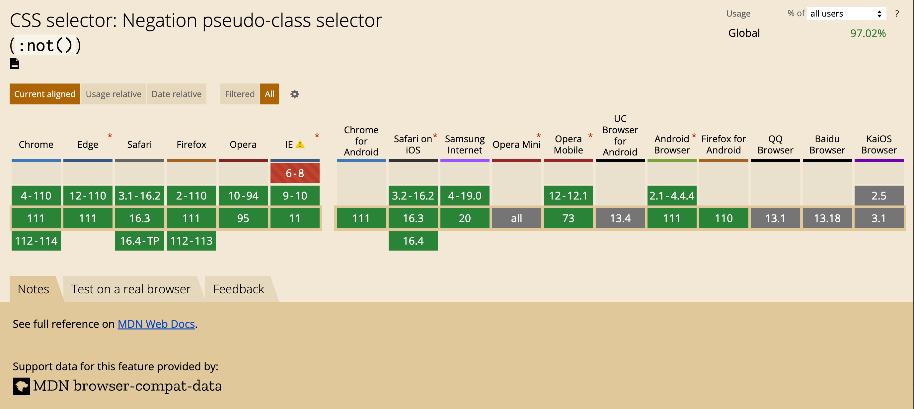 | 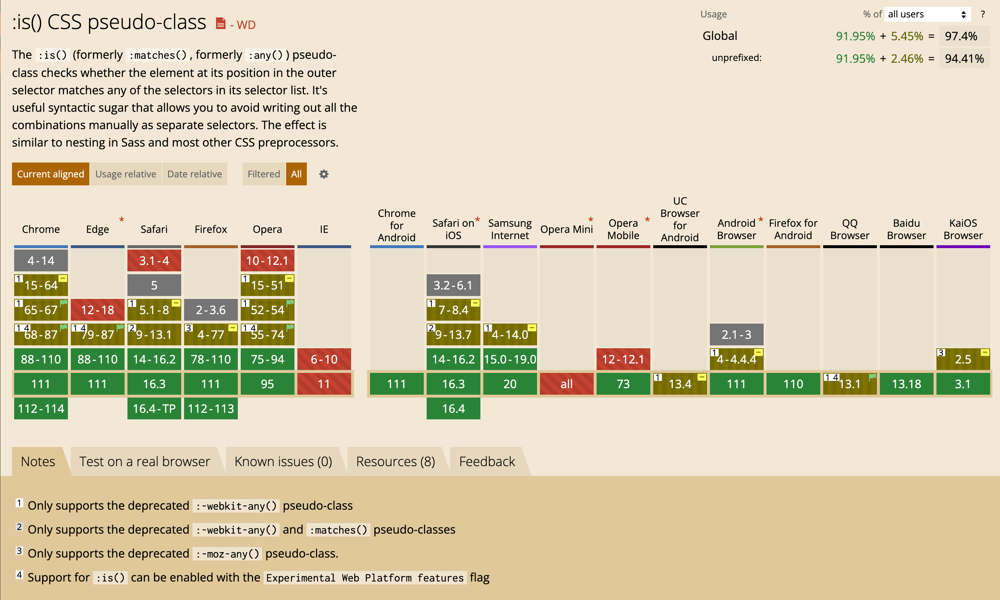 | 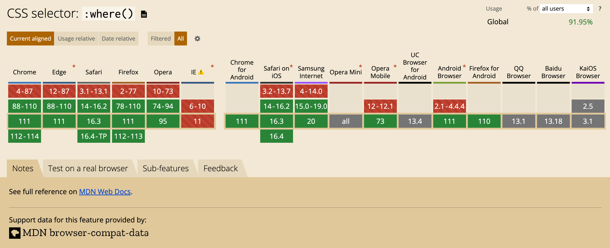 | 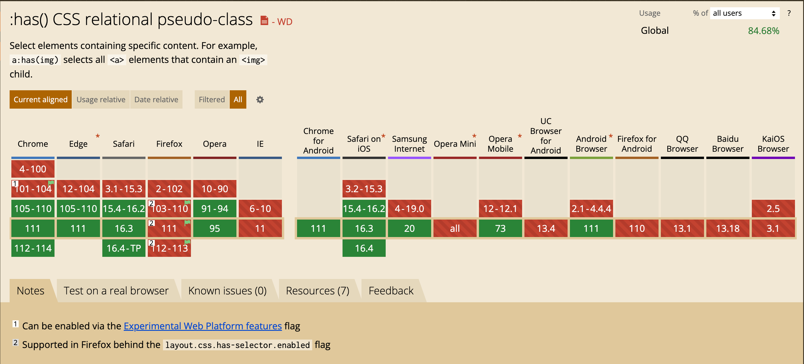 |

## accent-color

- [accent-color specification](https://www.w3.org/TR/css-ui-4/#widget-accent)
- [accent-color on MDN](https://developer.mozilla.org/docs/Web/CSS/accent-color)
- [accent-color on web.dev](https://web.dev/accent-color/)
- [Bramus: Tint User-Interface Controls with CSS accent-color](https://www.bram.us/2021/08/23/tint-user-interface-controls-with-css-accent-color/)

### 是什么

accent-color 是 CSS 的一个属性，用于为元素的一些特定部分（如输入框、按钮、链接等）设置强调颜色。例如：为一个链接设置一个蓝色的下划线、为输入框设置一个黄色的边框等等。在使用这个属性时，浏览器会自动应用相应的颜色和样式，以确保与系统主题的一致性。

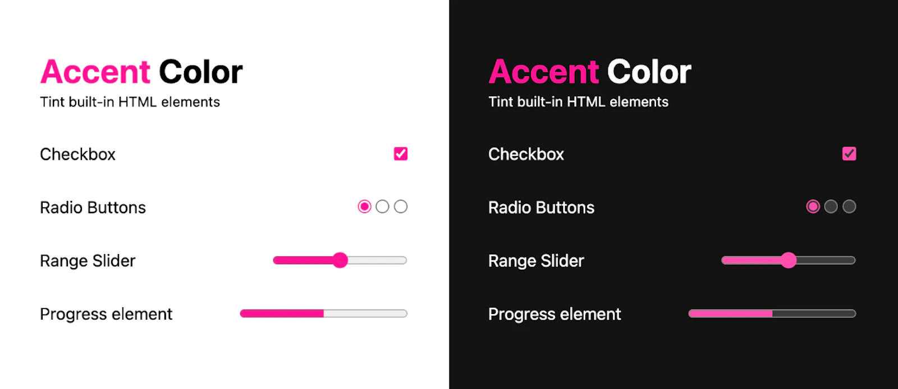

### 怎么用

在下面示例中，分别为链接、提交按钮和普通按钮设置了不同的强调颜色。

```css
a {
  accent-color: blue;
}

input[type="submit"] {
  accent-color: yellow;
}

button {
  accent-color: red;
}
```

### 兼容性

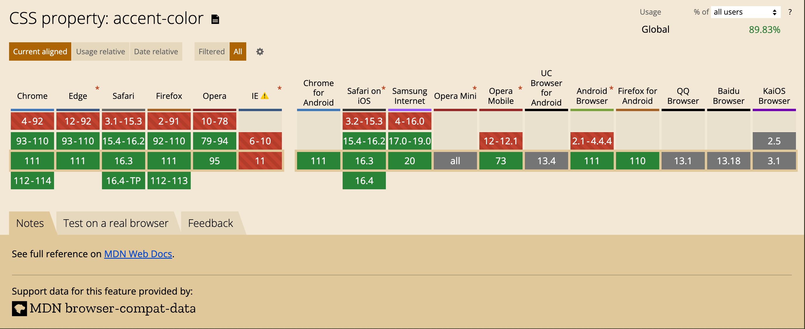

## inert

- [Inert specification](https://html.spec.whatwg.org/multipage/interaction.html#inert)
- [Inert on MDN](https://developer.mozilla.org/docs/Web/API/HTMLElement/inert)
- [Chrome Developers: Introducing inert](https://developer.chrome.com/blog/inert/)

### 是什么

inert 是 HTML 的一个属性，用于将一个元素及其子元素设置为无效（inert），使其不响应用户事件、不可聚焦，并且不参与到页面的交互行为中。

### 怎么用

inert 可以实现类似 window.alert() 的效果，弹出提示框后无法与网页其他内容产生任何交互。

```html
<body>
  <div class="modal">
    <h2>Modal Title</h2>
    <p>...<p>
    <button>Save</button>
    <button>Discard</button>
  </div>
  <main inert>
    <!-- cannot be keyboard focused or clicked -->
  </main>
</body>
```


### inert vs pointer-events

- inert：将元素及其子元素设置为无效状态，不响应用户事件、不可聚焦，并且不参与到页面的交互行为中。
- pointer-events：控制元素对鼠标或触摸事件的响应，使用该属性可以将某些元素设置为不响应鼠标或触摸事件，以避免用户误操作或遮挡其他元素。但是这类元素仍然可以响应键盘事件，通过 tab 键可以让输入框获取焦点并输入信息。

### 兼容性

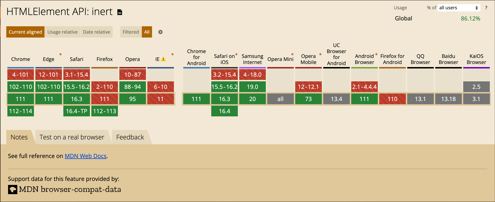

## COLRv1 Fonts

- [Colrv1 specification on Github](https://github.com/googlefonts/colr-gradients-spec)
- [Chrome Developers: Colrv1 Fonts](https://developer.chrome.com/blog/colrv1-fonts/)

### 是什么

COLRv1 字体是一种特殊的 OpenType 字体，可以支持比传统字体更丰富的颜色、渐变等效果，从而在设计中提供更多的可能性。

ps：COLRv1 是 COLRv0 的改进版本。

### 怎么用

1. 导入 COLRv1 字体

    ```css
    @import url(https://fonts.googleapis.com/css2?family=Bungee+Spice);
    ```

2. 自定义 COLRv1 字体：[@font-palette-values](https://developer.mozilla.org/en-US/docs/Web/CSS/@font-palette-values) 可以定制由字体制作者创建的 font-palette 的默认值。

    ```css
    @font-palette-values --colorized {
      font-family: "Bungee Spice";
      base-palette: 0;
      override-colors: 0 hotpink, 1 cyan, 2 white;
    }

    .spicy {
      font-family: "Bungee Spice";
      font-palette: --colorized;
    }
    ```

## Viewport units

在手机上加载一个页面时，会显示带有网址的导航栏，这个导航栏会消耗一些空间。经过几秒钟和一些互动，导航栏可能会滑开，以便为用户提供更大的视口体验。但是，当该条滑出时，视口的高度已经改变，任何 vh 单位都会随着目标尺寸的改变而移动和调整大小。在后来，vh 将始终代表最大的视口，并引入了一些新的单位来代表窗口改变导致的高度变化。

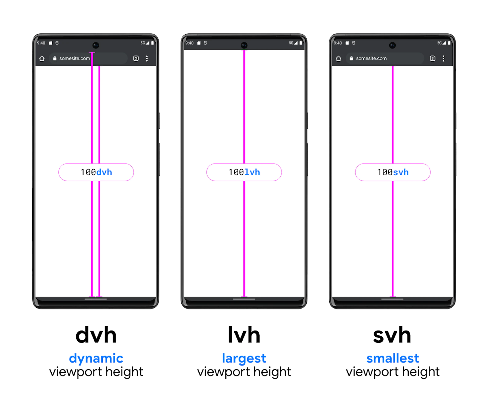

- dvh：Dynamic viewport height
- lvh：Largest viewport height
- svh：Smallest viewport height

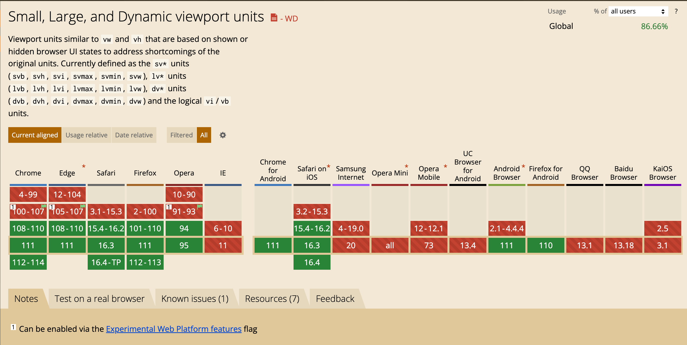

## 更多其他的特性

- Color level 4 and 5
- Subgrid
- Flexbox gap
- CSS Logical Properties and Values
- aspect-ratio
- Content-visibility
- Intrinsic Sizing
- overscroll-behavior
- Font-display
- Variable Fonts
- ::marker
- math functions min(), max() and clamp()
- image-set
- image()

## 参考文献

- https://2022.stateofcss.com/
- https://web.dev/state-of-css-2022/
