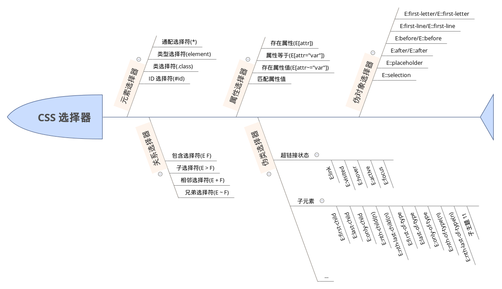

# 常见问题
1. CSS选择符有哪些？

    - 元素选择符
    - 关系选择符
    - 属性选择符
    - 伪类选择符
    - 伪元素选择符

2. CSS 优先级算法如何计算？

    - !important > 内联样式表 > 嵌入样式表/外部样式表 > 默认样式表；
    - 嵌入样式表/外部样式表的优先级计算规则
    
        - 权重计算：`ID 选择器-类选择器-元素选择器` 作为一个三位数，每出现对应一个选择符，相应位上加 1，结果作为权重，越大优先级越高；
        - 就近原则：同权重情况下，样式定义最近者为准；
