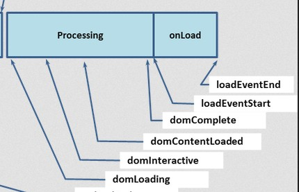
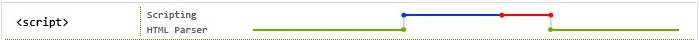
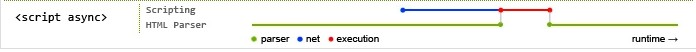

# [Script](https://developer.mozilla.org/en-US/docs/Web/HTML/Element/script)

HTML `<script>` 元素用于嵌入或引用可执行脚本。

## 基础用法

### 两种用法

`<script>` 一般就两种用法：

1. 外部脚本

    ```html
    <script src="javascript.js"></script>
    ```

2. 内联脚本

    ```html
    <script>
      // ...
    </script>
    ```

ps：[基础用法示例](./examples/basic-usage)

### 更多脚本类型

`<script>` 通过 `type` 属性是用来标识[脚本内容类型](https://developer.mozilla.org/en-US/docs/Web/HTTP/Basics_of_HTTP/MIME_types#textjavascript)，一般分为以下三种类型：

- JavaScript MIME

    在 H5 普及之前（HTML4），我们经常会看到 `<script>` 配有支持配置 `type="text/javascript"`。但在 H5 规范中已经呼吁开发人员取消了 `type="text/javascript"`（默认不配就是 JavaScript 类型）。

    ps：在早期的浏览器中，支持 [MIME 嗅探标准](https://mimesniff.spec.whatwg.org/)（定义了 script 的内容类型，以及如何处理），有效的 JavaScript MIME 类型可以是 `text/livescript`、`application/ecmascript`、`text/javascript1.0` 等。但现在这些类型已经被 [RFC 4329](https://tools.ietf.org/html/rfc4329) 废弃了，只允许使用 `text/javascript`。

- module：将代码作为 JavaScript 模块处理
- 其他任意 MIME：内嵌（`src` 属性会被忽略）在 `<script>` 中的内容作为数据数据块使用，浏览器不会解析执行该标签。

## ES2015 Module

- [JavaScript modules](https://developer.mozilla.org/en-US/docs/Web/JavaScript/Guide/Modules)
- [import](https://developer.mozilla.org/en-US/docs/Web/JavaScript/Reference/Statements/import) / [export](https://developer.mozilla.org/en-US/docs/Web/JavaScript/Reference/Statements/export) / [import.meta](https://developer.mozilla.org/en-US/docs/Web/JavaScript/Reference/Statements/import.meta)
- [Module 的语法](http://es6.ruanyifeng.com/#docs/module)
- [Axel Rauschmayer's book: "Exploring JS: Modules"](https://exploringjs.com/es6/ch_modules.html)
- [Previewing ES6 Modules and more from ES2015, ES2016 and beyond](https://blogs.windows.com/msedgedev/2016/05/17/es6-modules-and-beyond/)
- [ES6 In Depth: Modules](https://hacks.mozilla.org/2015/08/es6-in-depth-modules/)
- [ES modules: A cartoon deep-dive](https://hacks.mozilla.org/2018/03/es-modules-a-cartoon-deep-dive/)
- [在浏览器中使用JavaScript module(模块)](http://www.webhek.com/post/ecmascript-modules-in-browsers.html) / [在浏览器中使用 ECMAScript Modules](https://zhuanlan.zhihu.com/p/26865999)
- [ECMAScript modules in browsers](https://jakearchibald.com/2017/es-modules-in-browsers/)
- [Native ECMAScript modules - the first overview](https://hospodarets.com/native-ecmascript-modules-the-first-overview)
- [Previewing ES6 Modules and more from ES2015, ES2016 and beyond](https://blogs.windows.com/msedgedev/2016/05/17/es6-modules-and-beyond/)

### 启用模块化

最新的浏览器大部分都默认支持模块化语法，我们需要做的只是在 script 标签元素上声明 `type=module` 就可以了。

```html
<script type="module" src="main.js"></script>
<!-- 或 -->
<script type="module">
  import './main.js';
</script>
```

```js
// main.js
import utils from './utils.js';

utils.alert(`
  JavaScript modules work in this browser:
  https://blog.whatwg.org/js-modules
`);
```

```js
// utils.js
export default {
  alert: (msg)=> {
    alert(msg);
  }
};
```

### 一些常见问题

- `import` 模块支持相对路径、绝对路径和 URL，不支持类似 Nodejs 第三方模块名

    - `./`
    - `../`
    - `/`
    - URL

- 没有配置 `type="module"`，但脚本里使用了 ES Module 时会报语法错误

    `Uncaught SyntaxError: Unexpected identifier`

- 对于不支持 `type="module"` 的浏览器遇到这样的 script 标签时，不会解析执行。为了解决兼容性问题，script 引入了属性 `nomodule`，带有该属性的 script 标签会被支持 `module` 的浏览器忽略。

    ```html
    <script type="module" src="module.js"></script>
    <script nomodule src="fallback.js"></script>
    ```
- module 类型的 script 默认是开启 defer（脚本会推迟到 HTML 解析完成后执行）

    ps：即使是内联的 module script 脚本，也会被 defer（普通的内联脚本是不支持 defer 的）

- module script 支持 async（在解析 HTML 的同时并行下载，下载完成后立即解析执行）
- module script 只会执行一次

    如果你知道 ES modules，你就应该知道，modules 可以 import 多次，但只会执行一次。这种原则同样适用于 HTML 里的script modules，一个确定的 URL 上的 module script 在一个页面上只会执行一次。

- CORS 跨域资源共享限制

    跟普通的 scripts 不同, module scripts (以及它们的 imports 行为) 受 CORS 跨域资源共享限制。也就是说，跨域的 module scripts 必须返回带有有效 Access-Control-Allow-Origin: * 的 CORS 头信息。

- 没有凭证信息(credentials)

    当请求在同一安全域下，大多数的 CORS-based APIs 都会发送凭证信息 (cookies 等)，但 fetch() 和 module scripts 例外 – 它们并不发送凭证信息，除非我们要求它们。

    我们可以通过添加 crossorigin 属性来让同源 module 脚本携带凭证信息，如果你也想让非同源 module 脚本也携带凭证信息，使用 crossorigin="use-credentials" 属性。需要注意的是，非同源脚本需要具有 `Access-Control-Allow-Credentials: true` 头信息。

    ps：现阶段浏览器的实现可能各不一样。

## 跨域配置

`<script>` 有一个 crossorigin 属性（这个属性本身是 CORS 的规范，不只是 script 标签，image、video 等标签也支持），用来控制跨域脚本请求是否会携带凭据信息（cookies、客户端 SSL 证书或 HTTP 认证交换用户凭据）。此外脚本标签设置了该属性后，会强制开启 CORS 标准校验（检查跨域资源请求的响应头是否设置了正确的响应头）。

- [The crossorigin attribute: Requesting CORS access to content](https://developer.mozilla.org/en-US/docs/Web/HTML/CORS_settings_attributes)
- [HTML5 `<script>` 标签里的 crossorigin 属性到底有什么用？](https://www.chrisyue.com/what-the-hell-is-crossorigin-attribute-in-html-script-tag.html)

### 是否携带凭据？

同域脚本有没有配置 crossorigin 是没有任何影响的，而跨域脚本标签没有配置 crossorigin 时会兼容旧浏览器的实现（不受 CORS 限制，即要求跨域请求必须设置 CORS 相关的响应头）。但跨域脚本一旦设置 crossorgin 就必须遵从 CORS 标准。

| 关键字 | 描述 |
| --- | --- |
| 不设置 | 无论是否跨域，请求都会携带凭据 |
| anonymous	| 同域脚本忽略该配置，如果是跨域脚本，则该脚本必须设置了响应头 `access-control-allow-origin`，否则根据 CORS 策略，脚本会被阻塞无法解析执行（日志显示 `"Access to script at 'http://orgin1/index.js' from origin 'origin2' has been blocked by CORS policy: No 'Access-Control-Allow-Origin' header is present on the requested resource."`），设置该响应头后浏览器对此元素的 CORS 请求将不设置凭据标志。 |
| use-credentials |	同域脚本忽略该配置，如果是跨域脚本，则该脚本必须设置了响应头 `access-control-allow-origin`，且值必须写明具体的域名不可是通配符 `*`，此外也需要配置 `Access-Control-Allow-Credentials` 为 `true`，否则根据 CORS 策略，脚本会被阻塞无法解析执行（日志显示 `"Access to script at 'http://orgin1/index.js' from origin 'origin2' has been blocked by CORS policy: No 'Access-Control-Allow-Origin' header is present on the requested resource."` 或者 `"Access to script at 'http://origin1/index.js' from origin 'http://origin2' has been blocked by CORS policy: The value of the 'Access-Control-Allow-Credentials' header in the response is '' which must be 'true' when the request's credentials mode is 'include'."`）。设置正确后，对此元素的 CORS 请求将设置凭证标志。 |
| "" | 设置了属性名或者是个空字符的作用与 anonymous 是一致的。 |

疑问：既然不设置 anonymous，跨域脚本请求都会携带凭据，为什么还需要 `use-credentials`？ —— 见下文的”全局错误捕获“

### 全局错误捕获

- [window.onerror](https://developer.mozilla.org/en-US/docs/Web/API/GlobalEventHandlers/onerror) 可以捕获 JavaScript 运行时错误和一些资源的加载失败错误，为了避免[信息泄露](https://bugzilla.mozilla.org/show_bug.cgi?id=363897)（[I know if you're logged-in, anywhere](https://blog.jeremiahgrossman.com/2006/12/i-know-if-youre-logged-in-anywhere.html)），浏览器默认不支持捕获跨域脚本运行错误的明细信息（只能拿到一个错误信息 `"Script error."`）。

| window.onerror | 不配置 | crossorigin / crossorigin="" / crossorigin="anonymous" | crossorigin="use-credentials" |
| --- | --- | --- | --- |
| 同域 | ✓ | ✓ | ✓ |
| 跨域且不带跨域响应头 | ✘（只能获取到错误信息 `"Script error"`） | ✘（触发 CORS 策略，被阻塞无法解析执行） | ✘（同左） |
| 跨域且带跨域响应头 | ✘（只能获取到错误信息 `"Script error"`） | ✓ | ？（脚本响应头必须设置了 `Access-Control-Allow-Credentials: true`，否则会被阻塞无法解析执行） |
| 跨域且 MIME 类型错误 | ✘（CORS 会阻塞跨域错误 MIEME 类型的 script 解析执行） | ✘ | ✘ |

总结：现在的浏览器默认不能获取到跨域脚本的明细信息，并且错误类型的 MIME 脚本是不允许加载执行的。为了捕获跨域脚本的错误明细信息，需要达成以下两个条件：

1. 跨域脚本的服务器设置了跨域响应头
2. 跨域脚本 script 标签设置了 crossorigin 属性

ps：通过理解 crossorigin 的作用机制可以明白，设置 crossorigin 可以禁止请求脚本的时候携带凭据信息，服务端也就不会根据凭据信息返回用户相关的信息，避免了信息泄露，window.onerror 也就允许捕获错误明细信息了。

### [crossorgin 测试示例](./examples/cross-origin)

...

## SRI 策略

SRI（Subresource Integrity）是允许浏览器检查其获得的资源（例如从 CDN 获得的）是否被篡改的一项安全特性。

- 为什么

    > Web 性能优化中很重要的一点是让请求提前结束，让可缓存的资源走 CDN 是最通用的做法。CDN 服务提供商通过分布在各地的节点，让用户从最近的节点加载内容，大幅提升速度。但是 CDN 的安全性一直是一个风险点：对于网站主来说，让请求从第三方服务器经过，由第三方响应，安全方面肯定不如自己服务器可控。
    >
    > 我们知道 CSP（Content Security Policy） 的外链白名单机制可以在现代浏览器下减小 XSS 风险。但针对 CDN 内容被篡改而导致的 XSS，CSP 并不能防范，因为网站所使用的 CDN 域名，肯定在 CSP 白名单之中。这时候，SRI 就应运而生了。它通过对资源进行摘要签名机制，来保证外链资源的完整性（不被篡改）。

- 怎么使用

    > 要使用 SRI，只需要在原有的标签里增加 integrity 属性即可，这个属性的签名算法支持 sha256、sha384 和 sha512，签名算法和摘要签名内容用 - 分隔。
    >
    > 浏览器拿到资源内容之后，会使用 integrity 所指定的签名算法计算结果，并与 integrity 提供的摘要签名比对，如果二者不一致，就不会执行这个资源。

    ```html
    <script crossorigin="anonymous" integrity="sha512-BlCvumXWTvpASEdhCGiahDUDf7Bwb8QXA2XnnSnqJ9QafxcNcrNYUNYS2wXmd3nEpO//+zlZa9DSV9zmu5MqRg==" type="application/javascript" src="https://github.githubassets.com/assets/compat-bootstrap-90c0ace0.js"></script>
    ```

    ps：webpack 可以使用插件 [webpack-subresource-integrity](https://github.com/waysact/webpack-subresource-integrity) 自动生成 integrity。

- 局限性

    > SRI 的作用是保证页面引入第三方资源的完整性。在第三方 CDN 服务被入侵或回源被运营商劫持、文件内容被加入恶意代码时，网站如果启用了 SRI 策略，那么在支持 SRI 的浏览器下，被篡改的文件无法执行。
    >
    > 我们知道，HTTPS 也可以确保传输过程中的数据完整性，但是对于 CDN 服务器被入侵或 HTTP 回源被劫持造成的文件篡改，HTTPS 无济于事，这时 SRI 就可以派上用场，作为补充。
    >
    > 但是，如果网站以及 CDN 都没有使用 HTTPS，运营商可以将外链资源及 HTML 页面本身一起劫持，并将资源内容和页面中的摘要签名同步修改，让 SRI 彻底失效。
    >
    > 大部分运营商劫持，都是为了插入广告代码。如果网站启用了 SRI，会导致篡改后的整个文件无法执行，这很可能让页面变得完全不可用。所以 SRI 给我的感觉是：宁为玉碎不为瓦全。
    >
    > 当然，为了提高可用性，也可以增加 fallback 处理。例如，在 CDN 资源被篡改而无法加载时，转为使用本站资源。

- 参考文献

    - [Subresource Integrity Specification](https://w3c.github.io/webappsec-subresource-integrity/)
    - [Subresource Integrity MDN](https://developer.mozilla.org/en-US/docs/Web/Security/Subresource_Integrity)
    - [Can I use Subresource Integrity](https://caniuse.com/#feat=subresource-integrity)
    - [Subresource Integrity 介绍](https://imququ.com/post/subresource-integrity.html)
    - [使用 SRI 解决 CDN 劫持](https://juejin.im/post/5c355a816fb9a049a42f3ac8)
    - [Subresource Integrity(子资源一致性)和JS DDos 攻击](https://www.cnblogs.com/wphl-27/p/6149155.html)

## 加载机制

- [Deep dive into the murky waters of script loading](https://www.html5rocks.com/zh/tutorials/speed/script-loading/)
- [Window: DOMContentLoaded event](https://developer.mozilla.org/en-US/docs/Web/API/Window/DOMContentLoaded_event)
- [Efficiently load JavaScript with defer and async](https://flaviocopes.com/javascript-async-defer/)
- [defer和async的区别](https://segmentfault.com/q/1010000000640869)
- [Defer loading javascript](https://varvy.com/pagespeed/defer-loading-javascript.html)
- [Load the main JS bundle in production with async ](https://github.com/zeit/next.js/pull/1485)
- [async vs defer attributes](https://www.growingwiththeweb.com/2014/02/async-vs-defer-attributes.html)
- [Should next.js be deferred (common.js, main.js)](https://github.com/zeit/next.js/issues/1436#issuecomment-287343855)
- [Prefer `<script defer>` over `<script async>`](https://github.com/zeit/next.js/pull/1916)
- [Use defer instead of async](https://github.com/zeit/next.js/issues/6602#issuecomment-476003932)
- [liminate Render-Blocking JavaScript with Async and Defer](https://alligator.io/html/defer-async/)
- [Asynchronous and deferred JavaScript execution explained](https://peter.sh/experiments/asynchronous-and-deferred-javascript-execution-explained/)
- [Script Tag - async & defer](https://stackoverflow.com/questions/10808109/script-tag-async-defer)
- [Efficiently load JavaScript with defer and async](https://flaviocopes.com/javascript-async-defer/)
- [Prefer DEFER Over ASYNC](https://calendar.perfplanet.com/2016/prefer-defer-over-async/)
- [Asynchronous vs Deferred JavaScript](https://bitsofco.de/async-vs-defer/)
- [Understanding the Critical Rendering Path](https://bitsofco.de/understanding-the-critical-rendering-path/)
- [将 JavaScript 设为异步加载](https://developers.google.com/speed/docs/insights/BlockingJS#deferJS)
- [使用 JavaScript 添加交互](https://developers.google.com/web/fundamentals/performance/critical-rendering-path/adding-interactivity-with-javascript#parser-blocking-vs-asynchronous-javascript)
- [Is async ever better than defer?](https://stackoverflow.com/questions/42079902/is-async-ever-better-than-defer)
- [使用 JavaScript 添加交互](https://developers.google.com/web/fundamentals/performance/critical-rendering-path/adding-interactivity-with-javascript#parser-blocking-vs-asynchronous-javascript)

### 回顾 HTML 解析流程



在解析执行流程中各个状态的说明如下所示：

- [document.readyState](https://developer.mozilla.org/en-US/docs/Web/API/Document/readyState)

    - loading：正在解析 HTML 文档；
    - interactive：HTML 文档已经被解析完成，但是 img 等子资源仍在加载中；

        readyState 变为 interactive 之后页面才能交互吗？ —— 否，参考示例 [interactive-time](./examples/interactive-time)

    - complete：所有子资源已经加载完成，即将触发 load 事件。

- [DOMContentLoaded](https://developer.mozilla.org/en-US/docs/Web/API/Document/DOMContentLoaded_event)
- [load](https://developer.mozilla.org/en-US/docs/Web/API/Window/load_event)
- [beforeunload](https://developer.mozilla.org/en-US/docs/Web/API/Window/beforeunload_event)
- [pagehide](https://developer.mozilla.org/en-US/docs/Web/API/Window/pagehide_event)
- [unload](https://developer.mozilla.org/en-US/docs/Web/API/Window/unload_event)

根据测试示例 [process-normal](./examples/process/normal.html) 结果分析可知，整个流程主要分为三个阶段：1）HTML 解析中；2）HTML 解析完成，处于加载子资源中；3）子资源加载完成，HTML 完成加载

1. [1] initial readyState:loading
2. [2] readyState:interactive
3. [2] DOMContentLoaded
6. [3] img onload
5. [3] readyState:complete
7. [3] window onload

参考文献

- [Document.readyState](https://varvy.com/performance/document-ready-state.html)
- [[译]页面生命周期：DOMContentLoaded, load, beforeunload, unload解析](https://github.com/fi3ework/blog/issues/3)

### script 加载、解析和执行流程



```html
<script src="1.js"></script>
<script src="2.js"></script>
```

上面这段 HTML 是最简单的脚本引入方式，浏览器会在解析 HTML 时并行加载这两个脚本，一旦下载完毕，会按照它们的顺序执行。在 "1.js" 执行完毕前(或执行失败) "2.js" 都不会执行，而 "1.js" 也不会执行直到在它前面的脚本或样式表执行完毕，依次类推。HTML 解析要等脚本加载解析执行完成后才算结束，也就是说 `document.readyState` 变为 interactive 和 DOMContentLoaed 事件都会在 script 脚本引入的 JS 加载执行后才会触发。

虽然脚本引入写起来很简单，浏览器能够正确的加载执行脚本。不幸的是，在这一切发生的过程中，浏览器会阻塞 HTML 解析。这么做的原因在于早期的 DOM API 允许向解析器正在处理的内容追加字符串，例如 document.write。

这也就是为什么推荐将脚本元素放置到文档底部，因为它会阻塞尽可能少的内容。不过它导致另外一个问题，那就是浏览器在将整个文档下载完毕前都不会发现脚本，而到那时，浏览器已经开始下载其他像 CSS，图片或 iframe 等资源了。现代浏览器会在 HTML 被 script 阻塞时在后台继续扫描或解析文档，并下载它可能需要的额外资源(js，图片，css 等等)，并且现代浏览器会智能的为 JavaScript 提供比图片更高的优先级，但解析渲染终会被阻塞。

参考测试示例 [脚本对 HTML 解析的影响]('./examples/script-block/html-parse)，观察脚本对 HTML 解析的影响。如下图是 Chrome 在测试示例中的网络加载截图，Chrome 会预解析 HTML 查找优先级更高的 script 标签，并下载关联的资源。


遗憾的是，在 IE 浏览器中并没有做这些优化（即使是最新版本的 IE 11 也没有）。在 IE 浏览器调试过程中发现，IE 浏览器解析 HTML 被 script 阻塞时并不会在后台继续扫描或解析文档。下图是上面测试示例的网络加载截图，从子资源的加载顺序来看，会按外部资源在 HTML 中的顺序下载，并且 HTML 解析到脚本时会阻塞后续脚本的加载。


即使是现代浏览器也存在不完全优化的情况，例如下面的测试示例截图中，同样的代码 Chrome 偶尔会优先加载图片。


此外，在测试[脚本与其他资源的加载优先级对比](./examples/script-block/script-priority)时，IE 等旧浏览器不会优先加载脚本，而现代浏览器虽然有调高脚本的加载优先级，但是也不完全是优先加载脚本的。  


ps：虽然现代浏览器为我们做了很多优化工作，但是我们可以做的更好。

### 延迟 script 解析执行


**感谢 IE！**

微软意识到了这些性能问题，于是在 Internet Explorer 4 中引入了 “defer”。该属性被采纳到 HTML4 里并出现在了其他浏览器中。 —— [defer attribute for external scripts](https://caniuse.com/#feat=script-defer)

```html
<head>
  <!-- ... -->
  <script defer src="1.js"></script>
  <script defer src="2.js"></script>
</head>
```

在上面的例子中，浏览器会并行下载两个脚本，并在 DOMContentLoaded 触发前(按顺序)执行它们。需要注意的是 “defer” 对于动态添加或是没有 “src” 属性的脚本不生效。否则，延迟的脚本会在文档解析完毕后，按照它们的添加顺序执行。

常言道：有所得，必有所失。在 IE4-9 下存在一个讨厌的 bug 会导致脚本不按照期望顺序执行。请看下方代码：

1.js

```js
console.log('1');
document.getElementsByTagName('p')[0].innerHTML = 'Changing some content';
console.log('2');
```

2.js

```js
console.log('3');
```

假设页面中有一个 p 元素，期望的日志顺序是 [1, 2, 3]，但在 IE9 中得到的却是 [1, 3, 2]。特定的 DOM 操作会导致 IE 暂停执行当前脚本，而在恢复执行前会去执行其他挂起的脚本。

### 异步加载执行脚本



```html
<head>
  <!-- ... -->
  <script async src="1.js"></script>
  <script async src="2.js"></script>
</head>
```

HTML5 提供了一个新属性，“async”，它会假设你并不准备使用 document.write，当也不需要等到文档解析完毕后才执行。浏览器会并行下载两个脚本并尽快执行它们。

不过，因为它们会尽可能快的执行，“2.js” 就有可能先于 “1.js” 而执行。如果它们互不依赖倒还好，比如说 “1.js” 是一个用于记录访问的脚本，它不会影响 “2.js”。但要是 “1.js” 是 jQuery 的一个 CDN 拷贝，而 “2.js” 依赖于它，那你的页面就可能会被报错信息淹没。

庆幸的是，现代的前端项目打包工具 webpack 已经帮助我们解决了这个问题，由 webpack 将项目的代码拆分打包成几个文件，这几个文件的加载顺序是没有依赖关系的。

但在没有 webpack 时，为了解决模块依赖关系，诞生了一批前端脚本加载库，例如：Requirejs，Labjs，Seajs 等等。可是，脚本加载器自身就有性能问题，你必须要等到库的 JavaScript 下载并解析完毕后才能开始下载其他它管理的脚本。还有，我们如何去加载脚本加载器呢？

- RequireJS：将它们包裹在一个回调函数中，这样库就可以按照正确的顺序调用它们
- LabJS：使用了奇特的 hack，脚本会使用一个错误的 mime 类型，比如 `<script type="script/cache" src="...">`。一旦所有脚本加载完毕，它们会使用正确的类型重新添加一遍，希望浏览器能够使用缓存获取它们并立即按顺序执行。这一 hack 依赖于一个约定俗成却并非规范的浏览器行为，但是 HTML5 规定了浏览器不去下载错误类型的脚本，该 hack 便失效了。
- 其他：使用 XHR 来并行下载然后按照顺序调用 eval()，这个方法不适用于跨域脚本，除非它们拥有 CORS 头并且浏览器支持该设置。

    - [HTMLScriptElement](https://developer.mozilla.org/en-US/docs/Web/API/HTMLScriptElement)
    - [LABjs](https://github.com/getify/LABjs)
    - [RequireJS](https://requirejs.org/)
    - [seajs](https://github.com/seajs/seajs)
    - [LABjs、RequireJS、SeaJS 哪个最好用？为什么？](https://www.zhihu.com/question/20342350)
    - [The difference between LABJS, Requirejs and Seajs](https://topic.alibabacloud.com/a/the-difference-between-labjs-requirejs-and-seajs_8_8_10184938.html)

###　iOS Safari 渲染被阻塞

iOS Safari 的 HTML 不仅仅被脚本阻塞解析，还会被脚本渲染。

<video src="./examples/script-block/ios-render-block/ios-safari.mp4" style="width: 90;height: 160"></video>


ps：在部分场景下 iOS Safari 又不会被脚本阻塞渲染，例如在 HTML 中插入一张图片之类的。

思考：为什么 iOS Safari 会这里处理？是 bug，还是特意为之？

此外，其他现代浏览实际在有些情况下也是会阻塞渲染的，参见[示例](./examples/performance);

### 基于 DOM API 加载脚本

```js
[
  '1.js',
  '2.js'
].forEach(function(src) {
  var script = document.createElement('script');
  script.src = src;
  document.head.appendChild(script);
});
```

动态创建并添加进文档中的脚本默认就是异步的，它们并不阻塞渲染，并且下载结束后会立即执行，这表示它们的执行顺序不固定。不过，我们可以将它们明确设置为非异步：

```js
[
  '1.js',
  '2.js'
].forEach(function(src) {
  var script = document.createElement('script');
  script.src = src;
  script.async = false;
  document.head.appendChild(script);
});
```

这个方法为我们的脚本赋予了普通 HTML 无法达到的混合行为。由于明确设置为非异步，脚本被加入一个执行队列中，也就是在第一个普通 HTML 例子中同样的队列。然而，因为脚本是动态创建的，它们会在文档解析过程中被执行，因此脚本的下载不会阻塞页面渲染。

上面那段代码需要以行内形式放到页面头部中，这样就可以在不干扰页面渲染的情况下快速下载脚本，并按照指定顺序执行。这种加载脚本的方式被所有支持 [async 属性的浏览器所支持](https://caniuse.com/#feat=script-async)。

疑问：这就是加载脚本最快速的方式吗？

如果你需要动态决定加载哪些脚本，那么的确，这是最快的方式，否则的话就不一定了。在上面的例子中，浏览器需要解析并执行脚本来决定应该加载哪些脚本。这样一来，预加载扫描器(preload scanner)就不会发现它们。浏览器使用这些扫描器来发现即将要使用的资源，或是在解析器被其他资源阻塞时来发现新资源。可以使用 [Resource Hints: preload](https://caniuse.com/#feat=link-rel-preload) 来告诉浏览器预加载脚本：

```html
<link rel="subresource" href="1.js" as="script">
<link rel="subresource" href="2.js" as="script">
```

下面是 iOS Safari 经过该方案优化后的结果：

<video src="./examples/script-block/ios-render-block/ios-safari-fine.mp4" style="width: 90;height: 160"></video>

### 最佳实践

完美的场景就是多个脚本能立即下载，并且不会阻塞解析和渲染，一旦下载完毕就会按照添加的顺序执行。

- 兼容性最好且最简单的方式

    把它放在文档底部

    ```html
    <script src="1.js"></script>
    <script src="2.js"></script>
    ```

- 如果你对性能要求十分高，并且不在乎一点复杂性与重复的话，可以将上面介绍的几个技巧组合起来。

    1. preload

        ```html
        <link rel="subresource" href="1.js">
        <link rel="subresource" href="2.js">
        ```

    2. 在文档头部中使用行内 JavaScript 来加载脚本，使用 async=false，备选方案是基于 IE 的 readystate 脚本加载，或者选择延迟加载。

        ```js
        var scripts = [
        '1.js',
        '2.js'
        ];
        var src;
        var script;
        var pendingScripts = [];
        var firstScript = document.scripts[0];


        // 监视 IE 中的脚本加载
        function stateChange() {
            // 尽可能多的按顺序执行脚本
            var pendingScript;
            while (pendingScripts[0] && pendingScripts[0].readyState == 'loaded') {
                pendingScript = pendingScripts.shift();
                // 避免该脚本的加载事件再次触发(比如修改了 src 属性)
                pendingScript.onreadystatechange = null;
                // 不能使用 appendChild，在低版本 IE 中如果元素没有闭合会有 bug
                firstScript.parentNode.insertBefore(pendingScript, firstScript);
            }
        }

        // 循环脚本地址
        while (src = scripts.shift()) {
            if ('async' in firstScript) { // 现代浏览器
                script = document.createElement('script');
                script.async = false;
                script.src = src;
                document.head.appendChild(script);
            }
            else if (firstScript.readyState) { // IE<10
                // 创建一个脚本并添加进待执行队列中
                script = document.createElement('script');
                pendingScripts.push(script);
                // 监听状态改变
                script.onreadystatechange = stateChange;
                // 必须在添加 onreadystatechange 监听后设置 src
                // 否则会错过缓存脚本的加载事件
                script.src = src;
            }
            else { // 退化使用延迟加载
                document.write('<script src="' + src + '" defer></'+'script>');
            }
        }
        ```

## 兼容性问题

- [Browser compatibility](https://developer.mozilla.org/en-US/docs/Web/HTML/Element/script#Browser_compatibility)
- [Browser CSS/JS loading capabilities](https://pie.gd/test/script-link-events/)
- [JavaScript modules via script tag](https://caniuse.com/#feat=es6-module)
- [JavaScript modules: dynamic import()](https://caniuse.com/#feat=es6-module-dynamic-import)

## 参考文献

- [Everything I Know About The Script Tag](https://eager.io/blog/everything-I-know-about-the-script-tag/) / [【译】我所知道的关于 script 标签的一切](https://www.zcfy.cc/article/651)
- [详解 script 标签(async,defer,integrity,crossorigin 和 onerror 属性)](https://www.html.cn/archives/8254)

## TODO

- [Document.currentScript](https://developer.mozilla.org/en-US/docs/Web/API/Document/currentScript)
