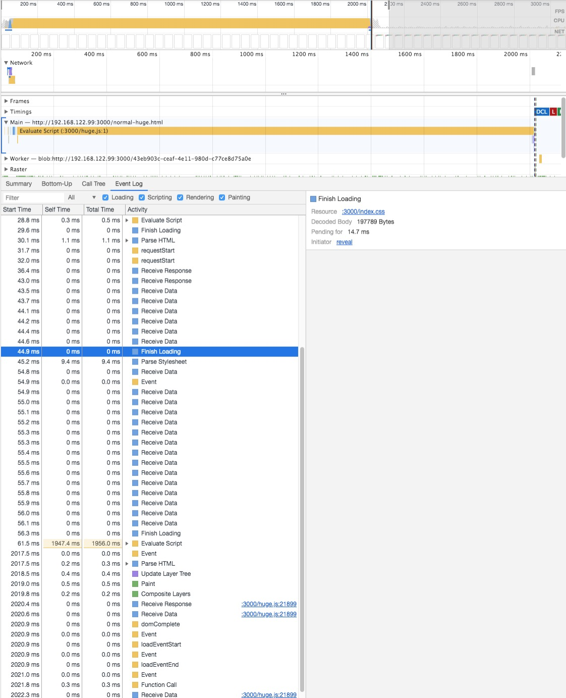

# 脚本对渲染的影响

ps：为了放大脚本对渲染的影响，在脚本加上去了斐波那契计算。

## 普通脚本

### 脚本文件比样式文件小

脚本文件比样式文件小，意味着 JS 会比 CSS 下载完，但 JS 会等待 CSS 加载和渲染树的构建完成后在执行，

- [normal.html](./normal.html)
- [index.css](./index.css)
- [index.js]('./index.js)

测试结果：JS 会阻塞渲染

### 脚本文件与样式文件大小相近

脚本文件比样式文件小，意味着 JS 和 CSS 下载完成时间大致相近

- [normal-large.html](./normal-large.html)
- [index.css](./index.css)
- [large.js]('./large.js)

测试结果：JS 会阻塞渲染

### 脚本文件比样式文件大

脚本文件比样式文件大，意味着 CSS 会比 JS 先下载完。

- [normal-huge.html](./normal-huge.html)
- [index.css](./index.css)
- [huge.js]('./huge.js)

测试结果：JS 不会阻塞渲染

### 脚本文件比样式文件大但有缓存

脚本文件比样式文件大，意味着 CSS 会比 JS 先下载完。

- [normal-huge.html](./normal-huge.html)
- [index.css](./index.css)
- [huge.js]('./huge.js)

测试结果：JS 会阻塞渲染

## async 脚本

会阻塞渲染

## defer 脚本

会阻塞渲染

## delay 脚本

不会阻塞渲染
