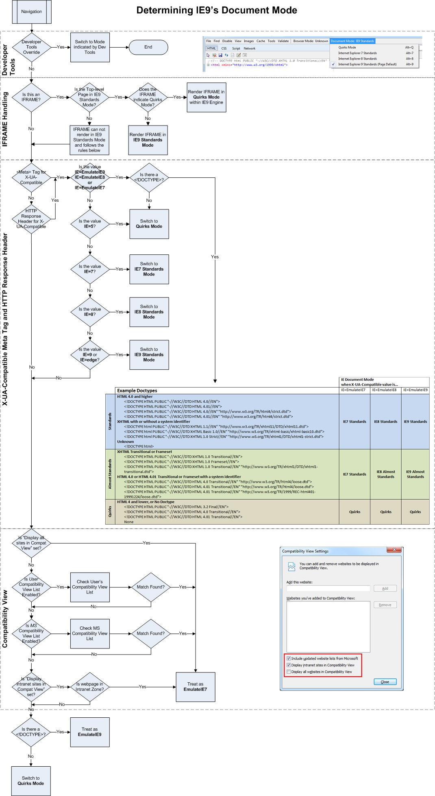

**Doctype 是什么？**

> DOCTYPE，文档类型，一个文档类型标记是一种标准通用标记语言的文档类型声明，它的目的是要告诉标准通用标记语言解析器，它应该使用什么样的文档类型定义（DTD）来解析文档。Doctype 还会对浏览器的渲染模式产生影响，不同的渲染模式会影响到浏览器对于 CSS 代码甚至 JavaScript 脚本的解析，所以Doctype 是非常关键的，尤其是在 IE 系列浏览器中，由 DOCTYPE 所决定的 HTML 页面的渲染模式至关重要。

要点

1. 使用什么样的文档类型定义（DTD）来解析文档；
2. 影响浏览器的渲染模式，进而影响 CSS 和 JavaScript 的解析；

# 三种文档模式
1. Quirks Mode - 怪异模式

    **为什么会有怪异模式**

    > 在 2001 年 IE6 正式发布之前，当时的市面主要就是 IE 和 Netscape 的 Navigator 两款浏览器，而 IE 拥有很大的用户群，所以大多数的页面都是针对 IE 而设计的，但是 IE 的渲染引擎却没有遵循 W3C 的规范，当时微软已经认识到 W3C 规范的重要性，所以当 IE 发展到 IE6 的时候，渲染引擎（MSHTML.dll）做出了一个重要的改变，将自己原先不符合 W3C 规范中的盒模型 box mode 绘制方式改为与 W3C 标准一致（后面会详细讨论），由于这个重大的改动，原先针对 IE 旧版本所设计的 HTML 页面都不能正确显示了，所以在 IE6 发布的时候附带了一个切换回 IE5 页面渲染方式的功能，这个功能中就首次提出了 Quirks Mode。

2. Almost Standards Mde - 近似标准模式，与标准模式非常类似，但确实有小的差别，主要体现在对于表格单元格内垂直方向布局渲染差异；

    **什么是近似标准模式**

    > 从 IE8、Firefox、Chrome、Safari、Opera 7.5 开始，这些浏览器的标准模式更加严格的遵循了 CSS2.1 规范，故对于在目前看来不太“标准”的以前的标准模式，被赋予了“近似标准模式”的名字。但是在较早的 IE6 IE7 以及 Opera 7.5 之前版本中，浏览器无法严格遵循 CSS2.1 规范，故对于它们来说没有这个近似标准模式，也可以理解为它们的近似标准模式就是标准模式。

3. Standards Mode - 标准模式

# 设置文档模式

**如何设置文档模式**

非 IE 浏览器一般不需要考虑文档模式，IE 浏览器的文档模式是如何设置的可以参考下图

备注：开发者工具 > iframe > X-UA-Compatible > Compatible View > Doctype

**如何使用 `X-UA-Compatible`**

- 是什么？ - `X-UA-Compatible` 是 IE8 及以上版本的一个专有 `<meta>` 属性，它告诉浏览器采用何种 IE 版本的文档模式 去渲染网页；
- 为什么？ - > 在 IE8 刚推出的时候，很多网页由于重构的问题，无法适应较高级的浏览器，所以使用`X-UA-Compatible` 标签强制 `IE8` 采用低版本方式渲染；
- 怎么用？

    - `<meta http-equiv="X-UA-Compatible" content="IE=7; IE=9" />` - IE7/8 使用 IE7 的渲染模式，IE9 使用自己的文档模式；
    - `<meta http-equiv="X-UA-Compatible" content="IE=8" />` - IE8 及以上版本使用 IE8 的文档染模式；
    - `<meta http-equiv="X-UA-Compatible" content="IE=EmulateIE8" />` - IE8 及以上版本模拟 IE8 的文档模式，根据 `!DOCTYPE` 来决定使用 IE8 标准模式还是怪异模式；
    - `<meta http-equiv="X-UA-Compatible" content="IE=Edge" />` - 使用最新版本的文档模式；
    - `<meta http-equiv="X-UA-Compatible" content="IE=5" />` - 怪异模式；

- 备注：也可以在 HTTP 响应头部也可以设置 `X-UA-Compatible`，但优先级比 meta 标签更低。

参考文献

- [给网站添加X-UA-Compatible标签](http://lightcss.com/add-x-ua-compatible-meta-to-your-website/)
- [“X-UA-Compatible” content=“IE=9; IE=8; IE=7; IE=EDGE”](http://stackoverflow.com/questions/14611264/x-ua-compatible-content-ie-9-ie-8-ie-7-ie-edge)
- [IE=EmulateIE8和IE=IE8的区别](http://blog.csdn.net/tenfyguo/article/details/8057007)

**浏览器是如何决定使用那种模式的**

在各浏览器内核实现中，几乎都存在一个名单用于记录这些常见的 DOCTYPE 所对应的模式，例如 WebKit 内核中 DocTypeStrings.gperf 文件。各浏览器名单列表中触发模式的不同导致了某些 DOCTYPE 出现在不同浏览器中触发了不同模式的现象 。而对于名单之外的 DOCTYPE，浏览器之间处理的差异也会导致触发不同的模式，比如可能有的浏览器会将名单之外的 DOCTYPE 当作混杂模式，而有的却会一律当作标准模式。

**如何识别浏览器模式**

`document.compatMode`

- `BackCompat` - 怪异模式
- `CSS1Compat` - 标准模式

IE 也可以使用 `document.documentMode` 来判断

- 等于 5 - 怪异模式
- 大于 5 - 标准模式

**不同模式之间的区别**

0. 支持的元素不同 - 参考 [HTML 元素和有效的 DTD](http://www.w3school.com.cn/tags/html_ref_dtd.asp)；
1. 盒模型不同 - 怪异模式下宽度和高度包含边框和内边距，而标准模式只是内容大小；
2. 图片元素的垂直对齐方式不同 - 怪异模式下内联元素里的图片的 vertical-align 为 bottom，而标准模式为 baseline；
3. `<table>` 元素中的字体不同 - 怪异模式的表格单元格不会继承或部分继承（不同浏览器不一致）字体样式，而标准模式会全部继承；
4. 内联元素的尺寸不同 - 怪异模式下可以自定义 non-replaced inline 元素的大小，而标准模式下不可以；
5. 元素的百分比不同 - 当一个元素使用百分比高度时，父元素没有设置固定高度，但某个祖先元素有设置。在怪异模式下有些浏览器按照最近祖先的高度计算，有些浏览器直接设置大小为 0，而在标准模式下高度取决于内容的变化；
6. 元素溢出的处理不同 - 在标准模式下，overflow 取默认值 visible，即溢出可见，这种情况下，溢出内容不会被裁剪，呈现在元素框外。而在怪异下，该溢出被当做扩展 box 来对待，即元素的大小由其内容决定，溢出不会被裁剪，元素框自动调整，包含溢出内容；

**实际应用**

只使用标准模式

1. `<!DOCTYPE html>`
2. `<meta http-equiv="X-UA-Compatible" content="IE=edge">`

# 区分浏览器模式
IE 浏览器的开发者工具提供了 "浏览器模式" 和 "文档模式"。

**浏览器模式 VS 文档模式**

- 浏览器模式：告诉服务器端发起请求的是什么浏览器 —— 通过修改 `navigator.userAgent` 来模拟不同版本的浏览器，此外还会影响 HTML 条件注释的执行；
- 文档模式：同上文的 DOCTYPE

**浏览器模式和文档模式对照表**

| browser mode | document mode | userAgent | documentMode | compactMode/ |
| --- | --- | --- | -- | -- |
| IE9 | IE9 | `Mozilla/5.0 (compatible; MSIE 9.0; Windows NT 6.1; Trident/5.0)` | 9 | CSS1Compat |
| IE8 | IE8 | `Mozilla/4.0 (compatible; MSIE 8.0; Windows NT 6.1; Trident/4.0; SLCC2; .NET CLR 2.0.50727; .NET CLR 3.5.30729; .NET CLR 3.0.30729; Media Center PC 6.0; .NET4.0C; .NET4.0E)` | 8 | CSS1Compat |
| IE7 | IE7 | `Mozilla/4.0 (compatible; MSIE 7.0; Windows NT 6.1; SLCC2; .NET CLR 2.0.50727; .NET CLR 3.5.30729; .NET CLR 3.0.30729; Media Center PC 6.0; .NET4.0C; .NET4.0E)` | 7 | CSS1Compat |
| IE9/8/7 | Quirks | `Mozilla/5.0 (compatible; MSIE 9.0; Windows NT 6.1; Trident/5.0)` / `Mozilla/4.0 (compatible; MSIE 8.0; Windows NT 6.1; Trident/4.0; SLCC2; .NET CLR 2.0.50727; .NET CLR 3.5.30729; .NET CLR 3.0.30729; Media Center PC 6.0; .NET4.0C; .NET4.0E)` / `Mozilla/4.0 (compatible; MSIE 7.0; Windows NT 6.1; SLCC2; .NET CLR 2.0.50727; .NET CLR 3.5.30729; .NET CLR 3.0.30729; Media Center PC 6.0; .NET4.0C; .NET4.0E)` | 5 | BackCompat |
| IE9/8/7 Compatible | IE9/8/7/Quirks | `Mozilla/4.0 (compatible; MSIE 7.0; Windows NT 6.1; Trident/5.0; SLCC2; .NET CLR 2.0.50727; .NET CLR 3.5.30729; .NET CLR 3.0.30729; Media Center PC 6.0; .NET4.0C; .NET4.0E)` | 9/8/7/5 | CSS1Compat/BackCompat |

备注：

- IE 浏览器的兼容模式模拟的是 IE7，并且在 `navigator.userAgent` 上标识了 `Trident/5.0`；
- IE 浏览器的兼容模式是由浏览器设置决定的，具体设置在 "菜单" > “工具” > "兼容模式设置"；
- 浏览器模式不会影响 CSS 和 JavaScript 的解析，但文档模式会影响，例如 IE8 文档模式不能使用 `Object.create`，但 IE9 文档模式下的任何浏览器模式都可以使用；

**模拟浏览器**

在测试的时候，一般不用区分浏览器模式和文档模式，只要同时调整开发者工具里的这两种模式就行了。例如：设置浏览器模式为 IE8，文档模式为 IE8，用于模拟 IE8 浏览器。

参考

- [How IE8 Determines Document Mode](https://blogs.msdn.microsoft.com/ie/2010/03/02/how-ie8-determines-document-mode/) - IE8 如何决定文档模式
- [Difference between “Browser Mode” and “Document Mode” in Internet Explorer](http://stackoverflow.com/questions/6661313/difference-between-browser-mode-and-document-mode-in-internet-explorer) - 区分浏览器模式和文档模式
- [IE8 browser mode vs document mode](http://stackoverflow.com/questions/2950598/ie8-browser-mode-vs-document-mode) - 区分浏览器模式和文档模式
- [What's the difference between 'quirks mode' and 'compatibility mode' in IE?](http://stackoverflow.com/questions/6731001/whats-the-difference-between-quirks-mode-and-compatibility-mode-in-ie) - 区分怪异模式和兼容模式
- [JavaScript: Can I detect IE9 if it's in IE7 or IE8 compatibility mode?](http://stackoverflow.com/questions/5825385/javascript-can-i-detect-ie9-if-its-in-ie7-or-ie8-compatibility-mode) - 识别兼容模式

# 统计分析
互联网热门网站

| 网站 | DOCTYPE | X-UA-Compatible | browser mode | document mode |
| --- | --- | --- | --- | --- |
| 百度/新浪/腾讯/优酷/天猫/淘宝/苏宁易购/携程 | `<!DOCTYPE html>` | `<meta http-equiv="X-UA-Compatible" content="IE=Edge">` | IE9 | IE9 |
| 贴吧/京东/东方财富/百度地图 | `<!DOCTYPE html>` | `<meta http-equiv="X-UA-Compatible" content="IE=edge,chrome=1">` | IE9 | IE9 |
| 网易/凤凰网/国美在线/汽车之家/58 同城/途牛/唯品会 | `<!DOCTYPE html>` | | IE9 | IE9 |
| 搜狐 | `<!DOCTYPE html PUBLIC "-//W3C//DTD XHTML 1.0 Transitional//EN" "http://www.w3.org/TR/xhtml1/DTD/xhtml1-transitional.dtd">` | `<meta http-equiv="X-UA-Compatible" content="IE=EmulateIE7" />` | IE9 Compatible | IE7 |
| 赶集网 | `<!DOCTYPE html PUBLIC "-//W3C//DTD XHTML 1.0 Transitional//EN" "http://www.w3.org/TR/xhtml1/DTD/xhtml1-transitional.dtd">` | | IE9 | IE9 |

- https://www.hao123.com
- http://hao.360.cn/shenghuowz.html

# 常见问题
1. Doctype作用？标准模式与兼容模式各有什么区别?

    >（1）、<!DOCTYPE>声明位于位于HTML文档中的第一行，处于 <html> 标签之前。告知浏览器的解析器用什么文档标准解析这个文档。DOCTYPE不存在或格式不正确会导致文档以兼容模式呈现。
    >
    >（2）、标准模式的排版 和JS运作模式都是以该浏览器支持的最高标准运行。在兼容模式中，页面以宽松的向后兼容的方式显示,模拟老式浏览器的行为以防止站点无法工作。

2. HTML5 为什么只需要写 `<!DOCTYPE HTML>`？

    >HTML5 不基于 SGML，因此不需要对 DTD 进行引用，但是需要 doctype 来规范浏览器的行为（让浏览器按照它们应该的方式来运行）；
    >
    >而 HTML4.01 基于 SGML ,所以需要对 DTD 进行引用，才能告知浏览器文档所使用的文档类型。

3. 浏览器模式和文档模式哪个会影响 HTML 条件注释？

    浏览器模式，测试示例参考 [conditional comments](./test/conditional-comments.html)

# 参考文献

- [CS002: DOCTYPE 与浏览器模式分析](http://w3help.org/zh-cn/casestudies/002)
- [怪异模式（Quirks Mode）对 HTML 页面的影响](http://www.ibm.com/developerworks/cn/web/1310_shatao_quirks/)
- [What is DOCTYPE?](http://stackoverflow.com/questions/414891/what-is-doctype)
- [Uppercase or lowercase doctype?](http://stackoverflow.com/questions/7020961/uppercase-or-lowercase-doctype)
- [Set HTML5 doctype with XSLT](http://stackoverflow.com/questions/3387127/set-html5-doctype-with-xslt)
- [HTML5 is not based on SGML, so what is it based on then?](http://stackoverflow.com/questions/16185880/html5-is-not-based-on-sgml-so-what-is-it-based-on-then)
- [Any reason not to start using the HTML 5 doctype? [closed]](http://stackoverflow.com/questions/5629/any-reason-not-to-start-using-the-html-5-doctype)
- [Activating Browser Modes with Doctype](https://hsivonen.fi/doctype/)
- [HTML5标准学习 – DOCTYPE](http://www.cnblogs.com/GrayZhang/archive/2011/03/31/learning-html5-doctype.html)
