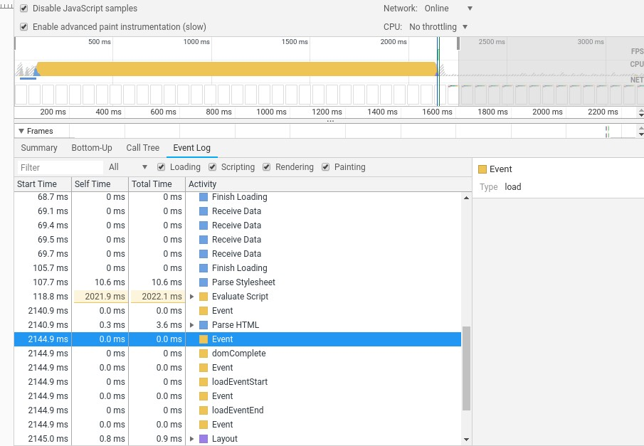
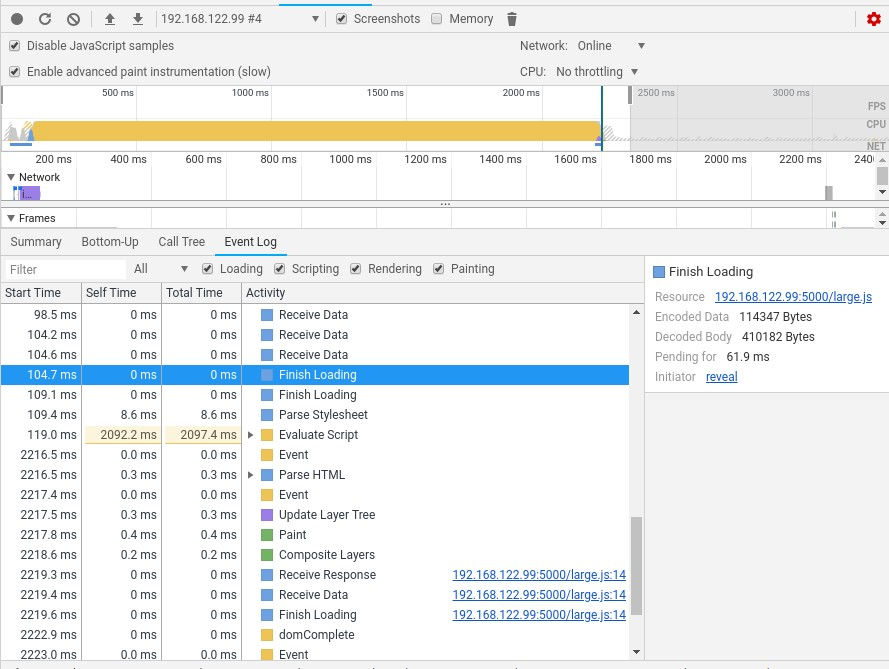
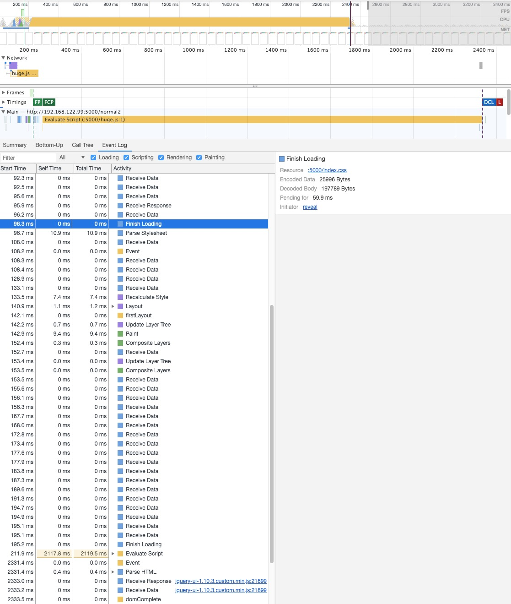
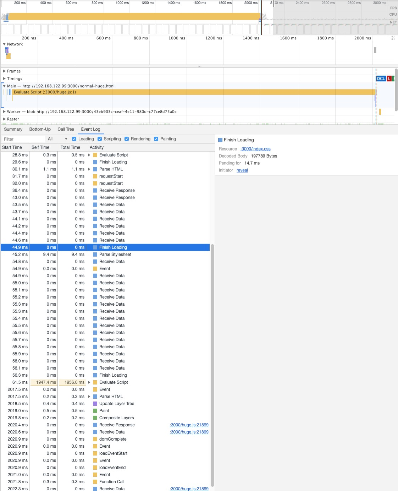

# script block the first rendering

## normal

### script is smaller than css

Script downloading is faster than css, but script will wait until css download and parse.

- [normal.html](./normal.html)
- [index.css](./index.css)
- [index.js]('./index.js)

Test result: script block the first rendering

### script's size is equal with css

- [normal-large.html](./normal-large.html)
- [index.css](./index.css)
- [large.js]('./large.js)

Test result: script block the first rendering

### script is larger than css

- [normal-huge.html](./normal-huge.html)
- [index.css](./index.css)
- [huge.js]('./huge.js)

Test result: script does't block the first rendering

### script is larger than css with cache

- [normal-huge.html](./normal-huge.html)
- [index.css](./index.css)
- [huge.js]('./huge.js)

Test result: script block the first rendering

## async script

script block the first rendering

## defer script

script block the first rendering

## delay script

script does't block the first rendering
