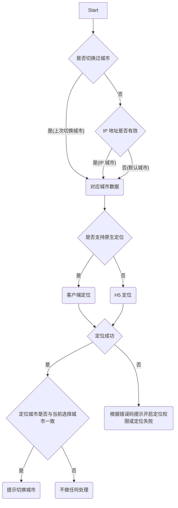

```mermaid
graph TD
Start --> A
A{是否切换过城市}
A -->|"是(上次切换城市)"|B
A -->|否|AB
AB{IP 地址是否有效}
AB -->|"是(IP 城市)"|B
AB -->|"否(默认城市)"|B
B(对应城市数据) -->C
C{是否支持原生定位}
C -->|是|CA(客户端定位)
C -->|否|CB(H5 定位)
CA -->D
CB -->D
D{定位成功}
D -->|是|E
D -->|否|DB(根据错误码提示开启定位权限或定位失败)
E{定位城市是否与当前选择城市一致}
E -->|是|EA(提示切换城市)
E -->|否|EB(不做任何处理)
```