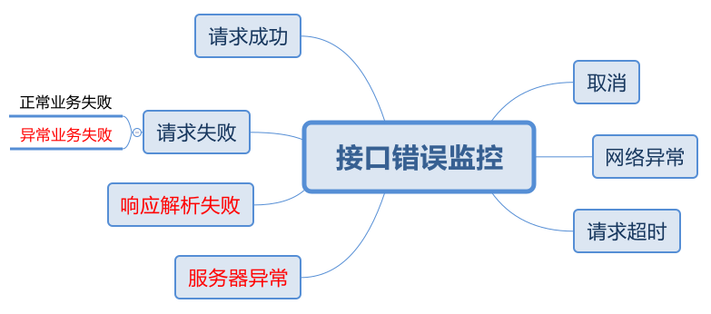

测试 Ajax 由于网络问题请求失败的特征。



## XMLHttpRequest

- 请求取消

    ```
    readyState: 1
    readyState: 4
    status: 0
    statusText: 
    responseType: 
    responseText: 
    response: 
    abort: ProgressEvent - type: abort, lengthComputable: false, loaded: 0, total: 0
    ```

    备注：请求取消会正常触发状态完成事件，响应状态为 0。此外，可以通过 abort 事件判断出网络问题。

- 网络异常

    ```
    readyState: 1
    readyState: 4
    status: 0
    statusText: 
    responseType:
    responseText: 
    response: 
    error: ProcessEvent - type: error, lengthComputable: false, loaded: 0, total: 0
    ```

    备注：网络异常会正常触发状态完成事件，响应状态为 0。此外，可以通过 error 事件判断出网络问题。

- 请求超时

    ```
    readyState: 1
    readyState: 4
    status: 0
    statusText:
    responseType:
    responseText:
    response:
    timeout: ProcessEvent - type: timeout, lengthComputable: false, loaded: 0, total: 0
    ```

    备注：超时请求会正常触发状态完成事件，响应状态为 0。此外，可以通过 timeout 事件判断出超时问题。

- 服务器异常

    ```
    readyState: 1
    readyState: 2
    readyState: 4
    status: 500
    statusText: Internal Server Error
    responseType: 
    responseText: Internal Server Error
    response: Internal Server Error
    ```

    备注：通过响应状态码判断即可

- 响应解析失败

    ```
    readyState: 1
    readyState: 2
    readyState: 4
    status: 200
    statusText: OK
    responseType: 
    responseText: Hello World!
    response: Hello World!
    json: Unexpected token H in JSON at position 0
    ```

    备注：通过 `try..catch` 检测

- 业务异常

    ```
    readyState: 1
    readyState: 2
    readyState: 4
    status: 404
    statusText: Not Found
    responseType: 
    responseText: Not Found
    response: Not Found
    ```

    备注：通过响应状态码或者服务端的相应内容判断

- 请求成功

    ```
    readyState: 1
    readyState: 2
    readyState: 4
    status: 200
    statusText: OK
    responseType: 
    responseText: {"message":"Hello World!"}
    response: {"message":"Hello World!"}
    ```

## Fetch

- 网络异常

    ```
    TypeError: Failed to fetch
    ```

    备注：网络异常会立刻抛出一个 TypeError 错误

- 请求超时

    ```
    TypeError: Failed to fetch
    ```

    备注：fetch 原生不支持设置超时时间，在 chrome 大概在请求超出 4 分钟后会出现一个类似网络异常的 TypeError（无法区分超时，还是网络异常）。

- 服务器异常

    ```
    ok: false
    status: 500
    statusText: Internal Server Error
    type: basic
    responseText: Internal Server Error
    ```

    备注：通过响应状态码判断

- 响应解析失败

    ```
    ok: true
    status: 200
    statusText: OK
    type: basic
    json: Unexpected token H in JSON at position 0
    responseText: Hello World!
    ```

    备注：通过 `try..catch` 检测

- 业务异常

    ```
    ok: false
    status: 404
    statusText: Not Found
    type: basic
    responseText: Not Found
    ```

    备注：通过响应状态码或者服务端的相应内容判断

- 请求成功

    ```
    ok: true
    status: 200
    statusText: OK
    type: basic
    json: {"message":"Hello World!"}
    responseText: {"message":"Hello World!"}
    ```

## Axios

- 请求取消

    ```
    error: code: undefined, name: undefined, message: Operation canceled by the user., isAxiosError: undefined
    ```

    备注：请求取消会立刻抛出一个 axios.Cancel 实例，包含属性 message，对应取消时传入的参数

- 网络异常

    ```
    error:  code: undefined, name: Error, message: Network Error, isAxiosError: true
    ```

    备注：网络异常会立刻抛出一个 AxiosError 实例，其 message 为 "Network Error"。

- 请求超时

    ```
    error: code: ECONNABORTED, name: Error, message: timeout of 3000ms exceeded, isAxiosError: true
    ```

    备注：支持设置超时事件，请求超时会立刻抛出一个 AxiosError 实例，其 message 为 "timeout of xxxms exceeded"，且带有 code 值为 ECONNABORTED。

- 服务器异常

    ```
    status: 500
    statusText: Internal Server Error
    data: "Internal Server Error"
    ```

    备注：通过响应状态码判断

- 响应解析失败

    ```
    status: 200
    statusText: OK
    data: "Hello World!"
    json: Unexpected token H in JSON at position 0
    ```

    备注：Axios 默认设置响应类型为 json，且自动尝试将响应内容转为 JSON，失败了不会抛出任何错误。如果需要检测响应格式错误问题，需要将响应类型改为 text，并自行在外部通过 `try..catch解析失败。

- 业务异常

    ```
    status: 404
    statusText: Not Found
    data: "Not Found"
    ```

    备注：通过响应状态码判断

- 请求成功

    ```
    status: 200
    statusText: OK
    data: "{\"message\":\"Hello World!\"}"
    ```

## 总结

- XMLHttpRequst 是最原始的 Ajax 请求方式，能够区分出各种接口异常；
- Fetch 不支持配置超时时间、不支持取消请求，且无法区分网络异常和请求超时；
- Axios 封装简化了 XMLHttpRequest 的用法，但需要注意 Axios 默认采用 json 作为响应内容类型，需要跟进自身需求进行调整。

---

- [What does status=canceled for a resource mean in Chrome Developer Tools?](https://stackoverflow.com/questions/12009423/what-does-status-canceled-for-a-resource-mean-in-chrome-developer-tools#13459106)
