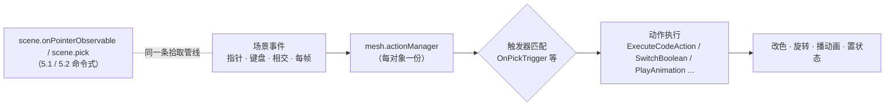

import { Canvas, Controls, Meta } from '@storybook/addon-docs/blocks';
import * as Stories from './action-manager.stories';

<Meta of={Stories} name="Docs" />

# Action Manager

Babylon.js 的 `ActionManager` 把"场景对象上发生的事件"直接映射为"要执行的动作"：你给 mesh 挂一份 `actionManager`，用 `registerAction` 注册"`OnPickTrigger` 时执行这段代码"，引擎在事件发生时自动触发——不需要像 5.1 [Observables 与事件](?path=/docs/observables-and-events--docs) 那样手写订阅与分发，也不需要像 5.2 [指针与拾取](?path=/docs/pointer-input-and-picking--docs) 那样每次 `scene.pick` 后自己读 `pickInfo`。它是一层**声明式**的便捷糖，底层走的仍是同一条指针 / 拾取管线。

先建立三条判断，后面的 API 才不容易混：

- **触发器决定"何时"，动作决定"做什么"。** 触发器（trigger）是 `ActionManager` 类上的静态数字常量（`OnPickTrigger=1`、`OnPointerOverTrigger=9`、`OnKeyDownTrigger=14` 等）；动作（action）是 `IAction` 的实现——`ExecuteCodeAction` 跑任意回调、`SwitchBooleanAction` 翻转布尔、`PlayAnimationAction` 播动画。`registerAction(new SomeAction(trigger, ...))` 把两者绑死。
- **ActionManager 挂在对象上，每个 mesh 一份。** `mesh.actionManager = new ActionManager(scene)` 让该 mesh 参与指针 / 相交触发器分发；`scene.actionManager = new ActionManager(scene)` 处理键盘和每帧这类不绑特定 mesh 的事件。`mesh.actionManager` 默认 `null`，不挂就收不到事件。
- **与 Observable 是分层关系，不是二选一。** ActionManager 是面向场景对象的声明式层，引擎在指针 / 相交发生时自动调用对应 mesh 的 `actionManager.processTrigger`；需要全局控制、位掩码过滤、跨 mesh 协调或主动查询命中时，退到 5.1 Observable / 5.2 拾取。两者可以共存——ActionManager 内部就是用同一条拾取管线判定的。



| 对象 / API | 默认 / 常用 | 回查要点 |
| --- | --- | --- |
| `mesh.actionManager` | `null`（默认无） | 赋 `new ActionManager(scene)` 后该 mesh 才参与触发器分发；置 `null` 解绑 |
| `scene.actionManager` | `null`（默认无） | 键盘 / 每帧这类不绑 mesh 的触发器挂在 scene 级；要时显式创建 |
| `new ActionManager(scene?)` | scene 可省略但建议传 | mesh 级传当前 scene；scene 级 `scene.actionManager = new ActionManager(scene)` |
| `actionManager.registerAction(action)` | 返回 `Nullable<IAction>` | 成功返回 action 本身；失败返回 `null`（如 mesh 级注册 `OnEveryFrameTrigger`） |
| `ActionManager.OnPickTrigger` | `1` | 点击触发；走拾取管线，要求 `mesh.isPickable`，拖动期间不触发（同 POINTERPICK） |
| `ActionManager.OnPointerOverTrigger` / `OnPointerOutTrigger` | `9` / `10` | 指针进入 / 离开 mesh 包围；用同一套 POINTERMOVE 拾取判定 |
| `ActionManager.OnIntersectionEnterTrigger` / `OnIntersectionExitTrigger` | `12` / `13` | mesh 与其它 mesh 开始 / 结束相交；引擎为注册了相交触发器的 mesh 每帧求交 |
| `ActionManager.OnKeyDownTrigger` / `OnKeyUpTrigger` | `14` / `15` | 键盘；挂在 `scene.actionManager`，且需 canvas 焦点（同 5.1） |
| `ActionManager.OnEveryFrameTrigger` | `11` | 每帧；只能挂 `scene.actionManager`，mesh 级注册返回 `null` |
| `new ExecuteCodeAction(trigger, (evt) => {}, condition?)` | 最常用的动作 | `evt: ActionEvent`，含 `source` / `pointerX/Y` / `meshUnderPointer` / `sourceEvent` |
| `actionManager.hasSpecificTrigger(trigger, predicate?)` | `boolean` | 查询是否注册了某触发器；相交触发器带 mesh 参数时可用 predicate 精确匹配 |
| `ActionEvent.source` | 触发动作的 mesh / sprite | 与 5.2 `pickInfo.pickedMesh` 对应；`ExecuteCodeAction` 里取它做业务 |
| `ActionEvent.sourceEvent` | 原生 DOM 事件 | 键盘取 `evt.sourceEvent.key`；指针取 `evt.sourceEvent.button` 等 |
| `ActionEvent.pointerX` / `pointerY` | canvas 像素坐标 | 与 `scene.pointerX/Y` 对齐 |

## 触发器与动作

最小闭环只三步：给 mesh 挂 `ActionManager`、`registerAction` 一个 `ExecuteCodeAction`、在回调里写业务。点击 mesh 时引擎自动触发，不用自己监听 DOM 或订阅 observable。

```ts
import { ActionManager, ExecuteCodeAction } from '@babylonjs/core';

mesh.actionManager = new ActionManager(scene);

mesh.actionManager.registerAction(
  new ExecuteCodeAction(ActionManager.OnPickTrigger, (evt) => {
    // evt.source 是触发的 mesh；evt.sourceEvent 是 DOM PointerEvent。
    console.log('点了', evt.source.name, evt.pointerX, evt.pointerY);
  }),
);
```

`registerAction` 接收的 action 同时封装了"触发器"和"行为"：`new ExecuteCodeAction(ActionManager.OnPickTrigger, cb)` 把"`OnPickTrigger` 时执行 `cb`"这条规则交给 ActionManager；引擎在指针命中该 mesh 并满足"按下再松开、无拖动"时调 `mesh.actionManager.processTrigger(OnPickTrigger, evt)`，`evt` 是一个 `ActionEvent`。整个过程不需要你写 `scene.pick` 或 `onPointerObservable.add`——ActionManager 替你做了。

> ActionManager 不是独立的事件系统。`OnPickTrigger` / `OnPointerOverTrigger` 走的是和 5.2 完全相同的拾取管线，引擎只是在内部多了一层"把命中结果派发给对应 mesh 的 actionManager"。所以 `mesh.isPickable = false` 同样会让这些触发器收不到事件；相机 `attachControl` 拖动期间拾取点已移走，`OnPickTrigger` 与 `POINTERPICK` 一样不会被触发。

下面范例把这条声明式链路跑通，并和 5.1 的命令式 Observable 做正面对比。3 个 mesh（盒子 / 球 / 圆环）各有独立 `ActionManager`：点击盒子循环改色、点击球切换自旋、点击圆环切换放大，悬停时 emissive 提亮 + 微放大。切到「Observable 模式」后，**完全相同的视觉行为**改由单个 `scene.onPointerObservable` 订阅实现——从 `POINTERMOVE` / `POINTERPICK` 里自己推断 hover/click。读数给出最近触发的语义名、目标 mesh、执行动作和已注册动作数。

<Canvas of={Stories.Actions} />

<Controls of={Stories.Actions} />

| 读者操作 | 可观察证据 |
| --- | --- |
| ActionManager 模式点击盒子 | 自发光循环换色；读数「最近触发器」=`OnPickTrigger`，「执行动作」=`改色 → ...` |
| ActionManager 模式点击球 | 球开始 / 停止自旋；读数显示 `OnPickTrigger` + `开始旋转/停止旋转` |
| ActionManager 模式点击圆环 | 圆环放大 / 还原；读数显示 `OnPickTrigger` + `缩放目标 → ...` |
| 悬停任意 mesh | emissive 提亮、整体微放大；读数「最近触发器」=`OnPointerOverTrigger` |
| 移出 mesh | emissive 与缩放还原；读数显示 `OnPointerOutTrigger` |
| 切到「Observable 模式」 | 视觉行为完全一致；「已注册动作数」从 `9`（3 mesh × 3 触发器）变为 `1`（单订阅）；点击读数显示 `POINTERPICK`，悬停 / 移出显示 `POINTERMOVE`（over/out 是自己推断的） |
| 拖拽 canvas 旋转相机后松开 | 不触发 `OnPickTrigger`（拖动期间拾取点已移走）——与 5.2 `POINTERPICK` 同源 |

## 触发器清单

触发器都是 `ActionManager` 类上的**静态数字常量**，按位编号，按事件来源分四类。指针 / 相交类挂在 `mesh.actionManager`，键盘 / 每帧类挂在 `scene.actionManager`。

**拾取 / 指针**（走 scene 拾取管线，要求 `mesh.isPickable`，挂在 `mesh.actionManager`）

| 触发器 | 值 | 触发时机 |
| --- | --- | --- |
| `OnPickTrigger` | `1` | mesh 上按下并松开（无显著拖动）；与 5.2 `POINTERPICK` 同源 |
| `OnLeftPickTrigger` / `OnRightPickTrigger` / `OnCenterPickTrigger` | `2` / `3` / `4` | 左键 / 右键 / 中键点击；右键不会触发 `OnPickTrigger` |
| `OnDoublePickTrigger` | `6` | 同一 mesh 上连续两次 `OnPickTrigger` |
| `OnPickDownTrigger` / `OnPickUpTrigger` | `5` / `7` | mesh 上按下 / 松开（不等拖动判定，比 `OnPick` 更早） |
| `OnPickOutTrigger` | `16` | 在 mesh 上按下后移出再松开 |
| `OnLongPressTrigger` | `8` | 在 mesh 上长按（内部阈值约 500ms，按下不动直到超时才触发） |
| `OnPointerOverTrigger` / `OnPointerOutTrigger` | `9` / `10` | 指针进入 / 离开 mesh 包围；引擎在 POINTERMOVE 拾取时判定 |

**相交**（挂在 `mesh.actionManager`；引擎为注册了相交触发器的 mesh 每帧与场景中其它 mesh 求交）

| 触发器 | 值 | 触发时机 |
| --- | --- | --- |
| `OnIntersectionEnterTrigger` / `OnIntersectionExitTrigger` | `12` / `13` | mesh 与另一 mesh 开始 / 结束相交；`ActionEvent.source` 是注册动作的 mesh |

**键盘 / 每帧**（不绑特定 mesh，挂在 `scene.actionManager`）

| 触发器 | 值 | 触发时机 |
| --- | --- | --- |
| `OnKeyDownTrigger` / `OnKeyUpTrigger` | `14` / `15` | 键盘按下 / 松开；`evt.sourceEvent.key` 取键名。canvas 默认不可聚焦，需 `tabIndex=0`（同 5.1） |
| `OnEveryFrameTrigger` | `11` | 每帧触发；**只能挂 `scene.actionManager`**，mesh 级 `registerAction` 会返回 `null` |

**占位**

| 触发器 | 值 | 用途 |
| --- | --- | --- |
| `NothingTrigger` | `0` | 配合 `DoNothingAction` 或 Condition 做"什么都不做"的分支 |

`actionManager.hasSpecificTrigger(trigger, predicate?)` 用来查询某个 manager 是否注册了指定触发器。相交触发器带 mesh 参数时，第二参 `predicate` 能按参数精确匹配（"是否注册了与 mesh B 相交的 `OnIntersectionEnterTrigger`"）。引擎自己也用它判断是否要为某个 mesh 启用每帧相交检测——注册了 `OnIntersectionEnter/Exit` 的 mesh 才进入逐帧求交列表。

## 动作类型

所有动作都实现 `IAction`，构造签名统一是 `(trigger, ...业务参, condition?)`——最后一位 `condition` 可选，传 `Condition` 对象时只在条件为真才触发。

### ExecuteCodeAction：跑任意回调

最灵活、最常用的动作。构造签名：

```ts
new ExecuteCodeAction(
  trigger: number,
  func: (evt: ActionEvent) => void,
  condition?: Condition,
)
```

`ActionEvent` 的公开成员：`source`（触发的 mesh / sprite）、`pointerX` / `pointerY`（canvas 像素坐标）、`meshUnderPointer`（当前指针下的 mesh）、`sourceEvent`（原生 DOM 事件）、`additionalData`（相交触发器等的附加数据）。绝大多数业务只读 `evt.source`（拿被操作的 mesh）和 `evt.sourceEvent`（拿按键、按键修饰符）：

```ts
import { ActionManager, ExecuteCodeAction } from '@babylonjs/core';

// scene 级键盘：注册在 scene.actionManager 上
scene.actionManager = new ActionManager(scene);
scene.actionManager.registerAction(
  new ExecuteCodeAction(ActionManager.OnKeyDownTrigger, (evt) => {
    console.log('按下了', evt.sourceEvent.key); // evt.source 是 scene 本身
  }),
);

// mesh 级点击：注册在 mesh.actionManager 上
mesh.actionManager = new ActionManager(scene);
mesh.actionManager.registerAction(
  new ExecuteCodeAction(ActionManager.OnPickTrigger, (evt) => {
    (evt.source.material).emissiveColor.set(1, 0, 0); // evt.source 是被点的 mesh
  }),
);
```

> `evt.source` 在 mesh 级触发器里是触发 mesh，在 scene 级键盘 / 每帧触发器里是 scene。类型是 `any`，访问具体属性前按场景判断或断言。

### 其它内置动作

需要"翻转布尔""播动画""延迟"这类常见行为时，用专门的动作比 `ExecuteCodeAction` 里手写更直白，并且它们能与 `Condition` 配合做声明式状态机：

| 动作 | 构造签名（省略 condition） | 用途 |
| --- | --- | --- |
| `SwitchBooleanAction` | `(trigger, target, propertyPath)` | 翻转 target 上的布尔属性，如 `('isVisible')` 切显隐 |
| `SetStateAction` | `(trigger, target, value)` | 设 `target.state`（字符串）；配合 `StateCondition` 做状态机 |
| `PlayAnimationAction` | `(trigger, target, from, to, loop?)` | 在 target 上播一段关键帧动画（`from`/`to` 是帧区间） |
| `StopAnimationAction` | `(trigger, target)` | 停 target 上的动画 |
| `InterpolateValueAction` | `(trigger, target, propertyPath, toValue, duration?)` | 把属性平滑插值到 `toValue`（属性动画；condition、interpolation 是更靠后的可选参） |
| `DelayAction` | `(trigger, delay, children?)` | 延迟 `delay` 毫秒后执行子动作；可串联出"点击 → 等 200ms → 播动画" |
| `DoNothingAction` | `(trigger)` | 占位；常配合 Condition 做"条件不满足时什么都不做"的分支 |

```ts
import {
  ActionManager, DelayAction, DoNothingAction, InterpolateValueAction,
  PlayAnimationAction, SwitchBooleanAction,
} from '@babylonjs/core';

// 点击切换 mesh 显隐：声明式，一行表达"翻转 isVisible"
mesh.actionManager.registerAction(
  new SwitchBooleanAction(ActionManager.OnPickTrigger, mesh, 'isVisible'),
);

// 点击把 visibility 从当前值平滑插值到 0.3，持续 300ms
mesh.actionManager.registerAction(
  new InterpolateValueAction(ActionManager.OnPickTrigger, mesh, 'visibility', 0.3, 300),
);

// 点击 → 等 200ms → 播 0~30 帧动画（DelayAction 串联子动作）
mesh.actionManager.registerAction(
  new DelayAction(ActionManager.OnPickTrigger, 200,
    new PlayAnimationAction(ActionManager.OnPickTrigger, mesh, 0, 30, false)),
);
```

> `ExecuteCodeAction` 能做以上所有动作能做的事（手动写代码就行）；专门动作的价值在读起来更直白、能与 `Condition` 声明式配合。复杂业务逻辑或需要读 `pickInfo` 时仍回 `ExecuteCodeAction`。

### Condition：声明式触发门槛

`Condition` 是动作的第末位可选参数，为真才触发。三个常用子类：`ValueCondition(triggerOptions, target, propertyPath, comparison, value)` 比 `target.x > 5`、`PredicateCondition(scene, () => boolean)` 跑任意断言、`StateCondition(target, stateValue)` 检测状态属性。配合 `DoNothingAction` 可以做"满足某条件时什么都不做"的反向分支。

```ts
import { ActionManager, ExecuteCodeAction, ValueCondition, Condition } from '@babylonjs/core';

// 只有 mesh.metadata.score > 0 时点击才改色
const scorePositive = new ValueCondition(
  ActionManager.OnPickTrigger, mesh, 'metadata.score',
  ValueCondition.IsGreater, 0,
);
mesh.actionManager.registerAction(
  new ExecuteCodeAction(ActionManager.OnPickTrigger, () => recolor(mesh), scorePositive),
);
```

Condition 让"什么时候触发"也声明式化——但跨多个触发器或需要每帧重算的复杂判定，回到 `ExecuteCodeAction` 里 `if` 更直接。

## 与 Observable、拾取的边界

ActionManager、Observable（5.1）和主动拾取（5.2）共用同一条指针 / 拾取管线，只是抽象层级不同。选择哪种取决于"你要表达什么"：

| 需求 | 推荐 | 理由 |
| --- | --- | --- |
| 给单个 mesh 挂点击 / hover / 双击行为 | ActionManager | 声明式、自文档，规则挂在对象本身 |
| 同一行为挂多个 mesh，各自独立 | ActionManager | 每个 mesh 一份，天然隔离 |
| 全局快捷键、每帧状态推进 | `scene.actionManager` + `OnKeyDownTrigger` / `OnEveryFrameTrigger` | 不绑 mesh 的事件必须挂 scene 级 |
| mesh 进入 / 离开某区域 | `OnIntersectionEnterTrigger` | 引擎每帧求交，比手写距离判断省 |
| 只接收某几种事件类型 | Observable（`mask` 第二参） | ActionManager 没有 mask，每个触发器各注册一次 |
| 一事件影响多个对象 / 复杂分发 | Observable | 集中订阅，分发逻辑一目了然 |
| 任意时刻主动查询命中（瞄准线、tooltip 跟手） | `scene.pick` / `pickWithRay`（5.2） | 与事件无关的主动查询 |
| 自定义射线 / 三角形级过滤 | `pickWithRay` + `trianglePredicate`（5.2） | ActionManager 不暴露这层 |

边界判断的核心是：**ActionManager 是"面向场景对象"的声明式层，Observable 是"面向事件流"的命令式层**。前者把"mesh 被点了 → 改色"直接写成 mesh 自身的规则；后者把"屏幕上有指针事件 → 我来决定改谁"写成集中式分发。两者可以共存——范例里切到 Observable 模式时，ActionManager 被解绑（`mesh.actionManager = null`），同一条拾取管线改由 `onPointerObservable` 消费，视觉行为不变。

## 最佳实践

- `mesh.actionManager = null` 是解绑的正确方式；置空后引擎不再为该 mesh 做触发器判定，连同相交检测也会停。不要靠"不调用 `processTrigger`"自行绕开。
- 多个动作绑同一个触发器时各 `registerAction` 一次，引擎按注册顺序逐个触发；需要"条件满足才执行"用 `Condition`，不要在 `ExecuteCodeAction` 里手写 `if` 后忘记 else 分支。
- 指针 / 相交触发器要求 `mesh.isPickable = true`（默认）；把不想响应交互的 mesh（地面、辅助网格、隐形碰撞体）显式置 `false`，让默认拾取直接跳过——与 5.2 同一套规则。
- 键盘触发器挂 `scene.actionManager`，并给 canvas 设 `tabIndex = 0` 让它可聚焦（同 5.1）；否则 keydown 不进入 Engine 监听，`OnKeyDownTrigger` 不会触发。
- `OnEveryFrameTrigger` 只在 `scene.actionManager` 上有效；想做"mesh 每帧自检某条件"用 `scene.onBeforeRenderObservable`（5.1）或把逻辑收在 scene 级每帧动作里。
- 同样的行为，`ExecuteCodeAction` 能完全替代专门动作；用专门动作是为了读起来更直白、能声明式配 `Condition`。复杂业务或需要 `pickInfo` 时回到 `ExecuteCodeAction`。
- ActionManager 与 Observable 共存时两套都会响应同一指针事件——若要"只走一条路"，切模式时显式 `mesh.actionManager = null` 或 `observable.remove(observer)`，别让两套同时改同一状态。

## 常见问题

- 为什么注册了 `OnPickTrigger` 却不触发？
  三个常见原因：`mesh.isPickable` 被设成 `false`、`mesh` 不可见或被禁用（默认拾取要求 `isEnabled() && isVisible && isPickable`）、相机 `attachControl` 拖动期间按下与松开不在同一 mesh 上（与 5.2 `POINTERPICK` 同源，拖动不触发点击）。要"按下就触发"改用 `OnPickDownTrigger`。
- 为什么 `OnKeyDownTrigger` 收不到事件？
  两步排查：一是它必须挂在 `scene.actionManager`（mesh 级收不到键盘）；二是 canvas 默认不可聚焦，`canvas.tabIndex = 0` 后让用户点击或 Tab 进入再按键——同 5.1 课的键盘焦点问题。
- 为什么 `registerAction` 返回 `null`？
  注册失败。最常见的是把只能挂 scene 级的触发器（`OnEveryFrameTrigger`）注册到 mesh 级 ActionManager 上；引擎会打印警告并返回 `null`，该动作不会触发。
- ActionManager 和 `onPointerObservable` 同时挂，同一点击会触发两次吗？
  会，但是是两套独立机制：`onPointerObservable` 是 5.1 的订阅，ActionManager 是声明式层，引擎会分别处理。两套都活跃时点击会各跑一次回调——要"只走一条路"切模式时显式解绑另一边。
- 为什么 hover 高亮闪一下就没了？
  ActionManager 的 `OnPointerOver/Out` 是**边沿触发**（进入 / 离开各一次），不是每帧。若把高亮写在回调里、又每帧重置材质，鼠标停下后 `OnPointerOver` 不再触发，状态被每帧重置覆盖。把 hover 状态存进业务变量、每帧按状态应用（范例的做法），而不是只在回调里改一次。
- `ExecuteCodeAction` 里怎么拿到被点击的 mesh？
  读 `evt.source`。mesh 级触发器（`OnPickTrigger` / `OnPointerOverTrigger` 等）的 `source` 是触发的 mesh；scene 级触发器（`OnKeyDownTrigger` / `OnEveryFrameTrigger`）的 `source` 是 scene。`evt.sourceEvent` 是原生 DOM 事件，指针取 `button`、键盘取 `key`。
- `OnIntersectionEnterTrigger` 触发时怎么知道撞到了谁？
  `ActionEvent.source` 是注册动作的 mesh（A），但引擎不直接给你另一边的 mesh。常见做法是在回调里遍历 `scene.meshes` 自己做 `intersects` 判定，或用 5.2 的 `scene.pickWithRay` 做更精确的碰撞查询。

## 总结回顾

摘要：

`ActionManager` 是 Babylon.js 的声明式事件→动作层。`mesh.actionManager = new ActionManager(scene)` 后用 `actionManager.registerAction(new SomeAction(trigger, ...))` 把"何时 → 做什么"绑成一条规则，引擎在事件发生时自动 `processTrigger`。触发器是 `ActionManager` 上的静态数字常量：拾取 / 指针类（`OnPickTrigger=1` / `OnPointerOverTrigger=9` / `OnPointerOutTrigger=10` / `OnDoublePickTrigger=6` / `OnLongPressTrigger=8` 等）和相交类（`OnIntersectionEnter/ExitTrigger=12/13`）挂在 `mesh.actionManager`，键盘 / 每帧类（`OnKeyDown/KeyUpTrigger=14/15`、`OnEveryFrameTrigger=11`）挂在 `scene.actionManager`，后者 `OnEveryFrameTrigger` 在 mesh 级注册会返回 `null`。动作里 `ExecuteCodeAction(trigger, (evt) => {}, condition?)` 最常用，`evt.source` / `evt.sourceEvent` / `evt.pointerX/Y` 取上下文；`SwitchBooleanAction` / `SetStateAction` / `PlayAnimationAction` / `StopAnimationAction` / `InterpolateValueAction` / `DelayAction` / `DoNothingAction` 覆盖常见声明式行为，末位可选 `Condition` 做触发门槛。ActionManager 与 5.1 Observable、5.2 拾取共用同一条指针 / 拾取管线，是面向场景对象的便捷层——需要 mask 过滤、跨 mesh 协调、主动查询或自定义射线时退到那两课。

一句话：

> ActionManager 是"给 mesh 挂声明式触发器→动作"的便捷层——`OnPickTrigger` 走的是和 `POINTERPICK` / `scene.pick` 同一条拾取管线，区别只在 API 风格（声明式 vs 命令式）。

知识要点：

- `mesh.actionManager` 默认是什么？怎么让一个 mesh 参与 ActionManager 触发？怎么解绑？
- `registerAction` 返回什么？什么情况下返回 `null`？
- 拾取 / 相交类触发器挂在哪个 ActionManager？键盘 / 每帧类呢？`OnEveryFrameTrigger` 能否挂 mesh 级？
- `OnPickTrigger` 与 5.2 的 `POINTERPICK` 是什么关系？为什么相机拖动时两者都不触发？
- `ExecuteCodeAction` 的回调签名是什么？`ActionEvent` 有哪些常用成员？怎么拿到被点击的 mesh？
- 除了 `ExecuteCodeAction`，还有哪些内置动作？各自适合什么场景？
- ActionManager、Observable（5.1）、主动拾取（5.2）三者各自适合解决什么问题？边界在哪？

## 参考资料

- [Babylon.js Features：Actions（ActionManager 触发器与动作体系）](https://doc.babylonjs.com/features/featuresDeepDive/events/actions)
- [Babylon.js Features：Observables（5.1 Observable 命令式底座）](https://doc.babylonjs.com/features/featuresDeepDive/events/observables)
- [Babylon.js Features：Picking Collisions（5.2 拾取管线）](https://doc.babylonjs.com/features/featuresDeepDive/mesh/interactions/picking_collisions)
- [Babylon.js TypeDoc：ActionManager（触发器常量与 registerAction）](https://doc.babylonjs.com/typedoc/classes/BABYLON.ActionManager)
- [Babylon.js TypeDoc：ExecuteCodeAction](https://doc.babylonjs.com/typedoc/classes/BABYLON.ExecuteCodeAction)
- [Babylon.js TypeDoc：ActionEvent](https://doc.babylonjs.com/typedoc/classes/BABYLON.ActionEvent)
- [Babylon.js API Reference (TypeDoc)](https://doc.babylonjs.com/typedoc/)
