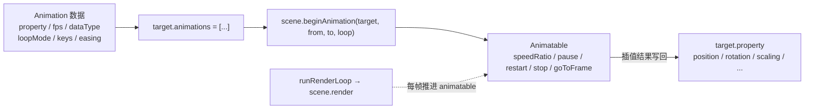

import { Canvas, Controls, Meta } from '@storybook/addon-docs/blocks';
import * as AnimationStories from './animation-system.stories';

<Meta of={AnimationStories} name="Docs" />

# 动画

4.1 课里用 `engine.runRenderLoop` + `onBeforeRenderObservable` 手写每帧推进：`box.rotation.y += dt * speed` 直接写在渲染回调里，对象状态由你自己算。Babylon 还内置了一套**关键帧动画系统**，把"属性怎么随时间变"声明成数据，引擎在 `scene.render()` 内部按时间插值，把结果直接写回目标属性。你只需要：声明一段 `Animation`（属性路径、帧率、关键帧、循环模式、可选缓动）→ 挂到 `target.animations` → 调 `scene.beginAnimation(target, from, to, loop)` 拿到 `Animatable` 控制句柄。

这套系统**不自带时钟**。它寄生在 4.1 讲过的引擎时序上：`runRenderLoop` 驱动 `scene.render()`，`scene.render()` 触发时所有活动 `Animatable` 按各自 `speedRatio` 推进一帧、插值并写回属性。停掉渲染循环（视口不可见、`engine.stopRenderLoop()`），动画也跟着停。所以这一课**不再写 `onBeforeRenderObservable` 推进状态**，而是把状态推进交给引擎，自己只管"播什么、怎么播"。



| 对象或参数 | 取值 / 默认 | 回查要点 |
| --- | --- | --- |
| `new Animation(name, targetProperty, framePerSecond, dataType, loopMode?, enableBlending?)` | `loopMode` 省略时为 `CYCLE` | `targetProperty` 是字符串属性路径，如 `"position"`、`"rotation.y"`、`"scaling"` |
| `dataType`（`Animation.ANIMATIONTYPE_*`） | `FLOAT` / `VECTOR3` / `QUATERNION` / `COLOR3` / `MATRIX` / `COLOR4` | 必须匹配被动画属性的类型；动整向量用 `VECTOR3`，动单个分量用 `FLOAT` |
| `loopMode`（`Animation.ANIMATIONLOOPMODE_*`） | 默认 `CYCLE` | 五种：`RELATIVE` / `CYCLE` / `CONSTANT` / `YOYO` / `RELATIVE_FROM_CURRENT`，见循环模式 |
| `setKeys([{ frame, value }])` | 关键帧数组 | `value` 类型必须与 `dataType` 一致；`frame` 是动画帧号，不是秒 |
| `target.animations = [...]` | 默认 `[]` | `beginAnimation` 默认从这里取；清空时赋 `[]` |
| `scene.beginAnimation(target, from, to, loop?, speedRatio?, onAnimationEnd?)` | 返回 `Animatable` | `loop` 是总开关（要不要循环）；具体怎么循环由每段 Animation 的 `loopMode` 决定 |
| `scene.beginDirectAnimation(target, animations, from, to, loop?, speedRatio?)` | 返回 `Animatable` | 不改 `target.animations`，临时传入动画数组；适合一次性播放 |
| `Animatable.speedRatio` | 默认 `1` | 运行时属性，写下去立即生效；`0.5` 慢一倍、`2` 快一倍、负值倒放 |
| `Animatable.pause()` / `restart()` / `stop()` | — | `pause` 保留位置；`stop` 移出激活列表并 `reset` |

## 关键帧动画：Animation 与 setKeys

`Animation` 是一段**纯数据**：声明它要动哪个属性（`targetProperty`）、用什么帧率（`framePerSecond`）、值什么类型（`dataType`）、关键帧序列（`setKeys`），以及到末帧后怎么办（`loopMode`）。它本身不持有 target，也不知道当前时间——播放时由 `Animatable` 读它的数据，每帧算出一个插值写回 target 的属性。

```ts
import { Animation, Vector3 } from '@babylonjs/core';

const moveAnim = new Animation(
  'moveX',                              // name：标识用
  'position',                           // targetProperty：字符串属性路径
  30,                                   // framePerSecond：每秒推进多少帧
  Animation.ANIMATIONTYPE_VECTOR3,      // dataType：与 position 的 Vector3 匹配
  Animation.ANIMATIONLOOPMODE_CYCLE,    // loopMode：到末帧后回到首帧
);

// 关键帧：frame 是动画帧号（不是秒），value 类型必须与 dataType 一致。
moveAnim.setKeys([
  { frame: 0, value: new Vector3(-3, 0.5, 0) },
  { frame: 60, value: new Vector3(3, 0.5, 0) },
]);
```

`targetProperty` 是字符串路径，引擎在播放时按路径写值：`"position"` 写整个 `Vector3`，`"rotation.y"` 只写 `rotation` 的 y 分量，`"scaling.x"` 写 scaling 的 x 分量。`dataType` 必须匹配——动整向量用 `VECTOR3`，动标量分量用 `FLOAT`，动四元数姿态用 `QUATERNION`。

| dataType | 适合的属性 | 每个关键帧 value 的形态 |
| --- | --- | --- |
| `ANIMATIONTYPE_FLOAT` | `rotation.y`、`position.x`、`intensity` | 一个数 |
| `ANIMATIONTYPE_VECTOR3` | `position`、`scaling`、`rotation`（欧拉角） | `Vector3` |
| `ANIMATIONTYPE_QUATERNION` | `rotationQuaternion` | `Quaternion`，球面插值 |
| `ANIMATIONTYPE_COLOR3` | `material.diffuseColor` | `Color3` |
| `ANIMATIONTYPE_MATRIX` | `bone.getMatrix()` 等 | `Matrix` |

`framePerSecond` 把"帧号"换算成时间：60 帧的动画在 30fps 下播 2 秒，在 60fps 下播 1 秒。**帧号只是关键帧的索引坐标**，和屏幕刷新率无关——引擎按真实时间推进，所以在 60Hz 和 144Hz 屏幕上动画总时长一致。

## 播放与控制：beginAnimation 与 Animatable

`scene.beginAnimation(target, from, to, loop?, speedRatio?)` 把 target 的 `animations` 数组里所有 Animation 一起播放，范围限定在 `from`~`to` 帧之间。它返回一个 `Animatable`——这是播放的**控制句柄**，后续暂停、重启、停止、跳帧、调速都靠它。

```ts
box.animations = [moveAnim, spinAnim];

// 第 4 参 loop=true 才会循环；具体怎么循环由每段 Animation 的 loopMode 决定。
const animatable = scene.beginAnimation(box, 0, 60, true, 1);

animatable.speedRatio = 2;        // 快放两倍（运行时属性，立即生效）
animatable.pause();               // 暂停：保留位置，属性值停在当前帧
animatable.restart();             // 从暂停处继续
animatable.goToFrame(30);         // 跳到第 30 帧
animatable.stop();                // 停止并移出激活列表
await animatable.waitAsync();     // 等动画结束（loop=false 时）
```

| 成员 | 含义 | 与相邻成员的差别 |
| --- | --- | --- |
| `speedRatio` | 速度倍率，默认 `1` | 运行时属性；改它不必重建动画；负值倒放 |
| `pause()` | 不再推进 `masterFrame` | 保留激活状态，当前属性值继续生效；与 `stop` 不同 |
| `restart()` | 从暂停处继续推进 | 不归零 `masterFrame` |
| `stop()` | 移出激活列表并 `reset` | 停止后属性值不再被写入 |
| `goToFrame(frame)` | 跳到指定帧 | 跳帧后继续按当前 `speedRatio` 推进 |
| `masterFrame` | 当前播放到的帧号 | 只读；用来推导进度 |
| `syncWith(other)` | 与另一个 Animatable 同步推进 | 两个动画 `from`/`to` 不同时用它对齐 |
| `waitAsync()` | 返回 Promise，动画结束 resolve | `loop=true` 时不会结束 |
| `weight` | 混合时的权重 | 配合 `scene.beginWeightedAnimation` 做动画混合 |

不想改 `target.animations`、只想临时播一段，用 `scene.beginDirectAnimation(target, animations, from, to, loop?, speedRatio?)`——它直接接收动画数组，不污染 target 的 `animations` 字段。

下面的实例把两段 Animation（位置 VECTOR3 + 旋转 FLOAT）挂到一个 box 上，用 `beginAnimation` 启动。控件映射到三个独立维度：**循环模式**写每段 Animation 的 `loopMode`（切值时 `stop` 旧 Animatable 再 `beginAnimation` 从 0 重播）；**缓动**写两段 Animation 的 `setEasingFunction`（同样从头重播）；**速度**只写 `Animatable.speedRatio`，是运行时属性，无需重建。

<Canvas of={AnimationStories.Anim} />

<Controls of={AnimationStories.Anim} />

| 读者操作 | 可观察证据 |
| --- | --- |
| 「循环模式」选 `CYCLE` | box 走到 +3 后**瞬移**回 -3 重新开始——这正是"回到首帧值"的字面含义 |
| 「循环模式」选 `YOYO` | box 在 -3 ↔ +3 之间来回反弹，没有跳变 |
| 「缓动」选 `Linear` | 匀速运动，box.position.x 读数均匀变化 |
| 「缓动」选 `Cubic` | 首末减速、中段加速，运动有"缓入缓出"的质感 |
| 「缓动」选 `Bounce` | 接近 +3 时出现多次小弹跳，position.x 读数来回抖动 |
| 「缓动」选 `Elastic` | 出发时过冲、末段弹性震荡，最夸张 |
| 调「速度」 | 动画快慢立即变化，但没有从头开始——证明 `speedRatio` 是运行时属性 |
| 看「当前帧进度」「box.position.x」 | 进度 0→100% 循环；position.x 在 -3.00 ↔ 3.00 之间，证明引擎把插值写回了属性 |

实例进入视口附近才启动 `runRenderLoop`，离开后停止并保留最后一帧——动画依赖引擎时序，离屏时不会空转。三种缓动曲线在**相同关键帧**下表现不同，这是横向对比「同样起止点、不同曲线」的运动质感差异。

## 循环模式：到末帧后怎么办

`loopMode` 是 `Animation` 的构造参数，决定播放到 `to` 帧之后怎么处理边界。`beginAnimation` 的 `loop` 参数只是"要不要循环"的总开关，**具体怎么循环完全由每段 Animation 的 `loopMode` 决定**。

| 常量 | 名称 | 到末帧后的行为 |
| --- | --- | --- |
| `ANIMATIONLOOPMODE_CYCLE` | 循环（默认） | 回到首帧值重新播放；端点不同时会"瞬移"回首点 |
| `ANIMATIONLOOPMODE_CONSTANT` | 保持 | 停在末帧值，不再推进 |
| `ANIMATIONLOOPMODE_RELATIVE` | 相对累加 | 每次循环在上一次末值基础上累加首末差值；属性会越走越远 |
| `ANIMATIONLOOPMODE_RELATIVE_FROM_CURRENT` | 从当前值累加 | 像 `RELATIVE`，但从当前属性值开始累加 |
| `ANIMATIONLOOPMODE_YOYO` | 来回反弹 | 正播到末帧后反播回首帧，循环往复（ping-pong） |

CYCLE 和 YOYO 最常用，差异就在端点处理：CYCLE 把关键帧视作"一次性片段"，播完跳回首帧（端点不同会有跳变）；YOYO 把关键帧视作"往返的一半"，播完反向回去（端点不必相等也平滑）。RELATIVE 适合"持续旋转"这类无止境累加——比如叶轮每秒转一圈，循环 100 次就转 100 圈，不会复位。

想让单次动画停在末帧（不循环），用 `scene.beginAnimation(target, 0, N, false)` 配 `ANIMATIONLOOPMODE_CONSTANT`，或在 `loop=false` 时直接监听 `animatable.onAnimationEndObservable`。

## 缓动函数：让运动有质感

默认的线性插值在两个关键帧之间匀速推进，看起来机械。**缓动函数**改变"进度随时间怎么走"——同样的首末关键帧，换一条曲线，运动质感完全不同。Babylon 内置一组缓动函数，都继承自 `EasingFunction`：

| 缓动函数 | 运动质感 | 典型场景 |
| --- | --- | --- |
| `CubicEase` / `QuadraticEase` / `QuarticEase` / `QuinticEase` | 多项式缓入缓出 | 通用 UI、镜头推拉 |
| `SineEase` | 正弦曲线，柔和 | 自然过渡 |
| `CircleEase` | 圆弧，陡起缓落 | 强调加速 |
| `ExponentialEase` / `PowerEase` | 指数/幂曲线 | 蓄力释放 |
| `BackEase` | 出发/收尾时反向过冲一点 | 弹性进入 |
| `BounceEase` | 末段多次小弹跳 | 落地、按钮回弹 |
| `ElasticEase` | 弹性震荡，过冲明显 | 强调动作、弹簧 |
| `BezierCurveEase` | 自定义四控制点贝塞尔 | 精细调曲线 |

每个缓动函数都用 `setEasingMode` 选择作用方向：

```ts
import { CubicEase, EasingFunction } from '@babylonjs/core';

const ease = new CubicEase();
// 三选一：EASEIN（默认，缓入）、EASEOUT（缓出）、EASEINOUT（缓入缓出）
ease.setEasingMode(EasingFunction.EASINGMODE_EASEINOUT);

moveAnim.setEasingFunction(ease);  // 挂到 Animation 上；传 null 等于线性
```

`setEasingFunction(null)` 等价于线性插值——回到上节实例把「缓动」选 `Linear` 即可看到对比。缓动挂在 **Animation** 上而不是 Animatable 上，所以同一次播放里的多段动画可以各有各的曲线；想"整段统一"就在每段上都 `setEasingFunction` 同一个实例。

回到上面的实例，把「缓动」从 `Linear` 切到 `Elastic`，box 出发时会冲过 -3、末段在 +3 附近震荡——同样的两帧关键帧，曲线让运动看起来完全不一样。这就是缓动的全部价值：**不改关键帧数据，只改时间映射**。

## AnimationGroup：把多目标动画打包

一个角色的"挥手"动画里，肩膀、手肘、手腕各有各的 Animation 和 target。一个个 `beginAnimation` 既啰嗦又难同步。`AnimationGroup` 把"哪段 Animation 作用在哪个 target 上"打包成一组，用一次 `start()` 一起播：

```ts
import { AnimationGroup } from '@babylonjs/core';

const group = new AnimationGroup('wave', scene);
group.addTargetedAnimation(shoulderAnim, shoulderNode);
group.addTargetedAnimation(elbowAnim, elbowNode);
group.addTargetedAnimation(wristAnim, wristNode);

// start(loop?, speedRatio?, from?, to?) 一次性启动整组
group.start(true, 1, 0, 60);

group.pause();      // 整组暂停
group.stop();       // 整组停止
group.reset();      // 整组归零
group.normalize(0, 60);  // 把组内所有动画对齐到 0..60 帧范围
```

| 成员 | 含义 |
| --- | --- |
| `addTargetedAnimation(animation, target)` | 把一段 Animation 绑定到一个 target，加入组 |
| `start(loop?, speedRatio?, from?, to?, isAdditive?)` | 启动整组，内部为每个 target 各建一个 `Animatable` |
| `pause()` / `reset()` / `stop()` | 统一控制组内所有 `Animatable` |
| `normalize(beginFrame?, endFrame?)` | 把组内时长不同的 Animation 对齐到同一帧范围 |
| `targetedAnimations` | 已添加的 `(animation, target)` 列表 |
| `onAnimationEndObservable` | 整组播完时触发 |

`AnimationGroup` 是加载模型动画的标准入口：`SceneLoader` 加载带动画的 glTF/GLB 时，结果里的 `result.animationGroups` 就是 `AnimationGroup[]`——加载器已经把每段动画和对应的骨骼/节点 target 绑好，直接 `result.animationGroups[0].start(true)` 就能播放。完整的加载流程、根节点处理和 `AssetContainer` 见 [加载模型](?path=/docs/sceneloader-and-gltf--docs)；蒙皮与骨骼层级见 [骨骼与蒙皮](?path=/docs/skeleton-and-bones--docs)。

形变动画（表情、混合变形）走另一条路——`MorphTargetManager`，与关键帧动画独立，见 [形变动画](?path=/docs/morph-targets--docs)。

## 最佳实践

- **手写 render loop 和 Animation 系统选一个推进同一属性，不要叠用。** 给同一个 `box.rotation.y` 既写 `onBeforeRenderObservable` 的每帧累加，又挂一段 Animation，两者会互相覆盖；Animation 已经在 `scene.render()` 内部写值。
- `loopMode` 在每个 Animation 上，`loop` 在 `beginAnimation` 上——两者是总开关和具体策略的关系；调循环行为时先确认 `loop=true`，否则 `loopMode` 不生效。
- 调速优先用 `animatable.speedRatio`，它是运行时属性；不要靠改 `framePerSecond` 或重排关键帧来调速。
- 切换不同动画（比如 idle ↔ walk）时，先 `stop()` 旧 `Animatable`，再 `beginAnimation` 新的；不复用旧句柄。
- 多目标、多段绑定的动画用 `AnimationGroup` 打包，不要循环 `beginAnimation`；加载 glTF 动画直接用 `result.animationGroups`。
- 动画属性路径写 `rotation.y`（FLOAT）还是 `rotation`（VECTOR3）看你是否同步动多个分量；动四元数姿态用 `rotationQuaternion` + `QUATERNION`，避免欧拉角的万向锁。
- 页面或组件销毁时，对每个 `Animatable` 调 `stop()`、对 `AnimationGroup` 调 `stop()`，再 `runtime.dispose()` 释放 Engine/Scene；动画本身不会随 DOM 移除自动停。

## 常见问题

- 为什么动画不动？
  先确认 `runRenderLoop` 在跑（视口可见、没 `stopRenderLoop`）——动画寄生在 `scene.render()` 上，停了渲染循环动画也停。再确认 `target.animations` 非空、`beginAnimation` 的 `from`/`to` 覆盖了关键帧的 frame 范围。
- 为什么 `targetProperty = "position"`，动画却不动？
  `dataType` 必须和属性类型匹配：动整 `Vector3` 用 `ANIMATIONTYPE_VECTOR3`，动分量 `position.x` 用 `ANIMATIONTYPE_FLOAT`。类型对不上插值结果写不回去。
- 为什么循环时位置"瞬移"？
  `ANIMATIONLOOPMODE_CYCLE` 默认回到首帧值。关键帧首末值不同（如 -3 → +3）就会跳变。想要平滑往返用 `YOYO`；想让首末一致就把首帧和末帧 value 设成相同，把动作放中间帧。
- 为什么 `loopMode = YOYO` 还是不来回？
  `beginAnimation` 的第 4 参 `loop` 没传 `true`。`loop` 是总开关，`loopMode` 是策略；关了总开关任何 loopMode 都不生效。
- 为什么 `speedRatio` 改了没效果？
  `speedRatio` 是 `Animatable` 的属性，不是 `Animation` 的。要拿到 `beginAnimation` 的返回值再改；重新 `beginAnimation` 又会得到默认值 `1`。
- 为什么切换动画后属性乱跳？
  切换前没 `stop()` 旧 `Animatable`，新旧两个 Animatable 同时往同一属性写值。切动画的标准做法：`old.stop()` → `scene.beginAnimation(...)` 拿新句柄。
- 为什么 `await animatable.waitAsync()` 永远不 resolve？
  `loop=true` 的动画不会结束，`waitAsync` 也就不会 resolve。`waitAsync` 配合 `loop=false` 的单次动画使用。

## 总结回顾

摘要：

Babylon 的关键帧动画把"属性怎么随时间变"声明成 `Animation` 数据：`targetProperty` 指向要动的属性，`dataType` 匹配类型，`setKeys` 给出关键帧序列，`loopMode` 决定边界行为，`setEasingFunction` 选曲线质感。把 Animation 挂到 `target.animations`，调 `scene.beginAnimation` 拿到 `Animatable` 控制句柄，引擎在 `scene.render()` 内部按时间插值并写回属性。`Animatable.speedRatio` 是运行时调速、`pause/restart/stop/goToFrame` 是播放控制；`CYCLE` 跳回首帧、`YOYO` 来回反弹。缓动函数改变时间映射，不改关键帧就能让运动质感从机械变弹性。多目标绑定时用 `AnimationGroup` 打包，glTF 加载后直接拿 `result.animationGroups` 播放。整套系统寄生在 4.1 的 `runRenderLoop` 时序上，停了渲染循环动画也停。

一句话：

> Animation 是"属性随时间怎么变"的数据，Animatable 是播放控制句柄，二者通过 `scene.beginAnimation` 衔接，引擎在 `scene.render()` 里推进——所以动画依赖渲染循环，不是独立时钟。

知识要点：

- `Animation` 的 `targetProperty` / `dataType` / `framePerSecond` / `loopMode` / `setKeys` 各自决定什么？为什么 `dataType` 必须匹配属性类型？
- `scene.beginAnimation` 返回什么？`loop` 参数和 Animation 的 `loopMode` 是什么关系？
- `Animatable` 的 `speedRatio` / `pause` / `restart` / `stop` / `goToFrame` / `masterFrame` 各自做什么？哪些是运行时属性、哪些需要重建动画？
- 五种 `ANIMATIONLOOPMODE_*` 各自怎么处理到末帧后的边界？CYCLE 和 YOYO 在端点行为上差在哪？
- 缓动函数挂在哪里（Animation 还是 Animatable）？`setEasingMode` 的三种模式改变什么？
- 动画系统为什么不自带时钟？停掉 `runRenderLoop` 后动画会怎样？
- `AnimationGroup` 解决什么问题？glTF 加载后它的动画以什么形式出现？

## 参考资料

- [Babylon.js Features：The Animation Method](https://doc.babylonjs.com/features/featuresDeepDive/animation/animation_method)
- [Babylon.js Features：Advanced Animations（缓动函数）](https://doc.babylonjs.com/features/featuresDeepDive/animation/advanced_animations)
- [Babylon.js Features：Animation Groups](https://doc.babylonjs.com/features/featuresDeepDive/animation/groupAnimations)
- [Babylon.js Guided Learning：Animation（Chapter 3）](https://doc.babylonjs.com/features/introductionToFeatures/chap3/animation)
- [Babylon.js API Reference (TypeDoc)：Animation](https://doc.babylonjs.com/typedoc/classes/BABYLON.Animation)
- [Babylon.js API Reference (TypeDoc)：Animatable](https://doc.babylonjs.com/typedoc/classes/BABYLON.Animatable)
- [Babylon.js API Reference (TypeDoc)：AnimationGroup](https://doc.babylonjs.com/typedoc/classes/BABYLON.AnimationGroup)
- [Babylon.js API Reference (TypeDoc)：EasingFunction](https://doc.babylonjs.com/typedoc/classes/BABYLON.EasingFunction)
