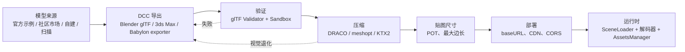

import { Meta } from '@storybook/addon-docs/blocks';

<Meta id="asset-pipeline-checklist" title="模型与资产/资产清单" name="Docs" />

# 资产清单

把一份 3D 模型从来源运到 Babylon.js 场景里，需要走完一条管线：**来源 → 导出 → 压缩 → 贴图 → 部署**。每一步都有可逆和不可逆的决策——可逆的部分（URL、压缩开关、压缩参数）留给运行时调整，不可逆的部分（修改器没应用、贴图导出错了、骨骼没烘焙）必须回到 DCC 重做。Blender 里没勾 `Apply Modifiers`、贴图尺寸选成 6000、DRACO 解码器路径错位，都是事后难以从运行时排查或修复的问题。

模型本身是 Babylon 之外的产物（来自 Blender、3ds Max、Sketchfab 或扫描），但「用 Babylon 视角看它需要满足什么」决定了你在 DCC 和处理工具里要做的事：导出器选哪个、单位与世界尺度对不对、压缩有没有配解码器、贴图尺寸能不能跑动端、跨域资源开没开 CORS。这些问题单看模型看不出来，要在加载链路里定位。本课把 [加载模型](?path=/docs/sceneloader-and-gltf--docs) 的 `SceneLoader`、[纹理](?path=/docs/textures--docs) 的贴图规则、[骨骼与蒙皮](?path=/docs/skeleton-and-bones--docs) 的骨架烘焙和 [性能](?path=/docs/performance-and-disposal--docs) 的资源释放里散落的资产侧决策串成一份从 0 到上线的工作流。



每一步的可逆性不同：路径错了可以改 URL，压缩选错可以重新导出；但贴图导出错了或修改器没应用，就只能回到 DCC 重做。所以本课把「在源头做对」放在前面，把「运行时怎么配」放在后面。

| 环节 | 默认 / 常用起点 | 改变后要注意什么 |
| --- | --- | --- |
| 资产打包形态 | `.glb` 单文件 | `.gltf + .bin + 贴图` 调试方便，但移动时整组一起搬，部署易断链 |
| Blender 导出格式 | `glTF 2.0 (.glb)` | 选 Separate 拆出 `.bin` 和贴图；选 Embedded 把贴图嵌入 JSON，体积膨胀且无法被浏览器并行下载 |
| `Apply Modifiers` | 启用 | 关闭后导出修改前几何，细分、布尔、镜像等效果丢失 |
| `+Y Up` | 启用 | glTF 约定 Y 朝上；关闭后模型可能在 Babylon 里倒立或躺倒 |
| 官方导出器 | 新项目不推荐使用 | 仅在需要导出 `.babylon` 原生格式或维护老管线时使用；新项目优先 DCC 自带的 glTF 导出 |
| 几何压缩 | 不压缩 | 启用 DRACO 必须配 `DRACOCompression.Configuration`；meshopt 解码更快、压缩比略低 |
| 纹理压缩 | 不压缩（PNG / JPEG / WebP） | 启用 KTX2 必须 `import '@babylonjs/ktx2decoder'` |
| 贴图最大边长 | 1024 或 2048 | 移动端建议 `<=` 2048；超过 4096 多数 Web 项目无收益 |
| 部署位置 | 与页面同源的静态目录 | 跨域时服务端必须返回 CORS 头，否则纹理触发污染或 404 |
| DRACO 解码器 WASM | `https://cdn.babylonjs.com/draco_*` 默认 | 自托管时用 `DRACOCompression.Configuration.decoder.{wasmUrl, wasmBinaryUrl}` 指定 |

## 快速上手

下面这份最小检查清单覆盖从拿到一份模型到能让它在 Babylon.js 场景里正常显示的全部必要步骤。把它当作着陆点：每一项后面的主题小节解释为什么和怎么做。

**交付前（在 DCC / 处理工具中）**

- 确认模型来源许可允许目标用途；社区市场下载的模型先记录许可证。
- 在 Blender 中导出 glTF 2.0，启用 `Apply Modifiers`、`+Y Up`、`UVs`、`Normals`、`Tangents`，材质选择 `Export`。
- 单位与世界尺度合理：导出后用 Babylon 的 `getHierarchyBoundingVectors` 检查模型尺寸，必要时在 DCC 中缩放，而不是在运行时强制 `scaling.setScalar(0.01)`。
- 贴图尺寸为 2 的幂（1024、2048），最大边长按设备目标选择；法线、粗糙度等数据贴图允许比颜色贴图小一档。
- 把 `.gltf + .bin + textures` 这类多文件资产整组保持原相对路径，或导出成 `.glb` 单文件。

**运行时（在 Babylon.js 项目中）**

- 在应用入口（而不是每个加载点）一次性 `import '@babylonjs/loaders/glTF'` 注册 `GLTFFileLoader`，保证第一次加载 glTF 前插件已就位。
- 用 `SceneLoader.ImportMeshAsync` 加载，用 `try / catch` 覆盖 404、解析失败和扩展缺失三类错误。
- 按模型使用的扩展提前配解码器：DRACO / KTX2 / meshopt 缺一会让加载直接抛错。
- 用 `getHierarchyBoundingVectors` 检查模型大小与位置，必要时整体缩放、平移到可观察范围，并把相机 reframe 到模型中心。
- 加上基础光照或 `scene.environmentTexture`——glTF 使用 PBR，缺少环境会偏暗或发灰。
- 卸载时用 `AssetContainer.dispose()` 或对几何 / 材质 / 纹理逐类释放；完整策略见 [性能](?path=/docs/performance-and-disposal--docs)。

## 模型来源

不同来源决定了你需要做多少整理工作。

| 来源 | 适用场景 | 整理工作量 | 注意事项 |
| --- | --- | --- | --- |
| Babylon.js 官方示例（Playground / Sandbox） | 学习范例、复现问题 | 几乎为零 | 已经过官方测试，但通常很小、没有完整 PBR 材质 |
| Khronos glTF Sample Models | 验证 Loader 行为、对比 PBR、动画与扩展 | 几乎为零 | 用于校准；生产一般不直接发布 |
| Sketchfab 等社区市场 | 快速拿到现成资产、原型验证 | 中等到高 | 检查许可证、单位、贴图完整性；许多模型需要重新导出 |
| Blender / 3ds Max / Maya 自制 | 项目专属资产、可控质量 | 由你掌控 | 必须按 glTF 导出规范处理修改器、单位、命名 |
| 扫描或摄影测量（RealityCapture、Meshroom） | 高度写实的静态对象 | 高 | 拓扑密集、贴图巨大，几乎一定要重建拓扑并压缩 |

社区市场下载的模型常见三类问题：使用了 `.fbx` 或 `.obj` 等非 glTF 格式（需要在 Blender 中转成 glTF）；材质命名混乱、贴图路径松散；单位随意，导入 Babylon 后包围盒远超预期。这三类问题都建议在 Blender 中统一处理后再导出，而不是把修补留给运行时代码。

## 导出

导出是把 DCC 内部场景翻译成 Babylon 能读的文件，每个开关都决定运行时看到什么。Blender 自带的 glTF 2.0 I/O 插件是 Babylon.js 资产管线的首选导出器；3ds Max / Maya 的内置 glTF 导出在逐步完善，老管线仍可使用 Babylon.js 官方导出器。

### DCC 导出要点（Blender / 3ds Max）

Blender 的导出路径：`File → Export → glTF 2.0 (.glb/.gltf)`，右侧面板里的设置决定了输出结果能否在浏览器里正确显示。

| 选项 | 推荐值 | 不这样做的后果 |
| --- | --- | --- |
| Format | `glTF 2.0 (.glb)` | 选 Separate 拆出 `.bin` 和贴图；选 Embedded 把贴图嵌入 JSON，体积膨胀且无法被浏览器并行下载 |
| Limit to | `Selected Objects` | 默认导出整场景，会把灯光、相机、辅助物体一起写入 glTF |
| Apply Modifiers | 勾选 | 关闭后导出修改前几何；细分、布尔、镜像等效果丢失 |
| Y Up | 勾选 | glTF 约定 Y 朝上，Blender 也是 Y 朝上；关闭后模型可能在 Babylon 中躺倒或倒立 |
| UVs / Normals / Tangents | 全部勾选 | 缺少切线时法线贴图方向会错；缺少 UV 时贴图无法采样 |
| Vertex Colors / Attributes | 按需勾选 | 不需要顶点色时关闭，减小文件 |
| Materials | `Export` | 选 `Placeholder` 会丢失 PBR 数据；选 `None` 会得到无材质模型 |
| Compression (Draco) | 仅在几何大时启用 | 启用后运行时必须配 `DRACOCompression.Configuration`，否则 glTF 加载直接抛错 |
| Animation | 按需 | 静态模型关闭；启用时确认只导出需要的动作 |

最常被忽略的是 `Apply Modifiers` 和 `Tangents`——前者让导出的是最终几何（细分曲面、布尔并集），后者让法线贴图能正确采样。Blender 命令行导出可以写成脚本，便于复现：

```python
# 在 Blender 文本编辑器或命令行中执行
import bpy

# 只导出选中对象为 GLB，应用修改器，生成切线。
bpy.ops.export_scene.gltf(
    filepath='/output/sample.glb',
    export_format='GLB',
    use_selection=True,
    export_apply=True,           # Apply Modifiers
    export_yup=True,             # +Y Up
    export_tangents=True,        # 为法线贴图生成切线
    export_materials='EXPORT',
    export_uv=True,
    export_normals=True,
    export_animations=False,
)
```

3ds Max 与 Maya 没有像 Blender 那样成熟的内置 glTF 导出，历史上靠 Babylon.js 官方导出器（见下文）或第三方插件；新版 3ds Max 和 Maya 已逐步自带 glTF 导出，按你 DCC 的版本选用即可，关键选项（应用修改器、Y Up、切线、材质导出）的概念与上表一致。

导出后立即用 [glTF Validator](https://github.com/KhronosGroup/glTF-Validator) 检查规范错误，再用 [Babylon.js Sandbox](https://sandbox.babylonjs.com/) 在标准 Babylon 查看器里预览——这一步能排除「是资产的问题还是项目代码的问题」。导出设置错或修改器没应用，Validator 不一定会报错，但 Sandbox 里会看到几何缺失或材质异常。

### 骨骼与动画的导出开关

蒙皮角色和带动作的模型要在导出时把骨架和关键帧烘焙进文件，Babylon 才能读出 `skeletons` 和 `animationGroups`：

- 在 Blender 的 glTF 导出面板勾选 `Skinning` 和 `Animation`，确认要导出的 Action 都在启用列表里（未启用的 Action 会被丢弃）。
- 骨骼层级命名要有语义（`arm_lower_R`、`spine_01`），不要保留 `Bone.012`——这些名字会变成 Babylon 的 `Bone.name`，是动画切换和调试的基础。
- 静态模型关掉 `Animation`，避免把 DCC 里的时间线残余写进文件。

骨架在 Babylon 端如何驱动蒙皮见 [骨骼与蒙皮](?path=/docs/skeleton-and-bones--docs)，`AnimationGroup` 如何播放与混合见 [动画](?path=/docs/animation-system--docs)。本课只负责「导出时别丢」。

### Babylon.js 官方导出器

Babylon.js 历史上为 Blender、3ds Max、Maya 提供过官方导出器（仓库 [BabylonJS/Exporters](https://github.com/BabylonJS/Exporters)），可同时导出 `.babylon` 原生格式和 glTF / GLB。使用边界：

- 仅在需要 `.babylon` 原生格式（携带相机、光、粒子等场景对象，由 `BabylonFileLoader` 直接读）或维护老管线时使用。
- 官方仓库已不在活跃开发；新项目优先用 DCC 自带的 glTF 导出器（Blender 的 glTF 2.0 I/O 已足够成熟），格式以 `.glb` / `.gltf` 为准。
- 想在浏览器里快速试模型，[Babylon.js Sandbox](https://sandbox.babylonjs.com/) 直接拖文件即可加载和检查。

`.babylon` 与 glTF 的运行时加载差异（插件注册、`rootUrl` 解析、glTF 的 `__root__` 容器等）在 [加载模型](?path=/docs/sceneloader-and-gltf--docs) 已展开，本课不重复。

## 格式选择

`SceneLoader` 按扩展名挑选已注册的插件，三类常见格式各有注册方式（细节见 [加载模型](?path=/docs/sceneloader-and-gltf--docs)）：

| 格式 | 文件组成 | 部署策略 | 插件注册 |
| --- | --- | --- | --- |
| `.glb` | 单一二进制文件，含几何 + 贴图 | 任意静态目录，一个 URL 即可；移动和缓存最简单 | `import '@babylonjs/loaders/glTF'` |
| `.gltf`（Separate） | JSON + 外部 `.bin` + 外部贴图 | 整组保持原相对路径，不要拆开移动单个文件 | 同上（同一个 `GLTFFileLoader`） |
| `.gltf`（Embedded） | JSON 中嵌入 base64 贴图 | 一个文件但体积大，浏览器无法并行下载贴图 | 同上 |
| `.babylon` | Babylon 原生格式 | 可携带相机、光、粒子等场景对象 | `@babylonjs/core` 默认注册，无需额外导入 |

部署首选 `.glb`：单文件、最省事、缓存最干净。`.gltf` Separate 适合调试（能单独替换贴图或几何）或需要在 CDN 上独立缓存大贴图的场景；移动时整组（JSON + `.bin` + 贴图目录）一起搬，否则会批量 404。`.babylon` 只在确需其携带的场景对象或维护老管线时使用。

## 压缩与优化

几何和纹理是模型体积与显存占用的两大头，压缩方式不同、解码成本不同、运行时依赖也不同。选型时先确认「瓶颈是几何还是贴图」：几何大先处理几何，贴图大先处理贴图，不要无脑全开。

### 几何压缩（DRACO / meshopt）

| 压缩方式 | 压缩对象 | 体积收益 | 解码成本 | 运行时依赖 |
| --- | --- | --- | --- | --- |
| Quantization（顶点量化） | 顶点位置 / 法线 / UV 的精度 | 中等 | 几乎为零 | 无（导出器内置） |
| `KHR_draco_mesh_compression` | 几何顶点数据 | 高（常压到原大小的 1/5 ~ 1/10） | 高（WASM 解码，启动慢） | `DRACOCompression.Configuration` |
| `EXT_meshopt_compression` | 几何与动画 | 中高（压缩比不如 DRACO，但解码快） | 低（专为快速解码设计） | `import '@babylonjs/loaders/glTF/2.0/Extensions/EXT_meshopt_compression'` |

选型判断：

- 几何是主要体积来源，且能接受首帧延迟 → **DRACO**。
- 模型不大，但想进一步压缩或同时压缩动画 → **meshopt**。
- 只做精度优化、不想加解码器 → 在导出器中开启 **Quantization**。
- 几何不是瓶颈（贴图才是）→ 跳过几何压缩，先处理贴图。

与 three.js 需要手工给 `GLTFLoader` 挂 `DRACOLoader` 不同，Babylon 的 `GLTFFileLoader` 内部会按扩展自动调用解码器；只需在加载前把 DRACO 的 WASM 路径告诉 `DRACOCompression`：

```ts
import { DRACOCompression } from '@babylonjs/core/Meshes/Compression/dracoCompression';
import '@babylonjs/loaders/glTF';                                        // 注册 GLTFFileLoader
import '@babylonjs/loaders/glTF/2.0/Extensions/EXT_meshopt_compression'; // 注册 meshopt 扩展

// DRACO 解码器 WASM 不在 core 里；用 CDN 或自托管，二选一。
DRACOCompression.Configuration = {
  decoder: {
    wasmUrl: 'https://cdn.babylonjs.com/draco_wasm_wrapper_gltf.js',
    wasmBinaryUrl: 'https://cdn.babylonjs.com/draco_decoder_gltf.wasm',
  },
};
```

`DRACOCompression.Configuration` 是嵌套结构（`decoder.{wasmUrl, wasmBinaryUrl, fallbackUrl?}`）；早期版本的扁平 URL 写法已废弃。`meshopt` 走副作用导入注册扩展，不需要额外 WASM 配置。压缩后必须重新走一次视觉验证——DRACO 的默认参数对法线精度有损，会让光滑曲面出现色带或接缝。

DRACO 和 meshopt 可以在 [gltfpack](https://github.com/zeux/meshoptimizer#gltfpack) 或 [glTF Transform](https://gltf-transform.dev/) 中按命令行复现地启用，避免在 Blender 中每次手工切换。

### 纹理压缩（KTX2 / Basis）

贴图常常占模型体积的 60% 以上，而且是显存的主要占用源。把 PNG / JPEG / WebP 换成 KTX2 / Basis Universal，可以让纹理以 GPU 原生压缩格式分发，浏览器不再需要解码整张图片到显存。

| 方案 | 适用阶段 | 体积收益 | 解码成本 | 运行时依赖 |
| --- | --- | --- | --- | --- |
| PNG / JPEG | 调试期、小体积贴图 | 无 | 浏览器原生解码（CPU） | 无 |
| WebP / AVIF | 想要更小下载体积，但仍是普通纹理 | 中等 | 浏览器原生解码（CPU） | 确认目标浏览器支持 |
| KTX2 / Basis Universal | 生产、移动端、贴图大 | 高（GPU 压缩格式） | GPU 端转码 | `import '@babylonjs/ktx2decoder'` |

`@babylonjs/ktx2decoder` 是独立包，副作用导入后注册解码器；和 three.js 的 `KTX2Loader.detectSupport(renderer)` 显式查询能力不同，Babylon 在引擎内部按当前 `Engine` 能力选转码格式，不需要手动 detect。完整的色彩空间和数据贴图语义（颜色贴图 vs 法线数据贴图）见 [纹理](?path=/docs/textures--docs)。

```ts
import '@babylonjs/ktx2decoder'; // 副作用注册 KTX2 解码器
import '@babylonjs/loaders/glTF'; // glTF 内嵌 KTX2 由 GLTFFileLoader 自动调用解码器
```

把普通贴图转换为 KTX2 的常用工具有 [KTX-Software](https://github.com/KhronosGroup/KTX-Software)（命令行）、[glTF Transform](https://gltf-transform.dev/) 的 `ktxfix` 与 `etc1s` / `uastc` 任务，以及 [gltfpack](https://github.com/zeux/meshoptimizer#gltfpack)。ETC1S 适合颜色贴图，体积小但有损；UASTC 适合法线等数据贴图，质量高但体积大。

## 贴图尺寸

贴图尺寸决定了下载体积、显存占用和 mipmap 层级数。Web 上的取值范围比 DCC 中保守得多。

**2 的幂（Power of Two, POT）**：1、2、4、…、1024、2048、4096。WebGL 1 对非 2 的幂（NPOT）纹理有严格限制（不能生成 mipmap、不能用 `WRAP` 平铺）。WebGL 2 解除了这个限制，但 POT 仍是兼容性最好、mipmap 最齐的选择；Babylon 的 `Texture.TRILINEAR_SAMPLINGMODE` 在没有 mipmap 时会退化成 BILINEAR，详见 [纹理](?path=/docs/textures--docs)。

**最大边长**：按目标设备决定上限。

| 目标设备 | 颜色贴图建议最大边长 | 数据贴图（法线、粗糙度等）建议最大边长 |
| --- | --- | --- |
| 桌面 / 高端独显 | 2048 或 4096 | 1024 或 2048 |
| 移动端 / 集成显卡 | 1024 或 2048 | 512 或 1024 |
| UI 元素 / 远景小对象 | 512 或更小 | 256 或更小 |

颜色贴图（diffuse、emissive）对人眼最敏感，可以稍大；法线、粗糙度、金属度、AO 等数据贴图通常可以减半，因为它们影响的是细节而非整体识别。绝对值没有硬规则，按「屏幕上这张贴图实际占多少像素」反推；一个永远只占屏幕 200 像素的远景小对象配 4096 贴图纯属浪费。

`engine.getCaps().maxTextureSize` 给出 GPU 的硬上限（桌面通常 8192 或 16384，移动端常为 4096），但**不要把这个上限当成推荐尺寸**——它只告诉你「再多就直接不能渲染」。Web 项目实际上很少需要超过 2048 的贴图。

## 部署路径

部署决定了模型、依赖文件和解码器 WASM 在静态服务器上的位置，以及运行时如何把它们拼成 URL。

**`.glb` 与 `.gltf` 的部署差异**：`.glb` 单文件任意静态目录即可；`.gltf` Separate 内部以相对路径引用 `.bin` 和贴图，`SceneLoader` 用 `rootUrl`（含尾部 `/`）拼接它们——移动时整组一起搬，否则会批量 404。`rootUrl` 和 `sceneFilename` 的 API 细节见 [加载模型](?path=/docs/sceneloader-and-gltf--docs)。

**解码器 WASM**：DRACO 的解码器不在 core 里，部署时要么指向 `cdn.babylonjs.com` 的官方 CDN，要么把 `draco_wasm_wrapper_gltf.js` 与 `draco_decoder_gltf.wasm` 复制到自托管目录，再用 `DRACOCompression.Configuration.decoder.{wasmUrl, wasmBinaryUrl}` 指向。KTX2 解码器是 WASM + JS 模块，由 `@babylonjs/ktx2decoder` 副作用导入；打包器会把它打进 bundle，一般不需要单独部署。

**CDN 与 CORS**：把模型或解码器放在 CDN 上时要同时处理两件事——

- **版本一致**：CDN 上的 Babylon.js 版本必须与本地一致；不同版本之间 Loader 与解码器 WASM 不保证兼容。
- **CORS**：跨域加载纹理时，服务器必须返回 `Access-Control-Allow-Origin` 响应头，否则浏览器会因为 WebGL 纹理污染而拒绝使用这张纹理。同一个域名下的资产没有这个问题。

生产部署的常见组合：HTML 与 JS 与项目同源；模型与贴图放在同源静态目录或 CDN（开 CORS）；解码器 WASM 与 Babylon 版本严格对应，可以从官方 CDN 加载或自托管。

## 批量预加载（AssetsManager）

一次加载多份资产、需要进度和汇总时，`SceneLoader` 单文件调用显得啰嗦。`AssetsManager` 是 Babylon 内置的任务调度器：注册若干任务，统一拿 `onProgress` / `onFinish` / `onTaskSuccess` / `onTaskError` 回调，再 `load()`（或 `loadAsync()`）一次性触发。

七种内置任务覆盖常见资产类型：

| 任务 | 加载对象 | 典型产物 |
| --- | --- | --- |
| `MeshAssetTask` | `.babylon` / `.gltf` / `.glb` / `.obj` / `.stl` | `task.loadedMeshes`、`task.loadedAnimationGroups` 等 |
| `ContainerAssetTask` | 模型到 `AssetContainer`（内部走 `SceneLoader.ImportMesh`） | `task.loadedContainer`，需手动 `addAllToScene()` |
| `TextureAssetTask` | 图片（`.jpg` / `.png` / `.dds` / `.hdr` / `.tga`） | `task.texture` |
| `CubeTextureAssetTask` | 立方体贴图（6 面或 `.env`） | `task.texture` |
| `BinaryAssetTask` | 任意二进制文件 | `task.data`（`ArrayBuffer`） |
| `TextAssetTask` | 文本文件（`.json` / `.glsl` / `.xml` 等） | `task.text` |
| `ImageAssetTask` | 图片作为 `HTMLImageElement`（不上 GPU） | `task.image` |

```ts
import { AssetsManager } from '@babylonjs/core';
import '@babylonjs/loaders/glTF';

const assetsManager = new AssetsManager(scene);

const heroTask = assetsManager.addMeshTask('hero', '', '/models/', 'hero.glb');
heroTask.onSuccess = (task) => {
  task.loadedMeshes.forEach((m) => (m.position.y = 0));
};
heroTask.onError = (task, message, exception) => {
  // 注意：第一参是 task 本身，错误信息在第二参字符串。
  console.error('hero 加载失败：', message, exception);
};

const groundTask = assetsManager.addTextureTask('ground', '/textures/ground.jpg');
groundTask.onSuccess = (task) => {
  groundMaterial.diffuseTexture = task.texture;
};

assetsManager.onProgress = (remaining, total, task) => {
  const pct = ((total - remaining) / total * 100).toFixed(0);
  loadingBar.style.width = `${pct}%`;
};
assetsManager.onFinish = (tasks) => {
  hideLoadingScreen();
  engine.runRenderLoop(() => scene.render());
};

assetsManager.load();
```

任务级别的 `onError` 签名是 `(task, message, exception?)`——错误信息在第二参，不要按 Promise 的 `(err)` 习惯只读第一参。`AssetsManager` 与 `SceneLoader.LoadAssetContainerAsync` 的差别：前者是多任务调度器（进度、汇总、并行加载不同类型资产），后者是把单份加载结果装进可成组挂载的容器（`addAllToScene` / `removeAllFromScene`）；两者可以组合——`ContainerAssetTask` 就是 `AssetsManager` 调度 `SceneLoader` 加载到容器的桥梁，容器机制本身见 [加载模型](?path=/docs/sceneloader-and-gltf--docs)。

## 最佳实践

- 部署优先用 `.glb` 单文件；只有调试或需要 CDN 独立缓存大贴图时才用 `.gltf` Separate。
- 在 DCC 里把单位、原点、命名一次做对，不要把修补留给运行时 `scaling.setScalar(0.01)`。
- 每次导出后跑一遍 glTF Validator 和 Babylon Sandbox，把问题挡在进入项目之前。
- 压缩按瓶颈选：几何大用 DRACO / meshopt，贴图大用 KTX2；不要无脑全开。
- 贴图尺寸按「屏幕上实际占多少像素」反推，颜色贴图允许比数据贴图大一档。
- DRACO / KTX2 / meshopt 的解码器或扩展必须在加载前配置或注册；缺失会让 glTF 加载直接抛错。
- 解码器 WASM 与 Babylon 版本严格对应；用官方 CDN 或锁定版本自托管。
- 跨域资产必须开 CORS，否则 WebGL 纹理污染会让贴图变黑或被拒绝使用。
- 多份资产预加载用 `AssetsManager` 拿统一进度；单份按需加载 / 卸载用 `AssetContainer`。

## 常见问题

- 为什么 Blender 导出的模型在 Babylon 里躺倒或倒立？
  在 glTF 导出设置中勾选 `+Y Up`；glTF 约定 Y 朝上，关闭后模型的轴方向会与 Babylon 不一致。
- 为什么模型体积突然变大但视觉效果没改善？
  检查是否选了 `glTF Embedded`（贴图以 base64 嵌入 JSON）；改回 `.glb` 或 `.gltf Separate`，让贴图以独立二进制文件分发。
- 为什么 glTF 加载报错提到 DRACO 或 decoder？
  模型启用了 DRACO 压缩。运行时设 `DRACOCompression.Configuration = { decoder: { wasmUrl, wasmBinaryUrl } }`，指向 CDN 或自托管的 `draco_wasm_wrapper_gltf.js` 与 `draco_decoder_gltf.wasm`。
- 为什么用了 meshopt 的 glTF 加载报错？
  没副作用导入 meshopt 扩展。在加载前 `import '@babylonjs/loaders/glTF/2.0/Extensions/EXT_meshopt_compression'`。
- 为什么 KTX2 纹理在桌面正常，在移动端崩？
  漏掉 `import '@babylonjs/ktx2decoder'`，或导入晚于模型加载；必须在第一次加载含 KTX2 的模型前注册解码器。
- 为什么贴图尺寸 4096 的模型在移动端不显示？
  移动端 GPU 的纹理尺寸上限常为 4096，部分设备更低；用 `engine.getCaps().maxTextureSize` 检查，并把贴图降到 2048 或更小。
- 为什么从 Sketchfab 下载的模型单位特别大？
  社区市场模型单位常常不规范；导入 Blender 后先在属性面板设置场景单位为米，整体缩放到合理大小，再导出 glTF。
- 为什么部署后 `ImportMeshAsync` 抛 404，但本地开发正常？
  检查静态服务是否把 `.glb`、`.bin` 和贴图整组都复制过去；`.gltf` 内部以相对路径引用依赖文件，缺一个就 404。必要时核对 `rootUrl`（含尾部 `/`）。
- 为什么跨域加载的贴图变黑或被拒绝使用？
  跨域服务器没有返回 `Access-Control-Allow-Origin` 响应头；WebGL 出于安全考虑会拒绝使用未授权的跨域纹理。让 CDN 开 CORS，或把资产放回同源。
- 为什么同一份模型在某些设备上几何出现接缝或闪烁？
  DRACO 默认参数对法线精度有损；改用更高量子量化，或换成 meshopt；压缩后必须重新走视觉验证。
- 为什么 `AssetsManager` 任务级 `onError` 第一参不是错误对象？
  任务级 `onError` 签名是 `(task, message, exception?)`——第一参是任务本身，错误信息在第二参字符串。

## 总结回顾

摘要：

资产管线是一条「来源 → 导出 → 压缩 → 贴图 → 部署」的工作流，每一步都有可逆和不可逆的决策。Blender 自带的 glTF 2.0 导出器是首选；Babylon 官方导出器仅用于 `.babylon` 原生格式或老管线。格式首选 `.glb` 单文件，`.gltf` Separate 调试方便但移动要整组搬，`.babylon` 由 core 默认注册可直接读。几何压缩可选 DRACO（最高压缩比，需配 `DRACOCompression.Configuration`）或 meshopt（解码快，副作用导入扩展）；纹理压缩选 KTX2（`import '@babylonjs/ktx2decoder'`）。贴图尺寸优先取 2 的幂，按目标设备和屏幕占比选择，颜色贴图允许比数据贴图大一档。部署时同源最简，跨域要开 CORS，DRACO WASM 用官方 CDN 或自托管并锁定版本。多份资产预加载用 `AssetsManager` 拿统一进度，单份按需加载 / 卸载用 `AssetContainer`。

一句话：

> 不可逆的决策在交付前一次做对，可逆的调整留给运行时；检查清单比修补代码更可靠。

知识要点：

- 资产管线的五个步骤分别是什么？哪些决策可逆，哪些不可逆？
- `.glb`、`.gltf` Separate、`.gltf` Embedded 与 `.babylon` 在部署和运行时注册上有什么差别？
- Blender 导出 glTF 时哪些设置一旦遗漏会破坏运行时？骨骼与动画导出要注意什么？
- DRACO、meshopt、KTX2 各自压缩什么？体积、质量、解码成本如何权衡？分别要在 Babylon 里配什么？
- 贴图尺寸为什么优先取 2 的幂？颜色贴图与数据贴图的最大边长怎么选？
- DRACO 解码器 WASM 应该部署在哪里？`DRACOCompression.Configuration` 的结构是什么？
- 跨域加载模型和贴图时需要注意什么？为什么 WebGL 会拒绝某些跨域纹理？
- `AssetsManager` 的七种任务分别加载什么？任务级 `onError` 与 `onProgress` / `onFinish` 的签名分别是什么？
- 怎样判断一份模型已经达到可交付状态？

## 参考资料

- [Babylon.js Features：Loading Files（SceneLoader 入口与插件选择）](https://doc.babylonjs.com/features/featuresDeepDive/importers/loadingFileTypes)
- [Babylon.js Features：Asset Manager（七种任务与回调）](https://doc.babylonjs.com/features/featuresDeepDive/importers/assetManager)
- [Babylon.js Features：glTF Files（GLTFFileLoader 与扩展）](https://doc.babylonjs.com/features/featuresDeepDive/importers/glTF)
- [Babylon.js TypeDoc：AssetsManager（onProgress / onFinish / onTaskError）](https://doc.babylonjs.com/typedoc/classes/BABYLON.AssetsManager)
- [Babylon.js TypeDoc：DracoCompression（Configuration 嵌套结构）](https://doc.babylonjs.com/typedoc/classes/_babylonjs_core.DracoCompression)
- [Babylon.js ES6 Support：Tree shaking 与解码器配置](https://doc.babylonjs.com/setup/frameworkPackages/es6Support)
- [@babylonjs/ktx2decoder on npm（KTX2 解码器副作用导入）](https://www.npmjs.com/package/@babylonjs/ktx2decoder)
- [Babylon.js Sandbox（在线模型查看器与 Inspector）](https://sandbox.babylonjs.com/)
- [Babylon Exporters GitHub（官方 Blender / 3ds Max / Maya 导出器，已不活跃开发）](https://github.com/BabylonJS/Exporters)
- [Blender Manual：glTF 2.0 Importer & Exporter](https://docs.blender.org/manual/en/latest/addons/import_export/scene_gltf2.html)
- [glTF 2.0 Specification](https://registry.khronos.org/glTF/specs/2.0/glTF-2.0.html)
- [glTF Extensions Registry](https://github.com/KhronosGroup/glTF/tree/main/extensions)
- [Khronos glTF Validator](https://github.com/KhronosGroup/glTF-Validator)
- [glTF Transform](https://gltf-transform.dev/)
- [gltfpack (meshoptimizer)](https://github.com/zeux/meshoptimizer#gltfpack)
- [KTX-Software](https://github.com/KhronosGroup/KTX-Software)
