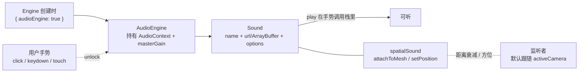

import { Meta } from '@storybook/addon-docs/blocks';

<Meta id="audio" title="应用扩展/音频" name="Docs" />

# 音频

Babylon.js 在 `@babylonjs/core` 里内置了一套基于 Web Audio API 的音频系统：`AudioEngine` 持有 `AudioContext` 和主增益（master gain），`Sound` 代表一个可播放的音源。和 [GUI](?path=/docs/gui-system--docs)、[物理](?path=/docs/physics-with-havok--docs) 一样，音频是 Babylon 的内建能力——不需要再引入第三方音频库，就能做背景音乐、按钮音效和随 3D 位置衰减方位的空间声源。

两件事决定本课的形态。第一，**Babylon.js 7.52 起，旧的音频引擎不再随图形引擎默认创建**：你必须在新构 `Engine` 时显式传 `{ audioEngine: true }`，否则 `scene.audioEngine` 为 `null`，`new Sound(...)` 的构造体会拿到空壳——属性能写、方法能调，但永远不会有声音。官方同时推荐新代码使用 V2 音频 API（`CreateAudioEngineAsync` / `CreateSoundAsync`），本课以你将在绝大多数现存 Babylon 代码里见到的**旧 API（`Sound` + `AudioEngine`）为主线**，并在 [AudioEngine 与手势解锁](#audioengine-与手势解锁) 末尾给出 V2 等价写法。第二，**浏览器不允许页面在没有用户手势前出声**：`AudioEngine` 在 `sound.play()` 时会自检并尝试 `unlock()`，但这一步只有在用户点击、按键或触摸触发的调用栈里才真正生效；自动播放策略是浏览器规范，不是 Babylon 的限制。



| 对象 / 选项 | 默认值 | 改变后要注意什么 |
| --- | --- | --- |
| `Engine` 构造选项 `audioEngine` | `false`（7.52+） | 不显式设 `true`，`scene.audioEngine` 为 `null`，`new Sound(...)` 拿到不会播放的空壳 |
| `Sound` 构造第 2 参 | URL 字符串 / `ArrayBuffer` / `AudioBuffer` / `MediaStream` / `HTMLMediaElement` / URL 数组 | URL 在跨域或离线时 404；ArrayBuffer 适合打包进 bundle 或程序化生成 |
| `Sound.volume`（options） | `1` | 与 `AudioEngine` 主增益相乘；`setVolume(v, time)` 可做渐变 |
| `Sound.loop` | `false` | 背景音乐设 `true`；循环边界用 Web Audio 的 loopStart/loopEnd |
| `Sound.autoplay` | `false` | `true` 也受手势约束——没解锁照样静默 |
| `Sound.spatialSound` | `false` | `attachToMesh` 会自动把它置 `true` |
| `Sound.distanceModel` | `"linear"` | 可选 `"inverse"` / `"exponential"`；`linear` 在 `maxDistance` 处归零 |
| `Sound.maxDistance` | `100` | `linear` 模型下在此距离静音；`inverse`/`exponential` 仍可能有残余音量 |
| `Sound.rolloffFactor` | `1` | 衰减速率；`inverse`/`exponential` 才显著生效 |
| `Sound.refDistance` | `1` | 衰减起始参考距离 |
| `Sound.playbackRate` | `1` | >1 加速并升调，&lt;1 减速并降调 |
| `panningModel`（空间声） | `"equalpower"`（`scene.headphone` 为 `true` 时默认 `"HRTF"`） | HRTF 用卷积渲染方位感更好但更耗 CPU |
| `AudioEngine.unlocked` | `false` | `true` 才真正出声；用 `onAudioUnlockedObservable` 监听状态切换 |

## 快速上手

最小闭环只关心三步：构 `Engine` 时打开 `audioEngine`、在用户点击的回调里 `new Sound(...)` 并 `play()`。下面这份代码在点击 `#play` 按钮后才会出声——把手势和 `play()` 放在同一个调用栈是关键。

```ts
import { Engine, Scene, Sound } from '@babylonjs/core';
// 副作用导入：注册旧 AudioEngine 工厂和 Sound 类
import '@babylonjs/core/Audio/audioEngine';
import '@babylonjs/core/Audio/sound';

const canvas = document.getElementById('renderCanvas') as HTMLCanvasElement;
// 关键：audioEngine 默认 false，必须显式打开，否则下面 new Sound 拿到空壳
const engine = new Engine(canvas, true, { audioEngine: true });
const scene = new Scene(engine);

const sfx = new Sound(
  'click',
  '/assets/sfx/click.mp3',
  scene,
  () => console.log('音源已就绪'),
  { volume: 0.8 },
);

document.getElementById('play')!.addEventListener('click', () => {
  // play() 内部会调 audioEngine.unlock()——必须在用户手势调用栈里才生效
  sfx.play();
});
```

音源文件 404 或 `scene.audioEngine` 为 `null` 时，`Sound` 都不会抛错——前者只在控制台给一条加载失败日志，后者更隐蔽：`isPlaying`、`setVolume` 看起来都在工作，但永远没声音。排查"为什么没声音"时，先确认这两件事。

## AudioEngine 与手势解锁

`AudioEngine` 是 `Engine` 在 `audioEngine: true` 时通过 `AudioEngineFactory` 创建的；每个 `Scene` 通过 `scene.audioEngine` 拿到同一个实例（`Engine.audioEngine` 也指向它）。它持有底层 `AudioContext`、主增益节点 `masterGain`、解锁状态 `unlocked`，以及格式支持标志 `isMP3supported` / `isOGGsupported`。

```ts
const audioEngine = scene.audioEngine; // Nullable<AudioEngine>
audioEngine?.setGlobalVolume(0.5);     // 主增益，影响所有 Sound
audioEngine?.audioContext;             // 直接拿底层 AudioContext 做高级路由
audioEngine?.unlocked;                 // 浏览器是否已放行音频
```

**手势解锁是浏览器层面的自动播放策略，不是 Babylon 的限制。** 桌面 Chrome/Edge/Firefox/Safari 都要求 `AudioContext` 在用户手势（`click` / `keydown` / `touchstart` 等）触发的调用栈里被 `resume()`，否则保持 `suspended` 状态——这时 `unlocked` 为 `false`，`sound.play()` 会安排一个 500ms 的延迟重试（Firefox 历史上 AudioContext 就绪较慢），但仍可能不出声或被吞掉。`Sound.play()` 内部已经调用 `audioEngine.unlock()`，所以**绝大多数时候你不需要手动 unlock**，只要保证 `play()` 在手势回调里。

需要自定义解锁时机（例如自己做"点击开始"遮罩）时，可以手动调 `unlock()` 并监听状态：

```ts
const audioEngine = scene.audioEngine!;
startButton.addEventListener('click', () => {
  audioEngine.unlock();
  audioEngine.onAudioUnlockedObservable.add(() => {
    // 现在可以安全播放了
  });
});
```

`AudioEngine` 还提供：`lock()` 主动挂起（会触发内置 unmute 按钮，除非 `useCustomUnlockedButton = true`）、`connectToAnalyser(analyser)` 把主增益接入频谱分析、`onAudioLockedObservable` / `onAudioUnlockedObservable` 监听浏览器在标签页失活/恢复时的状态切换。

> **V2 音频 API（官方推荐用于新代码）。** V2 把引擎和音源都做成异步工厂：`CreateAudioEngineAsync()` 返回一个独立的 `audioEngine`，`CreateSoundAsync(name, url, options)` / `CreateStreamingSoundAsync(...)` 返回音源，`sound.spatial.attach(mesh)` 绑定空间位置，`audioEngine.unlockAsync()` 显式等待解锁。它**不依赖** `Engine` 的 `audioEngine` 选项——`AudioEngineV2` 是独立对象。本课主线继续讲旧 `Sound`，因为现存代码和教程几乎都使用它；启动新项目且不需要兼容旧代码时可以直接采用 V2。详见 [Babylon.js Audio V2 文档](https://doc.babylonjs.com/features/featuresDeepDive/audio/v2/playingSoundsMusic)。

## 创建与播放 Sound

`Sound` 是音源 + 播放选项的组合。构造体签名固定为 `(name, source, scene?, readyCallback?, options?)`，第二参 `source` 的类型决定它如何被解码。

```ts
new Sound(
  name: string,
  urlOrArrayBuffer: string | ArrayBuffer | AudioBuffer | MediaStream | HTMLMediaElement | string[],
  scene?: Scene,
  readyToPlayCallback?: () => void,
  options?: ISoundOptions,
)
```

最常见两种形态：URL 字符串（最简，但需要可寻址的音频文件）和 `ArrayBuffer`（把音频数据打包进 bundle、从 IndexedDB 取出、或用 WebAudio 程序化生成后传入）。传 URL 数组（如 `['bgm.mp3', 'bgm.ogg']`）时，Babylon 会按浏览器支持格式挑一个——现在 MP3 全平台支持，这个回退多数项目用不到。`readyCallback` 在音源解码完成、可以播放时触发；`scene` 省略时回退到 `EngineStore.LastCreatedScene`。

```ts
// 形态 1：URL，最常见
const bgm = new Sound('bgm', '/assets/bgm.mp3', scene, null, {
  loop: true,
  volume: 0.6,
  autoplay: false,
});

// 形态 2：ArrayBuffer，自己控制加载和解码时机
const resp = await fetch('/assets/sfx/click.mp3');
const buffer = await resp.arrayBuffer();
const click = new Sound('click', buffer, scene, null, { volume: 0.8 });

// 形态 3：先建空壳，拿到 AudioBuffer 后再喂
const placeholder = new Sound('gen', null as unknown as ArrayBuffer, scene);
// ...用 OfflineAudioContext 程序化合成一段 AudioBuffer...
placeholder.setAudioBuffer(synthesizedBuffer);
```

构造体里有一个**容易踩的早返回**：如果 `scene.audioEngine` 为 `null`（忘记 `{ audioEngine: true }`），`new Sound(...)` 在读取 `AbstractEngine.audioEngine` 后立即 `return`，对象仍然返回，但内部 V2 音源从未创建——后续 `play()` / `setVolume()` 不会抛错也不会出声。这也是为什么"没声音"的第一步排查永远是确认 `scene.audioEngine` 非 `null`。

播放控制围绕 `play` / `stop` / `pause` 三个方法和 `isPlaying` / `isPaused` / `isReady()` 三个状态展开：

```ts
sfx.play();                // 立即播放
sfx.play(0.5);             // 等 0.5 秒后再播（time = wait time，秒）
sfx.play(0, 1.2);          // 从音源第 1.2 秒处开始（offset，秒）
sfx.play(0, 0, 2.5);       // 只播 2.5 秒（length，秒）
sfx.pause();               // 暂停，play() 不带参数可从暂停处续播
sfx.stop();                // 停止并回到开头

sfx.isPlaying;             // 是否正在播放
sfx.isPaused;              // 是否暂停
sfx.isReady();             // 音源是否已解码可播
sfx.currentTime;           // 当前播放位置（秒）
```

`loop` 为 `true` 时播放完自动回到开头；和 [渲染循环](?path=/docs/render-loop-and-timing--docs) 不同，循环发生在音源内部，不需要每帧调 `play()`。`autoplay: true` 等价于在 `readyCallback` 里调 `play()`——同样受手势约束，没解锁不会出声。

音量和速率各自有即时和渐变两种写法：

```ts
sfx.setVolume(0.5);            // 立即设为 0.5
sfx.setVolume(0, 1.5);         // 在 1.5 秒内线性淡出到 0（time = fade duration）
sfx.setPlaybackRate(1.5);      // 1.5 倍速（同时升调）
sfx.getVolume();               // 读当前音量（注意是 Sound 自身记录的，不是主增益）
```

`setVolume(v, time)` 的第二个参数是渐变时长（秒），常用于淡入淡出；它只改这条音源的增益，不影响 `AudioEngine.setGlobalVolume()` 设的主音量——两者在主增益节点上相乘。不再使用的 Sound 要调 `dispose()`：它停止播放、从 SoundTrack 移除、释放底层 AudioBufferSourceNode 和 GainNode。`Sound` 不会被 `scene.dispose()` 自动清理，长生命周期页面要自己管理。

`Sound` 还提供 `onEndedObservable`（播完一次时触发，循环音不触发）、`clone()`（克隆静态音源，流式音源返回 `null`）、`connectToSoundTrackAudioNode(node)`（把这条音源接到自定义 AudioNode 链上做效果处理）、`updateOptions(options)`（批量改 loop / 距离模型 / 音量等）。

## 空间音频

空间音频让一条 `Sound` 在 3D 世界里有位置和方向，随监听者（默认是 `scene.activeCamera`）的相对位置衰减音量、用 PannerNode 渲染左右方位。打开方式有两种：直接 `sound.spatialSound = true`，或者调用 `sound.attachToMesh(mesh)`（它会自动把 `spatialSound` 置 `true`）。空间声源的核心是 `sound._soundV2.spatial` 这套 V2 子属性，旧 API 通过下面的方法暴露。

**位置：跟随 Mesh 还是手动设。** `attachToMesh(node)` 订阅 `node` 的世界矩阵更新——Mesh 一动，声源位置自动跟上；它内部用 `getBoundingInfo().boundingSphere.centerWorld`（普通 Mesh）或 `node.absolutePosition`（无包围盒的 TransformNode）作为声源点。`detachFromMesh()` 取消绑定。不想绑 Mesh 时，用 `setPosition(Vector3)` 手动设位置，每帧在 `onBeforeRenderObservable` 里更新就能让声源自己移动。

```ts
const engine = new Engine(canvas, true, { audioEngine: true });
const scene = new Scene(engine);

const engineHum = new Sound('engine', '/assets/sfx/engine.mp3', scene, null, {
  loop: true,
  spatialSound: true,
  distanceModel: 'linear',
  maxDistance: 30,
  rolloffFactor: 1,
});
engineHum.attachToMesh(shipMesh); // 跟随飞船
engineHum.play();                  // 在用户手势里调用
```

**距离衰减由三个参数共同决定。** `distanceModel` 选曲线形状，`maxDistance` / `refDistance` / `rolloffFactor` 调曲线参数。

| `distanceModel` | 音量随距离的走势 | 关键参数 |
| --- | --- | --- |
| `"linear"`（默认） | 从 `refDistance` 处线性衰减，到 `maxDistance` 归零 | `maxDistance` 决定静音点；Web Audio 规范不推荐（物理上不真实），但游戏里最直观 |
| `"inverse"`（反比） | `1 / (1 + rolloffFactor * (d - refDistance) / refDistance)`，渐近但不归零 | `rolloffFactor` 控制衰减快慢；`maxDistance` 只是个软上限 |
| `"exponential"`（指数） | `pow(d / refDistance, -rolloffFactor)` | `rolloffFactor` 必须 >0；曲线最接近物理 |

切换模型时直接赋值即可：`engineHum.distanceModel = 'inverse'; engineHum.rolloffFactor = 2;`—— setter 会把新值同步到底层 spatial 属性。`linear` 在 `maxDistance` 处硬归零，适合"超过这个距离就完全听不见"的 UI 类音效；`inverse` / `exponential` 更接近真实物理，远距离仍有一点点声音，适合环境氛围。

**方向：定向声锥。** 默认空间声向四面八方均匀辐射。要让声源像喇叭一样有指向性，用 `setDirectionalCone(coneInnerAngle, coneOuterAngle, coneOuterGain)`——三个角度参数**单位是度**（Babylon 内部转弧度），`coneOuterGain` 在 0–1 之间。锥内是正常音量，锥外衰减到 `coneOuterGain`。设完之后通常还要 `setLocalDirectionToMesh(Vector3)` 指定声源相对 Mesh 的朝向（默认 `(1, 0, 0)`，即 Mesh 局部 +X 方向），它会随 Mesh 的世界矩阵旋转。

```ts
// 一只朝前播的喇叭：内锥 60° 全音量，外锥 180° 衰减到 0.3
const speaker = new Sound('announce', '/assets/voice/announce.mp3', scene, null, {
  spatialSound: true,
});
speaker.setDirectionalCone(60, 180, 0.3);
speaker.setLocalDirectionToMesh(new Vector3(0, 0, 1)); // 朝 Mesh 局部 +Z
speaker.attachToMesh(speakerMesh);
```

**方位渲染：panningModel。** 决定 PannerNode 用什么算法把 3D 位置映射到左右耳。`"equalpower"`（默认）简单高效，适合扬声器；`"HRTF"`（Head-Related Transfer Function）用实测人头脉冲响应做卷积，戴耳机时方位感更真实但更耗 CPU。`scene.headphone` 为 `true` 时新创建的空间声会默认用 HRTF。已有 Sound 用 `sound.switchPanningModelToHRTF()` / `switchPanningModelToEqualPower()` 切换。

**监听者位置。** 空间声的"听者"默认跟随 `scene.activeCamera` 的位置和朝向。需要把听者位置从相机挪到场景里的另一个对象（第一人称角色、XR 玩家头部）时，给 `scene.audioListenerPositionProvider` 赋一个返回 `Vector3` 的函数——它在每帧 `updateDistanceFromListener` 中被读取，用于自定义衰减计算。自定义衰减曲线时，把 `sound.useCustomAttenuation = true` 并用 `setAttenuationFunction(callback)` 提供一个 `(volume, distance, maxDistance, refDistance, rolloffFactor) => number` 函数——这时 Web Audio 内置衰减被关闭，Babylon 每帧用你的函数算音量写入 `sound.volume`。

## 多音轨与频谱分析

多条 `Sound` 默认都进 `scene.mainSoundTrack`——它就是普通混音。需要分组控制音量（背景音乐一组、UI 音效一组、语音一组）时，新建 `SoundTrack`：

```ts
const musicTrack = new SoundTrack(scene, { volume: 0.5 });
const sfxTrack = new SoundTrack(scene, { volume: 0.8 });

const bgm = new Sound('bgm', '/assets/bgm.mp3', scene, null, { loop: true });
musicTrack.addSound(bgm);

const click = new Sound('click', '/assets/sfx/click.mp3', scene);
sfxTrack.addSound(click);

// 之后可以整组调整
musicTrack.setVolume(0.3);
```

`SoundTrack.addSound(sound)` 会把音源从 `mainSoundTrack` 挪到这条轨；`sound.soundTrackId` 记录它当前在哪条轨。`SoundTrack` 不是必须的——只是分组控制的便利层；少数场景下你也可以用 `sound.connectToSoundTrackAudioNode(customGainNode)` 把音源接到自己的 AudioNode 链上，绕开 SoundTrack 直接做 Web Audio 路由。

**频谱分析用 `Analyser`。** 它在主增益之后插入一个 `AnalyserNode`，提供 `getByteFrequencyData(array)` 和 `getByteTimeDomainData(array)` 用于可视化（频谱柱、波形、节拍检测）。它还能 `connectToAnalyser(analyser)` 后在画布上画出调试波形。

```ts
const analyser = new Analyser(scene);
scene.audioEngine!.connectToAnalyser(analyser);
analyser.FFT_SIZE = 256;

const data = new Uint8Array(analyser.FFT_SIZE);
function tick() {
  analyser.getByteFrequencyData(data); // 每帧拿到当前频谱
  // ...把 data 画到 2D canvas 或驱动 Mesh 缩放
  requestAnimationFrame(tick);
}
tick();
```

`Analyser` 接在 `AudioEngine` 主增益上，所以它反映的是**混音后**的总频谱；要分析单条音源，用 `sound.connectToSoundTrackAudioNode` 接一个自己的 AnalyserNode 更可控。

## 最佳实践

- 新构 `Engine` 时把 `{ audioEngine: true }` 写进选项；这是 7.52+ 旧音频 API 能工作的硬前提，遗漏不会报错只会让所有 `Sound` 静默。
- 把第一个 `sound.play()` 放在明确的用户手势回调里（开始按钮、首屏点击遮罩），让 `AudioEngine.unlock()` 在手势调用栈中执行；之后其他音效就不再受自动播放策略约束。
- 背景音乐和音效分到不同 `SoundTrack`，分别控制音量；用户在设置面板里调"音乐音量"时只改一条轨，不动主增益。
- 空间声按物理真实度选模型：UI 类提示音用 `linear`（到距离就静音，干净），环境氛围用 `inverse` 或 `exponential`（远距离仍有残余，更自然）。
- 移动端和戴耳机场景优先 `switchPanningModelToHRTF()`，方位感显著提升；桌面外放用 `equalpower` 省 CPU。
- 跨域音频文件要让服务器返回 CORS 头，否则 `fetch` 取 `ArrayBuffer` 时被浏览器拦截；同源部署最省事。
- 长 `Sound` 不用时 `dispose()`，不要只 `stop()`——`stop` 只停播放，不解码数据和 AudioNode；切场景或换关时尤其重要。
- 离线 / 内网环境用 `ArrayBuffer` 形态打包音频进 bundle，避免运行时 404；URL 形态适合大文件或动态选源。

## 常见问题

- 为什么 `new Sound(...)` 创建后什么声音都没有，控制台也没报错？
  先打印 `scene.audioEngine`——如果是 `null`，说明 `Engine` 构造时没传 `{ audioEngine: true }`（7.52+ 默认关闭）。`Sound` 构造体遇到这种情况会早返回一个空壳，属性可写、方法可调，但永远不出声。
- 为什么第一次 `play()` 没声音，多点几次或等一会儿就好了？
  浏览器的自动播放策略要求 `AudioContext` 在用户手势调用栈里被 `resume()`。`play()` 内部已经会 `unlock()`，但如果你在 `setTimeout`、`Promise.then` 或 `requestAnimationFrame` 里调 `play()`，调用栈已经脱离手势，解锁失败。把手势回调里直接同步调一次 `play()`（哪怕播一条静音 wav）解锁。
- 为什么自动播放策略在新版浏览器里特别严？
  桌面 Chrome、Edge、Firefox、Safari 现在都默认阻止"未交互前"的音频；这是浏览器规范层面的策略，不是 Babylon 的限制。Babylon 提供的是 `unlock()` / `unlocked` 这套机制来适应它。
- 为什么音频文件本地能播，部署后 404？
  URL 形态的 `Sound` 在运行时按路径取文件；打包工具通常不会自动把音频复制到产物目录。要么把音频放进静态目录，要么用 `fetch` + `ArrayBuffer` 形态让打包器处理。
- 为什么 `setDirectionalCone` 的角度和我想象的差很多？
  `coneInnerAngle` / `coneOuterAngle` 的单位是**度**，不是弧度——这是 Babylon 音频 API 里少见的度制（其他 API 多用弧度）。设错单位会让锥角偏差大约 57 倍。
- 为什么把 `distanceModel` 设成 `inverse` 后，`maxDistance` 处仍然能听到声音？
  `inverse` 和 `exponential` 是渐近曲线，不会在 `maxDistance` 处归零；`maxDistance` 在这两个模型下更像软上限。想要"超过这个距离完全静音"的效果，用 `linear`。
- 为什么空间声源的方位听起来都从正前方来？
  `panningModel` 默认 `equalpower`，外放扬声器下方位感较弱；戴耳机时切到 `HRTF`（`sound.switchPanningModelToHRTF()`）效果明显更好。同时确认 `scene.activeCamera` 的位置和朝向符合预期——听者跟随的是相机。
- 为什么切场景后 `Sound` 还在播？
  `Sound` 不会随 `scene.dispose()` 自动停止和释放；切场景前显式 `sound.stop()` + `sound.dispose()`，否则旧场景的音源会继续占用 AudioBufferSourceNode 和 AudioContext 资源。
- 旧 `Sound` API 和 V2 API（`CreateSoundAsync`）能混用吗？
  能——底层共享同一个 `_WebAudioEngine`，旧的 `AudioEngine` 就是 V2 引擎的包装。但新项目建议统一用 V2（`unlockAsync` 的异步解锁语义更清晰），现存代码继续用旧 API 也不需要立刻迁移。

## 总结回顾

摘要：

Babylon.js 在 `@babylonjs/core` 内置基于 Web Audio API 的音频系统：`AudioEngine` 持有 `AudioContext` 和主增益，`Sound` 代表可播放的音源。7.52 起旧音频引擎不再随图形引擎默认创建，必须在 `new Engine(canvas, antialias, { audioEngine: true })` 时显式打开，否则 `new Sound(...)` 拿到不会出声的空壳——这是排障的第一站。`Sound` 的 source 接受 URL / ArrayBuffer / AudioBuffer / MediaStream / HTMLMediaElement / URL 数组；`play(time, offset, length)` / `stop` / `pause` 配 `isPlaying` / `isPaused` / `isReady` 提供播放控制；`setVolume(v, time)` 支持渐变，`setPlaybackRate` 改速率。浏览器要求音频在用户手势后才能播放，`play()` 内部自动调 `audioEngine.unlock()`，但只有 `play()` 在手势调用栈里才真正解锁。空间音频由 `spatialSound = true` 或 `attachToMesh(node)` 触发，`setPosition` 手动定位；`distanceModel`（`linear` / `inverse` / `exponential`）配 `maxDistance` / `refDistance` / `rolloffFactor` 决定衰减曲线，`setDirectionalCone`（度制）+ `setLocalDirectionToMesh` 做定向声锥，`switchPanningModelToHRTF` 在耳机下提升方位感；听者默认跟随 `scene.activeCamera`，可用 `audioListenerPositionProvider` 覆盖。`SoundTrack` 分组控制音量，`Analyser` 接主增益取频谱做可视化。官方推荐新代码使用 V2 API（`CreateAudioEngineAsync` / `CreateSoundAsync` / `unlockAsync`），但现存代码和教程几乎都用旧 API，本课以旧 API 为主线。

一句话：

> 旧 `Sound` API 要在 `new Engine` 时打开 `audioEngine: true`、并在用户手势里调第一次 `play()` 出声；空间声用 `attachToMesh` / `setPosition` + 距离模型衰减，多音轨和频谱分析交给 `SoundTrack` 和 `Analyser`。

知识要点：

- 为什么 `new Sound(...)` 创建后静默不报错？7.52+ 旧音频引擎默认不创建，要怎么打开？
- 浏览器的自动播放策略如何影响 `Sound.play()`？`AudioEngine.unlock()` 为什么必须发生在用户手势调用栈里？
- `Sound` 构造体第二参支持哪些类型？URL 和 ArrayBuffer 形态各适合什么场景？
- `play(time, offset, length)` 三个参数分别是什么？和 `setVolume(v, time)` 的 `time` 含义一样吗？
- `spatialSound`、`attachToMesh`、`setPosition` 三者什么关系？`attachToMesh` 用 Mesh 的哪个属性作为声源点？
- `distanceModel` 三种取值的衰减曲线差别？`maxDistance` 在哪个模型下才会真正静音？
- `setDirectionalCone` 的角度单位是什么？为什么容易设错？`panningModel` 的两种取值各适合什么回放设备？
- 监听者默认跟随谁？怎么把听者从相机挪到第一人称角色？
- `SoundTrack` 解决什么问题？`Analyser` 接在哪个节点上、反映的是混音前还是混音后的频谱？
- 旧 `Sound` API 和 V2 API 的关系？什么情况下应该选 V2？

## 参考资料

- [Babylon.js Legacy Audio（旧 Sound / AudioEngine 体系，本课主线）](https://doc.babylonjs.com/legacy/audio)
- [Babylon.js Audio V2：Playing Sounds and Music（官方推荐的 V2 API）](https://doc.babylonjs.com/features/featuresDeepDive/audio/v2/playingSoundsMusic)
- [Babylon.js Breaking Changes：7.52 旧音频引擎默认关闭](https://doc.babylonjs.com/breaking-changes)
- [Babylon.js TypeDoc：Sound](https://doc.babylonjs.com/typedoc/classes/BABYLON.Sound)
- [Babylon.js TypeDoc：AudioEngine](https://doc.babylonjs.com/typedoc/classes/BABYLON.AudioEngine)
- [Babylon.js TypeDoc：SoundTrack](https://doc.babylonjs.com/typedoc/classes/BABYLON.SoundTrack)
- [Babylon.js TypeDoc：Analyser](https://doc.babylonjs.com/typedoc/classes/BABYLON.Analyser)
- [MDN：Web Audio API（AudioContext、自动播放策略、PannerNode）](https://developer.mozilla.org/docs/Web/API/Web_Audio_API)
- [MDN：Autoplay guide（浏览器手势 / 解锁策略）](https://developer.mozilla.org/docs/Web/Media/Guides/Autoplay)
