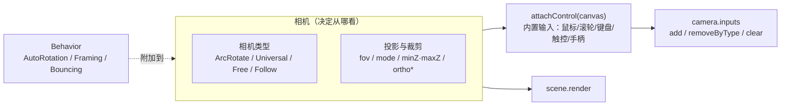

import { Canvas, Controls, Meta } from '@storybook/addon-docs/blocks';
import * as CamerasStories from './cameras-and-controls.stories';

<Meta of={CamerasStories} name="Docs" />

# 相机与控制

Babylon.js 的相机与 three.js 最大的差异在于：**相机自带控制**。一台 `ArcRotateCamera` 创建出来就是一台可用鼠标拖拽、滚轮缩放、右键平移的轨道相机；`FreeCamera` / `UniversalCamera` 默认就响应方向键 + 鼠标 + 触控 + 手柄（WASD 只需 push 进 `keysUp` 等数组）——只要调一次 `camera.attachControl(canvas, true)`，输入立刻生效，不必像 three.js 那样另引一个 `OrbitControls`、`PointerLockControls` 并在每帧 `update()`。

本课先把"相机自带控制"讲清，再依次过三大相机（`ArcRotateCamera` / `UniversalCamera`，并提 `FreeCamera`、`FollowCamera` 与基类 `TargetCamera`）、投影与裁剪、可定制的 `camera.inputs`，以及通用 Behavior 模式（`AutoRotationBehavior`、`FramingBehavior`）。读完后，你应能根据场景选择相机、配置投影、定制输入，并知道闲置自转与自动框选从哪里来。



| 概念或输入 | 取值 / 默认 | 回查要点 |
| --- | --- | --- |
| `attachControl(canvas, true)` | 第 2 参 `noPreventDefault` | 不调用相机也能渲染，只是不能交互；three.js 用户最易漏掉这一步 |
| `ArcRotateCamera` 构造 | `(name, alpha, beta, radius, target, scene)`；alpha/beta 弧度 | radius 已把相机挪开，不必再 `position.set(0,0,5)` |
| `UniversalCamera` | FreeCamera 的超集 | 第一人称场景的首选；默认带键鼠 + 触控 + 手柄 |
| `camera.fov` | `0.8`（**弧度**，约 45.8°） | 与 three.js 的「度数」不同 |
| `camera.mode` | `Camera.PERSPECTIVE_CAMERA`（=0，默认） | `ORTHOGRAPHIC_CAMERA`（=1）切正交 |
| `camera.minZ` / `maxZ` | `1` / `10000` | 近/远裁剪面，单位与世界一致 |
| `orthoLeft/Right/Top/Bottom` | `null` | null 时按渲染缓冲像素当单位，正交视图通常要先显式设置 |
| `camera.inputs` | `CameraInputsManager` | 可按类型 `add` / `removeByType` / `clear` |
| `useAutoRotationBehavior` | `false` | true 时闲置 `idleRotationWaitTime`（默认 2000 ms）后自动绕 target 转动 |
| `useFramingBehavior` | `false` | true 时自动把目标 mesh 框进画面 |

## 相机自带控制：attachControl 与输入管理

three.js 把相机和控制器分成两个对象：`PerspectiveCamera` 只决定"从哪看"，鼠标交互得另装 `OrbitControls` 并在每帧 `controls.update()`。Babylon 走相反方向——相机本身持有一个 `CameraInputsManager`（`camera.inputs`），里面预装好对应相机类型的所有输入处理器；调用 `attachControl` 把它们接到 canvas 的 DOM 事件上，相机就开始响应。

```ts
import { ArcRotateCamera, Vector3 } from '@babylonjs/core';

const camera = new ArcRotateCamera('cam', -Math.PI / 2, Math.PI / 2, 5, Vector3.Zero(), scene);
camera.attachControl(canvas, true);   // 启用鼠标拖拽旋转、滚轮缩放、右键/Ctrl+左键平移
// camera.detachControl();            // 临时禁用输入（例如过场动画时）
```

- `attachControl` 在 v9 仍是经典签名：第 1 个参数是 canvas（也可省略，由 engine 取输入元素），第 2 个 `noPreventDefault` 为 `true` 表示不阻止事件默认行为。`ArcRotateCamera` 还有第 3 参 `useCtrlForPanning`（默认 `true`，Ctrl + 左键平移）和第 4 参 `panningMouseButton`（默认 `2`，右键平移）。
- 不调用 `attachControl` 相机依然能渲染——它只是不接收输入；这是排查"为什么我拖不动画面"的第一站。
- 切换 `scene.activeCamera` 时，要 `detachControl()` 旧相机再 `attachControl()` 新相机，否则两个相机的输入处理器都会挂在 canvas 上、互相干扰。

输入处理器都登记在 `camera.inputs` 里，可按类型增删替换。`UniversalCamera` 默认的输入集合可以这样改：

```ts
// 关掉键盘移动（例如想做自定义 WASD）
camera.inputs.removeByType('FreeCameraKeyboardMoveInput');

// 给 FreeCamera 补回触控或手柄（UniversalCamera 默认就带）
camera.inputs.addTouch();
camera.inputs.addGamepad();
```

每类输入是一个独立的小对象（实现 `attachControl` / `detachControl` / `checkInputs` / `getClassName`），可以自己写一个塞进 manager——这就是 Babylon 不需要"控制器插件"生态的原因。

下面的实例用同一场景切换 `ArcRotateCamera` 与 `UniversalCamera`，并演示切换 `camera.mode`（透视↔正交）。拖拽画布感受 `attachControl` 内置输入：ArcRotate 模式下左键转、滚轮缩放、右键/Ctrl+左键平移；Universal 模式下鼠标转视角、WASD 走。

<Canvas of={CamerasStories.Cameras} />

<Controls of={CamerasStories.Cameras} />

| 读者操作 | 可观察证据 |
| --- | --- |
| 选「ArcRotateCamera」并拖拽画布 | 左键改变 alpha/beta，读数 `alpha`/`beta` 同步变化；滚轮改变 `radius` |
| 选「UniversalCamera」并按 WASD | 读数「位置」随移动变化；鼠标拖拽改变视角（不进 readout） |
| 切「投影模式」到「正交」 | 4 角的彩色盒子不再"近大远小"，尺寸基本一致；`orthoLeft/Right/Top/Bottom` 由范例按 aspect 设定 |
| 切回「透视」 | 远处盒子重新变小，FOV 读数回到约 `45.8°` |
| 调整浏览器窗口大小 | 正交模式下左右边界按新 aspect 重算，画面不被拉伸 |

## 相机家族

Babylon 的具体相机都继承自 `Camera` → `TargetCamera`：`TargetCamera` 提供"看向一个 target"的语义（`setTarget()` / `getTarget()`、`cameraDirection`、`cameraRotation`），具体子类决定位置和朝向怎么产生。日常 90% 的场景只在两台相机里挑：

| 相机 | 怎么定位 | 默认输入 | 适用 |
| --- | --- | --- | --- |
| `ArcRotateCamera` | 绕 target 的 `alpha`/`beta`/`radius` | 鼠标旋转 + 滚轮缩放 + 右键/Ctrl 平移 | 模型查看器、编辑器、轨道巡视 |
| `UniversalCamera` | `position` + `setTarget()` | 方向键（可加 WASD）+ 鼠标 + 触控 + 手柄 | 第一人称、walkthrough |
| `FreeCamera` | 同 Universal | 默认只有键鼠 | Universal 的轻量祖先；新项目优先用 Universal |
| `FollowCamera` | 跟随某个 mesh，自动保持距离/角度 | 自带半径/高度/抬升角控制 | 第三人称跟随（赛车、RPG） |

### ArcRotateCamera

`ArcRotateCamera` 是 Babylon 最常用的相机。它不"放在某处往前看"，而是永远绕着一个 `target` 旋转：用 `alpha`（绕 Y 轴的经度角）、`beta`（绕 X 轴的纬度角）和 `radius`（到 target 的距离）定位，三个参数都写在构造里。

```ts
import { ArcRotateCamera, Vector3 } from '@babylonjs/core';

// alpha=-π/2 把相机放在 -Z 一侧；beta=π/2 让它平视；radius=5 把相机挪到离 target 5 单位。
const camera = new ArcRotateCamera(
  'cam',
  -Math.PI / 2,   // alpha，弧度
  Math.PI / 2,    // beta，弧度（被 lowerBetaLimit/upperBetaLimit 限制在 (0, π)）
  5,              // radius
  Vector3.Zero(), // target
  scene,
);
camera.attachControl(canvas, true);
```

几个关键属性（默认值取自源码 `arcRotateCamera.pure.ts`，pointer input 上的值取自 `arcRotateCameraPointersInput.ts`）：

| 属性 | 默认 | 影响 |
| --- | --- | --- |
| `lowerBetaLimit` / `upperBetaLimit` | `0.01` / `Math.PI - 0.01` | 限制 beta 不到极点，避免视角翻转 |
| `lowerRadiusLimit` / `upperRadiusLimit` | `null` / `null` | null 表示不限；建议显式设下限避免穿到 target 里 |
| `angularSensibilityX` / `angularSensibilityY` | `1000`（pointer input） | 数值越小越灵敏（反比关系） |
| `panningSensibility` | `1000`（pointer input） | 同样反比；设为 `0` 关闭平移 |
| `wheelDeltaPercentage` | `0` | 非 0 时按 radius 的百分比响应滚轮，大小场景一致 |
| `checkCollisions` | `false` | true 时相机与标记了 `checkCollisions` 的 mesh 碰撞 |

拖拽和滚轮都是 `attachControl` 自动接上的——不需要写任何 `addEventListener`。

### FreeCamera 与 UniversalCamera

`FreeCamera` 用 `position` + `setTarget()` 描述"站在哪、看向哪"，是 Babylon 最早的自由相机。`UniversalCamera`（v2.3 引入）继承 `FreeCamera`，把触控和手柄输入也默认加进 `inputs`，是当前推荐的"第一人称"相机。

```ts
import { UniversalCamera, Vector3 } from '@babylonjs/core';

const camera = new UniversalCamera('fp', new Vector3(0, 1.6, -6), scene);
camera.setTarget(Vector3.Zero());   // 看向原点
camera.attachControl(canvas, true); // WASD 移动、鼠标旋转
```

控制键码写在 `camera.keysUp` / `keysDown` / `keysLeft` / `keysRight`（以及上下垂直方向的 `keysUpward` / `keysDownward`）上，**默认只有方向键**（38/40/37/39）。要加 WASD，push 进对应数组即可：

```ts
camera.keysUp.push(87);    // W
camera.keysDown.push(83);  // S
camera.keysLeft.push(65);  // A
camera.keysRight.push(68); // D
```

`speed` / `inertia` 控制移动手感和阻尼，`applyGravity` 配合 `checkCollisions` 可以做出带碰撞的漫游。

> `FreeCamera`、旧的 `TouchCamera`、`GamepadCamera` 都已被 `UniversalCamera` 取代。新项目除非有特殊理由（更小的树摇体积、要保持与旧代码完全一致），否则直接用 `UniversalCamera`。

### TargetCamera 基类与 FollowCamera

`TargetCamera` 是 `FreeCamera`、`UniversalCamera`、`ArcRotateCamera` 的共同基类，提供 `setTarget()` / `getTarget()` 和派生的 view matrix。一般不直接 `new TargetCamera`，但理解它有助于解释为什么这些相机都有 `setTarget` 语义。

`FollowCamera` 是一个特殊子类：把 `camera.followed` 设成某个 mesh，它就自动保持 `radius`（距离）、`heightOffset`（抬升高度）和 `rotationOffset`（绕 target 的角度），适合第三人称跟随镜头。Behavior 模式（见后）能让你不换相机就给 `ArcRotateCamera` 加类似行为。

## 投影与裁剪

`Camera` 基类已经定义了投影属性，三种相机投影行为一致：

```ts
import { Camera } from '@babylonjs/core';

camera.fov = 0.8;                         // 弧度（默认 0.8，约 45.8°），与 three.js 的度数不同
camera.mode = Camera.PERSPECTIVE_CAMERA;  // 默认（=0）
camera.mode = Camera.ORTHOGRAPHIC_CAMERA; // 切到正交（=1）
camera.minZ = 0.1;
camera.maxZ = 1000;
```

- **`fov` 是弧度，不是度数。** 这是从 three.js（度数）迁移时最常踩的坑。`Tools.ToRadians(45)` 换算，或直接写 `Math.PI / 4`。
- **`fovMode`** 决定 `fov` 锁哪条边：`FOVMODE_VERTICAL_FIXED`（默认，竖边固定、横边按 aspect 缩放）或 `FOVMODE_HORIZONTAL_FIXED`。改窗口宽高时哪条边不变形由它决定。
- **正交模式需要手动设置 `orthoLeft/Right/Top/Bottom`**。源码里它们默认是 `null`，投影矩阵按"渲染缓冲的像素当世界单位"计算，对正常场景来说是错的。常见写法是固定观察高度，按 aspect 推算左右：

```ts
const halfHeight = 5;
const aspect = engine.getRenderWidth() / engine.getRenderHeight();
camera.orthoLeft = -halfHeight * aspect;
camera.orthoRight = halfHeight * aspect;
camera.orthoTop = halfHeight;
camera.orthoBottom = -halfHeight;
```

回到上面的「相机与投影」实例，切到「正交」就能看到 4 角的盒子不再"近大远小"——观察窗口尺寸只由 `ortho*` 决定，与相机距离无关。

- `minZ` / `maxZ` 是裁剪面，单位与世界单位一致。`minZ` 太小、`maxZ` 太大会让深度缓冲铺得过宽，引发 z-fighting；通常按场景尺度收紧。
- `ignoreCameraMaxZ` 设为 `true` 可让远裁面不剔除（计算投影时 maxZ 取 0），用于需要极远天空盒的场景。

## Behavior 模式

Babylon 的 `Behavior` 是一个通用模式：任何 `Node`（包括相机）都可以 `addBehavior(behavior)` / `removeBehavior(behavior)`，行为对象实现 `init()` / `attach(node)` / `detach()`。在 `ArcRotateCamera` 上有三个相机专用 behavior 的快捷开关：

| 开关 | 类 | 作用 |
| --- | --- | --- |
| `camera.useAutoRotationBehavior = true` | `AutoRotationBehavior` | 闲置 `idleRotationWaitTime`（默认 2000 ms）后自动绕 target 缓慢转动 |
| `camera.useFramingBehavior = true` | `FramingBehavior` | 自动把目标 mesh 框进画面，并可限制不低于某个水平面 |
| `camera.useBouncingBehavior = true` | `BouncingBehavior` | beta 触碰 `lowerBetaLimit`/`upperBetaLimit` 时弹一下 |

```ts
camera.useAutoRotationBehavior = true;
const behavior = camera.autoRotationBehavior; // 取引用（可能为 null）
behavior.idleRotationWaitTime = 1500;          // ms
behavior.idleRotationSpeed = 0.1;              // 弧度/帧（默认 0.05）
```

这些 `useXxxBehavior` 是 setter：`true` 时创建实例并 `addBehavior`，`false` 时 `removeBehavior`。设回 `false` 是安全关闭，不会泄漏监听。

`FramingBehavior` 默认模式是 `FramingBehavior.FitFrustumSidesMode`（=1，按视锥边贴合目标包围盒），另一个常量是 `FramingBehavior.IgnoreBoundsSizeMode`（=0）。常用方法：`zoomOnMesh(mesh)` / `zoomOnMeshes(meshes)`，配合 `framingTime`（默认 1500 ms）做动画框选。

下面的实例用同一个舞台，开关 `AutoRotationBehavior`：开启后松开鼠标约 2 秒，相机开始缓慢绕 target 自转；任何拖拽/滚轮都会重置等待计时。读数「正在自转」会跟随状态翻转。

<Canvas of={CamerasStories.Behaviors} />

<Controls of={CamerasStories.Behaviors} />

| 读者操作 | 可观察证据 |
| --- | --- |
| 打开「AutoRotationBehavior」并停止操作 | 约 2 秒后读数「正在自转」变为「是」，`alpha` 持续增长 |
| 拖拽或滚轮 | 自转立即停止，等待计时被重置 |
| 关闭「AutoRotationBehavior」 | 读数「行为」变为「未挂载」，相机停在手动停止的位置 |

## 最佳实践

- 默认场景从 `ArcRotateCamera` 开始：一行 `attachControl` 就有完整的轨道交互，不要自己写控制器。
- 第一人称场景用 `UniversalCamera` 而不是 `FreeCamera`：前者默认带触控 + 手柄输入，移动端友好。
- 切换 `scene.activeCamera` 时记得 `detachControl()` 旧相机再 `attachControl()` 新相机，否则两个相机都会接管 canvas 事件。
- 切到正交投影时显式设置 `orthoLeft/Right/Top/Bottom`（按 aspect 推算），并在 `engine.onResizeObservable` 里重算；否则窗口缩放会拉伸画面。
- 把 `lowerRadiusLimit` 设成大于 0 的值，避免用户滚轮贴脸穿到 target 内部。
- `minZ` 不要设得极小（如 `0.0001`），否则远处表面容易出现 z-fighting；按场景尺度收紧。
- 从 three.js 迁移时核对：`fov` 是弧度不是度数，相机自带控制不用再装 OrbitControls。
- Behavior 用来"加一点自动行为"而非替换相机逻辑：闲置自转、模型框选用 behavior；自定义运动直接改 `alpha`/`beta`/`radius` 或 `position`。

## 常见问题

- 为什么拖不动画布、滚轮也不缩放？
  没调 `camera.attachControl(canvas, true)`。Babylon 相机的输入需要显式接到 canvas；只创建相机不会自动接管 DOM 事件。
- 从 three.js 迁移后画面视角怎么不对？
  `fov` 在 Babylon 里是弧度。three.js 的 `PerspectiveCamera(50, ...)` 对应 Babylon 的 `camera.fov = Math.PI / 4`（约 0.785），不要直接把 `50` 当度数写进去。
- 切换相机后两个相机好像同时在动？
  `scene.activeCamera` 切换时旧相机仍然 attach 着 canvas。先 `oldCamera.detachControl()`，再 `scene.activeCamera = newCamera` + `newCamera.attachControl(canvas, true)`。
- 切到正交后画面糊成一小块或看不见？
  `orthoLeft/Right/Top/Bottom` 默认是 `null`，等价于"1 像素 = 1 单位"。显式按场景尺度设置四个边界，并在 resize 时重算。
- 为什么 ArcRotateCamera 不能上下转到极点？
  `beta` 被 `lowerBetaLimit`（默认 `0.01`）和 `upperBetaLimit`（默认 `Math.PI - 0.01`）限制，避免视角在极点翻转。需要完全自由旋转时调宽这两个限制。
- 开了 `useAutoRotationBehavior` 却不自转？
  `idleRotationWaitTime`（默认 2000 ms）内只要有任何指针/滚轮输入都会重置计时。完全松开鼠标等满等待时间才会启动；也可以把 `idleRotationWaitTime` 调小验证。
- UniversalCamera 在移动端不能用？
  确认是 `UniversalCamera` 而不是 `FreeCamera`——后者默认不带触控输入。也可以 `camera.inputs.addTouch()` 给 `FreeCamera` 补上。

## 总结回顾

摘要：

Babylon 相机与 three.js 最大不同是**自带控制**：`attachControl(canvas, true)` 把预置的 `CameraInputsManager` 接到 canvas，ArcRotate 自带轨道交互、Universal 自带 WASD + 鼠标 + 触控 + 手柄，无需另引控制器。三大家族（`ArcRotateCamera` 绕 target 的 alpha/beta/radius；`UniversalCamera`/`FreeCamera` 第一人称；`FollowCamera` 自动跟随）共享 `TargetCamera` 基类的 `setTarget` 语义。投影由 `fov`（弧度）、`mode`（`PERSPECTIVE_CAMERA`/`ORTHOGRAPHIC_CAMERA`）、`minZ`/`maxZ` 和 `ortho*` 控制；正交下 `ortho*` 默认 `null`，要显式按 aspect 设置。Behavior 是通用附加模式，`useAutoRotationBehavior` / `useFramingBehavior` 提供"闲置自转"和"自动框选"。

一句话：

> Babylon 相机自带 `attachControl`：创建即拥有交互，输入可经 `camera.inputs` 定制，自动行为用 Behavior 附加——不另装控制器。

知识要点：

- 为什么 Babylon 相机不需要像 three.js 那样另引 OrbitControls？
- `attachControl` 不调用、调用但场景里切了 `activeCamera`，分别会发生什么？
- `ArcRotateCamera` 的 alpha/beta/radius/target 各决定什么？为什么不用再手动 `position.set`？
- `UniversalCamera` 与 `FreeCamera` 的输入集合差在哪？什么时候选哪一个？
- `camera.fov` 在 Babylon 里是弧度还是度数？切到正交投影后哪几个属性必须手动设置？
- `camera.inputs` 怎样移除一个默认输入或加一个自定义输入？
- `useAutoRotationBehavior` 与 `useFramingBehavior` 各自解决什么问题？它们是 setter 而不是普通赋值意味着什么？

## 参考资料

- [Babylon.js Features：Cameras Introduction](https://doc.babylonjs.com/features/featuresDeepDive/cameras/camera_introduction)
- [Babylon.js Features：Customizing Camera Inputs](https://doc.babylonjs.com/features/featuresDeepDive/cameras/customizingCameraInputs)
- [Babylon.js Features：Camera Behaviors](https://doc.babylonjs.com/features/featuresDeepDive/behaviors/cameraBehaviors)
- [Babylon.js TypeDoc：Camera](https://doc.babylonjs.com/typedoc/classes/BABYLON.Camera)
- [Babylon.js TypeDoc：ArcRotateCamera](https://doc.babylonjs.com/typedoc/classes/BABYLON.ArcRotateCamera)
- [Babylon.js TypeDoc：UniversalCamera](https://doc.babylonjs.com/typedoc/classes/BABYLON.UniversalCamera)
- [Babylon.js TypeDoc：AutoRotationBehavior](https://doc.babylonjs.com/typedoc/classes/BABYLON.AutoRotationBehavior)
- [Babylon.js TypeDoc：FramingBehavior](https://doc.babylonjs.com/typedoc/classes/BABYLON.FramingBehavior)
- [Babylon.js Source：Cameras 目录](https://github.com/BabylonJS/Babylon.js/tree/master/packages/dev/core/src/Cameras)
