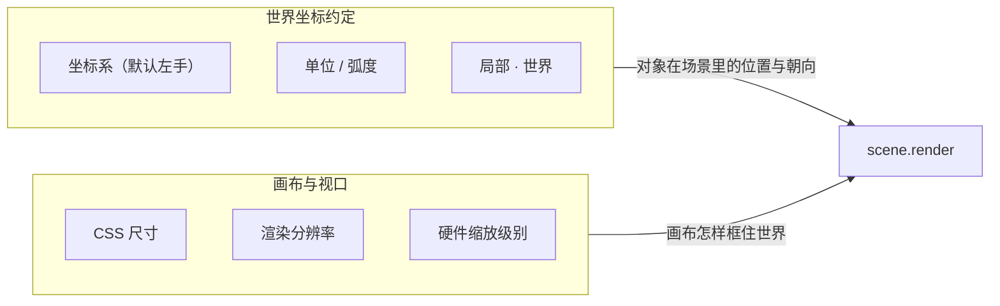

import { Canvas, Controls, Meta } from '@storybook/addon-docs/blocks';
import * as CoordinateStories from './coordinate-system-and-units.stories';

<Meta of={CoordinateStories} name="Docs" />

# 坐标与尺寸

Babylon.js 里有两套相关但独立的测量约定：**世界坐标约定**回答场景内“在哪、朝哪、多大”；**画布与视口**回答屏幕如何框住世界。轴朝向、世界单位、弧度、局部·世界合起来描述对象状态；canvas 的 CSS 尺寸、渲染分辨率、硬件缩放与 `engine.resize()` 合起来决定投影怎样映射到像素。两套链路任一环节不同步，就会出现拉伸、锯齿，或让从 three.js 迁移来的代码朝向错乱。



| 概念或输入 | 取值 / 默认 | 回查要点 |
| --- | --- | --- |
| 坐标系 | 默认**左手系**：`+X` 右、`+Y` 上、`+Z` 朝前（画面深处） | 与 three.js / WebGL 的右手系相反；`scene.useRightHandedSystem = true` 切换 |
| `AxesViewer` | `new AxesViewer(scene, scaleLines=1)` | X 红、Y 绿、Z 蓝；只可视化世界轴，不改渲染 |
| 世界单位 | 无内置单位；`1` 是场景标量 | 模型、相机 `minZ`/`maxZ`、灯光范围共用同一约定 |
| `position` / `rotation` / `scaling` | `Vector3`；默认 `(0,0,0)` / `(0,0,0)` / `(1,1,1)` | `rotation` 是**弧度**欧拉角（YXZ 顺序） |
| `getAbsolutePosition()` | 返回世界坐标 | 读取前 `computeWorldMatrix(true)` 避免旧值 |
| `Engine` 构造 `adaptToDeviceRatio` | 第 4 参，默认 `false`；共享 runtime 传 `true` | `true` 时按 `devicePixelRatio` 放大画布缓冲 |
| `engine.setHardwareScalingLevel(level)` | 默认 `1` | `>1` 降渲染分辨率（更省），`<1` 超采样（更清晰） |
| `engine.resize()` | 按当前 CSS 尺寸重建缓冲 | 容器变化后调用；共享 runtime 已随 `ResizeObserver` 自动调用 |

## 默认左手坐标系

Babylon.js 默认使用**左手坐标系**：`+X` 向右、`+Y` 向上、`+Z` 朝画面深处（“朝前”）。这是和 three.js、OpenGL/WebGL 最常踩的坑——后三者是右手系，`+Z` 朝向观察者。从 three.js 迁移代码或导入右手系资产时，朝向、剔除和拾取可能整体反掉。

用 `AxesViewer` 在原点画出三色世界轴核对：X 红、Y 绿、Z 蓝，沿 `+X/+Y/+Z` 各画一条箭头。

```ts
import { AxesViewer } from '@babylonjs/core';

// 在原点显示长度为 3 的三色轴：红 X / 绿 Y / 蓝 Z
new AxesViewer(scene, 3);
```

| 轴 | 颜色 | 默认方向 |
| --- | --- | --- |
| `+X` | 红 | 屏幕右方 |
| `+Y` | 绿 | 屏幕上方 |
| `+Z` | 蓝 | 朝画面深处（Babylon 的“前方”；与 three.js 相反） |
| `-Z` | （反向） | 朝向观察者（three.js 里才是“前方”） |

切到右手系只需一个属性——它会让投影矩阵和背面剔除翻转，对齐 three.js / glTF 的约定：

```ts
scene.useRightHandedSystem = true; // 默认 false（左手系）
```

下面的实例用 `AxesViewer` 显示世界轴，并放了一个父/子节点。相机可以拖动轨道，从任意角度核对三色轴方向。

<Canvas of={CoordinateStories.CoordinateSpace} />

<Controls of={CoordinateStories.CoordinateSpace} />

| 读者操作 | 可观察证据 |
| --- | --- |
| 拖动 Canvas | 轨道相机绕原点旋转，从不同角度确认红 X / 绿 Y / 蓝 Z 的朝向 |
| 打开「切换右手系」 | 坐标系读数变成「右手系」，投影翻转使场景沿深度镜像、背面剔除方向反转（材质已关剔除，所以方块不会消失） |
| 调「父节点 rotation.y」 | 子节点局部坐标不变，世界坐标随父级旋转变化——见下一节 |

从 three.js 迁移时的常见做法是任选其一：保持 Babylon 默认左手系，自己在导入层翻转 Z；或直接 `scene.useRightHandedSystem = true` 对齐来源。glTF 资产本身是右手系，`SceneLoader` 的 glTF 加载器会按当前坐标系做补偿，不必手工翻转每个网格。

## 世界单位与弧度

`position.set(2.5, 0, 0)` 里的 `2.5` 没有内置物理单位——它只是场景标量。常见约定把 `1` 当作“1 米”，也可以是厘米或自定义单位；模型尺寸、相机距离、`minZ` / `maxZ`、灯光范围必须共用同一约定，否则会出现“近裁面吃掉模型”或“灯光照不到”的奇怪现象。

这些标量写在 `TransformNode` / `Mesh` 的变换属性上，类型固定：

| 属性 | 类型 | 默认值 | 本课用法 |
| --- | --- | --- | --- |
| `position` | `Vector3` | `(0, 0, 0)` | `position.set(2.5, 0, 0)` 或改分量 |
| `rotation` | `Vector3` | `(0, 0, 0)`，YXZ 顺序 | `rotation.y = Math.PI / 2`；分量是**弧度** |
| `scaling` | `Vector3` | `(1, 1, 1)` | `scaling.set(2, 2, 2)` 均匀放大 |
| `rotationQuaternion` | `Quaternion` | `null` | 一旦设置，`rotation` 不再生效；本课用欧拉角 |

`MeshBuilder.CreateBox({ size: 0.9 })` 决定几何在局部空间的固有尺寸；需要“看起来更大/更小”时优先改 `scaling`，不要把几何尺寸当成屏幕像素。几何定形状，`scaling` 定相对倍数——两者都用世界单位。

`rotation` 的分量是**弧度**，不是度数。Babylon 的旋转、`Math.atan2` 都用弧度；常见角度直接用 `Math.PI` 表达：

| 度数 | 弧度表达式 | 近似值 |
| --- | --- | --- |
| 30° | `Math.PI / 6` | ≈ 0.524 |
| 45° | `Math.PI / 4` | ≈ 0.785 |
| 60° | `Math.PI / 3` | ≈ 1.047 |
| 90° | `Math.PI / 2` | ≈ 1.571 |
| 180° | `Math.PI` | ≈ 3.142 |
| 360° | `Math.PI * 2` | ≈ 6.283 |

度数与弧度互转用 `Tools.ToRadians(deg)` / `Tools.ToDegrees(rad)`（`@babylonjs/core` 里 `Tools` 命名空间），或直接 `deg * Math.PI / 180`。对 `Math.cos` / `Math.sin` 传参前，先确认单位是弧度。

## 局部空间与世界空间

`position` / `rotation` / `scaling` 都是相对**父级**的局部变换。同一个 `child.position.set(2.5, 0, 0)`，挂在场景根下时世界位置是 `(2.5, 0, 0)`；挂在已绕 Y 旋转 90° 的父级下时，世界位置会落到 Z 分量上——局部值没变，是父级把局部 `+X` 方向重新映射了。

```ts
const parent = new TransformNode('parent', scene);
parent.rotation.y = Math.PI / 2; // 90°，弧度

const child = MeshBuilder.CreateBox('child', { size: 0.9 }, scene);
child.parent = parent;
child.position.set(2.5, 0, 0); // 局部值恒为 (2.5, 0, 0)

// 读取世界坐标：先强制刷新世界矩阵，再取绝对位置。
child.computeWorldMatrix(true);
const world = child.getAbsolutePosition(); // 约 (0, 0, -2.5)
```

读取世界结果前必须确保世界矩阵已更新：`getAbsolutePosition()` 内部会调一次 `computeWorldMatrix()`，但父级链可能还停在旧值。显式 `child.computeWorldMatrix(true)` 会递归刷新父级，再读 `getAbsolutePosition()` 才是当前帧的值。

继续用上面的「坐标空间」实例核对局部·世界差异：

| 读者操作 | 可观察证据 |
| --- | --- |
| 「父节点 rotation.y」调到 `90` | 子节点局部读数恒为 `(2.50, 0.00, 0.00)`，世界读数变为约 `(0.00, 0.00, -2.50)`——X 分量转到 Z 分量 |
| 「父节点 rotation.y」调到 `-90` | 世界读数变为约 `(0.00, 0.00, 2.50)`，局部读数不变 |
| 「切换右手系」打开/关闭 | 局部和世界坐标的**数值**不变（旋转矩阵不随手系翻转），但屏幕上的投影和剔除方向会反 |

矩阵层级、`parent` / `addChild`、`detachFromParent`、`billboardMode` 的完整机制见 [TransformNode](?path=/docs/transformnode-and-grouping--docs)。这里先记住：**判断物体最终在哪里，始终把局部值、父级链和矩阵生效时机一起看**。

## 画布尺寸与硬件缩放

canvas 同时有两层尺寸：**CSS 显示尺寸**（`canvas.clientWidth / clientHeight`）回答“页面上占多大”，**渲染分辨率**（`engine.getRenderWidth() / getRenderHeight()`）回答“WebGL 实际画多少像素”。二者可以不同：CSS 显示 `600 × 338`、设备像素比 `2`、硬件缩放 `1` 时，渲染分辨率通常是 `1200 × 676`。

```text
canvas.clientWidth/Height  ──engine.resize()──►  渲染缓冲（canvas.width/height）
                                                        │
                                                        ÷ engine.getHardwareScalingLevel()
                                                        ▼
                                                  getRenderWidth/Height（实际绘制像素）
```

`Engine` 构造的第 4 个参数 `adaptToDeviceRatio` 控制是否按 `devicePixelRatio` 放大渲染缓冲；共享 runtime（`assets/babylon-canvas.js`）传 `true`，让 retina 屏自动更清晰：

```ts
import { Engine } from '@babylonjs/core';

// adaptToDeviceRatio=true：按 devicePixelRatio 放大 canvas.width/height
const engine = new Engine(canvas, true, { stencil: true, preserveDrawingBuffer: true }, true);
```

在渲染缓冲之上，`engine.setHardwareScalingLevel(level)` 再做一次整体缩放，是质量与性能的旋钮：

| 级别 | 渲染分辨率（相对 CSS 尺寸） | 适用 |
| --- | --- | --- |
| `< 1`（如 `0.5`） | 更高（超采样，更清晰） | 截图、质量优先；像素量按面积增长 |
| `1`（默认） | 等于渲染缓冲 | 常规 |
| `> 1`（如 `2`） | 更低（更省 GPU） | 移动端重场景、低端设备 |

```ts
engine.setHardwareScalingLevel(2); // 渲染分辨率减半，更省
engine.setHardwareScalingLevel(0.5); // 超采样，更清晰
```

容器尺寸变化时要调 `engine.resize()`，让渲染缓冲按新 CSS 尺寸重建。共享 runtime 已用 `ResizeObserver` 监听 canvas 父容器自动调用，所以本页所有实例在浏览器窗口缩放时都不会拉伸；自己写渲染循环时记得挂等价逻辑：

```ts
const resizeObserver = new ResizeObserver(() => engine.resize());
resizeObserver.observe(canvas.parentElement ?? canvas);
```

下面的实例把这几层尺寸关系显示为读数。改硬件缩放级别，渲染分辨率跟着反向变化，CSS 尺寸保持不变；缩放浏览器窗口，CSS 尺寸和渲染分辨率会一起更新（runtime 自动 `engine.resize()`）。

<Canvas of={CoordinateStories.CanvasScaling} />

<Controls of={CoordinateStories.CanvasScaling} />

| 读者操作 | 可观察证据 |
| --- | --- |
| 调「硬件缩放级别」到 `2` | CSS 尺寸不变，渲染分辨率数值减半，圆环边缘锯齿变明显 |
| 调「硬件缩放级别」到 `0.5` | 渲染分辨率翻倍（超采样），边缘更平滑 |
| 缩放浏览器窗口或开合侧栏 | CSS 尺寸和渲染分辨率同步更新（runtime 自动 `engine.resize()`），圆环不被拉伸 |

## 最佳实践

- 新场景先加 `AxesViewer` 和一个参考网格，立刻指出朝向错误，再调相机与物体。
- 项目早期确定“1 单位表示什么”，让模型、相机 `minZ` / `maxZ` 和灯光范围共用约定。
- 从 three.js 迁移时先决定坐标系策略：保持左手系在导入层翻转 Z，或 `scene.useRightHandedSystem = true` 对齐来源——二选一，不要混用。
- 改位置写 `position`，改朝向写 `rotation`（弧度），改相对大小写 `scaling`；不要把几何尺寸当成像素。
- 需要世界坐标时显式 `computeWorldMatrix(true)` 再读 `getAbsolutePosition()`，尤其在 `onBeforeRenderObservable` 里、渲染发生之前。
- 把硬件缩放级别当质量预算：移动端重场景设 `1.5`–`2`，截图/演示设 `0.5`–`1`；不盲目让 `adaptToDeviceRatio` 在高 DPR 设备上跑满。
- 容器尺寸变化用 `ResizeObserver` 触发 `engine.resize()`，不要只监听 `window.resize`——侧栏开合、flex 布局变化不一定触发窗口事件。
- 跨引擎或与 Blender / Unity / glTF 交换数据时，先核对对方的轴约定与单位。

## 常见问题

- 为什么从 three.js 迁移后，相机朝向或模型“里外翻转”了？
  Babylon 默认左手系（`+Z` 朝前），three.js 是右手系（`+Z` 朝观察者）。用 `AxesViewer` 核对当前朝向；需要时 `scene.useRightHandedSystem = true`，或在导入层翻转 Z。
- 为什么 `child.position.set(2.5, 0, 0)`，最终世界位置却在 Z 轴上？
  `position` 相对父级。检查挂在哪个父级下、父级有没有旋转；用 `child.getAbsolutePosition()` 读世界坐标，必要时先 `computeWorldMatrix(true)`。
- 为什么 `rotation.y = 45` 物体转得过多？
  `rotation` 是弧度；`45` 约等于 2578 度。改用 `Tools.ToRadians(45)` 或 `Math.PI / 4`。
- 为什么容器尺寸变了，画面被拉伸或模糊？
  没有调 `engine.resize()`，渲染缓冲停在旧值。用 `ResizeObserver` 监听真正控制布局的容器并触发 `engine.resize()`。
- 为什么 `getAbsolutePosition()` 读到的世界坐标是上一帧的旧值？
  它内部只在不脏时才重算。在 `onBeforeRenderObservable` 里、渲染之前读，要先 `child.computeWorldMatrix(true)` 强制刷新父级链。
- 为什么高 DPR 设备明显掉帧？
  `adaptToDeviceRatio=true` 会把渲染缓冲按 `devicePixelRatio` 放大（retina 层 2× 甚至 3×）。用 `engine.setHardwareScalingLevel(1.5)` 或更高级别降渲染分辨率，像素工作量按面积回落。
- 为什么导入 glTF 模型后朝向和原软件里不一样？
  glTF 是右手系，加载器会按当前 `scene.useRightHandedSystem` 补偿。确认你没有再手工翻转一次，或在不同坐标系设置下重复加载。

## 总结回顾

摘要：

世界坐标约定与画布视口是两套独立测量链路。坐标系（默认左手系，`+Z` 朝前）、世界单位、弧度、局部·世界描述对象在场景里的状态；CSS 尺寸、渲染分辨率、`adaptToDeviceRatio` 与硬件缩放级别描述屏幕如何框住世界。`AxesViewer` 核对朝向，`scene.useRightHandedSystem` 切换左右手系；`computeWorldMatrix(true)` + `getAbsolutePosition()` 读世界坐标；`engine.setHardwareScalingLevel` 调质量预算，`engine.resize()` 在容器变化时重建缓冲。任一层停在旧状态，都会留下可由读数定位的朝向错乱、拉伸或锯齿。

一句话：

> 场景内用坐标系、单位、弧度与父级链描述对象；屏幕侧用 CSS 尺寸、渲染分辨率与硬件缩放对齐像素——两套链路各自同步，画面才不朝向错乱、不拉伸、不模糊。

知识要点：

- Babylon 的三条轴分别指向哪里？和 three.js 的右手系差在哪？
- 怎样用 `AxesViewer` 和 `scene.useRightHandedSystem` 核对与切换坐标系？
- `1` 在 `position` / `scaling` 里表示多大？`rotation` 用度数还是弧度？
- 同一个局部 `position` 在不同父级下，世界位置为什么会变？怎么可靠地读世界坐标？
- CSS 尺寸、渲染分辨率与硬件缩放级别之间是什么关系？
- `Engine` 的 `adaptToDeviceRatio` 和 `setHardwareScalingLevel` 各自影响哪一层？
- 容器尺寸变化时为什么必须调 `engine.resize()`？

## 参考资料

- [Babylon.js TypeDoc：Scene（`useRightHandedSystem`）](https://doc.babylonjs.com/typedoc/classes/BABYLON.Scene)
- [Babylon.js TypeDoc：Engine（`setHardwareScalingLevel` / `resize`）](https://doc.babylonjs.com/typedoc/classes/BABYLON.Engine)
- [Babylon.js TypeDoc：TransformNode（`getAbsolutePosition` / `computeWorldMatrix`）](https://doc.babylonjs.com/typedoc/classes/BABYLON.TransformNode)
- [Babylon.js TypeDoc：Vector3](https://doc.babylonjs.com/typedoc/classes/BABYLON.Vector3)
- [Babylon.js TypeDoc：AxesViewer](https://doc.babylonjs.com/typedoc/classes/BABYLON.Debug.AxesViewer)
- [Babylon.js World Axes（AxesViewer 用法）](https://doc.babylonjs.com/toolsAndResources/utilities/World_Axes)
- [Babylon.js Guided Learning](https://doc.babylonjs.com/guidedLearning/)
- [MDN：Window.devicePixelRatio](https://developer.mozilla.org/zh-CN/docs/Web/API/Window/devicePixelRatio)
- [MDN：ResizeObserver](https://developer.mozilla.org/zh-CN/docs/Web/API/ResizeObserver)
