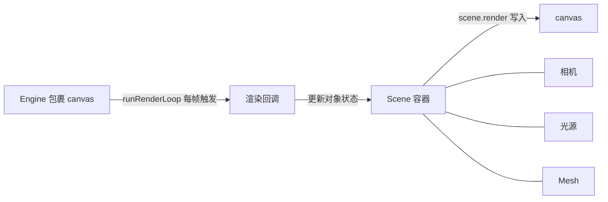

import { Canvas, Controls, Meta } from '@storybook/addon-docs/blocks';
import * as FirstSceneStories from './first-scene.stories';

<Meta of={FirstSceneStories} name="Docs" />

# 第一幅画面

Babylon.js 不替你创建"三维世界"。一幅最小画面靠五个角色协作：`Engine` 把 canvas 包成 WebGL 渲染器，`Scene` 收纳要画的对象，`ArcRotateCamera` 选定从哪里看，`HemisphericLight` 给场景打底光，`MeshBuilder.CreateBox` 生成一个立方体；再由 `engine.runRenderLoop(() => scene.render())` 反复绘制，画面才持续出现。

`scene.render()` 只画当前这一帧。立方体能否进入画面，取决于它是否创建在这个 `scene` 里、相机有没有对准它、场景里有没有光让默认材质可见；立方体会不会动，则取决于每帧渲染前是否更新了 `rotation`。本课用最小闭环把画面跑起来；完整的 `delta`、暂停与按需渲染见 [渲染循环与时间](?path=/docs/render-loop-and-timing--docs)，画布尺寸、像素比和左手坐标系见 [坐标与尺寸](?path=/docs/coordinate-system-and-units--docs)。



| 对象或参数 | 本课取值 / 默认值 | 改变后要注意什么 |
| --- | --- | --- |
| `Engine` | `new Engine(canvas, true)`；本课模板进一步开启 stencil/preserveDrawingBuffer 并适配设备像素比 | antialias 在创建上下文时决定，之后不能改同名属性启用 |
| `Scene` | `new Scene(engine)`，默认空容器 | 相机、光、Mesh 必须传入同一个 scene 才会参与渲染 |
| `ArcRotateCamera` | `alpha=-π/2`、`beta=π/2`、`radius=5`、`target=Vector3.Zero()` | 半径 radius 已经把相机挪开，不必再手动移位置；alpha/beta 单位是弧度 |
| `attachControl` | `attachControl(canvas, true)` | 不调用相机也能渲染；调用后才能用鼠标拖拽、滚轮缩放 |
| `HemisphericLight` | 方向 `(0,1,0)`，`intensity` 默认 1 | 默认材质受光才可见；方向决定哪一面更亮 |
| `MeshBuilder.CreateBox` | `{ size: 1 }`，省略时为默认单位立方体 | 创建时已自动加入传入的 scene |
| `runRenderLoop` | `engine.runRenderLoop(() => scene.render())` | Engine 不持有 scene；回调里要明确渲染哪一个 |
| `onBeforeRenderObservable` | 每帧 `scene.render()` 之前触发 | 在这里读 `engine.getDeltaTime()` 并更新对象状态 |

## 快速上手

准备一个非零尺寸的 `<canvas id="renderCanvas">`，用模块脚本把上面五个角色接起来。刷新页面后会看到一个绕 Y 轴旋转、可以用鼠标拖拽改变视角的立方体：

```ts
import {
  ArcRotateCamera,
  Engine,
  HemisphericLight,
  MeshBuilder,
  Scene,
  Vector3,
} from '@babylonjs/core';

const canvas = document.getElementById('renderCanvas') as HTMLCanvasElement;
const engine = new Engine(canvas, true);

const scene = new Scene(engine);
const camera = new ArcRotateCamera(
  'cam',
  -Math.PI / 2,
  Math.PI / 2,
  5,
  Vector3.Zero(),
  scene,
);
camera.attachControl(canvas, true);

new HemisphericLight('light', new Vector3(0, 1, 0), scene);
const box = MeshBuilder.CreateBox('box', { size: 1 }, scene);

engine.runRenderLoop(() => {
  const dt = engine.getDeltaTime() / 1000;
  box.rotation.y += dt;
  scene.render();
});

window.addEventListener('resize', () => engine.resize());
```

`Engine` 自己不持有 scene，所以 `runRenderLoop` 的回调里必须显式调用 `scene.render()`。`getDeltaTime()` 返回上一帧到现在的毫秒数，除以 1000 转成秒后再乘速度，能让旋转在 60Hz 和 144Hz 屏幕上表现一致。

## 一帧画面靠什么产生

排查空白画面时，按这条关系逐层检查，而不是同时改所有参数。

| 角色 | 本课对象 | 回答的问题 | 最小检查 |
| --- | --- | --- | --- |
| 渲染入口 | `engine.runRenderLoop` | 谁来反复触发绘制 | 是否注册了回调，且回调里调用了 `scene.render()` |
| 场景容器 | `scene` | 画哪些对象 | 相机、光、Mesh 是否都传入了同一个 scene |
| 观察者 | `camera` | 从哪里、什么距离看 | radius 是否足够、target 是否落在物体上；attachControl 只影响交互，不影响能否看见 |
| 光照 | `HemisphericLight` | 默认材质是否被照亮 | 场景里至少有一盏光，否则默认 StandardMaterial 渲染为暗 |
| 可见物体 | `box` | 形状来自哪里 | 是否用 MeshBuilder 创建并传入 scene |

`Engine` 包裹 canvas 和 WebGL 上下文，负责画布、resize 和渲染调度；`Scene` 是中枢容器，持有相机、光源、网格和背景，并提供 `render()` 把当前状态一次性画出来。两者解耦：同一个 Engine 可以在回调里切换渲染多个 Scene，但每一帧仍要你显式指定渲染哪一个。

## 相机绕着目标转

`ArcRotateCamera` 不是"放在某处往前看"的相机，而是一直绕着一个 `target` 旋转：用 `alpha`（绕 Y 轴的经度角）、`beta`（绕 X 轴的纬度角）和 `radius`（到目标的距离）三个参数定位。

```ts
const camera = new ArcRotateCamera('cam', -Math.PI / 2, Math.PI / 2, 5, Vector3.Zero(), scene);
camera.attachControl(canvas, true);
```

`radius=5` 已经把相机放到离原点 5 个单位处，因此位于原点的立方体不会被相机贴脸遮挡——这点和"需要手动把相机后移"的相机不同。`attachControl(canvas, true)` 把鼠标、触摸等输入接到相机，第二个参数 `noPreventDefault` 为 `true` 时不阻止事件默认行为；不调用它画面依然能渲染，只是不能拖拽和滚轮缩放。相机家族（Free/Universal 相机、Behavior、投影与裁剪）见 [相机与控制](?path=/docs/cameras-and-controls--docs)。

## 光照与网格

默认创建的 Mesh 使用 StandardMaterial，它受光才显示颜色，所以第一幅画面必须给场景一盏光。`HemisphericLight` 用一个方向向量定义半球光：方向 `(0,1,0)` 表示光从上方照下来，朝上的面更亮、朝下的面更暗。

```ts
new HemisphericLight('light', new Vector3(0, 1, 0), scene);
const box = MeshBuilder.CreateBox('box', { size: 1 }, scene);
```

`MeshBuilder.CreateBox` 接受选项对象，`size` 默认就是单位立方体，也可以分别指定 `width`、`height`、`depth`。创建时传入 scene，Mesh 就自动加入该场景，不必再手动 add。材质种类、颜色、透明和纹理见 [材质](?path=/docs/materials--docs)；光源家族见 [光源](?path=/docs/lights--docs)。

## 让画面动起来

下面的实例复用上面五个角色，并订阅 `scene.onBeforeRenderObservable`：它在每一帧 `scene.render()` 之前触发，在这里读 `engine.getDeltaTime()` 并累加 `box.rotation.y`。调整「旋转速度」，观察读数里的 Y 轴角度；速度降到 0 时立方体冻结，但 FPS 仍在刷新——这证明渲染循环本身一直在跑，只是状态不再改变。

<Canvas of={FirstSceneStories.Interactive} />

<Controls of={FirstSceneStories.Interactive} />

| 读者操作 | 可观察证据 |
| --- | --- |
| 调整「旋转速度」 | 立方体角速度和读数「Y 轴角度」同步变化 |
| 速度降到 0 | 立方体冻结，读数「状态」变为「已暂停」，FPS 仍持续刷新 |
| 鼠标拖拽画布 | 相机绕目标旋转，视角改变 |
| 打开 Show code | 看到该 Canvas 实际执行的 `example.ts` |

实例进入视口附近才启动渲染循环，离开后停止并保留最后一帧，避免离屏空转；完整的暂停、按需渲染和帧节奏策略见 [渲染循环与时间](?path=/docs/render-loop-and-timing--docs)。

## 用 Inspector 查看场景

Babylon.js 自带一个调试面板，可以查看场景树、对象属性、纹理和性能。它独立成包，需要单独安装 `@babylonjs/inspector`，再在代码里显式打开：

```ts
import { Inspector } from '@babylonjs/inspector';

Inspector.Show(scene, { overlay: true });
```

`Inspector.Show(scene, options)` 接受一个 Scene 和一组面板选项（如 `overlay` 控制是否覆盖在画面上）。本课不在 Storybook Canvas 里真正弹出 Inspector，避免遮挡画面；如何用 Inspector、AxesViewer 和帧率观察排查场景，见 [调试](?path=/docs/inspector-and-debug--docs)。在官方 [Playground](https://playground.babylonjs.com/) 里也可以用快捷键 `Ctrl+Shift+Alt+I` 切换调试层。

## 最佳实践

- 按 "Engine → Scene → 相机 → 光 → Mesh → runRenderLoop" 的顺序保留最小复现，复杂项目再拆函数；每一帧的回调里始终显式调用 `scene.render()`。
- 旋转、位移等动画把速度乘以 `engine.getDeltaTime() / 1000`（秒制 delta），不要用固定的每帧增量，否则在不同刷新率屏幕上速度不一致。
- 默认 StandardMaterial 必须有光才可见；排查"看不到物体"时先确认场景里有光，再查相机和 Mesh 是否在同一 scene。
- 窗口或容器尺寸变化时调用 `engine.resize()`，让画布尺寸和投影同步；本课模板的 `createBabylonRuntime` 已自动处理，自己接手时记得挂 resize 监听。
- 页面或组件销毁时调用 runtime 的 `dispose()`，释放 Engine 和 Scene 占用的 WebGL 资源；`runRenderLoop` 不会随 DOM 移除自动停止。

## 常见问题

- 为什么页面里没有画面或看不到 Canvas？
  创建 `Engine` 时传入的 canvas 必须已在页面中且有非零 CSS 尺寸；canvas 宽高为 0 时 Engine 仍能创建，但渲染结果看不见。
- 为什么 Canvas 有背景却看不到立方体？
  按上文关系表逐层检查：相机、光、Mesh 是否传入了同一个 scene，相机 radius 是否过小或 target 是否偏离物体，场景里是否至少有一盏光。
- 为什么改了 `box.rotation`，画面却不变？
  对象属性的修改不会自动触发重绘；必须在 `runRenderLoop` 的回调里反复 `scene.render()`，或在状态改变后再渲染至少一帧。
- 为什么换成受光材质后物体很暗？
  StandardMaterial、PBRMaterial 等需要场景里有光照；先用一盏 HemisphericLight 排除变量，再按 [材质](?path=/docs/materials--docs) 和 [光源](?path=/docs/lights--docs) 调整。
- 为什么动画在不同设备上速度不一致？
  不要按帧固定增量，把每帧更新乘以 `engine.getDeltaTime() / 1000`；完整做法见 [渲染循环与时间](?path=/docs/render-loop-and-timing--docs)。

## 总结回顾

摘要：

第一幅 Babylon.js 画面来自一条明确的协作链：`Engine` 包裹 canvas 并驱动 `runRenderLoop`，`Scene` 收纳相机、光和 Mesh，每一帧由回调里的 `scene.render()` 把当前状态画出来。`ArcRotateCamera` 用 alpha/beta/radius 绕 target 观察，`radius` 本身就把相机挪开；`HemisphericLight` 让默认 StandardMaterial 可见；`MeshBuilder.CreateBox` 创建时即加入场景。在 `onBeforeRenderObservable` 里读 `getDeltaTime()` 并更新状态，画面就动起来。

一句话：

> 看到画面的最小条件是 Engine 已驱动渲染循环、对象都在同一个 Scene 里、相机对准目标且有光，且每帧都调用了 `scene.render()`。

知识要点：

- `Engine` 与 `Scene` 在一帧中分别负责什么？为什么 `runRenderLoop` 的回调里必须显式调用 `scene.render()`？
- `ArcRotateCamera` 的 alpha/beta/radius/target 各自决定什么？为什么不需要再手动把相机后移？
- 默认材质为什么必须配一盏光才能看见？
- `onBeforeRenderObservable` 与 `engine.getDeltaTime()` 怎样配合产生与刷新率无关的动画？
- 空白画面应该按哪条关系逐层定位？

## 参考资料

- [Babylon.js Guided Learning：First Scene](https://doc.babylonjs.com/features/introductionToFeatures/chap1/first_scene)
- [Babylon.js Features：Cameras Introduction](https://doc.babylonjs.com/features/featuresDeepDive/cameras/camera_introduction)
- [Babylon.js Features：Observables](https://doc.babylonjs.com/features/featuresDeepDive/events/observables)
- [Babylon.js Tools：Inspector](https://doc.babylonjs.com/toolsAndResources/inspectorLayerExtension/)
- [Babylon.js API Reference (TypeDoc)](https://doc.babylonjs.com/typedoc/)
