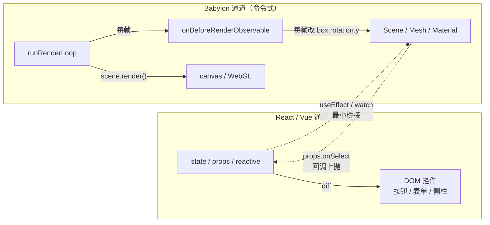

import { Meta } from '@storybook/addon-docs/blocks';

<Meta id="framework-integration-overview" title="应用扩展/框架集成" name="Docs" />

# 框架集成

Babylon.js 是**命令式（imperative）**引擎：你直接 `new Engine(canvas, true)`、`new Scene(engine)`、`box.rotation.y += dt`、`engine.runRenderLoop(() => scene.render())`，每一步都由你显式触发，时机完全可控。React/Vue 是**声明式（declarative）** UI 框架：你声明 UI 应该是什么样（`<div className="card">` 或 `<Card :open="true" />`），框架负责把声明 diff 后同步到真实 DOM。

两者相遇时会出现一个核心冲突：Babylon 的场景图（Scene → Mesh → Geometry/Material）和 Engine 持有的 WebGL 上下文**不是 DOM**，它有自己的对象树和独立的渲染通道（`runRenderLoop`）。把 Babylon 对象塞进 React/Vue 的声明式状态树，会让框架每次 reconciliation 都试图 diff 这些不该被 diff 的对象——React 触发多余 re-render，Vue 给 `Vector3` / `Matrix` 这类每帧被引擎自己读写的字段装上响应式 Proxy，性能直接崩坏。本课回答的不是一个写法问题，而是一个**边界问题**：什么状态由框架声明式管理更划算，什么必须留在 Babylon 的命令式循环里；以及要不要用 **react-babylonjs** 这类声明式封装把 Babylon 对象翻译成框架组件。

> NOTE 边界：React/Vue 集成不是 Babylon 入门主线（见 `ROADMAP.md`），本课只讲清边界与选型，不把任何一个框架的完整用法当作学习路径。

判断入口是三条独立的边界，分别决定不同问题：

- **对象边界。** `Engine`、`Scene`、`Mesh`、`Camera`、`Material` 是命令式对象，生命周期由 mount/unmount 钩子管理，**不进** React state / Vue `reactive`；UI 控件、路由参数、表单状态是声明式状态，由框架管。
- **更新边界。** 每帧性能敏感更新（动画、位置、旋转、uniform）走 Babylon 命令式 API（在 `scene.onBeforeRenderObservable` 里改 `mesh.rotation`），**不经过**框架 re-render；UI 状态变化（按钮点击、参数面板调参）走框架，再通过 ref/watch 桥接进 Babylon。
- **循环边界。** `engine.runRenderLoop` 是独立渲染通道，不属于框架的 reconciliation；在循环或 `onBeforeRenderObservable` 回调里触发 `setState` / 改 reactive 会让框架每帧 re-render，与 Babylon 的渲染脱钩且浪费性能。



| 输入或决策 | 默认值 / 常用起点 | 改变后要注意什么 |
| --- | --- | --- |
| Babylon 对象归属 | 存进 `useRef` / 闭包普通对象，不进 state / reactive | 放进 React state 触发多余 re-render；`reactive(mesh)` 给 `Vector3` / `Matrix` 装 Proxy，破坏 Babylon 每帧内部读写 |
| 容器 DOM | `useRef(null)` + `ref={canvasRef}` / Vue `ref` | mount 钩子里访问 `canvasRef.current`；组件未挂载时为 `null` |
| 创建时机 | `useEffect(..., [])` / `onMounted` | 只在挂载时创建一次；空依赖保证不重复构造 |
| 销毁顺序 | 停循环 → 断 observer → `scene.dispose()` → `engine.dispose()` | 漏 `engine.dispose()` 不释放 WebGL 上下文，反复进出路由撞上限；详见 [页面集成](?path=/docs/page-integration-and-deploy--docs) |
| 状态同步 | 单独的 `useEffect` / `watch` 把 props 写进 Babylon 对象 | 在主 effect 里读 props 会让 props 变化时整个场景重建 |
| 每帧更新 | `scene.onBeforeRenderObservable` + `engine.getDeltaTime()` | 不要在回调里 `setState` / 改 reactive，否则框架每帧 re-render |
| 初始模式 | 命令式嵌入（最常见、最可控） | UI 重且团队已熟悉 react-babylonjs 才考虑迁移 |
| 声明式库 | `react-babylonjs`（React 19，活跃维护）；Vue 无成熟活跃封装 | 见 [声明式封装：react-babylonjs](#声明式封装react-babylonjs) |

## 快速上手

最常见的起点是**命令式嵌入**：在 React 的 `useRef` + `useEffect`（或 Vue 的 `ref` + `onMounted`）里直接 `new Engine/Scene`，挂到容器 DOM 节点上，组件卸载时按 [页面集成](?path=/docs/page-integration-and-deploy--docs) 的卸载顺序释放。Babylon 对象**不进**声明式状态，状态变化通过 ref 直接调用 Babylon API。

React 最小骨架（把 [第一幅画面](?path=/docs/first-scene--docs) 的脚本搬进组件）：

```tsx
import { useEffect, useRef } from 'react';
import {
  ArcRotateCamera,
  Color4,
  Engine,
  HemisphericLight,
  Mesh,
  MeshBuilder,
  Scene,
  Vector3,
} from '@babylonjs/core';

export function Viewer({ rotationSpeed }: { rotationSpeed: number }) {
  const canvasRef = useRef<HTMLCanvasElement>(null);
  // 持有 Babylon 对象，绝不进 React state。
  const babylon = useRef<{ engine: Engine; scene: Scene; box: Mesh }>({} as never);

  useEffect(() => {
    const canvas = canvasRef.current!;
    const engine = new Engine(canvas, true, { alpha: true }, true);
    const scene = new Scene(engine);
    scene.clearColor = new Color4(0, 0, 0, 0);

    const camera = new ArcRotateCamera('cam', -Math.PI / 2, Math.PI / 2, 5, Vector3.Zero(), scene);
    camera.attachControl(canvas, true);
    new HemisphericLight('light', new Vector3(0, 1, 0), scene);
    const box = MeshBuilder.CreateBox('box', { size: 1 }, scene);

    babylon.current = { engine, scene, box };

    const ro = new ResizeObserver(() => engine.resize());
    ro.observe(canvas);
    engine.resize();

    engine.runRenderLoop(() => {
      // 性能敏感更新直接走命令式 API，不调 setState。
      const speed = (box.userData?.rotationSpeed ?? rotationSpeed) as number;
      box.rotation.y += speed * (engine.getDeltaTime() / 1000);
      scene.render();
    });

    return () => {
      // 卸载顺序：停循环 → 断 observer → scene.dispose → engine.dispose。
      engine.stopRenderLoop();
      ro.disconnect();
      scene.dispose();
      engine.dispose();
    };
  }, []); // 空依赖：Babylon 对象只在挂载时创建一次

  // 状态变化通过单独 effect 同步到 Babylon，不在主 effect 里重建对象。
  useEffect(() => {
    if (babylon.current.box) babylon.current.box.userData = { rotationSpeed };
  }, [rotationSpeed]);

  return (
    <canvas
      ref={canvasRef}
      style={{ width: '100%', aspectRatio: '16 / 9', display: 'block', touchAction: 'none' }}
    />
  );
}
```

Vue 等价骨架（Composition API，结构完全对应）：

```vue
<script setup lang="ts">
import { onMounted, onBeforeUnmount, ref, watch } from 'vue';
import {
  ArcRotateCamera, Color4, Engine, HemisphericLight, MeshBuilder, Scene, Vector3,
} from '@babylonjs/core';

const props = defineProps<{ rotationSpeed: number }>();
const canvasRef = ref<HTMLCanvasElement | null>(null);
// 普通 JS 对象，不用 reactive / ref 包裹 Babylon 对象。
let engine: Engine, scene: Scene, box = MeshBuilder.CreateBox('', {});

onMounted(() => {
  const canvas = canvasRef.value!;
  engine = new Engine(canvas, true, { alpha: true }, true);
  scene = new Scene(engine);
  scene.clearColor = new Color4(0, 0, 0, 0);
  const camera = new ArcRotateCamera('cam', -Math.PI / 2, Math.PI / 2, 5, Vector3.Zero(), scene);
  camera.attachControl(canvas, true);
  new HemisphericLight('light', new Vector3(0, 1, 0), scene);
  box = MeshBuilder.CreateBox('box', { size: 1 }, scene);

  const ro = new ResizeObserver(() => engine!.resize());
  ro.observe(canvas);
  engine.resize();

  engine.runRenderLoop(() => {
    box.rotation.y += (box.userData?.rotationSpeed ?? props.rotationSpeed) * (engine.getDeltaTime() / 1000);
    scene.render();
  });

  onBeforeUnmount(() => {
    engine!.stopRenderLoop();
    ro.disconnect();
    scene.dispose();
    engine!.dispose();
  });
});

// 状态变化通过 watch 同步到 Babylon 对象。
watch(() => props.rotationSpeed, (v) => { box.userData = { rotationSpeed: v }; });
</script>

<template>
  <canvas ref="canvasRef" style="width: 100%; aspect-ratio: 16 / 9; display: block; touch-action: none;" />
</template>
```

两份骨架的差异只在框架钩子名（`useEffect` / `onMounted`、cleanup / `onBeforeUnmount`、`useEffect` / `watch`）；Babylon 那一半——构造顺序、`runRenderLoop`、`onBeforeRenderObservable` 的 delta 制、dispose 顺序——完全一样。本工作区的 `createBabylonRuntime(canvas, setup)` helper 已经按这套顺序接好 resize、视口启停和 dispose，命令式嵌入时也可以在 mount 钩子里直接复用它，不必每次重写生命周期。

## 命令式与声明式

理解边界前，先看清两条心智模型的差异：

| 维度 | 命令式（Babylon 原生） | 声明式（React / Vue） |
| --- | --- | --- |
| 写法 | `new Scene(engine); mesh.position.x = 1; engine.runRenderLoop(...)` | `<Scene><box position-x={1} /></Scene>` / `<Scene><box :position-x="1" /></Scene>` |
| 谁决定时机 | 你——显式调用每一步 | 框架——根据状态 diff 决定何时创建 / 更新 / 销毁 |
| 状态来源 | 你的 JS 变量、循环、事件回调 | 框架的 state / reactive / props |
| 更新方式 | 直接赋值，立即生效 | 状态变化 → 框架 diff → 提交到目标对象 |
| 渲染通道 | `engine.runRenderLoop` 你显式触发 | 框架不参与 Babylon 渲染；Babylon 有自己的循环 |
| 对象树 | 场景图（Scene → Mesh → Geometry/Material） | React 元素树 / Vue 虚拟 DOM（与场景图平行） |

关键认识：**场景图不是 DOM 的子树**。React 的 reconciliation 在 diff 元素树时，会按"类型变化 → 销毁旧节点 → 创建新节点"或"props 变化 → 提交更新"操作目标对象。如果你把 `box` 直接塞进 React state：

```tsx
// 反例：Babylon 对象进 React state
const [box] = useState(() => MeshBuilder.CreateBox('box', {}));
const [color, setColor] = useState('#4488ff');
// 每次 setColor 都让组件 re-render；虽然 box 引用不变，但所有依赖 box 的子组件都会 re-render；
// box.material 也不会因为 state 变化自动更新——还得在 effect 里手动写 material.diffuseColor = ...。
```

React 不知道 `box.rotation.y` 是什么，它只比较 state 引用。让 `box` 引用进 state 唯一的效果是触发多余的 re-render，并不会自动同步 Babylon 属性。Vue 用 `reactive()` 包 Babylon 对象更糟——Vue 会给对象的每个属性装 Proxy，而 Babylon 内部大量字段（`Vector3`、`Matrix`、`Quaternion`、`Color3`）在每帧被引擎自己读写，`onBeforeRenderObservable`、矩阵分解、相机计算都会反复触发，全部被 Vue 的 watcher 拦截，轻则性能下降一个数量级，重则破坏 Babylon 的内部不变量。

正确做法是承认两条独立的更新通道：

- **框架通道** 管 UI、表单、路由参数、加载状态。这些状态变化频繁由用户交互触发，框架的 diff 能帮你高效同步到 DOM。
- **Babylon 通道** 管场景图、渲染循环、几何 / 材质 / 纹理。这些对象在每帧被 `runRenderLoop` 内部读写，必须留在命令式 API。

两条通道之间用**最小桥接**连接：框架状态变化时，在 `useEffect` / `watch` 里调用一次 `box.position.x = newValue`；Babylon 内部事件（如 `scene.pick` 选中）想反映到 UI，通过 `props.onSelect` 回调或 `useState` 写一次。

## 集成模式

把 Babylon 接入 React/Vue 有三种成熟模式，差别在"Babylon 对象由谁创建 / 更新 / 销毁"：

| 模式 | Babylon 对象归属 | 状态同步方式 | 适用场景 | 代价 |
| --- | --- | --- | --- | --- |
| 命令式嵌入 | 你自己 `new`，存在 ref / 闭包里 | `useEffect` / `watch` 把 props 写进 Babylon 对象 | 单一查看器、控件简单的页面、性能敏感场景 | UI 和 Babylon 各写一套，桥接代码自己维护 |
| 声明式封装（react-babylonjs） | reconciler 根据 JSX 自动创建 / 销毁 | 框架 props 直接映射到 Babylon 属性 | 重 UI、大量控件、团队已熟悉 React | 抽象层开销、imperative 密集部分仍需 bridge、掌控弱 |
| 混合 | Babylon 对象自己持有，UI 控件由框架渲染 | 框架事件 / ref / 自定义事件双向通信 | 查看器 + 复杂侧栏、配置面板、可编辑场景 | 双向通信容易写乱，需要明确数据流方向 |

三种模式没有"哪个更先进"，只有"哪个匹配你的工程约束"。下面三节分别展开。

### 命令式嵌入

命令式嵌入是默认起点：你自己写 `new Engine()`、`new Scene()`、`engine.runRenderLoop(cb)`，框架只负责提供 canvas DOM 和管理生命周期。Babylon 对象存进 `useRef` / 闭包普通对象，**绝不**进 React state / Vue reactive。最小骨架已在 [快速上手](#快速上手) 给出。这里聚焦四个工程要点。

**1. 状态进入 Babylon 不重建对象。** props / state 变化时，用单独的 effect / watch 把值写进 Babylon 对象的属性，而不是让主 effect 依赖 props（否则 props 变化会让整个场景重建）：

```tsx
// React：状态同步单独 effect
useEffect(() => {
  const { box } = babylon.current;
  if (box) box.material && (box.material as StandardMaterial).diffuseColor = Color3.FromHexString(props.color);
}, [props.color]);
```

```ts
// Vue：watch 同步
watch(() => props.color, (c) => {
  const mat = box.material as StandardMaterial;
  if (mat) mat.diffuseColor = Color3.FromHexString(c);
});
```

**2. 暴露 Babylon 对象给父组件用 ref + `useImperativeHandle` / `defineExpose`。** 子组件把受控 API 暴露给父，避免父直接读内部 Babylon 对象：

```tsx
// React：useImperativeHandle 把受控 API 暴露给父
const Viewer = forwardRef<ViewerHandle, Props>((props, ref) => {
  const babylon = useRef<{ engine: Engine; scene: Scene; camera: ArcRotateCamera }>({} as never);
  useImperativeHandle(ref, () => ({
    focusOn: (target: Vector3) => (babylon.current.camera.setTarget(target)),
    exportPNG: () => babylon.current.engine.getRenderingCanvas()!.toDataURL('image/png'),
  }));
  // ...
});
```

```ts
// Vue：defineExpose
defineExpose({
  focusOn: (target: Vector3) => camera?.setTarget(target),
  exportPNG: () => engine?.getRenderingCanvas()?.toDataURL('image/png'),
});
```

**3. 渲染循环归属清晰。** Babylon 的 `engine.runRenderLoop` 在 mount 钩子里启动；每帧业务更新放进 `scene.onBeforeRenderObservable`，读 `engine.getDeltaTime()` 做 delta 制（见 [渲染循环与时间](?path=/docs/render-loop-and-timing--docs)），**不调** `setState` / 不改 reactive。

**4. dispose 顺序贴着 [页面集成](?path=/docs/page-integration-and-deploy--docs) 的卸载链路。** `engine.stopRenderLoop()` → 断 `ResizeObserver` → `scene.dispose()` → `engine.dispose()`。停循环必须最先——`scene.dispose()` 只释放场景资源，不会停 `runRenderLoop`；先 dispose scene 再停循环，下一帧回调会调用已释放场景的 `render()` 报错。

### 声明式封装：react-babylonjs

声明式封装用专门的 reconciler 把 Babylon 对象变成 React 组件。React 生态是社区维护的 [react-babylonjs](https://brianzinn.github.io/react-babylonjs/)（作者 brianzinn，npm 包名 `react-babylonjs`，v4 要求 React 19；无第三方依赖，仅靠 `react-reconciler` 把 JSX 翻译成 Babylon API）。它的核心是把 JSX 里的 `<Engine>`、`<Scene>`、`<arcRotateCamera>`、`<box>`、`<hemisphericLight>` 翻译成对应的 Babylon 调用（`new Engine()` → `engine.runRenderLoop`，`new Scene(engine)`，props 变化 → `box.position.x = value`）。

react-babylonjs 范例（与命令式嵌入画同一幅画面，对比写法）：

```tsx
import { Engine, Scene } from 'react-babylonjs';

function Box({ rotationSpeed }: { rotationSpeed: number }) {
  // 声明式：Engine/Scene/Mesh/Light 由 reconciler 自动创建/销毁。
  // 向量、颜色都能用数组或字符串简写，reconciler 翻译成 Vector3 / Color3。
  return (
    <Engine canvasId="renderCanvas" antialias engineOptions={{ alpha: true }}>
      <Scene clearColor={[0, 0, 0, 0]}>
        <arcRotateCamera
          name="cam"
          alpha={-Math.PI / 2}
          beta={Math.PI / 2}
          radius={5}
          target={[0, 0, 0]}
        />
        <hemisphericLight name="light" direction={[0, 1, 0]} />
        <box name="box" size={1}>
          <standardMaterial name="mat" diffuseColor="#4488ff" />
        </box>
      </Scene>
    </Engine>
  );
}
```

**心智模型变化。** 你不再写 `new Scene(engine)`，而是声明场景"应该是什么样"，reconciler 负责把它翻译成 Babylon API。props 变化时 reconciler 自动 diff 并提交更新——这和 React diff DOM 是同一套机制，只是目标是 Babylon 对象。`<Engine>` 内部自动启动 `runRenderLoop`、处理 resize、调用 `scene.render()`；每帧动画通过 `useBeforeRender` 钩子（包 `scene.onBeforeRenderObservable`）注册回调，独立于 React 的 reconciliation。

**生态与 escape hatch。** react-babylonjs 提供 `useScene` / `useEngine` / `useCanvas` 等钩子拿到底层对象，用于在声明式外壳里插入 imperative 片段（自定义 loader、复杂 ShaderMaterial、Havok 物理初始化）。它对 Babylon API 的覆盖靠代码生成，常见类自动可声明，少量特殊类型需要从 `hostInstance` 或钩子手动桥接。

**取舍。** 声明式封装不是纯收益：

| 收益 | 代价 |
| --- | --- |
| 声明式 UI、HMR、组件复用、TypeScript 自动补全 | reconciler 每次 props 变化都 diff Babylon 对象，高频更新有开销 |
| `<Engine>` 自动管 `runRenderLoop` / resize / dispose | 自动 dispose 在共享资源、手动 `dispose()` 并存时可能不彻底，需要 escape hatch |
| 与 React 路由 / 状态管理 / UI 库同栈 | 部分 imperative 库（自定义 loader、Node Material、Havok 插件、GPU 粒子）需要 `useScene` / `useEffect` 桥接 |
| 团队熟悉 React，上手快 | 对 Babylon 生命周期的掌控变弱，调试时要同时理解 React 树和场景图 |
| 状态 / UI / 路由用同一套框架 | 包体积增加（react、react-dom、react-babylonjs 累计可达 MB 级） |

什么时候 react-babylonjs 的代价值得付出：UI 控件多到命令式嵌入的桥接代码难以维护、团队已熟悉 React、需要大量复用 React 生态（路由、状态管理、UI 库）、性能要求不是极限（普通查看器、配置器、数据可视化都够用）。什么时候不值：单一查看器、性能敏感（百万顶点、复杂 shader、GPU 粒子）、需要精确控制 dispose、对 bundle 体积严格。

> react-babylonjs 是**社区库**，不在 `@babylonjs/*` 官方包里。官方的 React 相关产物是 `@babylonjs/react-native`（React Native 跨平台 3D），与 Web 上的 react-babylonjs 是不同项目，不要混淆。

### Vue 与其他框架

Vue 生态没有与 react-babylonjs 对应的活跃声明式封装：早期的 [vue-babylonjs](https://github.com/Beg-in/vue-babylonjs) 已停留在 2019 年的 beta，仓库于 2023 年归档（archived），不再维护。Vue 3 项目里集成 Babylon 几乎都走**命令式嵌入 + Composition API**——官方文档的 [BabylonJS and Vue](https://doc.babylonjs.com/communityExtensions/Babylon.js+ExternalLibraries/BabylonJS_and_Vue/) 系列也是这条路线：在 `onMounted` 里 `new Engine/Scene`，用 `ref` 持有 canvas、用普通 JS 对象持有 Babylon 对象、用 `watch` 同步 props、在 `onBeforeUnmount` 里按顺序 dispose。骨架已在 [快速上手](#快速上手) 给出。

Angular、Svelte、Solid 等框架情况类似——没有成熟的 Babylon 声明式封装，统一用"mount 钩子里命令式构造 + 状态桥接 + unmount 钩子里 dispose"的同一套模式。识别模式比记框架 API 重要：把 React 的 `useRef` / `useEffect` / cleanup 换成 Vue 的 `ref` / `onMounted` / `onBeforeUnmount`，或 Angular 的 `ViewChild` / `ngOnInit` / `ngOnDestroy`，Babylon 那一半不动。

**混合模式**作为命令式嵌入的延伸：UI 侧栏（按钮、表单、参数面板）由 React/Vue 渲染，Babylon 场景由 mount 钩子创建；两条通道通过 ref + 事件桥接——UI 改参数 → 调暴露的方法；Babylon 选中对象 → 通过 props 回调上抛 id。关键是**单向数据流**：UI 状态作为 props 流向 Babylon，Babylon 内部事件作为回调流向 UI。不要让两条通道互相直接修改对方的状态。

## 渲染循环归属

无论哪种模式，Babylon 的渲染循环都是独立通道，**不属于框架的 reconciliation**。理解这一点能避免一类高频性能问题：在循环里触发框架 re-render。

| 模式 | 循环由谁启动 | 循环里写什么 | 不能写什么 |
| --- | --- | --- | --- |
| 命令式嵌入 | 你在 mount 钩子里 `engine.runRenderLoop(cb)` | `box.rotation.y += dt`、`scene.render()` | `setState` / 改 reactive（每帧 re-render） |
| react-babylonjs | `<Engine>` 自动启动 `runRenderLoop` | 通过 `useBeforeRender` 钩子改 Babylon 属性 | 在回调里调 `setState`（除非用 `useRef` 桥接） |

反例——在循环里调 `setState` 会让 React 每帧 re-render：

```tsx
// 反例：循环里触发框架 re-render
engine.runRenderLoop(() => {
  setRotation(prev => prev + 0.016);     // 每帧触发 React re-render，60fps 下每秒 60 次
  box.rotation.y = rotation;              // 还得手动同步，state 没帮上忙
  scene.render();
});
```

正确做法是把动画状态留在 Babylon 对象上（如 `box.rotation.y` 或 `box.userData`），循环里只读写 Babylon 属性；只有需要让 UI 反映某个低频状态（如 FPS、当前选中对象）时，才用节流后的 `setState`（如每 500ms 一次）。详细的 delta / elapsed 时间语义见 [渲染循环与时间](?path=/docs/render-loop-and-timing--docs)。

react-babylonjs 的 `useBeforeRender` 已经把这件事封装好——回调在 Babylon 渲染通道里执行，不会触发 React reconciliation；但你在回调里自己调 `setState` 就绕过了这个保护。命令式嵌入没有这种约束，全靠你自觉。

## 选型判断

选哪种模式不是技术先进性问题，是工程约束匹配问题。下面决策表覆盖常见维度：

| 维度 | 命令式嵌入 | 声明式封装（react-babylonjs） | 混合 |
| --- | --- | --- | --- |
| UI 复杂度 | 单一查看器、少量控件 | 重 UI、多面板、表单、可编辑场景 | 查看器 + 复杂侧栏 |
| 团队熟悉度 | 不熟 React/Vue 也能写 | 必须熟 React | 熟悉对应框架 |
| 性能要求 | 极限（百万顶点、复杂 shader、GPU 粒子） | 中等（普通查看器、配置器） | 中等到高 |
| dispose 控制 | 必须精确控制 | 自动 dispose 够用，特殊场景需 bridge | 手动控制 Babylon 部分 |
| bundle 体积 | 严格（移动端、首屏敏感） | 宽松（桌面应用、内部工具） | 中等 |
| 复用 React 生态 | 不需要 | 路由、状态管理、UI 库都复用 | 部分复用 |
| imperative 库依赖 | 多（自定义 loader、Node Material、Havok、GPU 粒子） | 少（用生态覆盖） | 中等 |

推荐路径：

- **新项目，团队不熟 React/Vue，或性能 / dispose / 体积敏感** → 命令式嵌入。先跑通最小查看器，UI 用原生 DOM 或轻量库。Vue 项目目前也只能走这条。
- **新项目，团队熟 React，UI 重，性能中等** → react-babylonjs。直接用声明式封装，享受 React 生态。
- **已有 React/Vue 项目里加 Babylon** → 命令式嵌入起步（最小侵入），UI 复杂到桥接代码失控再考虑迁移到 react-babylonjs。
- **已有 Babylon 项目想加 React/Vue UI** → 混合模式。Babylon 代码保留，UI 用框架渲染，通过 ref / 事件桥接。

不要因为"声明式封装是现代写法"就盲目迁移。迁移成本包括：重写所有场景构造代码、重新学习 reconciler 行为、调试两套对象树、可能引入新的性能问题。命令式嵌入在大量生产项目里就是最优解；NOTE 也明确不把 React/Vue 集成作为入门主线——先把 Babylon 本身的命令式 API 用熟，再判断是否真的需要声明式封装。

## 最佳实践

- Babylon 对象（Engine、Scene、Mesh、Camera、Material、Texture）绝不进 React state / Vue reactive；用 `useRef` / 闭包普通对象持有，命令式赋值。`Vector3` / `Matrix` 这类每帧被引擎读写的字段被 Vue Proxy 拦截会破坏内部不变量。
- 组件挂载时创建 Babylon 对象，卸载时按 [页面集成](?path=/docs/page-integration-and-deploy--docs) 的顺序 dispose：`engine.stopRenderLoop()` → 断 `ResizeObserver` → `scene.dispose()` → `engine.dispose()`，停循环必须最先。
- 状态进入 Babylon 用独立的 `useEffect` / `watch`，不要让主 mount effect 依赖 props——否则 props 变化会重建整个场景。
- 渲染循环是独立通道，`runRenderLoop` 和 `onBeforeRenderObservable` 回调里只读写 Babylon 对象属性，不调 `setState` / 不改 reactive；UI 反映低频状态时用节流后的 setState。
- 子组件用 `useImperativeHandle` / `defineExpose` 暴露受控 API（如 `focusOn`、`exportPNG`），不要让父组件直接读内部 Babylon 对象。
- 混合模式保持单向数据流：UI 状态作为 props 流向 Babylon，Babylon 事件作为回调流向 UI；不要让两条通道互相直接改对方状态。
- 新项目性能 / 体积 / dispose 敏感或不熟 React/Vue（包括所有 Vue 项目），命令式嵌入起步；UI 重且团队熟 React，才考虑 react-babylonjs；不要因为"现代写法"盲目迁移。
- 用 react-babylonjs 时，imperative 库（自定义 loader、Node Material、Havok 插件、GPU 粒子）通过 `useScene` / `useEffect` 桥接，不要假装它们不存在；React Native 跨平台用官方 `@babylonjs/react-native`，不是 Web 版的 react-babylonjs。

## 常见问题

- 为什么把 `box` 放进 React state 后页面越来越卡？
  React state 触发 re-render 时，依赖 box 的所有子组件都 re-render；box 引用不变只是避免了重建，但 React 还是做了 diff。把 box 存进 `useRef`，命令式赋值。
- 为什么 Vue 的 `reactive(box)` 让 Babylon 行为异常或性能崩溃？
  Vue 给 box 每个属性装 Proxy，Babylon 内部每帧读写 `Vector3`、`Matrix`、`Quaternion` 都被 watcher 拦截，破坏内部不变量。Babylon 对象用普通 JS 对象持有，不要用 `reactive` / `ref` 包裹。
- 为什么 props 变化后 Babylon 场景重建了？
  mount effect 的依赖数组里写了 props，props 变化时整个 effect 重新执行，重建 engine / scene / mesh。把状态同步拆到单独的 `useEffect` / `watch`，主 effect 用空依赖。
- react-babylonjs 的 `<Engine>` 和我自己写的 `useEffect` 有什么区别？
  `<Engine>` 内部自动启动 `runRenderLoop`、创建 engine / scene、处理 resize、提供 `useBeforeRender` / `useScene` 钩子；你自己写的 effect 要手动做这些。代价是 react-babylonjs 的抽象层开销和 bundle 体积。
- 怎么在 react-babylonjs 里用 imperative Babylon 库（如 Havok 物理、自定义 SceneLoader、Node Material）？
  用 `useScene` / `useEngine` 拿到底层对象，在 `useEffect` 里创建 imperative 对象，在 `useBeforeRender` 或 `onBeforeRenderObservable` 里手动 update；卸载时在 cleanup 里 dispose。
- 命令式嵌入下，React state 变化怎么同步到 Babylon 对象？
  用单独的 `useEffect(() => { box.position.x = value }, [value])`，把 state 写进 Babylon 对象属性；不要把 state 放进主 mount effect 的依赖数组。
- react-babylonjs 项目里 dispose 不彻底，内存还在涨？
  react-babylonjs 的自动 dispose 在共享资源（同一份 geometry / material 被多处用）和手动 `dispose()` 调用并存时可能冲突；通过 `useScene` 拿到 scene 后用 `hostInstance` 或自定义 ref 标记不归 reconciler 管理的对象，手动控制其生命周期。
- 命令式嵌入里怎么把 `scene.pick` 选中的对象 id 反映到 UI？
  选中后通过 props 回调上抛（如 `props.onSelect(pickInfo.pickedMesh.id)`），UI 用 `useState` 接收；不要每帧上抛，只在选中事件触发时调一次。
- 为什么 `runRenderLoop` 的回调里调了 `setState` 后帧率掉一半？
  回调在 Babylon 渲染通道执行，调 `setState` 会让 React re-render，每帧都跑 reconciliation。把动画状态留在 `useRef` 或 Babylon 对象的 `userData` 上，UI 需要的值用节流后的 setState（如 500ms 一次）。
- Vue 项目该用 vue-babylonjs 吗？
  vue-babylonjs 已停在 2019 年 beta、仓库 2023 年归档，不建议新项目采用。Vue 3 集成 Babylon 统一走命令式嵌入 + Composition API（`ref` + `onMounted` + `watch` + `onBeforeUnmount`），骨架见 [快速上手](#快速上手)。

## 总结回顾

摘要：

Babylon.js 是命令式引擎（`new Scene`、`box.position.x =`、`runRenderLoop`），React/Vue 是声明式 UI 框架（声明状态、框架 diff 后同步到 DOM）。两者集成时有三种模式：命令式嵌入（在 ref / mount 钩子里自己 new Babylon 对象，状态通过 effect / watch 桥接，最常见最可控起点）、声明式封装（react-babylonjs 把 Babylon 对象变成 JSX 组件，reconciler 自动创建 / 更新 / 销毁，DX 好但有抽象层开销和掌控弱化的代价）、混合（UI 由框架渲染、场景由 Babylon 管，通过 ref / 事件双向通信）。无论哪种模式，Babylon 对象绝不进 React state / Vue reactive——前者触发多余 re-render，后者给 `Vector3` / `Matrix` 装 Proxy 破坏 Babylon 每帧内部读写。渲染循环是独立通道，`runRenderLoop` 和 `onBeforeRenderObservable` 回调里只读写 Babylon 属性，不调 setState / 不改 reactive。Vue 生态的 vue-babylonjs 已归档停更，Vue 3 项目统一走命令式嵌入；React Native 跨平台用官方 `@babylonjs/react-native`。选型不是先进性问题：性能 / dispose / 体积敏感或团队不熟 React/Vue 用命令式嵌入，UI 重且团队熟 React 用 react-babylonjs，已有项目加 Babylon 用混合；不要因为"现代写法"盲目迁移。

一句话：

> Babylon 对象不进声明式状态，渲染循环不进 reconciliation；选模式看工程约束，不看先进性。

知识要点：

- Babylon 的命令式模型和 React/Vue 的声明式模型在对象树、更新时机、渲染通道上分别有什么本质差异？
- 为什么把 `box` 放进 React state 不会让 `box.position.x` 自动更新？为什么 Vue 的 `reactive(box)` 会破坏 Babylon？
- 命令式嵌入、声明式封装、混合三种模式分别把"Babylon 对象由谁创建 / 更新 / 销毁"交给谁？
- 命令式嵌入下，props / state 变化怎样同步到 Babylon 对象，又怎样避免主 effect 依赖 props 导致场景重建？
- react-babylonjs 的 reconciler 在 props 变化时做什么？`useBeforeRender` 钩子和 React reconciliation 是同一条通道吗？
- 为什么在渲染循环里调 `setState` 会让帧率掉一半？正确做法是什么？
- Vue 生态的声明式封装现状如何？为什么 Vue 项目统一走命令式嵌入？
- 选型时哪些工程约束决定用命令式嵌入还是声明式封装？为什么不能盲目迁移到 react-babylonjs？

## 参考资料

- [Babylon.js Documentation：Babylon.js and React（官方命令式嵌入教程）](https://doc.babylonjs.com/communityExtensions/Babylon.js+ExternalLibraries/BabylonJS_and_ReactJS)
- [Babylon.js Documentation：Babylon.js and Vue（官方多部分 Vue 集成教程）](https://doc.babylonjs.com/communityExtensions/Babylon.js+ExternalLibraries/BabylonJS_and_Vue/BabylonJS_and_Vue_0/)
- [Babylon.js Documentation：External Libraries（与第三方框架共存总览）](https://doc.babylonjs.com/communityExtensions/Babylon.js+ExternalLibraries)
- [react-babylonjs 官方文档与示例（brianzinn）](https://brianzinn.github.io/react-babylonjs/)
- [react-babylonjs GitHub 仓库](https://github.com/brianzinn/react-babylonjs)
- [Babylon React Native（官方跨平台 3D）](https://www.babylonjs.com/reactnative/)
- [Babylon.js Forum：React 板块（社区经验与版本适配）](https://forum.babylonjs.org/)
- 本手册 [第一幅画面](?path=/docs/first-scene--docs)、[渲染循环与时间](?path=/docs/render-loop-and-timing--docs)、[页面集成](?path=/docs/page-integration-and-deploy--docs)
