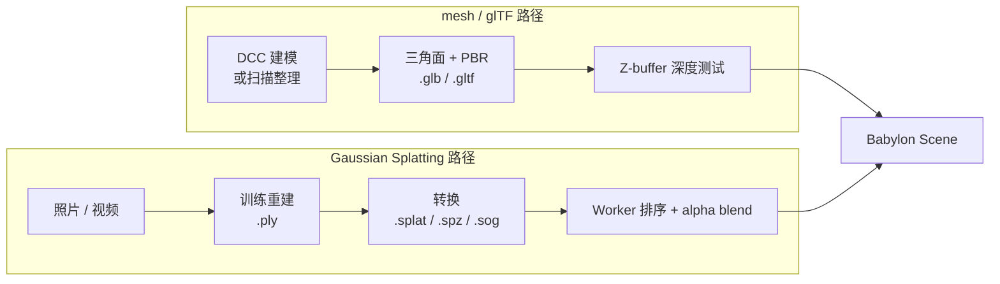

import { Meta } from '@storybook/addon-docs/blocks';

<Meta id="gaussian-splatting" title="渲染进阶/高斯泼溅" name="Docs" />

# 高斯泼溅

Gaussian Splatting 是另一种场景表示法：整个场景不是用三角面拼出来的，而是由上百万个**带高斯属性的"泼溅点"（splat）**叠加而成。一个 splat 携带位置、协方差（决定形状和朝向）、不透明度，以及视角相关颜色（球谐系数）。半透明的 splat 按深度排序后做 alpha 混合，画面看起来就是照片级真实场景。它从 NeRF 一族的辐射场方法衍生而来，但 splat 是显式存储的几何体——可以实时渲染、剔除和整体变换。

Babylon.js 在 `@babylonjs/core` 中提供 `GaussianSplattingMesh`，配合 `@babylonjs/loaders` 的 `SPLATFileLoader` 加载 `.splat` / `.ply` / `.spz` / `.sog`（以及 SOG 流式的 `.json` 元数据）。理解了"文件 → SPLAT 插件 → GaussianSplattingMesh"这条链，以及它与 mesh / glTF 路径在表示、渲染和能力上的根本差异，本课的加载、排序、查看器与选型判断就都有落点了。



| 对象或参数 | 默认 / 常用起点 | 改变后要注意什么 |
| --- | --- | --- |
| `GaussianSplattingMesh(name, url, scene)` | 直接传 URL，内部触发异步加载 | `url` 也可传 `null` 后用 `updateData(buffer)` 程序化填入；构造第 4 参 `keepInRam=false` 控制是否在显存上传后保留原始 splat 数据 |
| `SceneLoader.ImportMeshAsync(url, scene)` | Babylon 8 推荐的短签名，第一参直接是 URL | 加载结果 `result.meshes[0]` 即 `GaussianSplattingMesh`；老签名 `(meshNames, rootUrl, sceneFilename, scene)` 仍可用 |
| SPLAT 插件 | `@babylonjs/loaders` 副作用注册 | core 默认不含；缺失时报 `no loader available`，类似 glTF 的注册模式 |
| 支持的扩展名 | `.splat` / `.ply` / `.spz` / `.sog` / `.json`（SOG 元数据） | `.ksplat` 是 three.js 社区库私有格式，`.glb` 内嵌 splat 不是 Babylon 的加载路径——Babylon 直接吃上述原始格式 |
| 排序 | Web Worker 异步深度排序，默认 O(n) 计数排序 | `GaussianSplattingMeshBase.UseCountingSort=false` 回退比较排序；`mesh.disableDepthSort=true` 彻底关排序（仅静态视角） |
| 重排触发阈值 | `viewUpdateThreshold = 0.0001`（相机方向余弦阈值） | 调大减少重排频率、省 CPU，但相机转动时排序滞后、可能出现"飞斑" |
| 阴影 | 默认不投影 | 必须先 `shadowGenerator.setTransparencyShadow(true)`，否则因 alpha blend 投不出正确的阴影 |
| 拾取 | 标准 `scene.pick` 退化为包围盒命中 | 精确拾取单个 splat 或部件用 `GPUPicker`，不能用普通 ray-mesh 拾取 |
| 材质 | 自动创建内部 `GaussianSplattingMaterial` | 不要替换为 `StandardMaterial` / `PBRMaterial`；自定义着色走 `GaussianSplattingMaterial` 的材质插件钩子 |
| 引擎 | WebGL2 与 WebGPU 都支持 | 流式 LOD（`GaussianSplattingStream`）在两种引擎上都可用 |

> **本课形态说明：** 加载真实 `.splat` 文件需要数十 MB 的资产且体积远超本 Storybook 工作区的离线约束，因此本课是 **docs-only**：用代码片段讲清 `GaussianSplattingMesh` 的构造、加载、排序、能力边界与查看器交互要点，不创建 Storybook Canvas 实例。

## 表示模型：splat 与 mesh 的差异

理解高斯泼溅的关键不是"另一种 mesh"，而是**另一种场景表示**。下表按基本图元、表面、来源和能做什么逐项对照：

| 维度 | mesh / glTF | Gaussian Splatting |
| --- | --- | --- |
| 基本图元 | 三角面 | 三维高斯（位置 + 协方差 + alpha + 球谐颜色） |
| 表面 | 显式、离散的三角形 | 隐式，由半透明斑叠加出"看上去连续"的表面 |
| 来源 | DCC 工具建模，或扫描重建后整理 | 照片 / 视频经训练直接重建 |
| 几何精度 | 顶点位置精确可控 | splat 是统计数据，没有可编辑顶点 |
| 编辑性 | 高：可移动、变形、布尔、蒙皮 | 低：基本只能整体变换或按部件分组 |
| 动画 | 完整支持（骨骼、形变、关键帧） | 几乎没有；splat 本身不参与变形动画 |
| 材质 | PBR（金属度、粗糙度、贴图） | 视角相关颜色藏在球谐系数里，专用 `GaussianSplattingMaterial` |
| 拾取 | `scene.pick` 命中三角面 | 标准拾取退化为包围盒；精确拾取走 `GPUPicker` |
| 阴影 | `ShadowGenerator` 标准流程 | 必须 `setTransparencyShadow(true)` 才能正确投影 |
| 文件 | `.glb` / `.gltf`，标准、可压缩 | `.splat` / `.ply` / `.spz` / `.sog`，尚未标准化 |
| 渲染方式 | Z-buffer 深度测试 | Worker 排序后 alpha blend |
| 适用场景 | 可编辑、可控、程序化、动画的角色与物体 | 从照片重建的真实场景、数字孪生、室内漫游、文化遗产 |

判断"该不该用 splat"先回答三个问题：**场景是否来自真实拍摄或扫描？是否几乎不需要编辑几何和动画？是否追求照片级真实感？** 三个都"是"时 splat 才明显优于 mesh；只要有一个"否"，传统 mesh + PBR 通常更稳，相关加载流程见 [加载模型](?path=/docs/sceneloader-and-gltf--docs)、材质与光照见 [PBR 与环境](?path=/docs/pbr-and-environment--docs)。

> NOTE 边界：本课聚焦"是什么、怎么加载、和 mesh 有何不同、何时用"，不深入高斯重建算法、训练过程、球谐数学或 NeRF 原理。

## 文件格式

splat 还没有像 glTF 那样的统一标准。Babylon 的 `SPLATFileLoader`（位于 `@babylonjs/loaders`）按扩展名注册了一组实时格式，训练得到的 `.ply` 通常先转换成这些格式再上线：

| 扩展名 | 来源与内容 | 体积 | 用途 |
| --- | --- | --- | --- |
| `.ply` | INRIA 3DGS 训练脚本直接输出；Babylon 8 起也支持压缩 PLY | 最大（原始 float，几十 MB 到几 GB） | 训练产物、再加工；上线前通常转换 |
| `.splat` | 提取后的简化格式，每 splat 约 32 字节 | 中等 | 实时查看的常用格式 |
| `.spz` | Niantic Labs 提出的压缩格式 | 较小 | 体积敏感场景；导入支持 `flipY` 处理垂直翻转 |
| `.sog` / `.json` | SOG（Self-Organizing Gaussian）分块流式格式；`.json` 是 LOD 元数据 | 较小、可流式 | 大场景流式加载（实验性 `GaussianSplattingStream`） |

格式选型先看资产来源和体积：本地调试和再加工保留 `.ply`，上线用 `.splat` / `.spz`，超大场景用 `.sog` 流式分块。`.ksplat` 是 three.js 社区库 GaussianSplats3D 的私有压缩格式，Babylon 不直接支持；`.glb` 内嵌 splat 也不是 Babylon 的加载路径——Babylon 直接吃上述原始 splat 格式。需要批量转换或生成 SOG 流式包时，社区工具 [SplatTransform](https://github.com/playcanvas/splat-transform) 是 PlayCanvas 维护的命令行选项。

```bash
# 全局安装 PlayCanvas 的转换工具，把 .ply 转成流式 SOG bundle（生成 lod-meta.json）。
npm install -g @playcanvas/splat-transform
splat-transform input.ply output/lod-meta.json
```

## 加载与构造

`GaussianSplattingMesh` 的加载有两条等价路径：直接构造时把 URL 传给构造函数，或走 `SceneLoader` 让插件按扩展名分发。两条路径最终都由 `SPLATFileLoader` 解析 splat 数据并填充一个 `GaussianSplattingMesh`。

### SPLAT 插件的副作用注册

和 glTF 一样，`SPLATFileLoader` 不在 `@babylonjs/core`，需要 `@babylonjs/loaders` 的副作用导入在第一次加载前注册：

```ts
import { SceneLoader, GaussianSplattingMesh } from '@babylonjs/core';
import '@babylonjs/loaders'; // 副作用注册 SPLATFileLoader（同时注册 glTF、OBJ、STL 等）

// 路径一：SceneLoader 短签名（Babylon 8 推荐），第一参直接是完整 URL。
const result = await SceneLoader.ImportMeshAsync(
  'https://assets.babylonjs.com/splats/gs_Skull.splat',
  scene,
);
const gs = result.meshes[0] as GaussianSplattingMesh;
```

如果只想注册 SPLAT 而不引入其他 loader，用更细粒度的子路径（具体路径以当前 `@babylonjs/loaders` 版本的导出为准）。注册缺失时按 `.splat` 扩展名找不到插件，会抛 `no loader available`。

### 直接构造与 `updateData`

`GaussianSplattingMesh` 构造函数也接受 URL，或先用空 URL 构造、再用 `updateData` 程序化填入：

```ts
// 路径二：构造时传 URL，内部同样异步加载并由 SPLAT 插件解析。
const gs = new GaussianSplattingMesh('skull', 'https://assets.babylonjs.com/splats/gs_Skull.splat', scene);

// 路径三：先构造空壳，再用已有 ArrayBuffer 填充（来自 fetch、上传或自定义生成）。
const gs2 = new GaussianSplattingMesh('custom', null, scene);
const buffer = await (await fetch('/scenes/mine.splat')).arrayBuffer();
gs2.updateData(buffer);
```

构造函数签名：`new GaussianSplattingMesh(name, url = null, scene = null, keepInRam = false, needsRotationScaleTextures = false)`。第 4 参 `keepInRam` 控制是否在上传 GPU 后仍保留原始 splat 数据——后续要调 `splatsData` / `updateData` 修改或下载 splat 时设为 `true`。

### 加载选项 `pluginOptions.splat`

`SceneLoader.ImportMeshAsync` 的第三参（Babylon 8 短签名）是可选的加载选项对象，其中 `pluginOptions.splat` 透传给 `SPLATFileLoader`。最常用的是 `.spz` 的 `flipY`：

```ts
// .spz 文件可能整体上下翻转，导入时按需启用 flipY。
const pit = await SceneLoader.ImportMeshAsync(
  'https://assets.babylonjs.com/splats/hornedlizard.spz',
  scene,
  { pluginOptions: { splat: { flipY: true } } },
);
```

`flipY` 同样适用于 `updateData(buffer, undefined, { flipY: false })`。其他格式（`.splat` / `.ply` / `.sog`）目前不使用该选项。

### 加载后的修正：方向、单位与构图

Gaussian Splatting 文件**没有标准化的手性或朝向约定**——不同训练工具产出的 splat 可能在 Babylon 里上下颠倒或镜像。加载后通常要做两步修正：

```ts
const gs = result.meshes[0] as GaussianSplattingMesh;

// 1) 方向修正：按需绕轴旋转，或整体缩放成负值翻转。
gs.rotation.x = Math.PI; // 常见修正：上下翻转
gs.scaling.setAll(1.0);

// 2) 构图：用包围盒把相机 target 落到中心、radius 刚好包住。
const { min, max } = gs.getHierarchyBoundingVectors(true);
const center = min.add(max).scale(0.5);
const size = max.subtract(min);
camera.setTarget(center);
camera.radius = Math.max(size.x, size.y, size.z) * 1.6 + 2;
```

直接套 mesh 项目的相机参数常会让相机陷在 splat 内部或飞出远近裁面——加载后必须按 splat 的世界包围盒重设相机。

## 排序、剔除与渲染

splat 半透明，渲染时不能用 Z-buffer 直接剔除——后面的 splat 要和前面已画上去的混色，必须按"从远到近"（back-to-front）顺序 alpha blend。这是高斯泼溅渲染的核心难点，也是性能关键。

### Web Worker 异步排序

Babylon 把每帧的深度排序放在 Web Worker 里异步执行，避免阻塞主线程的渲染循环。相机移动时，主线程把 splat 中心和相机信息 `postMessage` 给 Worker，Worker 算好排序后的索引再回传，主线程绑定到下一次渲染的索引缓冲。这意味着：

- 第一帧或刚加载完时，可能短暂出现"排序未就绪"——`mesh.isReady()` 在 Worker 完成至少一次排序后才返回 `true`。
- 相机静止时不需要重排；相机方向变化超过阈值才触发新一次排序。

控制排序行为的几个开关：

| 开关 | 默认 | 用途 |
| --- | --- | --- |
| `GaussianSplattingMeshBase.UseCountingSort` | `true` | 静态属性。`true` 用 O(n) 计数（radix）排序；`false` 回退比较排序，用于 A/B 对比或兜底 |
| `GaussianSplattingMeshBase.LogSortPerformance` | `false` | 静态属性。开启后在控制台打印每次排序耗时和 splat 数量，仅用于性能调查 |
| `mesh.viewUpdateThreshold` | `0.0001` | 实例属性。相机方向余弦变化超过该值才重排；调大省 CPU 但转向时排序滞后 |
| `mesh.disableDepthSort` | `false` | 实例属性。`true` 关闭排序、终止 Worker；仅适合完全静态的视角 |

百万级 splat 每帧都要重排，相机一动就改变全部顺序。计数排序是 3DGS 工程化能做到实时的关键，把排序复杂度压到 O(n)。性能不够时优先调大 `viewUpdateThreshold` 或减少 splat 数量，不要靠缩小 canvas 掩盖排序开销。

### 剔除与 alpha blend 的副作用

排序之外还要注意 alpha blend 的两个副作用：

- **视锥剔除**：视锥外或背后的 splat 必须先剔除，否则会把无意义的 splat 算进排序，白白浪费 Worker 时间。`GaussianSplattingMesh` 内部按世界包围盒做视锥剔除；流式 LOD（`GaussianSplattingStream`）还按距离分块剔除。
- **半透明写深度**：splat 渲染时不能写深度缓冲，否则半透明像素会覆盖深度、把后面的 splat 或 mesh 错误剔除。Babylon 的内部 `GaussianSplattingMaterial` 已经处理了 `depthWrite`，不要在自定义材质插件里重新打开。

## 与 mesh 的能力差异

`splat` 表示的根本不同，决定了它在 Babylon 里和 mesh 共享 `AbstractMesh` / `Mesh` 的部分接口，但不少常用能力不可用或行为不同。

### 拾取：`scene.pick` 退化、`GPUPicker` 精确

`GaussianSplattingMesh` 没有三角几何，标准 `scene.pick` 只能退化到包围盒命中——告诉你"光线穿过了整团 splat"，但命中的是包围盒而不是某个 splat 表面。要精确拾取单个 splat 或按部件拾取时，用 `GPUPicker`：

```ts
import { GPUPicker } from '@babylonjs/core';

// 把需要参与拾取的 splat 部件或普通 mesh 放进 picking list。
const gpuPicker = new GPUPicker();
gpuPicker.setPickingList([part1, part2, otherMeshes]);

scene.onPointerDown = async (evt) => {
  const pickResult = await gpuPicker.pickAsync(evt.offsetX, evt.offsetY);
  if (pickResult) {
    console.log('Picked:', pickResult.mesh.name);
  }
};
```

`GPUPicker` 是异步的（`pickAsync`），用 GPU 着色器判断命中；普通的同步 `scene.pick` 体系（[指针与拾取](?path=/docs/pointer-input-and-picking--docs)）对 splat 只能给到包围盒级别。

### 阴影：必须开 transparency shadow

splat 用 alpha blend，标准 `ShadowGenerator` 默认把它当不透明几何投影，结果要么投影成实心黑块、要么完全不投影。开启透明阴影后才会按 alpha 累积：

```ts
const shadowGenerator = new ShadowGenerator(1024, light);
light.shadowMaxZ = 10;
light.shadowMinZ = 1;
shadowGenerator.useContactHardeningShadow = true;
shadowGenerator.setDarkness(0.2);
shadowGenerator.setTransparencyShadow(true); // 关键：splat 投影必须开
```

注意：开启透明阴影会让 shadow map 的渲染成本上升，对百万级 splat 尤其明显；不需要投影时直接不把 `GaussianSplattingMesh` 加入 `shadowGenerator.renderList`。

### 材质：`GaussianSplattingMaterial` 专用

`GaussianSplattingMesh` 在构造时自动创建一个内部 `GaussianSplattingMaterial`，承担 splat 的特殊着色（高斯投影、球谐颜色、alpha）。**不要替换为 `StandardMaterial` / `PBRMaterial`**——这些材质没有 splat 着色逻辑，画面会变成立刻失效的黑块或纯色。

需要自定义着色时（高亮选中、调试可视化、特殊效果），用 `GaussianSplattingMaterial` 的**材质插件钩子**注入自定义 GLSL：

| 钩子 | 注入位置 |
| --- | --- |
| `CUSTOM_FRAGMENT_DEFINITIONS` | 片元着色器顶部，定义新变量 / 函数 |
| `CUSTOM_FRAGMENT_MAIN_BEGIN` / `CUSTOM_FRAGMENT_MAIN_END` | 片元 main 函数开始 / 结束 |
| `CUSTOM_FRAGMENT_BEFORE_FRAGCOLOR` | 写入 fragColor 之前，最后修改颜色 |
| `CUSTOM_VERTEX_DEFINITIONS` / `CUSTOM_VERTEX_MAIN_BEGIN` / `CUSTOM_VERTEX_UPDATE` / `CUSTOM_VERTEX_MAIN_END` | 顶点着色器对应位置 |

材质插件机制与 [Node Material 与着色器](?path=/docs/node-material-and-shaders--docs) 介绍的 `MaterialPluginBase` 一致；区别是 splat 的钩子挂在专用的 `GaussianSplattingMaterial` 上。

### 三角 splatting（PLY）

PLY 文件里也可以存三角网格而非高斯——`SPLATFileLoader` 会识别并把这种"三角 splatting"结果构造成不透明 mesh，可以像普通 mesh 一样被光照和拾取。正确显示时建议改用无光照 + 顶点色材质：

```ts
const plyTriangularSplatmesh = result.meshes[0];
const material = new StandardMaterial('unlitVertexColorMat', scene);
material.disableLighting = true;
material.emissiveColor = new Color3(1, 1, 1);
material.diffuseColor = new Color3(1, 1, 1);
material.backFaceCulling = false;
plyTriangularSplatmesh.material = material;
```

这是 PLY 特有的分支，与高斯 splatting 表示模型不同；多数项目拿到的 PLY 是高斯格式，按高斯路径处理即可。

## 查看器交互要点

splat 场景的查看器和普通 mesh 查看器（[查看器](?path=/docs/minimal-viewer--docs)）骨架一致——ArcRotate 相机、光照、加载状态、resize——但几个参数必须按 splat 特性调整：

- **相机近远裁面**：splat 场景常覆盖很大空间尺度，默认 `camera.minZ` / `maxZ` 可能让 splat 在远近裁面之间被裁掉。按包围盒重新设。
- **相机 target / radius**：加载后用 `getHierarchyBoundingVectors` 算中心和半径，把 `target` 落到中心、`radius` 设到刚好包住（见上文"加载后的修正"）。
- **方向修正**：先按需绕轴旋转 splat 或翻转 `scaling`，再做相机构图；不同来源的 splat 朝向不一致，不要写死。
- **后处理**：splat 与 [后处理](?path=/docs/post-processing--docs) 链路兼容，但 bloom、景深等会放大半透明 splat 的边缘伪影，调参更保守。
- **Inspector**：[调试](?path=/docs/inspector-and-debug--docs) 用的 Inspector 可以查看 `GaussianSplattingMesh` 的属性、包围盒和 splat 数量，是排查"加载成功但看不见"问题的首选工具。

把 splat 和 mesh 混排时，让 splat 作为实景背景或环境，由 mesh 提供可拾取、可动画、可编辑的前景对象——这种组合在数字孪生、文化遗产和室内漫游里很常见。

## 最佳实践

- 选 splat 前先确认三件事：场景来自照片 / 扫描重建、几乎不编辑几何、几乎不需要角色动画；否则优先 mesh + PBR。
- 在应用入口一次性 `import '@babylonjs/loaders'` 注册 SPLAT 插件，保证第一次加载前已注册；缺失时报 `no loader available`。
- 上线前把训练得到的 `.ply` 转成实时格式（`.splat` / `.spz`），超大场景用 `.sog` 流式分块；移动端用更激进的压缩或减少 splat 数量。
- 加载后按世界包围盒重设相机 target / radius / 近远裁面，并按来源做方向修正；不要套用 mesh 项目的相机参数。
- 需要拾取单个 splat 或部件时用 `GPUPicker`，普通 `scene.pick` 只能给到包围盒级别。
- 需要 splat 投影时开 `setTransparencyShadow(true)`，并接受其额外的 shadow map 成本；不需要投影时不要把它加入 `renderList`。
- 性能不够时优先调大 `viewUpdateThreshold`、减少 splat 数量或用流式 LOD（`GaussianSplattingStream`），不要靠缩小 canvas 掩盖排序开销。
- 不要把 splat 当 mesh 用：避免布尔、形变、骨骼绑定；这类操作在 splat 表示下要么不成立、要么需要重训。
- 生产部署锁版本：Babylon 8 引入了 SPZ、压缩 PLY、球谐和流式 LOD，相关 API（尤其 `GaussianSplattingStream`）标记为实验性、可能随版本变化。

## 常见问题

- 为什么报 `no loader available` 或找不到 splat 插件？
  `SPLATFileLoader` 不在 `@babylonjs/core`，需要在第一次加载前 `import '@babylonjs/loaders'`（或细粒度的 SPLAT 子路径）副作用注册。
- 为什么加载成功但 splat 上下颠倒 / 镜像？
  Gaussian Splatting 文件没有标准化的手性或朝向约定，不同训练工具产出方向不一致。加载后用 `mesh.rotation` 或 `mesh.scaling` 整体修正；`.spz` 文件可尝试在导入时传 `pluginOptions.splat.flipY`。
- 为什么加载成功却完全看不见 splat？
  先用 [Inspector](?path=/docs/inspector-and-debug--docs) 看 `GaussianSplattingMesh` 是否在场景里、splat 数量是否非零；再打印 `getHierarchyBoundingVectors` 的 `min/max`，确认是否单位过大 / 过小、相机是否对准、近远裁面是否覆盖到 splat 范围。
- 为什么相机一转动 splat 出现"飞斑"或边缘抖动？
  多数是 `viewUpdateThreshold` 调得过大，相机转向时排序滞后。把它调回默认 `0.0001`；如果是在低端设备上看到的，可能是 Worker 排序跟不上，减少 splat 数量或换更激进的流式 LOD。
- 为什么 splat 投出的阴影是实心黑块 / 完全没有阴影？
  splat 用 alpha blend，默认 `ShadowGenerator` 不会正确处理它。`shadowGenerator.setTransparencyShadow(true)` 开启透明阴影；不需要投影时把 mesh 移出 `shadowGenerator.renderList` 以省时间。
- 为什么 `scene.pick` 命中了 splat 但 `pickInfo` 没有准确的命中点？
  splat 没有三角几何，标准拾取退化为包围盒命中。要精确拾取单个 splat 或部件用 `GPUPicker.pickAsync`。
- 为什么把 `StandardMaterial` 赋给 `GaussianSplattingMesh` 后画面变黑 / 纯色？
  splat 需要专用的 `GaussianSplattingMaterial` 做高斯投影、球谐颜色和 alpha 着色；普通材质没有这套逻辑。自定义效果走 `GaussianSplattingMaterial` 的材质插件钩子（`CUSTOM_FRAGMENT_*` / `CUSTOM_VERTEX_*`），不要替换材质。
- 能直接加载 `.ksplat` 或带 splat 扩展的 `.glb` 吗？
  不能。Babylon 的 `SPLATFileLoader` 只认 `.splat` / `.ply` / `.spz` / `.sog` / `.json`（SOG 元数据）。`.ksplat` 是 three.js 社区库私有格式；`.glb` 内嵌 splat 不是 Babylon 的加载路径。先把这类资产转换成 Babylon 支持的格式。
- 该用 `.ply` 还是 `.splat`？
  `.ply` 是训练产物，体积大、信息全（含球谐），适合本地调试和再加工。`.splat` 是为实时渲染做的提取格式，体积小、加载快。线上用 `.splat` / `.spz` / `.sog`，本地和再加工保留 `.ply`。

## 总结回顾

摘要：

Gaussian Splatting 用上百万个带 alpha 的三维高斯叠加出场景，与 mesh 的三角面表示完全不同：没有显式几何面、不可程序化编辑、材质藏在球谐里、标准拾取退化、阴影需要开透明模式，但能从照片直接重建出照片级真实场景。Babylon.js 在 `@babylonjs/core` 提供 `GaussianSplattingMesh`，由 `@babylonjs/loaders` 的 `SPLATFileLoader` 加载 `.splat` / `.ply` / `.spz` / `.sog` / `.json`（SOG 元数据）；`.ksplat` 与 `.glb` 内嵌 splat 不在 Babylon 支持范围。加载走 `SceneLoader.ImportMeshAsync(url, scene)` 或 `new GaussianSplattingMesh(name, url, scene)`，`.spz` 可用 `pluginOptions.splat.flipY` 处理垂直翻转。splat 半透明，每帧按深度 alpha blend，排序在 Web Worker 里异步进行，默认 O(n) 计数排序，由 `viewUpdateThreshold` 控制重排阈值。精确拾取走 `GPUPicker`，阴影必须 `setTransparencyShadow(true)`，材质用专用 `GaussianSplattingMaterial`，WebGL2 和 WebGPU 都支持。

一句话：

> splat 是另一种场景表示，不是另一种 mesh——选它之前先确认你要的是"照片级重建"而不是"可编辑几何"。

知识要点：

- splat 与 mesh 在基本图元、表面、来源、可编辑性和材质上有哪些根本差异？什么时候该选 splat？
- Babylon 的 `SPLATFileLoader` 支持哪些文件扩展名？`.ksplat` 和 `.glb` 内嵌 splat 在不在其中？
- `GaussianSplattingMesh(name, url, scene)` 和 `SceneLoader.ImportMeshAsync(url, scene)` 两条加载路径如何等价工作？`pluginOptions.splat.flipY` 解决什么问题？
- 为什么 splat 必须按深度排序后再 alpha blend？Babylon 把排序放在哪里执行？`UseCountingSort` / `viewUpdateThreshold` / `disableDepthSort` 各自控制什么？
- 为什么标准 `scene.pick` 对 splat 只能退化到包围盒？阴影和材质各自有什么必须开启或不能替换的约束？
- 加载完成后通常要做哪两类修正（方向、构图），依据是什么？

## 参考资料

- [Babylon.js Features：Gaussian Splatting（GaussianSplattingMesh 用法与限制）](https://doc.babylonjs.com/features/featuresDeepDive/mesh/gaussianSplatting)
- [Babylon.js TypeDoc：GaussianSplattingMesh（构造函数、splatsData、updateData、dispose）](https://doc.babylonjs.com/typedoc/classes/BABYLON.GaussianSplattingMesh)
- [Babylon.js TypeDoc：GaussianSplattingMaterial（材质插件钩子）](https://doc.babylonjs.com/typedoc/classes/BABYLON.GaussianSplattingMaterial)
- [Babylon.js TypeDoc：GPUPicker（splat 精确拾取）](https://doc.babylonjs.com/typedoc/classes/BABYLON.GPUPicker)
- [Babylon.js 8.0：Audio, Gaussian Splat and Physics Updates（SPZ / 压缩 PLY / 球谐支持）](https://blogs.windows.com/windowsdeveloper/2025/03/31/part-2-babylon-js-8-0-audio-gaussian-splat-and-physics-updates/)
- [@babylonjs/loaders on npm（SPLATFileLoader 副作用注册）](https://www.npmjs.com/package/@babylonjs/loaders)
- [Babylon.js GitHub：SPLATFileLoaderMetadata（支持的扩展名清单）](https://github.com/BabylonJS/Babylon.js/blob/master/packages/dev/loaders/src/SPLAT/splatFileLoader.metadata.ts)
- [Babylon.js GitHub：gaussianSplattingMeshBase.pure.ts（排序开关与 Worker 实现）](https://github.com/BabylonJS/Babylon.js/blob/master/packages/dev/core/src/Meshes/GaussianSplatting/gaussianSplattingMeshBase.pure.ts)
- [PlayCanvas SplatTransform（.ply 转换与 SOG 流式包生成）](https://github.com/playcanvas/splat-transform)
- [3D Gaussian Splatting for Real-Time Radiance Field Rendering（INRIA 论文）](https://repo-sam.inria.fr/fungraph/3d-gaussian-splatting/)
