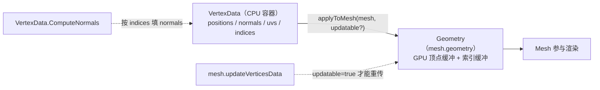

import { Canvas, Controls, Meta } from '@storybook/addon-docs/blocks';
import * as Stories from './geometry-and-vertex-data.stories';

<Meta of={Stories} name="Docs" />

# 几何与顶点

[网格](?path=/docs/mesh-and-meshbuilder--docs) 里的 `MeshBuilder.CreateBox` 等工厂在内部把一份完整的顶点数据塞进网格，所以你只需给 `size`、`diameter` 这些高层参数。本课换到形状的**底层数据视角**：每个可渲染的网格形状，最终都是一组顶点数据——位置、法线、UV、顶点色，加上一组把顶点拼成三角形的索引。Babylon 用两个类承载这条链路：`VertexData` 是 CPU 端的顶点数据**容器**，`Geometry` 是上传到 GPU 的几何**资源**；`vertexData.applyToMesh(mesh, updatable)` 把容器写入 mesh 背后的 Geometry。

理解这条链路，就能解释 MeshBuilder 的可调旋钮（`updatable`、为什么改尺寸要重建）、自定义任意拓扑（地形、波浪、程序化网格），以及"自定义网格全黑"这类高频故障。



| 概念 / API | 默认 / 取值 | 回查要点 |
| --- | --- | --- |
| `VertexData.positions` | 必填，`FloatArray`（x,y,z 交错） | 顶点局部坐标；缺失画不出三角形 |
| `VertexData.normals` | 可选，`FloatArray`（x,y,z） | 受光材质依赖；缺失材质变暗、平面化 |
| `VertexData.uvs` | 可选，`FloatArray`（u,v） | 贴图采样坐标；细节见[纹理](?path=/docs/textures--docs) |
| `VertexData.colors` | 可选，`FloatArray`（r,g,b,a） | 顶点色；需 `material.useVertexColor` 配合 |
| `VertexData.tangents` | 可选，`FloatArray`（x,y,z,w） | 切线，法线贴图所需 |
| `VertexData.indices` | 可选，`IndicesArray`（i,j,k） | 决定三角形拼装；让顶点可复用 |
| `applyToMesh(mesh, updatable?)` | `updatable` 默认 `false` | `true` 才能后续 `updateVerticesData` |
| `VertexData.ComputeNormals(positions, indices, normals)` | 静态方法，原地填充 `normals` | 按 `indices` 算每顶点法线 |
| `mesh.geometry` | `Nullable<Geometry>` | GPU 端资源；多个 Mesh 可共享同一份 |
| `VertexBuffer.PositionKind` 等 | 字符串常量（`'position'` / `'normal'` / …） | `set/getVerticesData` 的 `kind` 参数 |

## VertexData 与 Geometry

`VertexData` 是一个对象式的顶点数据容器：把 `positions`、`normals`、`uvs`、`colors`、`tangents`、`indices` 等字段填进去，再交给一个 mesh 或 geometry。它本身不持有 WebGL 资源——同一份 `VertexData` 可以反复 `applyToMesh` 到不同 mesh。

`Geometry` 是真正的 GPU 端几何资源：把顶点缓冲（VertexBuffer）、索引缓冲（IndexBuffer）和包围体组织起来，供 renderer 提交绘制。`mesh.geometry` 返回 mesh 背后的 `Geometry`（可能为 `null`）。`MeshBuilder.CreateBox` 等工厂在内部创建 `VertexData` 并 `applyToMesh`，最终也落到一份 `Geometry` 上。

最小写法——三个顶点、一个三角形：

```ts
import { Mesh, Scene, VertexData } from '@babylonjs/core';

const mesh = new Mesh('tri', scene);
const vd = new VertexData();
vd.positions = new Float32Array([0, 0, 0,  1, 0, 0,  0, 1, 0]);
vd.indices = [0, 1, 2];
vd.applyToMesh(mesh); // updatable 默认 false
```

`applyToMesh(mesh, updatable?)` 把 `VertexData` 的每个字段上传成对应的 GPU 缓冲，并让 mesh 的 `geometry` 指向新建的 `Geometry`。第二个参数 `updatable` 默认 `false`：只渲染、不改顶点的网格用默认值更省；需要运行时变形（见[运行时更新顶点](#运行时更新顶点)）时传 `true`，renderer 才会以可改写的方式创建缓冲。

`new Mesh(name, scene)` 创建的是无几何的空壳 mesh，必须再 `applyToMesh` 或 `setVerticesData` 才有形状。mesh 的变换、材质和层级关系见[网格](?path=/docs/mesh-and-meshbuilder--docs)；几何本身只描述"有哪些顶点、如何连成三角形"。

## 顶点属性与 kind

顶点属性是按顶点存储的 typed array，每项由 `kind` 字符串标识。Babylon 在 `VertexBuffer` 上提供 `*Kind` 常量，避免手写字符串出错：

| kind 常量 | 字符串 | stride | 作用 |
| --- | --- | --- | --- |
| `VertexBuffer.PositionKind` | `'position'` | 3 | 顶点局部坐标，**必填** |
| `VertexBuffer.NormalKind` | `'normal'` | 3 | 顶点法线，受光材质依赖 |
| `VertexBuffer.UVKind` | `'uv'` | 2 | 主贴图坐标 |
| `VertexBuffer.ColorKind` | `'color'` | 4 | 顶点色（r,g,b,a） |
| `VertexBuffer.TangentKind` | `'tangent'` | 4 | 切线，法线贴图所需 |

mesh 暴露一组统一的读写接口（同样适用于 `mesh.geometry`）：

```ts
import { VertexBuffer } from '@babylonjs/core';

mesh.setVerticesData(VertexBuffer.PositionKind, positions, true); // updatable=true
const normals = mesh.getVerticesData(VertexBuffer.NormalKind); // FloatArray | null
mesh.isVerticesDataPresent(VertexBuffer.UVKind); // boolean
```

`setVerticesData(kind, data, updatable=false, stride?)` 的 `updatable` 控制对应缓冲是否可改；`getVerticesData(kind, copyWhenShared?, forceCopy?)` 返回数据数组或 `null`（当 kind 不存在时）。`positions` 必须存在，否则画不出三角形；`normals` / `uvs` / `colors` 是可选的，但缺失会有可见后果——`normals` 缺失让受光材质失去明暗（见下一节）。

## 索引与三角形拼装

`indices` 描述"每三个顶点索引组成一个三角形"。没有 `indices` 时，renderer 按 `positions` 顺序每三个顶点画一个三角形，顶点不能跨三角形复用；有 `indices` 时按索引取顶点，相邻三角形可共享顶点数据。

```ts
// 一个四边形：4 个顶点、2 个三角形、6 个索引
vd.positions = new Float32Array([
  -1, 0, -1,   1, 0, -1,   1, 0, 1,   -1, 0, 1,
]);
vd.indices = [0, 1, 2,  0, 2, 3];
```

- 顶点数 = `positions.length / 3`；三角形数 = `indices.length / 3`。
- 索引数组类型：少量顶点用普通数组或 `Uint16Array`，超过 65535 顶点用 `Uint32Array`。
- 缠绕顺序：默认左手系下顺时针为正面；切到右手系（`scene.useRightHandedSystem = true`）会反向，见[坐标与尺寸](?path=/docs/coordinate-system-and-units--docs)。

mesh 端用 `mesh.setIndices(indices, totalVertices?, updatable?)` 写索引缓冲，`mesh.getIndices()` 读取，`mesh.getTotalVertices()` / `mesh.getTotalIndices()` 取计数。共享顶点是 `indices` 的核心价值：上面的四边形不用索引要写 6 个顶点（位置数据重复），用索引只存 4 个顶点，GPU 缓冲和法线计算都建立在 4 个顶点之上。

## 法线与 ComputeNormals

法线是每个顶点的"朝向"，材质用它和光源方向做点乘得到明暗。没有 `normals`，StandardMaterial / PBRMaterial 的漫反射项失去依据，网格会明显变暗或退化成平面着色——这是手写几何最常见的"为什么我的网格是黑的"。

`VertexData.ComputeNormals` 是一个静态方法，按 `indices` 描述的三角形拼接关系，把每个顶点的法线填进传入的 `normals` 数组：

```ts
const normals = new Float32Array(positions.length);
VertexData.ComputeNormals(positions, indices, normals);
vd.normals = normals;
```

签名：`VertexData.ComputeNormals(positions, indices, normals, options?)`——前两个是输入，第三个是输出（原地填充），返回 `void`。它把共享顶点的相邻面法线平均，因此**顶点是否共享（用不用 `indices`）直接影响法线是平滑还是硬边**：同一立方体，每面独立顶点得到硬边法线；强行共享 8 个角顶点会被平均成错误法线、失去棱角。

ComputeNormals 依赖 `indices`：没有 `indices` 时它无从知道哪些顶点共面，算不出法线。下方[自定义几何实例](#自定义几何)的「计算法线」开关可以直接对照这一现象。

## 自定义几何

把上面几节合起来，自定义几何的标准流程是：**造 positions → 造 indices → applyToMesh → 按需补 normals/uvs**。

```ts
import { Mesh, VertexData, VertexBuffer } from '@babylonjs/core';

const mesh = new Mesh('custom', scene);

// 1. 顶点：网格交叉点
const positions = new Float32Array(/* x,y,z 交错 */);
// 2. 索引：每个格子两个三角形
const indices = new Uint32Array(/* i,j,k 交错 */);
// 3. UV：按归一化网格坐标，便于后续贴图
const uvs = new Float32Array(/* u,v 交错 */);

const vd = new VertexData();
vd.positions = positions;
vd.indices = indices;
vd.uvs = uvs;

// 4. 法线：要受光就必须补；ComputeNormals 按 indices 反推每顶点法线
const normals = new Float32Array(positions.length);
VertexData.ComputeNormals(positions, indices, normals);
vd.normals = normals;

// 5. 写入 mesh；updatable=true 才能后续运行时改顶点
vd.applyToMesh(mesh, true);
```

下面的实例用一份细分网格搭一个会起伏的波浪面，完整演示这条链路。它先把网格的 `positions` / `indices` / `uvs` 造出来，`applyToMesh(mesh, true)` 写入；每帧再用 `mesh.updateVerticesData` 把新的波浪高度重传到 GPU，体现 updatable buffer。

<Canvas of={Stories.CustomGeometry} />

<Controls of={Stories.CustomGeometry} />

| 读者操作 | 可观察证据 |
| --- | --- |
| 关闭「计算法线」 | 顶点数据不含 normals，受光面明显变暗、平面化；顶点/三角形读数不变——证明是法线而非拓扑决定明暗 |
| 调「细分」 | 顶点数 = (sub+1)²、三角形数 = sub²×2 同步变化；曲面更平滑，运行时仍在变形 |
| 拖「波浪幅度」到 0 | 网格回到平面，但每帧仍 `updateVerticesData`——updatable buffer 在工作，只是位移被归零 |
| 鼠标拖动画布 | 轨道相机绕网格旋转，从不同角度看法线带来的明暗对比 |

注意「计算法线」关闭时读数里顶点数和三角形数都没变，**唯一变化的就是有没有 `normals` 字段**——这把"法线决定受光明暗"单独隔离出来。

## 运行时更新顶点

波浪、挤压、布料模拟这类"形状随时间变"的效果，需要每帧改顶点。前提是缓冲被标为 updatable——三条路径任选其一：

```ts
// 路径 1：applyToMesh 时声明整份几何 updatable
vertexData.applyToMesh(mesh, true);

// 路径 2：单独写一个 kind 时声明 updatable
mesh.setVerticesData(VertexBuffer.PositionKind, positions, true);

// 路径 3：事后把已存在的缓冲标记为 updatable
mesh.markVerticesDataAsUpdatable(VertexBuffer.PositionKind, true);
```

之后每帧改 typed array，再 `mesh.updateVerticesData(kind, data, updateExtends?, makeItUnique?)` 把新数据上传到 GPU：

```ts
const time = performance.now() / 1000;
for (let v = 0; v < vertexCount; v++) {
  positions[v * 3 + 1] = waveHeight(positions[v * 3], positions[v * 3 + 2], time);
}
mesh.updateVerticesData(VertexBuffer.PositionKind, positions, false, false);
```

两个容易漏的步骤：

- **重算法线**：变形后表面朝向变了，旧法线不再匹配，光照会和形状脱节。需要受光时每帧（或按需）再跑一次 `VertexData.ComputeNormals` 并 `updateVerticesData(NormalKind, normals, ...)`。波浪实例的「计算法线」开关打开时就是这样做的。
- **重算包围体**：`updateExtends` 默认 `false`，不重算 mesh 的包围盒。小幅变形通常没问题；顶点大幅偏移后，过期的包围体可能让视锥剔除误伤——这时把第三个参数传 `true`，或调用 `mesh.refreshBoundingInfo()`。

顶点数变化（增减顶点）必须重建 `VertexData` 并重新 `applyToMesh`，不能只 `updateVerticesData`——缓冲长度不能动态改。波浪实例里调「细分」就是走重建路径，调「幅度」走 update 路径。

`Geometry` 端也有等价方法：`geometry.updateVerticesData(kind, data, updateExtends?)`、`geometry.setVerticesData(kind, data, updatable?, stride?)`，用于直接操作共享几何。多个 mesh 共享同一份 `Geometry` 时（例如通过 `mesh.clone()` 默认共享几何），改一处会作用到全部副本——要单独改某个 mesh，用 `updateVerticesData(kind, data, updateExtends, makeItUnique=true)` 把它的几何先克隆出去。

## 最佳实践

- 内置形状优先用 `MeshBuilder`；只有程序化拓扑（地形、波浪、参数化曲面）或需要精确控制顶点数据时，才手写 `VertexData`。
- 写自定义几何的最小清单：`positions`（必填）→ `indices`（推荐，复用顶点）→ `normals`（受光必需）→ `uvs`（贴图必需）→ `colors` / `tangents`（按需）。
- 只渲染、不改顶点的网格，`applyToMesh` 不传 `updatable`（默认 `false`），GPU 缓冲以更省的方式分配。
- 静态复用同一份几何：让多个 mesh 共享同一 `Geometry`（`mesh.clone()`、`new InstancedMesh`），而不是为每个位置复制一份顶点。
- 顶点数变化要重建 `VertexData`；只改数值用 `updateVerticesData`，并按需重算法线和包围体。
- 法线是否平滑由"顶点是否共享"决定：要硬边就拆分顶点（每面独立），要平滑就共享顶点并让 `ComputeNormals` 平均。
- 几何不再使用时 `mesh.dispose()` 会连带释放其 `Geometry`（无其他 mesh 引用时）；确认共享关系后再手动 `geometry.dispose()`。

## 常见问题

- 为什么自定义网格是黑的或不受光？
  检查 `VertexData` 是否设了 `normals`。没有就 `VertexData.ComputeNormals(positions, indices, normals)` 补上；同时确认场景里有光源、材质不是纯发光型。
- 为什么 `ComputeNormals` 没有效果或报错？
  它依赖 `indices` 描述的三角形拼接。确认 `vd.indices` 已填，且 `normals` 数组长度与 `positions` 一致（`positions.length`）。
- 为什么改了 `positions` 画面不变？
  缓冲没被标为 updatable。`applyToMesh(mesh, true)` 或 `mesh.markVerticesDataAsUpdatable(VertexBuffer.PositionKind, true)`，改完再 `mesh.updateVerticesData(VertexBuffer.PositionKind, positions)`。
- 为什么变形后物体突然消失，日志里位置还在？
  顶点大幅偏移后包围体过期，被视锥剔除。`updateVerticesData(kind, data, true)` 或 `mesh.refreshBoundingInfo()` 重算包围盒。
- 为什么共享几何后改一个 mesh，其他副本也变了？
  `mesh.clone()` 默认共享 `Geometry`。要单独改，用 `updateVerticesData(kind, data, updateExtends, makeItUnique=true)`，或先 `mesh.makeGeometryUnique()`。
- 为什么改了 `MeshBuilder.CreateBox` 的 `size` 形状没变？
  构造参数只在创建时生效。新建一个 mesh 或新建几何替换 `mesh.geometry`，不要指望改 `mesh` 上的某个属性就自动重建。
- 为什么立方体看起来像球、棱角没了？
  顶点被共享、法线被 `ComputeNormals` 平均成平滑过渡。要保留硬边，每个面用独立顶点（不共享角顶点）。

## 总结回顾

摘要：

形状的底层是顶点数据。`VertexData` 是 CPU 端容器，承载 `positions`（必填）、`normals`（受光）、`uvs`（贴图）、`colors`、`tangents` 和 `indices`（三角形拼装）；`applyToMesh(mesh, updatable)` 把它写进 mesh 背后的 `Geometry`，即 GPU 端资源。自定义几何的标准流程是造 positions → 造 indices → applyToMesh → 按需补 normals/uvs；`VertexData.ComputeNormals(positions, indices, normals)` 按 indices 反推每顶点法线，缺失法线会让受光材质变暗、平面化。运行时变形要先把缓冲标为 updatable，再每帧 `updateVerticesData` 重传，并按需重算法线与包围体；顶点数变化则必须重建整份 `VertexData`。

一句话：

> 形状就是 `VertexData` 里的顶点数据；`applyToMesh` 把它交给 `Geometry` 上传 GPU，`updateVerticesData` 在 updatable 时改它，`ComputeNormals` 让它受光。

知识要点：

- `VertexData` 和 `Geometry` 分别负责什么？`applyToMesh` 的 `updatable` 参数改变什么？
- 哪些顶点属性是必填、哪些可选？缺失 `normals` 时受光材质会怎样？
- `indices` 如何决定三角形拼装？共享顶点有什么好处？
- `VertexData.ComputeNormals` 的签名和依赖是什么？顶点是否共享如何影响法线平滑/硬边？
- 自定义几何的最小流程是什么？
- 运行时改顶点要满足什么前提？哪两个步骤容易漏？
- 改顶点数与改顶点数值分别走哪条路径？
- 多个 mesh 共享 `Geometry` 时如何单独修改其中一个？

## 参考资料

- [Babylon.js TypeDoc：VertexData](https://doc.babylonjs.com/typedoc/classes/BABYLON.VertexData)
- [Babylon.js TypeDoc：Geometry](https://doc.babylonjs.com/typedoc/classes/BABYLON.Geometry)
- [Babylon.js TypeDoc：VertexBuffer（`*Kind` 常量）](https://doc.babylonjs.com/typedoc/classes/BABYLON.VertexBuffer)
- [Babylon.js TypeDoc：AbstractMesh（`setVerticesData` / `updateVerticesData` / `markVerticesDataAsUpdatable`）](https://doc.babylonjs.com/typedoc/classes/BABYLON.AbstractMesh)
- [Babylon.js Features：Vertex Data（自定义几何与法线计算）](https://doc.babylonjs.com/features/featuresDeepDive/mesh/vertexBuffer/geometry)
- [Babylon.js Features：Create Set Vertices](https://doc.babylonjs.com/features/featuresDeepDive/mesh/vertexBuffer/createSet)
- [Babylon.js Guided Learning](https://doc.babylonjs.com/guidedLearning/)
