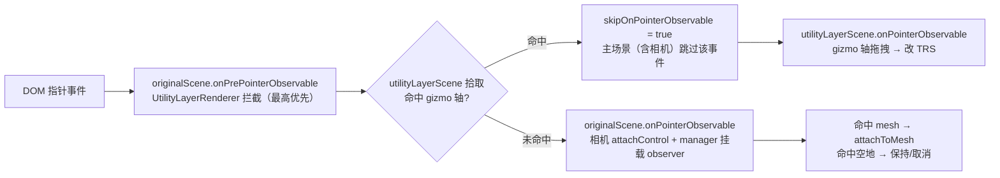

import { Canvas, Controls, Meta } from '@storybook/addon-docs/blocks';
import * as Stories from './gizmos.stories';

<Meta of={Stories} name="Docs" />

# Gizmo

Gizmo 是场景里让鼠标**直接拖拽变换对象**的交互工具——对应 three.js 的 `TransformControls`，但 API 形态截然不同：Babylon 用一个 `GizmoManager` 统一管理 Position / Rotation / Scale / BoundingBox 四类 gizmo，开关是布尔属性，挂载用 `attachToMesh` / `attachToNode`。它内部已经把 [5.2 指针与拾取](?path=/docs/pointer-input-and-picking--docs) 的 `onPointerObservable` 与一个独立的渲染层（`UtilityLayerRenderer`）接好，所以"点哪个对象、拖哪条轴、拖拽时让不让相机跟着转"都由管理器托管，不需要像 three.js 那样手写 `dragging-changed` 桥接。

先建立三条判断，后面四类 gizmo 与一堆开关才不容易混：

- **开关决定显示哪类 gizmo，attach 决定它跟着谁。** `manager.positionGizmoEnabled` / `rotationGizmoEnabled` / `scaleGizmoEnabled` / `boundingBoxGizmoEnabled` 是四个布尔属性，置 `true` 创建并显示对应 gizmo，置 `false` 解绑（子 gizmo 实例**不销毁**，再开复用）；`manager.attachToMesh(mesh)` 把所有"已启用"的 gizmo 绑到同一个目标。
- **选哪个对象由 manager 的内置 POINTERDOWN 挂载托管，也可手动调 `attachToMesh`。** `usePointerToAttachGizmos`（默认 `true`）让管理器在主场景 `onPointerObservable` 上挂一个 observer：POINTERDOWN 命中 mesh 就自动 `attachToMesh`。这复用了 5.2 的拾取管线，不需要你自己写 `scene.pick` + `attach`。
- **拖拽 gizmo 时相机自动让路。** gizmo 渲染在独立的 `UtilityLayerRenderer` 上，该层在 `onPrePointerObservable` 最优先拦截：命中 gizmo 轴就把指针事件 `skipOnPointerObservable = true`，主场景（含相机的 `attachControl`）跳过这一帧的指针输入——无需任何手工协调。



| 输入或概念 | 默认 / 常用 | 回查要点 |
| --- | --- | --- |
| `new GizmoManager(scene, thickness?, utilityLayer?, keepDepthUtilityLayer?)` | `thickness=1`；后两层用默认共享 `UtilityLayerRenderer` | 一个 scene 一个 manager；不要为每次选中 `new` 一个 |
| `manager.gizmos` | `{ positionGizmo, rotationGizmo, scaleGizmo, boundingBoxGizmo }` 全 `null` | 首次置 `*Enabled=true` 才创建对应子 gizmo；之后再关只解绑不销毁，再开复用同一实例 |
| `positionGizmoEnabled` / `rotationGizmoEnabled` / `scaleGizmoEnabled` / `boundingBoxGizmoEnabled` | 全 `false` | 置 `true` 创建并绑当前目标；置 `false` 解绑（`attachedNode=null`，隐藏） |
| `manager.attachToMesh(mesh)` / `attachToNode(node)` | 传 `null` 解绑 | 只影响"已启用"的 gizmo；`attachToMesh` 清空 `attachedNode`，`attachToNode` 清空 `attachedMesh` |
| `manager.attachedMesh` / `attachedNode` | `null` | 只读，取当前挂载目标 |
| `manager.usePointerToAttachGizmos` | `true` | POINTERDOWN 命中 mesh 时自动 `attachToMesh`；置 `false` 完全手动 |
| `manager.clearGizmoOnEmptyPointerEvent` | `false` | 置 `true` 时点空地（`pickedMesh` 为 `null`）自动解绑 |
| `manager.enableAutoPicking` | `true` | 与 `usePointerToAttachGizmos` 配合；关掉则内置 observer 不主动 attach |
| `manager.attachableMeshes` / `attachableNodes` | `null` | `null` 时拾取后走到根父节点；指定数组则只在白名单对象上挂载 |
| `manager.coordinatesMode` | `GizmoCoordinatesMode.Local` | `Local` / `World`；Scale 始终 `Local`（设 `World` 只打印警告） |
| `manager.scaleRatio` | `1` | gizmo 视觉缩放，不影响变换幅度 |
| `manager.isHovered` / `isDragging` | `false` | 任意已启用子 gizmo 悬停 / 拖拽即为 `true` |
| `manager.utilityLayer` / `keepDepthUtilityLayer` | 默认共享 `UtilityLayerRenderer` | position/rotation/scale 在 `utilityLayer`（总在前）；boundingBox 在 `keepDepthUtilityLayer`（保留深度，可被遮挡） |

## 快速上手

最小闭环：构造 manager、开一种 gizmo、`attachToMesh` 一个对象——gizmo 立刻出现，拖拽即改 TRS。

```ts
import { GizmoManager, Scene, Vector3, MeshBuilder } from '@babylonjs/core';

const manager = new GizmoManager(scene);
manager.positionGizmoEnabled = true; // 开 PositionGizmo（首次创建子 gizmo）

const box = MeshBuilder.CreateBox('box', { size: 1 }, scene);
box.position.y = 0.5;
manager.attachToMesh(box); // 挂到目标——gizmo 出现在 box 上，拖轴直接改 box.position
```

更常见的"点击选中再变换"也只需一行配置——manager 默认就内置了点击挂载：

```ts
const manager = new GizmoManager(scene);
manager.positionGizmoEnabled = true;
manager.clearGizmoOnEmptyPointerEvent = true; // 点空地取消挂载（默认 false）
// usePointerToAttachGizmos 默认 true：POINTERDOWN 命中 mesh 自动 attachToMesh
```

相机的 `attachControl` 照常启用，拖拽 gizmo 轴时相机不会跟着转——机制见 [渲染层与相机共存](#渲染层与相机共存)。

## GizmoManager 与四类 gizmo

`GizmoManager` 是 gizmo 系统的唯一入口，承担三件事：按需创建/销毁四类子 gizmo、维护当前挂载目标、在主场景上托管"点击挂载"的指针 observer。它**不渲染任何东西**——实际变换工具是它内部的四类子 gizmo，渲染在 `UtilityLayerRenderer` 的独立场景上。

`manager.gizmos` 是一个装着四个 `Nullable` 子 gizmo 的对象：`{ positionGizmo, rotationGizmo, scaleGizmo, boundingBoxGizmo }`。初始全 `null`——只有把对应 `*Enabled` 置 `true` 才会 `new` 出来。这是延迟创建：不用就不付构造代价。置 `false` 时**只解绑**（子 gizmo 的 `attachedNode = null`，gizmo 隐藏），实例本身保留；再置 `true` 复用原实例。所以"开关"是真正的开关，不是构造器，可以反复拨。

四类 gizmo 都实现了 `IGizmo` 接口（`attachedMesh` / `attachedNode` / `isHovered` / `isDragging` / `onDragStartObservable` / `onDragObservable` / `onDragEndObservable` / `releaseDrag` / `dispose`），但各自的子构件与默认行为不同：

### 四类 gizmo：Position / Rotation / Scale / BoundingBox

| gizmo | 子构件 | 改写的属性 | 坐标空间 | 吸附 |
| --- | --- | --- | --- | --- |
| **PositionGizmo** | `xGizmo`/`yGizmo`/`zGizmo`（`AxisDragGizmo`，三轴箭头）+ `xPlaneGizmo`/`yPlaneGizmo`/`zPlaneGizmo`（`PlaneDragGizmo`，平面拖片，由 `planarGizmoEnabled` 统一开关） | `attachedMesh.position` | Local/World 均可 | `snapDistance`（世界单位） |
| **RotationGizmo** | `xGizmo`/`yGizmo`/`zGizmo`（`PlaneRotationGizmo`，三个圆环） | **`rotationQuaternion`**（默认 `useEulerRotation=false`，不写 `rotation` 欧拉角） | Local/World 均可 | `snapDistance`（弧度） |
| **ScaleGizmo** | `xGizmo`/`yGizmo`/`zGizmo`（`AxisScaleGizmo`，三轴方块）+ `uniformScaleGizmo`（中心八面体，等比缩放） | `attachedMesh.scaling` | **始终 Local**（设 `World` 只打印警告） | `snapDistance` + `incrementalSnap` |
| **BoundingBoxGizmo** | 8 个缩放手柄 + 旋转盘（`PointerDragBehavior` 驱动） | `position` + `scaling`（包围盒变换） | — | 无吸附 |

子 gizmo 的颜色固定按轴：X 红、Y 绿、Z 蓝（`Color3.Red().scale(0.5)` 等柔和色）；BoundingBoxGizmo 默认描边色 `#0984e3`。每类 gizmo 都暴露 `onDragStartObservable` / `onDragObservable` / `onDragEndObservable`，需要"拖完提交一次序列化"时挂 `onDragEndObservable`。

> **旋转用四元数。** RotationGizmo 经 GizmoManager 创建时硬编码 `useEulerRotation=false`，拖拽写的是 `attachedMesh.rotationQuaternion`，**不会**同步 `rotation` 欧拉角。一旦拖过旋转 gizmo，`mesh.rotation` 就失效（Babylon 规则：`rotationQuaternion` 非 `null` 时 `rotation` 被忽略）。读朝向要分解四元数：`mesh.rotationQuaternion?.toEulerAngles()`。需要回到欧拉角模式，自行 `mesh.rotationQuaternion = null` 并把分解值写回 `mesh.rotation`。RotationGizmo 对 billboard 模式的节点会打印警告且不工作。

要同时开多种 gizmo（例如 Position + Rotation）就分别置 `true`，它们会同时绑到 `attachedMesh` 上。编辑器场景更常见的做法是**互斥切换**（一次只开一种），用完一类再切下一类——这正是范例 `gizmoType` 控件演示的模式。

## 挂载目标：attachToMesh 与 attachToNode

gizmo 改的是"挂载目标"的 TRS。两条挂载路径，互为补充：

**手动挂载** —— 由你的代码决定挂谁：

```ts
manager.attachToMesh(box);     // 挂 AbstractMesh；所有已启用 gizmo 跟过去
manager.attachToNode(transformNode); // 挂任意 Node（如 TransformNode 分组）
manager.attachToMesh(null);    // 解绑：gizmo 隐藏，attachedMesh 变 null
```

`attachToMesh` 与 `attachToNode` 互斥：调一个会把另一个清空。它们只影响"当前已启用"的 gizmo——后开的 gizmo 会自动绑到当前的 `attachedMesh` / `attachedNode`，不需要重新挂一次。范例把"选哪个 mesh"做成 Controls，就是为了演示这条手动路径。

**自动挂载** —— 由 manager 的内置 observer 决定挂谁。`usePointerToAttachGizmos`（默认 `true`）让管理器在主场景 `onPointerObservable` 上注册一个 POINTERDOWN observer：复用 5.2 的拾取，命中 mesh 就 `attachToMesh`。这是 Babylon 与 three.js 差别最大的地方——three.js 的 `TransformControls` 内部 raycaster **只识别 gizmo 轴**，选中对象完全靠应用层；Babylon 把"选中对象"也内置进了 manager。

自动挂载有三个开关配合：

| 开关 | 默认 | 作用 |
| --- | --- | --- |
| `usePointerToAttachGizmos` | `true` | 总开关；置 `false` 完全关掉自动挂载，只用 `attachToMesh` |
| `enableAutoPicking` | `true` | 配合上一项；置 `false` 则 observer 仍接收事件但不主动 attach |
| `clearGizmoOnEmptyPointerEvent` | `false` | 置 `true` 时，POINTERDOWN 的 `pickedMesh` 为 `null`（点空地）自动 `attachToMesh(null)` |
| `attachableMeshes` / `attachableNodes` | `null` | 白名单；`null` 时拾取后**走到根父节点**再挂载，设数组则只在这些对象上挂 |

`attachableMeshes = null` 时的"走到根父节点"行为很关键：如果你的可拾取 mesh 是某个 `TransformNode` 分组的子节点，manager 会把 gizmo 挂到**根父节点**而非被点的子 mesh——变换的是整个分组。想"点哪个子节点挂哪个"就把所有子节点都列进 `attachableMeshes`，或直接走手动 `attachToMesh`。

> 自动挂载与 [5.2 指针与拾取](?path=/docs/pointer-input-and-picking--docs) 共用同一条 `onPointerObservable` 管线：被 `mesh.isPickable = false` 排除的对象（地面、辅助网格）不会被自动挂载，`POINTERPICK` / `POINTERTAP` 的"按下+松开同一 mesh"判定也不影响这里——manager 只看 `POINTERDOWN` 一次。想把地面设成"点它取消选中"，靠的不是 `isPickable`，而是 `clearGizmoOnEmptyPointerEvent = true`（地面对 pick 不可见，`pickedMesh` 为 `null`，触发取消）。

## 渲染层与相机共存

gizmo 不在主场景里渲染，而是渲染在一个独立的 `UtilityLayerRenderer` 上——它内部维护一个 `utilityLayerScene`，在主场景每帧渲染完后叠加绘制。这样 gizmo 永远画在物体之上、不受主场景后处理影响、自己的 mesh 也不进入主场景的拾取候选。manager 持有两个层：

- **`utilityLayer`**（默认共享层，`autoClearDepthAndStencil = true`）：position/rotation/scale gizmo 渲染在这里，每帧清掉深度后叠加，所以**永远画在最前面**，不会被物体遮挡。
- **`keepDepthUtilityLayer`**（`autoClearDepthAndStencil = false`）：boundingBox gizmo 渲染在这里，**保留主场景深度**，所以包围盒会被前景物体遮挡——这正是包围盒工具期望的"贴在物体表面"效果。

两个层默认都是 `UtilityLayerRenderer` 的静态单例（`DefaultUtilityLayer` / `DefaultKeepDepthUtilityLayer`），同场景里多个 gizmo 管理器共享。`GizmoManager.dispose()` 只在传入的是非默认层时才释放它们；默认层跟随 `scene.dispose()` 自动清理。

**相机共存的关键机制在这条层上**：`UtilityLayerRenderer` 在构造时往主场景的 `onPrePointerObservable`（指针事件**分发之前**的阶段）注册一个最高优先级的 observer。每个指针事件来时，它先用 `utilityLayerScene` 做一次拾取：

- 命中 gizmo 轴 → 把指针事件转发给 `utilityLayerScene.onPointerObservable`，并置 `prePointerInfo.skipOnPointerObservable = true`，**主场景的 `onPointerObservable` 整个跳过**这一事件——相机的 `attachControl` 听的是主场景，自然不响应；
- 未命中 gizmo 轴 → 事件正常流入主场景，相机照常旋转 / 缩放 / 平移。

所以"拖 gizmo 时相机不动"是引擎自动的，不需要你监听拖拽去 `camera.detachControl`——这一点和 three.js `TransformControls` 必须手写 `dragging-changed` 桥接完全不同。范例读数里的"正在拖拽"会在拖 gizmo 时变"是"，同时你可以观察到相机纹丝不动。

> 想完全确认这条机制：在 `utilityLayer.utilityLayerScene.onPointerObservable` 与 `scene.onPointerObservable` 各挂一个打印 observer，拖 gizmo 轴时只有前者收到 POINTERDOWN；点空地或 mesh 时只有后者收到。

## 坐标空间与吸附

**坐标空间**由 `manager.coordinatesMode` 统一切换，默认 `GizmoCoordinatesMode.Local`：

- `Local`：gizmo 跟随 attached mesh 自身朝向（`updateGizmoRotationToMatchAttachedMesh = true`）——拖 X 轴沿对象的局部 X。
- `World`：gizmo 对齐世界轴——拖 X 轴沿世界 X。

Position 与 Rotation 都尊重 `coordinatesMode`；Scale 始终是 Local（缩放没有"世界空间"语义，设 `World` 只打印 `Setting coordinates Mode to world on scaling gizmo is not supported.` 警告）。切换 `coordinatesMode` 不会改变对象已有变换，只改后续拖拽的参照系。需要"平移走世界、旋转走局部"这种混合，就绕开 manager、直接操作单个子 gizmo（`manager.gizmos.positionGizmo.coordinatesMode` / `rotationGizmo.coordinatesMode` 各自独立设）。

**吸附**写在各子 gizmo 上（manager 不统一暴露），三类各一个 `snapDistance`：

```ts
manager.gizmos.positionGizmo.snapDistance = 0.5;        // 世界单位
manager.gizmos.rotationGizmo.snapDistance = Math.PI / 12; // 弧度（15°）
manager.gizmos.scaleGizmo.snapDistance = 0.1;            // 缩放步长
manager.gizmos.scaleGizmo.incrementalSnap = true;        // 增量吸附：1.1→1.2→1.3，而非 1.1→1.21→1.33
```

`snapDistance = 0`（默认）不吸附。Position 还可以开 `planarGizmoEnabled = true` 显示三个平面拖片，做"沿一个面拖"而不是"沿一条轴拖"。Rotation 与 Scale 各有一个 `sensitivity`（默认 `1`）调节拖拽手感。

## 交互式变换工作流

把上面四块串起来就是编辑器标配工作流：选 gizmo 类型 → 选目标 → 拖 gizmo 改 TRS → 读数/序列化。下面范例把场景里四个对象（盒子 / 球体 / 圆柱 / 圆环）交给一个 `GizmoManager`：Controls 切 gizmo 类型与挂载目标，拖 gizmo 时读数实时反映 `position` / `rotation` / `scaling`。

<Canvas of={Stories.Gizmo} />

<Controls of={Stories.Gizmo} />

| 读者操作 | 可观察证据 |
| --- | --- |
| 默认状态（PositionGizmo + 盒子） | 盒子上出现三轴箭头；读数「目标 mesh」= 盒子，position/rotation/scaling 为初始值 |
| 拖某个轴箭头 | 盒子沿该轴平移；读数「position」实时变化，「正在拖拽」= 是 |
| 切「gizmo 类型」到 RotationGizmo | 三轴箭头变成三个圆环，**仍在盒子上**（`_attachedMesh` 保留）；拖圆环改朝向，「rotation」从 `rotationQuaternion` 分解成角度刷新 |
| 切到 ScaleGizmo / BoundingBoxGizmo | Scale 出现三轴方块 + 中心八面体（等比缩放）；BoundingBox 出现带 8 手柄的整体包围盒，可被前景物体遮挡（渲染在保留深度的层） |
| 拖 gizmo 轴时观察背景 | 相机**不转动**（UtilityLayerRenderer 在 pre-pointer 阶段 `skipOnPointerObservable=true`）；松手后「正在拖拽」= 否 |
| 切「挂载目标」到 球体/圆柱/圆环 | gizmo 跳到该对象上，「目标 mesh」立即更新；此时点击 canvas 不会重新挂载（`usePointerToAttachGizmos` 被关掉以锁住选择） |
| 切「挂载目标」到 auto | 进入内置点击挂载模式：点击任意对象 → gizmo 跟过去；点击空地（地面 `isPickable=false`）→ 因 `clearGizmoOnEmptyPointerEvent=true` 自动解绑 |
| 在画布上拖空地旋转相机 | ArcRotateCamera 正常旋转；gizmo 跟着 attached mesh（不动），读数不变——证明未拖 gizmo 时指针正常流给相机 |
| 切「gizmo 类型」到 不启用 | 四类 gizmo 全部解绑隐藏；attached mesh 保留，TRS 读数停留在最后一帧 |

## dispose 与生命周期

`GizmoManager` 实现了 `IDisposable`。`manager.dispose()` 会：移除它挂在主场景 `onPointerObservable` 上的两个 observer（"点击挂载"和"gizmo 轴缓存"）、`dispose` 四个子 gizmo（各释放自己的 sub-gizmo 与材质）、detach `boundingBoxDragBehavior`、清理 `onAttachedToMeshObservable`，并在传入的是非默认 `UtilityLayerRenderer` 时一并释放两个层。

```ts
function teardown() {
  manager.dispose();     // 释放四类 gizmo + observer + 非默认 utility layer
  scene.dispose();       // 默认共享 UtilityLayerRenderer 随 scene 自动清理
  engine.dispose();
}
```

默认共享的 `UtilityLayerRenderer`（`DefaultUtilityLayer` / `DefaultKeepDepthUtilityLayer`）是静态单例，绑定在 `originalScene.onDisposeObservable` 上——`scene.dispose()` 时它们自动释放，不需要你手动管。但如果你在 `new GizmoManager` 时传入了自定义的 `UtilityLayerRenderer`，`manager.dispose()` 会负责释放它。

监听挂载变化用 `manager.onAttachedToMeshObservable` / `onAttachedToNodeObservable`（参数是新的 `Nullable<AbstractMesh>` / `Node`），适合驱动属性面板切换显示目标。需要"代码强制松手"时调 `manager.releaseDrag()`（例如 ESC 取消当前拖拽）。

## 最佳实践

- 一个场景一个 `GizmoManager`，反复 `attachToMesh` 切目标；不要为每个选中 `new` 一个 manager——它会在主场景上重复挂 observer、重复创建四类子 gizmo。
- 编辑器场景用**互斥切换**（一次只开一种 gizmo），用 Controls 或快捷键拨 `*Enabled`；切类型时 `_attachedMesh` 自动保留，体验最顺。
- 想让"点击 mesh 选中 + 拖 gizmo 变换"开箱即用，保留 `usePointerToAttachGizmos = true`（默认）即可；同时开 `clearGizmoOnEmptyPointerEvent = true` 让点空地取消选中。需要用 5.2 的自定义 predicate 过滤候选（按 tag、按 `metadata`），就把 `usePointerToAttachGizmos` 关掉，自己挂 `onPointerObservable` 拾取后 `attachToMesh`。
- 不想让 gizmo 改到的对象（辅助网格、天空盒、Collider）置 `isPickable = false`，让自动挂载的内置拾取直接跳过——与 5.2 同一套规则。
- 需要白名单时用 `attachableMeshes`：拾取后 manager 会沿父链找到白名单中的祖先挂上去，避免把 gizmo 挂到不可见的子节点上。
- 读朝向前先判断 `rotationQuaternion`：RotationGizmo 默认写四元数，`mesh.rotation` 不会同步；`rotationQuaternion` 非 `null` 时 `rotation` 被引擎忽略。
- 不要拖每帧序列化整个场景：用 `onDragEndObservable` 在拖完提交一次，`onDragObservable` 只做属性面板的实时刷新。
- 卸载时按 `manager.dispose()` → `scene.dispose()` → `engine.dispose()` 顺序释放；默认 utility layer 随 scene 自动清理，自定义层由 manager 释放。

## 常见问题

- 为什么拖 gizmo 轴时相机也跟着转？
  正常不会——`UtilityLayerRenderer` 会在命中 gizmo 轴时 `skipOnPointerObservable`。如果你观察到相机同时转，多半是 gizmo 渲染层被改了（自定义 `utilityLayer` 且 `pickUtilitySceneFirst = false`），或 gizmo mesh 的 `isPickable` 被关掉导致 utility 层拾取不到。确认 `manager.utilityLayer.pickUtilitySceneFirst` 保持默认 `true`。
- 为什么点击 mesh 没有自动挂上 gizmo？
  检查四个开关：`usePointerToAttachGizmos`（默认 `true`）、`enableAutoPicking`（默认 `true`）、目标 mesh 的 `isPickable`（默认 `true`）、以及至少一个 `*Enabled = true`。全开才会"点击即出现 gizmo"。`attachableMeshes` 若设了白名单，目标 mesh 必须在数组里或其后代。
- 为什么点空地 gizmo 不取消？
  `clearGizmoOnEmptyPointerEvent` 默认 `false`。置 `true` 后，POINTERDOWN 的 `pickedMesh` 为 `null` 才触发 `attachToMesh(null)`。注意：地面设了 `isPickable = false` 才算"空地"（pick 不到 → `pickedMesh` 为 `null`）；如果地面可拾取，点它会被当成"选中地面"而非空地。
- 为什么 RotationGizmo 拖完，读 `mesh.rotation` 还是 `(0,0,0)`？
  RotationGizmo 默认 `useEulerRotation = false`，写的是 `mesh.rotationQuaternion`；四元数非 `null` 时 `rotation` 被忽略。读朝向用 `mesh.rotationQuaternion?.toEulerAngles()`，或自行把四元数分解后写回 `mesh.rotation` 再置 `rotationQuaternion = null`。
- 为什么 ScaleGizmo 设了 `coordinatesMode = World` 没反应？
  Scale 始终是 Local——设 `World` 只会打印 `Setting coordinates Mode to world on scaling gizmo is not supported.`。缩放没有"世界空间"语义；需要"沿世界轴缩放"换用 Position + Rotation 组合，或自行变换。
- 为什么 `attachableMeshes` 设了之后，点子节点 gizmo 挂到了父节点？
  这是设计行为：manager 拾取后沿父链找到 `attachableMeshes` 中第一个祖先挂上去，方便"整组变换"。想精确到子节点，把所有子节点都列进 `attachableMeshes`，或关掉 `usePointerToAttachGizmos` 走手动 `attachToMesh`。
- 为什么 BoundingBoxGizmo 会被前景物体遮住，而其他三类不会？
  BoundingBox 渲染在 `keepDepthUtilityLayer`（`autoClearDepthAndStencil = false`，保留主场景深度），所以可被遮挡——这是包围盒工具"贴在物体表面"的预期效果。Position/Rotation/Scale 渲染在 `utilityLayer`（每帧清深度），永远画在最前面。
- 切换 `*Enabled` 后 gizmo 没出现在新目标上？
  `*Enabled` 的 setter 只把"当前 `attachedMesh` / `attachedNode`"绑给新启用的 gizmo。若之前 `attachToMesh(null)` 解过绑，新开的 gizmo 也无目标。先 `attachToMesh(mesh)` 再开 gizmo，或开 gizmo 后再 attach——两种顺序都可，setter 与 attach 都会同步。

## 总结回顾

摘要：

Babylon.js 的 Gizmo 用一个 `GizmoManager` 管四类子 gizmo（Position/Rotation/Scale/BoundingBox），`*Enabled` 四个布尔属性延迟创建/解绑子 gizmo，`attachToMesh` / `attachToNode` 统一绑目标，`usePointerToAttachGizmos` 内置 POINTERDOWN 点击挂载（复用 5.2 拾取管线）。子 gizmo 渲染在独立的 `UtilityLayerRenderer` 上——position/rotation/scale 在每帧清深度的 `utilityLayer`（永远在前），boundingBox 在保留深度的 `keepDepthUtilityLayer`（可被遮挡）。相机共存由该层在 `onPrePointerObservable` 最高优先级拦截自动完成：命中 gizmo 轴即 `skipOnPointerObservable`，主场景含相机跳过该事件，无需手工桥接。RotationGizmo 默认写 `rotationQuaternion`（不写 `rotation`），Scale 始终 Local，`coordinatesMode` 对 position/rotation 切 Local/World。吸附走各子 gizmo 的 `snapDistance`（Scale 加 `incrementalSnap`）。`manager.dispose()` 释放子 gizmo 与 observer，默认共享 utility layer 随 `scene.dispose()` 自动清理。

一句话：

> GizmoManager 用四个布尔开关管四类 gizmo、用 attachToMesh 绑目标、用 UtilityLayerRenderer 在指针拦截阶段自动让相机让路——选中、变换、与相机共存都内置好了。

知识要点：

- `GizmoManager` 的四个 `*Enabled` 开关与 `gizmos` 子构件如何对应？开关置 `false` 时子 gizmo 实例会被销毁吗？
- `attachToMesh` 与 `attachToNode` 的关系？传 `null` 各自清空什么？
- 点击 mesh 自动挂载靠哪几个默认开关？`clearGizmoOnEmptyPointerEvent` 默认值是什么？
- 为什么拖 gizmo 轴时相机不会转？`UtilityLayerRenderer` 在哪个 observable 阶段、用什么字段让主场景跳过指针事件？
- position/rotation/scale 各自渲染在哪个 utility layer？为什么 BoundingBoxGizmo 可被遮挡？
- RotationGizmo 默认写的是 `rotation` 还是 `rotationQuaternion`？读朝向要注意什么？
- `coordinatesMode` 对三类 gizmo 各有什么影响？Scale 设 `World` 会怎样？
- `manager.dispose()` 释放哪些资源？默认共享的 utility layer 由谁清理？

## 参考资料

- [Babylon.js Features：GizmoManager（交互式变换工具）](https://doc.babylonjs.com/features/featuresDeepDive/scene/gizmo)
- [Babylon.js Features：UtilityLayerRenderer（叠加渲染层）](https://doc.babylonjs.com/features/featuresDeepDive/scene/utilityLayerRenderer)
- [Babylon.js TypeDoc：GizmoManager](https://doc.babylonjs.com/typedoc/classes/BABYLON.GizmoManager)
- [Babylon.js TypeDoc：PositionGizmo / RotationGizmo / ScaleGizmo / BoundingBoxGizmo](https://doc.babylonjs.com/typedoc/modules/BABYLON)
- [Babylon.js TypeDoc：UtilityLayerRenderer](https://doc.babylonjs.com/typedoc/classes/BABYLON.UtilityLayerRenderer)
- [Babylon.js TypeDoc：GizmoCoordinatesMode](https://doc.babylonjs.com/typedoc/enums/BABYLON.GizmoCoordinatesMode)
- [Babylon.js GitHub：packages/dev/core/src/Gizmos/gizmoManager.ts](https://github.com/BabylonJS/Babylon.js/blob/master/packages/dev/core/src/Gizmos/gizmoManager.ts)
