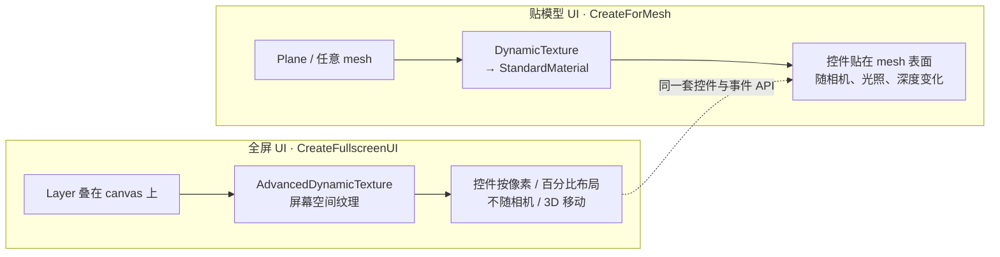

import { Canvas, Controls, Meta } from '@storybook/addon-docs/blocks';
import * as Stories from './gui-system.stories';

<Meta of={Stories} name="Docs" />

# GUI

`@babylonjs/gui` 是 Babylon.js 自带的 UI 系统。它不写在 HTML DOM 里，而是画在 WebGL 纹理上：控件和 3D 场景共用同一个 canvas、同一套坐标空间，因此能跟着相机进入 WebXR、能贴在 3D 物体表面、不会被 DOM 层级或 iframe 裁切。凡是 HUD、菜单、调试面板、3D 标牌、世界内按钮——不想到用 HTML 叠层时，先想到它。

所有 GUI 内容由 `AdvancedDynamicTexture` 承载，分两种落地方式：**全屏 UI** 用 `CreateFullscreenUI` 盖在 canvas 上（屏幕空间，不随相机移动，适合 HUD/菜单）；**贴模型 UI** 用 `CreateForMesh` 贴在一个 mesh 表面（世界空间，受光照、深度、遮挡影响，适合 3D 标牌/按钮）。两种方式共享同一套控件、容器和事件 API——区别只在"纹理画在哪里"。



| 对象 / API | 默认 / 常用 | 回查要点 |
| --- | --- | --- |
| `@babylonjs/gui` | 独立包，`import { ... } from '@babylonjs/gui'` | 与 `@babylonjs/core` 同版本配套；peer 依赖是 core |
| `AdvancedDynamicTexture.CreateFullscreenUI(name, foreground?, scene?)` | `foreground=true`（盖在 3D 之上） | 全屏屏幕空间；内部创建一个 `Layer`；不随相机移动 |
| `AdvancedDynamicTexture.CreateForMesh(mesh, width?, height?, supportPointerMove?)` | `width/height` 是纹理像素；`supportPointerMove=false` | 贴在 mesh 上；生成 `StandardMaterial` 赋给 mesh；随相机 / 光照 / 深度变化 |
| `adt.addControl(ctrl)` / `removeControl(ctrl)` | 返回 ADT 自身（可链式） | 顶层控件挂到 ADT；`adt.rootContainer` 是隐含根容器 |
| `adt.dispose()` | 释放纹理与 fullscreen layer | `scene.dispose()` 会顺带清理 layer；显式 dispose 更清晰 |
| `StackPanel` | `isVertical=true`、`spacing=0` | 纵 / 横向线性布局；不设堆叠方向尺寸时按子控件自适应 |
| `Grid` | `addRowDefinition(h, isPixel?)`、`addColumnDefinition(w, isPixel?)` | `addControl(ctrl, row, col)` 放入指定格子 |
| `Rectangle` | `thickness=1`、`cornerRadius=0`、`background` 空 | 常作面板背景壳；嵌套 `StackPanel` 做布局 |
| `Control.HORIZONTAL_ALIGNMENT_*` | `LEFT` / `CENTER` / `RIGHT`（数字常量） | 控件在父级可用空间内的水平对齐 |
| `Control.VERTICAL_ALIGNMENT_*` | `TOP` / `CENTER` / `BOTTOM` | 垂直方向对齐 |
| `width` / `height` / `padding*` / `top` / `left` | `string \| number` | `'260px'` 像素、`'50%'` 百分比；裸数字按像素 |
| `Button.CreateSimpleButton(name, text)` | 返回带默认 padding 的按钮 | `onPointerClickObservable` 接点击 |
| `Slider` | `minimum=0`、`maximum=100`、`value=0`、`step=1`、`isVertical=false` | `onValueChangedObservable: Observable<number>` |
| `TextBlock` | `text=''`、`fontSize` 继承 | `textHorizontalAlignment/VerticalAlignment` 控制文字在控件内的对齐 |

## 两种 GUI：全屏与贴模型

GUI 的第一道选择是"纹理画在哪里"。`AdvancedDynamicTexture` 提供两个工厂方法，决定了 UI 是屏幕空间的 HUD 还是世界空间的标牌。两者之后的控件、容器、事件代码完全一样——换一个工厂方法即可在 HUD 与世界 UI 之间切换。

### 全屏 UI：CreateFullscreenUI

`CreateFullscreenUI(name, foreground?, scene?)` 在 canvas 上盖一张屏幕空间纹理，控件按 canvas 像素 / 百分比布局，相机怎么动它都不动。`foreground` 默认 `true`，纹理画在 3D 之上；置 `false` 画在 3D 之下（背景板）。它内部创建一个 `Layer`，需要时通过 `adt.layer.layerMask` 参与多相机渲染。

```ts
import { AdvancedDynamicTexture, Button, Control, StackPanel } from '@babylonjs/gui';

const gui = AdvancedDynamicTexture.CreateFullscreenUI('gui', true, scene);

const panel = new StackPanel('panel');
panel.width = '240px';
panel.horizontalAlignment = Control.HORIZONTAL_ALIGNMENT_LEFT;
panel.verticalAlignment = Control.VERTICAL_ALIGNMENT_TOP;

const btn = Button.CreateSimpleButton('btn', '开始');
btn.width = '200px';
btn.height = '40px';
panel.addControl(btn);

gui.addControl(panel); // 顶层控件挂到 ADT
```

全屏 UI 的指针交互直接读 canvas 指针，开销小；可交互控件（按钮、滑块）默认 `isPointerBlocker=true` 命中后接管事件，相机不会响应同一次拖拽——透明区域则穿透给相机。

### 贴模型 UI：CreateForMesh

`CreateForMesh(mesh, width?, height?, supportPointerMove?)` 把纹理贴在一个 mesh 表面。`width`/`height` 是**纹理的像素分辨率**（UI 自己的坐标空间），与 mesh 的世界尺寸无关；Babylon 会创建 `StandardMaterial`、把 ADT 设为 `emissiveTexture` 并赋给 mesh。于是 UI 像普通 3D 表面一样被光照、做深度测试、可被遮挡，相机走近还能看清细节。

```ts
import { MeshBuilder } from '@babylonjs/core';
import { AdvancedDynamicTexture, TextBlock } from '@babylonjs/gui';

const sign = MeshBuilder.CreatePlane('sign', { width: 2, height: 1 }, scene);
const gui = AdvancedDynamicTexture.CreateForMesh(sign, 1024, 512);

const label = new TextBlock('label', 'Hello');
label.fontSize = 96;
label.color = 'white';
gui.addControl(label);
```

贴模型 UI 的指针交互走 `scene.pick` 拾取 mesh，开销比全屏大；要支持 hover 就把第 4 参 `supportPointerMove` 设 `true`。WebXR 里它是"存在于世界中"的 UI——可以绕到背面、被物体挡住、走过去触达。

| 维度 | `CreateFullscreenUI` | `CreateForMesh` |
| --- | --- | --- |
| 面向 | HUD、菜单、调试面板、弹窗 | 标牌、3D 按钮、世界内 UI |
| 坐标系 | canvas 像素 / 百分比（屏幕空间） | mesh 世界空间（受相机 / 光照 / 深度影响） |
| 渲染载体 | `Layer`（叠在 3D 之上 / 之下） | `StandardMaterial` 的 `emissiveTexture` |
| 指针交互 | 直接读 canvas 指针（轻） | 走 `scene.pick`（较重） |
| WebXR | 自动跟随相机（HUD 体验一致） | 存在于世界中（可被遮挡、可走近） |

## 容器：StackPanel 与 Grid

容器持有控件并负责布局。所有容器都继承 `Container`，共享 `addControl(ctrl)` / `removeControl(ctrl)`，并能嵌套——典型结构是一个带底色的 `Rectangle` 壳里再装一个做布局的 `StackPanel`。

```ts
import { Grid, Rectangle, StackPanel } from '@babylonjs/gui';

// 线性布局：纵向（默认）或横向；不设堆叠方向尺寸时按子控件自适应。
const panel = new StackPanel('panel');
panel.isVertical = true;
panel.spacing = 8;          // 子控件间距（像素）
panel.width = '260px';      // 设宽度，否则横向撑满父级
panel.background = '#1e293b';

// 网格布局：先定义行列，再按 (row, col) 放入。
const grid = new Grid('grid');
grid.addColumnDefinition(0.5);     // 比例（同行的列比例之和通常 = 1）
grid.addColumnDefinition(0.5);
grid.addRowDefinition(40, true);   // 第二参 isPixel=true → 固定 40px
grid.addRowDefinition(1.0);        // 比例 1.0，吃掉剩余空间
grid.addControl(ctrl, 0, 1);       // 放到第 0 行、第 1 列

// 嵌套：Rectangle 做圆角底壳，StackPanel 做内部布局。
const shell = new Rectangle('shell');
shell.width = '280px';
shell.background = '#1e293b';
shell.cornerRadius = 10;
shell.addControl(panel);
```

`addControl` 返回容器自身，可以链式。StackPanel 在不设堆叠方向尺寸（纵向时不设 `height`）时会沿堆叠方向自适应子控件总尺寸——做 HUD 面板时常用这一点让面板"包住"内容。Grid 的 `addRowDefinition(size, isPixel)` 第二参为 `false`（默认）时 `size` 是比例，为 `true` 时是像素。需要滚动内容时改用 `ScrollViewer`，它内部也是容器，用法相同。

## 控件：文字、按钮、滑块

所有控件都继承 `Control`，因此共享对齐、内边距、尺寸和指针 observable。本节讲最常用的三个；其余控件用覆盖表回查。

```ts
import { Button, Control, Slider, TextBlock } from '@babylonjs/gui';

// 文字：只显示，不响应点击。每帧可以改 text 反映最新状态。
const score = new TextBlock('score', '分数：0');
score.color = '#e2e8f0';
score.fontSize = 18;
score.textHorizontalAlignment = Control.HORIZONTAL_ALIGNMENT_CENTER;
// 渲染循环里：score.text = `分数：${n}`;

// 按钮：CreateSimpleButton 是带默认 padding 的工厂；它本身是 Rectangle 子类，
// 所以 background / cornerRadius / thickness 都能用。
const start = Button.CreateSimpleButton('start', '开始');
start.width = '200px';
start.height = '40px';
start.color = 'white';
start.background = '#2563eb';
start.cornerRadius = 6;
start.onPointerClickObservable.add(() => { /* 开始 */ });
// 还有 CreateImageOnlyButton(name, url)、CreateImageWithButton(name, text, url)。

// 滑块：minimum/maximum/value/step/onValueChangedObservable 都在 BaseSlider 上。
const volume = new Slider('vol');
volume.minimum = 0;
volume.maximum = 1;
volume.value = 0.5;
volume.step = 0.01;
volume.width = '200px';
volume.height = '22px';
volume.barColor = '#38bdf8';
volume.onValueChangedObservable.add((v: number) => { /* v 是当前值 */ });
```

其它控件（覆盖表，关键属性与事件已核对 TypeDoc）：

| 控件 | 关键属性 | 事件 / Observable |
| --- | --- | --- |
| `Image` | `source`、`stretch`（`Image.STRETCH_FILL=1` / `UNIFORM=2` / `EXTEND=3`）、`autoScale` | `onImageLoadedObservable` |
| `Checkbox` | `isChecked`、`color`、`background`、`checkSizeRatio` | `onIsCheckedChangedObservable: Observable<boolean>` |
| `RadioButton` | `isChecked`、`group`（同名 group 内互斥） | `onIsCheckedChangedObservable`；批量构建用 `RadioGroup` / `CheckboxGroup` / `SelectorGroup` 辅助类 |
| `InputText` | `text`、`placeholderText`、`maxLength`、`color`、`background` | `onTextChangedObservable`、`onFocusObservable`、`onBlurObservable`、`onBeforeKeyAddObservable`（可拦截输入）；移动端自动弹 `VirtualKeyboard` |
| `ColorPicker` | `value: Color3`、`width`、`height` | `onValueChangedObservable: Observable<Color3>` |

> `@babylonjs/gui` **没有内置的 `SelectBox` / 下拉框类**。单选 / 多选 UI 用上表的 `RadioGroup` / `CheckboxGroup` / `SelectorGroup` 辅助类，或用一个 `Button` + `ScrollViewer` 列表手动组合。

## 锚定与尺寸

控件的位置由三层信息决定：父容器给的"可用空间"、控件在其中的 `horizontalAlignment` / `verticalAlignment`、以及 `top` / `left` / `padding*` 偏移。`width` / `height` 决定控件占多大。

```ts
ctrl.horizontalAlignment = Control.HORIZONTAL_ALIGNMENT_CENTER; // LEFT / CENTER / RIGHT
ctrl.verticalAlignment = Control.VERTICAL_ALIGNMENT_TOP;        // TOP / CENTER / BOTTOM
ctrl.width = '260px';   // 像素
ctrl.height = '50%';    // 父级高度的 50%
ctrl.paddingLeft = '12px';
ctrl.paddingTop = 8;    // 裸数字也按像素
ctrl.top = '20px';      // 相对 alignment 决定的位置再向下偏移
ctrl.left = '10px';     // 相对 alignment 决定的位置再向右偏移
```

单位规则：字符串带后缀（`'260px'`、`'50%'`）或裸数字（按像素）；百分比相对父级的对应维度。`padding*` 是控件内容相对自身边缘的内边距（容器则内嵌子控件），`top` / `left` 是控件相对 alignment 锚点的额外偏移。

最常踩的坑是"我的按钮铺满了整个面板"：StackPanel 不设 `width` 时会横向撑满父级，其子控件又跟着撑满。给 StackPanel 和它的子控件**都显式设 `width`**，布局才符合预期。`isHitTestVisible`（默认 `true`）控制控件是否参与命中检测——纯装饰控件设 `false`，让指针穿透到下层。

## 事件：在 Observable 上响应控件

GUI 事件用的是 5.1 [Observables 与事件](?path=/docs/observables-and-events--docs) 讲过的同一套模型——`Observable<T>.add(cb)` 返回 `Observer`，不再需要时 `remove(observer)`，或直接 dispose 控件 / ADT 释放全部订阅。每个交互控件都把事件挂在最相关的 observable 上：按钮用点击，滑块 / 选色器用值变化，所有控件共享一组指针 observable。

```ts
// 点击：Observable<Vector2WithInfo>，回调参数带命中坐标
btn.onPointerClickObservable.add((coords) => { /* coords.x, coords.y */ });

// 值变化：Observable<number>（Slider）、Observable<Color3>（ColorPicker）、Observable<boolean>（Checkbox）
slider.onValueChangedObservable.add((v) => { volume = v; });

// 指针进 / 出（每个 Control 都有）：做 hover 高亮
btn.onPointerEnterObservable.add(() => { btn.background = '#1d4ed8'; });
btn.onPointerOutObservable.add(() => { btn.background = '#2563eb'; });
```

`Control` 上的指针 observable：`onPointerDownObservable`、`onPointerUpObservable`、`onPointerMoveObservable`、`onPointerClickObservable`、`onPointerEnterObservable`、`onPointerOutObservable`。订阅与清理纪律和 5.1 完全一致：保留 `Observer` 引用，或用 `adt.dispose()` / `control.dispose()` 一次性释放——scene 不销毁、面板频繁挂卸时（编辑器、SPA 路由切换）漏 dispose 是常见泄漏源。

下面的范例把容器、控件、锚定和事件拼到一起：一块全屏 UI 面板（`StackPanel` + `TextBlock` + `Button` + `Slider` + `TextBlock`），点击按钮切换 3D 盒子的显隐、拖动滑块改变盒子角速度，面板内文字与下方读数同步反映 GUI 事件落到 3D 的结果；用 Controls 的「面板水平锚点」切换面板在 canvas 的左 / 中 / 右对齐，演示锚定。

<Canvas of={Stories.Gui} />

<Controls of={Stories.Gui} />

| 读者操作 | 可观察证据 |
| --- | --- |
| 点击「切换盒子显隐」按钮 | 盒子显隐切换；读数「点击次数」+1；面板内状态文字同步 |
| 拖动滑块 | 盒子旋转快慢随角速度变化；读数「滑块值 / 盒子角速度」同步；面板内文字显示当前角速度 |
| 滑块拖到 0 | 盒子冻结；读数「盒子角速度」变 0.00，但渲染循环仍在跑（读数持续刷新） |
| 切换 Controls 的「面板水平锚点」 | 整块面板在 canvas 左 / 中 / 右重新对齐——`horizontalAlignment` 立即生效 |
| 拖动 canvas 透明区域 | 相机绕目标旋转——证明全屏 GUI 只在控件上拦截指针，透明区域穿透给相机 |
| 打开 Show code | 看到该 Canvas 实际执行的 `example.ts` |

## 最佳实践

- HUD / 菜单 / 调试面板用 `CreateFullscreenUI`（屏幕空间、不随相机移动、指针开销小）；3D 标牌 / 世界内按钮 / WebXR 可触达 UI 用 `CreateForMesh`（受光照、可遮挡、可走近）。两者之后的控件与事件代码一致，换工厂方法即可切换。
- 给 `StackPanel` 和它的子控件**都显式设 `width`**，否则面板和子控件会层层撑满父级，按钮变成整条横条。
- 贴模型 UI 的纹理分辨率（`CreateForMesh` 的 `width/height`）独立于 mesh 世界尺寸——文字小就看不清，按"需要多少 UI 像素"给，常用 512 / 1024 / 2048。
- GUI 事件用 5.1 的订阅纪律：保留 `Observer` 引用以便 `remove`；scene 不销毁、面板频繁挂卸时（SPA、编辑器、热重载）记得 `control.dispose()` 或 `adt.dispose()`，否则回调持有的闭包对象释放不掉。
- 用 `onPointerEnterObservable` / `onPointerOutObservable` 做 hover 高亮比每帧 `onPointerMoveObservable` + 命中判断更省、更直观。
- 全屏 UI 的可交互控件默认 `isPointerBlocker=true`，命中后接管事件、相机不响应同一次拖拽；纯装饰控件设 `isHitTestVisible=false` 让指针穿透。

## 常见问题

- 为什么按钮铺满了整个面板？
  `StackPanel` 不设 `width` 时横向撑满父级，子控件又跟着撑满。给 StackPanel 设 `width`，并给每个子控件也设 `width`（通常比面板窄一点留出 padding）。
- 全屏 UI 的面板挡住了相机拖拽，怎么办？
  可交互控件（按钮 / 滑块）默认拦截指针是预期行为；如果你想让相机在面板的**透明区域**也能拖拽，确保面板的 `background` 透明或把面板设 `isHitTestVisible=false`（此时面板本身不接收事件，但子控件仍各自接收）。要让整块面板（含背景）都挡住相机，反而要给承载容器设 `isPointerBlocker=true`。
- 贴模型 UI 上的文字很糊？
  `CreateForMesh` 的 `width/height` 是纹理像素，不是世界尺寸。文字糊说明纹理分辨率不够——加大这两个值（如 1024×512），或开启 ADT 的超采样（`adt.renderScale`）。
- 滑块 / 选色器的回调签名是什么？
  `Slider.onValueChangedObservable` 是 `Observable<number>`，`ColorPicker` 是 `Observable<Color3>`，`Checkbox` / `RadioButton` 是 `Observable<boolean>`，`InputText.onTextChangedObservable` 是 `Observable<InputText>`（回调参数就是控件本身，读它的 `.text`）。
- 没有 `SelectBox` / 下拉框吗？
  `@babylonjs/gui` 没有内置下拉框类。单选 / 多选用 `RadioGroup` / `CheckboxGroup` / `SelectorGroup` 辅助类，或用一个按钮 + `ScrollViewer` 列表手动拼。
- 全屏 UI 在多相机场景里看不见？
  `CreateFullscreenUI` 内部创建的 `Layer` 有 `layerMask`，相机只渲染 mask 匹配的 layer。检查 `adt.layer.layerMask` 与相机的 `layerMask` 是否有交集。
- ADT 上的控件显示不出来？
  顶层控件必须用 `adt.addControl(ctrl)` 挂到 ADT（或挂到 `adt.rootContainer`）；只 `new` 出来不挂是不会渲染的。容器内的子控件则用 `container.addControl(child)`。

## 总结回顾

摘要：

`@babylonjs/gui` 把 UI 画在 WebGL 纹理上，与 3D 场景共用 canvas 和坐标空间。纹理由 `AdvancedDynamicTexture` 承载，分两种落地：`CreateFullscreenUI(name, foreground?=true, scene?)` 在 canvas 上盖屏幕空间纹理（HUD / 菜单，不随相机移动，可交互控件默认拦截指针），`CreateForMesh(mesh, width?, height?, supportPointerMove?)` 贴在 mesh 表面（世界 UI，受光照 / 深度 / 遮挡，指针走 `scene.pick`）。容器 `StackPanel`（纵 / 横向线性，不设堆叠方向尺寸时自适应）、`Grid`（按比例或像素定义行列）、`Rectangle`（带底色 / 圆角的面板壳）负责布局并相互嵌套。控件都继承 `Control`，共享 `horizontalAlignment` / `verticalAlignment`（`Control.HORIZONTAL_ALIGNMENT_LEFT/CENTER/RIGHT` 等）、`width` / `height`（`'260px'` / `'50%'` / 裸数字按像素）、`padding*` / `top` / `left`。事件用 5.1 的 Observable 模型：`Button.onPointerClickObservable`、`Slider.onValueChangedObservable: Observable<number>`、`ColorPicker` 的 `Observable<Color3>`、`Checkbox` 的 `Observable<boolean>`，以及所有 Control 共享的 `onPointerEnter/Out/Down/Up/MoveObservable`；订阅返回 `Observer`，清理用 `remove` 或 `dispose`。`@babylonjs/gui` 没有内置下拉框，选择 UI 用 `RadioGroup` / `CheckboxGroup` 辅助类或手动组合。

一句话：

> GUI 画在 WebGL 纹理上、与 3D 同坐标空间——全屏用 `CreateFullscreenUI`、贴模型用 `CreateForMesh`，之后用同一套容器、控件（对齐 / 尺寸 / 内边距）和 Observable 事件。

知识要点：

- 全屏 UI 与贴模型 UI 各自画在哪里？坐标系、渲染载体、指针开销有什么区别？
- `CreateFullscreenUI` 的 `foreground` 参数和内部 `Layer` 各决定什么？
- `StackPanel` 不设 `width` 或堆叠方向尺寸时会发生什么？怎么解决"按钮铺满面板"？
- `Control.HORIZONTAL_ALIGNMENT_*` / `VERTICAL_ALIGNMENT_*` 决定什么？`padding*` 与 `top` / `left` 有什么不同？
- `width` / `height` 接受哪些单位？百分比相对什么？
- 按钮、滑块、选色器、复选框各自的事件 observable 类型是什么？
- 全屏 GUI 的可交互控件如何避免触发相机拖拽？纯装饰控件怎么让指针穿透？
- 贴模型 UI 的文字糊了应该调哪个参数？为什么？

## 参考资料

- [Babylon.js Features：GUI（控件、容器、ADT 与示例）](https://doc.babylonjs.com/features/featuresDeepDive/gui)
- [Babylon.js Features：GUI 创建方式（CreateFullscreenUI / CreateForMesh）](https://doc.babylonjs.com/features/featuresDeepDive/gui/gui)
- [Babylon.js TypeDoc：AdvancedDynamicTexture](https://doc.babylonjs.com/typedoc/classes/BABYLON.AdvancedDynamicTexture)
- [Babylon.js TypeDoc：Control（对齐常量、padding、pointer observables）](https://doc.babylonjs.com/typedoc/classes/BABYLON.GUI.Control)
- [Babylon.js TypeDoc：StackPanel / Grid / Rectangle](https://doc.babylonjs.com/typedoc/modules/BABYLON.GUI)
- [Babylon.js API Reference (TypeDoc)](https://doc.babylonjs.com/typedoc/)
