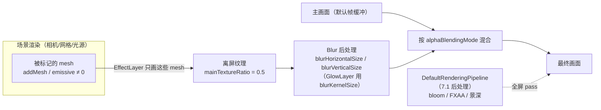

import { Canvas, Controls, Meta } from '@storybook/addon-docs/blocks';
import * as Stories from './highlight-and-glow-layers.stories';

<Meta of={Stories} name="Docs" />

# 图层与高亮

Babylon.js 的 `HighlightLayer` 与 `GlowLayer` 都继承自 `EffectLayer`：把"被注册到本层的 mesh"单独画到一张离屏纹理，做一次水平 + 垂直 blur，再按混合模式叠回主画面。它是一套**独立渲染层**机制，不进 7.1 [后处理](?path=/docs/post-processing--docs) 那条全屏 pass 链；目标也由 mesh 列表决定，不靠材质或屏幕阈值。最常见的用法是配合 5.2 [指针与拾取](?path=/docs/pointer-input-and-picking--docs) 做"选中反馈"——拾取决定选谁，Layer 决定怎么显示。

先建立三条判断，后面的 API 才不容易混：

- **Layer 是独立渲染层，不是全屏后处理。** EffectLayer 针对注册过的特定 mesh，离屏纹理只画这些 mesh；DefaultRenderingPipeline 的 bloom / FXAA 是全屏 pass，作用整帧。两者可以共存，互不替代。
- **目标由 mesh 列表决定，不依赖材质。** `HighlightLayer` 用 `addMesh(mesh, color)` 指定描边对象；`GlowLayer` 默认让所有 emissive 不为黑的 mesh 发光，用 `addIncludedOnlyMesh(mesh)` 限制到白名单。两者都按 mesh 注册，不改材质——这正是 HighlightLayer 能做"选中描边"而不污染材质的原因。
- **GlowLayer 只放大 emissive，HighlightLayer 只画轮廓。** GlowLayer 读 `material.emissiveColor` / `emissiveTexture`，emissive 为 0 的 mesh 不发光；HighlightLayer 给任何 mesh（含 PBR、Node Material）都能加描边。选哪种取决于"选中反馈想要描边还是发光"。



| 输入或概念 | 默认 / 常用 | 回查要点 |
| --- | --- | --- |
| `new HighlightLayer(name, scene?, options?)` | `options` 全部可选 | 描边层；`scene` 可省（用默认场景）；构造时设 `isStroke`、`renderingGroupId`，运行时改 `blurHorizontalSize` / `blurVerticalSize` |
| `highlight.addMesh(mesh, color, glowEmissiveOnly?)` | `glowEmissiveOnly = false` | 给 mesh 加指定色描边；返回 `void`；同一 mesh 多次 add 用不同色会叠加多色轮廓 |
| `highlight.removeMesh(mesh)` / `highlight.removeAllMeshes()` | — | 移除单个 / 全部描边目标（API 是 `removeAllMeshes`，没有 `removeMeshes`） |
| `highlight.hasMesh(mesh)` | `boolean` | 该 mesh 是否在描边列表里 |
| `highlight.blurHorizontalSize` / `blurVerticalSize` | `1.0` | 描边模糊核；越大越散越柔，`0` 接近实线；运行时 get/set |
| `highlight.outerGlow` / `highlight.innerGlow` | `true` / `true` | 外缘 / 内缘描边开关；`outerGlow = false` 描边只出现在 mesh 内侧 |
| 构造选项 `isStroke` | `false` | `true` = 实心描边（不走 blur）；只能在 `new` 时设，运行时切不了 |
| `highlight.addExcludedMesh(mesh)` / `removeExcludedMesh(mesh)` | — | 永远不描边的排除表，用于背景几何 |
| `new GlowLayer(name, scene?, options?)` | `options` 全部可选 | 发光层；构造时设 `blurKernelSize`、`excludeByDefault`、`renderingGroupId` |
| `glow.intensity` | `1.0` | 全局发光强度；运行时 get/set |
| `glow.addIncludedOnlyMesh(mesh)` / `removeIncludedOnlyMesh(mesh)` | — | 白名单：列表非空后只让列出的 mesh 发光 |
| `glow.addExcludedMesh(mesh)` / `removeExcludedMesh(mesh)` | — | 黑名单：默认全部发光，排除个别；与白名单不要混用 |
| `glow.referenceMeshToUseItsOwnMaterial(mesh)` | — | 让非 emissive 材质（如 PBR）按自身材质参与发光 |
| `glow.customEmissiveColorSelector` / `customEmissiveTextureSelector` | `null` | 逐 mesh 回调，覆盖默认的 emissive 读取 |
| 构造选项 `excludeByDefault` | `false` | `true` = 默认排除所有 mesh，需手动 `addIncludedOnlyMesh` |
| 构造选项 `blurKernelSize` | `32` | GlowLayer 的 blur 核大小，影响光晕扩散 |
| `material.emissiveColor` / `emissiveTexture` | 黑色 / null | GlowLayer 的"光源"；两者都为空时 mesh 不发光 |
| `layer.isEnabled` | `true` | 整层开关（EffectLayer 基类）；`false` 停止离屏渲染 |
| `layer.setEffectIntensity(mesh, value)` / `getEffectIntensity(mesh)` | `1` | 单 mesh 的强度倍数，覆盖全局 intensity（EffectLayer 基类） |

## Layer 机制：独立渲染层

`EffectLayer` 是 `HighlightLayer` 与 `GlowLayer` 的共同基类，工作方式固定为四步：

1. 维护一张离屏纹理（默认尺寸 = 主画面 × `mainTextureRatio`，默认 `0.5`），称为 main texture。
2. 每帧把"被注册到本层的 mesh"单独画一遍到这张纹理——其他 mesh 不参与。
3. 对 main texture 做一次水平 + 垂直 blur（HighlightLayer 用 `blurHorizontalSize` / `blurVerticalSize`，GlowLayer 用 `blurKernelSize`）。
4. 按 `alphaBlendingMode` 把模糊后的纹理混合回主画面——`HighlightLayer` 默认 `ALPHA_COMBINE`（按 alpha 合成），`GlowLayer` 默认 `ALPHA_ADD`（叠加，越叠越亮）。

这套机制和 7.1 [后处理](?path=/docs/post-processing--docs) 的 `DefaultRenderingPipeline` 是两套独立系统，不是同一条链上的不同 pass：

| 维度 | EffectLayer（本课） | DefaultRenderingPipeline（7.1） |
| --- | --- | --- |
| 作用对象 | 注册到层的**特定 mesh** | **整个帧**（全屏 pass） |
| 触发方式 | `addMesh` / emissive 自动 | `pipeline.bloomEnabled = true` 等 |
| 混合 | 离屏纹理混合回主画面 | pass 链依次读写双缓冲，链尾 OutputPass |
| 典型用途 | 选中描边、emissive 发光 | bloom、FXAA、景深、SSAO |
| 代价 | 离屏纹理 + blur，与注册 mesh 数相关 | 每多一个 pass 多一次全屏绘制 |

两者可以共存：Layer 在主画面渲染阶段把效果混合回帧，后处理链路之后再把整帧过一遍 pass。Inspector 的 "Layers" 面板可以看到当前场景的所有 EffectLayer，调试时直接在这里开关。

构造选项 `renderingGroupId`（默认 `-1`）控制层的渲染顺序——值大的层在值小的之后混合。多个 Layer 共存时按它排序；想强制某个层盖在另一个之上就给它更大的 `renderingGroupId`。

### HighlightLayer：选中描边

最小表达：

```ts
import { HighlightLayer, Color3 } from '@babylonjs/core';

const highlight = new HighlightLayer('highlight', scene);
highlight.addMesh(selectedMesh, new Color3(1, 0.82, 0.2)); // 黄色描边

// 取消单个目标的描边
highlight.removeMesh(selectedMesh);
// 或一次性清空所有描边目标
highlight.removeAllMeshes();
```

- **`addMesh(mesh, color, glowEmissiveOnly = false)`**：给 mesh 加指定色的描边。同一个 mesh 多次 `addMesh` 用不同色会叠加多色轮廓——可用作"普通选中黄色、危险选中红色"的视觉编码。`glowEmissiveOnly = true` 时只描材质的 emissive 部分。
- **`removeMesh(mesh)` / `removeAllMeshes()`**：移除单个 / 全部描边目标。注意 API 是 `removeAllMeshes`，没有 `removeMeshes`。
- **`hasMesh(mesh)`**：查询该 mesh 是否在描边列表里。
- **`addExcludedMesh(mesh)`**：把 mesh 列入排除表，它永远不会被描边——常用于地面、天空盒，避免背景几何意外沾上描边。

描边形态由两组属性控制：

| 属性 | 默认 | 影响 |
| --- | --- | --- |
| `blurHorizontalSize` / `blurVerticalSize` | `1.0` | 模糊核大小；越大描边越散越柔，`0` 接近实线；运行时 get/set |
| `outerGlow` / `innerGlow` | `true` / `true` | 外缘 / 内缘描边开关；`outerGlow = false` 描边只出现在 mesh 内侧 |
| 构造选项 `isStroke` | `false` | `true` = 实心描边（不走 blur，硬边轮廓）；只能在 `new` 时设 |

`blurHorizontalSize` 与 `blurVerticalSize` 是运行时 get/set 属性——直接改 `_horizontalBlurPostprocess.kernel`，下一帧就生效，可在交互中实时调整。`isStroke` 是构造期 define，运行时切不了，要换"实心 vs 模糊"两种风格需销毁重建层。

> HighlightLayer 不依赖材质——给任何 mesh（含 PBR、Node Material）都能加描边。这是它做"选中反馈"的最大优势：不用为了高亮克隆 material，回避了 5.2 课里"共享 material 单独换 emissive 必须克隆"的折中。

### GlowLayer：emissive 发光

最小表达：

```ts
import { GlowLayer } from '@babylonjs/core';

const glow = new GlowLayer('glow', scene);
glow.intensity = 1.0; // 默认 1.0
// 默认让所有 emissive 不为 0 的 mesh 发光。
```

GlowLayer 的"光源"是材质的 emissive 通道。每帧它对每个 mesh 读 `material.emissiveTexture` 与 `material.emissiveColor`：

- 有 `emissiveTexture`：按贴图参与发光（`texture.level` 缩放强度）；
- `emissiveColor` 不为黑：按颜色发光，最终强度 ≈ `emissiveColor × textureLevel × material.emissiveIntensity`（StandardMaterial 的 `emissiveColor` 是 `Color3`，`emissiveIntensity` 默认 `1`）；
- 两者都为空：回退到 neutralColor（黑），即**不发光**。

所以纯 diffuse 材质不会发光——这是 GlowLayer 与 HighlightLayer 的根本差别，也是"为什么我加了 GlowLayer 却没反应"的常见原因。

控制发光范围有两套互斥逻辑：

```ts
// 黑名单：默认全部发光，排除个别 mesh（地面、天空盒）
glow.addExcludedMesh(groundMesh);

// 白名单：只让列出的 mesh 发光（列表非空后，未列入的不发光）
glow.addIncludedOnlyMesh(selectedMesh);
glow.removeIncludedOnlyMesh(selectedMesh);
```

`addIncludedOnlyMesh`（白名单）与 `addExcludedMesh`（黑名单）不要混用——白名单一旦非空，引擎只看白名单，黑名单行为变得难预测。选中反馈场景常用白名单：把"当前选中"放进 `addIncludedOnlyMesh`，切换选中就是 `removeIncludedOnlyMesh(old) + addIncludedOnlyMesh(new)`。

构造选项：

| 选项 | 默认 | 影响 |
| --- | --- | --- |
| `blurKernelSize` | `32` | blur 核大小，影响光晕扩散半径 |
| `excludeByDefault` | `false` | `true` = 默认排除所有 mesh，必须 `addIncludedOnlyMesh` 才发光；适合场景里 emissive 物体很多、只想让少数发光 |
| `mainTextureRatio` | `0.5` | 离屏纹理相对主画面的尺寸比；调小省显存，调小过多会让发光糊 |
| `ldrMerge` | `false` | LDR 颜色合并开关，影响 tone mapping 后的发光合成 |

> **让非 emissive 材质也发光。** PBRMaterial 没有显著 emissive 时，调 `glow.referenceMeshToUseItsOwnMaterial(mesh)` 让该 mesh 用自身材质（高 baseColor 或强 reflection）参与发光计算。需要更细的逐 mesh 控制时用 `customEmissiveColorSelector`（签名 `(mesh, subMesh, material, result: Color4) => void`）或 `customEmissiveTextureSelector`（`(mesh, subMesh, material) => Texture`）回调，绕过默认的 emissive 读取。

## 选中反馈：拾取 + Layer

5.2 [指针与拾取](?path=/docs/pointer-input-and-picking--docs) 解决"选中了谁"——`pickInfo.pickedMesh` 给出目标。Layer 解决"选中后怎么显示"。两者解耦：拾取写状态，Layer 读状态。

三种常见选中反馈的取舍：

| 反馈方式 | 实现 | 优点 | 限制 |
| --- | --- | --- | --- |
| `emissiveColor` 改色 | 选中时 `material.emissiveColor = hoverColor` | 零开销、不引入层 | 共享 material 要克隆；只改色无轮廓 |
| **HighlightLayer 描边** | `highlight.addMesh(picked, color)` | 不改材质、轮廓清晰、多色叠加 | 离屏纹理 + blur 有开销 |
| GlowLayer 发光 | `glow.addIncludedOnlyMesh(picked)` | 自发光物体视觉冲击强 | 只对 emissive 有效；PBR 需 `referenceMeshToUseItsOwnMaterial` |

切换选中目标的典型流程——先清空再写入，避免叠加旧选中：

```ts
scene.onPointerObservable.add((pi) => {
  if (pi.type !== PointerEventTypes.POINTERPICK) return;
  const info = pi.pickInfo;
  highlight.removeAllMeshes();
  if (info?.hit && info.pickedMesh) {
    highlight.addMesh(info.pickedMesh, new Color3(1, 0.82, 0.2));
  }
});
```

下方范例把两种 Layer 摆在一起对比。`mode` 切换"关 / HighlightLayer / GlowLayer"，`target` 模拟拾取选中的目标，`blurSize` 控制 HighlightLayer 的模糊核，`intensity` 控制 GlowLayer 的发光强度。

<Canvas of={Stories.Highlight} />

<Controls of={Stories.Highlight} />

| 读者操作 | 可观察证据 |
| --- | --- |
| mode = HighlightLayer，target = box | box 出现黄色描边轮廓，另外两个 mesh 不受影响；readout「活跃层」= `HighlightLayer` |
| 调 `blur 尺寸` 从 `0` → `2` | 描边从接近实线变粗、变散、变柔（blur 核放大） |
| 切 target 到 sphere / torus | 描边跟随目标移动到对应 mesh |
| mode = GlowLayer，target = sphere | 只有 sphere 发光，另外两个 emissive mesh 不发光（因为 `addIncludedOnlyMesh` 白名单） |
| 调 `发光强度` 从 `0` → `2` | sphere 光晕从无到强（`intensity` = 0 等于不发光） |
| mode = GlowLayer，切 target | 发光对象跟随切换；旧目标停止发光，新目标开始发光 |
| mode = 关 | 两层 `isEnabled = false`，画面回到基础渲染，无描边无发光 |
| 拖拽 canvas 旋转相机 | 描边始终贴着 mesh 轮廓；发光在 emissive 表面弥漫——两者随视角变化 |

## 最佳实践

- 选中反馈优先用 HighlightLayer——不改材质、轮廓清晰、可多色叠加；共享 material 时不必为高亮克隆。
- 切换描边目标用 `removeAllMeshes() + addMesh(new)`，不要反复 `new HighlightLayer`；Layer 是昂贵资源，构造一次复用，靠 `addMesh` / `removeMesh` 切状态。
- GlowLayer 的范围控制二选一：白名单（`addIncludedOnlyMesh`）或黑名单（`addExcludedMesh`），不要混用——混用时白名单优先，行为难预测。
- 全局 `glow.intensity` 控整体亮度；要单个 mesh 更亮用 `setEffectIntensity(mesh, value)`（EffectLayer 基类，per-mesh 倍数，覆盖全局值）。
- 不需要层时 `layer.isEnabled = false`，比 `removeAllMeshes` 更彻底——层停止离屏渲染；彻底不用时 `layer.dispose()`。
- 多个 Layer 共存时用构造选项 `renderingGroupId` 控制混合顺序；场景里 emissive 物体很多、只想让少数发光时，构造 GlowLayer 用 `excludeByDefault: true` 再按需 `addIncludedOnlyMesh`。
- HighlightLayer 的 `isStroke` 是构造期 define，运行时切不了；要切换"实心 vs 模糊"两种风格需销毁重建层。
- Layer 与 7.1 后处理可共存：Layer 在帧渲染阶段混合，后处理链路之后过整帧。同时启用 bloom 和 glow 时注意视觉过亮，必要时调低 `glow.intensity` 或 bloom 的 `threshold`。

## 常见问题

- 为什么 mesh 调了 `addMesh` 看不到描边？
  三种常见原因：mesh 不在相机视野或被剔除、`highlightLayer.isEnabled = false`、mesh 在 `addExcludedMesh` 的排除表里。先在 Inspector 的 Layers 面板确认层存在且 enabled，再检查 `hasMesh(mesh)` 是否为 `true`。
- 为什么 GlowLayer 让某些 mesh 发光、某些不发光？
  GlowLayer 只放大 emissive。`material.emissiveColor` 为黑色且无 `emissiveTexture` 的 mesh 不发光。需要非 emissive 材质也发光时调 `referenceMeshToUseItsOwnMaterial(mesh)`，或用 `customEmissiveColorSelector` 强制给色。
- 为什么 `addIncludedOnlyMesh` 之后，原本发光的 mesh 不发光了？
  includedOnly 列表是白名单——一旦非空，只有列表里的 mesh 发光。想让大部分发光、只排除个别，改用 `addExcludedMesh`（黑名单）；或构造时 `excludeByDefault: false`（默认）保持全部发光。
- 为什么 `blurHorizontalSize` 改了描边没变化？
  它是运行时 get/set 属性，直接写 `_horizontalBlurPostprocess.kernel`，下一帧就生效。若没变化，先确认改的是同一个 HighlightLayer 实例（不是被 `dispose` 后又新建的），以及 `isEnabled` 没被关。
- HighlightLayer 与 7.1 的 bloom 有什么区别？三个"选中描边"方案怎么选？
  HighlightLayer 是 EffectLayer（按 mesh 注册、离屏纹理混合回主画面）；bloom 是 DefaultRenderingPipeline 的全屏 pass（按亮度阈值提取整帧高亮）。three.js 的 `OutlinePass` 在 Babylon 里对应的就是 `HighlightLayer`，两者都是"选中描边"。选中反馈方案：不改材质用 HighlightLayer；自发光物体要冲击感用 GlowLayer；零开销折中用 `emissiveColor` 改色但需克隆 material。
- 多个 HighlightLayer 叠加，描边颜色乱了？
  同一 mesh 在多个层 `addMesh` 会各自画轮廓并混合。生产场景通常一个场景一个 HighlightLayer，用不同 `color` 参数区分选中类型（普通选中黄色、危险选中红色），而不是开多个层。
- GlowLayer 让整个场景都泛光、过亮怎么办？
  默认 `excludeByDefault = false`，所有 emissive mesh 都参与，环境光贴图、自发光地面都会被放大。构造时 `new GlowLayer('glow', scene, { excludeByDefault: true })` 再按需 `addIncludedOnlyMesh`，或调低 `glow.intensity`，或对不需要发光的 mesh `addExcludedMesh`。

## 总结回顾

摘要：

Babylon.js 的 `HighlightLayer` 与 `GlowLayer` 都继承 `EffectLayer`——把指定 mesh 单独画到离屏纹理、blur 后按 `alphaBlendingMode` 混合回主画面，是与 7.1 `DefaultRenderingPipeline` 全屏后处理并列的独立机制。`HighlightLayer` 用 `addMesh(mesh, color)` 给任意 mesh 加描边，`blurHorizontalSize` / `blurVerticalSize`（默认 `1.0`）控形态、`outerGlow` / `innerGlow` 控内外缘、`isStroke`（构造期）切实心，不依赖材质，适合选中反馈。`GlowLayer` 放大材质的 emissive 通道（`emissiveColor` / `emissiveTexture`），emissive 为 0 的 mesh 不发光；`intensity`（默认 `1.0`）控全局亮度，`addIncludedOnlyMesh`（白名单）/ `addExcludedMesh`（黑名单）控范围，`referenceMeshToUseItsOwnMaterial` 让非 emissive 材质参与，`customEmissiveColorSelector` / `customEmissiveTextureSelector` 逐 mesh 覆盖。Layer 与 5.2 拾取配合：拾取决定选谁，Layer 决定怎么显示，切目标用 `removeAllMeshes + addMesh` 或 `removeIncludedOnlyMesh + addIncludedOnlyMesh`。

一句话：

> Layer 是按 mesh 注册的独立渲染层，HighlightLayer 描边不依赖材质、GlowLayer 只放大 emissive，两者都与 7.1 的全屏后处理相互独立。

知识要点：

- `EffectLayer` 的"离屏纹理 + blur + 混合"四步机制，与 `DefaultRenderingPipeline` 后处理在作用对象、触发方式和混合方式上有何本质区别？
- `HighlightLayer` 的 `addMesh` / `removeAllMeshes` / `hasMesh` / `addExcludedMesh` 各做什么？`blurHorizontalSize` 与 `isStroke` 一个能运行时改、一个不能，为什么？
- `GlowLayer` 默认让哪些 mesh 发光？`emissiveColor` 与 `emissiveTexture` 各起什么作用，都为空时发生什么？
- `addIncludedOnlyMesh` 与 `addExcludedMesh` 是什么关系？为什么不能混用？
- 全局 `glow.intensity` 与 `setEffectIntensity(mesh, value)` 分别控制什么？
- 选中反馈场景里，HighlightLayer 相比"改 emissiveColor"有什么优势？与 GlowLayer 怎么选？

## 参考资料

- [Babylon.js Features：Highlight Layer](https://doc.babylonjs.com/features/featuresDeepDive/mesh/highlightLayer)
- [Babylon.js Features：Glow Layer](https://doc.babylonjs.com/features/featuresDeepDive/mesh/glowLayer)
- [Babylon.js TypeDoc：HighlightLayer](https://doc.babylonjs.com/typedoc/classes/BABYLON.HighlightLayer)
- [Babylon.js TypeDoc：GlowLayer](https://doc.babylonjs.com/typedoc/classes/BABYLON.GlowLayer)
- [Babylon.js TypeDoc：EffectLayer（基类）](https://doc.babylonjs.com/typedoc/classes/BABYLON.EffectLayer)
- [Babylon.js Features：Interact With Scenes（拾取配合）](https://doc.babylonjs.com/features/featuresDeepDive/scene/interactWithScenes)
