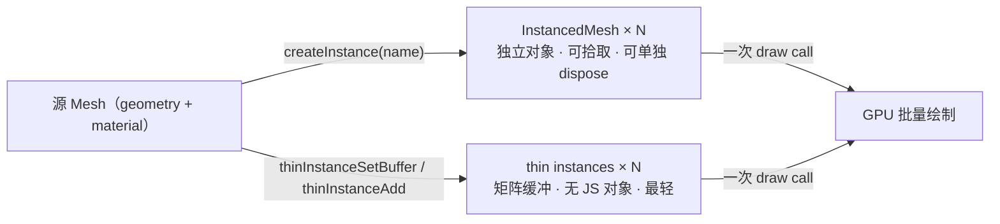

import { Canvas, Controls, Meta } from '@storybook/addon-docs/blocks';
import * as InstancesStories from './instanced-mesh-and-thin-instances.stories';

<Meta of={InstancesStories} name="Docs" />

# 实例化

渲染大量“形状相同、变换各异”的物体时，为每个物体单独建一个 `Mesh` 会让 draw call 与 JS 对象数量一起涨。Babylon.js 的两种实例化机制都用**一份几何 + 一份材质 + 一次 draw call** 渲染成百上千个重复物体，差别在实例有没有独立的 JS 对象：

- **InstancedMesh** 用 `mesh.createInstance(name)` 创建——每个实例是 `scene.meshes` 里的独立对象，有自己的 `position` / `rotation` / `scaling`，可单独拾取和 dispose，适合数量中等、需要逐个交互的场景。
- **thin instances** 用 `mesh.thinInstanceAdd(matrix)` 或 `mesh.thinInstanceSetBuffer("matrix", ...)` 写入——实例数据只是矩阵缓冲，没有独立 JS 对象，更轻更快，适合成千上万的静态或批量更新的场景。



| 输入或概念 | 默认 / 常用 | 回查要点 |
| --- | --- | --- |
| `mesh.createInstance(name)` | 返回 `InstancedMesh` | 与源共享材质，不可单独换；源默认仍渲染，只想显示实例时 `mesh.isVisible = false` |
| `mesh.instances` | `InstancedMesh[]` | 切换布局时从这里取并逐个 `dispose()` |
| `mesh.thinInstanceAdd(matrix, refresh?)` | 返回索引；可传 `Matrix[]` 批量 | 多次写时把 `refresh=false` 用在前面，最后一次传 `true`（默认）才刷新缓冲 |
| `mesh.thinInstanceSetMatrixAt(i, matrix, refresh?)` | 更新第 i 个 | 改完才同步到 GPU |
| `mesh.thinInstanceSetBuffer("matrix", data, 16, static?)` | 直接灌矩阵缓冲 | 最快批路径；`thinInstanceCount` 由 `data.length / 16` 推出 |
| `mesh.thinInstanceCount` | get / set 显示数量 | 临时少画用 setter，不释放缓冲；彻底换布局才重建 |
| `mesh.thinInstanceRefreshBoundingInfo()` | thin 实例默认自动同步包围盒 | 关掉自动同步用 `mesh.doNotSyncBoundingInfo = true` |
| `mesh.thinInstanceEnablePicking` | `false` | 置 `true` 后 `scene.pick` 的 `pickingInfo.thinInstanceIndex` 才有值 |
| 源网格 `isVisible` | thin 模式源自身几何默认不绘制；instanced 模式源仍绘制 | thin 实例需要源参与 render pass：源 `isVisible=false` 时 thin 实例也不画 |

## 两种实例化

两种机制共用源网格的 geometry 和 material，提交时都走 GPU 硬件实例化，整批实例一次 draw call。选择时先回答两个问题：**单实例需不需要被独立操作（拾取、移动、dispose）？数量级是大（上万）还是中等（几百到几千）？** 需要独立对象、数量可控时用 InstancedMesh；数量极大、能批量更新时用 thin instances。

| 维度 | InstancedMesh | thin instances |
| --- | --- | --- |
| JS 对象 | 每实例一个 `InstancedMesh`（进 `scene.meshes`） | 无，只有矩阵缓冲 |
| draw call | 整批一次 | 整批一次 |
| 单独变换 | 直接改 `position` / `rotation` / `scaling` | 改 `thinInstanceSetMatrixAt(i, matrix)` |
| 单独 dispose | `instance.dispose()` | 不可，清缓冲或调 `thinInstanceCount` |
| 拾取 | 默认可拾取，命中即该实例 | 需 `thinInstanceEnablePicking = true` |
| 每实例颜色 | 共享源材质，不可单独改 | 可用 `thinInstanceRegisterAttribute("color", 4)` 自定义属性 |
| 适用 | 中等数量、需要逐个交互 | 成千上万、静态或批量更新 |

### InstancedMesh

`mesh.createInstance(name)` 在源网格上创建一个关联副本，返回的 `InstancedMesh` 是独立 JS 对象，被加入 `scene.meshes`，拥有自己的 `position` / `rotation` / `scaling` / `isVisible`：

```ts
const pillar = MeshBuilder.CreateCylinder('pillar', { height: 2, diameter: 0.5 }, scene);
pillar.material = material;
pillar.isVisible = false; // 只显示实例，源本身不画

for (let i = 0; i < count; i++) {
  const inst = pillar.createInstance(`i${i}`);
  inst.position.set(x, 1, z);
}
```

实例与源**共享同一份 material**，不能给单个实例换材质（想换颜色只能换源材质，影响所有实例）。源网格默认仍然渲染——只想看到实例时把源 `isVisible` 设为 `false`，实例的 `isVisible`（默认 `true`）不受影响。

切换布局时，旧实例要逐个 dispose：`mesh.instances` 是当前实例数组，遍历调用 `instance.dispose()` 即从场景移除。和 [网格](?path=/docs/mesh-and-meshbuilder--docs) 里的普通 `Mesh` 一样，InstancedMesh 也是 `AbstractMesh`，可挂指针事件、参与 [拾取](?path=/docs/pointer-input-and-picking--docs)、被 `scene.meshes` 索引。

### thin instances

thin instances 把每个实例的 4×4 矩阵直接写进一块缓冲，跳过 JS 对象。三条写入路径，按从慢到快排列：

```ts
// 1. 逐个添加：thinInstanceAdd 返回索引，便于后续更新。
const idx = mesh.thinInstanceAdd(Matrix.Translation(x, 1, z));

// 2. 批量添加：传 Matrix 数组一次灌入。
mesh.thinInstanceAdd([m1, m2, m3], true);

// 3. 直接灌缓冲：最快，适合成千上万个静态实例。
const buffer = new Float32Array(count * 16);
for (let i = 0; i < count; i++) {
  matrices[i].copyToArray(buffer, i * 16);
}
mesh.thinInstanceSetBuffer('matrix', buffer, 16);
```

`thinInstanceSetBuffer("matrix", data, 16)` 的第三参是**步长**（矩阵 16 个 float）；写完后 `thinInstanceCount` 由 `data.length / 16` 推出。需要每帧改矩阵（动画）时，构造时把第四参 `static` 设为 `false`，让缓冲可更新：

```ts
mesh.thinInstanceSetBuffer('matrix', buffer, 16, false); // matrix 缓冲可更新
```

更新单个实例用 `thinInstanceSetMatrixAt(i, matrix)`。多次连续写入时，`refresh` 参数控制是否立即同步 GPU——前面几次传 `refresh=false` 跳过刷新，最后一次传 `true`（默认）统一同步，避免重复上传：

```ts
for (let i = 0; i < count; i++) {
  mesh.thinInstanceSetMatrixAt(i, newMatrices[i], i === count - 1); // 仅最后一次刷新
}
```

thin 实例**默认不渲染源网格的自身几何**（只在缓冲里的实例被画）。如果想让源也作为其中一个实例出现，用 `mesh.thinInstanceAddSelf()`。临时少画几个实例把 `mesh.thinInstanceCount` 改小即可，缓冲数据保留；彻底换布局才重建缓冲。包围盒默认自动同步以覆盖所有 thin 实例，分布频繁变化想关掉自动同步时设 `mesh.doNotSyncBoundingInfo = true`，再手动 `thinInstanceRefreshBoundingInfo()`。

## 每实例矩阵

两种机制都把每个实例的变换编码成一个 4×4 `Matrix`，最终与源网格自身的世界矩阵相乘。最直接的构造方式是用 `Matrix.Translation` 或 `Matrix.Compose`：

```ts
import { Matrix, Quaternion, Vector3 } from '@babylonjs/core';

// 纯平移：最常见的静态布局。
const m1 = Matrix.Translation(x, 1, z);

// 完整 TRS：缩放 × 旋转 × 平移。
const m2 = Matrix.Compose(
  new Vector3(1.2, 1.2, 1.2),                   // scaling
  Quaternion.RotationYawPitchRoll(yaw, pitch, roll), // rotation（弧度）
  new Vector3(x, 1, z),                          // translation
);
```

`InstancedMesh` 也可以直接写 `position` / `rotation` / `scaling`，引擎内部会合成矩阵——更直观，但有 N 个 JS 对象的开销；thin instances 没有这种便利属性，必须直接提供矩阵，这也是它更轻的原因之一。矩阵分量与世界单位、弧度的约定见 [坐标与尺寸](?path=/docs/coordinate-system-and-units--docs)。

## 拾取与交互

**InstancedMesh 默认可拾取**：`scene.pick` 命中后 `pickInfo.pickedMesh` 直接就是命中的那个 `InstancedMesh`（静态类型声明为 `AbstractMesh`，运行时实际是实例），用 `pickedMesh.isAnInstance` 或 `getClassName() === 'InstancedMesh'` 判断，再读 `pickedMesh.sourceMesh` 拿源网格。每个实例是独立对象，也能挂 `ActionManager` 单独响应事件。

**thin instances 默认不可拾取**——它们不是 `scene.meshes` 里的对象，没有独立抽象层。开启逐实例拾取：

```ts
mesh.thinInstanceEnablePicking = true;

scene.onPointerDown = () => {
  const pick = scene.pick(scene.pointerX, scene.pointerY);
  if (pick?.hit && pick.thinInstanceIndex >= 0) {
    // pick.thinInstanceIndex 命中的 thin 实例索引
  }
};
```

置 `thinInstanceEnablePicking = true` 后，`pickInfo.thinInstanceIndex` 给出命中的 thin 实例索引；用它在矩阵缓冲里反查该实例的世界变换。thin 实例的拾取用一个覆盖所有实例的整体包围盒做粗检，不是逐实例碰撞——适合“选中哪一株”这类反馈，不适合精确的逐三角形求交。指针与拾取的完整机制见 [指针与拾取](?path=/docs/pointer-input-and-picking--docs)。

## 一次 draw call 渲染大量实例

下面的实例用同一份柱子几何和材质渲染一片方阵，切换「实例化方式」与「实例数」，读数给出 draw calls、场景网格数与 FPS：

- **InstancedMesh** 模式：无论 100 还是 5000 个，draw calls 都接近 1；场景网格数随数量线性增长（源 + N 个独立对象）。
- **thin instances** 模式：draw calls 同样接近 1；场景网格数始终是 1（thin 实例只是缓冲，不进 `scene.meshes`）。
- **普通 Mesh** 模式：每个对象一次 draw call，与数量 1:1 攀升；调大后 FPS 明显回落。

<Canvas of={InstancesStories.Instances} />

<Controls of={InstancesStories.Instances} />

| 读者操作 | 可观察证据 |
| --- | --- |
| 切到「InstancedMesh」、调「实例数」100→5000 | draw calls 基本不变（≈1）；场景网格数随数量增长；FPS 在大数量下仍较稳 |
| 切到「thin instances」 | draw calls 仍 ≈1；场景网格数始终 1（源 + 缓冲）；与 InstancedMesh 的差别在“有没有独立 JS 对象” |
| 切到「普通 Mesh」、调「实例数」到 2000+ | draw calls 与数量 1:1 攀升；FPS 明显回落，证明 draw call 是瓶颈 |
| 拖动 Canvas | 轨道相机绕方阵旋转，三种模式渲染的是同一片柱子，差异只来自实例化方式 |

draw call 是 CPU 到 GPU 的提交次数，每帧数百次以上会变瓶颈；实例化把瓶颈压回 GPU 端的三角形吞吐量。draw calls、freeze、dispose、按需渲染等更系统的性能策略见 [性能](?path=/docs/performance-and-disposal--docs)。

## 最佳实践

- 重复物体优先用实例化；共享一份 geometry 和 material，不要为每个实例克隆资源——源材质一改，全部实例跟着变。
- 单实例需要被独立拾取、移动或 dispose 时用 InstancedMesh；数量上万、能批量更新时用 thin instances，别为了“能逐个操作”而硬上 InstancedMesh。
- thin instances 批量写入用 `thinInstanceSetBuffer` 或带数组的 `thinInstanceAdd`；连续写多个时 `refresh=false` 跳过中间刷新，最后一次才 `true`。
- 切换布局时彻底清理上一组：InstancedMesh 实例逐个 `dispose()`、thin 实例归零 `thinInstanceCount` 或重灌缓冲——否则旧实例会残留。
- thin 实例分布频繁变化时评估 `doNotSyncBoundingInfo = true` + 手动 `thinInstanceRefreshBoundingInfo()`，避免每帧重算整体包围盒；静态分布保留自动同步即可。
- thin 实例需要被点击时才开 `thinInstanceEnablePicking = true`，整体包围盒粗检有成本，静态场景可按需开关。
- 释放场景时 InstancedMesh 随源 dispose 自动回收；thin 实例的矩阵/属性缓冲随源网格 dispose 释放，不需要单独清理。

## 常见问题

- 为什么 `createInstance` 后画面里多了一个在原点的柱子？
  源网格默认仍然渲染。只想显示实例时把源 `isVisible` 设为 `false`；实例的可见性不受影响。
- 为什么 thin 实例切换模式后还在画面上？
  thin 实例数据写在源网格的缓冲里，不会被 InstancedMesh 的 `dispose` 清掉。切换布局前显式 `mesh.thinInstanceCount = 0`，或重新 `thinInstanceSetBuffer` 覆盖。
- 为什么把源 `isVisible` 设成 `false` 后，thin 实例全部消失了？
  thin 实例的绘制挂在源网格的 render pass 上，源不绘制时整批都不画。thin 模式让源保持可见——thin 机制接管后源的自身几何默认不绘制，不会多出一个原点实例。
- 为什么 `thinInstanceSetMatrixAt` 后画面没变？
  多次连续写入时把 `refresh` 都设成了 `false`，又没在最后一次传 `true`（默认），矩阵缓冲没同步到 GPU。让最后一次调用保留默认 `refresh=true`；或直接用 `thinInstanceSetBuffer("matrix", data, 16)` 整体重灌。
- 为什么 thin 实例拾取拿不到索引？
  默认 `thinInstanceEnablePicking` 是 `false`。置 `true` 后 `pickInfo.thinInstanceIndex` 才会被填充；注意它用整体包围盒粗检，不是逐三角形精确求交。
- 为什么想给单个 InstancedMesh 换颜色做不到？
  实例与源共享 material，不能单独换。需要每实例颜色时改用 thin instances + `thinInstanceRegisterAttribute("color", 4)`，或退回到普通 Mesh + 克隆材质。
- 为什么 draw calls 没有降到 1？
  实例共享 geometry 和 material 才会合并到一次提交。检查实例是否真的挂在同一个源上、材质是否被中途 clone、源网格是否因负缩放等导致背面剔除被强制关闭（引擎会拆分 draw call）。

## 总结回顾

摘要：

两种实例化机制都用一份 geometry + 一份 material 把大量重复物体打包成一次 draw call。InstancedMesh 用 `mesh.createInstance(name)` 创建独立 JS 对象，可单独变换、拾取与 dispose，适合数量可控、需要交互的场景；thin instances 用 `thinInstanceAdd` / `thinInstanceSetBuffer` 把矩阵写进缓冲，没有 JS 对象，更轻更快，适合成千上万的静态或批量更新。选择先看“需不需要独立对象”和“数量级”：实例变换都靠 4×4 矩阵；thin 实例的逐实例拾取要显式 `thinInstanceEnablePicking = true`，命中后读 `pickInfo.thinInstanceIndex`。

一句话：

> 需要逐个交互、数量可控用 InstancedMesh；数量上万、能批量更新用 thin instances——两者都把上千个重复物体压成一次 draw call。

知识要点：

- InstancedMesh 与 thin instances 在 JS 对象、draw call、单独 dispose 和拾取上各有什么差别？
- `mesh.createInstance` 创建的实例与源共享什么？为什么不能单独换材质？
- `thinInstanceAdd` / `thinInstanceSetBuffer` / `thinInstanceSetMatrixAt` 各自适合什么场景？`refresh` 参数怎么用？
- thin 实例的逐实例拾取怎么开启？命中后从哪里读索引？
- 切换实例化方式或调整数量时，怎样彻底清理上一组实例避免残留？
- 什么情况下应该用 InstancedMesh，什么情况下必须用 thin instances？

## 参考资料

- [Babylon.js Features：Instances](https://doc.babylonjs.com/features/featuresDeepDive/mesh/copies/instances)
- [Babylon.js Features：Thin Instances](https://doc.babylonjs.com/features/featuresDeepDive/mesh/copies/thinInstances)
- [Babylon.js Features：Optimize Your Scene（draw calls / instances）](https://doc.babylonjs.com/features/featuresDeepDive/scene/optimize_your_scene)
- [Babylon.js Features：Picking & Collisions（thinInstanceIndex）](https://doc.babylonjs.com/features/featuresDeepDive/mesh/interactions/picking_collisions)
- [Babylon.js TypeDoc：Mesh（createInstance / thinInstance*）](https://doc.babylonjs.com/typedoc/classes/BABYLON.Mesh)
- [Babylon.js TypeDoc：InstancedMesh](https://doc.babylonjs.com/typedoc/classes/BABYLON.InstancedMesh)
- [Babylon.js TypeDoc：SceneInstrumentation](https://doc.babylonjs.com/typedoc/classes/BABYLON.SceneInstrumentation)
- [Babylon.js TypeDoc：Matrix](https://doc.babylonjs.com/typedoc/classes/BABYLON.Matrix)
