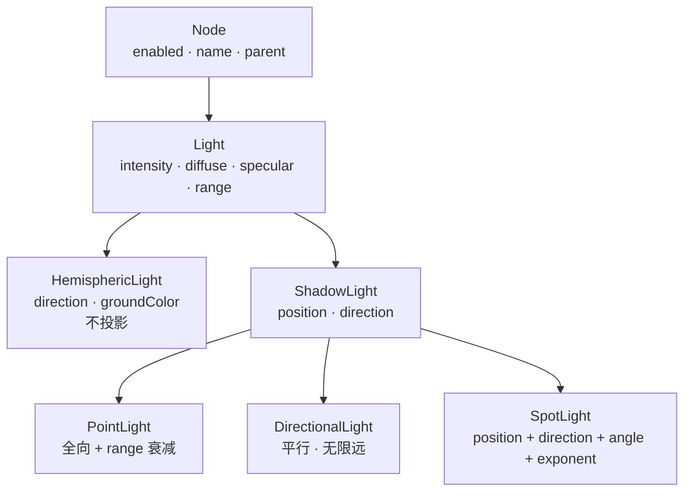

import { Canvas, Controls, Meta } from '@storybook/addon-docs/blocks';
import * as LightStories from './lights.stories';

<Meta of={LightStories} name="Docs" />

# 光源

Babylon.js 的光源是挂在 `Scene` 上的**节点**：构造时传入 scene 就自动登记进 `scene.lights` 集合，每一帧由 `scene.render()` 读取。光源本身不绘制几何，而是把 `diffuse`、`specular`、`intensity` 等参数写进受光材质（`StandardMaterial`、`PBRMaterial`）的着色器 uniform，由材质算出每个像素的明暗。这一点和 three.js 的 `Light`（`Object3D` 子类）相似，但 Babylon 的 `Scene` 把光源当一等集合直接持有，`scene.lights` 就是当前生效的清单。

先把三个判断建立起来，后面选型和参数才不容易混：

- **选哪种 Light 决定光的形状。** 四种核心光源按形状分工：`HemisphericLight`（天/地半球填充）、`DirectionalLight`（平行光，模拟太阳）、`PointLight`（从一点全向发散）、`SpotLight`（从一点沿锥形发散）。Babylon 没有 three.js 那种全场均匀的 `AmbientLight`——要抬底色用 `HemisphericLight`。
- **只有受光材质响应光。** `StandardMaterial`、`PBRMaterial` 受光；`scene.lights` 为空时它们渲染成**全黑**（不是看不见，是像素 RGB 落到 0）。所以"画面全黑"先看有没有光，再看材质法线（呼应[几何与顶点](?path=/docs/geometry-and-vertex-data--docs)里的法线坑）。
- **能不能投影看类型，不是看开关。** `HemisphericLight` 直接继承 `Light`，不能投影；`PointLight` / `DirectionalLight` / `SpotLight` 都继承 `ShadowLight`，可以挂 `ShadowGenerator`。阴影本身（shadow map、受光材质、软边）见 [明暗与阴影](?path=/docs/shadows-and-shading--docs)，本课只讲光源。



| 共同属性 | 默认 | 适用 | 回查要点 |
| --- | --- | --- | --- |
| `intensity` | `1.0` | 全部 | 强度倍率；`0` = 该光源无贡献 |
| `diffuse` | `Color3(1, 1, 1)` 白 | 全部 | 主体漫反射色；与 `intensity` 相乘后送入 shader |
| `specular` | `Color3(1, 1, 1)` 白 | 全部 | 高光色；高光**锐利度**由材质的 `specularPower` 决定，不是光源 |
| `range` | `Number.MAX_VALUE` | Point / Spot 影响 `StandardMaterial` 的距离衰减 | 设有限值才看到"近亮远暗"；`PBRMaterial` 按反平方衰减，详见 [PBR 与环境](?path=/docs/pbr-and-environment--docs) |
| `enabled` | `true` | 全部 | 设 `false` 让该光源临时退出计算，不必 `dispose` |
| `groundColor` | `Color3(0, 0, 0)` 黑 | 仅 `HemisphericLight` | 反方向（朝下）的地面色 |
| `direction` | — | Hemispheric / Directional / Spot | Hemispheric 的 `direction` 是**反射方向**（朝上的天顶），不是入射方向 |

| 类型 | 光的形状 | 构造关键参 | 投影 | 典型场景 |
| --- | --- | --- | --- | --- |
| `HemisphericLight` | 天 / 地半球填充 | `direction` | 否 | 环境底色、天光填充 |
| `PointLight` | 从一点全向发散 | `position` | 是 | 灯泡、火光 |
| `DirectionalLight` | 平行光 | `direction` | 是 | 太阳、主光 |
| `SpotLight` | 锥形 | `position` + `direction` + `angle` + `exponent` | 是 | 聚光灯、舞台 |

## 光源与受光材质

四种光源的构造函数都形如 `new <Hemispheric|Point|Directional|Spot>Light(name, ...关键参, scene?)`——传入 scene 后自动登记进 `scene.lights`，不必手动 `add`。它们都是 `Node` 的子类，因此可以设 `parent` 挂到 `TransformNode` 上跟随父级移动，也可以 `setEnabled(false)` 临时关闭。

```ts
import { HemisphericLight, Vector3 } from '@babylonjs/core';

// 传 scene 自动登记；direction 是反射方向（天顶朝上）。
const fill = new HemisphericLight('fill', new Vector3(0, 1, 0), scene);
fill.intensity = 0.8;
```

**没光，受光材质就是全黑。** `StandardMaterial` / `PBRMaterial` 的最终颜色是"材质自身属性 × 所有光源的贡献之和"；`scene.lights` 为空时贡献项全为 0，渲染出纯黑像素——物体仍在场景里，只是没有光可以反射。这是初学最常踩的"画面全黑"，排查顺序是：`scene.lights.length > 0` → 材质是受光材质 → 几何法线正确（法线反过来也会整面黑，见 [几何与顶点](?path=/docs/geometry-and-vertex-data--docs)）。`MeshBasicMaterial` 那种"不受光"的材质在 Babylon 里没有直接等价物——`StandardMaterial` 把 `emissiveColor` 当自发光用，但它仍参与光照计算。

`diffuse` 与 `specular` 都是 `Color3`（线性 RGB，0–1），与 `intensity` 相乘后送入 shader。`specular` 只决定高光的**颜色**，高光的**大小与锐利度**由材质的 `specularPower`（`StandardMaterial`）或 `roughness`（`PBRMaterial`）控制——想调高光斑的大小，改材质，不是改光源。

## 四种光源

四种光源共享上面那张表里的共同属性，差别在**光的形状**和**是否继承 `ShadowLight`**。`HemisphericLight` 直接继承 `Light`，没有有意义的 `position`，也不能投影；其余三种继承 `ShadowLight`，因此有 `position` / `direction`，并且可以作为 `ShadowGenerator` 的光源（投影细节见 [明暗与阴影](?path=/docs/shadows-and-shading--docs)）。

选型先按"需要什么形状的光"决定类型，再按"是否需要投影、是否需要距离衰减"定参数：

- 要全场天光底色 → `HemisphericLight`
- 要太阳 / 主光（全场同方向、不衰减）→ `DirectionalLight`
- 要灯泡（从一点向四周、随距离衰减）→ `PointLight`
- 要聚光灯（锥形受限）→ `SpotLight`

### HemisphericLight 半球光

`HemisphericLight` 模拟环境天光：按法线方向在 `diffuse`（天顶色）和 `groundColor`（地面色）之间做插值——朝上的面偏 `diffuse`，朝下的面偏 `groundColor`，中间过渡。它**没有有意义的 `position`**，方向由 `direction`（反射方向，即天顶朝向）决定；也不能投影（`getShadowGenerator()` 永远返回 `null`）。

```ts
import { Color3, HemisphericLight, Vector3 } from '@babylonjs/core';

const sky = new HemisphericLight('sky', new Vector3(0, 1, 0), scene);
sky.diffuse = new Color3(0.9, 0.93, 1.0); // 天顶偏冷白
sky.groundColor = new Color3(0.22, 0.18, 0.15); // 地面暖暗
sky.intensity = 0.9;
```

`direction` 默认 `Vector3.Up()`（朝上），常写成 `(0, 1, 0)`。想快速把天顶指向某个目标，用 `setDirectionToTarget(target)`——它把 `direction` 设为 `normalize(target - origin)`。`HemisphericLight` 适合做"底色"：单独一个会显得平淡，通常和方向或位置光源组合使用。

### PointLight 点光

`PointLight` 从一个 `position` 向四周均匀发光，强度随距离衰减。它是 `ShadowLight` 的子类，有 `position`，可以投影（阴影用 cube texture，见 [明暗与阴影](?path=/docs/shadows-and-shading--docs)）。

```ts
import { Color3, PointLight, Vector3 } from '@babylonjs/core';

const bulb = new PointLight('bulb', new Vector3(2, 3, 2), scene);
bulb.diffuse = new Color3(1.0, 0.85, 0.6); // 暖灯泡
bulb.intensity = 1.2;
bulb.range = 12; // 默认 Number.MAX_VALUE（不衰减）；设有限值才看到近亮远暗
```

`range` 默认 `Number.MAX_VALUE`，即**默认不衰减**——这和 three.js 的 `PointLight`（默认 `decay = 2` 反平方）不同。要让远处物体变暗，给 `range` 一个有限值：`StandardMaterial` 按距离在 `range` 内把贡献衰减到 0。`PBRMaterial` 按反平方衰减（`1 / range²`），同样需要有限 `range` 才生效，细节见 [PBR 与环境](?path=/docs/pbr-and-environment--docs)。

`PointLight` 还接受一个可选的 `direction`——只有用它做定向阴影回退时才设，普通照明不用。

### DirectionalLight 平行光

`DirectionalLight` 发出方向一致的平行光，强度不随距离衰减（"无限远"）。它由 `direction` 决定照射方向，**位置无意义**，`range` 不影响它。它是 `ShadowLight` 子类，是 `ShadowGenerator` 的首选光源（正交投影，适合全场阴影）。

```ts
import { Color3, DirectionalLight, Vector3 } from '@babylonjs/core';

const sun = new DirectionalLight('sun', new Vector3(-0.5, -1, -0.5).normalize(), scene);
sun.diffuse = new Color3(1.0, 0.96, 0.88);
sun.intensity = 1.4;
// direction 不必归一化，但归一化后改起来更直观；位置对光照无效。
```

`direction` 是"光的传播方向"——`(-0.5, -1, -0.5)` 表示光从右上往左下、朝画面深处照。`ShadowGenerator` 会根据 `direction` 建立正交视锥来渲染 shadow map；要调整阴影覆盖范围，调 `shadowFrustumSize` 或 `autoUpdateExtends`（见 [明暗与阴影](?path=/docs/shadows-and-shading--docs)）。

### SpotLight 聚光

`SpotLight` 从一个 `position` 沿 `direction` 发出锥形光，由 `angle`（锥体半角，弧度）和 `exponent`（沿锥轴的衰减速度）控制形状。它是 `ShadowLight` 子类，可以投影（透视投影，视锥角等于 `angle`）。

```ts
import { Color3, SpotLight, Vector3 } from '@babylonjs/core';

const lamp = new SpotLight(
  'lamp',
  new Vector3(4, 5, 4),              // position：发光点
  new Vector3(-4, -5, -4).normalize(), // direction：指向被照区域
  Math.PI / 4.5,                      // angle：锥体半角 ≈ 40°
  2,                                  // exponent：沿锥轴衰减速度
  scene,
);
lamp.diffuse = new Color3(1.0, 0.9, 0.7);
lamp.range = 18;
```

| 参数 | 含义 | 备注 |
| --- | --- | --- |
| `position` | 发光点 | 改它移动光锥的位置 |
| `direction` | 光锥朝向 | 通常 = `normalize(target - position)` |
| `angle` | 锥体**半角**（弧度） | 整锥张角是 `2 × angle`；`Math.PI / 2` 即 90° 张角 |
| `exponent` | 沿锥轴的衰减速度 | 越大光斑越集中、衰减越快；常见 1 ~ 4 |
| `innerAngle` | glTF 衰减模式下的内角 | 仅 `Light.FALLOFF_GLTF` 时生效，普通用法不动它 |

`angle` 是**半角**（从中心轴量到锥壁），不是张角；要"45° 张角的聚光"设 `angle = Math.PI / 8`。`exponent` 控制光斑中心到边缘的衰减，不控制距离衰减——距离衰减仍由 `range`（`StandardMaterial`）或反平方（`PBRMaterial`）决定。

四种光源在同一受光场景里的明暗分布差异，用下面的实例切着看：固定一组 `StandardMaterial` 球/盒和地面，用控件切换当前唯一的活动光源，并调 `intensity`。

<Canvas of={LightStories.Lights} />

<Controls of={LightStories.Lights} />

| 读者操作 | 可观察证据 |
| --- | --- |
| 默认 `hemispheric` | 整个场景被天/地底色均匀抬亮，朝上面偏冷白、朝下面偏暖暗；无方向性高光 |
| 切到 `directional` | 一侧（光来的方向）亮、反面暗；远处物体与近处同等亮——证明平行光不衰减 |
| 切到 `point` | 靠近 `position (4,4,4)` 的右上角球最亮，远端球明显变暗——`range=14` 触发距离衰减 |
| 切到 `spot` | 只照亮锥形覆盖的中心与右上区域，锥外区域接近全黑；锥边界随 `angle` 固定 |
| 切到 `none` | 受光材质**全黑**，只剩 `clearColor` 深灰舞台底；readout 显示"无光源"——证明没光时 `StandardMaterial` 像素归零 |
| 调 `intensity` 到 `0` | 当前光源贡献归零，画面与 `none` 一致；调回 `1` 恢复——`intensity` 是倍率，不是开关 |
| 看 readout `位置 / 方向` | Hemispheric / Directional 读 `direction`；Point / Spot 读 `position`，对应各自构造参数 |

实例离屏时停止渲染循环、回到视口附近再恢复，调度细节见 [渲染循环与时间](?path=/docs/render-loop-and-timing--docs)。

## 最佳实践

- **主光 + 填充光组合：** 用 `DirectionalLight` 或 `SpotLight` 作主光提供方向与阴影，加一个弱 `HemisphericLight` 抬背光面，比单光源更自然。单独一个 `HemisphericLight` 会显得平淡。
- **要距离衰减必须给 `range` 有限值：** 默认 `Number.MAX_VALUE` 等于不衰减。`PointLight` / `SpotLight` 想要"近亮远暗"，先设 `range`，再调 `intensity`；同一 `intensity` 在不同 `range` 下视觉亮度差别很大。
- **太阳和全场阴影首选 `DirectionalLight`：** 它的正交 shadow map 覆盖稳定；`PointLight` 的 cube shadow map 开销大，`SpotLight` 的阴影只覆盖锥内。
- **临时关光用 `enabled`，永久删除用 `dispose`：** `light.enabled = false` 保留对象、可随时开回；`light.dispose()` 从 `scene.lights` 移除并释放。切换光源类型时记得 `dispose` 旧光，否则旧光仍参与计算（本课实例的 `applyLight` 就是这么做的）。
- **`diffuse` 给色温，`intensity` 给亮度：** 暖光偏黄橙（`Color3(1, 0.85, 0.6)`）、冷光偏蓝白（`Color3(0.85, 0.9, 1)`）；强度始终用单独的 `intensity` 数值控制，不要靠把 `diffuse` 调到 >1 来"加亮"。
- **高光大小改材质不改光源：** 想让高光斑更小更亮，调 `StandardMaterial.specularPower`（默认 64，越大越锐利）或 `PBRMaterial.roughness`；光源的 `specular` 只改高光颜色。

## 常见问题

- 为什么加了光源整个场景还是黑的？
  先看 `scene.lights.length` 是否大于 0（构造时传了 scene 才会登记）；再看材质是不是 `StandardMaterial` / `PBRMaterial`（不是 `emissiveColor` 自发光）；最后看几何法线——法线反过来也会整面黑（见 [几何与顶点](?path=/docs/geometry-and-vertex-data--docs)）。
- 为什么 `PointLight` / `SpotLight` 远处不变暗？
  `range` 默认 `Number.MAX_VALUE`，等于不衰减。给 `range` 一个有限值，`StandardMaterial` 才在 `range` 内把贡献衰减到 0；`PBRMaterial` 按反平方衰减（`1 / range²`），同样需要有限 `range`。
- 为什么 `intensity` 设得和旧教程一样，亮度差很多？
  `intensity` 的物理含义按光源类型和材质不同：`StandardMaterial` 把它当线性倍率；`PBRMaterial` 配合 `intensityMode`（默认 `AUTOMATIC`）按光源类型选物理单位（点 / 聚光用 luminous intensity，方向 / 半球用 illuminance）。从旧项目迁移亮度时，按材质重新标定 `intensity`，不要照搬数值。
- 为什么 `HemisphericLight` 改了 `position` 没反应？
  它直接继承 `Light`，不是 `ShadowLight`，`position` 对光照没有意义；方向由 `direction`（天顶朝向）决定，底色由 `diffuse` / `groundColor` 决定。
- 为什么 `SpotLight` 的 `angle` 设成 `Math.PI / 4` 看起来比我想要的窄？
  `angle` 是**锥体半角**（从中心轴到锥壁），整锥张角是 `2 × angle`。想要"45° 张角"设 `angle = Math.PI / 8`，想要"90° 张角"设 `angle = Math.PI / 4`。
- 同时挂很多光源会影响性能吗？
  每种受光材质的 shader 要为每盏 `Light` 算一次光照，光源越多着色成本越高。`StandardMaterial` 默认按"逐顶点光源"上限处理；静态场景尽量精简，或把不影响当前物体的光源 `enabled = false`（性能细节见 [性能](?path=/docs/performance-and-disposal--docs)）。
- 为什么切换光源类型后旧光的明暗还在？
  旧光没被 `dispose`，仍留在 `scene.lights` 里继续贡献。切换类型时先 `oldLight.dispose()` 再 `new` 新光，本课实例的 `applyLight` 按类型键判断后销毁重建。

## 总结回顾

摘要：

Babylon 的光源是挂在 `Scene` 上的节点，构造时传 scene 自动登记进 `scene.lights`，每帧由 `scene.render()` 读取。四种核心光源按形状分工：`HemisphericLight` 做天/地半球填充（无 `position`、不投影），`DirectionalLight` 做平行光（无限远、不衰减、`ShadowGenerator` 首选），`PointLight` 从一点全向发散，`SpotLight` 从一点沿锥形发散。后三者继承 `ShadowLight`，有 `position` / `direction`，可以投影。共同属性是 `intensity`（默认 1）、`diffuse` / `specular`（默认白）、`range`（默认 `Number.MAX_VALUE`，不衰减）、`enabled`；高光锐利度归材质的 `specularPower` / `roughness`，不归光源。没光时 `StandardMaterial` / `PBRMaterial` 渲染成全黑——这是"画面全黑"的第一排查点。

一句话：

> 选光源先选光的形状，要距离衰减给 `range` 一个有限值，要全场阴影选 `DirectionalLight`；改高光大小看材质不看光源。

知识要点：

- 光源作为 Node 进入 `scene.lights` 后影响什么？哪些材质响应它？没光时长什么样？
- 四种光源各自发出什么形状的光，分别适合什么场景？哪个不能投影？
- `HemisphericLight` 的 `direction` 是入射方向还是反射方向？它为什么没有 `position`？
- `range` 默认值是什么？为什么 `PointLight` 默认看起来不衰减？
- `SpotLight` 的 `angle` 是半角还是张角？`exponent` 控制什么衰减，`range` 控制什么衰减？
- `intensity` 在 `StandardMaterial` 和 `PBRMaterial` 下含义为什么不同？
- 切换光源类型时为什么要 `dispose` 旧光？

## 参考资料

- [Babylon.js TypeDoc：Light（intensity / diffuse / specular / range）](https://doc.babylonjs.com/typedoc/classes/BABYLON.Light)
- [Babylon.js TypeDoc：ShadowLight（position / direction）](https://doc.babylonjs.com/typedoc/classes/BABYLON.ShadowLight)
- [Babylon.js TypeDoc：HemisphericLight](https://doc.babylonjs.com/typedoc/classes/BABYLON.HemisphericLight)
- [Babylon.js TypeDoc：PointLight](https://doc.babylonjs.com/typedoc/classes/BABYLON.PointLight)
- [Babylon.js TypeDoc：DirectionalLight](https://doc.babylonjs.com/typedoc/classes/BABYLON.DirectionalLight)
- [Babylon.js TypeDoc：SpotLight](https://doc.babylonjs.com/typedoc/classes/BABYLON.SpotLight)
- [Babylon.js Features：Lights Introduction](https://doc.babylonjs.com/features/featuresDeepDive/lights/lights_introduction)
- [Babylon.js API Reference (TypeDoc)](https://doc.babylonjs.com/typedoc/)
