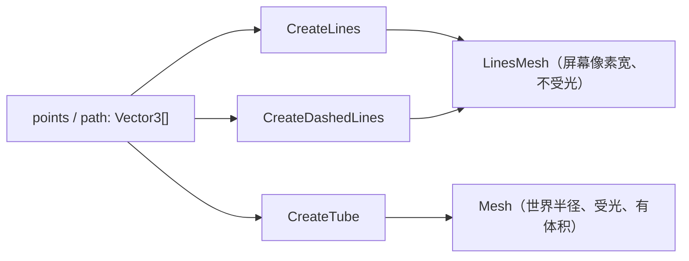

import { Canvas, Controls, Meta } from '@storybook/addon-docs/blocks';
import * as LinesStories from './lines-and-tubes.stories';

<Meta of={LinesStories} name="Docs" />

# Lines

Babylon.js 用三个 `MeshBuilder` 创建器渲染"路径"：`CreateLines` 和 `CreateDashedLines` 把一组 `Vector3` 按顺序连成折线，返回 `LinesMesh`；`CreateTube` 沿一条路径挤出一条有体积的管道，返回普通 `Mesh`。三者都接受 `points` / `path` 数组、按参数生成几何，也都支持 `updatable` + `instance` 的原地更新。

和 [Sprite](?path=/docs/sprite-and-spritemanager--docs) 不同——Sprite 是贴图广告牌，永远朝向相机、用图片画内容、尺寸也是屏幕空间的；本课的对象是几何路径，形状由顶点数学定义，拓扑不随相机改变。`LinesMesh` 还有一个特殊身份：它的 `width` 是**屏幕像素宽**（底层走原生 GL 线），不受透视和光照影响；而 `CreateTube` 产出的是真实 3D 几何，半径是世界单位、受光、会被透视缩放。理解这条分界，就理解了三者各自适合什么任务。



| 创建器 | 必需输入 | 返回 | 关键参数与默认值 | 受光 | 尺寸单位 |
| --- | --- | --- | --- | --- | --- |
| `CreateLines` | `points` | `LinesMesh` | `updatable=false`、`useVertexAlpha=true`、`colors`、`material` | 否 | `width` 屏幕像素 |
| `CreateDashedLines` | `points` | `LinesMesh` | `dashSize=3`、`gapSize=1`、`dashNb=200` | 否 | `width` 屏幕像素 |
| `CreateTube` | `path` | `Mesh` | `radius=1`、`tessellation=64`、`cap=NO_CAP`、`radiusFunction=null` | 是（走材质） | `radius` 世界单位 |

| `LinesMesh` 属性 | 默认值 | 回查要点 |
| --- | --- | --- |
| `color` | `Color3(1,1,1)` 白 | 线条颜色，自发光直接输出，不受场景光源影响 |
| `alpha` | `1` | 透明度；`useVertexAlpha=true` 时才进入半透明混合 |
| `width` | `1` | 屏幕像素宽；多数桌面平台受 WebGL `gl.lineWidth` 上限制约，设大于 1 也常为 1 |
| `useVertexAlpha` | `true`（只读） | 是否启用 alpha 混合，创建时由 options 决定，关闭更省 |
| `intersectionThreshold` | `0.1` | 指针拾取时给线段的容差（世界单位），拾线时按需放大 |

## LinesMesh：屏幕像素折线

`CreateLines` 与 `CreateDashedLines` 共享同一套渲染模型：把 `points` 数组按顺序连成折线，画到一个**不受光照**的 `LinesMesh` 上。理解下面四个事实，就掌握了它们的行为边界：

- **顶点顺序就是连接顺序。** `points` 是一串 `Vector3`，相邻两点之间画一段，不闭合、不配对；要闭合自己在末尾补一个等于首点的顶点。
- **`width` 是屏幕像素，不是世界单位。** `LinesMesh` 底层用 `Material.LineListDrawMode` 走原生 GL 线，线宽在屏幕空间生效，**不会因离相机更远而变细**。多数桌面平台 WebGL 的 `gl.lineWidth` 上限是 1，设 `width = 5` 也常画成 1 像素；要真正的粗线改用 `@babylonjs/core` 的 `GreasedLine`，或直接用 `CreateTube`。
- **颜色走实例属性，不走材质。** `linesMesh.color`（`Color3`，默认白）和 `linesMesh.alpha`（默认 1）决定输出颜色；`LinesMesh` 内部自带一个 `colorShader`，`disableLighting = true`，所以场景里的光对它没有作用。
- **`useVertexAlpha`（默认 `true`）决定要不要 alpha 混合。** 关掉更省；要用 `alpha` 做半透明就必须开着。需要每点不同颜色/透明时改用 `options.colors: Color4[]`（自动开启 vertex color/alpha）。

实线和虚线的差别只在"段是否被实线连满"：`CreateLines` 把相邻点完整连起来；`CreateDashedLines` 在 `points` 基础上多 `dashSize` / `gapSize` / `dashNb` 三个参数，把整条折线按比例切成虚线。两者返回的都是 `LinesMesh`，`color` / `alpha` / `width` 用法完全一致。

### CreateLines：实线

`CreateLines(name, options, scene?)` 返回 `LinesMesh`，`options.points` 必需。

```ts
import { MeshBuilder, Vector3 } from '@babylonjs/core';

const points: Vector3[] = [];
for (let i = 0; i <= 64; i++) {
  const t = i / 64;
  points.push(new Vector3(t * 6 - 3, Math.sin(t * Math.PI * 4), 0));
}

const line = MeshBuilder.CreateLines('sin', { points }, scene);
line.color = Color3.FromHexString('#3d73d9'); // 默认白，按需覆盖
// line.width = 2; // 屏幕像素；多数桌面平台受 gl.lineWidth 限制仍为 1
```

下面的实例把同一条螺旋路径交给三个创建器。先看"实线"这一组：调「点数」，折线从棱角分明的折线逐步贴近平滑曲线——`points` 决定的就是路径的离散密度。

<Canvas of={LinesStories.Lines} />

<Controls of={LinesStories.Lines} />

| 读者操作 | 可观察证据 |
| --- | --- |
| 调「点数」从 10 到 200 | 螺旋折线从明显的折角逐步变平滑；读数「点数」同步变化 |
| 鼠标拖动 Canvas | 轨道相机绕螺旋转动，从任意角度看出它是 3D 路径而非平面图 |
| 与下方「虚线」「管道」对比 | 同一条螺旋分别呈现像素折线、虚线、有体积的管道 |

### CreateDashedLines：虚线

`CreateDashedLines(name, options, scene?)` 在 `points` 基础上多了三个参数，返回的同样是 `LinesMesh`：

| 参数 | 默认值 | 含义 |
| --- | --- | --- |
| `dashSize` | `3` | 一段实线的长度（相对值，与 `gapSize` 同尺度） |
| `gapSize` | `1` | 两段实线之间的间隙长度（相对值） |
| `dashNb` | `200` | 整条折线**意图切分**的总段数；实际段数由路径总长和 `dashSize:gapSize` 比共同决定 |

```ts
const dashed = MeshBuilder.CreateDashedLines(
  'dashed',
  {
    points,
    dashSize: 3,   // 默认 3
    gapSize: 1,    // 默认 1
    dashNb: 200,   // 默认 200
  },
  scene,
);
dashed.color = Color3.FromHexString('#d17832');
```

`dashSize : gapSize` 决定**虚实比**（3:1 就是实三空一），`dashNb` 决定**总分段密度**。只想要更稀疏的虚线，优先调小 `dashNb`；只想让实线段更短、间隙更密，按比例同时减小 `dashSize` 和 `gapSize`。

下面的实例把同一条螺旋画成虚线。固定点数，调「dashSize」和「gap」：比值改变虚实的视觉占比，间隙大于段长时看起来接近点画。

<Canvas of={LinesStories.Dashed} />

<Controls of={LinesStories.Dashed} />

| 读者操作 | 可观察证据 |
| --- | --- |
| 「dashSize」调大、「gap」不变 | 实线段变长、间隙相对变短，虚线趋向实线 |
| 「gap」调大、「dashSize」不变 | 实线段变短、间隙拉开，虚线趋向点画 |
| 与上方「实线」对比 | 同一条螺旋，只是把每段实线按比例切空 |

## CreateTube：沿路径挤出管道

`CreateTube(name, options, scene?)` 把 `path` 当作轴线，沿它挤出一条环周管道，返回的是**普通 `Mesh`**，不是 `LinesMesh`。这条分界带来一组与线条完全不同的属性：

- **真实 3D 几何，受光。** 管道有顶点法线、走 StandardMaterial/PBRMaterial，场景里的光会让它产生明暗；线条则不受光。
- **`radius` 是世界单位。** 离相机越远管道看起来越细，符合透视；不像 `LinesMesh.width` 的屏幕像素宽。
- **`tessellation` 决定截面形状。** 默认 64 段近似圆；设 3 就是三棱柱、6 是六棱柱，调高才趋近圆管。
- **`radiusFunction` 让半径沿线变化。** 传入 `(i, distance) => number`，按路径索引或累积距离返回每点半径，用来画渐细、渐粗、波浪形的管。

```ts
import { Mesh, MeshBuilder, Vector3 } from '@babylonjs/core';

const path: Vector3[] = []; // 沿螺旋采样 64 个点作为轴线
for (let i = 0; i < 64; i++) {
  const t = i / 63;
  const a = 2.5 * Math.PI * 2 * t;
  path.push(new Vector3(3 * Math.cos(a), 6 * (t - 0.5), 3 * Math.sin(a)));
}

// 等径圆管
const tube = MeshBuilder.CreateTube(
  'tube',
  { path, radius: 0.3, tessellation: 16 },
  scene,
);

// 变径管：用 radiusFunction 让半径沿路径正弦起伏（设了它就忽略 radius）
const varTube = MeshBuilder.CreateTube(
  'varTube',
  {
    path,
    tessellation: 24,
    radiusFunction: (i, distance) => 0.3 + 0.2 * Math.sin(i * 0.3),
  },
  scene,
);
```

`cap` 控制两端是否封口，取 `Mesh.NO_CAP`（默认）、`Mesh.CAP_START`、`Mesh.CAP_END`、`Mesh.CAP_ALL`；默认开口时建议关掉材质的背面剔除（或用 `CAP_ALL`），否则往开口里看时远端面会被剔掉。`arc`（默认 1）小于 1 时只画部分环周，可以拼半管、扇形槽。

下面的实例让同一条螺旋成为一条等径管道。调「radius」改变粗细（注意它会随相机距离透视缩放），调「tessellation」从棱柱过渡到圆管。

<Canvas of={LinesStories.Tube} />

<Controls of={LinesStories.Tube} />

| 读者操作 | 可观察证据 |
| --- | --- |
| 调「radius」从 0.05 到 1 | 管道变粗/变细；离相机远的那一段在屏幕上明显更细（透视缩放） |
| 调「tessellation」从 3 到 48 | 截面从三棱柱（3）逐步过渡到光滑圆柱（≥ 24） |
| 鼠标拖动改变距离 | 与"实线/虚线"不同，管道有明暗、有体积感——它是受光的 Mesh |
| 与上方两组对比 | 同一条螺旋，从像素折线 → 虚线 → 有体积的管道 |

## 动态更新：updatable 与 instance

三个创建器都支持"创建一次、原地更新"：第一次调用时把 `updatable` 设为 `true`，之后再用同一个创建器并传入 `instance: 已有网格`，就能在**不重建 GPU 资源**的前提下改写顶点位置。这是做运动轨迹、活体缆绳、随时间变形的管道时的标准做法。

```ts
// 1) 创建时打开 updatable
let line = MeshBuilder.CreateLines(
  'trail',
  { points: sample(64), updatable: true },
  scene,
);

// 2) 用同长度的新 points + instance 原地更新
line = MeshBuilder.CreateLines(
  null,
  { points: sampleMoved(64), instance: line },
  scene,
);
```

`CreateTube` 的 instance 更新还能顺带换 `radius` 或 `radiusFunction`：

```ts
let tube = MeshBuilder.CreateTube(
  'hose',
  { path: path(64), radius: 0.4, updatable: true },
  scene,
);

// 同长度新 path + 新 radius（甚至新 radiusFunction）
tube = MeshBuilder.CreateTube(
  null,
  { path: pathMoved(64), radius: 0.5, instance: tube },
  scene,
);
```

最关键的约束：**更新时顶点/路径点的数量不能变，只能改位置。** `instance` 复用的是已有几何的顶点缓冲，长度一旦改变就要销毁重建（本课三个 Canvas 改"点数/tessellation"时走的就是销毁重建路径，而不是 instance）。`CreateDashedLines` 的 `instance` 还额外要求 `dashSize` / `gapSize` 与创建时一致，因为虚线的分段信息在创建时已烘进顶点。

## 最佳实践

- 选型先看"要线还是要体"：要折线轨迹、辅助线、坐标轴用 `CreateLines` / `CreateDashedLines`（快、不受光、像素宽）；要缆绳、管道、有体积的轨迹用 `CreateTube`（受光、世界半径、可贴图）。
- 不要靠 `LinesMesh.width` 调粗——多数桌面平台受 WebGL `gl.lineWidth` 限制恒为 1；要真正的粗线用 `GreasedLine`，或直接换成 `CreateTube`。
- 需要"按顺序连点"的连续路径用 `CreateLines`；要 N 条彼此无关的独立线段改用 `CreateLineSystem`（接受 `lines: Vector3[][]`，每条子数组是一条折线，一次绘制）。
- 每帧变化的轨迹/管道用 `updatable: true` + `instance` 原地更新，不要每帧销毁重建；记住点数必须固定，只动位置。
- 实线想分段着色用 `options.colors: Color4[]`（每点一色，自动启用 vertex color/alpha）；只想整条一色就用 `linesMesh.color` + `alpha`。
- `CreateTube` 默认 `NO_CAP` 开口，记得关材质背面剔除或用 `CAP_ALL`，避免往管口看时出现面被剔除的错觉。
- 不再用时和所有 Mesh 一样调 `dispose()`；线条若用了自定义 `material`，单独释放材质。

## 常见问题

- 为什么设了 `linesMesh.width = 5`，线还是 1 像素细？
  多数桌面平台 WebGL 的 `gl.lineWidth` 上限就是 1，Babylon 没法绕过。要真正的粗线改用 `GreasedLine`，或换成 `CreateTube`（半径是世界单位、有体积）。
- 为什么 `CreateLines` 画出来不随距离变细、也不被场景光影响？
  `LinesMesh` 的 `width` 是屏幕像素、走原生 GL 线，自带 `colorShader` 且 `disableLighting = true`，所以既不透视缩放也不受光。要受光、有透视的"线"用 `CreateTube`。
- 为什么 `alpha` 改了，线条还是不透明？
  `LinesMesh` 默认 `useVertexAlpha = true`，但你显式传 `useVertexAlpha: false` 时 alpha 混合会被关掉；确认创建时没关，并且没有用不透明的自定义 `material` 覆盖。
- 为什么用 `instance` 更新后，线/管道形状错乱或报错？
  `instance` 复用已有顶点缓冲，要求新 `points` / `path` 的**点数与创建时完全一致**，只能改位置。点数变了就必须销毁重建；`CreateDashedLines` 的 `instance` 还要求 `dashSize` / `gapSize` 不变。
- `CreateDashedLines` 的 `dashSize` 和 `gapSize` 单位是什么？
  它们是相对值（默认 3 / 1），共同决定虚实比；实际每段的物理长度还取决于路径总长和 `dashNb`（默认 200）。想让虚线整体更稀疏，优先调小 `dashNb`。
- 为什么 `CreateTube` 往管口看进去，远端的面不见了？
  默认 `cap = Mesh.NO_CAP` 且材质开启了背面剔除。把材质的 `backFaceCulling` 设为 `false`，或把 `cap` 设为 `Mesh.CAP_ALL` 封口。
- 想一次画很多条独立折线，必须创建很多个 `LinesMesh` 吗？
  不必。`MeshBuilder.CreateLineSystem` 接受 `lines: Vector3[][]`，把多条折线合进一个 `LinesMesh`，一次绘制；适合网格、连线图、批量调试线。

## 总结回顾

摘要：

`CreateLines`、`CreateDashedLines` 和 `CreateTube` 都以 `points` / `path` 数组为输入，都是 MeshBuilder 上的参数化创建器。前两者返回 `LinesMesh`：按顺序连点成折线，`width` 是屏幕像素（多数桌面受 `gl.lineWidth` 限制恒为 1），颜色走 `color` / `alpha` 自发光、不受光照；`CreateDashedLines` 多了 `dashSize` / `gapSize` / `dashNb` 三个相对值，把折线切成虚线。`CreateTube` 返回普通 `Mesh`：沿路径挤出环周管道，`radius` 是世界单位、受光、有透视，`tessellation` 决定截面是棱柱还是圆管，`radiusFunction` 让半径沿线变化。三者都支持 `updatable: true` + `instance` 的原地更新，约束是更新时点数不能变、只能改位置。和 Sprite 的贴图广告牌相比，这些是几何路径——形状由顶点数学定义，不随相机朝向改变。

一句话：

> 要像素折线用 `CreateLines` / `CreateDashedLines`（`LinesMesh`，不受光、屏幕像素宽），要有体积的受光管道用 `CreateTube`（`Mesh`，世界半径）；动态形变走 `updatable` + `instance`，点数不能变。

知识要点：

- `CreateLines` / `CreateDashedLines` / `CreateTube` 三者的必需输入、返回类型和默认参数分别是什么？
- `LinesMesh.width` 为什么不受透视、也不被光照？把它调大的后果是什么？
- `CreateDashedLines` 的 `dashSize` / `gapSize` / `dashNb` 各自决定什么？哪个改虚实比、哪个改总密度？
- `CreateTube` 的 `radius` 和 `LinesMesh.width` 在单位、受光、透视行为上有什么本质差别？
- `radiusFunction` 的签名是什么？它和 `radius` 谁优先？
- 用 `instance` 原地更新线/管道时，最关键的约束是什么？点数变了该怎么办？
- 这些几何线/管和 Sprite 广告牌在"形状由什么决定"上有什么不同？

## 参考资料

- [Babylon.js TypeDoc：MeshBuilder.CreateLines](https://doc.babylonjs.com/typedoc/classes/BABYLON.MeshBuilder#CreateLines)
- [Babylon.js TypeDoc：MeshBuilder.CreateDashedLines](https://doc.babylonjs.com/typedoc/classes/BABYLON.MeshBuilder#CreateDashedLines)
- [Babylon.js TypeDoc：MeshBuilder.CreateTube](https://doc.babylonjs.com/typedoc/classes/BABYLON.MeshBuilder#CreateTube)
- [Babylon.js TypeDoc：LinesMesh（color / alpha / width / useVertexAlpha）](https://doc.babylonjs.com/typedoc/classes/BABYLON.LinesMesh)
- [Babylon.js Features：Lines Mesh](https://doc.babylonjs.com/features/featuresDeepDive/mesh/lines/lines_mesh)
- [Babylon.js Features：Parametric Shapes（Tube / Lines / Dashed Lines）](https://doc.babylonjs.com/features/featuresDeepDive/mesh/creation/param)
- [Babylon.js Features：Dynamic Mesh Morph（updatable + instance）](https://doc.babylonjs.com/features/featuresDeepDive/mesh/dynamicMeshMorph)
- [MDN：WebGLRenderingContext.lineWidth（平台限制）](https://developer.mozilla.org/zh-CN/docs/Web/API/WebGLRenderingContext/lineWidth)
