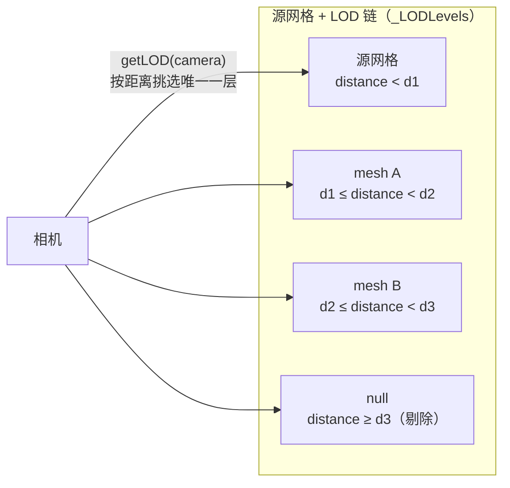

import { Canvas, Controls, Meta } from '@storybook/addon-docs/blocks';
import * as LodStories from './lod-and-levels.stories';

<Meta of={LodStories} name="Docs" />

# LOD

`LOD`（Level of Detail，细节层级）让你为**同一个对象**准备多档不同精度的网格，再让渲染器按"相机到 mesh 的世界距离"自动挑一档提交。它解决两类问题：远处用低面数 mesh 减少三角面提交量；切到近距离时再换回高细节版本，让画面保持锐利。Babylon 把 LOD 直接做在 `Mesh` 上——在源网格上登记几档备选 mesh，渲染时由 `getLOD(camera)` 决定实际画哪个。



Babylon 的 LOD 不改写几何内容，也不替你生成"低面数版本"——你提供的每一档都是独立 `Mesh`，由渲染器按距离决定显示哪个。语义上更接近"按距离切换显示哪个 mesh"，而不是 three.js 里把多层网格挂到一个 `LOD` 父对象下的做法。

| 概念或 API | 取值 / 默认 | 回查要点 |
| --- | --- | --- |
| `mesh.addLODLevel(distance, meshLOD)` | `distance ≥ 0`；`meshLOD: Mesh \| null` | `distance` 是"相机到 mesh 包围球中心的世界距离阈值"；**超过**该值时改用 `meshLOD`；返回 `this` 可链式调用 |
| 源网格（调用 `addLODLevel` 的那个） | 自动作为"距离小于最小阈值"时的网格 | 源网格本身就是最高细节档，不需要再为自己登记 |
| `meshLOD = null` | 表示"超过此距离不渲染" | 远处剔除；`getLOD` 返回 `null`，渲染器跳过这个 mesh |
| `mesh.getLOD(camera)` | 返回 `Nullable<AbstractMesh>` | 渲染器每帧内部调用；返回源网格、某档 LOD mesh 或 `null` |
| `_LODLevels` 排序 | 距离模式按 distance **降序**；屏幕覆盖模式相反 | 调用 `addLODLevel` 后自动 `_sortLODLevels()`，不需手动排序 |
| `mesh.useLODScreenCoverage` | 默认 `false`（按距离） | `true` 时改按屏幕占比挑选，参数语义变成 0–1 的占比比 |
| `mesh.getLODLevels()` | 返回 `MeshLODLevel[]` | 每项是 `{ distanceOrScreenCoverage, mesh }` |
| `mesh.removeLODLevel(meshLOD)` | 按 mesh 引用移除（含 `null`） | 移除后该 mesh 的 `_masterMesh` 被清空，恢复独立可渲染 |
| `mesh.hasLODLevels` | `boolean` getter | 是否登记过任何 LOD 层级 |
| `mesh.onLODLevelSelection` | `(distance, mesh, selectedMesh) => void` | 可观察回调，每次层级挑选时触发 |

## 注册 LOD 层级

`addLODLevel(distance, meshLOD)` 把一个 mesh 登记到源网格的 LOD 链。`distance` 是"相机到 mesh 包围球中心的世界距离阈值"——`distance=7` 表示"相机距离 ≥ 7 时改用这个 mesh"。源网格本身不需要登记——它对应"距离小于最小阈值"时的最高细节档。

```ts
import { MeshBuilder, StandardMaterial, Color3 } from '@babylonjs/core';

// 源网格：相机距离 < 7 时显示，使用最高细节。
const source = MeshBuilder.CreateSphere('source', { diameter: 3, segments: 32 }, scene);

// 中细节档：相机距离 ∈ [7, 13) 时显示。
const mid = MeshBuilder.CreateSphere('mid', { diameter: 3, segments: 16 }, scene);
source.addLODLevel(7, mid);

// 低细节档：相机距离 ∈ [13, 19) 时显示。
const low = MeshBuilder.CreateSphere('low', { diameter: 3, segments: 8 }, scene);
source.addLODLevel(13, low);
```

登记顺序不重要：内部会 `_sortLODLevels()`，按距离降序重排（最大距离在前）。但养成"由近到远、细节由高到低"的添加习惯，代码读起来最直观。`addLODLevel` 返回 `this`，可以链式写：`source.addLODLevel(7, mid).addLODLevel(13, low)`。

`addLODLevel` 内部把 LOD mesh 的 `_masterMesh` 指向源网格，标记它"已被绑定为某 mesh 的 LOD"。同一个 mesh 不能重复登记为多个源网格的 LOD——会触发 `Logger.Warn("You cannot use a mesh as LOD level twice")` 并跳过这次登记。被绑定的 LOD mesh 不会独立进入渲染队列，渲染器只通过源网格的 `getLOD(camera)` 提交它，所以画面里不会"多出"这些 mesh。

### getLOD 怎样挑选当前层

渲染器在提交一个 mesh 之前会调用 `mesh.getLOD(camera)`，逻辑可以归纳为：

1. 用 `bSphere.centerWorld.subtract(camera.globalPosition).length()` 算出"相机到 mesh 包围球中心的世界距离"（正交相机用 `camera.minZ` 代替）。
2. 遍历按 distance 降序排列的 `_LODLevels`，找到**第一个** `distance < 当前相机距离` 的层。
3. 该层的 `mesh` 非 `null` 就返回它（提交这一档 LOD mesh）；为 `null` 就返回 `null`（源网格整体不渲染）。
4. 如果相机距离比所有登记的 distance 都小（包括根本没有 LOD），返回源网格本身。

```text
相机距离 d      0 ────── 7 ────── 13 ────── 19 ────── 25 ──────►
显示的网格      source        mid       low      veryLow   null（剔除）
                │             │         │         │         │
                └─ getLOD 返回 source / mid / low / veryLow / null
```

每帧只有一个层进入渲染队列——源网格本身或某档 LOD mesh，或者 `null`（什么也不画）。一个配了 3 档 + null 的源网格每帧最多产生一次 draw call。

下面的实例把同一份几何做成 4 档线框球（segments 32 / 16 / 8 / 4），登记阈值是 7 / 13 / 19，最远一层 `addLODLevel(25, null)` 做剔除。地面上的环画在每个阈值距离处（环的半径 = 阈值），相机半径接近某个环时，下一刻就会触发对应层切换。拖动 Canvas 可以绕轨道看；调「相机距离」滑块，能看到激活层级与三角形数一起跳变。

<Canvas of={LodStories.Lod} />

<Controls of={LodStories.Lod} />

| 读者操作 | 可观察证据 |
| --- | --- |
| 拖动 Canvas | ArcRotateCamera 绕原点旋转，环的相对位置改变；当前距离读数等于相机半径 |
| 把「相机距离」从 3 慢慢推到 30 | 跨过 7 / 13 / 19 时「激活层级」依次变为 中 / 低 / 极低，「当前几何」变为对应 segments，「当前三角形」一起跳变；跨过 25 时变为「剔除」，整个线框球消失 |
| 把距离推回 4 | 反向依次切回更高细节，最终回到「高（源网格）」 |
| 对比「全部层级」行 | 每档的阈值、三角形数与屏幕上看到的线框密度一致——segments 减半时三角形数大致按平方下降 |

## null LOD 与远处剔除

把 `meshLOD` 设成 `null` 登记为最远一层，表示"相机距离超过此阈值后，源网格整体不渲染"。这是 LOD 系统的**剔除机制**，常用于"远到看不见细节就干脆不画"。

```ts
// distance ≥ 25 时 getLOD 返回 null，渲染器跳过这个 mesh。
source.addLODLevel(25, null);
```

`getLOD` 返回 `null` 时，渲染器不会把源网格加入渲染队列，等于一次"按距离的整体剔除"。这和视锥剔除（frustum culling，mesh 跑出相机视锥）是两套独立机制：

| 机制 | 触发条件 | 控制方 |
| --- | --- | --- |
| null LOD 剔除 | 相机距离 ≥ 登记的 null 阈值 | 你自己用 `addLODLevel(d, null)` 设定 |
| 视锥剔除 | mesh 包围球跑出相机视锥 | 渲染器自动；`mesh.alwaysSelectAsActiveMesh = true` 可强制保留 |
| 遮挡剔除 | mesh 被遮挡查询判定不可见 | 需 `mesh.occlusionType` 显式开启 |

null LOD 是按"距离"的显式控制，比视锥剔除更可控、更稳定——只要相机距离一过阈值，无论角度、视锥如何，mesh 都不渲染。

`removeLODLevel(null)` 可以移除登记过的 null 层；移除后源网格又会一直渲染到最远一层 LOD，不再被剔除。`dispose` 时 LOD mesh 不会被源网格一起释放——它们只是被解绑（`_masterMesh` 清空），需要你显式 `dispose()` 或交给场景统一释放。

## 屏幕覆盖模式

距离模式有一个边界：mesh 被 `scaling` 放大或相机视场角（FOV）变化时，相同的"距离"对应不同的屏幕占比，细节该降不降。`mesh.useLODScreenCoverage = true` 切到屏幕覆盖模式——参数语义从"距离"变成"mesh 渲染面积占屏幕的比例（0–1）"，与缩放和 FOV 无关。

```ts
source.useLODScreenCoverage = true;
// 现在 distance 参数其实是屏幕占比阈值：占比 < 0.1 时切到这一档。
source.addLODLevel(0.1, mid);
```

`getLOD` 内部用 `meshArea / camera.screenArea` 算占比，`meshArea` 来自包围球半径和相机 `minZ`。排序方向也相反——占比越大表示越近、越该用高细节，所以 `_LODLevels` 改成升序，"占比小于阈值"时切换。两种模式按场景尺度特性选：固定尺度场景用距离更直观，跨尺度（用户可缩放对象或 FOV）用屏幕覆盖更稳。本课实例用距离模式，便于直接读数。

## 与实例化、其他对象的边界

LOD 解决的是"同一对象不同距离用不同细节"，不是"多个对象的批量渲染"或"形态切换"。把它和相邻机制分清楚，才能不踩坑。

| 目标 | 推荐对象 | 边界入口 |
| --- | --- | --- |
| 同一物体在不同距离用不同细节 | `Mesh.addLODLevel` | 本课 |
| 大量相同物体的批量渲染 | `InstancedMesh` / thin instances | [2.10 实例化](?path=/docs/instanced-mesh-and-thin-instances--docs) |
| 始终面向相机的标签 / 图标 | `Sprite` + `SpriteManager` | [2.7 Sprite](?path=/docs/sprite-and-spritemanager--docs) |
| 一个 mesh 不同区域用不同材质 | `MultiMaterial` + `SubMesh` | [2.12 特殊对象](?path=/docs/special-mesh-types--docs) |
| 大地形按相机距离细分 | `GroundMesh` 的细分与地形 LOD（独立系统） | [8.2 性能](?path=/docs/performance-and-disposal--docs) |

**LOD 与实例化可以叠加**：源网格登记了 LOD 层级后，渲染它的 `InstancedMesh` 时也会走同一条 LOD 链。这是大量重复物体（树林、人群、道具）的常见优化组合：用实例化压 draw call，再用 LOD 压三角面。具体到每个实例按什么距离判定、thin instances 与 LOD 的细节交互，见实例化课程的说明。

**LOD 不是形态切换器**。需要"近处是树、远处是石头"这种形态变化，用 `TransformNode` 分组 + 显式 `setEnabled(false)` 控制，或拆成独立对象按距离加载/卸载。LOD 的语义是"同一对象的不同细节版本"，混用会让远处画面与近处语义不一致。

## 最佳实践

- 一开始就按"由近到远、细节由高到低"的顺序登记；源网格作为最高细节档，不在 `addLODLevel` 里重复登记它。
- `distance` 阈值要结合场景尺度：相机通常离物体 5–30 单位时，阈值用 7/13/19 比用 0.5/1/2 更合理；过小的阈值让所有层级挤在一起，等于没分。
- 同一组 LOD 内共享 material（外观一致、dispose 简单）；不同层用不同 material 时切换不仅换几何，也可能换 shader program，可能抵消 LOD 节省的开销。
- 给最远一层登记 `null` 做按距离的整体剔除；不要依赖视锥剔除处理"远处看不见"——视锥剔除受角度影响，null LOD 更稳定可控。
- 释放源网格时记得同时 dispose LOD mesh：`scene.removeMesh(source)` 不会级联释放，需要遍历 `getLODLevels()` 分别处理。
- 距离模式够用时不要切屏幕覆盖模式；只有 mesh 会被大幅缩放或 FOV 会显著变化时，`useLODScreenCoverage = true` 才更稳。
- 不要用 LOD 做"动画形态切换"——它是渲染优化，不是表现手段。形态变化走 morph targets 或显式可见性控制。

## 常见问题

- 为什么相机远近移动时 LOD 没有切换？
  `getLOD` 用的是"相机到 mesh **包围球中心**的世界距离"，不是到 mesh.position 的距离。检查 mesh 的 `scaling` 和 `getBoundingInfo()`；包围球被异常放大时阈值会提前触发，反之可能延迟。
- 为什么登记的 LOD mesh 在画面里"看不到"？
  LOD mesh 一旦被 `addLODLevel` 绑定，`_masterMesh` 就指向源网格，渲染器只通过源网格的 `getLOD` 提交它，不会独立渲染。这是预期行为，不是 bug。
- 为什么同一个 mesh 登记到两个源网格上没生效？
  控制台会输出 `You cannot use a mesh as LOD level twice`。一个 mesh 只能作为一个源网格的 LOD；为每个源网格各自 `clone()` 一份再登记。
- 为什么源网格的 `scaling` 改大后，阈值好像提前触发了？
  距离模式按"包围球中心到相机"算，不算 `scaling`——但 `scaling` 大时包围球也大，相机更早"撞进"近距离范围。要么调整阈值，要么改用 `useLODScreenCoverage` 让占比决定切换。
- 为什么 `removeLODLevel(mesh)` 没移除掉？
  它按**引用**比较，不是按 distance。传进去的必须是当初登记时的同一个 mesh 对象（或 `null`）。`removeLODLevel(null)` 专门移除登记过的 null 层。
- 为什么距离和 `addLODLevel` 里写的值对不上？
  正交相机（`camera.mode === Camera.ORTHOGRAPHIC_CAMERA`）内部用 `camera.minZ` 代替实际距离做比较；透视相机才是真实的"包围球中心到 `camera.globalPosition`"。也要确认你没在读上一帧的旧距离。
- 能用 LOD 切换完全不同的物体（近处是树、远处是石头）吗？
  技术上可以，但 LOD 的语义是"同一对象的不同细节"。形态切换会让远处画面与近处不一致；这种场景更适合用 `TransformNode` 分组 + `setEnabled()` 控制，或按距离加载/卸载独立对象。

## 总结回顾

摘要：

Babylon 的 LOD 直接做在 `Mesh` 上：在源网格上 `addLODLevel(distance, meshLOD)` 登记多档备选 mesh，渲染器每帧调用 `mesh.getLOD(camera)` 按"相机到 mesh 包围球中心的世界距离"挑选唯一一层提交，其余层不进入渲染队列。源网格本身对应"距离小于最小阈值"时的最高细节；`addLODLevel(d, null)` 表示"超过此距离不渲染"，是 LOD 系统的远处剔除机制，与视锥剔除独立。`_LODLevels` 自动按 distance 降序排序，调用顺序不影响结果。`useLODScreenCoverage = true` 切换到屏幕占比模式，参数语义与排序方向都翻转，适合跨尺度场景。LOD 与实例化可以叠加——用实例化压 draw call，再用 LOD 压三角面，是大量重复物体的常见组合优化。

一句话：

> LOD 让同一对象只按相机距离显示一档细节；`addLODLevel(distance, mesh)` 登记阈值与备选 mesh，`null` 表示远处剔除，渲染器每帧用 `getLOD(camera)` 自动挑选。

知识要点：

- `addLODLevel(distance, mesh)` 的 `distance` 是什么距离？源网格本身对应哪个区间？
- `getLOD(camera)` 内部用什么距离挑选当前层？什么时候返回源网格、什么时候返回 `null`？
- 把 `meshLOD` 设成 `null` 起什么作用？和视锥剔除有什么区别？
- 登记过的 LOD mesh 为什么不能在画面里独立看到？`_masterMesh` 在其中起什么作用？
- `useLODScreenCoverage` 切到屏幕覆盖模式后，参数语义和排序方向各变成什么？
- LOD 与 `InstancedMesh` 怎样叠加？为什么 LOD 不适合做形态切换？

## 参考资料

- [Babylon.js TypeDoc：Mesh（`addLODLevel` / `getLOD` / `getLODLevels` / `removeLODLevel`）](https://doc.babylonjs.com/typedoc/classes/BABYLON.Mesh)
- [Babylon.js TypeDoc：MeshLODLevel](https://doc.babylonjs.com/typedoc/classes/BABYLON.MeshLODLevel)
- [Babylon.js 教程：Levels of Detail (LOD)](https://doc.babylonjs.com/features/featuresDeepDive/mesh/LOD)
- [Babylon.js 教程：Simplify a mesh with Auto-LOD（自动简化生成 LOD 网格）](https://doc.babylonjs.com/features/featuresDeepDive/mesh/simplifyingMeshes)
- [Babylon.js Guided Learning](https://doc.babylonjs.com/guidedLearning/)
- [Babylon.js Playground：LOD 示例（QE7KM#197）](https://playground.babylonjs.com/#QE7KM#197)
