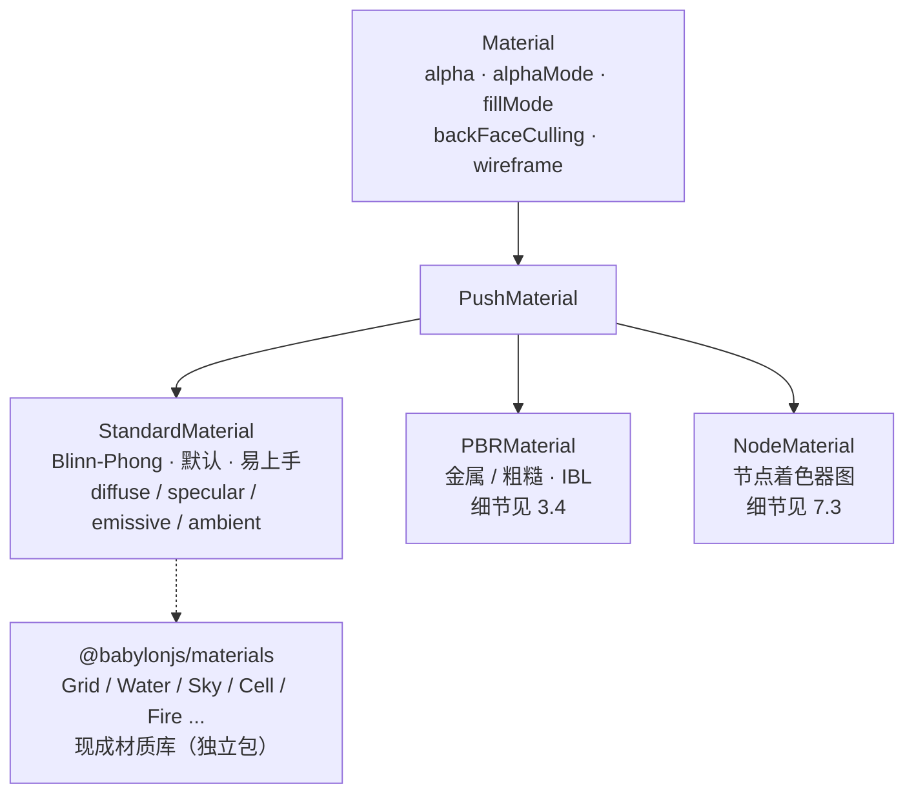

import { Canvas, Controls, Meta } from '@storybook/addon-docs/blocks';
import * as Stories from './materials.stories';

<Meta of={Stories} name="Docs" />

# 材质

Babylon.js 的材质是挂在 `mesh.material` 上的**属性包**：网格提供几何（三角形、法线、UV），材质提供"这些几何怎么响应光、怎么混色、是实心还是线框"的公式与参数，每帧由 `scene.render()` 读取。这一点和 three.js 的 `material` 概念一致，差别在家族划分与默认行为——Babylon 的入门默认是 `StandardMaterial`（Blinn-Phong），而不是 three.js 的 `MeshBasicMaterial`（不受光）。

先把三个判断建立起来，后面选型和参数才不容易混：

- **选哪个 Material 家族决定表面真实度与可控度。** `StandardMaterial` 是默认且易上手的 Blinn-Phong 材质，够大多数外观调试；`PBRMaterial` 是物理真实的金属/粗糙度材质，配合环境贴图（IBL）做写实渲染（细节见 [PBR 与环境](?path=/docs/pbr-and-environment--docs)）；`NodeMaterial` 是可视化节点连线组合的着色器，用于自定义流程（细节见 [Node Material 与着色器](?path=/docs/node-material-and-shaders--docs)）。本课聚焦 `StandardMaterial` 的完整属性。
- **StandardMaterial 的最终颜色是"自身属性 × 所有光源贡献之和"。** 所以"画面全黑"先看有没有光（呼应[光源](?path=/docs/lights--docs)），再看材质颜色有没有被设黑、法线有没有反（呼应[几何与顶点](?path=/docs/geometry-and-vertex-data--docs)）。
- **颜色、透明、形态是三组独立开关。** 颜色（`diffuseColor` / `specularColor` / `emissiveColor` / `ambientColor`）决定"什么色"；透明（`alpha` + `alphaMode`）决定"多透"；形态（`wireframe` / `backFaceCulling` / `fillMode` / `twoSidedLighting`）决定"实心 / 线框 / 双面"。贴图（`diffuseTexture` 等）属于"颜色从哪来"，细节见[纹理](?path=/docs/textures--docs)。



| 属性 | 默认 | 作用 | 回查要点 |
| --- | --- | --- | --- |
| `diffuseColor` | `Color3(1, 1, 1)` 白 | 漫反射主色 | 受光才可见，被 `light.diffuse` 调制 |
| `specularColor` | `Color3(1, 1, 1)` 白 | 高光颜色 | 设黑可关高光；高光**大小**看 `specularPower` |
| `specularPower` | `64` | 高光锐利度 | 越大越锐越集中，越小越宽越散 |
| `emissiveColor` | `Color3(0, 0, 0)` 黑 | 自发光（与光无关） | 叠加项，不是"unlit"；要真 unlit 用 `disableLighting` |
| `ambientColor` | `Color3(0, 0, 0)` 黑 | 环境项 | 乘 `scene.ambientColor`；scene 项为黑则无效 |
| `alpha` | `1.0` | 不透明度 | `0` 全透 / `1` 不透，配合 `alphaMode` |
| `alphaMode` | `ALPHA_COMBINE` (`2`) | 混合方程 | 标准透明用默认即可 |
| `wireframe` | `false` | 线框快捷开关 | 本质把 `fillMode` 切到 `WireFrameFillMode` |
| `pointsCloud` | `false` | 点云快捷开关 | 本质把 `fillMode` 切到 `PointFillMode` |
| `fillMode` | `TriangleFillMode` (`0`) | 填充模式 | `Triangle` / `WireFrame` / `Point` 三种 |
| `backFaceCulling` | `true` | 背面剔除 | 关掉 = 双面渲染，但背光面会偏暗（看 `twoSidedLighting`） |
| `twoSidedLighting` | `false` | 双面光照 | 配 `backFaceCulling = false` 用，背光面才不黑 |
| `disableLighting` | `false` | 关闭光照响应 | `true` 时只剩 `emissive` / 自色，不受光 |

## 材质家族：Standard / PBR / Node

三种材质都继承 `PushMaterial`，赋值方式都是 `mesh.material = mat`，差别在**用什么公式算每个像素的颜色**。先按"要什么真实度"选家族，再调参数：

| 家族 | 公式 | 适用 | 入口 |
| --- | --- | --- | --- |
| `StandardMaterial` | Blinn-Phong（漫反射 + 高光 + 自发光 + 环境） | 入门、外观调试、风格化、轻量场景 | 本课 |
| `PBRMaterial` | 基于物理（金属度 / 粗糙度 + IBL 环境光照） | 写实、PBR 资产、glTF 模型 | [PBR 与环境](?path=/docs/pbr-and-environment--docs) |
| `NodeMaterial` | 节点连线组合的自定义着色器 | 自定义流程、特殊效果、可视化编辑 | [Node Material 与着色器](?path=/docs/node-material-and-shaders--docs) |

```ts
import { Color3, StandardMaterial } from '@babylonjs/core';

// 传 scene 自动登记；mesh.material 一旦赋值，每帧 scene.render() 就用它。
const mat = new StandardMaterial('mat', scene);
mat.diffuseColor = new Color3(0.86, 0.4, 0.22);
mesh.material = mat;
```

`@babylonjs/materials` 是**独立的现成材质库**（`GridMaterial` / `WaterMaterial` / `SkyMaterial` / `CellMaterial` / `FireMaterial` 等），需要单独安装、单独 import；它们也是 `Material` 子类，赋值方式相同。细节见本课末尾[材质库](#材质库-babylonjsmaterials)一节。

## 颜色：diffuse / specular / emissive / ambient

`StandardMaterial` 把表面颜色拆成四个独立通道，**最终像素 = diffuse 项 + specular 项 + emissive 项 + ambient 项**（再乘以各光源贡献）。前三项最常用，`ambientColor` 只在设了 `scene.ambientColor` 时才有贡献。颜色都是 `Color3`（线性 RGB，0–1）；贴图版本的对应通道（`diffuseTexture` / `emissiveTexture` 等）见[纹理](?path=/docs/textures--docs)。

### diffuseColor 漫反射色

物体的"主色"——被光打到时反射的颜色，被 `light.diffuse` 调制。默认白。没光时这一项为 0（不受光的黑），所以"调了 diffuseColor 没反应"先确认场景里有光。

```ts
mat.diffuseColor = new Color3(0.86, 0.4, 0.22); // 橙
```

`Color3` 是线性 RGB；从 sRGB 十六进制（如 `#ff8a3a`）转换用 `Color3.FromHexString('#ff8a3a')`。颜色空间与贴图的 gamma 处理见[纹理](?path=/docs/textures--docs)。

### specularColor 与 specularPower 高光

`specularColor` 决定高光的**颜色**（默认白）；`specularPower` 决定高光的**锐利度**（默认 `64`，越大越锐越小，越小越宽越散）。要"无高光"的哑光表面，把 `specularColor` 设黑即可——不必关光源。

```ts
mat.specularColor = new Color3(1, 1, 1); // 高光颜色
mat.specularPower = 128;                  // 拉锐：高光斑变小变亮
```

注意高光的**大小归材质**（`specularPower`），高光的**颜色**也归材质（`specularColor`）；光源的 `specular` 只决定高光的"光色"输入。改高光大小不要去改光源（呼应[光源](?path=/docs/lights--docs)）。

### emissiveColor 自发光

`emissiveColor` 是**与光无关**的叠加项——不管有没有光、光从哪来，这一项都直接加到最终颜色上。默认黑（无贡献）。用它做"屏幕亮着""灯泡自身发光"等不依赖照明的亮区。

```ts
mat.emissiveColor = new Color3(0.9, 0.2, 0.1); // 不受光影响的自发光红
```

它**不是"unlit 材质"**：材质仍正常响应光照，`diffuse` / `specular` 项照常计算，`emissive` 只是叠在上面。要让材质**完全不响应光**（只剩自色），用 `mat.disableLighting = true`——此时 `diffuse` / `specular` 项全部跳过，只看 `emissiveColor`（或 `diffuseColor` 作为纯色）。

### ambientColor 环境色

`ambientColor` 是旧式的环境光项，**与 `scene.ambientColor` 相乘**后加到最终颜色上。默认黑；`scene.ambientColor` 默认也是黑（`Color3(0, 0, 0)`）——所以不动 `scene.ambientColor` 时，材质的 `ambientColor` 怎么调都没效果。

```ts
scene.ambientColor = new Color3(0.25, 0.25, 0.3); // 先给场景环境项一个非黑值
mat.ambientColor = new Color3(0.4, 0.4, 0.5);     // 材质环境项才生效
```

PBR 用 IBL 环境贴图替代了这套机制（见 [PBR 与环境](?path=/docs/pbr-and-environment--docs)）；`StandardMaterial` 的 `ambientColor` 只是一个均匀抬亮的手段，日常外观调试很少动它。

## 透明：alpha 与 alphaMode

透明由两个属性配合决定：`alpha` 给"多透"，`alphaMode` 给"用什么混合公式"。只调 `alpha` 就够了 99% 的场景——`alphaMode` 默认就是标准透明混合。

```ts
mat.alpha = 0.5; // 半透明：配合默认 alphaMode = ALPHA_COMBINE
```

`alpha` 是 `0`（全透）到 `1`（不透）的倍率，作用于材质整体。`alphaMode` 决定片段如何与 framebuffer 混合，常用取值（常量在 `Constants` 上导出）：

| `alphaMode` | 值 | 效果 | 典型场景 |
| --- | --- | --- | --- |
| `ALPHA_DISABLE` | `0` | 不混合 | 默认对齐；不透明物体 |
| `ALPHA_COMBINE` | `2` | 标准 src-alpha 混合（**默认**） | 玻璃、UI、烟雾 |
| `ALPHA_ADD` | `1` | 叠加（越加越亮） | 火焰、光晕、激光 |
| `ALPHA_ONEONE` | `6` | 无 alpha 权重的加法 | 加性粒子、泛光 |
| `ALPHA_MULTIPLY` | `4` | 相乘（越乘越暗） | 玻璃色调、蒙版 |

另有 `transparencyMode`（默认 `null`）：它是**分类提示**而非混合开关，取 `Material.MATERIAL_OPAQUE` / `MATERIAL_ALPHATEST` / `MATERIAL_ALPHABLEND` / `MATERIAL_ALPHATESTANDBLEND`，告诉渲染器这个材质走不透明、alpha 测试还是 alpha 混合，影响渲染排序与管线。日常外观调试保持默认 `null` 即可。

透明物体之间会出现排序瑕疵（谁画在前），Babylon 按距离自动排序，但交叉/嵌套的透明体无法完美排序——能用 alpha 测试（cutout，非 0 即 1）就别用 alpha 混合，详见[最佳实践](#最佳实践)。

## 表面形态：wireframe / backFaceCulling / fillMode / pointsCloud / twoSidedLighting

这一组属性决定三角形**怎么画**：实心、线框、点云，以及哪些面被画。

```ts
mat.wireframe = true;        // 看到三角形网格（本质 fillMode = WireFrameFillMode）
mat.backFaceCulling = false; // 双面渲染（默认 true 只画正面）
```

`wireframe` 和 `pointsCloud` 是两个**布尔快捷开关**，本质都是改底层 `fillMode` 枚举：

| `fillMode` 取值 | 值 | 效果 | 快捷开关 |
| --- | --- | --- | --- |
| `Material.TriangleFillMode` | `0`（默认） | 实心三角形 | `wireframe = false` 且 `pointsCloud = false` |
| `Material.WireFrameFillMode` | `1` | 只画三角形边 | `wireframe = true` |
| `Material.PointFillMode` | `2` | 只画顶点为点 | `pointsCloud = true` |

三者互斥：设 `wireframe = true` 会把 `fillMode` 切到 `WireFrameFillMode`，再设 `pointsCloud = true` 又会切到 `PointFillMode`——同时开两个，后写的那个赢。

`backFaceCulling`（默认 `true`）决定背面朝向相机的三角形是否被剔除。默认开启既省一半三角形又保证封闭物体看起来正确；关掉后变成**双面渲染**，但背光面的法线仍朝外，光照会算成偏暗甚至黑——这时把 `twoSidedLighting = true`，让背面用翻转后的法线参与光照，背光面才不会黑。所以"双面渲染"的标准组合是：

```ts
mat.backFaceCulling = false;
mat.twoSidedLighting = true; // 背光面按翻转法线光照，避免发黑
```

封闭凸体（球、盒子）从外部看，开关 `backFaceCulling` 没有可见区别——你永远只看到正面。剔除的差异出现在：平面/单面体（从背面看）、开放/凹形几何（看到内壁）、相机进入物体内部时。本课实例的 `backFaceCulling` 控件需要绕到背面或拉近内部才能看到效果。

上面讲过的颜色、透明与形态属性，用下面的实例一起看：固定一组受光的球与盒子共享同一个 `StandardMaterial`，控件直接改材质属性，readout 显示当前各值。

<Canvas of={Stories.Materials} />

<Controls of={Stories.Materials} />

| 读者操作 | 可观察证据 |
| --- | --- |
| 切 `漫反射色预设` | 球与盒子的主色（被光打亮的面）同步变色；readout 显示真实 RGB——证明 `diffuseColor` 是被光调制的漫反射主色 |
| 调 `alpha` 到 `0.5` | 球变半透明，能透过球看见后面的盒子与地面——证明 `alpha` + 默认 `ALPHA_COMBINE` 完成标准透明混合 |
| 调 `specularPower` `4 → 256` | 方向光照出的高光斑从又宽又散变成又小又锐——证明高光**大小**归材质，与光源无关 |
| 开 `wireframe` | 实心表面变成三角形网格，readout 的 `fillMode` 跳到 `WireFrameFillMode`——证明 `wireframe` 是 `fillMode` 的快捷开关 |
| 关 `backFaceCulling`，鼠标绕到盒子背面 / 拉近到球内 | 能看到原本被剔除的背面 / 内壁——证明剔除被关闭；封闭体从外部看则无变化 |
| readout `alphaMode` | 恒为 `ALPHA_COMBINE (2)`——本范例不切混合公式，透明只靠 `alpha` 一个值 |

实例离屏时停止渲染循环、回到视口附近再恢复，调度细节见[渲染循环与时间](?path=/docs/render-loop-and-timing--docs)。

## 材质库 @babylonjs/materials

`@babylonjs/materials` 是独立的现成材质包，需要单独安装：

```bash
npm install @babylonjs/materials
```

里面的每个材质都是 `Material` 子类，`mesh.material = mat` 赋值方式相同。常用成员（点名 + 链接，不在本课 Canvas 实跑以免给工作区加依赖）：

| 材质 | 用途 |
| --- | --- |
| [`GridMaterial`](https://doc.babylonjs.com/typedoc/classes/BABYLON.GridMaterial) | 无限网格地板，常见于编辑器/调试场景 |
| [`WaterMaterial`](https://doc.babylonjs.com/typedoc/classes/BABYLON.WaterMaterial) | 水面，带反射、折射与波浪 |
| [`SkyMaterial`](https://doc.babylonjs.com/typedoc/classes/BABYLON.SkyMaterial) | 程序化天空，按时间/方向变化 |
| [`CellMaterial`](https://doc.babylonjs.com/typedoc/classes/BABYLON.CellMaterial) | 卡通分层（cell-shading）外观 |
| [`FireMaterial`](https://doc.babylonjs.com/typedoc/classes/BABYLON.FireMaterial) | 程序化火焰 |

需要"立刻有一个能用的特殊外观"时先查这个库；要做写实的金属/粗糙表面走 `PBRMaterial`（[PBR 与环境](?path=/docs/pbr-and-environment--docs)），要做完全自定义的着色流程走 `NodeMaterial`（[Node Material 与着色器](?path=/docs/node-material-and-shaders--docs)）。

## 最佳实践

- **先 Standard，再 PBR，最后 Node：** 入门和外观调试用 `StandardMaterial`，参数少、直觉强；要物理真实（glTF 资产、写实金属/玻璃）再上 `PBRMaterial`；要自定义着色流程再上 `NodeMaterial`。不要一上来就用 Node 写一个 Blinn-Phong。
- **改高光大小改材质，不改光源：** 高光锐利度归 `specularPower`（Standard）或 `roughness`（PBR）；光源的 `specular` 只改高光的色相输入。想让某个材质无高光，`mat.specularColor = Color3.Black()`。
- **双面渲染要配 twoSidedLighting：** 关掉 `backFaceCulling` 后背面会按原法线光照发黑；同步开 `twoSidedLighting = true`，背光面才正确亮起。
- **能用 cutout 就别用 blend：** 透明排序对交叉/嵌套的透明体无法完美解。叶子、铁丝网、网格这类"非 0 即 1"的透明优先用 alpha 测试（`transparencyMode = MATERIAL_ALPHATEST` + alpha 贴图的 `hasAlpha`），玻璃、烟雾这类真半透才用 alpha 混合（细节见[纹理](?path=/docs/textures--docs)）。
- **静态材质 freeze 省编译：** 一个材质属性稳定后调 `mat.freeze()`，Babylon 跳过它的逐帧 uniform 重算与 shader 重编译；场景里大量共享同一种材质时收益最大（性能细节见[性能](?path=/docs/performance-and-disposal--docs)）。
- **`backFaceCulling` 默认别关：** 关闭剔除会让三角形翻倍绘制。只有平面、单面体或确需双面的材质才关，并配合 `twoSidedLighting`。

## 常见问题

- 为什么调了 `diffuseColor` 物体还是黑的？
  先看 `scene.lights.length` 是否大于 0（呼应[光源](?path=/docs/lights--docs)）；再确认 `diffuseColor` 不是黑；最后看几何法线有没有反（法线反过来整面黑，见[几何与顶点](?path=/docs/geometry-and-vertex-data--docs)）。
- 为什么 `alpha` 设了，物体还是不透明？
  检查 `alphaMode` 是否被改成了 `ALPHA_DISABLE`；再检查 `transparencyMode` 是否被设成了 `MATERIAL_OPAQUE`（它会强制走不透明管线）；最后确认相机看到了它后面的物体（透明需要背景才有视觉差异）。
- 为什么同时开 `wireframe` 和 `pointsCloud`，只看到一种？
  两个布尔属性都是 `fillMode` 枚举的快捷开关，三者互斥。后赋值的那个赢——`fillMode` 最终只可能是 `Triangle` / `WireFrame` / `Point` 之一。要"线框 + 顶点"叠加不存在，那是两种不同的渲染模式。
- 为什么关掉 `backFaceCulling` 后，背面/内壁是黑的？
  关闭剔除只是"把背面也画出来"，但背面法线仍朝外，被光照判定为背光面。把 `twoSidedLighting = true`，背面用翻转法线参与光照就正常了。
- 为什么 `ambientColor` 怎么调都没反应？
  它与 `scene.ambientColor` 相乘生效；`scene.ambientColor` 默认黑，乘出来永远是 0。先给 `scene.ambientColor` 一个非黑值，材质的 `ambientColor` 才有意义。
- `emissiveColor` 设得很亮，物体却不会照亮周围？
  `emissive` 只是材质自身的叠加项，**不是光源**，不向其他物体发光、不产生阴影。要照亮周围得加一盏真正的 Light（呼应[光源](?path=/docs/lights--docs)）；要做"发光"的视觉泛光用后处理 bloom（见[后处理](?path=/docs/post-processing--docs)）。
- 高光颜色怎么跟着光源变？
  光源的 `specular` 是高光的"光色输入"，与材质的 `specularColor` 相乘得出最终高光色。光源 `specular` 默认白，所以日常看到的高光色就是材质 `specularColor`；把光源 `specular` 调成暖色，高光会偏暖。

## 总结回顾

摘要：

Babylon 的材质是挂在 `mesh.material` 上的属性包，每帧由 `scene.render()` 读取。三个家族按真实度分工：`StandardMaterial`（Blinn-Phong，默认易上手，本课焦点）、`PBRMaterial`（物理真实，见 3.4）、`NodeMaterial`（节点着色器，见 7.3）。`StandardMaterial` 的颜色由四个通道合成：`diffuseColor`（漫反射主色，默认白，受光调制）、`specularColor` + `specularPower`（高光颜色与锐利度，默认白与 64）、`emissiveColor`（自发光叠加，默认黑，与光无关，要真 unlit 用 `disableLighting`）、`ambientColor`（与 `scene.ambientColor` 相乘，默认黑）。透明由 `alpha`（默认 1）+ `alphaMode`（默认 `ALPHA_COMBINE` 标准混合）决定。形态由 `fillMode`（默认 `TriangleFillMode`）决定，`wireframe` / `pointsCloud` 是它的布尔快捷开关；`backFaceCulling` 默认开（关掉变双面，需配 `twoSidedLighting` 避免背面发黑）。现成的特殊外观走独立包 `@babylonjs/materials`（Grid / Water / Sky / Cell / Fire）。

一句话：

> 颜色（diffuse/specular/emissive/ambient）+ 透明（alpha + alphaMode）+ 形态（wireframe/backFaceCulling/fillMode）是 `StandardMaterial` 的三组独立开关；高光大小归材质的 `specularPower` 不归光源，双面渲染要配 `twoSidedLighting`。

知识要点：

- 材质的三个家族各用什么公式？本课聚焦哪一个？PBR / Node 细节分别在哪一课？
- `StandardMaterial` 最终像素颜色由哪四个通道合成？没光时它长什么样？
- `diffuseColor` / `emissiveColor` / `ambientColor` 的默认值分别是什么？`ambientColor` 在什么前提下才生效？
- 高光的颜色归哪个属性？高光的大小（锐利度）归哪个属性？默认 `specularPower` 是多少？
- 想要一个"完全不响应光"的材质，应该用 `emissiveColor` 还是 `disableLighting`？
- `alpha` 的默认值是什么？默认 `alphaMode` 是哪个常量？
- `wireframe` / `pointsCloud` / `fillMode` 三者是什么关系？能不能同时生效？
- 关闭 `backFaceCulling` 后背面发黑，应该再开哪个属性？为什么封闭体从外部看不出来剔除的差异？

## 参考资料

- [Babylon.js TypeDoc：StandardMaterial](https://doc.babylonjs.com/typedoc/classes/BABYLON.StandardMaterial)
- [Babylon.js TypeDoc：Material（alpha / alphaMode / fillMode / backFaceCulling / wireframe）](https://doc.babylonjs.com/typedoc/classes/BABYLON.Material)
- [Babylon.js TypeDoc：Constants（ALPHA_\* 与 MATERIAL_\* 常量值）](https://doc.babylonjs.com/typedoc/classes/BABYLON.Constants)
- [Babylon.js Features：Materials Introduction](https://doc.babylonjs.com/features/featuresDeepDive/materials/using/materials_introduction)
- [Babylon.js Features：Transparent Rendering（alphaMode / transparencyMode）](https://doc.babylonjs.com/features/featuresDeepDive/materials/advanced/transparent_rendering)
- [npm：@babylonjs/materials（材质库）](https://www.npmjs.com/package/@babylonjs/materials)
- [Babylon.js API Reference (TypeDoc)](https://doc.babylonjs.com/typedoc/)
