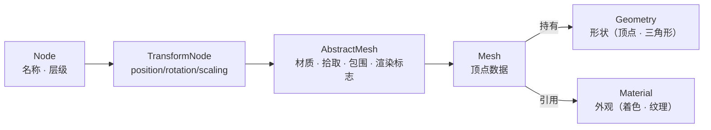

import { Canvas, Controls, Meta } from '@storybook/addon-docs/blocks';
import * as MeshStories from './mesh-and-meshbuilder.stories';

<Meta of={MeshStories} name="Docs" />

# 网格

Babylon.js 的 `Mesh` 是场景里**看得见**的对象：它继承自 `AbstractMesh`，再叠加一层几何数据，把“形状”和“外观”组合成一个可绘制表面。形状由 `geometry`（顶点与三角形）决定，外观由 `material`（受光、颜色、纹理）决定，两者可以独立替换、跨网格共享。创建内置形状的现代入口是 `MeshBuilder`：`CreateBox`、`CreateSphere`、`CreateCylinder`、`CreatePlane`、`CreateTorus`、`CreateCapsule`、`CreateGround`、`CreateDisc` 等静态方法各用一个 options 对象描述形状参数，比已弃用的 `BABYLON.Mesh.CreateBox` 位置参数串更清晰。

`Mesh` 继承自 `TransformNode`，因此 `position` / `rotation` / `scaling` 不在本课展开，见 [TransformNode](?path=/docs/transformnode-and-grouping--docs)；本课聚焦“形状创建”和“geometry 与 material 的组合”。



| 对象或概念 | 取值 / 默认 | 回查要点 |
| --- | --- | --- |
| 继承链 | `Node → TransformNode → AbstractMesh → Mesh` | 变换在 `TransformNode`；材质/拾取/包围在 `AbstractMesh`；顶点数据在 `Mesh` |
| `mesh.material` | 默认 `null`（回退到场景默认材质） | 赋任意 Material；多个 mesh 可共享同一份实例 |
| `mesh.geometry` | 创建时由 `MeshBuilder` 注入 | 可整体替换形状；改 `position` / `scaling` 不改顶点 |
| `MeshBuilder.CreateBox` | `{ size: 1 }`，或 `width/height/depth` | `size` 与三轴尺寸同时给时按各自值，省略时取 1 |
| `MeshBuilder.CreateSphere` | `diameter: 1`、`segments: 32` | `segments` 越大越平滑，顶点数近似平方增长 |
| `MeshBuilder.CreateCylinder` | `height: 2`、`diameter: 1`、`diameterTop/Bottom: 1`、`tessellation: 24`、`subdivisions: 1` | `diameterTop: 0` 得圆锥；上下不同得截锥 |
| `MeshBuilder.CreateTorus` | `diameter: 1`、`thickness: 0.5`、`tessellation: 16` | `tessellation` 是环上分段 |
| `MeshBuilder.CreateCapsule` | `height: 1`、`radius: 0.25`、`tessellation: 32`、`capSubdivisions: 6`、`subdivisions: 2` | `height` 含两端帽 |
| `MeshBuilder.CreatePlane` | `size: 1`（或 `width/height`），默认朝 `+Z` | 单面四边形，默认参与背面剔除 |
| `MeshBuilder.CreateGround` | `width` / `height`（自定）、`subdivisions: 1` | 水平面（XZ 平面），常用作地面 |
| `MeshBuilder.CreateDisc` | `radius: 0.5`、`tessellation: 64` | 平面圆盘，也在 XZ 之外可旋转 |
| `mesh.setEnabled(false)` | 默认 `true` | 移出场景图计算：不渲染、不拾取、不参与物理 |
| `mesh.isVisible = false` | 默认 `true` | 仍在场景图、仍算矩阵/拾取，只是不绘制 |
| `mesh.dispose()` | `dispose(doNotRecurse?, disposeMaterialAndTextures?)`；默认不释放共享 material/geometry | 切换形状前 dispose 旧 mesh；共享资源单独管理 |

## 快速上手

在已有 [Scene](?path=/docs/scene-container--docs) 里用 `MeshBuilder` 创建一个立方体，再赋一份 `StandardMaterial`：

```ts
import { Color3, MeshBuilder, StandardMaterial } from '@babylonjs/core';

// options 对象描述形状参数；scene 可省略，默认加入最后创建的 Scene。
const box = MeshBuilder.CreateBox('box', { size: 2 }, scene);

const mat = new StandardMaterial('boxMat', scene);
mat.diffuseColor = new Color3(0.3, 0.6, 0.9);
box.material = mat; // material 独立于 geometry，随时可替换
```

`MeshBuilder.CreateBox('box', { size: 2 }, scene)` 一次性完成“创建几何 + 注入到这个 Scene + 返回 Mesh”；`box.material` 是后赋的——这已经体现了形状与外观的分离。完整的 Engine/相机/光/渲染循环见 [第一幅画面](?path=/docs/first-scene--docs)。

## 继承链：从 Node 到 Mesh

`Mesh` 不是凭空出现的可绘制对象，而是层层叠加职责的结果。把链路拆开看，排查“看不见 / 不受光 / 不能拾取 / 不能变换”时才知道问题在哪一层：

| 层级 | 加进来的能力 | 本课边界 |
| --- | --- | --- |
| `Node` | 名称、父子层级、`getScene()` | 层级与启用状态见 [Node](?path=/docs/node--docs) |
| `TransformNode` | `position` / `rotation` / `scaling` / 世界矩阵 / `billboardMode` | 详见 [TransformNode](?path=/docs/transformnode-and-grouping--docs) |
| `AbstractMesh` | `material`、拾取、物理 impostor、包围盒/球、`isVisible`、`setEnabled`、渲染标志 | 本课讲材质赋值与开关；材质本身见 [材质](?path=/docs/materials--docs) |
| `Mesh` | 顶点数据（`geometry`、`setVerticesData`、`getTotalVertices` 等） | **本课主线**；自定义顶点见 [几何与顶点](?path=/docs/geometry-and-vertex-data--docs) |

`MeshBuilder.Create*` 返回的都是 `Mesh`。需要“一个有变换和材质、但不持有顶点数据的占位”时，用 `TransformNode`（分组）或 `AbstractMesh` 子类（如 `InstancedMesh`）；普通可见物体直接用 `Mesh`。

## 几何与材质的组合

`Mesh` 把两个独立对象拼成可绘制表面：

- **`geometry`（形状）**：顶点位置、法线、UV、索引等顶点数据。决定“长什么样”。
- **`material`（外观）**：受光规则、颜色、纹理、透明、背面剔除。决定“表面怎样写入颜色”。

两层可以独立替换，互不干扰：

```ts
// 换外观：保留形状，只换 material。
box.material = newMat;

// 换形状：保留对象变换和材质，换掉 geometry（共享另一网格的几何）。
box.geometry = sphere.geometry;

// 跨网格共享：两个 mesh 用同一份 geometry 和 material，节省内存与 draw call 状态切换。
const shared = MeshBuilder.CreateSphere('proto', { diameter: 1 }, scene);
const other = shared.clone('other'); // 克隆默认共享 geometry，可再换 material
```

改 `box.position` / `rotation` / `scaling` 只改实例变换，**不动顶点数据**；改 `geometry` 只改形状，不改变换；改 `material` 只改表面规则，不改形状。先分清这三层，“黑色物体 / 形状错 / 资源泄漏”才容易定位。

读取顶点和面数可以核对当前几何的复杂度：

```ts
const vertices = box.getTotalVertices(); // 顶点数（来自 geometry）
const indices = box.getTotalIndices();   // 索引数；三角形面数 ≈ indices / 3
```

`MeshBuilder` 生成的形状都有索引缓冲，`Math.floor(getTotalIndices() / 3)` 给出三角形面数。材质家族（Standard / PBR / Node、透明、wireframe、背面剔除）见 [材质](?path=/docs/materials--docs)；自定义顶点数据、`VertexData`、法线重算见 [几何与顶点](?path=/docs/geometry-and-vertex-data--docs)。

## MeshBuilder 创建内置形状

`MeshBuilder` 是创建内置形状的**现代入口**。所有方法签名一致：`MeshBuilder.Create<Shape>(name, options, scene?)`，`scene` 省略时加入最后创建的 Scene。options 是一个普通对象，字段名即参数名，省略时取默认值。

```ts
import { MeshBuilder } from '@babylonjs/core';

MeshBuilder.CreateBox('b', { size: 2 }, scene);
MeshBuilder.CreateSphere('s', { diameter: 2, segments: 24 }, scene);
MeshBuilder.CreateCylinder('c', { height: 3, diameter: 2, tessellation: 12 }, scene);
```

跨形状通用的 options 字段：`updatable`（是否允许后续 `updateVerticesData`，见 [几何与顶点](?path=/docs/geometry-and-vertex-data--docs)）、`sideOrientation`（`Mesh.FRONTSIDE` / `BACKSIDE` / `DOUBLESIDE`，影响背面剔除与 UV，详见 [材质](?path=/docs/materials--docs)）、`frontUVs` / `backUVs`（仅在 `DOUBLESIDE` 时分别用于正反面）。

### 常用形状与 options

| 方法 | 关键 options（默认值） | 形态与提示 |
| --- | --- | --- |
| `CreateBox` | `size: 1`；或 `width/height/depth` | 立方体 / 长方体；无 `segments` |
| `CreateSphere` | `diameter: 1`、`segments: 32` | UV 球；想做椭圆球用 `scaling`，不要给 `diameterX/Y/Z` |
| `CreateCylinder` | `height: 2`、`diameter: 1`、`diameterTop/Bottom: 1`、`tessellation: 24`、`subdivisions: 1` | `diameterTop: 0` 得圆锥；上下径不同得截锥 |
| `CreateTorus` | `diameter: 1`、`thickness: 0.5`、`tessellation: 16` | 圆环；`tessellation` 是环上分段 |
| `CreateCapsule` | `height: 1`、`radius: 0.25`、`tessellation: 32`、`capSubdivisions: 6`、`subdivisions: 2` | 胶囊（两端半球）；`height` 含帽 |
| `CreatePlane` | `size: 1`（或 `width/height`），默认朝 `+Z` | 单面四边形，默认参与背面剔除 |
| `CreateGround` | `width` / `height`、`subdivisions: 1` | 水平面（XZ 平面），常用作地面 |
| `CreateDisc` | `radius: 0.5`、`tessellation: 64` | 平面圆盘；`tessellation` 控制边缘平滑度 |

下面的实例用一个共享的 `StandardMaterial`，在六种内置形状之间切换，并显示当前形状名、顶点数和面数。切换形状时旧 mesh 被 `dispose()`，新 mesh 复用同一份 material——直接演示 geometry 与 material 的独立性。

<Canvas of={MeshStories.Shapes} />

<Controls of={MeshStories.Shapes} />

| 读者操作 | 可观察证据 |
| --- | --- |
| 切换「形状」到 `sphere` | 形状变成球，readout 显示 `CreateSphere`，顶点数 / 面数随 `segments` 改变 |
| 切换「形状」到 `box` 或 `plane` | 调「细分」时顶点数 / 面数**不变**——这两个形状没有细分参数 |
| 调「细分」从 `3` 到 `48`（sphere / cylinder / torus / ground） | 曲面边缘逐渐平滑，顶点数和面数明显上升 |
| 鼠标拖拽画布 | 轨道相机绕目标旋转，从各角度观察形状体积 |
| 打开 Show code | 看到该 Canvas 实际执行的 `example.ts`（`SHAPE_BUILDERS` 工厂表 + dirty 重建） |

## 旧 API 与 MeshBuilder 的区别

旧式 `BABYLON.Mesh.CreateBox(name, size, scene, updatable?)` 用位置参数串，`scene` 在可选项之前必填，扩展新参数时调用点全部要改。它已被标记为 **deprecated**，新版文档和示例统一用 `MeshBuilder`：

| 维度 | `BABYLON.Mesh.CreateBox`（旧，弃用） | `MeshBuilder.CreateBox`（现代） |
| --- | --- | --- |
| 参数形式 | 位置参数：`(name, size, scene, updatable, ...)` | options 对象：`(name, { size, width, ... }, scene?)` |
| `scene` | 在可选项之前必填 | 可省略，默认加入最后创建的 Scene |
| 扩展性 | 加参数改所有调用点 | 加字段不动旧调用 |
| 状态 | 已弃用，保留向后兼容 | 推荐入口，新特性优先落地 |

旧代码迁移时直接换成等价的 `MeshBuilder.CreateXxx(name, options, scene)`；行为一致，不必保留旧调用。

## 启用、可见与释放

“暂时不显示”“暂时退出场景逻辑”“彻底删除”是三种不同需求，对应三个不同层级的方法：

| 需求 | 方法 | 影响范围 |
| --- | --- | --- |
| 临时隐藏，仍参与场景 | `mesh.isVisible = false` | 只跳过绘制；矩阵、拾取、物理照常 |
| 暂时移出场景逻辑 | `mesh.setEnabled(false)` | 不渲染、不拾取、不参与物理；连带子节点 |
| 彻底释放资源 | `mesh.dispose()` | 释放该 mesh 的 GPU 资源；默认**不**释放共享的 material / geometry |

```ts
mesh.isVisible = false;       // 还在场景里，只是不画
mesh.setEnabled(false);       // 移出场景图计算
mesh.dispose();               // 释放该 mesh；共享 material/geometry 默认保留
mesh.dispose(false, true);    // 第二参 disposeMaterialAndTextures=true，连同释放（慎用，会影响共享者）
```

`dispose()` 的第二参 `disposeMaterialAndTextures` 默认 `false`——这正是上面实例能“共享一份 material、反复 dispose 旧 mesh”的原因。如果某份 material / geometry 只被这一个 mesh 使用，且确认要彻底回收，再显式传 `true`；否则让共享资源由你自己统一管理。完整的 dispose 策略、freeze、draw call 与按需渲染见 [性能](?path=/docs/performance-and-disposal--docs)。

## 最佳实践

- 新代码一律用 `MeshBuilder.CreateXxx(name, options, scene?)`；不要再用 `BABYLON.Mesh.CreateXxx`，它已弃用且参数难维护。
- 多个外观相同的 mesh 共享同一份 material 实例（`mesh.material = sharedMat`），节省内存和材质状态切换；需要独立外观时各自 `new` 或 `clone`。
- 形状相同的物体可以共享 `geometry`（克隆或显式赋值），再各自挂不同 material；顶点数据越复杂，收益越明显。
- “隐藏一会儿”用 `isVisible`，“暂时退出场景逻辑（不拾取、不物理）”用 `setEnabled`，“再也不用”用 `dispose`。
- 切换一个槽位上的形状时，先 `oldMesh.dispose()` 再 `MeshBuilder.CreateXxx(...)`；共享 material 不要在每次切换里 `dispose(true)`。
- 内置形状能覆盖的需求不要手搓顶点；需要程序化几何、自定义顶点属性或动态修改时再走 [几何与顶点](?path=/docs/geometry-and-vertex-data--docs)。

## 常见问题

- 为什么旧代码里 `BABYLON.Mesh.CreateBox` 还能跑，但文档不推荐？
  它已被标记为 deprecated。位置参数多、`scene` 在可选项之前必填、扩展性差。迁移成 `MeshBuilder.CreateBox(name, { size }, scene)` 即可，行为等价。
- 为什么我只改了一个 mesh 的 material，结果几个 mesh 的外观都变了？
  它们共享同一份 material 实例（`m1.material = m2.material = mat`）。需要独立外观时各自 `new StandardMaterial(...)`，或用 `mat.clone('newName')` 复制一份。
- 为什么 `MeshBuilder.CreateSphere` 传 `diameterX/Y/Z` 不生效，得到的还是正球？
  `CreateSphere` 只认各向同性的 `diameter`。要椭圆球，创建正球后改 `mesh.scaling.set(sx, sy, sz)`。
- 为什么 `CreatePlane` / `CreateGround` 从背面看不到了？
  默认 `sideOrientation` 是 `FRONTSIDE` 并开启背面剔除。设 `sideOrientation: Mesh.DOUBLESIDE`，或在材质上 `mat.backFaceCulling = false`。
- 为什么 `mesh.dispose()` 之后，另一个 mesh 变黑或消失？
  你很可能传了 `dispose(true)`（`disposeMaterialAndTextures=true`），连同释放了共享的 material / texture。默认 `false` 不释放共享资源；确要回收时再显式传，并确认没有其他 mesh 在用。
- 为什么 `getTotalIndices() / 3` 和肉眼数到的“面”不太一样？
  它返回的是三角形数。带 `subdivisions` 的 `CreateGround`、`CreateCylinder(hasRings)` 等会被拆成更多三角形；按三角形计数是统一口径。

## 总结回顾

摘要：

`Mesh` 是 `Node → TransformNode → AbstractMesh → Mesh` 链上的可见对象：变换在前两层，材质 / 拾取 / 包围 / 渲染标志在 `AbstractMesh`，顶点数据在 `Mesh`。形状由 `geometry` 决定、外观由 `material` 决定，两者独立替换、跨网格共享；改 `position` 不改顶点，改 `material` 不改形状。`MeshBuilder.CreateBox / CreateSphere / CreateCylinder / CreatePlane / CreateTorus / CreateCapsule / CreateGround / CreateDisc` 是创建内置形状的现代入口，统一的 `(name, options, scene?)` 签名取代了已弃用的 `BABYLON.Mesh.CreateXxx` 位置参数串。`isVisible` 只跳过绘制、`setEnabled` 移出场景逻辑、`dispose` 释放 GPU 资源（默认不释放共享的 material / geometry）。

一句话：

> `Mesh` 是组合 `geometry`（形状）与 `material`（外观）的可见对象；用 `MeshBuilder.CreateXxx(name, options, scene)` 创建内置形状，`isVisible` / `setEnabled` / `dispose` 分别对应隐藏、停用、回收。

知识要点：

- `Mesh` 的继承链每层各加什么能力？排查“看不见 / 不受光 / 不能拾取 / 不能变换”时分别落在哪一层？
- `geometry` 与 `material` 怎样独立替换和共享？改 `position` / `scaling` 会不会动顶点数据？
- `MeshBuilder.CreateBox / CreateSphere / CreateCylinder` 的 options 各有哪些字段和默认值？
- `BABYLON.Mesh.CreateBox` 为什么被弃用？迁移成 `MeshBuilder` 的等价写法是什么？
- `isVisible`、`setEnabled`、`dispose` 各影响哪一层？`dispose` 默认会不会释放共享的 material / geometry？
- 怎样读取当前 mesh 的顶点数和三角形面数？

## 参考资料

- [Babylon.js TypeDoc：MeshBuilder](https://doc.babylonjs.com/typedoc/classes/BABYLON.MeshBuilder)
- [Babylon.js TypeDoc：Mesh](https://doc.babylonjs.com/typedoc/classes/BABYLON.Mesh)
- [Babylon.js TypeDoc：AbstractMesh（`material` / `setEnabled` / `isVisible` / `dispose`）](https://doc.babylonjs.com/typedoc/classes/BABYLON.AbstractMesh)
- [Babylon.js Features：Mesh Creation（含旧 API 弃用说明与各形状 options）](https://doc.babylonjs.com/features/featuresDeepDive/mesh/creation)
- [Babylon.js Features：Set Shapes（Box / Sphere / Cylinder / Torus / Capsule / Plane / Ground / Disc）](https://doc.babylonjs.com/features/featuresDeepDive/mesh/shapes)
- [Babylon.js Guided Learning](https://doc.babylonjs.com/guidedLearning/)
