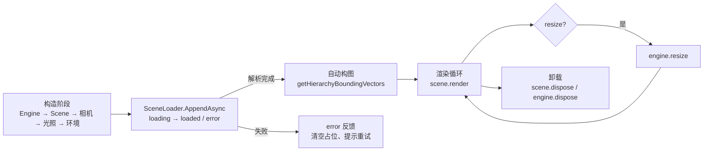

import { Canvas, Controls, Meta } from '@storybook/addon-docs/blocks';
import * as ViewerStories from './minimal-viewer.stories';

<Meta of={ViewerStories} name="Docs" />

# 查看器

最小查看器不是新概念，而是把已经分开练过的几件事按一条生命周期串起来：`Engine` 包 canvas、`Scene` 装对象、`ArcRotateCamera` 选视角、光照 + 环境打底、`SceneLoader.AppendAsync` 把模型解析进 scene、加载状态让用户看见进度、`engine.resize` 同步画布尺寸。每一件都在自己的课里讲过；本课只回答"它们怎样共同组成一个可用的查看器"，不重讲各组件细节。

组合的难点不在任何单个组件，而在三件事：**构造顺序**、**加载完成时机**和**更新时机**。模型加载是异步的——加载完之前没有 mesh 可看、算包围盒也得到空结果；加载完之后才能用 `getHierarchyBoundingVectors` 给相机 reframe。resize 要把画布尺寸、相机投影和 `engine.resize()` 一起完成。加载状态要让用户能区分"还在加载"和"加载失败"，否则空白画布就是诊断黑洞。



| 部件 | 在查看器里的职责 | 默认 / 常用起点 |
| --- | --- | --- |
| `Engine` | 包裹 canvas，驱动 `runRenderLoop`，监听 resize | `new Engine(canvas, true)`；本课 runtime 进一步开启 stencil/preserveDrawingBuffer |
| `Scene` | 收纳相机、光照、环境与加载进来的模型 | `new Scene(engine)`；`clearColor` 设背景色 |
| `ArcRotateCamera` | 绕 target 旋转、滚轮缩放，加载后 reframe | `attachControl(canvas, true)`；`lowerRadiusLimit` 防穿模 |
| `HemisphericLight` + `DirectionalLight` | 给受光材质打底 + 阴影方向 | studio 两盏、ambient 只留半球光 |
| `createDefaultEnvironment` | 一次性建 skybox + ground + 环境贴图 | **默认 skyboxTexture / environmentTexture 走 CDN**，离线要禁用或自备 |
| `SceneLoader.AppendAsync` | 把整份模型文件追加进 scene | `(rootUrl, sceneFilename, scene)` → `Promise<Scene>` |
| 加载状态 | loading → loaded / error 三态反馈 | `try / catch` + `onProgress` 回调 |
| `getHierarchyBoundingVectors` | 算模型世界包围盒，给相机取景 | 加载完成后调一次 |
| `engine.resize` | 画布尺寸变化时同步 drawing buffer | 容器 resize 时调；本课 runtime 已自动 |

各部件的细节这里不再重讲：相机家族与 Behavior 见 [相机与控制](?path=/docs/cameras-and-controls--docs)，光源类型见 [光源](?path=/docs/lights--docs)，`SceneLoader` 家族、glTF 插件与 `AssetContainer` 见 [加载模型](?path=/docs/sceneloader-and-gltf--docs)，环境贴图、雾与 `clearColor` 见 [Scene](?path=/docs/scene-container--docs)，渲染循环与 `getDeltaTime` 见 [渲染循环与时间](?path=/docs/render-loop-and-timing--docs)，画布尺寸与 `engine.resize` 见 [坐标与尺寸](?path=/docs/coordinate-system-and-units--docs)。

## 部件与构造顺序

查看器的骨架按依赖关系分层建起来。构造顺序固定，是因为后面的对象要用到前面的：

```ts
import {
  ArcRotateCamera,
  DirectionalLight,
  Engine,
  HemisphericLight,
  Scene,
  Vector3,
} from '@babylonjs/core';

// 1. Engine 包裹 canvas，拿 WebGL 上下文。
const engine = new Engine(canvas, true);

// 2. Scene 持有这一帧要画的所有对象。
const scene = new Scene(engine);

// 3. 相机决定从哪里看；要在模型加载前建好，加载完成后用它 reframe。
const camera = new ArcRotateCamera(
  'camera',
  -Math.PI / 2.4,
  Math.PI / 2.8,
  12,
  new Vector3(0, 2, 0),
  scene,
);
camera.attachControl(canvas, true);

// 4. 光照：受光材质（StandardMaterial / PBRMaterial）必须有光才可见。
new HemisphericLight('hemi', new Vector3(0.3, 1, 0.4), scene);
new DirectionalLight('dir', new Vector3(-0.55, -1, -0.45), scene);

// 5. 渲染循环：Engine 不持有 scene，回调里必须显式 render 哪一个。
engine.runRenderLoop(() => scene.render());

// 6. resize：窗口 / 容器尺寸变化时同步 drawing buffer。
window.addEventListener('resize', () => engine.resize());
```

| 顺序 | 必须在前的原因 |
| --- | --- |
| Engine → Scene | `new Scene(engine)` 要传 engine |
| Scene → 相机 / 光照 / Mesh | 这些构造时传入 scene 才会登记进集合 |
| 相机 → `attachControl` | `attachControl` 把输入绑到具体相机 |
| 相机 / 光照 → 加载模型 | 模型挂进来的 scene 必须已有视角和光，否则加载完也看不见 |
| 渲染循环 → resize 监听 | 两者都依赖 engine 已建好；runtime 通常接管这两件 |

本课实例用 `assets/babylon-canvas.js` 的 `createBabylonRuntime(canvas, setup)` 把渲染循环、视口可见性启停、`engine.resize` 和 `scene.dispose / engine.dispose` 一次性包好；`setup` 里只关心"这一帧画什么"。这是命令式交互课的统一写法，不自造渲染循环。

## 加载状态：loading → loaded / error

模型加载是真实异步——`AppendAsync` 返回 `Promise<Scene>`，解析完成前 scene 里没有新对象。等待期间用户面对的是一块空白画布；要让"加载 → 完成 → 失败"可观察，必须把三条状态路径都接出来：

```ts
import { SceneLoader } from '@babylonjs/core';
import '@babylonjs/loaders/glTF'; // 注册 glTF / GLB 插件，副作用导入

try {
  setState('loading');
  // onProgress 在文件下载过程中触发，event.loaded / event.total 是字节比。
  await SceneLoader.AppendAsync('/models/', 'turbine.glb', scene, (event) => {
    if (event.lengthComputable) {
      setProgress(Math.round((event.loaded / event.total) * 100));
    }
  });
  setState('loaded');
  frameOnModel(); // 加载成功后立刻用包围盒 reframe 相机
} catch (err) {
  console.error('加载失败：', err);
  setState('error'); // 404、解析失败、插件缺失都走这里
}
```

三条状态对应三件可观察的事：

| 状态 | 触发时机 | 适合做什么 |
| --- | --- | --- |
| `loading` | `AppendAsync` 调用后立即 | 显示加载指示、进度条；不要假设 scene 已有模型 |
| `loaded` | Promise resolve | reframe 相机、启动模型动画、开放交互 |
| `error` | Promise reject 或 `onError` 回调 | 清空占位、提示重试、记录失败 URL 与原因 |

`onProgress` 的 `event.lengthComputable` 在服务器不返回 `Content-Length` 时为 `false`，要兜底——不要假设总能算出百分比。错误来源（插件未注册、HTTP 错误、解析失败、外部依赖 404）和具体处理见 [加载模型](?path=/docs/sceneloader-and-gltf--docs)；本课只关心"加载状态如何与查看器其它部件协作"。

## 加载后自动构图

模型加载成功不代表它就在相机视野里。glTF 的局部坐标系由导出器决定：可能以原点为枢轴，也可能以脚底、几何中心或随机点为枢轴；尺度也可能是任意单位。直接挂进场景，相机看到的可能是空画面、远处一个小点，或被截断的局部。

正确做法：加载完成后用 `root.getHierarchyBoundingVectors(true)` 在世界坐标系里算包围盒，再用它的中心和尺寸给相机取景。`true` 表示包含所有子孙节点。

```ts
function frameOnModel() {
  const { min, max } = modelRoot.getHierarchyBoundingVectors(true);
  const center = min.add(max).scale(0.5);
  const size = max.subtract(min);
  const extent = Math.max(size.x, size.y, size.z);

  camera.setTarget(center);          // 旋转中心放到模型中心
  camera.radius = extent * 1.6 + 2;  // 半径留出 1.6 倍余量 + 兜底
}
```

`setTarget` 改的是 `camera.target`——ArcRotateCamera 绕它旋转，因此**取景时必须同时更新 target 和 radius**，否则拖动时模型会"滑出画面"，因为旋转中心不在模型上。

`FramingBehavior` 是把上面这套逻辑包成动画的便捷替代。`camera.useFramingBehavior = true` 后，挂载的 `FramingBehavior` 提供 `zoomOnMesh(mesh)` / `zoomOnMeshHierarchy(mesh)` / `zoomOnMeshesHierarchy(meshes)`，会用 `framingTime`（默认 1500 ms）的动画把相机平滑推到模型上，并在过渡中按 `radiusScale` / `positionScale`（默认 1.0 / 0.5）调整半径与目标高度：

```ts
camera.useFramingBehavior = true;
// framingBehavior 是 useFramingBehavior=true 后挂载的实例。
camera.framingBehavior.framingTime = 800;     // 过渡时长，毫秒
camera.framingBehavior.radiusScale = 0.9;     // 半径缩放系数
// 加载完成后让 behavior 把相机推到模型上。
camera.framingBehavior.zoomOnMeshHierarchy(topMesh);
```

`FramingBehavior` 默认 `mode = FramingBehavior.FitFrustumSidesMode`，会把模型贴满视锥边；另外两种 `FitFrustumVMode`（垂直贴满）和 `AimFrustumMode`（只瞄准、不变距离）较少使用。两种取舍：手写 `getHierarchyBoundingVectors` 直观、可控、无动画延迟，适合"加载完立刻定位"；`FramingBehavior` 自带动画、写法短，适合"用户触发聚焦"或交互式浏览。本课实例走前一种，把构图时机和读数对照展示给读者。

## 环境与光照预设

查看器的"环境"由两件独立的事支撑：**光照**（让受光材质可见）和**背景 / 地面**（给空间参照）。glTF 模型默认用 PBR 材质，对环境光和方向光都敏感；缺光时偏暗甚至看似不可见。

`scene.createDefaultEnvironment(options)` 是一次性搭出 skybox + 地面 + 环境贴图的便捷入口，返回 `EnvironmentHelper`：

```ts
const env = scene.createDefaultEnvironment({
  createGround: true,
  groundSize: 50,
  createSkybox: true,
  skyboxSize: 60,
  environmentTexture: '/env/workshop.env', // 喂给 PBR 的环境贴图
});
// 不再使用时：env.dispose() 一次性释放天空盒、地面与贴图。
```

> **离线坑：** `createDefaultEnvironment` 的 `skyboxTexture` 和 `environmentTexture` **默认值都指向 Babylon 官方 CDN**。在线上效果很好，离线或内网部署时会 404，导致天空盒和环境贴图为空、PBR 反射消失。两个规避办法：(1) 显式传 `skyboxTexture: '/env/your-skybox.dds'` 与 `environmentTexture: '/env/your-env.env'`，(2) 不用 helper，自己组合 `HemisphericLight` + `DirectionalLight` + `MeshBuilder.CreateGround` + `scene.clearColor`，把环境贴图留给 PBR 课程。本课实例走第二种，保证离线 Canvas 可用。

查看器常备两种光照预设，按场景切换：

| 预设 | 配置 | 适用 |
| --- | --- | --- |
| `studio`（影棚） | `HemisphericLight` 打底 + `DirectionalLight` 给阴影方向 | 模型展示、需要体积感、贴图细节评估 |
| `ambient`（环境） | 仅一盏 `HemisphericLight`，强度高 | 柔和预览、减少反差、检查几何轮廓 |

PBR 模型还要配 `scene.environmentTexture`（IBL）才看得出金属度 / 粗糙度的反射差异，详见 [PBR 与环境](?path=/docs/pbr-and-environment--docs)；本课 StandardMaterial 占位模型不依赖 IBL，光照预设只切方向光。

## resize 与生命周期

画布尺寸变化时必须调 `engine.resize()`，让 drawing buffer 重新匹配 CSS 尺寸，否则画面会被拉伸或裁剪。监听对象选真正控制画布布局的容器，不要只监听 `window.resize`——侧栏折叠、路由切换、`ResizeObserver` 触发的容器尺寸变化都不会让 `window.resize` 发生：

```ts
// 最简单：监听 window。适合画布占满视口的页面。
window.addEventListener('resize', () => engine.resize());

// 更稳：用 ResizeObserver 监听画布父容器。
const observer = new ResizeObserver(() => engine.resize());
observer.observe(canvas.parentElement);
```

`engine.resize()` 内部会读 `canvas.clientWidth / clientHeight`、重设 drawing buffer、并通知活动相机的视口；不需要再手动改 `camera.aspect`（Babylon 相机没有 three.js 那样的 `aspect` 字段，视口由 `camera.viewport` + engine 尺寸决定）。本课共享 runtime（`assets/babylon-canvas.js`）已经把 resize 接到 `ResizeObserver` 上，实例不用自己挂。

卸载顺序遵循"先停输入、再停渲染、最后释放资源"：

```ts
function disposeViewer(engine, scene) {
  // 共享 runtime 的 dispose() 已经按这个顺序包好，下面只是展开说明。
  engine.stopRenderLoop();   // 1. 停渲染循环
  observer.disconnect();     // 2. 断开 resize / 可见性 observer
  window.removeEventListener('resize', onResize);
  scene.dispose();           // 3. 释放 scene 内所有 mesh / 材质 / 纹理
  engine.dispose();          // 4. 释放 WebGL 上下文
}
```

`scene.dispose()` 会递归释放它持有的 mesh、材质、纹理和 GPU 资源；用 `AssetContainer` 加载的模型要 `container.dispose()` 才能彻底回收显存（`removeAllFromScene` 只摘节点、不动显存，详见 [加载模型](?path=/docs/sceneloader-and-gltf--docs)）。完整的 dispose 策略、按需渲染和性能权衡见 [性能](?path=/docs/performance-and-disposal--docs)。

## 一个最小可用的查看器

下面的实例把上述部件组合成一个可运行查看器：`ArcRotateCamera` 可拖拽、滚轮缩放；占位模型（一台风力涡轮机，叶片自转）模拟加载成功后的对象；readout 实时给出状态、加载源、根节点、相机距离、mesh 数和 FPS。

> **离线占位说明：** 本 Storybook 工作区只装了 `@babylonjs/core`，没有 `@babylonjs/loaders`，无法在 Canvas 里真正 `SceneLoader.AppendAsync` 一个 `.glb`。实例用 `MeshBuilder` 程序化构造占位模型，并用 `setTimeout` 模拟加载延迟，复刻真实查看器的三条状态路径（loading → loaded / error）。`getHierarchyBoundingVectors`、`engine.resize`、`scene.dispose / engine.dispose`、光照预设切换都是真实的 `@babylonjs/core` API；真实 `SceneLoader` 用法见上文代码片段和 [加载模型](?path=/docs/sceneloader-and-gltf--docs)。

<Canvas of={ViewerStories.Viewer} />

<Controls of={ViewerStories.Viewer} />

| 读者操作 | 可观察证据 |
| --- | --- |
| 进入页面（默认 `source=ok`） | 读数「状态」先显示「加载中」0.6s，再变为「已加载」；涡轮机出现、叶片自转、相机自动对准模型中心 |
| 切「加载源」到 `missing` | 读数「状态」回到「加载中」0.6s，然后变为「加载失败」；涡轮机整组消失，画面只剩地面与背景色 |
| 切「光照预设」到 `ambient` | 方向光关闭，模型明暗反差减弱、阴影方向感消失；切回 `studio` 体积感恢复 |
| 取消勾选「加载后自动构图」后重切 `source` | 加载完成后相机停在初始半径 12，模型不一定在画面中心——证明 reframe 必须在加载完成后显式触发 |
| 拖拽 / 滚轮 Canvas | `ArcRotateCamera` 绕 target 旋转、缩放；读数「相机距离」实时变化 |
| 缩放浏览器窗口 | Canvas 自适应缩放、画面不拉伸；共享 runtime 已接 `ResizeObserver → engine.resize` |
| 读数「mesh 数」 | `ok` 时显示 6（底座 + 塔杆 + 机舱 + 三片叶片），地面不计数；`missing` / `loading` 时为 0 |
| 打开 Show code | 看到该 Canvas 实际执行的 `example.ts`：状态机 + `getHierarchyBoundingVectors` + 光照切换 |

实例离屏时停止渲染循环、回到视口附近再恢复，避免空转；调度策略见 [渲染循环与时间](?path=/docs/render-loop-and-timing--docs)。

## 最佳实践

- 构造顺序固定为 Engine → Scene → 相机 → 光照 → 环境 → 加载；后面的对象依赖前面，建反了会拿到空对象或加载完也看不见。
- 加载状态三态（loading / loaded / error）都要接：用 `try / catch` + `onProgress`，让用户能区分"在加载"和"加载失败"；`onProgress` 的 `lengthComputable` 为 `false` 时只显示"加载中"。
- 加载完成后立刻 `getHierarchyBoundingVectors(true)` 取景，同时更新 `camera.target` 和 `radius`；不要假设模型以原点为中心或单位已知。
- 需要平滑动画时用 `FramingBehavior.zoomOnMeshHierarchy`，把过渡时长和半径系数交给 behavior；需要"立刻定位"或精确控制时手写包围盒 reframe。
- 离线或内网部署时，显式传 `skyboxTexture` / `environmentTexture`，或不用 `createDefaultEnvironment` 改自己搭环境；默认值指向 CDN 会 404。
- resize 监听真正控制画布布局的容器（`ResizeObserver`），不要只监听 `window.resize`；调 `engine.resize()` 即可，不需要再手改相机投影字段。
- 卸载顺序固定：`stopRenderLoop` → 断 observer / 事件 → `scene.dispose` → `engine.dispose`；`AssetContainer` 加载的模型用 `container.dispose` 彻底释放显存。
- 同页多 Canvas 用 `IntersectionObserver` 让离屏画布暂停，限制同时活跃的 WebGL 上下文数量；共享 runtime 已经做了这件事。

## 常见问题

- 为什么加载成功却完全看不见模型？
  先 `root.getHierarchyBoundingVectors(true)` 打印 `min/max`，确认是否单位过大 / 过小、根节点是否偏离原点；再确认相机 `target` 是否对准模型中心、`radius` 是否足够；最后检查场景里是否有光照（glTF 的 PBR 材质缺光会偏暗甚至看似不可见）。
- 为什么拖动相机时模型会"滑出画面"？
  取景时只改了 `camera.radius` 没更新 `camera.target`，旋转中心仍在原点。`camera.setTarget(center)` 把旋转中心挪到模型中心，再调 `radius`。
- 为什么 `createDefaultEnvironment` 后看不到天空盒，PBR 反射也消失？
  默认 `skyboxTexture` / `environmentTexture` 走 Babylon 官方 CDN；离线或内网会 404。显式传本地路径，或不用 helper 自己搭环境。
- 为什么 `engine.resize()` 调了，画面还是被拉伸？
  通常监听错了对象：监听了 `window.resize`，但画布尺寸是由侧栏折叠或容器布局变化的。改用 `ResizeObserver` 监听画布父容器。也要确认画布 CSS 有非零尺寸。
- 为什么 `onProgress` 进度条卡在 0% 不动？
  服务器没返回 `Content-Length` 时 `event.lengthComputable` 为 `false`、`total` 为 0。按 `lengthComputable` 兜底，只显示"加载中"而不算百分比。
- 为什么重新加载后旧模型还在画面里？
  重载前没清空。手写时要 `oldRoot.dispose(false, true)` 释放整组；用 `AssetContainer` 时 `removeAllFromScene` 只摘节点，下一次 `addAllToScene` 前要先 `dispose` 旧容器或用同一个容器复用。
- 为什么叶片自转 / 模型动画在 error 态还在继续？
  动画驱动器（`onBeforeRenderObservable` 回调或 `AnimationGroup`）需要按状态启停。本课实例在 `onBeforeRenderObservable` 里判 `loadState === 'loaded'` 才推进叶片，error / loading 态不转。
- 为什么路由切换后旧查看器的 canvas 还在响应 resize？
  卸载时漏了断开 `ResizeObserver` 或 `window.resize` 监听。共享 runtime 的 `dispose()` 已经把 observer 断开；自己接手时记得配对清理。

## 总结回顾

摘要：

最小查看器把 Engine、Scene、ArcRotateCamera、光照、环境、`SceneLoader.AppendAsync`、加载状态反馈和 resize 按一条生命周期串起来。构造顺序固定（Engine → Scene → 相机 → 光照 → 环境 → 加载），因为后面的对象依赖前面。加载是真实异步，三态（loading → loaded / error）都要接，用 `try / catch` + `onProgress` 让用户区分"加载中"和"加载失败"。加载完成后用 `getHierarchyBoundingVectors(true)` 算包围盒，同时更新 `camera.target` 和 `radius` 才能让模型进入视野并保持旋转中心在模型上；需要平滑动画时换 `FramingBehavior.zoomOnMeshHierarchy`。`createDefaultEnvironment` 默认 skybox / 环境贴图走 CDN，离线要禁用或自备。resize 监听真正控制布局的容器、调 `engine.resize()`；卸载顺序为 `stopRenderLoop` → 断 observer → `scene.dispose` → `engine.dispose`。本课不重讲各组件细节，只回答"它们怎样共同组成一个可用查看器"。

一句话：

> 加载完才能构图，构图时同时更新 target 和 radius，加载状态三态都要让用户看见，resize 和 dispose 都按固定顺序做。

知识要点：

- 一个最小查看器至少包含哪些部件？构造顺序为什么固定？
- 加载状态有哪三态？`onProgress` 和 `try / catch` 各覆盖什么路径？
- 加载成功后为什么必须用 `getHierarchyBoundingVectors` 取景？只改 radius 不改 target 会发生什么？
- `FramingBehavior` 与手写包围盒 reframe 各自适合什么场景？默认 `framingTime` 是多少？
- `createDefaultEnvironment` 的默认 skybox / 环境贴图为什么离线会失败？两种规避办法是什么？
- studio 与 ambient 两种光照预设差在哪？分别适合什么场景？
- resize 要监听什么对象？调 `engine.resize()` 后还需要手动改相机投影吗？
- 卸载一个查看器要释放哪几类资源？顺序如何？

## 参考资料

- [Babylon.js TypeDoc：ArcRotateCamera（setTarget / radius / lowerRadiusLimit / attachControl）](https://doc.babylonjs.com/typedoc/classes/BABYLON.ArcRotateCamera)
- [Babylon.js TypeDoc：FramingBehavior（zoomOnMeshHierarchy / framingTime / radiusScale / positionScale / mode）](https://doc.babylonjs.com/typedoc/classes/BABYLON.FramingBehavior)
- [Babylon.js TypeDoc：SceneLoader（AppendAsync / onProgress）](https://doc.babylonjs.com/typedoc/classes/BABYLON.SceneLoader)
- [Babylon.js TypeDoc：Engine（resize / stopRenderLoop / dispose / runRenderLoop）](https://doc.babylonjs.com/typedoc/classes/BABYLON.Engine)
- [Babylon.js TypeDoc：AbstractMesh.getHierarchyBoundingVectors](https://doc.babylonjs.com/typedoc/classes/BABYLON.AbstractMesh)
- [Babylon.js Features：Environment Introduction（createDefaultEnvironment / EnvironmentHelper）](https://doc.babylonjs.com/features/featuresDeepDive/environment/environment_introduction)
- [Babylon.js Features：Build a World Quickly with Scene Helpers](https://doc.babylonjs.com/features/featuresDeepDive/scene/fastBuildWorld)
- [Babylon.js Guided Learning](https://doc.babylonjs.com/guidedLearning/)
- [Babylon.js API Reference (TypeDoc)](https://doc.babylonjs.com/typedoc/)
