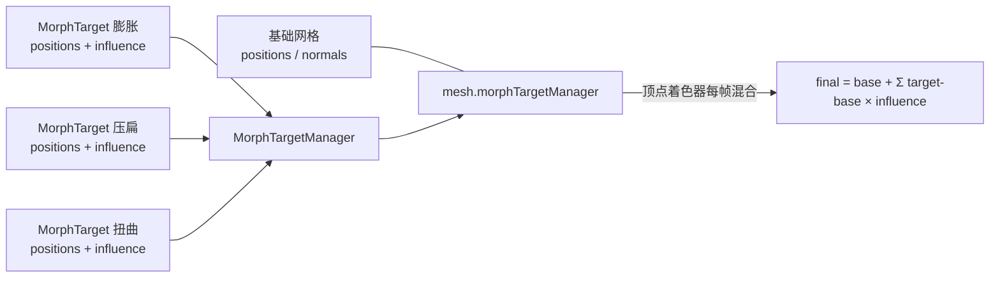

import { Canvas, Controls, Meta } from '@storybook/addon-docs/blocks';
import * as Stories from './morph-targets.stories';

<Meta of={Stories} name="Docs" />

# 形变动画

[4.2 动画](?path=/docs/animation-system--docs) 的 `Animation` 在**属性层面**做关键帧插值——动 `position.x`、`rotation.y` 这些少数几个数。本课换到**顶点形状层面**：一个网格的整组顶点位置（可能上千个），在几个预设形状之间加权混合。`MorphTargetManager` 收集若干 `MorphTarget`，每个 target 携带一组目标顶点位置（和可选法线）；把它挂到 `mesh.morphTargetManager` 后，**混合在 GPU 顶点着色器里完成**——CPU 端的 positions 缓冲不变，每帧由 GPU 按 influence 权重算出最终顶点。

一句话区分：4.2 插值的是"对象属性随时间怎么走"；本课插值的是"对象形状在几个预设之间怎么混合"。GPU 按这条公式（来自官方文档）混合每个顶点：

```
final = base + Σ((target - base) × influence)
```

influence=0 时 target 贡献为 0，回到原始；influence=1 时 final=target；中间值是线性混合。多个 target 叠加时各项相加。两套机制还能组合——`MorphTarget.influence` 本身是个 number，可以用 4.2 的 `Animation` 来驱动它（见末节）。



| 对象 / API | 默认 / 取值 | 回查要点 |
| --- | --- | --- |
| `new MorphTargetManager(scene?)` | scene 可选 | 收集 target 的管理器；通过 `mesh.morphTargetManager = manager` 挂到网格 |
| `MorphTarget.FromMesh(mesh, name?, influence?)` | influence 省略时为 `0` | 从同拓扑网格克隆 positions / normals / uvs 等；最常用的工厂 |
| `new MorphTarget(name, influence=0, scene?)` + `setPositions(data)` | influence 默认 `0` | 程序化生成；再 `setNormals(data)` 可让光照跟随形变 |
| `manager.addTarget(target)` | — | 注册 target；挂载前后均可添加 |
| `target.influence` | `0-1`，默认 `0` | 顶点混合权重；为 `0` 时该 target 不生效（被优化跳过） |
| `mesh.morphTargetManager` | 默认 `null` | 挂上管理器；混合在 GPU 完成，CPU positions 不变 |
| `manager.numMaxInfluencers` | 默认 `0` | `0` 表示活跃数变化时重编译 shader；设为预期上限可避免卡顿 |
| `manager.numInfluencers` | 只读 | 当前 `influence > 0` 的 target 数（`optimizeInfluencers=true` 时） |

## 管理器与目标

三个对象的关系：`Mesh` 是被变形的基础网格，持有原始 positions/normals；`MorphTargetManager` 收集一组 `MorphTarget`，算出哪些 target 处于活跃、把数据交给渲染管线；`MorphTarget` 是一组目标顶点数据（positions，可选 normals/uvs/tangents/colors）加一个 influence 权重。把 manager 挂到 mesh，顶点着色器在每次绘制时按公式混合。

最小流程——先建基础网格，再建 manager 和 target，最后挂载：

```ts
import { MeshBuilder, MorphTarget, MorphTargetManager } from '@babylonjs/core';

const sphere = MeshBuilder.CreateSphere('sphere', { diameter: 2, segments: 24 }, scene);

const manager = new MorphTargetManager(scene);
manager.addTarget(smileTarget);
manager.addTarget(frownTarget);
sphere.morphTargetManager = manager; // 挂载后混合在 GPU 完成
```

target 可以在挂载前后添加，manager 会自动同步。挂在多个 mesh 上时它们共享同一个 manager。

### MorphTarget.FromMesh：从同拓扑网格生成

最常用的工厂：建一个顶点数相同的"目标网格"（复制基础网格再改形状，或用相同构造参数生成），`FromMesh` 把它的 positions/normals/uvs/tangents/colors 克隆进新的 target。

```ts
// 与基础网格同构造参数，保证顶点数与拓扑一致
const smileMesh = MeshBuilder.CreateSphere('smileSrc', { diameter: 2, segments: 24 }, scene);
// ...对 smileMesh 的顶点做位移（编辑器、程序化、bake 变换等）...
smileMesh.setEnabled(false); // 目标网格只作数据源，不渲染

const smileTarget = MorphTarget.FromMesh(smileMesh, 'smile', 0); // 第 3 参为初始 influence
manager.addTarget(smileTarget);
```

关键约束：**目标网格必须与基础网格顶点数完全一致**。`FromMesh` 只读顶点数据、不读 indices，但混合按顶点索引一一对应——拓扑（顶点顺序、三角形拼装）不同会让形状错乱。最稳的做法是目标网格与基础网格用相同的 `MeshBuilder` 参数，或从基础网格复制后再变形。

### 直接造 positions：从 Float32Array 生成

没有目标网格、纯程序化（表情驱动、参数化曲面、运行时合成）时，用构造函数 + `setPositions`：

```ts
const positions = new Float32Array(basePositions.length); // 长度必须与基础网格一致
// ...对每个顶点的 x/y/z 做偏移...
const target = new MorphTarget('膨胀', 0, scene);
target.setPositions(positions);
target.setNormals(normals); // 可选；提供后光照跟随形变
manager.addTarget(target);
```

提供 `setNormals` 后，法线也按 influence 混合（`manager.enableNormalMorphing` 默认 `true`），形变后的明暗才正确。法线通常用 `VertexData.ComputeNormals(targetPositions, indices, targetNormals)` 按 indices 反推——详见 [几何与顶点](?path=/docs/geometry-and-vertex-data--docs)。本课范例就走这条程序化路径。

## influence 与顶点混合

`target.influence` 是 `0-1` 的权重（构造时默认 `0`）。改它立即生效：GPU 下一帧就按新权重混合。

```ts
smileTarget.influence = 0;   // 原始形状
smileTarget.influence = 1;   // 完全变成该 target 的形状
smileTarget.influence = 0.5; // 原始与目标各取一半
```

按公式 `final = base + Σ((target - base) × influence)`，多个 target 的贡献**相加**（不是归一化）。A=1 且 B=1 时 `final = A + B - base`，可能超出预期——要"互斥"的形变（如多个表情）由你自己管理 influence 之和，或接受叠加语义做复合表情。influence 可以小于 0 或大于 1（公式仍成立），但视觉上通常限制在 `0-1`。

两个硬约束：

- **所有 target 与基础网格顶点数必须一致**，否则 manager 报错（`Logger.Error("Incompatible target...")`）并停止同步该 target。
- **活跃 target 数有上限**：顶点属性模式下最多 8 个（`MorphTargetManager.MaxActiveMorphTargetsInVertexAttributeMode = 8`）；超出时若硬件支持会自动切到纹理模式（`useTextureToStoreTargets` 默认 `true`，会优先用纹理存储）。复杂表情系统（十几个 blend shape）通常走纹理模式。

一个性能坑：`optimizeInfluencers` 默认 `true`——influence 在 `0` 与非 `0` 之间切换会改变活跃 target 数，触发 shader 重编译（短暂卡顿）。表情频繁切换的上线项目，预设 `manager.numMaxInfluencers = 4`（预期同时活跃上限）只编译一次 shader，代价是该值以内的活跃数变化不再重编译。

下面的实例在一个球上挂三个程序化 MorphTarget（膨胀 / 压扁 / 扭曲），每个 target 的 positions 由基础球 positions 做程序化偏移生成，法线用 `VertexData.ComputeNormals` 重算。拖动 Controls 的三个 influence，观察形状在原始与目标之间混合。

<Canvas of={Stories.Morph} />

<Controls of={Stories.Morph} />

| 读者操作 | 可观察证据 |
| --- | --- |
| 拖「膨胀」从 0 到 1 | 球平滑外推到 1.5 倍；过程中是原始与目标的线性混合 |
| 拖「压扁」到 1 | 球沿 Y 轴压成扁平；明暗跟随变扁的表面（因为 target 提供了重算的法线） |
| 同时拉两个 influence | 两个形变按公式相加叠加（不是互斥），读数同步显示两个权重 |
| 全部归 0 | 回到原始球；读数「活跃目标数」变为 0 |
| 只拉一个 influence | 读数「活跃目标数」= 1，证明 `optimizeInfluencers` 跳过了 influence=0 的 target |
| 看读数「顶点数」 | 不随 influence 变化——变形在 GPU 顶点着色器完成，CPU 顶点缓冲恒定（对比 [几何与顶点](?path=/docs/geometry-and-vertex-data--docs) 的 `updateVerticesData`） |

最后一行是本课与 2.5 课运行时更新顶点的核心差别：morph 不重传 CPU 顶点缓冲，每帧的形状计算在 GPU 顶点着色器里按权重完成，所以顶点数读数恒定、不会因为变形触发 CPU→GPU 数据搬运。

## 用 Animation 驱动 influence

`MorphTarget` 实现了 `IAnimatable`（持有 `animations: Animation[]`），所以 `influence` 这个 number 可以直接用 [4.2 动画](?path=/docs/animation-system--docs) 的 `Animation` 做关键帧动画——target 本身就是动画目标，`targetProperty = "influence"`、`dataType = FLOAT`：

```ts
import { Animation } from '@babylonjs/core';

const smileAnim = new Animation(
  'smile',                          // name
  'influence',                      // targetProperty：直接动 target.influence
  30,                               // framePerSecond
  Animation.ANIMATIONTYPE_FLOAT,    // dataType：influence 是单个数
  Animation.ANIMATIONLOOPMODE_YOYO, // loopMode：来回反弹
);
smileAnim.setKeys([
  { frame: 0, value: 0 },
  { frame: 30, value: 1 },
]);

smileTarget.animations = [smileAnim];
scene.beginAnimation(smileTarget, 0, 30, true); // 把 target 当动画目标
```

这套和 4.2 完全一致，只是动画目标从 mesh / node 换成了 `MorphTarget`。用 `Animatable` 的 `speedRatio` / `pause` / `stop` 都能控制；多 target 一起动用 `AnimationGroup` 打包。手动控制时直接 `target.influence = 0.7` 即可——Animation 与手动赋值都是写 `influence` 属性，不要同时对同一个 target 叠用（会互相覆盖，原理同 4.2 的属性动画）。

**glTF 模型的形变**：带 blend shape 的 glTF/GLB 用 `SceneLoader` 加载后，每个有形变的网格已经自动挂好 `morphTargetManager`，target 名称对应导出时的 blend shape 名（如 `Mouth_Open`、`Eye_Blink`）。直接按名取 target 再赋权重或上 Animation：

```ts
const mouth = mesh.morphTargetManager!.getTargetByName('Mouth_Open');
mouth.influence = 0.7;
```

如果 glTF 自带形变动画，加载结果的 `result.animationGroups` 里就已包含驱动各 `target.influence` 的 `Animation`，按 4.2 的 `AnimationGroup.start()` 播放即可。完整的加载流程、根节点处理和 `AssetContainer` 见 [加载模型](?path=/docs/sceneloader-and-gltf--docs)。

## 最佳实践

- 形变（顶点形状混合）用本课的 `MorphTargetManager`；属性动画（位移 / 旋转 / 缩放 / 颜色）用 [4.2 动画](?path=/docs/animation-system--docs)。两者可组合：用 `Animation` 动 `target.influence`。
- 不要用 [2.5 几何与顶点](?path=/docs/geometry-and-vertex-data--docs) 的 `updateVerticesData` 每帧手改 positions 来模拟形变——那走 CPU 重传，顶点多时开销大；morph 在 GPU 顶点着色器完成，CPU 顶点缓冲不变。
- 所有 target 与基础网格顶点数必须一致。程序化生成时先固定基础网格的 `segments` / `diameter`，再基于同一份 `basePositions` 派生各 target。
- 给 target 提供 `setNormals`（`VertexData.ComputeNormals(targetPositions, indices, targetNormals)` 按 indices 重算），形变后明暗才正确；缺法线时 manager 关闭法线混合，光照会和形状脱节。
- 表情或形变频繁切换时，预设 `manager.numMaxInfluencers` 为预期同时活跃上限，避免 influence 在 `0` 与非 `0` 间切换反复重编译 shader。
- 多 target 叠加按公式相加、不归一化；做互斥表情（如几个嘴型）时自己归一化权重，或显式接受叠加语义。
- 页面或组件销毁时调 `runtime.dispose()` 释放 Engine/Scene（Scene 清理时从其 `morphTargetManagers` 列表移除该 manager）；要单独释放 manager 用 `manager.dispose()`，它会一并释放纹理模式下的 target 存储纹理。

## 常见问题

- 为什么改了 `target.influence`，网格不变？
  确认 `manager.addTarget(target)` 已调用、`mesh.morphTargetManager = manager` 已赋值。manager 没挂到任何 mesh 上时，改 influence 不影响任何网格。
- 为什么报错 `Incompatible target. Targets must all have the same vertices count`？
  所有 target 的 positions 长度（÷3 = 顶点数）必须与基础网格一致。程序化生成时基于同一份 `basePositions` 派生；用 `FromMesh` 时确保目标网格与基础网格同构造参数（同 `segments` / `diameter` 等）。
- 为什么形变后光照不跟形状变（看起来发暗或明暗错位）？
  target 没有 `setNormals`。用 `VertexData.ComputeNormals(targetPositions, indices, targetNormals)` 重算后 `target.setNormals(targetNormals)`；否则 manager 关闭法线混合，用基础法线照亮变形后的表面。
- 为什么切换表情时画面短暂卡顿？
  `optimizeInfluencers=true`（默认）下，influence 在 `0` 与非 `0` 间切换会改变活跃 target 数，触发 shader 重编译。预设 `manager.numMaxInfluencers = N`（N 为预期最大同时活跃数）只编译一次。
- 为什么两个 influence 都拉到 1，形状"过头"了？
  多 target 按公式相加、不归一化：A=1 且 B=1 时 `final = A + B - base`。要互斥效果就让自己同一时刻只有一个为 1，或对一组互斥 target 的 influence 求和约束在 1 以内。
- morph 和 4.2 的 `Animation` 该用哪个？
  动少数属性（位移 / 旋转 / 缩放 / 颜色）用 `Animation`；在几个预设顶点形状间混合用 morph。两者不冲突，组合用法见 [用 Animation 驱动 influence](#用-animation-驱动-influence)。
- 为什么加载 glTF 后，模型上的表情 target 名称和文档里不一样？
  target 名由资产导出时的 blend shape 名决定，加载器原样保留。用 `manager.getTargetByName(name)` 按实际名取，或遍历 `manager.numTargets` 个 `getTarget(i)` 查看所有名称。

## 总结回顾

摘要：

形变动画把"对象形状在几个预设之间怎么混合"交给 GPU：`MorphTargetManager` 收集若干 `MorphTarget`，每个 target 携带一组目标顶点 positions（和可选 normals），通过 `mesh.morphTargetManager = manager` 挂到网格后，顶点着色器每帧按 `final = base + Σ((target - base) × influence)` 混合。target 用 `MorphTarget.FromMesh(mesh, name, influence)` 从同拓扑网格生成，或用 `new MorphTarget(name, influence)` + `setPositions` 程序化生成；提供 `setNormals` 让形变后明暗正确。influence 是 `0-1` 权重，多 target 相加不归一化；活跃数上限在顶点属性模式为 8，超出走纹理模式。`optimizeInfluencers` 默认 true 会因 influence 在 0/非 0 间切换重编译 shader，表情系统上线前预设 `numMaxInfluencers`。`MorphTarget` 实现 `IAnimatable`，`influence` 可直接用 4.2 的 `Animation` 驱动；glTF 形变加载后 `mesh.morphTargetManager` 自动就绪，target 按导出名取用。

一句话：

> MorphTargetManager 在 GPU 顶点着色器里按 influence 权重混合顶点形状，CPU 顶点缓冲不变；influence 既能手动拖、也能用 Animation 关键帧驱动。

知识要点：

- `MorphTargetManager` / `MorphTarget` / `Mesh` 三者什么关系？把 manager 挂到 mesh 的那行代码是什么？
- 创建 MorphTarget 的两条路径（`FromMesh` 与构造函数 + `setPositions`）各自适合什么场景？为什么所有 target 必须与基础网格顶点数一致？
- `influence` 的取值范围、默认值和混合公式是什么？多个 target 同时生效时怎么叠加？
- 为什么 morph 不需要 `updateVerticesData`？变形在 CPU 还是 GPU 完成？
- target 缺 normals 时形变后的光照会怎样？怎么补？
- `numMaxInfluencers` 默认值是什么？表情频繁切换时为什么要预设它？
- `MorphTarget` 与 4.2 的 `Animation` 怎么组合？`targetProperty` 和 `dataType` 各取什么？
- 加载带形变的 glTF 后，`mesh.morphTargetManager` 是怎么出现的？怎么按名取 target？

## 参考资料

- [Babylon.js Features：Morph Targets](https://doc.babylonjs.com/features/featuresDeepDive/mesh/morphTargets/)
- [Babylon.js API Reference (TypeDoc)：MorphTargetManager](https://doc.babylonjs.com/typedoc/classes/BABYLON.MorphTargetManager)
- [Babylon.js API Reference (TypeDoc)：MorphTarget](https://doc.babylonjs.com/typedoc/classes/BABYLON.MorphTarget)
- [Babylon.js Guided Learning](https://doc.babylonjs.com/guidedLearning/)
