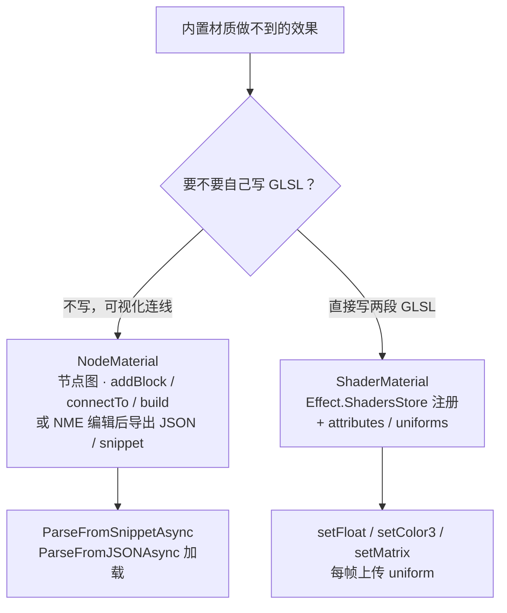

import { Canvas, Controls, Meta } from '@storybook/addon-docs/blocks';
import * as Stories from './node-material-and-shaders.stories';

<Meta of={Stories} name="Docs" />

# Node Material 与着色器

[材质](?path=/docs/materials--docs) 课讲过三种家族：`StandardMaterial`、`PBRMaterial`、`NodeMaterial`。前两种的着色公式由 Babylon 写死，你只调参数；当它们都给不出想要的效果（程序化纹理、特殊波纹、菲涅尔描边、流动渐变、自定义后处理），就要走**自定义着色**——自己决定每个像素是什么颜色。Babylon 给了两条路：

- **NodeMaterial** 是**节点图**材质：把 Input（输入）、Math（运算）、Texture（采样）、Output（输出）等 block 用线连成一张图，Babylon 编译成 shader。可以全代码构建，也可以在可视化工具 **Node Material Editor（NME）** 里拖拽编辑后导出加载。不用写一行 GLSL，是 Babylon 的特色路径。
- **ShaderMaterial** 是**手写 GLSL** 材质：你直接给 vertex 和 fragment 两段 GLSL 字符串，列出 attribute 和 uniform，Babylon 负责编译与绑定。最灵活、最底层，代价是要懂 GLSL。

两条路殊途同归——最终都生成 vertex + fragment 两段 shader 交给 GPU。区别只在"你用图连，还是用 GLSL 写"。先把这条决策建立起来，后面选型与排错才不会混。



| 对象 / 参数 | 默认或常用起点 | 改变后要注意什么 |
| --- | --- | --- |
| `NodeMaterial` 构造 | `new NodeMaterial(name, scene)` | 不调用 `build()` 不会编译；图不完整时 `build()` 抛"缺连接"错 |
| block 连接 | `a.connectTo(b)` 或 `input.connectFrom(output)` | 必须有接到 `VertexOutputBlock` 与 `FragmentOutputBlock` 的完整链路才算有效图 |
| NME 导出 | nme.babylonjs.com 内导出 JSON / snippet ID | 用 `ParseFromSnippetAsync` / `ParseFromJSONAsync` 加载回代码 |
| `ShaderMaterial` 构造 | `new ShaderMaterial(name, scene, { vertex, fragment }, { attributes, uniforms })` | `attributes` / `uniforms` 数组必须与 GLSL 里声明的一一对应，缺了会编译失败 |
| `Effect.ShadersStore` | 全局注册表，键名 `<name>VertexShader` / `<name>FragmentShader` | 引用时传 `{ vertex: 'name', fragment: 'name' }`，引擎自动追加后缀查表 |
| 内置 uniform | `world` / `worldView` / `worldViewProjection` / `view` / `projection` / `cameraPosition` | 列入 `uniforms` 数组后引擎每帧自动绑定 mesh 矩阵，无需手动 `setMatrix` |
| 自定义 uniform 上传 | `setFloat` / `setColor3` / `setVector3` / `setMatrix` / `setTexture` | 每帧调用，**立即生效**，无需 `needsUpdate` |

## 两条路：NodeMaterial 与 ShaderMaterial

选型先看"要不要写 GLSL"，再看"谁来维护这套着色逻辑"：

| 维度 | NodeMaterial | ShaderMaterial |
| --- | --- | --- |
| 怎么表达着色 | 连线节点图 | 手写 GLSL 字符串 |
| 要不要写 GLSL | 不用，图编译时生成 | 必须，vertex + fragment 两段 |
| 可视化编辑 | NME（nme.babylonjs.com）拖拽 | 无，靠文本编辑器 |
| 谁适合维护 | 视觉/技术美术也能改 | 需要懂 GLSL 的程序员 |
| 灵活度 | 受现有 block 种类约束 | 完全自由，能写任意算法 |
| 复用与分享 | 导出 JSON / snippet URL，跨项目加载 | 复制 GLSL 字符串或 shader 文件 |
| 典型场景 | 程序化纹理、菲涅尔、卡通分层、流动渐变 | 自定义顶点位移、特殊后处理、第三方 GLSL 移植 |

判断：**想要可视化、可分享、技术美术可参与，选 NodeMaterial；要完全控制、要移植现成 GLSL、或效果超出 block 能力，选 ShaderMaterial。** 两条路也能混用——NME 里搭大部分，再在导出的 JSON 上微调。3.1 [材质](?path=/docs/materials--docs) 课已给过选型入口，本课深入两条路的构建与运行。

## ShaderMaterial：手写 GLSL

ShaderMaterial 把渲染管线压缩成两段 GLSL——vertex shader（每顶点算位置）和 fragment shader（每像素算颜色）。Babylon 负责编译、绑定 attribute 和内置 uniform、每帧调用；你只管写 shader 和上传自定义 uniform。

### 构造与 Effect.ShadersStore

shader 字符串有两类常见来源：内联字符串和外部 `.fx` 文件。内联时先注册进全局 `Effect.ShadersStore`，键名用 `<name>VertexShader` / `<name>FragmentShader`，构造时传 `{ vertex: 'name', fragment: 'name' }`，引擎自动追加后缀去查表：

```ts
import { Effect, ShaderMaterial } from '@babylonjs/core';

Effect.ShadersStore['rippleVertexShader'] = `
  precision highp float;
  attribute vec3 position;
  attribute vec2 uv;
  uniform mat4 worldViewProjection;
  varying vec2 vUV;
  void main(void) {
    gl_Position = worldViewProjection * vec4(position, 1.0);
    vUV = uv;
  }
`;

Effect.ShadersStore['rippleFragmentShader'] = `
  precision highp float;
  varying vec2 vUV;
  uniform float uTime;
  uniform vec3 uColorA;
  uniform vec3 uColorB;
  void main(void) {
    float wave = sin((length(vUV - 0.5) * 8.0 - uTime) * 6.2831853) * 0.5 + 0.5;
    gl_FragColor = vec4(mix(uColorA, uColorB, wave), 1.0);
  }
`;

const mat = new ShaderMaterial(
  'ripple',
  scene,
  { vertex: 'ripple', fragment: 'ripple' },
  {
    attributes: ['position', 'uv'],
    uniforms: ['worldViewProjection', 'uTime', 'uColorA', 'uColorB'],
  },
);
mesh.material = mat;
```

如果用文件，把第三个参数换成路径字符串 `./shaders/ripple`，引擎会去拉 `ripple.vertex.fx` 和 `ripple.fragment.fx`。内联适合自包含范例和中小型项目；`.fx` 文件适合大型项目里独立维护 shader。

### attributes 与 uniforms

JS 与 GPU 之间有三类通道，记住它们就够了：

| 通道 | 方向 | 含义 | 谁声明 |
| --- | --- | --- | --- |
| `attribute` | JS → 顶点 | 每个顶点一份的数据（`position` / `uv` / `normal` 等） | vertex shader 里 `attribute vec3 position;`，并列入 `attributes` 数组 |
| `uniform` | JS → 全管线 | 整次绘制共用的全局（时间、颜色、矩阵） | vertex / fragment 都要声明同名同类型，并列入 `uniforms` 数组 |
| `varying` | 顶点 → 片元 | vertex 算好的值插值传给 fragment | 两端都声明同名同类型 |

`attributes` 和 `uniforms` 数组是**给引擎的清单**：引擎据此把几何 attribute 和 JS 上传的 uniform 接到 GLSL 里同名变量。清单里漏了 GLSL 用到的名字，shader 编译能过但运行时拿不到值（attribute 为 0、uniform 未绑定）；清单里多写没用的名字则无副作用。常见 attribute：`position` / `normal` / `uv` / `uv2` / `tangent` / `color`。

`uniforms` 里有两类：**内置 uniform**（`world` / `worldView` / `worldViewProjection` / `view` / `projection` / `cameraPosition` 等）只要列出来，引擎每帧自动绑定 mesh 的矩阵与相机位置，**不需要你手动 `setMatrix`**；**自定义 uniform**（`uTime` / `uColorA` 等）则由你在 JS 里通过 setter 上传。

### 运行时上传 uniform：setFloat / setColor3 / setMatrix

自定义 uniform 通过 ShaderMaterial 的 setter 上传，setter 名字按 GLSL 端类型选：

| setter | GLSL 类型 | 用途 |
| --- | --- | --- |
| `setFloat(name, x)` | `float` | 标量：时间、速度、强度 |
| `setVector2 / setVector3` | `vec2` / `vec3` | 方向、位置 |
| `setColor3 / setColor4` | `vec3` / `vec4` | 颜色（`Color3` / `Color4`） |
| `setMatrix(name, m)` | `mat4` / `mat3` | 自定义矩阵（内置矩阵不用手设） |
| `setTexture(name, tex)` | `sampler2D` | 贴图 |
| `setFloats(name, ...xs)` | `float[N]` | 浮点数组 |

```ts
scene.onBeforeRenderObservable.add(() => {
  mat.setFloat('uTime', performance.now() / 1000);
  mat.setColor3('uColorA', colorA);
});
```

setter 改的是当次绘制的上传值，**立即生效**，不需要 `needsUpdate`——因为 uniform 不是 shader 代码，而是每帧由引擎直接上传到 GPU。这一点和"改 GLSL 字符串"截然不同：改了 `Effect.ShadersStore[...]` 或 `attributes` / `uniforms` 数组，已编译的 material 不会自动重编，要让引擎重编译需要销毁重建。

下面这个实例把 `uSpeed` / `uFrequency` / 色对预设都暴露成控件，每帧 `setFloat` / `setColor3` 上传，调一下立刻能在球面上看到片元输出变化：

<Canvas of={Stories.Shader} />

<Controls of={Stories.Shader} />

| 读者操作 | 可观察证据 |
| --- | --- |
| 调 `时间倍率 uSpeed` | 波纹流动变快 / 变慢；降到 0 图案冻结，但 readout 的 `uTime` 仍持续累加——证明 setFloat 每帧上传、立即生效 |
| 调 `波纹密度 uFrequency` | 波纹条数从粗到细，readout 的 `uFrequency` 同步——证明 uniform 控制片元计算 |
| 切 `色对预设` | 两端换色，readout 的 `uColorA` / `uColorB` 显示真实 RGB——证明 setColor3 上传 vec3 |
| 鼠标绕球转一圈 | 波纹图案随表面流动，但**不会**因角度变亮变暗——场景里没有任何 Light，证明 ShaderMaterial 不接入光照系统 |
| 打开 Show code | 看到该 Canvas 实际执行的 `example.ts`，含两段 GLSL 与 ShaderMaterial 构造 |

实例离屏时停止渲染循环、回到视口附近再恢复，调度细节见[渲染循环与时间](?path=/docs/render-loop-and-timing--docs)。

## NodeMaterial：节点图

NodeMaterial 把"写 GLSL"换成"连节点"：你创建若干 block，用线把它们连成一张从输入到输出的有向图，调用 `build()` 后 Babylon 编译成等价的 shader。它的优势是不用懂 GLSL、可视化、可分享，是 Babylon 区别于其他引擎的特色路径。

### block 类型与节点图

NodeMaterial 的 block 按职责分成几类，认识这些类别就能在 NME 面板和文档里快速定位：

| 类别 | 代表 block | 职责 |
| --- | --- | --- |
| Input | `InputBlock` | 提供常量或绑定 attribute / 系统值（位置、世界矩阵、时间、UV） |
| Output | `VertexOutputBlock` / `FragmentOutputBlock` | 图的终点：分别写入 `gl_Position` 与片元色 |
| Vertex | `TransformBlock` 等 | 顶点阶段的空间变换 |
| Fragment | `FragmentOutputBlock` 等 | 片元阶段的合成 |
| Math | `AddBlock` / `MultiplyBlock` / `SinBlock` / `PowBlock` … | 向量与标量运算 |
| Texture | `TextureBlock` | 采样 `Texture`，输出颜色 / alpha |
| Logic | `ConditionalBlock` / `StepBlock` 等 | 比较、分支、平滑过渡 |

每类 block 在 NME 左侧面板按分组列出；代码构建时则直接 `new` 对应类。一张完整图必须最终连到 `VertexOutputBlock`（决定顶点位置）和 `FragmentOutputBlock`（决定像素色）这两个输出节点，否则 `build()` 报缺连接。

### 代码构建：addBlock / connectTo / build

NodeMaterial 也可以纯代码构建——实例化每个 block、设置来源、用 `connectTo` 连线，最后 `build()`：

```ts
import {
  Color4,
  FragmentOutputBlock,
  InputBlock,
  NodeMaterial,
  NodeMaterialSystemValues,
  TransformBlock,
  VertexOutputBlock,
} from '@babylonjs/core';
// 从 JSON / snippet 加载时还需要副作用导入全部内置 block：
// import '@babylonjs/core/Materials/Node/Blocks';

const mat = new NodeMaterial('nm', scene);

// —— 顶点阶段：position × world × viewProjection → gl_Position ——
const position = new InputBlock('position');
position.setAsAttribute('position'); // 绑定几何 attribute

const world = new InputBlock('world');
world.setAsSystemValue(NodeMaterialSystemValues.World); // 引擎每帧绑定世界矩阵

const viewProjection = new InputBlock('viewProjection');
viewProjection.setAsSystemValue(NodeMaterialSystemValues.ViewProjection);

const transform = new TransformBlock('wvp');
position.connectTo(transform);
world.connectTo(transform);
viewProjection.connectTo(transform);

const vertexOutput = new VertexOutputBlock('vertexOutput');
transform.connectTo(vertexOutput);

// —— 片元阶段：固定色 → gl_FragColor ——
const color = new InputBlock('color');
color.value = new Color4(0.8, 0.4, 0.2, 1);

const fragmentOutput = new FragmentOutputBlock('fragmentOutput');
color.connectTo(fragmentOutput);

// 提交两个输出节点并编译；build() 失败会抛出缺少哪些连接的错。
mat.addOutputNode(vertexOutput);
mat.addOutputNode(fragmentOutput);
mat.build();

mesh.material = mat;
```

要点：

- `InputBlock` 是万能输入：`setAsAttribute('position')` 绑定几何属性，`setAsSystemValue(NodeMaterialSystemValues.World)` 绑定引擎系统值（World / View / Projection / ViewProjection / CameraPosition 等），不调用这两者时是一个可赋 `.value` 的常量。
- 连线有两个等价 API：`a.connectTo(b)`（把 a 的输出接到 b 的输入）和 `b.inputs[i].connectFrom(a.outputs[j])`（指定具体端口）。单输出的 block 用 `connectTo` 最简。
- `build()` 编译图。图不完整（没连到输出、类型不匹配）时抛错，错误信息会指出缺哪个连接。
- 代码构建适合程序化生成或小范围定制；复杂图建议在 NME 里搭。

### Node Material Editor 导出与加载

**Node Material Editor（NME）** 是 Babylon 官方的可视化节点编辑器，网址 [nme.babylonjs.com](https://nme.babylonjs.com/)。它是一个**外部 Web 工具**，不在本课 Canvas 里嵌入——典型工作流是在浏览器里打开 NME，拖拽 block 连线，实时预览，满意后导出，再在代码里加载。

NME 导出与加载流程：

1. 在 [nme.babylonjs.com](https://nme.babylonjs.com/) 里搭好节点图，画面右上角实时预览。
2. 导出：菜单里选 **Export** → **JSON**（得到一份序列化 JSON），或直接 **Run** 后从地址栏复制 snippet ID（形如 `#XXXXX#0`，存在 Babylon 的 snippet 服务器）。
3. 在代码里用以下任一方式加载回 `NodeMaterial`：

```ts
import { NodeMaterial } from '@babylonjs/core';
import '@babylonjs/core/Materials/Node/Blocks'; // 注册全部内置 block 供反序列化用

// 方式 A：从 snippet ID 加载（最常用，NME 里 Run 后的编号）
const mat = await NodeMaterial.ParseFromSnippetAsync('XXXXX#0', scene);

// 方式 B：从导出的 JSON 文件加载
const mat = await NodeMaterial.ParseFromFileAsync('myMat', '/mats/myMat.json', scene);

// 方式 C：从 JSON 对象加载
const mat = await NodeMaterial.ParseFromJSONAsync(jsonObj, scene);

mesh.material = mat;
```

加载得到的 `mat` 就是一个普通 `NodeMaterial`，可以继续 `setFloat`（在图里暴露的 InputBlock 上）或重新 `build()`。这是 NodeMaterial 最实用的能力：技术美术在 NME 里调，程序员在代码里加载，两边解耦。在 NME 里也可以把图导出成等价的 TypeScript 构建代码，粘到项目里脱离 JSON 运行。

## GLSL 基础

写 ShaderMaterial 必须懂一点 GLSL。GLSL 是 C 风格的强类型语言，日常用到的类型和函数不多：

| 类型 | 含义 | 字面量 |
| --- | --- | --- |
| `float` | 浮点 | `1.0`（必须有小数点；`1` 是 int） |
| `vec2` / `vec3` / `vec4` | 2 / 3 / 4 分量浮点 | `vec3(0.0, 0.5, 1.0)` |
| `mat2` / `mat3` / `mat4` | 2 / 3 / 4 阶方阵 | `mat4(1.0)` 表示单位矩阵 |
| `sampler2D` | 2D 纹理 | 只能通过 `uniform sampler2D` 声明 |

分量访问：`v.x` / `v.xy` / `v.rgb` / `v.xyzw`（xyzw、rgba、stpq 三套等价名字，可混用）。`*` 在 GLSL 里被重载：矩阵 × 向量是变换，向量 × 向量是分量相乘（点积要 `dot(a, b)`）。

常用内建函数：

| 函数 | 行为 |
| --- | --- |
| `mix(a, b, t)` | `a + (b - a) * t`，t 在 0~1 做线性插值 |
| `smoothstep(e0, e1, x)` | 平滑过渡的 0→1（Hermite 插值），常做抗锯齿边缘 |
| `clamp(x, lo, hi)` | 钳到 `[lo, hi]` |
| `normalize(v)` / `length(v)` / `distance(p0, p1)` | 归一化 / 长度 / 两点距离 |
| `dot(a, b)` / `cross(a, b)` | 点积 / 叉积 |
| `reflect(I, N)` / `refract(I, N, eta)` | 反射 / 折射向量 |
| `texture2D(sampler, uv)` | WebGL1 / GLSL ES 1.0 采样纹理 |

Babylon 的 ShaderMaterial 默认走 GLSL ES 1.0 语法（`attribute` / `varying` / `gl_FragColor` / `texture2D`），引擎在 WebGL2 上下文里自动转换。`precision` 声明建议自己在 shader 顶部写明（范例里都写了 `precision highp float;`）。shader 里没有 `console.log`——调试靠把中间值（uv、法线、权重）输出成颜色观察。GLSL 更完整的语法（GLSL3 / WGSL、分支成本、宏定义）超出本课范围，深入底层 API 见官方 [ShaderMaterial 文档](https://doc.babylonjs.com/typedoc/classes/BABYLON.ShaderMaterial)。

## 最佳实践

- **先 NME 再代码：** 效果能用 NodeMaterial 表达时，先在 NME 里搭、导出 snippet，再在代码里 `ParseFromSnippetAsync` 加载。比从零手写 GLSL 快，技术美术也能参与；只有超出 block 能力时才回落 ShaderMaterial。
- **自定义 uniform 走 setter，不要改 shader 字符串：** 时间、颜色、速度这类每帧变化的值用 `setFloat` / `setColor3` 上传，立即生效；改 `Effect.ShadersStore` 字符串或 `attributes` / `uniforms` 数组要让 material 销毁重建才生效，别在渲染循环里这么做。
- **内置矩阵 uniform 列了就别手设：** `worldViewProjection` / `world` / `view` 等只要写进 `uniforms` 数组，引擎每帧按 mesh 自动绑定；自己再 `setMatrix('world', ...)` 反而会覆盖错误值。
- **attribute / uniform 清单与 GLSL 一一对应：** 清单漏了 GLSL 用到的名字，编译能过但运行时拿不到值（attribute 为 0、uniform 未绑定），是"整片黑"的常见原因。
- **变量名前缀化：** 自定义 uniform 用 `u` 前缀（`uTime` / `uColorA`），attribute 用 `a`、varying 用 `v`，避开可能与引擎内置名冲突的标识符。
- **NodeMaterial 改图后重新 `build()`：** 在运行时动态改图（增删 block、改连接）后必须再 `build()` 才生效；只改 `InputBlock.value` 不需要。
- **先用诊断色验证链路：** ShaderMaterial 黑屏时，先把 fragment 换成 `gl_FragColor = vec4(vUV, 0.0, 1.0);` 这种诊断色，确认 attribute / varying 链路通了，再写复杂算法。

## 常见问题

- 为什么 ShaderMaterial 整片黑色？
  先把 fragment 换成 `gl_FragColor = vec4(vUV, 0.0, 1.0);` 验证 attribute 与 varying 链路；如果换成纯红还是黑，检查 `attributes` 数组是否漏了 GLSL 里用到的 attribute（漏了取不到值）。再看几何朝向（背面剔除）与相机距离。
- 为什么 uniform 改了画面不动？
  检查是否每帧调用 `setFloat` / `setColor3`（不是只设一次）；再确认 `uniforms` 数组里列了这个名字——漏了的话引擎不绑定，setter 传的值进不了 GPU。
- 为什么场景里没有光，ShaderMaterial 物体却有颜色？
  这是正常行为。ShaderMaterial 默认不接入 Babylon 的光照系统，颜色完全由你写的 fragment shader 决定。要让它响应光照，得自己在 shader 里读 light uniform 或改用内置材质。
- `NodeMaterial.build()` 抛"缺连接"错怎么办？
  错误信息会指出哪个输出节点缺输入。检查图是否同时连到 `VertexOutputBlock` 和 `FragmentOutputBlock`，且每条链路从 InputBlock 一路连通；类型不匹配（如把 `vec3` 接到 `float` 输入）也会报类似错。
- NME 里导出的 snippet 怎么用？
  复制 snippet ID（形如 `#XXXXX#0`），在代码里 `await NodeMaterial.ParseFromSnippetAsync('XXXXX#0', scene)` 加载；记得 `import '@babylonjs/core/Materials/Node/Blocks'` 注册全部内置 block，否则反序列化时认不出 block 类型。
- ShaderMaterial 要不要场景里有 Light？
  不要。ShaderMaterial 不读 Babylon 的光照系统；想要光照要么自己在 shader 里写光照计算（读 light uniform），要么用 `StandardMaterial` / `PBRMaterial`（[材质](?path=/docs/materials--docs)）。
- NodeMaterial 和 ShaderMaterial 能互相转换吗？
  NodeMaterial 编译后底层也是 shader，但导出的是图（JSON / snippet），不直接导出成可读 GLSL。NME 里可以导出等价的 TypeScript 构建代码。ShaderMaterial 的 GLSL 没有自动转 NodeMaterial 图的路径——选型时按"要不要写 GLSL"一次定下。

## 总结回顾

摘要：

Babylon 的自定义着色有两条路。`NodeMaterial` 把着色表达成节点图：创建 Input / Math / Texture / Output 等 block，用 `connectTo` 连线，`build()` 编译；可在 [nme.babylonjs.com](https://nme.babylonjs.com/) 可视化编辑后导出 JSON / snippet，用 `ParseFromSnippetAsync` / `ParseFromJSONAsync` 加载。`ShaderMaterial` 直接写 vertex + fragment 两段 GLSL，注册进 `Effect.ShadersStore`，构造时列出 `attributes` 与 `uniforms`；JS 与 GPU 之间靠三类通道：attribute（每顶点）、uniform（全局）、varying（顶点→片元）。内置 uniform（`worldViewProjection` 等）列入数组后引擎自动绑定 mesh 矩阵，自定义 uniform 由 `setFloat` / `setColor3` / `setMatrix` 每帧上传、立即生效。ShaderMaterial 默认不接入光照系统，颜色完全由 fragment shader 决定。选型看"要不要写 GLSL"和"谁来维护"。

一句话：

> NodeMaterial 用节点图连线、可不写 GLSL、靠 NME 可视化编辑导出；ShaderMaterial 手写两段 GLSL、靠 attributes / uniforms 与 setFloat / setColor3 上传数据——两条路都生成 vertex + fragment shader，区别只在表达方式。

知识要点：

- 自定义着色两条路分别是什么？按什么维度选型？
- `ShaderMaterial` 构造的四个参数分别是什么？`Effect.ShadersStore` 的键名和引用名是什么关系？
- attribute / uniform / varying 三类通道各走哪个方向、由谁声明？`attributes` / `uniforms` 数组是给谁看的清单？
- 哪些 uniform 列入数组后引擎自动绑定？哪些要自己 `setFloat` / `setColor3` 上传？
- 改自定义 uniform 的 setter 值，为什么立即生效而不需要 `needsUpdate`？
- `NodeMaterial` 代码构建的最小步骤是什么？`build()` 失败一般是什么原因？
- NME 导出 snippet 后，代码里用什么方法加载？为什么要副作用导入 `Materials/Node/Blocks`？
- 为什么 ShaderMaterial 场景里没有光，物体依然有颜色？

## 参考资料

- [Babylon.js Features：Node Material](https://doc.babylonjs.com/features/featuresDeepDive/materials/node_material/nodeMaterial)
- [Babylon.js Features：Shader Material](https://doc.babylonjs.com/features/featuresDeepDive/materials/shaders/shaderMaterial)
- [Babylon.js Features：Storing Shader Code in Babylon.js（Effect.ShadersStore）](https://doc.babylonjs.com/features/featuresDeepDive/materials/shaders/shaderCodeInBjs)
- [Node Material Editor（NME）](https://nme.babylonjs.com/)
- [Babylon.js TypeDoc：NodeMaterial](https://doc.babylonjs.com/typedoc/classes/BABYLON.NodeMaterial)
- [Babylon.js TypeDoc：ShaderMaterial](https://doc.babylonjs.com/typedoc/classes/BABYLON.ShaderMaterial)
- [Babylon.js TypeDoc：Effect（ShadersStore）](https://doc.babylonjs.com/typedoc/classes/BABYLON.Effect)
- [Babylon.js API Reference (TypeDoc)](https://doc.babylonjs.com/typedoc/)
