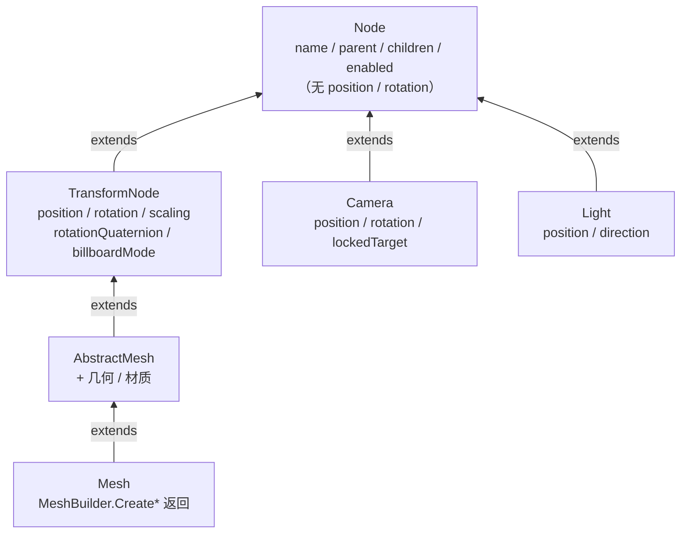

import { Canvas, Controls, Meta } from '@storybook/addon-docs/blocks';
import * as NodeStories from './node.stories';

<Meta of={NodeStories} name="Docs" />

# Node

Babylon.js 的场景是一棵 `Node` 树。`Node` 是相机、光源、网格和 `TransformNode` 的共同基类：它只提供**父子关系、命名、启用状态和世界矩阵的脚手架**，自身没有 `position` 或 `rotation`——你不能位移一个裸 `Node`。完整的变换属性（`position` / `rotation` / `scaling` / `rotationQuaternion`）从 `TransformNode` 开始才有。本课只讲清 `Node` 本身：继承关系、公共属性与方法、父子层级管理、启用状态的传播。变换的数学（局部/世界矩阵、`rotationQuaternion`、billboard）见 [TransformNode](?path=/docs/transformnode-and-grouping--docs)；坐标系、单位、弧度的基础见 [坐标与尺寸](?path=/docs/coordinate-system-and-units--docs)。



| 家族成员 | 继承自 | 能做什么 | 是否渲染 |
| --- | --- | --- | --- |
| `Node` | — | 进层级、命名、启用/禁用、世界矩阵脚手架 | 否 |
| `TransformNode` | `Node` | 上面全部 + `position` / `rotation` / `scaling` / `rotationQuaternion` / `billboardMode` | **否**（不可见） |
| `AbstractMesh` | `TransformNode` | 上面全部 + 几何、材质、拾取、碰撞 | 是 |
| `Mesh` | `AbstractMesh` | 上面全部；`MeshBuilder.Create*` 的具体返回类型 | 是 |
| `Camera` | `Node` | `position` / `rotation` / `lockedTarget`；自算 view matrix | 否（决定视角） |
| `Light` | `Node` | `position` / `direction`；参与光照 | 否（决定光照） |

要注意 `Camera` 和 `Light` **继承自 `Node` 而非 `TransformNode`**——它们有自己的定位属性，但没有 `scaling`、没有 `billboardMode`，挂载时也只能用 `parent =`（见下文）。

## Node 与变换的关系

`Node` 自身**没有任何变换属性**：没有 `position`、`rotation`、`scaling`。它只保留了世界矩阵的**脚手架**——`computeWorldMatrix()` / `getWorldMatrix()` 这两个方法在 `Node` 上就存在，但真正的局部→世界组合在 `TransformNode` 才有意义：裸 `Node` 没有局部变换可供组合。

理解层级与变换只需一句话的直觉：**父动子动，子的局部值始终不变。** 每个节点的世界结果 = 父级世界矩阵 ∘ 自身局部变换；父级的变换通过世界矩阵**额外叠加**到子，不会改写子自己的数字。这条直觉的完整数学——局部变换怎么组成世界矩阵、世界矩阵什么时候惰性更新——见 [TransformNode](?path=/docs/transformnode-and-grouping--docs)。

还有一个常被混淆的点：`setParent` / `addChild` / `removeChild` 这三个"换父级时保持世界位置"的便捷方法**是 `TransformNode` 才有的**，裸 `Node`、`Camera`、`Light` 都没有。在 `Node` 层面，挂载父子关系只有 `parent =` 一种写法——它直接改父级引用、不保持世界位置。要"换父级又不让对象跳"，得用 `TransformNode.setParent`，详见 [TransformNode](?path=/docs/transformnode-and-grouping--docs)。

## Node 的公共属性与方法

| 属性 / 方法 | 说明 |
| --- | --- |
| `name` / `id` | 显示名与唯一标识。`name` 可重复，`id` 默认自动生成、应唯一 |
| `uniqueId` | 引擎内部的数字 id（自增），稳定、可用于做映射 |
| `metadata` | 任意（`any`）字段，挂自定义数据，引擎不解释 |
| `state` | 字符串，存用户自定义状态（如 `'running'`） |
| `parent` | get/set 父节点；**set 时不保持世界位置**（直接改引用） |
| `getChildren(predicate?, directDescendantsOnly?)` | 取直系子节点 |
| `getChildMeshes(directDescendantsOnly?, predicate?)` | 取后代中的 mesh（可只取直系） |
| `getDescendants(directDescendantsOnly?, predicate?)` | 取全部后代节点 |
| `setEnabled(value)` / `isEnabled(checkAncestors = true)` | 设/读启用状态；`isEnabled` 默认**沿父级链**判断有效状态 |
| `onEnabledStateChangedObservable` | 自身 enabled 标志变化时触发（不含祖先） |
| `onEffectiveEnabledStateChangedObservable` | 有效启用状态变化时触发（含祖先传播的影响） |
| `onDisposeObservable` / `dispose()` / `isDisposed()` | 释放与生命周期 |

`getChildTransformNodes()`（只取后代的 `TransformNode`）不在 `Node` 上，是 `TransformNode` 的方法——遍历编组子级时用它，见 [TransformNode](?path=/docs/transformnode-and-grouping--docs)。

## 父子层级管理

在 `Node` 层面，挂载和解绑父子关系都通过 `parent` 属性：

```ts
// 挂载：直接赋值（Node 上唯一的挂载方式）
child.parent = parent;

// 解绑：置空
child.parent = null;
```

`parent =` 直接改父级引用、**保留子的局部变换**——如果子之前在世界里有位置、新父级又不在原点，子的世界结果会跳变。这对刚创建、还在原点的对象不是问题；给一个已有世界位置的对象换父级又要它不跳，需要 `TransformNode.setParent`（见 [TransformNode](?path=/docs/transformnode-and-grouping--docs)）。

遍历子级用 `getChildren` / `getChildMeshes` / `getDescendants`，后两者可控制是否只取直系、可按谓词过滤：

```ts
// 直系子节点
const kids = node.getChildren();

// 全部后代里的 mesh（含孙子辈）
const allMeshes = node.getChildMeshes();

// 只取直系 mesh
const directMeshes = node.getChildMeshes(true);

// 自定义过滤：名字以 'wheel' 开头的后代
const wheels = node.getDescendants(false, (n) => n.name?.startsWith('wheel'));
```

## 启用状态的层级传播

`setEnabled` 的禁用状态**沿父子链传播**：一个节点被禁用，它的整棵子树都从渲染和拾取中跳过，即使子节点自身的 enabled 标志仍是 `true`。读启用状态用 `isEnabled()`，它默认 `checkAncestors = true`——只要任一祖先被禁用就返回 `false`：

```ts
parent.setEnabled(false);

child.isEnabled();        // false —— 父级禁用，子的有效状态也是 false
child.isEnabled(false);   // true —— checkAncestors=false，只看子自身标志
```

这是"整组隐藏用 `setEnabled(false)`、不要逐个切 `isVisible`"的根本原因：前者一次禁用整棵子树，后者要遍历且容易漏。要监听这种传播，用 `onEffectiveEnabledStateChangedObservable`（含祖先影响）；只关心节点自身标志、不关心祖先时，用 `onEnabledStateChangedObservable`。

## 实例：父子层级与启用传播

下面的实例把父子层级、世界矩阵的"父动子动"和启用状态传播放在一起核对：父节点 `TransformNode` 绕 Y 旋转，蓝色子立方体挂在父节点下、局部位置恒为 `(3, 0, 0)`；一个开关切换父节点的 `setEnabled`，观察整组是否从画面消失。

<Canvas of={NodeStories.Hierarchy} />

<Controls of={NodeStories.Hierarchy} />

| 读者操作 | 可观察证据 |
| --- | --- |
| 调「父节点 rotation.y」 | 子节点局部读数恒为 `(3.00, 0.00, 0.00)`，世界读数随之改变；arm 与子立方体绕原点公转——验证"父动子动、子局部不变" |
| 切「父节点 enabled」到 OFF | 父节点下的 arm、子立方体、nose 全部消失（整棵子树跳过渲染）；子节点自身并未单独 setEnabled |
| 拖动 Canvas | 轨道相机绕原点旋转，便于从各角度核对朝向与位置 |

> 这个实例只演示**层级与状态传播**。朝向覆盖（billboard）、`rotationQuaternion` 与 `rotation` 的互斥、世界矩阵的惰性更新等变换细节，见 [TransformNode](?path=/docs/transformnode-and-grouping--docs)。

## 最佳实践

- 裸 `Node` 不能位移/旋转——需要变换就用 `TransformNode`；分组、锚点、相机 rig 根也一律用 `TransformNode`，不要建空 `Mesh`。
- 挂载父子关系在 `Node` 层面只有 `parent =`（保留局部、世界可能跳）；要"换父级不跳"用 `TransformNode.setParent`。
- 整组隐藏用 `setEnabled(false)`（一次禁用整棵子树），不要逐个 mesh 切 `isVisible`。
- 释放节点调 `dispose()`；`Node` 的 dispose 会解除自身与父级/子级的关系，但不自动释放子 mesh 的几何和材质——那是 `TransformNode` / `Mesh` 的职责。

## 常见问题

- 为什么不能 `node.position.set(...)`？
  `Node` 没有 `position`——变换属性从 `TransformNode` 开始。需要位移就用 `TransformNode`（或 `Mesh` / `Camera` / `Light`，它们各自有自己的定位属性）。
- 为什么 `camera.setParent(...)` 不存在 / 报错？
  `setParent` / `addChild` / `removeChild` 是 `TransformNode` 的方法。`Camera` 和 `Light` 继承自 `Node` 而非 `TransformNode`，挂载只能用 `camera.parent = someNode`。
- `setEnabled(false)` 设了父节点，怎么还有一个子物体在画面里？
  检查它是否同时挂在另一个启用的父级下，或别处又把它 `setEnabled(true)` / `isVisible = true`。禁用沿父子链传播，但子节点若有另一条启用路径就能绕过被禁用的祖先。
- `isEnabled()` 返回 `false`，但我明明没禁用这个节点？
  `isEnabled()` 默认 `checkAncestors = true`，会沿父级链判断。某个祖先被禁用时，子的有效状态也是 `false`。只看节点自身标志用 `isEnabled(false)`。

## 总结回顾

摘要：

`Node` 是相机、光源、网格和 `TransformNode` 的共同基类，只提供命名（`name` / `id` / `uniqueId`）、自定义数据（`metadata` / `state`）、父子层级（`parent` / `getChildren` / `getChildMeshes` / `getDescendants`）和启用状态（`setEnabled` / `isEnabled`），自身没有 `position` / `rotation`——变换从 `TransformNode` 开始。挂载父子关系在 `Node` 层面只有 `parent =`（直接改引用、不保持世界位置）；`setParent` / `addChild` / `removeChild` 这些保持世界位置的便捷方法是 `TransformNode` 才有的。`setEnabled` 的禁用状态沿父子链传播，一次禁用整棵子树；`isEnabled()` 默认沿链判断有效状态。

一句话：

> `Node` 只管"谁是谁的子、是否启用、叫什么"——能动的变换从 `TransformNode` 开始，禁用沿父子链传播。

知识要点：

- `Node` / `TransformNode` / `Mesh` / `Camera` / `Light` 各自继承自谁？`Node` 自己有 `position` 吗？
- 挂载父子关系在 `Node` 层面有几种写法？为什么 `Camera` 不能用 `setParent`？
- `parent =` 保留局部还是世界？想"换父级不跳"该用什么？
- `setEnabled(false)` 设在父节点上，子节点会怎样？`isEnabled()` 默认看不看祖先？
- `getChildTransformNodes` 为什么不在 `Node` 上？

## 参考资料

- [Babylon.js TypeDoc：Node（`parent` / `getChildren` / `getChildMeshes` / `getDescendants` / `setEnabled` / `isEnabled` / `onEnabledStateChangedObservable`）](https://doc.babylonjs.com/typedoc/classes/BABYLON.Node)
- [Babylon.js Features：Parent and Pivot（`parent` 赋值的行为）](https://doc.babylonjs.com/features/featuresDeepDive/mesh/transforms/parent_pivot/parent)
- [Babylon.js Features：Transform Node（变换从 TransformNode 起）](https://doc.babylonjs.com/features/featuresDeepDive/mesh/transforms/parent_pivot/transform_node)
- [Babylon.js API Reference (TypeDoc)](https://doc.babylonjs.com/typedoc/)
