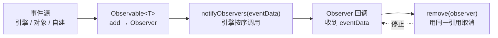

import { Canvas, Controls, Meta } from '@storybook/addon-docs/blocks';
import * as Stories from './observables-and-events.stories';

<Meta of={Stories} name="Docs" />

# Observables 与事件

Babylon.js 把几乎所有"会发生的事"——每帧绘制、指针移动、按键、网格销毁、相机切换——都汇成同一种结构：`Observable<T>` 是事件源，`Observer<T>` 是订阅者。你调 `observable.add(callback)` 拿回一个 `Observer`，引擎在事件发生时 `notifyObservers(...)` 逐个调用；不再需要时用同一个 `Observer` 引用 `observable.remove(observer)` 取消。这套发布订阅是 Babylon 事件的**统一底座**，区别于 DOM 的 `addEventListener`——`add` 不是匿名注册，**返回的 `Observer` 必须留着才能取消**。

4.1 [渲染循环与时间](?path=/docs/render-loop-and-timing--docs) 已经先用过 `scene.onBeforeRenderObservable` 做每帧业务更新；本课正式讲清整个 Observable 模型：怎么订阅、怎么过滤、怎么取消，以及渲染 / 指针 / 键盘 / 对象生命周期四类内置 observable 的入口。指针的命中与拾取细节留给 5.2 [指针与拾取](?path=/docs/pointer-input-and-picking--docs)。



| 对象 / API | 默认 / 常用 | 回查要点 |
| --- | --- | --- |
| `Observable<T>` | 事件源（订阅、通知、清空） | `add` 返回 `Observer<T>`；同一 observable 可挂多个 observer |
| `observable.add(cb, mask?, insertFirst?, scope?, unregisterOnFirstCall?)` | `mask`=`-1`（全部）；`insertFirst`=`false`（尾部追加） | 返回的 `Observer` 必须保留；`remove` 要用同一引用 |
| `observable.addOnce(cb)` | 触发一次后自动注销 | 等价于 `add` 时把 `unregisterOnFirstCall` 设为 `true` |
| `observable.remove(observer)` | 返回 `boolean` | 按 `Observer` 引用移除；引用错会静默失败 |
| `observer.remove()` | 等价于 `observable.remove(observer)` | 在 `Observer` 实例上直接取消 |
| `observable.hasObservers()` / `hasSpecificMask(mask)` | `boolean` | 前者不读 mask；后者按位检查 |
| `observable.clear()` | 移除全部 observer | `scene.dispose()` 会清空挂在该 scene 上的全部 observable |
| `observable.notifyObservers(eventData, mask?, target?, currentTarget?)` | 同步逐个调用 | 自建 observable 时用；回调内置 `eventState.skipNextObservers=true` 可中断后续 |
| `scene.onBeforeRenderObservable` | `Observable<Scene>`，每帧绘制前 | 4.1 已介绍；推进业务状态的默认入口 |
| `scene.onAfterRenderObservable` / `onBeforeDrawPhaseObservable` / `onAfterDrawPhaseObservable` | `Observable<Scene>` | 覆盖一帧管线更精细的时机（见每帧渲染 Observable） |
| `scene.onPointerObservable` | `Observable<PointerInfo>` | 5.2 详解；`add(cb, PointerEventTypes.X)` 用 mask 过滤 |
| `scene.onKeyboardObservable` | `Observable<KeyboardInfo>` | `kbInfo.type` 为 `KeyboardEventTypes.KEYDOWN`(`1`)/`KEYUP`(`2`) |
| `mesh.onDisposeObservable` / `node.onDisposeObservable` | 对象销毁前 | 监听资源释放、清理关联的自定义状态 |
| `mesh.onBeforeRenderObservable` / `onAfterRenderObservable` | 单个 mesh 绘制前后 | per-mesh 渲染状态切换（clip plane 等） |

## 快速上手

最小闭环：订阅一个 observable、保留返回的 `Observer`、不再需要时用同一引用取消。下面订阅每帧 observable 计数 60 帧后自动注销：

```ts
import { Scene } from '@babylonjs/core';

let frames = 0;
// add 返回 Observer<Scene>——这个引用必须留，remove 要用同一引用。
const observer = scene.onBeforeRenderObservable.add(() => {
  frames++;
  if (frames >= 60) {
    // 用同一 observer 引用取消；否则回调会一直跑下去。
    scene.onBeforeRenderObservable.remove(observer);
  }
});
// 或者在 observer 实例上直接取消：
// observer.remove();
```

`add` 的回调签名是 `(eventData: T, eventState: EventState) => void`。多数场景只用 `eventData`（每帧 observable 传 `Scene`、指针传 `PointerInfo`、键盘传 `KeyboardInfo`），第二参 `eventState` 里有 `mask`、`scope`、`skipNextObservers`，需要时再读。这套"订阅返回 observer、用 observer 取消"的模式贯穿 Babylon 所有事件——记住它就掌握了一半。

## Observable 与 Observer

### Observable：事件源

`Observable<T>` 持有一组 `Observer<T>`，事件发生时 `notifyObservers(eventData)` 按订阅顺序逐个调用（除非 `insertFirst=true` 插到队首，或回调置 `eventState.skipNextObservers=true` 中断后续）。Babylon 把绝大多数事件源都做成 `Observable` 实例并挂到对应对象上——你几乎不需要自建，只在"跨模块发自己的事件"时用 `new Observable<T>()`（见 [自定义 Observable](#自定义-observable)）。

核心方法：

| 方法 | 作用 | 关键约束 |
| --- | --- | --- |
| `add(callback, mask?, insertFirst?, scope?, unregisterOnFirstCall?)` | 注册回调，返回 `Observer<T>` | 同一 callback 重复 `add` 会得到多个 `Observer`（不去重） |
| `addOnce(callback)` | 注册只触发一次的回调 | 触发后自动注销，等价于 `unregisterOnFirstCall: true` |
| `remove(observer)` | 按 `Observer` 引用移除 | 必须传 `add` 返回的同一引用；返回 `boolean` |
| `removeCallback(callback)` | 按 callback 函数引用移除 | 丢了 `Observer` 引用时的备选；同名函数会一起被匹配 |
| `hasObservers()` / `hasSpecificMask(mask)` | 是否有订阅 | `hasObservers` 不区分 mask |
| `clear()` | 移除所有订阅 | `scene.dispose()` 会自动清空该 scene 上的所有 observable |
| `notifyObservers(eventData, mask?, target?, currentTarget?)` | 同步逐个调用 | 自建事件源时调用；引擎内置的 observable 由引擎自己调 |

**`mask` 是位掩码过滤器。** 部分 observable（指针、键盘）的事件分多种类型，`add` 的第二参 `mask` 让引擎在分发前就过滤——少做无用的 switch。位掩码取自 `PointerEventTypes` / `KeyboardEventTypes` 的常量值，按位或组合：

```ts
import { PointerEventTypes } from '@babylonjs/core';

// 只接 MOVE 和 PICK，引擎分发前用 hasSpecificMask 过滤
scene.onPointerObservable.add(
  (pi) => { /* ... */ },
  PointerEventTypes.POINTERMOVE | PointerEventTypes.POINTERPICK,
);
```

mask 缺省是 `-1`（全部位都为 1，匹配所有事件），所以 `onBeforeRenderObservable.add(cb)` 不用关心 mask。

**`insertFirst` 控制订阅顺序。** 默认 `false`，新订阅追加到尾部、按订阅顺序回调；置 `true` 把新订阅插到头部、最先回调。多条订阅有先后依赖（例如日志订阅要最先跑）时才用。`scope`（第四参）作为回调里的 `this` 绑定，几乎不用。

### Observer：订阅句柄

`add` 返回的 `Observer<T>` 是这次订阅的**句柄**，常用成员：

| 成员 | 类型 | 含义 |
| --- | --- | --- |
| `callback` | `(eventData, eventState) => void` | 你传给 `add` 的回调本身 |
| `mask` | `number` | `add` 第二参的 mask |
| `scope` | `any` | `add` 第四参；回调 `this` 绑定 |
| `isUnregistered` | `boolean` | 是否已注销；`remove` 后为 `true` |
| `remove()` | 方法 | 等价于 `observable.remove(this)` |

两种取消方式等价，挑顺手的一种：

```ts
// 方式 A：在 observable 上取消
scene.onBeforeRenderObservable.remove(observer);

// 方式 B：在 observer 实例上取消（指针/键盘订阅也常用这种）
observer.remove();
```

关键纪律是**保留 `add` 返回的引用**。下面的写法是常见泄漏——回调永远跑，因为没人能取消它：

```ts
// 反例：没保留 Observer，事后无法按引用 remove
scene.onBeforeRenderObservable.add(() => { box.rotation.y += 0.01; });
```

丢了引用时只能用 `observable.removeCallback(callback)` 按**同一函数引用**找回来（匿名箭头无法匹配）；最稳妥还是从一开始就保留 `Observer`。临时订阅、热替换、组件卸载时，漏掉 `remove` 会让回调一直持有闭包里的对象（mesh、texture、闭包变量），即便 scene 不销毁也释放不掉。`scene.dispose()` 会清空该 scene 上所有 observable，所以"一次性 scene"不强制逐个 `remove`；但场景长驻、对象频繁创建销毁时（SPA、编辑器、热重载），必须成对调用。

## 内置 Observable 在哪里

Babylon 把内置 observable 挂在它"最相关"的对象上。本节按用途分类给出常用入口；指针的命中细节见 5.2，每帧 timing 见 4.1。

### 每帧渲染 Observable

挂在 `Scene` 上，由 `scene.render()` 内部按固定顺序触发。4.1 已经用过 `onBeforeRenderObservable`，这里补全一帧管线里的几个时机：

| Observable | 在 `scene.render()` 中的时机 | 适合做什么 |
| --- | --- | --- |
| `onBeforeAnimationsObservable` | 动画推进之前 | 设动画目标值、按需启用 Animatable |
| `onAfterAnimationsObservable` | 动画推进之后、相机更新之前 | 读动画后的状态再决定相机 |
| `onBeforeRenderObservable` | 绘制前（最常用） | **推进业务状态**——更新对本帧立即生效；`getDeltaTime` 在此已有效 |
| `onBeforeDrawPhaseObservable` | 实际画 mesh 之前（相机 / 渲染目标就绪） | per-frame 渲染状态、clip plane |
| `onAfterRenderObservable` | `render()` 结束之后 | 绘制后读数、截图、追加后处理 |

默认把业务更新放进 `onBeforeRenderObservable` 就够了；其余几个留到需要精确控制管线时机时再用。Mesh 自己也有 `mesh.onBeforeRenderObservable` / `mesh.onAfterRenderObservable`，在**单个 mesh** 绘制前后触发，适合该 mesh 专属的渲染状态切换（如临时设 `scene.clipPlane` 再复位），与上面 scene 级别的不是同一个 observable。

### 指针 Observable

`scene.onPointerObservable` 是 `Observable<PointerInfo>`，引擎的 InputManager 把 canvas 的 DOM 指针事件转成 `PointerInfo` 并 `notifyObservers`。本课只把它当作"Observable 在指针上的应用"——`pi.type` 是 `PointerEventTypes` 的位常量、`pi.pickInfo` 带命中信息，完整事件类型与拾取管线见 5.2 [指针与拾取](?path=/docs/pointer-input-and-picking--docs)。

```ts
import { PointerEventTypes } from '@babylonjs/core';

// 第二参 mask 只接 POINTERMOVE，避免对其它事件做无用 switch
scene.onPointerObservable.add((pi) => {
  if (pi.type === PointerEventTypes.POINTERMOVE) {
    // 取 scene.pointerX/pointerY，或 pi.pickInfo 的命中信息
  }
}, PointerEventTypes.POINTERMOVE);
```

### 键盘 Observable

`scene.onKeyboardObservable` 是 `Observable<KeyboardInfo>`。引擎把 canvas 上的 `keydown` / `keyup` 转成 `KeyboardInfo` 派发——你不直接碰 DOM。`KeyboardInfo` 两个成员：`type`（`KeyboardEventTypes.KEYDOWN = 1` / `KEYUP = 2`）和 `event`（原生 `KeyboardEvent`，取 `key` / `code` / `ctrlKey` 等）。

```ts
import { KeyboardEventTypes } from '@babylonjs/core';

scene.onKeyboardObservable.add((kbInfo) => {
  switch (kbInfo.type) {
    case KeyboardEventTypes.KEYDOWN:
      console.log('按下', kbInfo.event.key, kbInfo.event.code);
      break;
    case KeyboardEventTypes.KEYUP:
      console.log('松开', kbInfo.event.code);
      break;
  }
});
```

**canvas 焦点。** Babylon 的 Engine 把 keydown/keyup 监听挂在它的 input element（默认就是创建 Engine 时传入的 canvas）上。canvas 默认不能接收键盘焦点，需要 `canvas.tabIndex = 0` 让它可聚焦，并让用户点击或 Tab 进入；否则 keydown 根本不会到 canvas，`onKeyboardObservable` 也就不触发——这是"订阅了却没反应"最常见的原因。本课范例用蓝色边框提示当前焦点状态。

**与相机控制器的键盘输入是两回事。** `FreeCamera` / `UniversalCamera` 的 `attachControl` 也会读 WASD 等键，但那是相机输入系统自己维护的 DOM 监听，与 `onKeyboardObservable` 互不影响；两套都活跃时都会收到事件。

### 对象生命周期 Observable

挂在节点 / 资源上，在销毁、添加、移除时触发。最常用的是 `onDisposeObservable`——监听某个 mesh / camera / texture 的释放，用来清理关联的自定义状态（高亮层、UI 控件、外部资源）：

```ts
mesh.onDisposeObservable.add(() => {
  highlightLayer.removeMesh(mesh); // mesh 销毁前同步摘掉高亮
});
```

Scene 级别的添加 / 移除 observable 用于"未知数量对象的批量挂接"：

| Observable | 触发时机 |
| --- | --- |
| `scene.onNewMeshAddedObservable` | 任何 mesh 加入 scene（加载模型、运行时创建） |
| `scene.onMeshRemovedObservable` | 任何 mesh 从 scene 移除 |
| `scene.onBeforeCameraRenderObservable` / `onAfterCameraRenderObservable` | 单个相机渲染前后 |
| `scene.onReadyObservable` | scene 首次完成渲染时（用 `addOnce` 订阅一次性事件） |
| `camera.onDisposeObservable` / `texture.onDisposeObservable` | 相机 / 纹理销毁前 |

`Node`、`Camera`、`Texture`、`Material` 等对象都继承或持有 `onDisposeObservable`，用法一致。

## 订阅与清理

把前面两节拼成一条纪律：**每个 `add` 都要对应一次 `remove`**，而 `remove` 依赖 `add` 返回的 `Observer` 引用。

```ts
// 1. 订阅：保留 Observer 引用
const renderObs = scene.onBeforeRenderObservable.add(() => { /* ... */ });
const pointerObs = scene.onPointerObservable.add(
  (pi) => { /* ... */ },
  PointerEventTypes.POINTERMOVE,
);
const keyObs = scene.onKeyboardObservable.add((kb) => { /* ... */ });

// 2. 不再需要时按引用取消（两种写法等价）
renderObs.remove();
scene.onPointerObservable.remove(pointerObs);
keyObs.remove();

// 3. scene.dispose() 会清空所有 observable，所以"一次性 scene"不强制逐个 remove；
//    但场景长驻、对象频繁创建销毁时，必须成对调用，否则闭包里的对象释放不掉。
```

**多个 Observer 可挂在同一 Observable 上。** `notifyObservers` 按 `insertFirst` 决定的顺序逐个调用，互不影响——取消其中一个不会触发其它。下面的范例正是利用这点：一个常驻 observer 驱动盒子旋转 + 派发读数，三个用户可控的 observer 分别记帧计数 / 指针坐标 / 最近按键；切换「订阅」开关时，对应的读数冻结，但盒子继续旋转，证明取消只移除该订阅。

<Canvas of={Stories.Obs} />

<Controls of={Stories.Obs} />

| 读者操作 | 可观察证据 |
| --- | --- |
| 三个开关都开 | 帧计数持续累加；鼠标在 canvas 上移动时「最近指针」更新；点击 canvas 聚焦（蓝色边框）后按键，「最近按键」更新 |
| 关闭「订阅 onBeforeRenderObservable」 | 帧计数停住；盒子**仍持续旋转**——证明取消只移除该 observer，同一 observable 上的旋转订阅不受影响 |
| 重新打开「订阅 onBeforeRenderObservable」 | 帧计数从 0 重新累加（新订阅、新 observer） |
| 关闭「订阅 onPointerObservable」 | 「最近指针」冻结在最后值；其它通道照常 |
| 关闭「订阅 onKeyboardObservable」 | 「最近按键」冻结；按键不再触发回调 |
| 点击 canvas 让其聚焦（蓝色边框）后再按键 | 「键盘焦点」变「是」；「最近按键」随按键更新——证明 `onKeyboardObservable` 需要 canvas 焦点 |
| 不聚焦 canvas 直接按键 | 「最近按键」不更新——canvas 默认无 tabIndex，键盘事件不进入 Engine 监听 |

## 自定义 Observable

跨模块发自己的事件时（"选中了谁""加载完成了""工具切换"），不必引入新事件库——`new Observable<T>()` 直接复用同一套订阅 API：

```ts
import { Observable } from '@babylonjs/core';

interface SelectedPayload { id: string; source: string; }

// 自建事件源
const onSelected = new Observable<SelectedPayload>();

// 订阅方与内置 observable 完全一致：add 返回 Observer，remove 用同一引用
const observer = onSelected.add((payload) => {
  console.log('选中', payload.id);
});

// 一次性订阅
onSelected.addOnce((payload) => {
  console.log('仅首次', payload.id);
});

// 派发：同步逐个调用所有匹配的 observer
onSelected.notifyObservers({ id: 'm1', source: 'click' });

// 取消
onSelected.remove(observer);
// 或 observer.remove();
```

`notifyObservers` 是**同步**的——调用栈里逐个跑完全部 observer 才返回。回调里再 `notifyObservers` 会重入，注意防递归。回调内置 `eventState.skipNextObservers = true` 可中断后续 observer（类似 DOM `stopImmediatePropagation`），少用。与 DOM `EventTarget` 相比：`Observable` 没有 capture / bubbling、没有 `preventDefault`，回调签名是 `(eventData, eventState) => void`——更轻、更直接。

## 最佳实践

- 每个 `add` 都保留返回的 `Observer` 引用，用 `observer.remove()` 或 `observable.remove(observer)` 取消；不保留引用就只能靠 `removeCallback` 按 callback 找，匿名箭头无法匹配。
- 用 `mask` 第二参在分发前过滤事件类型，少做无用 switch；位掩码取自 `PointerEventTypes` / `KeyboardEventTypes` 的常量，按位或组合。
- 一次性事件用 `addOnce`，避免手动 remove；`scene.onReadyObservable` 这类"只发生一次"的事件尤其适合。
- 多 observer 挂同一 observable 是合法的，按订阅顺序回调（除非 `insertFirst=true`）；取消其中一个不影响其它。
- `scene.dispose()` 会清空该 scene 上的所有 observable，一次性 scene 不强制逐个 remove；长驻场景、热替换、SPA 路由切换、对象频繁创建销毁时必须成对调用。
- 自建事件用 `new Observable<T>()` + `notifyObservers`，与内置 observable 同一套订阅 API，不必引入额外事件库。
- 需要键盘事件时给 canvas 设 `tabIndex = 0` 让它可聚焦，并用视觉提示焦点；否则 keydown 不进入 canvas，`onKeyboardObservable` 不触发。
- 回调里避免重入 `notifyObservers`；确需中断后续 observer 时用 `eventState.skipNextObservers = true`（类似 `stopImmediatePropagation`）。

## 常见问题

- 为什么订阅了 `onKeyboardObservable` 却收不到事件？
  canvas 默认不可聚焦，keydown 不进入 Engine 监听。给 canvas 设 `tabIndex = 0`，让用户点击或 Tab 聚焦后再按键。
- `add` 之后忘了存 `Observer`，怎么取消？
  没办法按引用取消；可以 `observable.removeCallback(callback)` 按 callback 函数引用找（同名函数会一起被匹配，匿名箭头匹配不到）。最稳妥是改成保留 `add` 返回值。
- 为什么同一个 callback 加了两次，`remove` 之后还在回调？
  `add` 不去重，同一 callback 加两次会产生两个 `Observer`。一次 `remove(observer)` 只取消其中一个；要两个都取消需要分别 remove，或用 `removeCallback(callback)` 清掉所有匹配的。
- `onPointerObservable` 的回调为什么对 POINTERWHEEL 也触发？
  没传 mask 时是 `-1`（全部事件类型）。用第二参 `PointerEventTypes.POINTERMOVE | PointerEventTypes.POINTERPICK` 只接关心的类型。
- `scene.dispose()` 之后 `onBeforeRenderObservable.add` 还会触发吗？
  不会。dispose 清空该 scene 所有 observable；之后再 `add` 也无效（scene 已停止 `render()`）。
- 回调里 `notifyObservers` 会不会无限递归？
  会重入。`notifyObservers` 同步逐个调用，回调里再派发同一 observable 会再次进入，需要靠条件退出；跨 observable 派发也要防成环。
- `onBeforeRenderObservable` 和 `onBeforeDrawPhaseObservable` 区别？
  前者在绘制前触发一次（推进业务状态的默认位置，4.1 已讲）；后者在实际画 mesh 之前触发，相机和渲染目标已就绪，用于精确控制渲染状态。Mesh 自己还有 `mesh.onBeforeRenderObservable`，那是单个 mesh 绘制前后触发，与 scene 级的不是同一个 observable。
- 自建 `Observable` 和 DOM `EventTarget` 有什么不同？
  没有 capture / bubbling、没有 `preventDefault`；要中断后续 observer 用 `eventState.skipNextObservers = true`。回调同步执行，签名是 `(eventData, eventState) => void`。

## 总结回顾

摘要：

Babylon.js 的事件统一底座是 `Observable<T>` / `Observer<T>` 发布订阅。`observable.add(callback, mask?, insertFirst?, scope?, unregisterOnFirstCall?)` 返回 `Observer<T>`，引擎在事件发生时 `notifyObservers(eventData, mask?)` 按序逐个调用；不再需要时用同一 `Observer` 引用 `observable.remove(observer)` 或 `observer.remove()` 取消，`addOnce` 触发一次后自动注销。内置 observable 按用途挂在最相关的对象上：`scene.onBeforeRender/onAfterRender/onBeforeDrawPhase/onAfterDrawPhase/onBeforeAnimations/onAfterAnimationsObservable` 覆盖每帧管线时机，`scene.onPointerObservable`（5.2 详讲）和 `scene.onKeyboardObservable` 收指针和键盘，`mesh.onDisposeObservable` / `scene.onNewMeshAddedObservable` 等覆盖对象生命周期，多个 observer 可挂同一 observable、按订阅顺序回调。纪律是每个 `add` 对应一次 `remove`——长驻场景、热替换、SPA 路由切换时漏 remove 会让回调一直持有闭包对象；`scene.dispose()` 会清空该 scene 所有 observable，一次性 scene 不强制逐个 remove。跨模块发自己的事件用 `new Observable<T>()` + `notifyObservers`，与内置 observable 同一套订阅 API。

一句话：

> `add` 返回 `Observer`、用 `Observer` 取消——Babylon 所有事件（渲染、指针、键盘、生命周期、自建）都走这条订阅-清理链路。

知识要点：

- `Observable<T>` 和 `Observer<T>` 各是什么？`add` 返回什么、`remove` 要传什么？
- `add` 的五个参数分别是什么？`mask` 缺省值是多少、有什么用？
- 为什么"没保留 Observer 引用"是泄漏？`scene.dispose()` 会自动清空吗？
- 每帧渲染有哪几个 observable、在 `scene.render()` 中的先后顺序？
- `onPointerObservable` 和 `onKeyboardObservable` 的回调签名各是什么？mask 怎么过滤？
- 为什么订阅了 `onKeyboardObservable` 却收不到事件？canvas 焦点怎么处理？
- 多个 observer 挂同一 observable 时，取消其中一个会影响其它吗？
- 何时用 `addOnce`？何时自建 `new Observable<T>()`？

## 参考资料

- [Babylon.js Features：Observables（Observable/Observer 模型与示例）](https://doc.babylonjs.com/features/featuresDeepDive/events/observables)
- [Babylon.js Features：Interact With Scenes（onPointerObservable / onKeyboardObservable）](https://doc.babylonjs.com/features/featuresDeepDive/scene/interactWithScenes)
- [Babylon.js TypeDoc：Observable](https://doc.babylonjs.com/typedoc/classes/BABYLON.Observable)
- [Babylon.js TypeDoc：Observer](https://doc.babylonjs.com/typedoc/classes/BABYLON.Observer)
- [Babylon.js TypeDoc：KeyboardEventTypes](https://doc.babylonjs.com/typedoc/classes/BABYLON.KeyboardEventTypes)
- [Babylon.js TypeDoc：Scene（onBeforeRenderObservable 等）](https://doc.babylonjs.com/typedoc/classes/BABYLON.Scene)
- [Babylon.js API Reference (TypeDoc)](https://doc.babylonjs.com/typedoc/)
