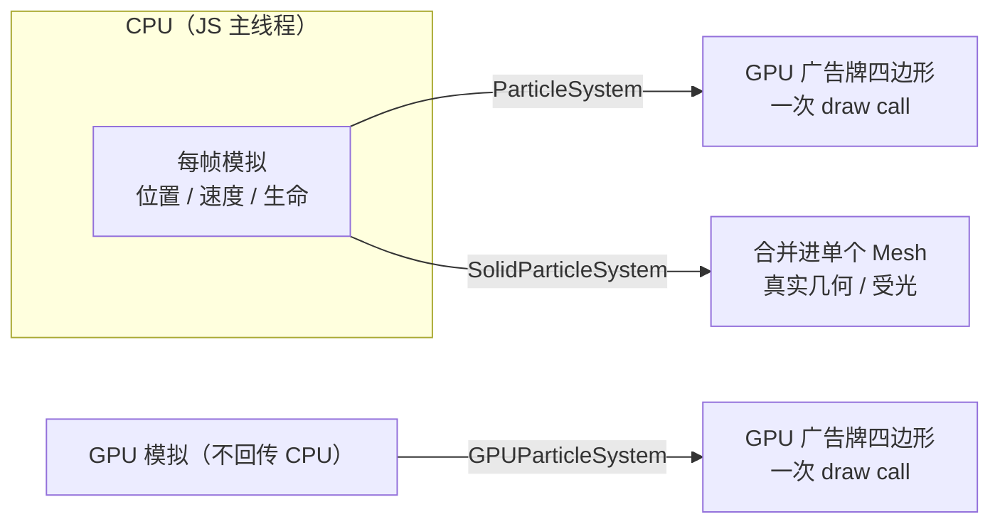

import { Canvas, Controls, Meta } from '@storybook/addon-docs/blocks';
import * as ParticlesStories from './particles.stories';

<Meta of={ParticlesStories} name="Docs" />

# 粒子

粒子是 3D 场景里画"很多个细小、短暂、重复的东西"的单位：火花、烟雾、尘土、能量流、落叶、雨雪。Babylon.js 不让每个粒子都成为一个完整 Mesh——那会立刻被 draw call 和顶点量压垮。它把粒子系统拆成**模拟（每颗粒子怎么动）**和**渲染（用什么图元把它们画出来）**两层，并按渲染图元给出三种现成方案：

- **`ParticleSystem`**：CPU 模拟 + GPU 广告牌（billboard）四边形。每颗粒子是一张始终面向相机的小贴图，模拟跑在 JS 主线程。这是默认且最常用的粒子系统。
- **`GPUParticleSystem`**：模拟和存储都搬到 GPU（transform feedback / compute shader）。API 与 `ParticleSystem` 几乎一致，但单机可撑到几十万甚至上百万颗粒子，代价是放弃若干 CPU 端能力。
- **`SolidParticleSystem`**：每颗粒子是一片**真正的几何体**，最终合并进一个 Mesh。粒子可以受光、投影、有体积、可拾取，但每颗粒子的形状代价远高于广告牌。



三条路径都把大量粒子合并成**一次 draw call**，差别在"模拟跑在哪里"和"每颗粒子是什么"：广告牌路线轻但不能受光、不能有形状；mesh 路线有形状但贵；GPU 路线把模拟也搬走，用吞吐量换 CPU 负担。下面的开场参考表只覆盖广告牌路线（`ParticleSystem` / `GPUParticleSystem`）共享的核心属性；`SolidParticleSystem` 是另一套范式，见后文。

| 对象 / 属性 | 取值 / 默认 | 回查要点 |
| --- | --- | --- |
| `new ParticleSystem(name, capacity, scene)` | `capacity` 是粒子上限 | 参数顺序 name → capacity → scene；活跃粒子顶到上限后老粒子回收再发射，不会无限增长 |
| `new GPUParticleSystem(name, { capacity }, scene)` | `capacity` 默认 `50000` | 也接受旧形式 `new GPUParticleSystem(name, capacityNumber, scene)`；先用 `GPUParticleSystem.IsSupported` 探能力 |
| `new SolidParticleSystem(name, scene)` | 不传 capacity | 粒子数由 `addShape(mesh, n)` / `digest` 累计，`buildMesh()` 后固定 |
| `ps.particleEmitterType` | 默认 `new BoxParticleEmitter()` | **属性全名是 `particleEmitterType`**，不是 `emitterType`；Box 默认 `direction1/2 = (0,1,0)`、`minEmitBox = (-.5,-.5,-.5)` |
| `ps.emitter` | `AbstractMesh` 或 `Vector3` | 设 `Vector3` 时粒子从该点发出；设 Mesh 时跟随其 `position` |
| `ps.particleTexture` | `BaseTexture`，常用 `Texture` 或 `DynamicTexture` | 不设也能跑，但粒子是无色方块；程序化生成见末节 |
| `ps.color1` / `ps.color2` | 默认 `Color4(1,1,1,1)` | 每颗粒子在两者间随机插值做 tint |
| `ps.colorDead` | 默认 `Color4(0,0,0,1)` | 死亡前淡入这个颜色 |
| `ps.minSize` / `ps.maxSize` | 默认 `1` / `1` | 世界单位；`isBillboardBased=true` 时随透视远小近大 |
| `ps.minLifeTime` / `ps.maxLifeTime` | 默认 `1` / `1`（秒） | 每颗粒子在此区间随机取寿命 |
| `ps.emitRate` | 默认 `10`（每秒） | 活跃粒子数 ≈ `emitRate × 平均寿命`，受 capacity 上限钳制 |
| `ps.gravity` | 默认 `Vector3.Zero()` | 每帧累加进粒子速度的世界加速度 |
| `ps.direction1` / `ps.direction2` | 委托给 emitter，Box 默认 `(0,1,0)` | 定义发射方向锥的两个角；只在 emitter 提供时有效 |
| `ps.minEmitPower` / `ps.maxEmitPower` | 默认 `1` / `1` | 初始速度范围；与 `direction` 共同决定初速度向量 |
| `ps.blendMode` | 默认 `BLENDMODE_ONEONE`（= 0，加性） | 常量 `ONEONE` / `STANDARD` / `ADD` / `MULTIPLY` / `MULTIPLYADD` |
| `ps.isBillboardBased` | 默认 `true` | `false` 时粒子按 `billboardMode` 朝向（Y 轴 / 全面向 / 沿速度拉伸） |
| `ps.start()` / `ps.stop()` | — | `start` 开始发射；`stop` 停止发射，已活着的粒子继续跑完生命周期 |
| `ps.particles` | `Particle[]`（活跃粒子） | **只有 CPU `ParticleSystem` 可读**；GPU 不可读 |

## 三种粒子方案的选型

三种方案共享一个边界——它们都回答"如何把大量短生命小对象画出来"，但把模拟放在不同位置、用不同图元渲染。先按"模拟在哪里跑 + 每颗粒子是什么"做选型，再去看具体 API：

| 维度 | `ParticleSystem`（CPU） | `GPUParticleSystem` | `SolidParticleSystem` |
| --- | --- | --- | --- |
| 模拟位置 | CPU（JS） | GPU（transform feedback / compute） | CPU（JS） |
| 渲染图元 | 广告牌四边形 | 广告牌四边形 | 真实几何（三角面） |
| draw call | 1 | 1 | 1 |
| 受光 / 投影 | 否 | 否 | 是 |
| 可拾取 | 否 | 否 | 是（mesh 命中） |
| 单颗粒有形状 / 体积 | 否（贴图） | 否（贴图） | 是 |
| CPU 读单粒子数据 | `ps.particles` 可读 | **不可读** | `sps.particles` 可读 |
| 自定义着色器 / 子发射器 / 拖尾 | 支持 | 部分不支持 | 走 Mesh 材质 |
| 典型数量级 | 数千 ~ 数万 | 数万 ~ 百万 | 数百 ~ 数千 |
| 选它当 | 通用粒子特效 | 海量粒子、瓶颈在 CPU 模拟 | 需要形状、光照或碰撞的"颗粒" |

一句话选型：**发光、烟雾、火花选 `ParticleSystem`；量再大一个量级且不需要 CPU 端逐粒子控制就换 `GPUParticleSystem`；每颗粒子都要是有形状、能投影、能撞东西的实物就选 `SolidParticleSystem`。** 三者不是互斥升级——同一场景里常并存（GPU 跑海量火花、SPS 跑可碰撞碎片）。

### ParticleSystem：CPU 广告牌粒子

`ParticleSystem` 是默认粒子系统：模拟跑在 CPU，渲染用广告牌四边形，API 集中在一个对象上一次性配齐。构造参数顺序是 **name → capacity → scene**：

```ts
import { ParticleSystem, Texture, Vector3, Color4 } from '@babylonjs/core';

const ps = new ParticleSystem('flame', 2000, scene);
ps.particleTexture = new Texture('flame.png', scene); // 不设则粒子是无色方块
ps.emitter = new Vector3(0, 1, 0);                    // 也可传 AbstractMesh，跟随其 position
// ps.particleEmitterType 默认 new BoxParticleEmitter()
ps.color1 = new Color4(1, 0.7, 0.3, 1);
ps.color2 = new Color4(1, 0.4, 0.1, 1);
ps.colorDead = new Color4(0.3, 0, 0, 1);
ps.minSize = 0.2;
ps.maxSize = 0.6;
ps.minLifeTime = 0.6;
ps.maxLifeTime = 1.4;
ps.emitRate = 800;
ps.gravity = new Vector3(0, -2, 0);
ps.blendMode = ParticleSystem.BLENDMODE_ONEONE;       // 默认值，加性混合
ps.start();
```

`capacity` 是粒子上限，不是初始数量。运行时引擎按 `emitRate` 每秒生成新粒子，老粒子寿终后槽位被回收再发射，活跃粒子数始终在 `[0, capacity]` 内——所以把 `emitRate` 调到极高也不会无限增长，只会更快顶到上限。`start()` 开始发射；`stop()` 停止发射但**已活着的粒子继续跑完生命周期**，不是瞬间清空，做"熄火余烟"直接调 `stop()` 即可。

下面的实例把这些属性都接到了 Controls。范例用 `DynamicTexture` 程序化生成一张径向渐变软圆贴图（不依赖网络），深色背景让加性混合看得见叠加发光；地面给出透视参考。调「emitRate」「生命周期」「粒子尺寸」「blendMode」，或切换「发射器类型」，观察粒子形态与读数变化。

<Canvas of={ParticlesStories.Particles} />

<Controls of={ParticlesStories.Particles} />

| 读者操作 | 可观察证据 |
| --- | --- |
| 调「emitRate」从 50 到 3000 | 活跃粒子读数同步上升，顶到容量上限（4000）后不再增长 |
| 调「生命周期」 | 粒子滞空时间变化；同一 emitRate 下活跃粒子数 ≈ emitRate × 平均寿命 |
| 调「粒子尺寸」 | 所有粒子等比变大 / 变小；近处更大、远处更小（广告牌透视衰减） |
| 切「blendMode」ONEONE → STANDARD | 叠加发光消失，变成普通半透明圆点；深色背景上 ONEONE 更亮 |
| 切「发射器类型」box / cone / sphere / hemisphere | 发射形状改变：锥体聚焦向上喷流、盒体均匀散布、球体全方位、半球向上半圈 |
| 开「相机自转」（或手动拖拽） | 从各角度看到粒子始终是面朝相机的贴图（广告牌），没有"侧面" |
| 打开 Show code | 看到该 Canvas 实际执行的 `example.ts`，含 `DynamicTexture` 程序化贴图与 `ParticleSystem` 配置 |

`ParticleSystem` 还能把发射器绑到一个 Mesh 上（`ps.emitter = mesh`），粒子跟随其 `position`；要做自定义出生位置 / 方向时覆盖 `startPositionFunction` / `startDirectionFunction`；要每帧改粒子状态覆盖 `updateFunction`。这些都跑在 CPU，因此可以逐粒子读写。子发射器（`subEmitters`）和拖尾是 ParticleSystem 独有的高阶能力，GPU 路线不完全支持。发射器家族与混合模式细节见后两节。

### GPU 粒子：海量场景

`ParticleSystem` 把模拟放在 CPU，单线程的 JS 循环把上限压在数千到数万之间（具体取决于单粒子计算复杂度和机器）。当目标量级是几万、几十万甚至上百万时，瓶颈会从 draw call 转移到"CPU 模拟循环本身"——这时把模拟也搬上 GPU：`GPUParticleSystem` 用 transform feedback（WebGL2）或 compute shader（WebGPU）在 GPU 上跑完整个生命周期，结果不回传 CPU。

`GPUParticleSystem` 是一个**独立的类**，不是 `ParticleSystem` 上的开关。构造用 options 对象：

```ts
import { GPUParticleSystem } from '@babylonjs/core';

if (GPUParticleSystem.IsSupported) {
  const gpu = new GPUParticleSystem('gpu', { capacity: 100000 }, scene);
  gpu.particleTexture = texture;
  gpu.emitter = originMesh;
  gpu.emitRate = 20000;
  gpu.start();
}
```

API 表面与 `ParticleSystem` 几乎一致：`emitter`、`particleTexture`、`particleEmitterType`、`color1/2/dead`、`minSize/maxSize`、`minLifeTime/maxLifeTime`、`direction1/2`、`gravity`、`blendMode`、`start/stop` 都能直接对上。从 `ParticleSystem` 迁移通常是"换个构造函数、删掉 CPU 端的 `updateFunction`"。可以用 `ps.isGPU`（只读）判断手上的系统是不是 GPU 版。

代价是放弃 CPU 端的若干能力，选型前要逐条核对：

| `GPUParticleSystem` 不支持 / 受限 | 说明 |
| --- | --- |
| 读 `ps.particles` | 全部数据在 GPU，CPU 拿不到逐粒子数组；只读规模用 `maxActiveParticleCount` |
| 自定义 `updateFunction` | 模拟在 GPU，不能逐帧 JS 改粒子 |
| `startPositionFunction` / `startDirectionFunction` | 仅支持 emitter 内置逻辑，不能任意覆盖 |
| 自定义着色器（`customShader`） | 不支持；用固定效果 |
| 子发射器 `subEmitters` | 不支持 |
| 粒子拖尾 | 不支持 |

读活跃规模用 `gpu.maxActiveParticleCount`（旧名 `activeParticleCount` 已废弃但仍可读写）；它会被 `capacity` 钳制。先用 `GPUParticleSystem.IsSupported` 探测当前引擎是否具备 transform feedback 或 compute 能力，不支持就回退到 CPU `ParticleSystem`。`capacity` 默认 `50000`，options 也接受旧的位置参数形式 `new GPUParticleSystem(name, 50000, scene)`。

### SolidParticleSystem：mesh 粒子

广告牌路线的粒子永远是一张面朝相机的贴图——没有侧面、不能投影、不能被光照亮、不能与几何体求交。当"每颗粒子都需要是一个有形状的小物体"时（碎片、落石、鱼群、可碰撞的尘埃），用 `SolidParticleSystem`（SPS）：它把多份几何体合并进**一个 Mesh**，每份几何体是一个 `SolidParticle`，仍只占一次 draw call，但每个粒子都有真实三角面。

```ts
import { SolidParticleSystem, MeshBuilder } from '@babylonjs/core';

const sps = new SolidParticleSystem('debris', scene);
const model = MeshBuilder.CreatePolyhedron('model', { size: 0.2, type: 2 }, scene);
sps.addShape(model, 500);        // 把 model 的几何复制 500 份当粒子
model.dispose();                 // 模板只是形状来源，加完即丢
const spsMesh = sps.buildMesh(); // 合并成单个 Mesh，可赋材质、可投影

let dt = 0;
sps.updateParticle = (p) => {    // 每帧每个粒子的更新回调，返回这个粒子
  p.position.addInPlace(p.velocity);
  p.velocity.y += -9.8 * dt;     // SPS 不自动模拟，velocity 由你手动积分
  return p;
};

scene.onBeforeRenderObservable.add(() => {
  dt = engine.getDeltaTime() / 1000;
  // 初始化、回收、自定义力 …
  sps.setParticles();            // 把 particle 的 position/rotation/scale 写回顶点
});
```

SPS 的工作流是 **add/digest → buildMesh → setParticles**：先用 `addShape(mesh, n)` 把模板几何复制 n 份，或用 `digest(mesh, options)` 把一个 Mesh 拆成若干碎片；调 `buildMesh()` 合并成最终 Mesh（粒子上限从此固定）；每帧在 `sps.particles` 数组上改 `position` / `rotation` / `scaling` / `velocity` / `color`，再调 `setParticles()` 写回顶点。`setParticles(start?, end?, update?)` 支持只更新一段，避免每帧全量重算。

与广告牌粒子相比，SPS 的 `sps.mesh` 是真正的 Mesh：可以投影、可以被 `scene.pick` 命中、可以挂任意材质——代价是每个粒子贡献 `模型三角形数` 个三角面，总数受 GPU 三角形吞吐约束。这与"广告牌粒子 0 三角面、只占一次 draw call"是两条完全不同的代价曲线。SPS 的"每粒子一片几何、合并成单 Mesh、靠 `setParticles` 改顶点"思路和 [实例化](?path=/docs/instanced-mesh-and-thin-instances--docs) 接近；区别是 SPS 把所有粒子焊进一份顶点数据，而 `InstancedMesh` / thin instances 保留实例矩阵、靠 GPU 变换。需要每颗粒子独立变形 / 上色且数量中等时选 SPS；只需要大量相同形状的位置实例时选实例化。

## 发射器类型与发射方向

`particleEmitterType` 决定粒子从什么形状的区域里出生、初始方向如何。它是 `BaseParticleSystem` 上的可写属性（**全名 `particleEmitterType`，不是 `emitterType`**），赋一个发射器实例即可切换：

```ts
import { ConeParticleEmitter } from '@babylonjs/core';

ps.particleEmitterType = new ConeParticleEmitter(0.2, Math.PI / 4); // 半径 0.2、半角 45° 的锥
```

家族成员（构造参数均核对自 `@babylonjs/core` 源码）：

| 发射器 | 构造（默认值） | 出生区域 / 方向 |
| --- | --- | --- |
| `BoxParticleEmitter()` | 无参（默认） | 盒体内随机点；方向由 `direction1`/`direction2` 定锥 |
| `ConeParticleEmitter(radius?, angle?, directionRandomizer?)` | `1` / `Math.PI` / `0` | 锥底圆内随机点，沿锥角发射；`angle` 是半角 |
| `SphereParticleEmitter(radius?, radiusRange?, directionRandomizer?)` | `1` / `1` / `0` | `radiusRange=1` 球体内、`=0` 仅球面，向外 |
| `HemisphericParticleEmitter(radius?, radiusRange?, directionRandomizer?)` | `1` / `1` / `0` | 上半球，向外 |
| `CylinderParticleEmitter(radius?, height?, direction?)` | — | 圆柱体内 |
| `PointParticleEmitter()` | 无参 | 单点；方向由 `direction1`/`direction2` 定 |

`direction1` / `direction2` / `minEmitBox` / `maxEmitBox` 这四个属性在 `ParticleSystem` 上是**委托给当前 emitter** 的快捷访问器——emitter 提供才有效，否则回退到 `Vector3.Zero()`。只有 `BoxParticleEmitter` 和 `PointParticleEmitter` 真正实现它们；切到 `ConeParticleEmitter` 后再设 `ps.direction1` 不起作用，方向参数要写在构造里。`minEmitPower` / `maxEmitPower` 是粒子系统的全局初始速度范围（默认 `1` / `1`），与方向向量相乘得到初始速度。

## 颜色、尺寸、生命周期与混合

广告牌粒子（`ParticleSystem` / `GPUParticleSystem`）共享一组外观与生命周期属性：

- **颜色**：每颗粒子在 `color1` / `color2`（默认都 `Color4(1,1,1,1)`）之间随机插值作为初始色，临近死亡时淡入 `colorDead`（默认 `Color4(0,0,0,1)`）。颜色与贴图像素逐通道相乘——所以贴图保持白色、染色交给 `color1/2`。
- **尺寸**：`minSize` / `maxSize`（默认 `1` / `1`，世界单位）随机取值；广告牌开启时随透视远小近大。
- **寿命**：`minLifeTime` / `maxLifeTime`（默认 `1` / `1` 秒）随机取值；到点回收。
- **发射率**：`emitRate`（默认 `10`，每秒）控制生成速度；活跃粒子数 ≈ `emitRate × 平均寿命`，最终受 `capacity` 钳制。
- **重力**：`gravity`（默认 `Zero`）每帧累加进粒子速度的世界加速度，做下落、漂浮都可。
- **朝向**：`isBillboardBased` 默认 `true`，每帧把粒子对齐相机；置 `false` 后由 `billboardMode` 决定（`BILLBOARDMODE_Y` 只绕 Y 轴、`BILLBOARDMODE_ALL` 全面向、`BILLBOARDMODE_STRETCHED` 沿速度拉伸）。

混合模式决定粒子颜色怎么和帧缓冲合到一起，是粒子"发光感"的主要来源。常量是 `ParticleSystem` 上的静态成员（也通过继承挂在 `GPUParticleSystem` 上）：

| 常量 | 值 | 视觉 | 适用 |
| --- | --- | --- | --- |
| `BLENDMODE_ONEONE` | `0`（默认） | 加性：颜色直接相加，越叠越亮 | 火、火花、光晕、能量（深色背景） |
| `BLENDMODE_STANDARD` | `1` | 普通 alpha 混合 | 烟、雾、灰尘 |
| `BLENDMODE_ADD` | `2` | 带 alpha 的加性 | 介于上面两者之间 |
| `BLENDMODE_MULTIPLY` | `3` | 正片叠底，压暗 | 少见，暗色烟雾 |
| `BLENDMODE_MULTIPLYADD` | `4` | 先乘后加 | 特殊光效 |

`BLENDMODE_ONEONE` 只在**深色背景**下有视觉效果——亮背景下加性混合的粒子几乎看不见（被背景"吃掉"）。烟、雾这类"遮光"而非"发光"的效果用 `BLENDMODE_STANDARD`。

## 程序化生成粒子贴图：DynamicTexture

广告牌粒子需要一张带 alpha 的小贴图才不是方块。范例不依赖远程 PNG——用 `DynamicTexture` 在 canvas 上画一张径向渐变软圆，`update()` 推到 GPU，整个流程在 headless / 离线 / CI 都能跑（与 [Sprite](?path=/docs/sprite-and-spritemanager--docs) 的程序化图集同理）：

```ts
import { DynamicTexture, Texture } from '@babylonjs/core';

function makeParticleTexture(scene) {
  const size = 128;
  const tex = new DynamicTexture(
    'softCircle',
    { width: size, height: size },
    scene,
    false,
    Texture.TRILINEAR_SAMPLINGMODE,
  );
  tex.hasAlpha = true;
  const ctx = tex.getContext();
  const half = size / 2;
  const g = ctx.createRadialGradient(half, half, 0, half, half, half);
  g.addColorStop(0, 'rgba(255,255,255,1)');
  g.addColorStop(0.5, 'rgba(255,255,255,0.6)');
  g.addColorStop(1, 'rgba(255,255,255,0)');
  ctx.fillStyle = g;
  ctx.fillRect(0, 0, size, size);
  tex.update(); // 上传到 GPU；改了 canvas 内容后必须再调
  return tex;
}
```

要点：贴图是**白色**底，染色交给 `color1`/`color2`（白色 × tint = tint）；`hasAlpha = true` 让透明处不挡后面粒子；改 canvas 内容后必须 `update()`，`DynamicTexture` 不会自动同步。把贴图换成星形、火焰形或文字，只需在 canvas 上画不同图形再 `update()`——这是离线环境下生成任意粒子贴图的通用做法。

## 最佳实践

- **先按"模拟在哪 + 粒子是什么"选方案，再写 API**：发光火花选 `ParticleSystem`，海量且不需 CPU 控制选 `GPUParticleSystem`，需要形状 / 投影 / 碰撞选 `SolidParticleSystem`；三者可同场并存。
- **`capacity` 估够余量但不滥用**：它预分配缓冲，过大会占显存、过小粒子顶到上限后看起来"稀疏"；按"峰值 emitRate × 最大寿命"估，宁可略大。
- **加性混合配深色背景，普通 alpha 配任意背景**：`BLENDMODE_ONEONE` 在亮背景上几乎看不见；烟、雾用 `BLENDMODE_STANDARD`。
- **粒子贴图优先程序化生成**：用 `DynamicTexture` 画白心软圆，避开远程 URL 在离线 / CI 失败；染色交给 `color1`/`color2`，贴图保持白色。
- **切 GPU 路线前先探能力**：`if (GPUParticleSystem.IsSupported)` 再 `new`，不支持就留在 CPU `ParticleSystem`，并核对是否用到了 GPU 不支持的能力（自定义着色器、`subEmitters`、`particles` 数组等）。
- **SPS 用 `setParticles(start, end)` 分段更新**：全量更新随粒子数线性增长；只动一段就只传一段。
- **释放时连同贴图**：`scene.dispose()` 会带走 ParticleSystem；手动释放时 `ps.dispose()` 后，程序化生成的 `DynamicTexture` 不再被引用要单独 `dispose()`，避免 WebGL 资源累积。

## 常见问题

- 为什么找不到 `emitterType` 属性？
  全名是 `particleEmitterType`（注意 Particle 这个词）。它是 `BaseParticleSystem` 上的可写属性，赋一个 `BoxParticleEmitter` / `ConeParticleEmitter` 等实例切换发射形状。
- 为什么粒子是白色 / 黑色方块？
  没设 `particleTexture`。广告牌粒子默认无贴图就是方块；用 `DynamicTexture` 程序化生成一张带 alpha 的软圆（见末节），或加载一张 PNG。
- 为什么 `BLENDMODE_ONEONE` 下粒子几乎看不见？
  加性混合需要深色背景。把 `scene.clearColor` 设成深色（如 `0.05, 0.06, 0.09`），亮背景下加性粒子被背景"吃掉"。烟、雾效果用 `BLENDMODE_STANDARD`。
- 为什么把 `emitRate` 调很高，活跃粒子数不涨了？
  顶到了 `capacity` 上限。活跃粒子数 ≈ `emitRate × 平均寿命`，但永远被 `capacity` 钳制；要更多粒子就把构造时的 `capacity` 估大。
- 为什么改 `ps.direction1` 没效果？
  `direction1`/`direction2`/`minEmitBox`/`maxEmitBox` 是委托给当前 emitter 的快捷访问器。只有 `BoxParticleEmitter` / `PointParticleEmitter` 实现它们；切到 `ConeParticleEmitter` 后方向参数要写在构造里（`new ConeParticleEmitter(radius, angle)`），设 `ps.direction1` 无效。
- 为什么 `ps.particles` 读不到东西 / 长度总是 0？
  你用的可能是 `GPUParticleSystem`——它的模拟全在 GPU，CPU 拿不到逐粒子数组。要 CPU 端逐粒子读写就得用 `ParticleSystem`。
- `stop()` 后粒子为什么还在？
  `stop()` 只停止新发射，已活着的粒子会跑完剩余生命周期再消失。要瞬间清空调 `ps.reset()`（清空活跃粒子数组）；做"熄火余烟"效果就直接 `stop()`。
- GPU 粒子和 CPU 粒子能不能随时互换？
  它们是两个独立的类，API 表面高度一致但不能运行时转换。迁移 = 换构造函数 + 删掉 GPU 不支持的能力（`updateFunction`、`subEmitters`、自定义着色器等）。用 `ps.isGPU`（只读）区分手上的是哪一种。

## 总结回顾

摘要：

Babylon.js 把"画大量短生命小对象"拆成模拟与渲染两层，按渲染图元给出三种粒子方案。`ParticleSystem`（CPU 模拟 + 广告牌）是默认通用方案，构造参数 name → capacity → scene，外观靠 `particleTexture`、`color1/2/colorDead`、`minSize/maxSize`、`minLifeTime/maxLifeTime`、`emitRate`、`gravity`、`blendMode`（默认 `BLENDMODE_ONEONE`）配齐，发射形状靠 `particleEmitterType`（默认 `BoxParticleEmitter`，可换 `Cone/Sphere/Hemisphere/Cylinder/Point`）。`GPUParticleSystem` 是独立类，把模拟也搬上 GPU 撑海量粒子，API 与 CPU 版几乎一致，但不支持自定义着色器、子发射器、拖尾和 `particles` 数组等 CPU 能力，用 `IsSupported` 先探能力。`SolidParticleSystem` 把多份几何合并进单 Mesh，每颗粒子是真实三角面、可投影可拾取，靠 `addShape/digest → buildMesh → setParticles` 驱动，与实例化思路接近但代价是三角形量。加性混合配深色背景、粒子贴图优先程序化生成（`DynamicTexture`）。

一句话：

> 选粒子方案先看"模拟在哪、粒子是什么"：发光特效用 `ParticleSystem`，海量用 `GPUParticleSystem`，要形状和投影用 `SolidParticleSystem`——三者的差别不在快慢，而在每颗粒子能是什么。

知识要点：

- `ParticleSystem`、`GPUParticleSystem`、`SolidParticleSystem` 各自的模拟跑在哪里、渲染图元是什么、典型数量级和适用场景是什么？
- `ParticleSystem` 的构造参数顺序是什么？`capacity` 和 `emitRate` 怎样共同决定活跃粒子数？
- `particleEmitterType`（注意全名）默认是什么？怎么切换发射形状？`direction1`/`direction2` 在哪些 emitter 上才有效？
- `blendMode` 的默认值和常用常量各是什么？为什么加性混合需要深色背景？
- `GPUParticleSystem` 相比 `ParticleSystem` 放弃了哪些 CPU 端能力？怎么探测是否支持？
- `SolidParticleSystem` 的工作流（add/digest → buildMesh → setParticles）是什么？它和实例化有什么不同？
- 广告牌粒子为什么需要贴图？离线环境下用什么方式生成？

## 参考资料

- [Babylon.js TypeDoc：ParticleSystem](https://doc.babylonjs.com/typedoc/classes/BABYLON.ParticleSystem)
- [Babylon.js TypeDoc：GPUParticleSystem](https://doc.babylonjs.com/typedoc/classes/BABYLON.GPUParticleSystem)
- [Babylon.js TypeDoc：SolidParticleSystem](https://doc.babylonjs.com/typedoc/classes/BABYLON.SolidParticleSystem)
- [Babylon.js Features：Particle System](https://doc.babylonjs.com/features/featuresDeepDive/particles/particle_system)
- [Babylon.js Features：GPU Particles](https://doc.babylonjs.com/features/featuresDeepDive/particles/gpu_particles)
- [Babylon.js Features：Solid Particle System](https://doc.babylonjs.com/features/featuresDeepDive/particles/solid_particle_system)
- [Babylon.js GitHub：Particles 源码（核对构造签名、默认值与 BLENDMODE 常量）](https://github.com/BabylonJS/Babylon.js/blob/master/packages/dev/core/src/Particles)
