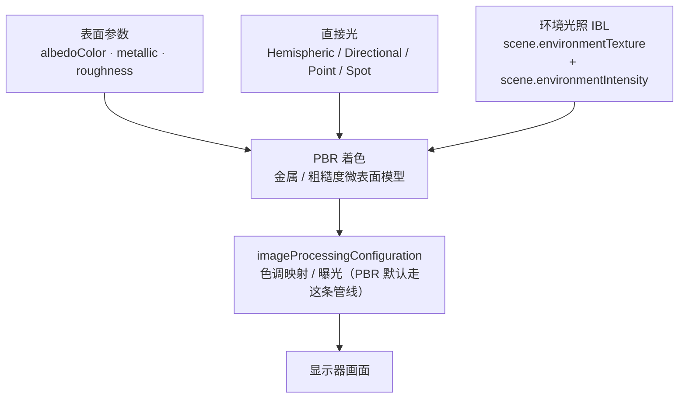

import { Canvas, Controls, Meta } from '@storybook/addon-docs/blocks';
import * as Stories from './pbr-and-environment.stories';

<Meta of={Stories} name="Docs" />

# PBR 与环境

PBR（基于物理的渲染）在 Babylon 里不是某个开关，而是 **`PBRMaterial` 的表面参数 + 环境光照（IBL）+ 反射** 三件事的合作用。`StandardMaterial` 用 Blinn-Phong 公式手工调漫反射色和高光，PBR 改用金属/粗糙度微表面模型，让"金属该长什么样"由物理规律决定而不是猜参数（对比见 [材质](?path=/docs/materials--docs)）。三件事拆开看，PBR 的"为什么金属变黑""为什么不真实"都能落到具体一环：

- **表面参数决定光怎么反射。** `albedoColor`（漫反射基础色，sRGB 源）+ `metallic`（0 电介质 / 1 金属）+ `roughness`（0 镜面 / 1 漫散射）描述微表面。金属几乎不产生漫反射，颜色全靠反射环境；电介质（塑料、木材）才有漫反射主色。
- **环境光照（IBL）决定金属和低粗糙度表面"反射到了什么"。** `scene.environmentTexture` 提供一张 HDR 环境贴图（远景光照 + 反射内容），由 `scene.environmentIntensity`（默认 1）做全场强度乘数。没有 IBL 时，金属面没有内容可反射，几乎只剩直接光的镜面高光——整体偏黑。
- **反射由 PBR 自动完成，越金属越强。** 只要设了 `scene.environmentTexture`，PBR 材质就会自动反射它；要给单个材质换一份不同的反射内容，用 `material.reflectionTexture` 覆盖（常用 `ReflectionProbe` / `MirrorTexture`，都建立在渲染目标上）。



| 属性 | 默认 | 作用 | 回查要点 |
| --- | --- | --- | --- |
| `albedoColor` | `Color3(1, 1, 1)` 白 | 漫反射基础色（sRGB 源） | 金属上 = 反射色调 F0；电介质上 = 漫反射反照率 |
| `metallic` | 需显式设置（否则回落 spec/gloss） | 0 = 电介质 / 1 = 金属 | 真实材质取 0 或 1 两端，少用中间值 |
| `roughness` | `1` | 0 = 镜面 / 1 = 漫散射 | 与 metallic 独立；金属也能很粗糙（拉丝钢） |
| `scene.environmentTexture` | `null` | 全场 IBL 来源（HDR 环境） | 不设则金属面无内容可反射；本课用程序化 cube 离线生成 |
| `scene.environmentIntensity` | `1.0` | 全场 IBL 强度乘数 | `0` 等于关掉环境贡献 |
| `PBRMaterial.environmentIntensity` | `1.0` | 单材质 IBL 强度乘数 | 单材质差异化时覆盖全场值 |
| `PBRMaterial.reflectionTexture` | `null` | 单材质反射内容 | 设了会覆盖 `scene.environmentTexture` 对该材质的反射 |

## PBR 表面参数：metallic 与 roughness

`PBRMaterial` 的金属/粗糙度工作流用三个属性描述表面。要进入这个工作流，**至少显式设置 `metallic`、`roughness` 或 `metallicTexture` 之一**——否则材质回落到旧的 specular/glossiness 模式（`reflectivityColor` + `microSurface`）。日常用 PBR 就是显式给 `metallic` 和 `roughness`。

```ts
import { Color3, PBRMaterial } from '@babylonjs/core';

const pbr = new PBRMaterial('pbr', scene);
pbr.albedoColor = new Color3(1.0, 0.71, 0.29); // 金的反射色调
pbr.metallic = 1.0;   // 纯金属
pbr.roughness = 0.3;  // 较光滑，反射偏锐
mesh.material = pbr;
```

`albedoColor` 是 `Color3`（线性 RGB，0–1）；从 sRGB 十六进制转换用 `Color3.FromHexString('#ffb74d')`。颜色空间与贴图的 gamma 处理见 [纹理](?path=/docs/textures--docs)。

### metallic 金属度

`metallic` 决定表面是电介质还是金属，**物理意义不是"调亮度"**：

- **`0`（电介质）**：塑料、木材、皮肤、石头。表面正常产生漫反射，`albedoColor` 就是漫反射主色（被光调制，呼应 [光源](?path=/docs/lights--docs)）。
- **`1`（纯金属）**：金、铜、铬。表面**几乎不产生漫反射**，所有颜色都来自带色调的镜面反射（F0）；`albedoColor` 此时是反射色调，不是涂装色。这就是为什么金的 `albedoColor` 看起来是"金色金属"而不是"涂了金色的塑料"。
- **真实材质取 0 或 1 两端**，少用中间值——现实物体极少是"半金属"。要做金属/非金属分区（比如一辆金属车身带橡胶保险杠）用 `metallicTexture` 逐像素调制，而不是调一个 0.5 的折中值。

把一个 `albedoColor` 设成金色、`metallic` 从 0 调到 1：你会看到表面从"金橙色涂装"（漫反射主导）变成"反射环境的金属面"（漫反射消失）——这是 PBR 最直观的一步。

### roughness 粗糙度

`roughness` 描述微表面粗糙程度，**和 `metallic` 独立**：

- **`0`**：表面像镜子，反射集中成一个锐点。
- **`1`**（默认）：完全漫散射，反射被抹平成均匀的哑光。
- 金属也能很粗糙（拉丝钢、磨砂铝），电介质也能很光滑（车漆清漆层）——所以"光滑金属"和"粗糙塑料"都成立。

`roughness` 调的不是"亮度"，而是反射的**锐利程度**：低粗糙度金属反射出清晰的环境镜像，高粗糙度把反射糊成一片柔光。`roughness` 可被 `metallicTexture` 的绿通道（或 `useRoughnessFromMetallicTextureGreen`）逐像素调制，贴图不替换 scalar 而是相乘。

### albedoColor 反照率 / 反射色调

`albedoColor` 的物理含义随 `metallic` 切换：

- **电介质（`metallic = 0`）**：`albedoColor` 是**漫反射反照率**，影响整个表面颜色，被光源调制。想要"橙色的塑料球"就设 `albedoColor` 为橙、`metallic = 0`。
- **金属（`metallic = 1`）**：`albedoColor` 变成**反射色调（F0）**，金属表面几乎不产生漫反射，颜色全来自带色调的镜面反射。金的 F0 是 `(1.0, 0.71, 0.29)`，铁的 F0 是偏灰的 `(0.56, 0.57, 0.58)`——这些数值来自实测，不是随便挑的颜色。

`PBRMaterial` 还有贴图槽（`albedoTexture` / `metallicTexture` / `normalTexture` / `occlusionStrength` 等），逐像素调制对应 scalar；完整的贴图槽语义、UV 与 color space 见 [纹理](?path=/docs/textures--docs)。

> 与 `StandardMaterial` 的对比：`StandardMaterial` 的高光是非物理的——`specularColor` + `specularPower` 手工调一个 Blinn-Phong 高光斑，"金属感"全靠参数模仿。`PBRMaterial` 用金属/粗糙度模型，金属的反射行为由物理规律决定，配合 IBL 能直接产出可信的写实金属、玻璃、塑料。外观调试用 Standard 够（细节见 [材质](?path=/docs/materials--docs)），写实资产（glTF 模型、PBR 贴图集）走 PBR。

## 环境光照 IBL

环境光照（image-based lighting，IBL）是 PBR 金属面和低粗糙度表面的**反射内容来源**。直接光（`HemisphericLight` / `DirectionalLight` 等）只能给几个锐高光，IBL 给出整张环境图的全方向反射，金属面才有真实的金属感。

Babylon 的 IBL 入口是 `scene.environmentTexture`，它接受一份 HDR 环境贴图（通常是预过滤的 cube texture，`BABYLON.CubeTexture.CreateFromPrefilteredData(...)` 或 `.env` 文件）：

```ts
import { CubeTexture } from '@babylonjs/core';

// 常规做法：加载一份预过滤 HDR 环境贴图（需要本地 .env / .dds 文件）
const env = CubeTexture.CreateFromPrefilteredData('/textures/environment.env', scene);
scene.environmentTexture = env;
scene.environmentIntensity = 1.0; // 默认值，全场 IBL 强度乘数
```

强度控制有两层：

- **`scene.environmentIntensity`（默认 `1.0`）**：全场 IBL 强度乘数，影响所有 PBR 材质。`0` 等于关掉环境贡献。
- **`PBRMaterial.environmentIntensity`（默认 `1.0`）**：单材质乘数，需要让某个材质比全场更亮/更暗反射时用。

### 离线 / 程序化环境（不依赖远程 HDR）

真实项目常用 `.hdr` / `.env` 文件做 IBL，但那需要远程或本地 HDR 资源。**PBR 在没有 IBL 时仍能工作**——金属面受直接光照亮高光、漫反射项归零（变黑），电介质照常漫反射。要离线演示反射，可以用渲染目标程序化生成环境：把一组彩色网格用 `ReflectionProbe` 渲染成 cube texture，再挂到 `scene.environmentTexture`。下面的实例就是这么做的，全程不访问任何远程 HDR URL。

> 没有远程 HDR 时，`scene.environmentTexture = null` 是合法状态：PBR 仍正常响应直接光，只是金属面没有内容可反射、看起来偏黑。这是教学和调试时最常见的 PBR 起点。

把表面参数、IBL 强度和环境开关放在一起观察：固定一组彩色"环境球"围绕中心 PBR 球，用一个原点的 `ReflectionProbe` 把它们渲染成 cube texture 作为 `scene.environmentTexture`；控件直接改 `metallic` / `roughness` / `albedoColor` / `environmentIntensity`，并在 `environmentTexture` 与 `null` 之间切换。

<Canvas of={Stories.Pbr} />

<Controls of={Stories.Pbr} />

| 读者操作 | 可观察证据 |
| --- | --- |
| `albedo=gold`，`metallic` `0 → 1`（`envOn` 开） | 球从金橙色漫反射涂装变成反射彩色环境的金属面——证明 `albedoColor` 在金属上是反射色调 F0，在电介质上是漫反射色 |
| `metallic=1`，关 `envOn` | 金属面几乎只剩直接光的镜面高光，整体偏黑（readout 显示"无环境可反射 → 偏黑"）——证明金属面颜色几乎全靠环境反射 |
| `metallic=1`，`roughness` `0 → 1`（`envOn` 开） | 反射从锐利清晰变模糊直到哑光——证明 `roughness` 是微表面粗糙度，模糊反射而非调亮度 |
| `metallic=0`，调 `roughness` | 表面在"光滑塑料"与"哑光"间过渡，没有金属反射——证明 `roughness` 与 `metallic` 独立 |
| 调 `environmentIntensity` `0 → 2` | 全场 IBL 贡献整体变暗/变亮，金属面最敏感——证明它是 scene 级乘数 |
| 切 `albedo` 预设 `gold ↔ orange` | gold 在 `metallic=1` 下是金色金属；orange 在 `metallic=0` 下是橙色涂装——同一 `albedoColor` 配不同 `metallic` 外观完全不同 |

实例离屏时停止渲染循环、回到视口附近再恢复，调度细节见 [渲染循环与时间](?path=/docs/render-loop-and-timing--docs)。

## 反射

反射是 PBR + IBL 的直接结果：只要设了 `scene.environmentTexture`，所有 PBR 材质**自动反射**它，越金属（`metallic → 1`）、越光滑（`roughness → 0`）反射越强越清晰；电介质也会反射，只是强度弱得多（F0 ≈ 0.04）。

要让**单个材质**反射与全场不同的内容，用 `material.reflectionTexture` 覆盖（设了它会盖过 `scene.environmentTexture` 对该材质的反射）：

```ts
// 一面镜子 / 一块特定反射内容：用 ReflectionProbe 在某点渲染周围 → 挂到单材质
pbr.reflectionTexture = probe.cubeTexture;
```

普通 PBR 渲染只设 `scene.environmentTexture` 就够；只有某个表面需要"和全场不同的反射"（车后视镜、水面、局部探针）才动 `reflectionTexture`。`scene.environmentTexture` 是"全场默认反射"，`material.reflectionTexture` 是"单材质覆盖反射"——和 `scene.environmentIntensity` 与 `PBRMaterial.environmentIntensity` 的两层关系一致。

> PBR 的反射内容来自环境贴图，`StandardMaterial` 也能挂 `reflectionTexture`，但没有 PBR 那套基于粗糙度的模糊与金属调色。要做"按粗糙度自然模糊的金属反射"，走 PBR。

## 渲染目标

IBL、反射探针和镜面反射背后都是**渲染目标（render target）**——把场景渲染到一张纹理而不是屏幕，再把它当作贴图使用。Babylon 提供三个核心入口，按"渲染成什么形状的纹理"分工：

| 类型 | 渲染成 | 典型用途 | 关键 API |
| --- | --- | --- | --- |
| `RenderTargetTexture` | 2D 纹理 | 离屏渲染通道、自定义合成、监视器画面 | `renderList`、`customRenderTargets.push(...)` |
| `MirrorTexture`（继承 `RenderTargetTexture`） | 2D 纹理（按镜面翻转） | 平面镜、水面反射 | `mirrorPlane`、`renderList` |
| `ReflectionProbe` | cube texture（6 面） | 环境反射、局部探针、本课的程序化 IBL | `cubeTexture`、`renderList`、`refreshRate` |

```ts
import { MirrorTexture, Plane, ReflectionProbe, RenderTargetTexture } from '@babylonjs/core';

// 平面镜：把镜面前的物体按镜面翻转后渲染成 2D 纹理
const mirror = new MirrorTexture('mirror', 512, scene);
mirror.mirrorPlane = new Plane(0, -1, 0, 0); // y=0 地面镜，法线朝下
mirror.renderList.push(sphere, box);
groundMat.reflectionTexture = mirror; // 多用在 StandardMaterial / BackgroundMaterial 上

// 局部探针：在某点把周围渲染成 cube
const probe = new ReflectionProbe('probe', 256, scene);
probe.renderList.push(...environmentMeshes);
pbr.reflectionTexture = probe.cubeTexture; // 单材质反射覆盖
```

渲染目标按 `refreshRate` 控制更新频率：`REFRESHRATE_RENDER_ONCE`（静态内容渲染一次）、`REFRESHRATE_RENDER_ONEVERYFRAME`（每帧）、`REFRESHRATE_RENDER_ONEVERYTWOFRAMES` 或自定义帧间隔。**静态反射内容用 `RENDER_ONCE` 最省**；只有反射内容会变（动态场景）才每帧刷。每个 render target 都是一次额外渲染 pass，数量多了开销显著（性能细节见 [性能](?path=/docs/performance-and-disposal--docs)）。本课实例用每帧刷新是为了保证程序化 cube 在首次进入视口时一定可用；静态环境切换成 `RENDER_ONCE` 也正确。

## 最佳实践

- **写实金属必须有 IBL：** 用 `PBRMaterial` 时随手给 `scene.environmentTexture`，否则金属面（`metallic = 1`）没有内容可反射、整体偏黑。离线 / 无 HDR 时用 `ReflectionProbe` 程序化生成（本课实例做法）。
- **`metallic` 取 0 或 1 两端：** 真实材质几乎都是纯电介质或纯金属；金属/非金属分区用 `metallicTexture` 逐像素调制，而不是调 0.5 折中值。
- **`roughness` 调反射锐利度，不是亮度：** 想让反射更清晰就降 `roughness`；想让金属更哑光就升 `roughness`。它和 `metallic` 独立，金属也能粗糙。
- **全场调强度优先 `scene.environmentIntensity`：** 单材质差异化才用 `PBRMaterial.environmentIntensity` 或 `reflectionTexture`。
- **直接光 + IBL 配合：** IBL 提供环境和反射底色，直接光（[光源](?path=/docs/lights--docs)）给方向、阴影和高光。PBR 的 `intensity` 在 `intensityMode = AUTOMATIC`（默认）下按光源类型选物理单位，从 Standard 迁移亮度时按材质重新标定。
- **静态 `ReflectionProbe` / `MirrorTexture` 用 `RENDER_ONCE`：** 反射内容不变就别每帧刷；render target 每个都是一次额外 pass。
- **静态材质 `freeze()` 省编译：** PBR 参数稳定后调 `pbr.freeze()`，跳过逐帧 uniform 重算（呼应 [材质](?path=/docs/materials--docs) 的 freeze 建议）。

## 常见问题

- 为什么 `PBRMaterial` 设 `metallic = 1` 后表面全黑？
  金属面几乎不产生漫反射，颜色全靠反射环境。`scene.environmentTexture` 为 `null`（或材质未单设 `reflectionTexture`）时无内容可反射。给场景挂一份环境贴图，或离线用 `ReflectionProbe` 程序化生成（见本课实例）；临时调试也可降 `metallic` 看漫反射。
- 为什么调了 `metallic` / `roughness` 没反应，材质还是老样子？
  `PBRMaterial` 要进入金属/粗糙度工作流，必须**至少显式设置 `metallic`、`roughness` 或 `metallicTexture` 之一**，否则回落到 specular/glossiness 模式（由 `reflectivityColor` + `microSurface` 控制）。确认你显式赋了 `metallic` / `roughness`，而不是只设了 `reflectivityColor`。
- 为什么金属面看着有反射，但颜色 / 亮度不对？
  先查 `scene.environmentIntensity`（默认 1）和 `PBRMaterial.environmentIntensity`（默认 1）是不是被改小或改大；再查 `albedoColor`——金属的 `albedoColor` 是反射色调 F0，设错色调会让金属偏色（金的 F0 是 `(1.0, 0.71, 0.29)`，不是随便一个黄色）。HDR 环境过亮时由 `scene.imageProcessingConfiguration`（色调映射 / 曝光）压回显示范围。
- `albedoColor` 在金属上和电介质上到底有什么区别？
  电介质（`metallic = 0`）的 `albedoColor` 是漫反射反照率，被光调制，决定"什么色"；金属（`metallic = 1`）几乎不产生漫反射，`albedoColor` 变成反射色调 F0，决定"反射光带什么色调"。所以同一 `albedoColor` 在 `metallic` 0 与 1 下外观完全不同。
- `scene.environmentTexture` 和 `PBRMaterial.reflectionTexture` 有什么区别？
  `scene.environmentTexture` 是全场默认的 IBL / 反射来源，影响所有 PBR 材质；`PBRMaterial.reflectionTexture` 是单材质覆盖，设了会盖过全场环境对该材质的反射。常规 PBR 只设 scene 级；要让某块表面反射不同的内容（镜面、局部探针）才用 material 级。
- 没有 HDR 文件能演示 PBR 反射吗？
  能。把一组彩色网格用 `ReflectionProbe` 渲染成 cube texture，挂到 `scene.environmentTexture`——本课实例就是这么离线生成的，不依赖任何远程 HDR URL。质量不如真 HDR，但足以演示金属反射与环境光照。
- `ReflectionProbe` / `MirrorTexture` 挂哪里？
  `ReflectionProbe` 的 `cubeTexture` 通常挂到 `PBRMaterial.reflectionTexture`（单材质反射）或 `scene.environmentTexture`（全场 IBL）；`MirrorTexture` 多挂在 `StandardMaterial` / `BackgroundMaterial` 的 `reflectionTexture` 上做平面镜 / 水面。两者都要在 `renderList` 里指定渲染哪些网格。
- `PBRMaterial` 和 `PBRMetallicRoughnessMaterial` 有什么区别？
  `PBRMetallicRoughnessMaterial` 是更精简的金属/粗糙度变体（用 `baseColor` 而非 `albedoColor`），只暴露最常用属性，开销略低；`PBRMaterial` 是全功能版本，支持金属/粗糙与 specular/gloss 两套工作流以及更多边界参数。新项目默认用 `PBRMaterial`；确定只用金属/粗糙度且要最简 API 时可换 `PBRMetallicRoughnessMaterial`。

## 总结回顾

摘要：

PBR 在 Babylon 是表面参数、环境光照与反射三件事的合作用。`PBRMaterial` 用金属/粗糙度工作流：`albedoColor`（漫反射基础色，sRGB 源）在电介质（`metallic = 0`）上是漫反射反照率、在金属（`metallic = 1`）上是反射色调 F0；`roughness`（默认 1）控制反射锐利度（0 镜面 / 1 漫散射），与 `metallic` 独立。进入金属/粗糙度工作流需显式设 `metallic` / `roughness`（否则回落 specular/gloss）。IBL 由 `scene.environmentTexture`（默认 `null`）提供远景光照 + 反射内容，强度由 `scene.environmentIntensity`（默认 1，全场）和 `PBRMaterial.environmentIntensity`（默认 1，单材质）两层乘数控制；没 IBL 时金属面没有内容可反射、整体偏黑。PBR 自动反射环境，要单材质覆盖用 `PBRMaterial.reflectionTexture`。反射、镜面与离屏渲染背后是渲染目标三件套：`RenderTargetTexture`（2D 离屏）、`MirrorTexture`（平面镜）、`ReflectionProbe`（cube 探针，本课用它离线生成 IBL）。离线 / 无 HDR 时用 `ReflectionProbe` 把彩色网格渲染成 cube 即可演示反射。

一句话：

> PBR 的金属面没有环境贴图就会偏黑——`metallic` 决定是不是金属，`roughness` 决定反射多锐，`scene.environmentTexture` 决定反射到了什么。

知识要点：

- PBR 的三件事（表面参数 / IBL / 反射）怎样共同决定最终画面？和 `StandardMaterial` 的非物理高光有什么区别？
- 为什么 `PBRMaterial` 设 `metallic = 1` 且没有 `scene.environmentTexture` 时金属面会偏黑？
- `albedoColor` 在 `metallic = 0` 与 `metallic = 1` 下分别是什么物理含义？同一 `albedoColor` 配不同 `metallic` 外观为什么不同？
- `roughness` 调的是亮度还是反射锐利度？它和 `metallic` 是否独立？
- `scene.environmentIntensity` 和 `PBRMaterial.environmentIntensity` 的作用范围有什么不同？
- `scene.environmentTexture` 和 `PBRMaterial.reflectionTexture` 各自的适用场景？单材质设了 `reflectionTexture` 会怎样？
- 进入金属/粗糙度工作流需要做什么？不设会回落到什么模式？
- `RenderTargetTexture` / `MirrorTexture` / `ReflectionProbe` 分别渲染成什么形状的纹理，各用于什么场景？离线生成 IBL 用哪个？

## 参考资料

- [Babylon.js TypeDoc：PBRMaterial（albedoColor / metallic / roughness / environmentIntensity / reflectionTexture）](https://doc.babylonjs.com/typedoc/classes/BABYLON.PBRMaterial)
- [Babylon.js TypeDoc：PBRMetallicRoughnessMaterial（精简金属/粗糙度变体）](https://doc.babylonjs.com/typedoc/classes/BABYLON.PBRMetallicRoughnessMaterial)
- [Babylon.js TypeDoc：Scene（environmentTexture / environmentIntensity / imageProcessingConfiguration）](https://doc.babylonjs.com/typedoc/classes/BABYLON.Scene)
- [Babylon.js TypeDoc：ReflectionProbe](https://doc.babylonjs.com/typedoc/classes/BABYLON.ReflectionProbe)
- [Babylon.js TypeDoc：MirrorTexture](https://doc.babylonjs.com/typedoc/classes/BABYLON.MirrorTexture)
- [Babylon.js TypeDoc：RenderTargetTexture（refreshRate 常量）](https://doc.babylonjs.com/typedoc/classes/BABYLON.RenderTargetTexture)
- [Babylon.js Features：Introduction to PBR](https://doc.babylonjs.com/features/featuresDeepDive/materials/using/introToPBR)
- [Babylon.js Features：Mastering PBR Materials（metallic/roughness 与 spec/gloss 工作流）](https://doc.babylonjs.com/features/featuresDeepDive/materials/using/masterPBR)
- [Babylon.js Features：Reflection Probes](https://doc.babylonjs.com/features/featuresDeepDive/environment/reflectionProbes)
- [Babylon.js Features：Reflection Textures（RenderTargetTexture / MirrorTexture / ReflectionProbe）](https://doc.babylonjs.com/features/featuresDeepDive/materials/using/reflectionTexture)
- [Babylon.js API Reference (TypeDoc)](https://doc.babylonjs.com/typedoc/)
