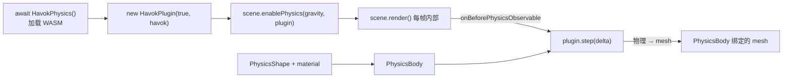

import { Canvas, Controls, Meta } from '@storybook/addon-docs/blocks';
import * as Stories from './physics-with-havok.stories';

<Meta of={Stories} name="Docs" />

# 物理

Babylon.js 本身只负责渲染，不知道"两个方块撞上了"或"球从斜面滚了下来"。物理效果由独立的物理引擎计算，再把结果交回 Babylon 画出来。从 5.0 起，Babylon 引入了一套全新的 **Physics V2** API，配合官方维护的 [Havok](https://www.havok.com/) 物理（编译为 WebAssembly，通过 `@babylonjs/havok` 接入）。本课讲的全部是 V2——旧的 `PhysicsImpostor` / `PhysicsImpostorJoint` 已废弃，不要混用。

理解 Havok 集成的关键是把"物理"和"渲染"分成两层状态：

- **物理是真理来源。** `PhysicsBody` 维护刚体的真实位姿、速度和质量，由物理引擎按规律推进。
- **mesh 是渲染视图。** Babylon 的 `Mesh` 只是刚体的"显示器"：物理启用后，每帧 `scene.render()` 内部会自动 step 物理引擎，再把刚体的位姿抄写到绑定 mesh 的 `position` / `rotationQuaternion`。不要手改动态体的 mesh 位姿——下一帧会被物理覆盖。

四条相互独立的维度共同决定物理表现，调试时先分清是哪一条出了问题：

- **插件与重力**（`HavokPlugin` + `scene.enablePhysics` 的重力向量）决定全局规则；
- **运动类型**（`PhysicsMotionType` 的 STATIC / DYNAMIC / ANIMATED）决定物体是否被推动、是否受重力；
- **碰撞体形状与材质**（`PhysicsShape` + `PhysicsMaterial`）决定哪些物体会相撞、撞成什么样；
- **同步方向**决定物理和 mesh 谁是输入——动态体是 物理 → mesh，ANIMATED 体是 mesh → 物理。



| 对象 / API | 默认 / 常用 | 回查要点 |
| --- | --- | --- |
| `import HavokPhysics from '@babylonjs/havok'` | 默认导出是异步加载器 | `const havok = await HavokPhysics()`，加载 HavokPhysics.wasm；未加载完前所有物理构造都不可用 |
| `new HavokPlugin(useDeltaForWorldStep, havok)` | `(true, havok)` | 第一个参数 `true` 表示用每帧 delta 推进步长（推荐） |
| `scene.enablePhysics(gravity, plugin)` | `gravity = (0, -9.81, 0)` | 返回 boolean；之后 `scene.render()` 每帧自动 step，无需手动调用 |
| `PhysicsMotionType` | `STATIC=0 / ANIMATED=1 / DYNAMIC=2` | DYNAMIC 受重力且被推动；STATIC 永不动；ANIMATED 由代码驱动但能推开 DYNAMIC |
| `new PhysicsBody(node, motionType, startsAsleep, scene)` | `startsAsleep = false` | 绑定到 `TransformNode`（Mesh 也是 TransformNode）；shape 通过 `body.shape = ...` 单独赋 |
| `PhysicsShapeBox(center, rotation, extents)` | `extents` 是**半边长** | 与 `MeshBuilder.CreateBox` 的全边长差一倍，对不上会"视觉贴地、物理悬空" |
| `PhysicsShapeSphere(center, radius)` | `radius` | 最便宜最稳，碰撞首选近似 |
| `shape.material = { friction, restitution }` | `friction=0.5 / restitution=0` | `PhysicsMaterial` 是**接口**（plain object），不是类；直接赋值 |
| `combine mode` | `friction→MINIMUM / restitution→MAXIMUM` | Havok 插件的默认合成规则：摩擦取小、弹性取大 |
| `body.applyImpulse(impulse, location)` | `location` 是世界坐标点 | 瞬时改速度（跳跃、击退）；`applyForce` 是持续力 |
| `plugin.setGravity(v)` | 创建时的重力 | 运行时切重力方向（如下雪/反重力） |
| `scene.onBeforePhysicsObservable` | 物理 step 之前触发 | 推进 ANIMATED 体目标、施加持续力的推荐入口 |

## 快速上手

最小闭环四步：异步加载 Havok → 建 `HavokPlugin` 并 `enablePhysics` → 给地面和落体各建 `PhysicsBody` + `PhysicsShape` → 在 `runRenderLoop` 里调 `scene.render()`（物理会自动 step）。

```ts
import {
  Engine,
  HemisphericLight,
  ArcRotateCamera,
  MeshBuilder,
  Scene,
  Vector3,
  Quaternion,
  HavokPlugin,
  PhysicsBody,
  PhysicsMotionType,
  PhysicsShapeBox,
  PhysicsShapeSphere,
} from '@babylonjs/core';
import HavokPhysics from '@babylonjs/havok';

const canvas = document.getElementById('renderCanvas') as HTMLCanvasElement;
const engine = new Engine(canvas, true);
const scene = new Scene(engine);

const camera = new ArcRotateCamera('cam', -Math.PI / 2, Math.PI / 2.4, 12, Vector3.Zero(), scene);
camera.attachControl(canvas, true);
new HemisphericLight('light', new Vector3(0, 1, 0), scene);

// 地面 mesh：用薄 box 让视觉与碰撞体严格一致。
const ground = MeshBuilder.CreateBox('ground', { width: 20, height: 0.5, depth: 20 }, scene);
ground.position.y = -0.25;

const sphere = MeshBuilder.CreateSphere('sphere', { diameter: 1 }, scene);
sphere.position.y = 6;

// 1) 异步加载 Havok WASM；2) 装进 HavokPlugin；3) 让 scene 启用物理。
const havok = await HavokPhysics();
const plugin = new HavokPlugin(true, havok);
scene.enablePhysics(new Vector3(0, -9.81, 0), plugin);

// 地面：STATIC 刚体，mass 不需要，永不动。
// PhysicsShapeBox 的 extents 是半边长，与 box 全边长 20/0.5/20 对应半边 10/0.25/10。
const groundBody = new PhysicsBody(ground, PhysicsMotionType.STATIC, false, scene);
const groundShape = new PhysicsShapeBox(
  Vector3.Zero(),
  Quaternion.Identity(),
  new Vector3(10, 0.25, 10),
  scene,
);
groundShape.material = { friction: 0.7, restitution: 0.3 };
groundBody.shape = groundShape;

// 落体：DYNAMIC 刚体受重力；显式 body+shape 路径要给 DYNAMIC 体设质量。
const sphereBody = new PhysicsBody(sphere, PhysicsMotionType.DYNAMIC, false, scene);
const sphereShape = new PhysicsShapeSphere(Vector3.Zero(), 0.5, scene);
sphereShape.material = { friction: 0.4, restitution: 0.6 };
sphereBody.shape = sphereShape;
sphereBody.setMassProperties({ mass: 1 });

// 物理启用后，scene.render() 每帧内部会自动 step；回调里照常只调 render。
engine.runRenderLoop(() => scene.render());
window.addEventListener('resize', () => engine.resize());
```

这段代码用了顶层 `await`——浏览器原生支持 ES module 顶层 await 时可以直接用；在 Storybook/Vite 里更常见的写法是把后续逻辑包进 `HavokPhysics().then(...)`，就像本课范例 `example.ts` 那样，先把场景搭起来返回 `Scene`，物理加载完成后再 `enablePhysics` 与生成刚体。

## 物理是真理，mesh 是视图

这是本课最核心的判断。Babylon V2 把刚体（`PhysicsBody`）和渲染对象（`TransformNode` / `Mesh`）显式分离，但二者通过"绑定"关系保持同步：

- **绑定发生在 `new PhysicsBody(transformNode, ...)`。** `transformNode` 是真理的"显示目标"，物理引擎不读它的位姿作为输入（DYNAMIC 体），而是在 step 后把结果写回。
- **同步由引擎在 step 前后自动完成。** step 之前引擎可能把 mesh 的位姿喂给 ANIMATED/STATIC 体（prestep）；step 之后把 DYNAMIC 体的新位姿抄回 mesh。你无需手写 mesh.position 同步代码。
- **手改 DYNAMIC 体的 mesh.position 无效。** 下一帧 step 后会被物理覆盖。要移动动态体用 `applyImpulse` / `applyForce` / `setLinearVelocity`；要由代码完全驱动位姿就用 ANIMATED 体。

**物理 step 自动发生在 `scene.render()` 内部。** 调用 `scene.enablePhysics(gravity, plugin)` 后，每一帧 `scene.render()` 会在绘制前先 `onBeforePhysicsObservable` → 推进物理引擎一步 → 把结果同步回 mesh → 再画。你**不需要**也**不应该**手动调 `plugin.step()` 或 `world.step()`——这和 Rapier/Cannon 等需要手动 step 的集成不同，是 Babylon V2 最容易踩的直觉坑。完整的每帧时序见 [步进与每帧时序](#步进与每帧时序)。

## 刚体 PhysicsBody

`PhysicsBody` 描述"这个物体如何被物理推动"，通过 `new PhysicsBody(transformNode, motionType, startsAsleep, scene)` 创建。第一个参数是它绑定的 `TransformNode`（`Mesh` 是其子类，所以直接传 mesh）；`motionType` 决定它的运动方式；`startsAsleep` 控制是否以休眠态启动（默认 `false`，立即参与模拟）。

shape 不在构造函数里——创建 body 后再单独 `body.shape = someShape` 赋值。这是 V2 与旧 `PhysicsImpostor` 最大的形态差异：body 和 shape 解耦，一个 body 原则上可以换 shape，也可以用 `PhysicsShapeContainer` 组合多个形状。

```ts
const body = new PhysicsBody(mesh, PhysicsMotionType.DYNAMIC, false, scene);
body.shape = sphereShape;
body.setMassProperties({ mass: 1 }); // DYNAMIC 体需要质量；STATIC 不用
```

### 运动类型

| 类型 | 受重力 | 被碰撞推动 | 谁决定运动 | 典型用途 |
| --- | --- | --- | --- | --- |
| `DYNAMIC` | 是 | 是 | 物理引擎 | 落体、被击飞的箱子、布偶 |
| `STATIC` | 否 | 否 | 永不动 | 地面、墙体、关卡边界 |
| `ANIMATED` | 否 | 否 | 你的代码（改 mesh 位姿） | 升降平台、旋转门、脚本动画物体 |

两条容易记错的边界：

- **只有 `DYNAMIC` 会被推动。** `STATIC` 和 `ANIMATED` 像一堵墙，动态物体被它们弹开，它们自己纹丝不动。把"应该被推动的箱子"建成 `STATIC` 是最常见的"物理不响应"错误。
- **`ANIMATED` 不被物理推动，但能推开 `DYNAMIC`。** 它由你的代码（`Animation`、`mesh.position = ...`）驱动，物理引擎读取它的 mesh 位姿作为输入，再把动态物体顶开。它的运动不来自力，而来自你显式给出的位姿——这点和 Rapier 的 kinematic 概念一致。

运行时也能切换类型：`body.setMotionType(PhysicsMotionType.ANIMATED)`。`computeMassProperties()` 按 shape 自动算质量、惯量和质心；`setMassProperties({ mass })` 显式给定（惯量在 Havok 里由 shape 自动推导，多数情况只需给 `mass`）。

## 碰撞体与材质

`PhysicsShape` 描述"这个物体的体积和表面"。只有挂了 shape 的 body 才会参与碰撞。V2 提供两种等价写法：

- **显式 body + shape**（本课范例用）：先 `new PhysicsBody(...)`，再 `new PhysicsShapeXxx(...)`，`body.shape = shape`。讲清模型，适合需要精细控制形状/材质的场景。
- **快捷封装 `PhysicsAggregate`**：一行同时建 body + shape + material，适合简单场景。

```ts
import { PhysicsAggregate, PhysicsShapeType } from '@babylonjs/core';

// 一行等价：mass: 0 自动判定为 STATIC，mass > 0 为 DYNAMIC。
new PhysicsAggregate(ground, PhysicsShapeType.BOX, { mass: 0, friction: 0.7 }, scene);
new PhysicsAggregate(sphere, PhysicsShapeType.SPHERE, { mass: 1, restitution: 0.6 }, scene);
```

### 形状选型

| 形状类 | 构造参数 | 适合 | 注意 |
| --- | --- | --- | --- |
| `PhysicsShapeSphere` | `(center, radius)` | 任意，碰撞首选 | 最便宜最稳，球近似即可 |
| `PhysicsShapeBox` | `(center, rotation, extents)` | 任意 | `extents` 是**半边长**；`rotation` 是四元数 |
| `PhysicsShapeCapsule` | `(pointA, pointB, radius)` | 角色、机械 | 主轴由两点确定，比固定 Y 轴更灵活 |
| `PhysicsShapeCylinder` | `(pointA, pointB, radius)` | 任意 | 同胶囊，由两端点定位 |
| `PhysicsShapeConvexHull` | `(mesh, scene)` | 动态 / 复杂物体 | 从 mesh 顶点算凸包，动态体的安全选择 |
| `PhysicsShapeMesh` | `(mesh, scene)` | **只 STATIC** | 按原样用三角网；动态体用它不会自动算质量且对内部边敏感 |
| `PhysicsShapeHeightField` | `(sizeX, sizeZ, samplesX, samplesZ, data, scene)` | 静态地形 | 大地形比 trimesh 高效 |
| `PhysicsShapeGroundMesh` | `(groundMesh, scene)` | `CreateGround` 产物 | 专为扁平地面优化 |

`PhysicsShapeType` 枚举（用于 `PhysicsAggregate` / `PhysicsShape(options)`）：`SPHERE=0 / CAPSULE=1 / CYLINDER=2 / BOX=3 / CONVEX_HULL=4 / CONTAINER=5 / MESH=6 / HEIGHTFIELD=7`。

两个常踩的坑：

- **几何和碰撞体彼此独立。** `CreateBox({ size: 1 })` 的全边长是 1，对应 `PhysicsShapeBox` 的 `extents = (0.5, 0.5, 0.5)`。数值对不上时物体看起来贴着地面、物理上却悬空半截。
- **动态体别用 `PhysicsShapeMesh`。** 三角网不会为动态刚体自动算质量，会得到一个行为异常的物体；需要精确形状时用 `PhysicsShapeConvexHull`，需要复杂静态地形时再上 `Mesh` / `HeightField`。

### 摩擦与弹性 PhysicsMaterial

`PhysicsMaterial` 是一个**接口**（plain object），不是类——直接构造对象赋给 `shape.material`：

```ts
shape.material = {
  friction: 0.4,   // 接触切向阻力；默认 0.5
  restitution: 0.6, // 弹性：0 不弹，1 完全弹性；默认 0
};
```

| 属性 | 默认 | 影响 |
| --- | --- | --- |
| `friction` | `0.5` | 接触切向阻力，越大约束滑动 |
| `restitution` | `0` | 接触后保留的能量比例；0 不弹，1 完全弹性 |
| `frictionCombine` | `MINIMUM`（取小） | 两个材质相遇时的摩擦合成规则 |
| `restitutionCombine` | `MAXIMUM`（取大） | 两个材质相遇时的弹性合成规则 |

合成模式（`PhysicsMaterialCombineMode`）：`GEOMETRIC_MEAN=0 / MINIMUM=1 / MAXIMUM=2 / ARITHMETIC_MEAN=3 / MULTIPLY=4`。Havok 插件的默认是**摩擦取 MINIMUM、弹性取 MAXIMUM**——所以一个弹性 0 的地面遇到弹性 0.9 的球，球仍然会弹。改材质时只改单体的 shape.material 即可，碰撞结果按上述规则合成。

## 重力、力与冲量

动态物体的运动由三类输入共同决定：全局重力、持续力、瞬时冲量。

**重力**是世界级配置，作用于所有 DYNAMIC 体（除非单体 `setGravityFactor`）。创建时设进 `enablePhysics`，运行时用 `plugin.setGravity` 即时切换：

```ts
scene.enablePhysics(new Vector3(0, -9.81, 0), plugin); // 创建时
plugin.setGravity(new Vector3(0, +9.81, 0));           // 运行时：反重力
plugin.setGravity(Vector3.Zero());                     // 零重力漂浮
```

**力**是持续作用（每步叠加，直到改值或清零），适合推车、风、磁力；**冲量**是瞬时改速度，适合跳跃、击退、被击中。两者都要求"世界坐标的施力点"：

```ts
// 持续力：每步叠加；location 是世界坐标的施力点。
// body.transformNode 就是构造时绑定的 mesh，用它的世界坐标位置近似质心。
body.applyForce(new Vector3(10, 0, 0), body.transformNode.absolutePosition);

// 瞬时冲量：直接改线速度，常用于一次性动作。
body.applyImpulse(new Vector3(0, 6, 0), body.transformNode.absolutePosition);

// 直接读写速度（跳过力，常用于重置或传送）。
body.setLinearVelocity(new Vector3(0, 5, 0));
const v = body.getLinearVelocity(); // 返回 Vector3
```

| 操作 | 改变的是 | 典型用途 | 注意 |
| --- | --- | --- | --- |
| `applyForce(force, location)` | 持续加速度 | 风、推进、引力 | 每步都作用，要改值或清零才停 |
| `applyImpulse(impulse, location)` | 瞬时改速度 | 跳跃、击退 | 改速度，不持续；`location` 世界坐标 |
| `setLinearVelocity(v)` | 直接设线速度 | 重置、传送 | 跳过力，直接给定 |

施力点偏离质心会产生角速度（让物体旋转），`applyImpulse` 同理——这正是台球击球点决定旋转的原理。只想平移时把 `location` 设为质心位置（`body.node.absolutePosition` 近似）。

下面的沙盒把这些机制放在一个可交互场景里：物体从空中下落、堆叠、按弹性弹跳，你可以切重力方向、调弹性、点击撒新物体。

<Canvas of={Stories.Physics} />

<Controls of={Stories.Physics} />

| 读者操作 | 可观察证据 |
| --- | --- |
| 等待加载完成 | 读数「物理状态」从「加载中（WASM）」变为「已就绪」，物体开始下落 |
| 调「弹性」到 0.9 | 物体落地后明显弹跳；调到 0 则像泥土一样直接停住 |
| 把「重力方向」切到「向上」 | 已堆叠的物体反向"坠落"向天空 |
| 切到「零重力」 | 物体保留当时速度，在空间里漂浮、缓慢散开 |
| 点击画布（非拖拽） | 从空中撒入一批新物体，与现有物体碰撞、堆叠 |
| 拖拽画布 | 相机绕目标旋转，视角改变（不影响物理） |
| 读数「活跃刚体」 | 物体下落/碰撞时上升；全部静止后回落到 0，但「刚体总数」不变——证明休眠/静止的刚体仍在场景里 |

## 步进与每帧时序

`scene.enablePhysics` 之后，物理推进由 `scene.render()` 内部驱动，每帧按下列顺序执行：


- **`scene.onBeforePhysicsObservable`** 在物理 step 之前触发。在这里推进 ANIMATED 体的目标位姿（设 `mesh.position`，物理引擎会在 step 时读取）、施加持续力，或读取上一帧的速度做读数。这是物理相关每帧逻辑的推荐入口，比 `onBeforeRenderObservable` 更贴近物理时机。
- **`plugin.step(delta)` 由引擎自动调用。** `delta` 来自 `engine.getDeltaTime()`；`HavokPlugin(true, havok)` 的第一个参数 `useDeltaForWorldStep = true` 就是让 step 用每帧 delta。你**不需要**手动调 step。
- **位姿同步在 step 之后自动完成。** DYNAMIC 体的新位姿会写回绑定的 mesh，无需手抄。

`HavokPlugin` 还支持固定步长模式：

```ts
plugin.setTimeStep(1 / 60); // 固定 60Hz 步长
plugin.getTimeStep();       // 当前步长
```

调用 `setTimeStep` 后插件改用固定步长而非每帧 delta。固定步长让物理在低帧率下更稳定、行为可复现，但与渲染帧率不再 1:1 对齐。多数交互场景保持默认的 delta 模式即可；需要确定性模拟（回放、录像）时再切固定步长。

> 与 Rapier 等引擎的差异：Rapier 要求你显式 `world.step()` 并用累加器按固定步长推进；Babylon V2 把 step 绑进了 `scene.render()`，配合 `useDeltaForWorldStep` 自动用渲染 delta。你不再写累加器循环，代价是要理解 `scene.render()` 内部的顺序，把"物理前的准备"放进 `onBeforePhysicsObservable` 而不是 `onBeforeRenderObservable`。

## 约束 PhysicsConstraint

约束（关节）把两个刚体连起来，限制它们的相对运动。V2 用 `PhysicsConstraint` 描述，并通过**父刚体的 `addConstraint`** 连接到子刚体：

```ts
import {
  HingeConstraint, Vector3,
} from '@babylonjs/core';

// 铰链：绕一根轴旋转，如门、车轮。
const hinge = new HingeConstraint(
  new Vector3(0, 1, 0),  // pivotA：bodyA 上的局部锚点
  new Vector3(0, -1, 0), // pivotB：bodyB 上的局部锚点
  new Vector3(0, 1, 0),  // axisA：bodyA 的旋转轴
  new Vector3(0, 1, 0),  // axisB：bodyB 的旋转轴
  scene,
);
bodyA.addConstraint(bodyB, hinge); // 把约束挂到 (bodyA, bodyB) 之间
```

常用约束子类（构造参数都是局部锚点 / 轴向量 + scene）：

| 约束 | 子类 | 约束效果 | 典型用途 |
| --- | --- | --- | --- |
| 球面 | `BallAndSocketConstraint(pivotA, pivotB, axisA, axisB, scene)` | 两点重合，可任意旋转 | 链条、肩膀 |
| 铰链 | `HingeConstraint(pivotA, pivotB, axisA, axisB, scene)` | 绕单轴旋转 | 门、车轮、机械臂 |
| 滑块 | `SliderConstraint(pivotA, pivotB, axisA, axisB, scene)` | 沿单轴平移 + 绕该轴转 | 滑轨、活塞 |
| 距离 | `DistanceConstraint(maxDistance, scene)` | 保持两锚点距离 | 软绳、链条段 |
| 锁定 | `LockConstraint(...)` | 相对位姿完全锁定 | 焊接、临时粘合 |
| 六自由度 | `Physics6DoFConstraint(params, limits, scene)` | 每个轴独立配置 LOCKED/FREE/LIMITED | 自定义关节 |
| 弹簧 | `SpringConstraint(...)` extends `Physics6DoF` | 距离弹簧（带刚度/阻尼） | 悬挂、弹性连接 |

约束类型由 `PhysicsConstraintType` 枚举标识（`BALL_AND_SOCKET=1 / DISTANCE=2 / HINGE=3 / SLIDER=4 / LOCK=5 / SIX_DOF=7`），但用上面的子类构造时不需要手填枚举。约束属于进阶能力——大多数物理需求（堆叠、滚动、弹跳）靠 body + shape 就能解决，需要"连接两个物体的运动"时再上约束。需要主动驱动（电机控制车轮转速）时，在约束上配置 motor，参数细节查官方 TypeDoc。

## 最佳实践

- 把"物理是真理、mesh 是视图"作为心智模型：动态体位姿永远由 `scene.render()` 内部的 step 推进，mesh 只负责显示，不要手改动态体的 mesh.position。
- 物理 step 自动发生在 `scene.render()` 里，不要手动调 `plugin.step()`；把"物理前的准备"放进 `scene.onBeforePhysicsObservable` 而不是 `onBeforeRenderObservable`。
- 单位用世界单位（米），重力取 `-9.81`；shape 的半边长/半径要和 mesh 几何严格对应——`CreateBox({size:1})` 对应 `PhysicsShapeBox` 的 `extents=(0.5,0.5,0.5)`。
- 静态物体（地面、墙）用 `PhysicsMotionType.STATIC` + `PhysicsShapeMesh` 或 `Box`；动态体用基础形状或 `PhysicsShapeConvexHull`，别让动态体挂 `PhysicsShapeMesh`。
- 想要简单时用 `PhysicsAggregate` 一行建好 body+shape+material；需要精细控制材质或换形状时再用显式 body+shape。
- `HavokPhysics()` 是异步的，且只加载一次 WASM；在场景搭建后 `.then` 里 `enablePhysics` 并生成刚体，加载完成前所有物理构造都不可用。
- 高速运动的小物体可能穿透——Havok 默认开启连续碰撞检测（CCD），但仍要避免极小物体配极高速度；必要时减小 `plugin.setTimeStep` 的步长。
- 销毁刚体时 `body.dispose()` + `shape.dispose()` + `mesh.dispose()` 一起释放；场景销毁时调 `scene.dispose()` 会清理物理引擎。

## 常见问题

- 物体直接穿过地面？
  地面 body 是 `PhysicsMotionType.STATIC`（不是 DYNAMIC，否则它自己被重力拉走）；地面的 shape 形状有效；`extents` 半边长与 mesh 尺寸一致。
- 动态体不受重力影响？
  确认 `motionType` 是 `DYNAMIC`、`setMassProperties({mass})` 给了正质量、shape 有效。用 `PhysicsShapeMesh` 给动态体不会自动算质量——改用基础形状或 `PhysicsShapeConvexHull`。
- 读了 `mesh.position` 改成新值，下一帧物体又跳回来？
  动态体的位姿由物理管理，改 mesh 无效。要瞬时移动用 `body.setLinearVelocity` 或 `applyImpulse`；要由代码完全驱动就改用 `ANIMATED` 体。
- 物体看起来贴着地面、物理上却悬空半截？
  `PhysicsShapeBox` 的 `extents` 是**半边长**，与 `MeshBuilder.CreateBox` 的全边长差一倍。把 extents 调成 mesh 边长的一半。
- 弹性 restitution 设了 0，物体还是会弹？
  Havok 默认 `restitutionCombine = MAXIMUM`——只要碰撞**另一方**的 restitution 大，结果就取大。把另一方也设 0，或显式 `restitutionCombine: 'MINIMUM'`（用枚举值 1）。
- 改了 shape.material 的 restitution，已落地的物体没反应？
  材质是 per-shape 的，改值即时生效，但只在**下次接触**时影响碰撞结果。已静止堆叠的物体没有新接触，看不到变化；轻推或撒新物体即可观察。
- `scene.enablePhysics` 之后还要手动调 `world.step()` 吗？
  不需要。Babylon V2 的物理 step 自动发生在 `scene.render()` 内部。手动 step 会双倍推进，导致物体加速或穿透。
- 物理加载一直显示"加载中"，控制台报 WASM 错误？
  `@babylonjs/havok` 的 ESM build 靠 `import.meta.url` 定位 `HavokPhysics.wasm`。Vite 开发模式通常开箱即用；打包/特殊配置下若找不到 WASM，用 `await HavokPhysics({ locateFile: () => '/path/to/HavokPhysics.wasm' })` 显式指定。
- 用了旧的 `PhysicsImpostor` 报错或行为异常？
  V2 API（`PhysicsBody` / `PhysicsShape`）与旧 `PhysicsImpostor`（V1）不兼容，不要混用。`scene.enablePhysics(gravity, plugin)` 传入的 `plugin` 必须是 `HavokPlugin`（实现 `IPhysicsEnginePluginV2`）；旧的 `CannonJSPlugin` / `OimoJSPlugin` 是 V1，配 V1 的 `PhysicsImpostor`。

## 总结回顾

摘要：

Babylon.js 的物理由独立的 Havok 引擎（`@babylonjs/havok`，WASM）计算，通过异步加载器 `await HavokPhysics()` 装进 `new HavokPlugin(true, havok)`，再用 `scene.enablePhysics(new Vector3(0,-9.81,0), plugin)` 启用。启用后每帧 `scene.render()` 内部自动 step 物理引擎、把刚体位姿同步回绑定的 mesh——不需要手动 step。物理对象分两层：`PhysicsBody`（绑定 `TransformNode`，由 `PhysicsMotionType` 决定 STATIC/DYNAMIC/ANIMATED 三种运动方式）和 `PhysicsShape`（球/盒/胶囊/凸包/三角网等，决定碰撞体积）；`PhysicsMaterial` 是 plain-object 接口，`friction`/`restitution` 在碰撞时按 `frictionCombine=MINIMUM`、`restitutionCombine=MAXIMUM` 合成。动态体的运动由重力、`applyForce`、`applyImpulse`、`setLinearVelocity` 共同决定，物理前的每帧逻辑放 `scene.onBeforePhysicsObservable`。约束用 `PhysicsConstraint` 子类（铰链/球面/滑块等）+ `bodyA.addConstraint(bodyB, constraint)` 连接两个刚体。简单场景可用 `PhysicsAggregate` 一行封装 body+shape+material。

一句话：

> 物理是真理，mesh 是视图；`enablePhysics` 之后让 `scene.render()` 自动 step，只通过 `PhysicsBody` / `applyImpulse` 改物理状态，mesh 只负责显示。

知识要点：

- 为什么物理和渲染必须分成两层独立状态？Babylon V2 怎样自动同步它们？
- `HavokPhysics()` 为什么是异步的？`new HavokPlugin(true, havok)` 的两个参数各是什么？
- `scene.enablePhysics` 之后还需要手动 step 吗？物理 step 发生在 `scene.render()` 内部的哪个位置？
- `PhysicsMotionType` 的 STATIC / DYNAMIC / ANIMATED 各自是否受重力、是否被碰撞推动？为什么直接改 DYNAMIC 体的 mesh.position 无效？
- `PhysicsShapeBox` 的 `extents` 和 `MeshBuilder.CreateBox` 的 `size` 是什么关系？为什么"视觉贴地、物理悬空"几乎总是这个对不上？
- `PhysicsMaterial` 是类还是接口？`frictionCombine` 和 `restitutionCombine` 的 Havok 默认值各是什么？
- `applyForce` 与 `applyImpulse` 有什么区别？为什么两者的第二个参数是世界坐标的施力点？
- `onBeforePhysicsObservable` 和 `onBeforeRenderObservable` 在一帧中的相对时机是怎样的？物理前的准备该放进哪个？

## 参考资料

- [Babylon.js Documentation：Physics V2（使用 Havok）](https://doc.babylonjs.com/features/featuresDeepDive/physics/usingHavok)
- [Babylon.js Documentation：Physics V2 — Rigid Bodies](https://doc.babylonjs.com/features/featuresDeepDive/physics/v2/rigidBodies)
- [Babylon.js Documentation：Physics V2 — Shapes](https://doc.babylonjs.com/features/featuresDeepDive/physics/v2/shapes)
- [Babylon.js Documentation：Physics V2 — Constraints](https://doc.babylonjs.com/features/featuresDeepDive/physics/v2/constraints)
- [Babylon.js Documentation：Physics V2 — Materials](https://doc.babylonjs.com/features/featuresDeepDive/physics/v2/materials)
- [Babylon.js Documentation：ES6 Support（HavokPhysics 导入与初始化）](https://doc.babylonjs.com/setup/frameworkPackages/es6Support)
- [Babylon.js TypeDoc：PhysicsBody / PhysicsShape / PhysicsConstraint / HavokPlugin](https://doc.babylonjs.com/typedoc/)
- [`@babylonjs/havok` on npm](https://www.npmjs.com/package/@babylonjs/havok)
- 本手册相关课程：[渲染循环与时间](?path=/docs/render-loop-and-timing--docs)、[网格](?path=/docs/mesh-and-meshbuilder--docs)、[Observables 与事件](?path=/docs/observables-and-events--docs)
