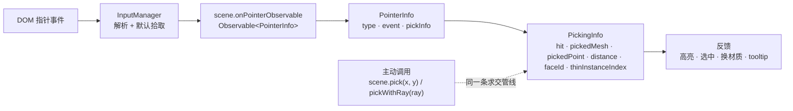

import { Canvas, Controls, Meta } from '@storybook/addon-docs/blocks';
import * as PickStories from './pointer-input-and-picking.stories';

<Meta of={PickStories} name="Docs" />

# 指针与拾取

Babylon.js 的指针交互由两条相互独立又首尾相接的链路组成：**事件流**把 DOM 指针事件转成 `scene.onPointerObservable` 上的 `PointerInfo`；**拾取**把屏幕坐标反投影成世界射线，与 `AbstractMesh` 求交得到 `PickingInfo`。Observable 是 5.1 [Observables 与事件](?path=/docs/observables-and-events--docs) 讲过的通用订阅机制，本课把它接到指针上，并补齐"命中之后怎么读、怎么主动触发、怎么过滤"的下半段。

先建立三条判断，后面的 API 才不容易混：

- **事件类型决定何时回调，pickInfo 决定命中谁。** `PointerInfo.type` 是 `PointerEventTypes` 的位常量（POINTERMOVE / POINTERDOWN / POINTERUP / POINTERPICK / POINTERTAP / POINTERWHEEL / POINTERDOUBLETAP）；`PointerInfo.pickInfo` 持有 `PickingInfo`，含 `hit`、`pickedMesh`、`pickedPoint`、`distance`、`faceId`、`thinInstanceIndex` 等命中字段。
- **被动订阅与主动拾取是两条入口。** `onPointerObservable` 是被动等事件来；`scene.pick(x, y)` / `scene.pickWithRay(ray, predicate)` 是主动发起一次求交，常用于"在任意时刻查某点下有什么"（瞄准线、技能释放、tooltip 跟手）。
- **能否被命中由 `mesh.isPickable` 与 predicate 共同决定。** 默认要求 mesh `isEnabled() && isVisible && isPickable`（`pickWithRay` 略宽，只要 `isPickable`）；自定义 `MeshPredicate (mesh, thinInstanceIndex) => boolean` 在默认之上再加一层业务过滤。



| 输入或概念 | 默认 / 常用 | 回查要点 |
| --- | --- | --- |
| `scene.onPointerObservable` | `Observable<PointerInfo>` | 5.1 Observable 在指针上的应用；`add` 返回 `Observer`，可 `.remove()` 或 `observable.remove(observer)` |
| `scene.onPointerObservable.add(cb, mask?)` | `mask` 缺省时全部类型都回调 | `mask` 是位掩码，可只接 `PointerEventTypes.POINTERMOVE \| PointerEventTypes.POINTERPICK`，少做无用 switch |
| `PointerInfo.type` | `number`（位常量） | 与 `PointerEventTypes` 的 7 个常量比较；一个事件只对应一个 type |
| `PointerInfo.event` | DOM `PointerEvent` / `MouseWheelEvent` | 拿 `clientX/Y`、`button`、`ctrlKey` 等 DOM 字段；POINTERWHEEL 是 `MouseWheelEvent` |
| `PointerInfo.pickInfo` | `Nullable<PickingInfo>` | 懒生成：POINTERMOVE/DOWN/UP/PICK/TAP 在需要时算；POINTERWHEEL 通常为 `null` |
| `PointerEventTypes.POINTERPICK` | `16` | mesh 上按下并松开（无拖动）才触发；`pickInfo.hit` 必为 `true` |
| `PointerEventTypes.POINTERTAP` | `32` | 与 PICK 同源（pickedDownMesh === pickedUpMesh）；触发时机由内部 click 检测决定 |
| `scene.pick(x, y, predicate?, fastCheck?, camera?, trianglePredicate?)` | 返回 `PickingInfo`（永不 `null`） | `x`/`y` 是 canvas 像素坐标，**不是 NDC**——Babylon 内部完成反投影 |
| `scene.pickWithRay(ray, predicate?, fastCheck?, trianglePredicate?)` | 返回 `Nullable<PickingInfo>` | 用自定义射线（瞄准线、技能方向）；`predicate` 只要 `isPickable` |
| `MeshPredicate` | `(mesh: AbstractMesh, thinInstanceIndex: number) => boolean` | thin instances 的索引在第 2 参；返回 `false` 即排除 |
| `mesh.isPickable` | `true` | 设 `false` 让默认 predicate 直接跳过该 mesh |
| `scene.pointerX` / `pointerY` | canvas 像素坐标 | 取最近一次指针位置；与 `scene.pick(scene.pointerX, scene.pointerY)` 配合 |
| `scene.skipPointerMoveParsing` | `false` | 置 `true` 关闭 POINTERMOVE 期间的拾取，省一帧求交（hover 不再更新 pickInfo） |

## 指针事件入口：scene.onPointerObservable

`onPointerObservable` 是 `Observable<PointerInfo>` 的实例，挂在 `Scene` 上。引擎的 `InputManager` 在 canvas 的 DOM 指针事件回调里把它转成 `PointerInfo` 并 `notifyObservers`——你只订阅 observable，不直接碰 DOM。这与 5.1 [Observables 与事件](?path=/docs/observables-and-events--docs) 讲的渲染 / 键盘 observable 是同一套机制。

```ts
import { PointerEventTypes } from '@babylonjs/core';

scene.onPointerObservable.add((pi) => {
  switch (pi.type) {
    case PointerEventTypes.POINTERMOVE:
      // pi.pickInfo 已带命中信息（默认开启；可用 scene.skipPointerMoveParsing 关闭）。
      break;
    case PointerEventTypes.POINTERDOWN:
    case PointerEventTypes.POINTERUP:
      break;
    case PointerEventTypes.POINTERPICK:
      // mesh 上按下并松开才触发；pi.pickInfo.hit 必为 true。
      break;
    case PointerEventTypes.POINTERTAP:
    case PointerEventTypes.POINTERDOUBLETAP:
      break;
    case PointerEventTypes.POINTERWHEEL:
      // pi.pickInfo 通常为 null。
      break;
  }
});
```

`add` 的第 2 参 `mask` 是位掩码。`PointerEventTypes` 的常量值取位段（POINTERDOWN=1、POINTERUP=2、POINTERMOVE=4、POINTERWHEEL=8、POINTERPICK=16、POINTERTAP=32、POINTERDOUBLETAP=64），按位或就能只接感兴趣的事件，引擎在分发前用 `hasSpecificMask` 过滤——少做无用 switch，也省去对其他事件的求交：

```ts
// 只接 MOVE 与 PICK：mask = POINTERMOVE | POINTERPICK
scene.onPointerObservable.add(
  (pi) => { /* ... */ },
  PointerEventTypes.POINTERMOVE | PointerEventTypes.POINTERPICK,
);
```

`add` 返回 `Observer<PointerInfo>`，需要时显式 `observer.remove()`（或 `observable.remove(observer)`）。`scene.dispose()` 会清空所有 observable，但热替换场景或临时订阅里漏掉 `remove` 仍是常见内存泄漏源——见 5.1 课的清理范式。

> Babylon 还保留着旧式回调 `scene.onPointerDown = (evt, pickInfo, type) => ...` / `onPointerMove` / `onPointerUp` / `onPointerPick`。它们只能各挂一个、且无法用 mask 过滤；新代码统一走 `onPointerObservable`。还有一个 `scene.onPrePointerObservable`（`PointerInfoPre`）在 mesh 拾取**之前**触发，可置 `skipOnPointerObservable = true` 阻止后续分发，用于自定义输入设备（6DoF 控制器、近场交互）拦截默认行为。

### PointerEventTypes：7 个事件类型

7 个常量按位编号，对应 7 类 DOM 指针事件：

| 常量 | 值 | 触发时机 | pickInfo 状态 |
| --- | --- | --- | --- |
| `POINTERDOWN` | `1` | 指针按下（鼠标左/中/右键、触摸、笔） | 已计算，访问时返回 |
| `POINTERUP` | `2` | 指针松开 | 已计算 |
| `POINTERMOVE` | `4` | 指针移动 | 默认计算；`scene.skipPointerMoveParsing = true` 时为 `null` |
| `POINTERWHEEL` | `8` | 鼠标滚轮滚动 | 通常 `null`（事件来自 `MouseWheelEvent`） |
| `POINTERPICK` | `16` | 在 mesh 上按下并松开（pickedDownMesh === pickedUpMesh） | `hit=true`，命中被点中的 mesh |
| `POINTERTAP` | `32` | 与 PICK 同源，分发时机由内部 click 检测决定 | 同 PICK |
| `POINTERDOUBLETAP` | `64` | 同一对象上双击 | 同 PICK |

`POINTERPICK` 与 `POINTERTAP` 是从 `POINTERDOWN`+`POINTERUP` 派生的"语义事件"：引擎记录按下时命中的 mesh，松开时再求交一次，两次命中**同一个 mesh** 且中间没有显著拖动，才触发 PICK 与 TAP。它们只在 mesh 命中时触发——`pickInfo.hit` 必为 `true`。两者在普通点击时几乎同时分发；区别在于"何时分发"由引擎内部的 click/tap 判定（双击窗口、移动阈值等）控制，行为更接近 UI 框架的 `click` / `tap` 语义。

> 想接"右键点击 mesh"或"任意键 + 点击"：右键不会触发 POINTERPICK（引擎只在主键点击时派生 PICK），但 `POINTERDOWN` / `POINTERUP` 一定回调，读 `pi.event.button`（0=左，1=中，2=右）与 `pi.event.ctrlKey / shiftKey / altKey` 自行组合。

### PointerInfo 与 pickInfo

`PointerInfo` 是 `onPointerObservable` 的事件对象，三个公开成员：

| 成员 | 类型 | 含义 |
| --- | --- | --- |
| `type` | `number` | 对应 `PointerEventTypes` 的位常量 |
| `event` | DOM `PointerEvent` / `MouseWheelEvent` | 原生 DOM 事件，取 `clientX/Y`、`button`、`ctrlKey` 等 |
| `pickInfo` | `Nullable<PickingInfo>` | 命中信息；懒生成 |

`pickInfo` 是**懒生成**的 getter：第一次访问时，若尚未求交，会调 `scene.pick` 计算并缓存。POINTERMOVE / DOWN / UP 在分发前已求交（除非 `skipPointerMoveParsing` 等开关关闭），POINTERPICK / TAP / DOUBLETAP 必带命中结果。`POINTERWHEEL` 不触发求交，`pickInfo` 为 `null`。

`PointerInfo` 还有个 `pickInfo.ray`——`scene._setRayOnPointerInfo` 会在分发前把当前射线附在 `pickInfo.ray` 上，便于"沿着指针射线做 raycast 命中其他东西"（例如近场交互屏蔽）。普通屏幕指针用不到，但 6DoF 控制器和 WebXR 指针射线就靠它。

## 命中信息：PickingInfo

`PickingInfo` 把"指针打到哪了"装成一个对象，所有命中分支都从这里取值：

| 字段 | 类型 | 含义 |
| --- | --- | --- |
| `hit` | `boolean` | 是否命中任何可拾取对象 |
| `pickedMesh` | `Nullable<AbstractMesh>` | 命中的 mesh；InstancedMesh 命中时是实例本身（`isAnInstance` 为 `true`），用 `sourceMesh` 取源 |
| `pickedPoint` | `Nullable<Vector3>` | 命中点的世界坐标；`hit=false` 时为 `null` |
| `distance` | `number` | 从射线起点到命中点的世界距离，按它升序排序 |
| `faceId` | `number` | 命中三角形在 geometry 中的索引；未命中时为 `-1`（`LinesMesh` 是线段索引） |
| `subMeshFaceId` / `subMeshId` | `number` | 子网格内的面索引 / 子网格 id |
| `bu` / `bv` | `number` | 命中点在三角形内的重心坐标（`getTextureCoordinates` 用它算 UV） |
| `thinInstanceIndex` | `number` | thin instances 命中时给出第几个实例；非 instanced mesh 为 `-1` |
| `pickedSprite` | `Nullable<Sprite>` | 命中 sprite 时给出 sprite 对象（需 `spriteManager.isPickable` 与 `sprite.isPickable` 都为 `true`） |
| `ray` | `Nullable<Ray>` | 用于求交的射线；6DoF / XR 输入时有值 |
| `originMesh` | `Nullable<AbstractMesh>` | 近场交互时作为"指针"的 mesh |
| `getNormal(useWorldCoordinates?, useVerticesNormals?)` | 方法 | 命中面的法线；默认局部坐标、用顶点法线插值 |
| `getTextureCoordinates(uvSet?)` | 方法 | 命中点的 UV，用于"贴图上的某点被点中"判断 |

`hit`、`pickedMesh`、`pickedPoint`、`distance` 是日常反馈最常用的四个字段。`faceId` 在做"按面片上色""点击切换材质"时有用；`getNormal()` 配合粒子或放置物体（"在地面上放一个标记"）。

```ts
scene.onPointerObservable.add((pi) => {
  if (pi.type !== PointerEventTypes.POINTERPICK) return;
  const info = pi.pickInfo;
  if (info?.hit && info.pickedMesh) {
    console.log(info.pickedMesh.name, info.pickedPoint, info.distance);
    const normal = info.getNormal(true); // 世界空间法线
  }
});
```

## 主动拾取

被动订阅等的是"用户操作触发的事件"。当你需要在**任意时刻**查"某点下是什么"——瞄准线、技能释放、tooltip 跟手、键盘触发选择——就要主动调一次拾取。Babylon 把同一条求交管线暴露成两个方法：

```ts
// 屏幕 → 世界：内部完成反投影，x/y 是 canvas 像素坐标（不是 NDC！）
const info = scene.pick(scene.pointerX, scene.pointerY);

// 自定义射线：方向、长度都自定，常用于瞄准线 / 技能方向
import { Ray, Vector3 } from '@babylonjs/core';
const ray = new Ray(origin, direction, maxLength);
const info = scene.pickWithRay(ray);
```

注意 `scene.pick(x, y, ...)` 的 `x` / `y` 是**画布像素坐标**，与 `scene.pointerX` / `pointerY` 对齐——不需要像 three.js 那样手工换算 NDC，引擎内部用相机的投影 / 视图矩阵反投影成射线。`pickWithRay` 用你给的射线，不再走屏幕坐标，适合"从枪口向前 100 单位求交"这类世界空间的拾取。

两个方法的完整签名：

```ts
scene.pick(
  x, y,
  predicate?,           // MeshPredicate：(mesh, thinInstanceIndex) => boolean
  fastCheck?,           // true = 命中第一个即返回，不求最近
  camera?,              // 默认 scene.activeCamera
  trianglePredicate?,   // TrianglePickingPredicate：逐三角形过滤
): PickingInfo;

scene.pickWithRay(
  ray,
  predicate?,
  fastCheck?,
  trianglePredicate?,
): Nullable<PickingInfo>;   // 射线未命中任何对象时返回 null
```

`pick` 永远返回 `PickingInfo`（哪怕 `hit=false`），`pickWithRay` 可能返回 `null`。需要"所有命中对象"而非最近一个时用 `scene.multiPick` / `multiPickWithRay`，返回 `PickingInfo[]`（按距离升序）。

### predicate 与 isPickable

predicate 是核心过滤机制，类型是 `MeshPredicate`：

```ts
type MeshPredicate = (mesh: AbstractMesh, thinInstanceIndex: number) => boolean;
```

`pick` 与 `pickWithRay` 的默认 predicate 不同：

| 方法 | 默认 predicate |
| --- | --- |
| `scene.pick` | `mesh.isEnabled() && mesh.isVisible && mesh.isPickable` |
| `scene.pickWithRay` | `mesh.isPickable` |

`pickWithRay` 的过滤更宽（不强制 visible / enabled），因为它常被用于"求一条射线撞到了哪些物体"，哪怕它们此刻不可见（例如透明碰撞体、隐形墙）。

`mesh.isPickable` 默认 `true`——不想被拾取就显式置 `false`，最常见的应用是把地面、天空盒、辅助网格排除：

```ts
const ground = MeshBuilder.CreateGround('ground', { width: 16, height: 10 }, scene);
ground.isPickable = false; // 不挡下面的物体
```

自定义 predicate 在默认之上再加业务过滤（按名字、按 tag、按自定义属性）：

```ts
// 只拾取"可选中"的对象（自定义 metadata）
const pick = scene.pick(scene.pointerX, scene.pointerY, (mesh) => {
  return mesh.isEnabled() && mesh.isVisible && mesh.isPickable
    && mesh.metadata?.selectable === true;
});

// thin instances：用第 2 参索引进一步过滤具体实例
scene.pick(x, y, (mesh, idx) => idx % 2 === 0); // 只接偶数索引实例
```

`onPointerObservable` 分发用的也是同一套 predicate——scene 上挂了 `scene.pointerMovePredicate` / `pointerDownPredicate` / `pointerUpPredicate`，引擎在内部按事件类型选用。给 `scene.pick` 写 predicate 与给 `scene.pointerDownPredicate` 写是同一段逻辑，区别只在"主动调用 vs 事件分发时自动用"。

### trianglePredicate：三角形级过滤

逐三角形过滤是更细的控制，类型是 `TrianglePickingPredicate`：

```ts
type TrianglePickingPredicate = (
  p0: Vector3, p1: Vector3, p2: Vector3, // 三角形三个顶点（世界空间）
  ray: Ray,
  i0: number, i1: number, i2: number,    // 顶点索引
) => boolean;
```

它让每个被射线穿过的三角形再过一道闸——返回 `false` 的三角形不参与命中。最经典的用途是**背面剔除式拾取**：只接面朝相机的三角形，跳过背面：

```ts
scene.pick(x, y, null, false, null, (p0, p1, p2, ray) => {
  const normal = Vector3.Cross(p1.subtract(p0), p2.subtract(p0));
  return Vector3.Dot(ray.direction, normal) < 0; // 射线方向与法线反向才算命中
});
```

也可用于"只拾取特定材质 index 的子网格"或"按顶点属性过滤"，但代价是与每个被穿过的三角形都执行一次回调，密集网格上慎用。

## hover、click 与选中反馈

三种最常见的交互模式：

| 模式 | 触发事件 | 典型反馈 |
| --- | --- | --- |
| hover | `POINTERMOVE`（持续，鼠标停下不再触发） | 高亮、tooltip、改变光标 |
| click | `POINTERPICK` 或 `POINTERTAP`（mesh 命中、无拖动） | 选中、触发动作 |
| 选中（持续态） | 业务状态，不直接绑事件 | 持久高亮、属性面板 |

`POINTERMOVE` 在鼠标停下时不再触发——若每帧重置高亮，事件间隙对象会回到基础态。把"当前 hover 目标"存进 state，每帧按 state 应用而不是只在事件回调里改一次。

高亮顺序固定为**重置 → 选中 → hover**：先把所有对象还原到基础态，再写选中色，最后写 hover 色；同一对象同时被两种状态命中时跳过 hover，让选中色保持可见：

```ts
scene.onBeforeRenderObservable.add(() => {
  // 1. 重置
  for (const m of pickables) m.material.emissiveColor.copyFrom(baseColorOf(m));
  // 2. 选中
  if (selected) selected.material.emissiveColor.copyFrom(SELECT_COLOR);
  // 3. hover（与选中重合时跳过）
  if (hover && hover !== selected) hover.material.emissiveColor.copyFrom(HOVER_COLOR);
});
```

共享 material 时，"只高亮一个对象"必须为该对象单独克隆 material（hover/选中改 emissive 才不互相干扰），或改用 InstancedMesh 的逐实例颜色、或借助 [图层与高亮](?path=/docs/highlight-and-glow-layers--docs) 课的 `HighlightLayer`（描边，不依赖材质克隆）。`emissiveColor` 是受光材质的自发光通道，不动基础色、不需要后处理就能区分——是 hover/选中轻量反馈的默认选择。

**与相机控制共存。** `camera.attachControl(canvas, true)` 后相机也消费指针：左键拖拽旋转、滚轮缩放、右键/Ctrl+左键平移。Babylon 不需要你手工区分"点击 vs 拖动"——引擎记录按下时命中的 mesh，松开时再求交一次，两次不一致（拖动期间相机转了，松开点已不在原 mesh）就不触发 `POINTERPICK` / `POINTERTAP`。所以"拖拽旋转相机"与"点击选中对象"天然共存：松开时若仍在同一对象上才认为是点击。

下面范例把这条流水线跑通：5 个盒子 + 5 个球摆成两行，hover 变黄、click 变红（持续）、点空地取消选中；切换「拾取过滤」演示 predicate 过滤，切换「选中事件」演示 POINTERPICK 与 POINTERTAP 的同源关系；读数给出最近事件类型、指针坐标、命中 mesh / 点 / 距离 / hover / 选中。

<Canvas of={PickStories.Pick} />

<Controls of={PickStories.Pick} />

| 读者操作 | 可观察证据 |
| --- | --- |
| 在 canvas 上悬停某个盒子或球 | 该对象 emissive 变黄；读数「最近事件」为 `POINTERMOVE`，「当前 hover」更新 |
| 点击一个对象 | 该对象 emissive 变红（持续）；「命中 mesh」「命中点」「距离」「当前选中」同步刷新 |
| 点击地面（空白区） | 地面 `isPickable=false`，被默认 predicate 排除；「当前选中」清空 |
| 拖拽 canvas 旋转相机，松开时指针已不在原对象上 | 不触发 `POINTERPICK` / `POINTERTAP`，「当前选中」保持原值——相机控制不误触发选中 |
| 切「拾取过滤」到「仅盒子」 | 球类不再响应 hover/click（predicate 过滤）；hover/selected 被立即清出 |
| 切「选中事件」到 `POINTERTAP` | 选中改由 `POINTERTAP` 触发，读数「最近事件」相应切换 |
| 把鼠标移出 canvas | `POINTERMOVE` 不再触发，hover 状态保留最后一帧（生产场景应在 `pointerleave` 清空 hover） |

## 实例化对象的拾取

[实例化](?path=/docs/instanced-mesh-and-thin-instances--docs) 把"一份几何 + 一份材质 + 一次 draw call"渲染 N 个对象，两种机制在拾取上的表现不同：

| 机制 | 默认可拾取 | 命中后取值 |
| --- | --- | --- |
| **InstancedMesh** | 是（每个实例是 `scene.meshes` 里的独立 `AbstractMesh`） | `pickInfo.pickedMesh` 就是命中的实例；用 `isAnInstance` / `sourceMesh` 取源 |
| **thin instances** | 否（实例只是矩阵缓冲，不是 `scene.meshes` 里的对象） | 置 `mesh.thinInstanceEnablePicking = true` 后，`pickInfo.thinInstanceIndex` 给出第几个实例 |

InstancedMesh 拾取走标准三角形求交，命中后 `pickedMesh` 直接就是那个实例，可以单独换 `material`（注意：与源共享材质时换色会影响所有实例，需要为该实例 `makeGeometryUnique` 或借助 `thinInstanceRegisterAttribute` 走 thin 路径）。

thin instances 的拾取**默认关闭**，因为逐实例求交需要解码每个矩阵、代价高于整体包围盒粗检：

```ts
mesh.thinInstanceEnablePicking = true;
const pick = scene.pick(scene.pointerX, scene.pointerY);
if (pick?.hit && pick.thinInstanceIndex >= 0) {
  // 用索引在矩阵缓冲里反查该实例的世界变换
}
```

置 `true` 后引擎在 mesh 整体包围盒命中的前提下，进一步对每个 thin 实例做精确求交，把命中索引写进 `pickInfo.thinInstanceIndex`。这个粗 + 细两阶段的代价适合"选中哪一株"这类反馈，不适合在每帧 `POINTERMOVE` 上对极大量 thin 实例触发精确求交——必要时把可拾取的实例集合做空间划分或单独维护一份 InstancedMesh 副本，把"显示"和"拾取"解耦。

> 与 thin instances 的 `MeshPredicate` 第二参 `thinInstanceIndex` 配合时，先开 `thinInstanceEnablePicking`，再用 predicate 在索引层面过滤，比逐实例求交后再丢掉更省——引擎在 `predicate(mesh, idx)` 返回 `false` 时直接跳过该实例的进一步求交。

## 最佳实践

- 全程只挂一个 `onPointerObservable` 订阅，用 `pi.type` 分发；多个并列 observable 容易漏 mask 与清理。需要更细粒度时用 `mask` 第二参，不让引擎做无用 switch。
- 区分 hover、click、选中三种状态：hover 跟 `POINTERMOVE`、click 用 `POINTERPICK` / `POINTERTAP`、选中是业务状态。
- 高亮顺序固定为"重置 → 选中 → hover"，让两种状态视觉上可分辨；同一对象同时被两种状态命中时跳过 hover。
- 共享 material 时为单独高亮的对象克隆一份 material，或改用 InstancedMesh 逐实例颜色 / `HighlightLayer` 描边；不要让一次 hover 联动改变其他对象。
- 把不想被命中的对象（地面、天空盒、辅助网格、Collider）显式 `isPickable = false`，让默认 predicate 直接跳过——比写自定义 predicate 更便宜。
- 主动拾取复用同一个 `scene`，不要为每次事件新建对象；`scene.pick` 永远返回 `PickingInfo`（哪怕 `hit=false`），别忘判 `hit`。
- 大场景频繁拾取时优先收紧 predicate（少参与对象）而非用 `trianglePredicate`；逐三角形回调只在密集网格上很贵。
- `add` 返回的 `Observer` 在热替换 / 临时订阅里要显式 `remove()`，`scene.dispose()` 会清空全部 observable，但场景不销毁时漏 remove 是常见泄漏源。
- thin instances 需要拾取时才开 `thinInstanceEnablePicking`，整体包围盒粗检 + 逐实例精检有成本，静态场景可按需开关。
- 鼠标离开 canvas 时清空 hover（范例未演示，生产场景监听 `pointerleave` 处理），避免最后一个 hover 对象一直保持高亮。

## 常见问题

- 为什么 `pi.pickInfo` 在 POINTERWHEEL 上是 `null`？
  滚轮事件不触发引擎的拾取阶段，`pickInfo` 默认不计算。需要"滚轮下命中谁"时主动 `scene.pick(scene.pointerX, scene.pointerY)` 求一次。
- 为什么点击 mesh 没触发 `POINTERPICK`？
  `POINTERPICK` 要求按下与松开命中**同一个 mesh** 且中间无显著拖动。`attachControl` 的相机在拖拽时旋转，松开点已不在原对象上就不触发——这是相机控制与点击选中共存的副作用。要"按下就触发"改用 `POINTERDOWN`，但会同时响应拖拽起点。
- 为什么 hover 时 mesh 闪一下就回基础色？
  hover 写在 `POINTERMOVE` 回调里，鼠标停下不再触发；每帧重置高亮就会让对象回到基础态。把 hover 目标存进 state，每帧按 state 应用而不是只在事件回调里写一次。
- 为什么 `scene.pick` 返回的 `pickedMesh` 是地面 / 不可见对象？
  默认 predicate 要求 `isPickable`、`isEnabled()`、`isVisible`，但地面这类背景几何也满足——把不想被命中的对象显式 `isPickable = false`，或写 predicate 按名字 / 自定义属性过滤。
- 为什么 `pickWithRay` 命中了 `isVisible = false` 的 mesh？
  `pickWithRay` 的默认 predicate 只要 `isPickable`，不强制可见。常用于"对隐形碰撞体求交"；想排除不可见对象，自定义 predicate 加 `mesh.isVisible`。
- 为什么 thin instances 命中后 `thinInstanceIndex` 一直是 `-1`？
  默认 `thinInstanceEnablePicking` 是 `false`，置 `true` 后引擎才在整体包围盒命中的前提下做逐实例精检，把索引写进 `pickInfo.thinInstanceIndex`。
- 为什么 InstancedMesh 命中后单独换 emissive 颜色，所有实例都变色？
  实例与源共享 material，改源材质就联动所有引用者。需要单独染色时为该实例单独 `makeGeometryUnique` + 克隆材质，或改用 thin instances + `thinInstanceRegisterAttribute("color", 4)`。
- 为什么相机拖拽时，松开不触发选中？
  引擎记录按下时的 `pickedDownMesh`，松开时若不在同一对象（拖拽期间相机旋转，松开点已在邻居上）就不派生 `POINTERPICK` / `POINTERTAP`。这是引擎内置的"点击 vs 拖动"判定，无需手写位移/时间阈值。
- `scene.pick` 与 `pickWithRay` 的 predicate 默认值为什么不同？
  `pick` 用于屏幕拾取，默认排除不可见 / 禁用 / `isPickable=false` 的对象；`pickWithRay` 常用于世界空间求交（瞄准线、技能），保留隐形碰撞体的命中能力，默认只要 `isPickable`。

## 总结回顾

摘要：

Babylon.js 的指针交互由事件流与拾取两条链路组成。`scene.onPointerObservable` 是 `Observable<PointerInfo>`：`pi.type` 区分 7 类 `PointerEventTypes`（POINTERMOVE / DOWN / UP / PICK / TAP / DOUBLETAP / WHEEL），`pi.pickInfo` 懒生成 `PickingInfo`，含 `hit` / `pickedMesh` / `pickedPoint` / `distance` / `faceId` / `thinInstanceIndex`。被动订阅用 `add(cb, mask?)` 返回的 `Observer` 显式 `remove()`；主动拾取用 `scene.pick(x, y, predicate?, ...)`（屏幕像素坐标）或 `scene.pickWithRay(ray, predicate?, ...)`（世界射线），`MeshPredicate` 在 `isPickable` / `isEnabled` / `isVisible` 之外再加业务过滤。`POINTERPICK` 与 `POINTERTAP` 由按下 + 松开于同一 mesh 派生，与相机控制天然共存。反馈遵循"重置 → 选中 → hover"的顺序；InstancedMesh 默认可拾取，thin instances 需 `thinInstanceEnablePicking = true`。

一句话：

> 事件链路是 DOM 指针 → `onPointerObservable` 的 `PointerInfo` → `pickInfo`，被动订阅与主动 `scene.pick` / `pickWithRay` 共用同一条求交管线，hover / click / 选中都从 `PickingInfo` 取命中结果。

知识要点：

- `scene.onPointerObservable` 上的 `PointerInfo` 有哪三个成员？`pickInfo` 何时为 `null`？
- `PointerEventTypes` 的 7 个常量分别什么时候触发？`POINTERPICK` 与 `POINTERTAP` 有什么联系与差别？
- `scene.pick(x, y)` 与 `scene.pickWithRay(ray, predicate)` 各自的 `x/y` 是什么坐标？两个 predicate 默认值有何不同？
- `MeshPredicate` 的签名是什么？`isPickable` 与默认 predicate 的关系？
- hover、click、选中分别绑什么事件？为什么高亮顺序固定为"重置 → 选中 → hover"？
- InstancedMesh 与 thin instances 在拾取上各有什么默认行为？thin instances 的逐实例拾取怎么开启？
- 为什么拖拽相机时松开不触发 `POINTERPICK`？这解决了什么问题？

## 参考资料

- [Babylon.js Features：Interact With Scenes（onPointerObservable）](https://doc.babylonjs.com/features/featuresDeepDive/scene/interactWithScenes)
- [Babylon.js Features：Picking Collisions](https://doc.babylonjs.com/features/featuresDeepDive/mesh/interactions/picking_collisions)
- [Babylon.js Features：Instances & Picking（thinInstanceIndex）](https://doc.babylonjs.com/features/featuresDeepDive/mesh/copies/instances)
- [Babylon.js TypeDoc：PointerEventTypes](https://doc.babylonjs.com/typedoc/classes/BABYLON.PointerEventTypes)
- [Babylon.js TypeDoc：PointerInfo](https://doc.babylonjs.com/typedoc/classes/BABYLON.PointerInfo)
- [Babylon.js TypeDoc：PickingInfo](https://doc.babylonjs.com/typedoc/classes/BABYLON.PickingInfo)
- [Babylon.js TypeDoc：Scene.pick / pickWithRay](https://doc.babylonjs.com/typedoc/classes/BABYLON.Scene)
- [Babylon.js TypeDoc：Observable / Observer](https://doc.babylonjs.com/typedoc/classes/BABYLON.Observable)
