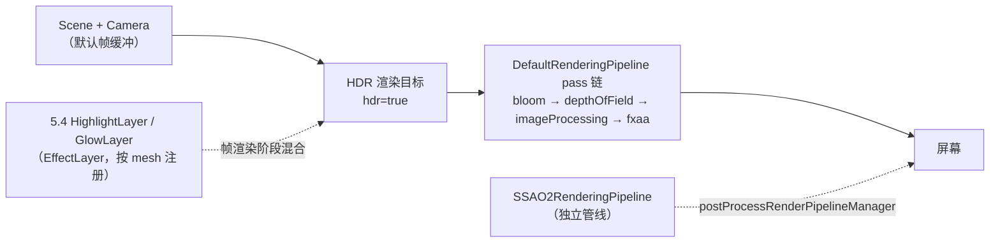

import { Canvas, Controls, Meta } from '@storybook/addon-docs/blocks';
import * as Stories from './post-processing.stories';

<Meta of={Stories} name="Docs" />

# 后处理

后处理把"画场景"和"画到屏幕"拆成两步：先把整帧场景渲染到离屏纹理，再用一条 pass 链依次读写双缓冲、做全屏特效，链尾才送到屏幕。Babylon.js 用 `DefaultRenderingPipeline` 给这条链一个统一入口——一个对象管 bloom、FXAA、景深、image processing（tone mapping / contrast / exposure）等内置效果，靠布尔开关和数值属性控制，不必手动拼 pass。

先建立四条判断，后面的 API 才不容易混：

- **DefaultRenderingPipeline 是统一入口，不是单张 pass。** `new DefaultRenderingPipeline(...)` 构造时自动把自己挂到 `scene.postProcessRenderPipelineManager`；之后改 `bloomEnabled` / `fxaaEnabled` 等属性，pipeline 会自动重建内部 pass 链（`automaticBuild` 默认 `true`）。你只面对高层开关，不直接拼 `PostProcess`。
- **Bloom 需要 HDR。** 构造第二个参数 `hdr` 默认就是 `true`；它让渲染目标保留 >1 的亮度，bloom 才能从"亮过 1.0 的像素"提取光晕。关掉 HDR 后高亮被钳到 1.0，bloom 会显著变弱。
- **景深参数在 `pipeline.depthOfField` 上，不在 pipeline 顶层。** 开关 `depthOfFieldEnabled` 在 pipeline 上；但 `focalLength` / `fStop` / `focusDistance` 在 `pipeline.depthOfField`（`DepthOfFieldEffect`）子对象上——`focusDistance` 的单位是 scene units / 1000（毫米），10 个 Babylon 单位 ≈ 10000。
- **SSAO 不在 DefaultRenderingPipeline 上。** 环境光遮蔽是独立的 `SSAO2RenderingPipeline`，靠 `scene.postProcessRenderPipelineManager` 挂载，与 DefaultRenderingPipeline 并列。这是本课与"一个开关管一切"直觉的最大差别。



| 输入或概念 | 默认 / 常用 | 回查要点 |
| --- | --- | --- |
| `new DefaultRenderingPipeline(name?, hdr?, scene?, cameras?, automaticBuild?)` | `name=""`、`hdr=true`、`scene=最后创建的`、`cameras=scene.cameras`、`automaticBuild=true` | 全部参数可选；构造时自动 `addPipeline`，不必手动挂 |
| `pipeline.bloomEnabled` | `false` | Bloom 总开关；开启后需配合 HDR 与高 emissive 才有明显光晕 |
| `pipeline.bloomThreshold` | `0.9` | Luma 阈值，只有亮度高于此值的像素参与 bloom；调低让中等亮度物体也发光 |
| `pipeline.bloomWeight` | `0.15` | 光晕叠加强度，`0` 等于不叠 |
| `pipeline.bloomKernel` | `64` | 模糊核大小，越大越散；相对最终输出尺寸 |
| `pipeline.bloomScale` | `0.5` | Bloom 内部缓冲相对主画面的尺寸比，调小省性能 |
| `pipeline.fxaaEnabled` | `false` | FXAA 总开关；全屏抗锯齿，只对几何边缘有效 |
| `pipeline.depthOfFieldEnabled` | `false` | 景深总开关 |
| `pipeline.depthOfFieldBlurLevel` | `DepthOfFieldEffectBlurLevel.Low` | `Low` / `Medium` / `High`，越高越糊越费 |
| `pipeline.depthOfField.focalLength` | `50` | 镜头焦距（毫米）；光圈直径 ≈ focalLength / fStop |
| `pipeline.depthOfField.fStop` | `1.4` | 光圈 f 值，越小景深越浅（虚化越强） |
| `pipeline.depthOfField.focusDistance` | `2000` | 对焦距离（scene units / 1000，即毫米）；焦平面外虚化 |
| `pipeline.imageProcessingEnabled` | `true` | Image processing 总出口（tone mapping / contrast / exposure / vignette / color curves） |
| `pipeline.imageProcessing.toneMappingEnabled` | `false` | Tone mapping 开关；链接 3.4 PBR 的色调映射 |
| `pipeline.imageProcessing.exposure` / `contrast` | `1` / `1` | 曝光 / 对比度 |
| `pipeline.samples` | `1` | MSAA 采样数（硬件多采样）；`4` = 4x MSAA，与 FXAA 可叠加 |
| `new SSAO2RenderingPipeline(name, scene, ratio, cameras?, ...)` | `ratio` 可传数字 | 独立管线，构造自动 `addPipeline` + `attachCameras`；不在 DefaultRenderingPipeline 上 |
| `ssao2.totalStrength` / `radius` / `samples` | `1.0` / `2.0` / `8` | SSAO 强度 / 采样半径 / 采样数 |

## 快速上手

最小闭环：构造一个 DefaultRenderingPipeline，开启 bloom 和 FXAA，场景里放一个强 emissive 物体：

```ts
import {
  ArcRotateCamera,
  DefaultRenderingPipeline,
  HemisphericLight,
  MeshBuilder,
  Scene,
  StandardMaterial,
  Vector3,
  Color3,
  Engine,
} from '@babylonjs/core';

const engine = new Engine(canvas, true);
const scene = new Scene(engine);
const camera = new ArcRotateCamera('cam', -Math.PI / 2, Math.PI / 2, 8, Vector3.Zero(), scene);
camera.attachControl(canvas, true);
new HemisphericLight('hemi', new Vector3(0, 1, 0), scene);

const bulb = MeshBuilder.CreateSphere('bulb', { diameter: 1 }, scene);
const bulbMat = new StandardMaterial('bulbMat', scene);
// emissive > 1.0 配合 HDR，让默认 threshold=0.9 下也能 bloom。
bulbMat.emissiveColor = new Color3(1.4, 1.15, 0.45);
bulb.material = bulbMat;

// hdr 默认就是 true，这里显式写出来强调 bloom 对它的依赖。
const pipeline = new DefaultRenderingPipeline('default', true, scene, [camera]);
pipeline.bloomEnabled = true;
pipeline.fxaaEnabled = true;

engine.runRenderLoop(() => scene.render());
window.addEventListener('resize', () => engine.resize());
```

`new DefaultRenderingPipeline(...)` 之后，引擎里就多了一条全屏 pass 链：原本直接画到屏幕的帧先进入 HDR 渲染目标，经过 bloom / image processing / fxaa 等环节，最后才送到屏幕。你不需要 `engine.runRenderLoop` 做任何额外操作——pipeline 自动介入 `scene.render()`。

## DefaultRenderingPipeline：统一入口

`DefaultRenderingPipeline` 继承 `PostProcessRenderPipeline`，构造时把内置效果（sharpen、bloom、depthOfField、imageProcessing、fxaa、grain、chromaticAberration）以"关"的状态全部创建好，靠各自的 `*Enabled` 布尔位切换。每次你改一个开关，pipeline 默认会自动重建 pass 链（`automaticBuild = true`）——这正是它"统一入口"的含义：你只面对高层属性，不直接管理 pass 数组。

构造签名（全部可选）：

```ts
new DefaultRenderingPipeline(
  name = '',
  hdr = true,
  scene = Scene.LastCreatedScene,
  cameras = scene.cameras,
  automaticBuild = true,
);
```

- **`hdr` 默认 `true`。** Bloom 依赖 >1 的亮度进入渲染目标；关掉 HDR 后亮度被钳到 1.0，bloom 显著变弱。除非明确要用 LDR，否则保持默认。
- **`cameras` 省略时作用到场景所有相机。** 多相机场景只想给主相机加效果时，显式传 `[mainCamera]`。
- **`automaticBuild` 默认 `true`。** 改任何 `*Enabled` 都会触发重建，开发期方便；性能敏感且效果组合固定时，可设 `false` 后手动 `pipeline.prepare()`。

pipeline 的 pass 链有固定顺序（简化）：`bloom → depthOfField → imageProcessing → fxaa → sharpen → grain`。你不需要也不应该手动调整这个顺序——要"去掉某个效果"就关它的开关，而不是重排 pass。

### Bloom

Bloom 提取画面中亮度高于 `bloomThreshold` 的像素，做高斯模糊后按 `bloomWeight` 叠加回原图，形成光晕。四个属性共同决定光晕形态：

| 属性 | 默认 | 影响 |
| --- | --- | --- |
| `bloomThreshold` | `0.9` | Luma 阈值；只有亮度高于此值的像素参与 bloom |
| `bloomWeight` | `0.15` | 叠加强度；`0` 等于不叠光晕 |
| `bloomKernel` | `64` | 模糊核大小，相对最终输出尺寸；越大越散 |
| `bloomScale` | `0.5` | Bloom 内部缓冲相对主画面的尺寸比；调小省性能，调太小光晕会糊 |

要让 bloom 明显，场景里得有"亮过阈值"的像素——最直接的来源是材质的 emissive 通道。配合 HDR 时，`emissiveColor` 可以 >1.0（如 `(1.4, 1.15, 0.45)`），强 emissive 直接突破默认 `bloomThreshold = 0.9`；关掉 HDR 后 emissive 在写入渲染目标前被钳到 1.0，bloom 范围会收窄。

> **与 5.4 GlowLayer 的区别。** GlowLayer 是 EffectLayer：按 mesh 注册、读材质 emissive、把注册 mesh 单独画到离屏纹理后混合回主画面——只放大"被注册 mesh"的自发光。Bloom 是 DefaultRenderingPipeline 的全屏 pass：按亮度阈值提取**整帧**高亮像素，不区分 mesh，也不读材质。两者可共存，但同时对强 emissive 物体作用会过亮。

### FXAA 与 MSAA

`pipeline.fxaaEnabled`（默认 `false`）开启 FXAA 全屏抗锯齿；`pipeline.samples`（默认 `1`）是 MSAA 采样数（硬件多采样）。两者互补：

| 方案 | 工作方式 | 适用 |
| --- | --- | --- |
| `pipeline.samples`（MSAA） | 渲染目标硬件多采样，几何边缘平滑 | 抗几何锯齿首选；显存与带宽随采样数线性增长 |
| `pipeline.fxaaEnabled`（FXAA） | 全屏后处理，按亮度差判断边缘 | 补 MSAA 漏掉的纹理边缘；开销低，可叠加 |

MSAA 在 `samples > 1` 时由 GPU 在渲染目标上做硬件多采样，对几何边缘（三角面边界）效果最好，对纹理内的边缘（如高对比贴图）无效；FXAA 是后处理，能补上后者。两者可同时开启。WebGL2 下 `samples` 受 `MAX_SAMPLES` 限制（通常 4）。

### 景深（DepthOfField）

景深按深度对焦平面外的物体做模糊。**开关在 pipeline 顶层，参数在 `pipeline.depthOfField` 子对象上**：

```ts
pipeline.depthOfFieldEnabled = true;
pipeline.depthOfFieldBlurLevel = DepthOfFieldEffectBlurLevel.Medium; // Low / Medium / High
pipeline.depthOfField.focalLength = 50;   // 镜头焦距（毫米），默认 50
pipeline.depthOfField.fStop = 1.4;        // 光圈 f 值，默认 1.4；越小景深越浅
pipeline.depthOfField.focusDistance = 2000; // 对焦距离（毫米），默认 2000
```

`focusDistance` 的单位是 scene units / 1000（毫米）：10 个 Babylon 单位 ≈ 10000。开启景深时 pipeline 内部会启用 depth renderer 取场景深度，所以景深需要场景里有"不同距离的物体"才看得出效果——把所有物体放在同一深度，景深等于关掉。

`DepthOfFieldEffectBlurLevel`：`Low`（默认）最快、`Medium` 适中、`High` 最糊最费。要明显虚化先用 `Medium`，再调 `fStop`（更小 = 更浅 = 更糊）和 `focusDistance`。

### Image Processing 出口

`pipeline.imageProcessingEnabled`（默认 `true`）是 pass 链的颜色出口，挂着一个 `ImageProcessingPostProcess`（`pipeline.imageProcessing`），承担 tone mapping、contrast、exposure、vignette、color curves 等。这套参数与 3.4 [PBR 与环境](?path=/docs/pbr-and-environment--docs) 共享同一份 `ImageProcessingConfiguration`：

```ts
pipeline.imageProcessing.toneMappingEnabled = true;
pipeline.imageProcessing.toneMappingType = ImageProcessingConfiguration.TONEMAPPING_ACES; // 1
pipeline.imageProcessing.exposure = 1.0;   // 默认 1
pipeline.imageProcessing.contrast = 1.0;   // 默认 1
```

tone mapping 方法在 `ImageProcessingConfiguration` 上：`TONEMAPPING_STANDARD`（0，Reinhard）、`TONEMAPPING_ACES`（1）、`TONEMAPPING_KHR_PBR_NEUTRAL`（2）。开启 bloom 时建议同时开 tone mapping——否则高亮区域直接饱和成白色（bloom 叠加后尤其明显）。完整 tone mapping / contrast / exposure 与 PBR 的关系见 3.4 [PBR 与环境](?path=/docs/pbr-and-environment--docs)。

## SSAO：独立的 SSAO2RenderingPipeline

SSAO（屏幕空间环境光遮蔽）**不是** DefaultRenderingPipeline 的一个开关。它需要场景的深度和法线信息，由独立的 `SSAO2RenderingPipeline` 通过 prePass renderer 或 geometry buffer renderer 获取，因此作为另一条 `PostProcessRenderPipeline` 与 DefaultRenderingPipeline 并列存在。

```ts
import { SSAO2RenderingPipeline } from '@babylonjs/core';

// 构造时自动 addPipeline + attachCameras；ratio 可传数字或 { ssaoRatio, blurRatio }。
const ssao = new SSAO2RenderingPipeline('ssao2', scene, 1.0, [camera]);
ssao.totalStrength = 1.0;  // 默认 1.0，SSAO 强度
ssao.radius = 2.0;        // 默认 2.0，采样半径
ssao.samples = 8;         // 默认 8，采样数

// 关闭：dispose 自动 removePipeline + disableGeometryBuffer，
// 不是只切一个布尔位（要重新开就重新 new）。
ssao.dispose();
```

| 属性 | 默认 | 影响 |
| --- | --- | --- |
| `totalStrength` | `1.0` | SSAO 输出强度 |
| `radius` | `2.0` | 分析像素周围的采样半径 |
| `samples` | `8` | SSAO 计算采样数；越多越准越费 |
| `base` | — | 基础色，最终结果 = `base + ssao`（限定到 [0,1]） |
| `expensiveBlur` | `true` | 可配置双边去噪；关掉用旧的不可配置滤镜 |
| `bypassBlur` | `false` | 跳过去噪阶段，调试参数时用 |

SSAO 的可观察证据是**接触阴影**：物体与地面、角落、缝隙处变暗。场景里没有接触面（物体都悬浮）时 SSAO 效果不明显。SSAO2 与 DefaultRenderingPipeline 可共存，但两者都会显著增加全屏绘制开销，移动端要先确认收益。

## 范例：组合 bloom / FXAA / 景深 / SSAO

下方范例把两条管线摆在一起。DefaultRenderingPipeline 管 bloom / FXAA / 景深（开关 + bloomThreshold / bloomWeight / 焦距），SSAO2RenderingPipeline 作为独立管线用「SSAO」开关懒创建 / 释放。场景里放了一个强 emissive 的灯泡和圆环（bloom 源）、一排不同景深的盒子（景深与 SSAO 证据）和地面（SSAO 接触阴影）。

<Canvas of={Stories.Post} />

<Controls of={Stories.Post} />

| 读者操作 | 可观察证据 |
| --- | --- |
| 关 Bloom | 灯泡与圆环的光晕消失，回到基础渲染；readout「Bloom」= 关 |
| 调 `bloomThreshold` 从 `0.9` → `0.4` | 中等亮度的盒子也开始发光（更多像素进入阈值） |
| 调 `bloomWeight` 从 `0.3` → `1.0` | 光晕变亮、扩散范围变大 |
| 开 景深，调 `焦距` 从 `2` → `16` | 焦平面从近处盒子扫到远处盒子，焦外物体被虚化 |
| 关 FXAA | 球体 / 圆环的斜边锯齿变明显（小画布下需凑近看边缘） |
| 开 SSAO | 盒子与地面接触处出现接触阴影变暗；readout「SSAO 管线」= `SSAO2RenderingPipeline` |
| 关 SSAO | 接触阴影消失；readout「SSAO 管线」= `（未挂载）`（pipeline 已 dispose） |
| 拖拽 canvas 旋转相机 | bloom 光晕随亮像素移动；景深虚化随视角变化的深度分布改变 |

Canvas 进入视口附近才启动渲染循环，离开后暂停并保留最后一帧；`pipeline.samples = 2` 提供 MSAA 与 FXAA 互补，可在 readout 看到。范例里 SSAO 用 `new` / `dispose` 切换——这是 SSAO2 作为独立管线的真实生命周期，不是 DefaultRenderingPipeline 的一个布尔位。

## 最佳实践

- 先 `new DefaultRenderingPipeline('default', true, scene, [camera])`，再按需开 `bloomEnabled` / `fxaaEnabled` / `depthOfFieldEnabled`；构造时保持 `hdr=true`（也是默认），除非明确要用 LDR。
- Bloom 要明显必须有"亮过阈值"的像素：用材质 emissive 通道（HDR 下可 >1.0），或调低 `bloomThreshold`；同时建议开 `imageProcessing.toneMappingEnabled`，避免高亮直接饱和。
- 景深记住"开关在顶层、参数在子对象"：`pipeline.depthOfFieldEnabled` + `pipeline.depthOfField.{focalLength, fStop, focusDistance}`；`focusDistance` 单位是毫米（scene units / 1000）。
- 抗锯齿 `samples`（MSAA）与 `fxaaEnabled` 可叠加：MSAA 处理几何边缘，FXAA 补纹理边缘；移动端先单用 FXAA 评估，再决定是否加 MSAA。
- SSAO 用独立的 `SSAO2RenderingPipeline`：开 = `new`，关 = `dispose`；别指望在 DefaultRenderingPipeline 上找到 SSAO 开关。SSAO2 需要场景有接触面才明显。
- 同时开 bloom 和 5.4 GlowLayer 时注意过亮：两者都放大高亮/emissive，必要时调低 `glow.intensity` 或提高 `bloomThreshold`。
- 组件或页面销毁时 `pipeline.dispose()`；SSAO2 不用时 `ssao.dispose()` 释放 geometry buffer——这比"留着但关开关"彻底。

## 常见问题

- 为什么开了 `bloomEnabled` 却看不到光晕？
  三种常见原因：场景里没有亮度超过 `bloomThreshold`（默认 0.9）的像素、`hdr` 被关掉导致亮度被钳到 1.0、emissive 通道太弱。先把一个材质的 `emissiveColor` 调到 >1.0 配合 HDR，或调低 `bloomThreshold` 排除。
- 为什么改 `pipeline.focalLength` / `fStop` / `focusDistance` 报错或没效果？
  这三个参数在 `pipeline.depthOfField`（`DepthOfFieldEffect`）子对象上，不在 pipeline 顶层。写成 `pipeline.depthOfField.focusDistance = ...`；并确认 `depthOfFieldEnabled = true`。
- 为什么景深开了，画面整体都没变化？
  景深按深度虚化，场景里所有物体在同一深度时看不出差别。把物体摆到不同距离，调 `focusDistance`（单位毫米，10 个 Babylon 单位 ≈ 10000）让焦平面扫过它们。
- 为什么在 DefaultRenderingPipeline 上找不到 `ssaoEnabled`？
  SSAO 不在 DefaultRenderingPipeline 上。它是独立的 `SSAO2RenderingPipeline`，用 `new SSAO2RenderingPipeline(name, scene, ratio, [camera])` 创建，构造时自动挂到 `postProcessRenderPipelineManager`；关闭用 `dispose`。
- 为什么 SSAO 开了，接触处没变暗？
  SSAO 的可观察证据是接触阴影。物体悬浮、没有接触面，或 `totalStrength` 太低、`radius` 太小，都会让效果不明显。先确保物体贴着地面，再调 `totalStrength` / `radius`。
- bloom 让整个画面过亮、发白怎么办？
  开启 `pipeline.imageProcessing.toneMappingEnabled` 并设 `toneMappingType = ImageProcessingConfiguration.TONEMAPPING_ACES`；或降低 `bloomWeight`、提高 `bloomThreshold`。tone mapping 把 >1 的亮度压回可显示范围。
- DefaultRenderingPipeline 与 5.4 HighlightLayer / GlowLayer 有什么区别？
  DefaultRenderingPipeline 是全屏后处理链（bloom / FXAA / 景深按整帧作用）；HighlightLayer / GlowLayer 是 EffectLayer（按 mesh 注册、离屏纹理混合回主画面，针对特定 mesh 做描边或 emissive 发光）。两者可共存，作用对象不同。

## 总结回顾

摘要：

Babylon.js 的后处理用 `DefaultRenderingPipeline` 作为统一入口——构造时自动挂到 `postProcessRenderPipelineManager`，靠 `bloomEnabled` / `fxaaEnabled` / `depthOfFieldEnabled` / `imageProcessingEnabled` 等布尔开关和数值属性控制一条固定的 pass 链（bloom → depthOfField → imageProcessing → fxaa …），`automaticBuild` 默认在每次改开关时自动重建。Bloom 需要 HDR（构造 `hdr=true` 也是默认），靠 `bloomThreshold`（默认 0.9）/ `bloomWeight`（0.15）/ `bloomKernel`（64）/ `bloomScale`（0.5）控光晕。FXAA 与 MSAA（`pipeline.samples`，默认 1）互补、可叠加。景深开关在 pipeline 顶层，参数 `focalLength`（50）/ `fStop`（1.4）/ `focusDistance`（2000，单位毫米）在 `pipeline.depthOfField` 子对象上。imageProcessing 出口承担 tone mapping / contrast / exposure，与 3.4 PBR 共享配置。SSAO **不在** DefaultRenderingPipeline 上，是独立的 `SSAO2RenderingPipeline`，靠 `new` / `dispose` 切换，需要深度和法线。DefaultRenderingPipeline 与 5.4 HighlightLayer / GlowLayer 并列：前者全屏后处理，后者按 mesh 注册的 EffectLayer。

一句话：

> DefaultRenderingPipeline 用一组布尔开关和数值属性管理 bloom / FXAA / 景深 / imageProcessing 全屏 pass，SSAO 是独立的 SSAO2RenderingPipeline。

知识要点：

- 为什么 `new DefaultRenderingPipeline(...)` 之后不必手动 `addPipeline`？`automaticBuild` 默认 `true` 改变了什么行为？
- `hdr=true` 对 bloom 为什么是必要前提？关掉 HDR 会观察到什么？
- `bloomThreshold` / `bloomWeight` / `bloomKernel` / `bloomScale` 各自决定光晕的哪一面？
- 景深的开关与参数分别在哪里？`focusDistance` 的单位是什么，为什么不是"场景单位"？
- `pipeline.samples` 与 `pipeline.fxaaEnabled` 各是什么抗锯齿？为什么可以叠加？
- SSAO 为什么不在 DefaultRenderingPipeline 上？`SSAO2RenderingPipeline` 的开 / 关分别对应什么操作？
- DefaultRenderingPipeline 的 bloom 与 5.4 GlowLayer 在作用对象、触发方式上有何本质区别？

## 参考资料

- [Babylon.js Features：Default Rendering Pipeline](https://doc.babylonjs.com/features/featuresDeepDive/postProcesses/defaultRenderingPipeline)
- [Babylon.js Features：Post Processes](https://doc.babylonjs.com/features/featuresDeepDive/postProcesses)
- [Babylon.js TypeDoc：DefaultRenderingPipeline](https://doc.babylonjs.com/typedoc/classes/BABYLON.DefaultRenderingPipeline)
- [Babylon.js TypeDoc：DepthOfFieldEffect](https://doc.babylonjs.com/typedoc/classes/BABYLON.DepthOfFieldEffect)
- [Babylon.js TypeDoc：ImageProcessingPostProcess](https://doc.babylonjs.com/typedoc/classes/BABYLON.ImageProcessingPostProcess)
- [Babylon.js TypeDoc：SSAO2RenderingPipeline](https://doc.babylonjs.com/typedoc/classes/BABYLON.SSAO2RenderingPipeline)
- [Babylon.js Playground：Post Processing](https://playground.babylonjs.com/)
