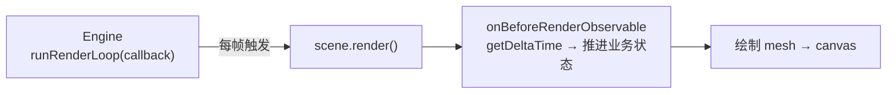

import { Canvas, Controls, Meta } from '@storybook/addon-docs/blocks';
import * as Stories from './render-loop-and-timing.stories';

<Meta of={Stories} name="Docs" />

# 渲染循环与时间

Babylon.js 不会"自己动"。一幅画面是否持续刷新、对象是否随时间移动，都由你写的**渲染循环**和**时间推进**决定。`engine.runRenderLoop(() => scene.render())` 让引擎按浏览器帧节奏反复调用 `scene.render()`；`engine.getDeltaTime()` 给出上一帧到现在的毫秒间隔；`scene.onBeforeRenderObservable` 是每帧绘制前更新业务状态的推荐入口。三者配合，动画才能在 60Hz 和 144Hz 屏幕上速度一致。

渲染循环只负责**触发**，不保证运动速度，也不持有你的业务状态。回调触发次数随刷新率、调度和页面可见性波动——把每帧前进量写成 `speed * (engine.getDeltaTime() / 1000)`（秒制 delta），才能让"每秒多少"的速度与帧率解耦。本课建立这套时间模型；动画曲线、关键帧和 `Animatable` 见 [动画](?path=/docs/animation-system--docs)，`Observable` / `Observer` 的完整体系见 [Observables 与事件](?path=/docs/observables-and-events--docs)。



| 对象 / API | 默认 / 常用 | 回查要点 |
| --- | --- | --- |
| `engine.runRenderLoop(cb)` | 无默认循环 | 回调里必须显式调用 `scene.render()`；Engine 不持有 scene |
| `engine.stopRenderLoop()` | 停止当前循环 | 不传参停止该 engine 的所有循环；不释放资源 |
| `engine.getDeltaTime()` | 上一帧到现在的**毫秒** | 推进业务状态前除以 1000 转秒；首帧可能为 0 |
| `engine.getFps()` | 平滑后的 FPS（number） | 用于读数和性能观察，单帧抖动不会乱跳 |
| `scene.onBeforeRenderObservable` | 每帧绘制前触发 | 推进业务状态的推荐入口；`getDeltaTime` 在此已有效 |
| `scene.onAfterRenderObservable` | `scene.render()` 结束后触发 | 适合绘制后的读数、截图或追加后处理 |
| `scene.onBeforeDrawPhaseObservable` | 实际绘制 mesh 之前触发 | 相机 / 渲染目标已就绪；少用 |
| `engine.resize()` | 画布尺寸变化时调用 | 同步画布像素尺寸与投影矩阵 |
| 业务速度 | 写成"每秒多少" | 每帧 `speed * dt`，不要"每帧固定加" |

## 快速上手

一个非零尺寸的 `<canvas>`、一个 `Engine`、一个 `Scene`，再接上渲染循环和每帧钩子，画面就会持续刷新并随时间推进：

```ts
import {
  ArcRotateCamera,
  Engine,
  HemisphericLight,
  MeshBuilder,
  Scene,
  Vector3,
} from '@babylonjs/core';

const canvas = document.getElementById('renderCanvas') as HTMLCanvasElement;
const engine = new Engine(canvas, true);
const scene = new Scene(engine);

const camera = new ArcRotateCamera('cam', -Math.PI / 2, Math.PI / 2, 5, Vector3.Zero(), scene);
camera.attachControl(canvas, true);
new HemisphericLight('light', new Vector3(0, 1, 0), scene);
const box = MeshBuilder.CreateBox('box', { size: 1 }, scene);

const angularSpeed = 1; // 弧度/秒

// 每帧绘制前推进业务状态：把毫秒 delta 换算为秒再乘速度。
scene.onBeforeRenderObservable.add(() => {
  const dt = engine.getDeltaTime() / 1000;
  box.rotation.y += angularSpeed * dt;
});

// 渲染循环：每帧触发 scene.render()。回调里要明确渲染哪一个 scene。
engine.runRenderLoop(() => scene.render());

window.addEventListener('resize', () => engine.resize());
```

`onBeforeRenderObservable` 在 `scene.render()` 内部、实际绘制之前触发，所以这里更新的 `rotation` 会在**同一帧**就画出来。`getDeltaTime()` 返回毫秒，除以 1000 得到秒制 delta，再乘"弧度/秒"的速度——这样 60Hz 屏幕每帧约加 `0.0167 × speed`，144Hz 每帧约加 `0.0069 × speed`，**一秒内累加量相同**。

## 渲染循环 runRenderLoop

`engine.runRenderLoop(callback)` 把你的回调挂到引擎的帧调度上，由引擎按浏览器（或 WebXR）的帧节奏反复调用。回调里你必须显式调用 `scene.render()`——`Engine` 只持有 canvas 和 WebGL 上下文，**不持有 scene**，所以它不知道该画哪一个。

```ts
engine.runRenderLoop(() => {
  scene.render();
});

// 停止（组件卸载、暂停游戏、切到静态查看器时）：
engine.stopRenderLoop();
```

`stopRenderLoop()` 不传参数时停止该 engine 上的所有循环；传入同一个回调函数引用时只停止那一个。它只停止调度，**不释放** WebGL 资源——释放要靠 `scene.dispose()` 和 `engine.dispose()`。同一个 `Engine` 可以在一帧里渲染多个 scene，常用于分屏、小窗预览或后台场景：

```ts
engine.runRenderLoop(() => {
  mainScene.render();
  miniScene.render(); // 同一帧画两个 scene
});
```

**resize 与画布同步。** 画布 CSS 尺寸变化时（窗口缩放、布局重排），必须调用 `engine.resize()`，让引擎重新读取 canvas 的实际像素尺寸并重建投影，否则画面会拉伸或模糊。监听窗口 resize 是最简做法；容器尺寸变化（如可拖拽面板）要用 `ResizeObserver` 观察容器并在回调里调 `engine.resize()`。本课共享 runtime（`assets/babylon-canvas.js`）已用 `ResizeObserver` 自动处理，自己接手时记得挂上。

## 用 delta 推进业务状态

这是本课的核心。渲染循环的回调触发次数随刷新率波动：60Hz 屏幕约 60 次/秒，144Hz 约 144 次/秒，后台标签页会被节流到个位数。若每帧"固定加 0.02 弧度"，同一动画在 144Hz 屏上会快 2.4 倍。正确做法是把速度写成**每秒多少**，每帧乘秒制 delta：

```ts
const angularSpeed = 1.2; // 弧度/秒

scene.onBeforeRenderObservable.add(() => {
  const dt = engine.getDeltaTime() / 1000; // 秒
  box.rotation.y += angularSpeed * dt;     // 弧度/秒 × 秒 = 弧度
});
```

`onBeforeRenderObservable` 是每帧绘制前的推荐钩子：它在 `scene.render()` 内部、相机和 mesh 绘制之前触发一次，所以你在这里更新的状态会立刻出现在本帧画面里；`engine.getDeltaTime()` 在此读取的就是本帧间隔，已经有效。`Observable` / `Observer` 的完整模型在 [Observables 与事件](?path=/docs/observables-and-events--docs) 课正式讲解——本课先用它做"每帧更新"。

下面的实例把一块 plank 的 Y 轴旋转交给两种推进方式：'delta' 用 `getDeltaTime()` 按"每秒多少"解释速度；'fixed' 每帧固定加同样的值（错误示范）。读数里的「有效角速度」按实际角度变化换算，用来对比两种方式的真实结果。

<Canvas of={Stories.Loop} />

<Controls of={Stories.Loop} />

| 读者操作 | 可观察证据 |
| --- | --- |
| 保持 'delta'，调「角速度」 | 转速随配置变化；「有效角速度」稳定地 ≈ 配置值 × 57.3 °/s，与 FPS 无关 |
| 切到 'fixed'（角速度降到 0.1 看清旋转） | 「有效角速度」跳到 ≈ 配置值 × FPS × 57.3 °/s——同一数值在 60Hz 与 144Hz 屏上差 2.4 倍 |
| 「角速度」降到 0 | plank 冻结，但 FPS / deltaTime 仍持续刷新——证明渲染循环本身一直在跑，只是状态不再改变 |
| 滚动让 Canvas 离开视口 | 渲染循环停止（读数停住）；回到视口附近自动恢复——本课 runtime 的按需启停 |
| 鼠标拖拽画布 | 相机绕目标旋转，视角改变 |

实例进入视口附近 200px 才启动 `engine.runRenderLoop`，离开后 `stopRenderLoop` 并保留最后一帧，避免离屏空转。

## 每帧钩子的触发时机

`scene.render()` 内部按固定顺序通知若干 `Observable`。本课只关注与"每帧更新"相关的三个；完整体系和订阅 / 注销方式见 [Observables 与事件](?path=/docs/observables-and-events--docs)。

| Observable | 在 `scene.render()` 中的时机 | 适合做什么 |
| --- | --- | --- |
| `onBeforeRenderObservable` | 绘制前（动画之后、相机绘制之前） | **推进业务状态**——更新在这里对本帧立即生效 |
| `onBeforeDrawPhaseObservable` | 实际绘制 mesh 之前（相机 / 渲染目标已就绪） | 设置 per-frame 渲染状态、clip plane 等 |
| `onAfterRenderObservable` | `scene.render()` 结束之后 | 绘制后的读数、截图、追加后处理 |

默认情况下，把业务更新放进 `onBeforeRenderObservable` 就够了；另外两个留到需要精确控制渲染管线时机时再用。Mesh 自己也有 `mesh.onBeforeRenderObservable` / `mesh.onAfterRenderObservable`，在单个 mesh 绘制前后触发，适合做该 mesh 专属的渲染状态切换（如临时设 `scene.clipPlane` 再复位）。

## FPS、累计时间与异常 delta

三层时间不要混用：

| 概念 | 表示什么 | 单位 | 受帧率影响吗 |
| --- | --- | --- | --- |
| frame | 回调的一次触发 | 离散次数 | 是——60Hz 约 60 次/秒，144Hz 约 144 次/秒 |
| delta | 相邻两帧的间隔 | 秒（`getDeltaTime()/1000`） | 单次值波动，但每秒累计约 1 |
| elapsed | 自启动以来的累计运行时间 | 秒（自己累加 delta） | 否——真实运行时间不随帧率变 |

`engine.getFps()` 返回引擎平滑后的帧率（number），适合显示和性能观察；它基于内部采样的指数平均，单帧抖动不会让读数乱跳。**累计运行时间没有直接的 API**——用 `elapsed += dt` 在每帧钩子里自己累加（如快速上手所示）；想按绝对时间采样周期函数（如 `Math.sin(elapsed)`）时用它。

**异常 delta 尖峰。** 当页面切到后台、窗口最小化或本课 runtime 因离屏暂停后恢复时，墙钟已经走过一段。Babylon 的 `getDeltaTime()` 在循环停止期间不更新，恢复后第一帧可能返回一个很大的间隔（数百毫秒甚至几秒）。若直接乘进速度，物体会瞬间跳很远。两种保护：

```ts
scene.onBeforeRenderObservable.add(() => {
  // 单步上限：把任何单帧 delta 截到 100ms，避免大跳。
  const dt = Math.min(engine.getDeltaTime() / 1000, 0.1);
  box.rotation.y += angularSpeed * dt;
  elapsed += dt;
});
```

- **单步上限**：`Math.min(dt, 0.1)` 截断异常长帧，保护运动积分。
- **可见性启停**：标签页隐藏或离屏时停止循环、可见时恢复，并在恢复首帧让 delta 自然回到正常范围（本课 runtime 已按视口可见性和 `document.visibilityState` 启停）。

## 按需渲染与资源释放

不是所有画面都需要每帧重绘。静态查看器、模型预览或仅交互时才变化的场景，可以让循环平时停止，只在状态或尺寸变化时手动渲染一帧，节省电量和 GPU：

```ts
// 按需模式：平时不跑循环；状态或尺寸变化时手动渲染一帧。
function requestRender() {
  scene.render();
}

// 例：参数调整、控制器 change、resize 时调用 requestRender()
```

判断"持续循环"还是"按需渲染"看画面是否有**持续运动**：有动画、粒子、相机惯性或实时仿真就用持续循环；静态场景只在交互时画一帧。本课实例采用持续循环 + 视口可见性启停：Canvas 进入视口附近 200px 才 `runRenderLoop`，离开后 `stopRenderLoop`，兼顾持续动画与离屏省电。

页面或组件销毁时，`runRenderLoop` 不会随 DOM 移除自动停止。完整释放要按顺序 dispose：

```ts
engine.stopRenderLoop();
scene.dispose();
engine.dispose();
```

本课 runtime 的 `dispose()` 已按此顺序释放；自己接手时还要移除 `ResizeObserver`、`IntersectionObserver` 和 `visibilitychange` 等监听。

## 最佳实践

- 速度统一写成"每秒多少"，乘秒制 `engine.getDeltaTime() / 1000`；不要保留"每帧固定增量"，否则高刷屏上会变快。
- 业务更新放在 `scene.onBeforeRenderObservable`：它在绘制前触发，状态变化对本帧立即生效；`getDeltaTime()` 在此已有效。
- 给单帧 delta 设上限（如 `Math.min(dt, 0.1)`），防止后台 / 恢复时的尖峰让对象瞬移。
- `stopRenderLoop()` 只停调度不释放资源；卸载时按 `stopRenderLoop → scene.dispose → engine.dispose` 顺序清理，并移除 resize / visibility 监听。
- 画布尺寸变化时调 `engine.resize()`；用 `ResizeObserver` 观察容器比只听 window resize 更稳。
- 静态或少变化的场景用按需渲染（单次 `scene.render()`）；有持续运动才常驻循环，并通过视口可见性或 `visibilitychange` 在离屏时停掉。
- 同一个 Engine 在一帧里渲染多个 scene 时，`runRenderLoop` 回调里依次调用各自的 `scene.render()`，明确顺序，不要让多个 scene 抢同一帧。

## 常见问题

- 为什么动画在 144Hz / 高刷屏上明显变快？
  用了每帧固定增量；改成 `speed * (engine.getDeltaTime() / 1000)`，按秒解释速度。
- 为什么从后台标签页或离屏回来后，对象突然跳很远？
  恢复首帧的 `getDeltaTime()` 可能返回一段很长的间隔。给 delta 设上限（`Math.min(dt, 0.1)`），并让循环在标签页隐藏或离屏时停止、可见时再恢复。
- 为什么改了 `box.rotation`，画面不变？
  对象属性修改不触发重绘。必须在 `runRenderLoop` 的回调里反复 `scene.render()`，或在状态改变后手动调一次 `scene.render()`。
- `getDeltaTime()` 返回的是秒还是毫秒？
  毫秒。推进业务状态时除以 1000 换算为秒，再乘"每秒多少"的速度。
- `getFps()` 和我自己数帧算出来的 FPS 为什么对不上？
  `engine.getFps()` 是引擎内部采样的指数平滑值，反映几帧内的趋势，不是这一秒的精确计数；用它做读数和性能观察即可。
- `stopRenderLoop()` 之后 WebGL 资源释放了吗？
  没有。它只停止帧调度；释放 GPU 资源要 `scene.dispose()` + `engine.dispose()`。
- `onBeforeRenderObservable` 和 `onBeforeDrawPhaseObservable` 有什么区别？
  前者在绘制前触发一次，是推进业务状态的默认位置；后者在实际画 mesh 之前触发，相机和渲染目标已就绪，用于精确控制渲染状态。完整区别见 [Observables 与事件](?path=/docs/observables-and-events--docs)。
- 窗口大小没变，但 Canvas 拉伸模糊了？
  画布的 CSS 像素尺寸变了（比如布局重排）但没触发 window resize。用 `ResizeObserver` 观察 canvas 父容器，在回调里调 `engine.resize()`。

## 总结回顾

摘要：

Babylon.js 的持续画面来自显式的渲染循环和时间推进。`engine.runRenderLoop(() => scene.render())` 按帧触发绘制，`stopRenderLoop()` 停止调度但不释放资源；`engine.resize()` 在画布尺寸变化时同步投影。运动速度必须用秒制 delta 推进——在 `scene.onBeforeRenderObservable` 里读 `engine.getDeltaTime() / 1000`，再乘"每秒多少"的速度，才能让动画在 60Hz 和 144Hz 屏上一致；按帧固定累加会让速度随刷新率漂移。`onBeforeRenderObservable` 是每帧业务更新的推荐入口，`onBeforeDrawPhaseObservable` 和 `onAfterRenderObservable` 服务更精确的管线时机。`engine.getFps()` 给出平滑帧率，累计时间用 `elapsed += dt` 自算，两者都要防 delta 尖峰（单步上限 + 可见性启停）。静态场景可改成按需 `scene.render()`；组件销毁时按 `stopRenderLoop → scene.dispose → engine.dispose` 释放。

一句话：

> 渲染循环只负责按帧触发 `scene.render()`；运动必须用秒制 `getDeltaTime` 推进，并在离屏和销毁时显式停止与释放。

知识要点：

- `engine.runRenderLoop` 的回调里为什么必须显式调用 `scene.render()`？`stopRenderLoop()` 释放资源吗？
- `engine.getDeltaTime()` 返回什么单位？为什么推进业务状态前要除以 1000？
- 为什么不能按帧固定累加业务状态？在 60Hz 和 144Hz 屏上会差多少？
- `scene.onBeforeRenderObservable` 在一帧的什么时机触发？为什么推荐它推进业务状态？
- `onBeforeRenderObservable` 与 `onBeforeDrawPhaseObservable`、`onAfterRenderObservable` 各在什么时候触发？
- 从后台或离屏恢复时为什么对象会跳？怎样避免？
- 什么时候用持续循环，什么时候用按需渲染？
- 卸载一个 Babylon 场景要按什么顺序释放？

## 参考资料

- [Babylon.js TypeDoc：Engine（runRenderLoop / stopRenderLoop / getDeltaTime / getFps / resize）](https://doc.babylonjs.com/typedoc/classes/BABYLON.Engine)
- [Babylon.js TypeDoc：Scene（onBeforeRenderObservable / onAfterRenderObservable / onBeforeDrawPhaseObservable / render）](https://doc.babylonjs.com/typedoc/classes/BABYLON.Scene)
- [Babylon.js Features：Observables（每帧 Observable 序列）](https://doc.babylonjs.com/features/featuresDeepDive/events/observables)
- [Babylon.js Features：Multi Scenes（一个 Engine 渲染多个 Scene 的循环管理）](https://doc.babylonjs.com/features/featuresDeepDive/scene/multiScenes)
- [MDN：Page Visibility API（visibilitychange 与后台节流）](https://developer.mozilla.org/en-US/docs/Web/API/Page_Visibility_API)
- [MDN：ResizeObserver（观察容器尺寸变化）](https://developer.mozilla.org/en-US/docs/Web/API/ResizeObserver)
- [Babylon.js API Reference (TypeDoc)](https://doc.babylonjs.com/typedoc/)
