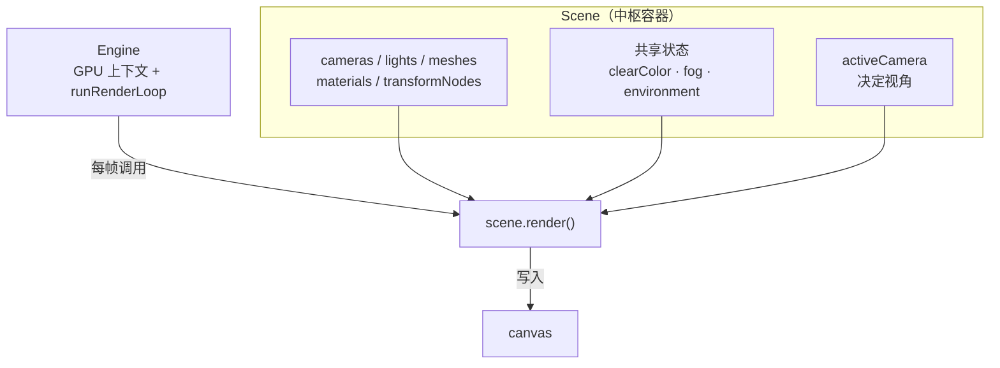

import { Canvas, Controls, Meta } from '@storybook/addon-docs/blocks';
import * as SceneStories from './scene-container.stories';

<Meta of={SceneStories} name="Docs" />

# Scene

`Scene` 是 Babylon.js 的中枢容器：它持有 `cameras`、`lights`、`meshes`、`materials` 等对象集合，决定**画哪些对象**；同时承载这一帧共享的 `clearColor`、雾、环境，并通过 `scene.activeCamera` 决定从哪里看。每一帧由 `engine.runRenderLoop(() => scene.render())` 驱动——`Engine` 只管 GPU 上下文和调度，世界本身住在 `Scene` 里。

这和 three.js 的分工不同：three.js 的 `Scene` 是场景树的根（一个 `Object3D`），相机作为 `renderer.render(scene, camera)` 的独立参数传入；Babylon 的 `Scene` 把相机、光源、网格当作一等集合直接持有，`activeCamera` 是它的属性，`render()` 也是它的方法。可以说 **Babylon 的 Scene 比 three.js 的更“中枢”**。



| 成员 | 默认 | 回查要点 |
| --- | --- | --- |
| `cameras` / `lights` / `meshes` / `materials` | 空数组 | 构造时传入 scene 自动登记；`scene.render()` 只渲染这些集合里的对象 |
| `activeCamera` | `null` | 决定这一帧的视角与投影；多相机时切换它 |
| `clearColor` | `Color4(0.2, 0.2, 0.3, 1.0)` | 背景清色（含 alpha）；只填像素，不照亮物体 |
| `fogMode` | `Scene.FOGMODE_NONE`（0） | 关闭 / EXP / EXP2 / LINEAR |
| `fogColor` | `Color3(0.2, 0.2, 0.3)` | 雾色；与 `clearColor` 相互独立 |
| `fogDensity` | `0.1` | EXP / EXP2 的浓度；对 LINEAR 无效 |
| `fogStart` / `fogEnd` | `0` / `1000` | LINEAR 的起止距离 |
| `environmentTexture` | `null` | IBL 环境贴图，喂给 PBR 材质 |
| `environmentIntensity` | `1.0` | 环境反射强度倍率 |
| `ambientColor` | `Color3(0, 0, 0)` | 与材质 ambient 合成；本课不展开 |

## 中枢容器：Engine 与 Scene 的分工

`Engine` 包裹 canvas 和 WebGL 上下文，负责画布、resize 和渲染调度；`Scene` 持有要画的对象和这一帧共享的状态。两者解耦：同一个 `Engine` 可以在 `runRenderLoop` 回调里切换渲染多个 `Scene`，但每一帧仍要你显式指定渲染哪一个。

```ts
const engine = new Engine(canvas, true);
const scene = new Scene(engine);

// 相机、光、Mesh 构造时传入 scene，就自动登记进对应的集合。
const camera = new ArcRotateCamera('cam', -Math.PI / 2, Math.PI / 2, 5, Vector3.Zero(), scene);
new HemisphericLight('light', new Vector3(0, 1, 0), scene);
const box = MeshBuilder.CreateBox('box', { size: 1 }, scene);

// Engine 不持有 scene；回调里必须明确渲染哪一个。
engine.runRenderLoop(() => scene.render());
```

`scene.render()` 内部按 `activeCamera` 的视角把 `meshes`（连同它们引用的 `materials`）画出来，并在绘制前用 `clearColor` 清屏、按 `fogMode` 给材质输出掺雾。对象没有登记进当前 scene 的集合，就不会进入这次渲染。渲染循环的 `deltaTime`、暂停与按需渲染见 [渲染循环与时间](?path=/docs/render-loop-and-timing--docs)；最小画面搭建见 [第一幅画面](?path=/docs/first-scene--docs)。

`activeCamera` 决定这一帧的视角与投影。一个 scene 可以挂多个相机，`scene.render()` 只用 `activeCamera` 那一个：

```ts
const topDown = new UniversalCamera('top', new Vector3(0, 10, 0), scene);
const orbit = new ArcRotateCamera('orbit', -Math.PI / 2, Math.PI / 2, 5, Vector3.Zero(), scene);
scene.activeCamera = orbit; // 切到 topDown 即换视角
```

构造相机时如果传了 scene，会同时把它设为 `activeCamera`；之后再 `new` 第二个会覆盖。相机家族（Free/Universal、Behavior、投影与裁剪）见 [相机与控制](?path=/docs/cameras-and-controls--docs)。

## 背景色 clearColor

`scene.clearColor` 是每帧绘制前的清屏色，类型是 **`Color4`（r, g, b, a）**，默认 `Color4(0.2, 0.2, 0.3, 1.0)`——那块标志性的深蓝紫。它只填满“没有被物体盖住的像素”，**不照亮物体**：物体明暗仍由 lights 和材质决定。

```ts
import { Color4 } from '@babylonjs/core';

scene.clearColor = new Color4(0.93, 0.95, 0.94, 1); // 浅米色背景
```

第四个分量 `alpha` 要注意：`Engine` 默认创建带 alpha 通道的 WebGL 上下文，因此把 `alpha` 设为 `0` 时画布变透明，能看到页面 DOM 的背景；设为 `1` 时完全不透明。这一行为和引擎上下文是否启用 alpha 有关——共享 runtime（`assets/babylon-canvas.js`）不关闭 alpha，所以本课实例里 `alpha=0` 能看出透明效果。

`clearColor` 只回答“空白处长什么样”，与雾、环境光、材质颜色是四件独立的事。下面雾一节的实例会同时切换 `clearColor`，让背景与雾色互相对照。

## 雾

雾让远处物体逐渐溶进 `fogColor`，常用来暗示距离、藏远裁剪面或统一远景气氛。它改的是**材质输出后的颜色**——按每个片段到相机的距离 `d` 计算一个掺混权重 `fog`，把表面色往雾色拉——而不是在空中画一团体积烟。空白背景仍由 `clearColor` 决定。

```ts
import { Color3, Scene } from '@babylonjs/core';

// 指数平方雾：浓度由 fogDensity 控制
scene.fogMode = Scene.FOGMODE_EXP2;
scene.fogColor = new Color3(0.85, 0.88, 0.9);
scene.fogDensity = 0.05;

// 或线性雾：在 fogStart 与 fogEnd 之间均匀过渡（fogDensity 被忽略）
scene.fogMode = Scene.FOGMODE_LINEAR;
scene.fogStart = 8;
scene.fogEnd = 32;
```

| 常量 | 值 | 行为 | 关键参数 |
| --- | --- | --- | --- |
| `Scene.FOGMODE_NONE` | 0 | 无雾（默认） | — |
| `Scene.FOGMODE_EXP` | 1 | 指数：`1 - e^(-density·d)`，过渡较缓 | `fogDensity` |
| `Scene.FOGMODE_EXP2` | 2 | 指数平方：`1 - e^(-(density·d)²)`，远处更快溶色 | `fogDensity` |
| `Scene.FOGMODE_LINEAR` | 3 | 线性：`d` 在 `fogStart→fogEnd` 之间从 0 到 1 | `fogStart` / `fogEnd` |

EXP / EXP2 没有“起点”，从相机就开始按密度累计；density 越大、距离越远，掺混越接近 1（完全雾色）。LINEAR 在 `fogStart` 之前无雾、到 `fogEnd` 完全变成雾色，`fogDensity` 对它无效。材质默认参与雾，单个材质要排除时设 `material.fogEnabled = false`（默认 `true`）。

`fogColor` 与 `clearColor` 是**两个独立属性**：实例里把 `fogColor` 固定为浅冷灰，切换 `clearColor` 时能清楚看到“远处溶进的是雾色，不是背景色”。想让远景与背景无缝衔接时，通常让 `fogColor` 取 `clearColor` 的 RGB。

下面的实例把一排支柱排在一条直线上，让远近不同；切换背景清色与雾模式，观察 Scene 作为状态容器的效果。readout 实时给出当前 `clearColor`、`fogMode`、`fogDensity`、`activeCamera` 和 `scene.meshes.length`。

<Canvas of={SceneStories.SceneState} />

<Controls of={SceneStories.SceneState} />

| 读者操作 | 可观察证据 |
| --- | --- |
| 切「背景清色」到 `black` | 画布背景立刻变黑，但远处支柱仍溶进浅冷灰雾色——证明 `clearColor` 与 `fogColor` 独立 |
| 切「背景清色」到 `transparent` | 读数 `clearColor` 的 alpha 变 `0.00`，画布变透明、能看到舞台底色（近白） |
| 切「雾模式」到 `EXP2`，调大「雾密度」 | 远处支柱逐渐溶进雾色，近处支柱基本不变；`fogMode` / `fogDensity` 读数同步更新 |
| 切「雾模式」到 `LINEAR`，再调「雾密度」 | 远景雾色由 `fogStart=8` / `fogEnd=32` 决定，密度读数变化但画面不变——LINEAR 不看密度 |
| 切「雾模式」回 `NONE` | 所有支柱立刻清晰到远景；`fogMode` 读数变「无」 |
| 读数「网格数」 | 恒为 9（8 根支柱 + 1 个地面），证明这些 Mesh 都登记在 `scene.meshes` 里 |
| 拖拽 Canvas | `activeCamera` 读数一直是 `ArcRotateCamera 'camera'`，相机轨道绕目标旋转 |

实例离屏时停止渲染循环、回到视口附近再恢复，避免空转；调度细节见 [渲染循环与时间](?path=/docs/render-loop-and-timing--docs)。

## 环境与默认场景入口

### 环境贴图 environmentTexture

`scene.environmentTexture` 是挂在 Scene 上的全局“周围世界”，给物理材质（PBR）提供反射和间接光照。金属、光滑塑料要靠它才看得出颜色与明暗；它**不会**自动变成画布底色——想看到天空，还得另设 `clearColor` 或用天空盒。

```ts
import { CubeTexture } from '@babylonjs/core';

scene.environmentTexture = CubeTexture.CreateFromPrefilteredData('/env/environment.env', scene);
scene.environmentIntensity = 1.2; // 全场环境反射强度倍率，默认 1.0
```

贴图加载、prefilter、color space 与 HDR 处理见 [纹理](?path=/docs/textures--docs) 与 [PBR 与环境](?path=/docs/pbr-and-environment--docs)。本课不在 Storybook 里加载外部 HDR，所以实例不演示环境贴图——加载真实 HDRI 需要本地或 CDN 上的 `.env` / `.hdr` 资产。

### 默认场景搭建入口

Scene 提供几个一次性搭出基础场景的方法，适合快速原型、加载模型后自动定位相机，或在 Playground 里起步：

```ts
// 一次性补上默认相机和光（createCamera, createLight, replace）
scene.createDefaultCameraOrLight(true, true, true);

// 生成天空盒 + 地面 + 环境贴图，返回 EnvironmentHelper
const env = scene.createDefaultEnvironment();
```

| 方法 | 作用 | 常用参数 |
| --- | --- | --- |
| `createDefaultCameraOrLight(createCamera, createLight, replace)` | 没有相机/光时补一个 ArcRotateCamera + HemisphericLight | 三个布尔：是否建相机、是否建光、是否替换已有 |
| `createDefaultCamera(createCamera, replace)` | 给已存在的 meshes 自动定位一个 ArcRotateCamera | 布尔 |
| `createDefaultLight(replace)` | 没光时补一盏 HemisphericLight | 布尔 |
| `createDefaultEnvironment(options)` | 建 skybox + ground + environmentTexture | `createSkybox` / `createGround` / `skyboxSize` / `groundSize` / `enableGroundShadow` / `environmentTexture` |

`createDefaultEnvironment` 返回 `EnvironmentHelper`，它持有生成的天空盒、地面和贴图引用，`helper.dispose()` 会一并释放。这些入口是“够用就好”的脚手架——需要精细控制相机、光照或环境时，仍应自己创建对应对象。

## 最佳实践

- 一个 `Scene` 表示一次明确的渲染根；同一个 `Engine` 要切换多个 scene 时，`runRenderLoop` 回调里明确渲染当前那一个，不要让多个 scene 抢同一帧。
- 把 `clearColor`、雾、环境当作四件独立的事分别调试：相同颜色不代表它们是同一机制；想让远景无缝，再让 `fogColor` 跟随 `clearColor` 的 RGB。
- 选雾模式先看是否需要“远处硬截止”：要藏远裁剪面用 LINEAR（有明确 `fogEnd`）；要自然渐隐用 EXP2（远处更快溶色）；EXP 过渡最缓，较少使用。
- `fogDensity` 数值很小就有效（`0.05` 已明显），别按像素思维给到 1 以上；调它时配合相机距离观察。
- 默认 StandardMaterial/PBRMaterial 都参与雾；个别 HUD、天空盒或不该被雾化的对象设 `material.fogEnabled = false`。
- 把 `environmentTexture` 当成共享资源加载一次，通过 Scene 喂给所有 PBR 材质，不要每个材质各加载一份。
- 快速搭原型或加载模型后自动定位相机时用 `createDefaultCameraOrLight` / `createDefaultEnvironment`；需要稳定控制时换成自己创建的对象。

## 常见问题

- 为什么 `clearColor` 改了，物体明暗没变化？
  `clearColor` 只填背景像素，不参与光照。物体明暗来自 lights、`environmentTexture` 和材质本身；想给全场补反射用环境贴图。
- 为什么把 `clearColor` 的 alpha 设成 0，画布没透明？
  这要求 `Engine` 创建了带 alpha 的 WebGL 上下文。Babylon 默认不关闭 alpha，但若你构造 Engine 时显式传了 `alpha: false`，或容器/画布 CSS 背景不透明，alpha 就看不出效果。
- 为什么开了雾，远处却没有溶色？
  先看 `fogMode` 是不是 `NONE`（默认）；再看材质的 `fogEnabled` 是否被关掉；EXP/EXP2 还要看 `fogDensity` 是否过小、相机距离是否进入累计范围。
- 为什么切到 `FOGMODE_LINEAR` 后调 `fogDensity` 没反应？
  LINEAR 只看 `fogStart` / `fogEnd`，忽略 `fogDensity`。想让密度生效切回 EXP 或 EXP2；想控制过渡区间调 `fogStart` / `fogEnd`。
- 为什么 `fogColor` 和 `clearColor` 设成一样，远处还是有一条边？
  雾按片段到相机的距离掺混，背景则是整片清屏；如果用了天空盒或天空贴图当背景，雾不会自动作用到天空像素。让远景几何延伸到雾里，或把天空盒材质的 `fogEnabled` 纳入考量。
- 为什么 `scene.activeCamera` 一直是最后创建的那个相机？
  构造相机时传了 scene，会顺带把它设为 `activeCamera`；再 new 第二个会覆盖。多相机时显式 `scene.activeCamera = whichOne` 切换。
- 为什么 `createDefaultCameraOrLight` 调用后看不到默认相机？
  它只在“没有相机/光”时补建，且参数控制是否替换。确认入参的三个布尔，以及场景里是否已有相机被判定为“已存在”。
- 为什么 `createDefaultEnvironment` 后画布底色没变？
  它建的是天空盒、地面和环境贴图，不直接改 `clearColor`。想看到天空，让相机视角进入天空盒范围，或另外设 `clearColor`。

## 总结回顾

摘要：

Scene 是 Babylon.js 的中枢容器：持有 cameras / lights / meshes / materials 集合与 `activeCamera`，决定每帧 `scene.render()` 画哪些对象、从哪里看；同时承载共享的 `clearColor`、雾和环境。`Engine` 只管 GPU 上下文与 `runRenderLoop` 调度，世界本身住在 Scene 里——这让 Babylon 的 Scene 比 three.js 的更“中枢”。`clearColor` 是 `Color4`（含 alpha），只填背景不照亮物体；雾有 NONE / EXP / EXP2 / LINEAR 四种模式，EXP/EXP2 看 `fogDensity`，LINEAR 看 `fogStart` / `fogEnd`，材质可用 `fogEnabled` 退出；`environmentTexture` 给 PBR 喂反射，`createDefaultCameraOrLight` 与 `createDefaultEnvironment` 是快速搭场景的入口。

一句话：

> 把 Scene 当作世界的家：对象集合、视角、清色、雾和环境都挂在它身上，`scene.render()` 每帧把当前这些状态一次性画出来。

知识要点：

- Babylon 的 `Scene` 与 `Engine` 各自负责什么？为什么说 Scene 比 three.js 的更“中枢”？
- 相机、光、Mesh 怎样进入 Scene？`activeCamera` 在多相机时怎么决定视角？
- `clearColor` 是什么类型、默认值是什么？它影响物体明暗吗？
- `alpha` 分量在什么条件下能让画布透明？
- 四种 `fogMode` 各自按什么公式掺色？EXP/EXP2 与 LINEAR 分别看哪些参数？
- `fogColor` 与 `clearColor` 是同一回事吗？
- `environmentTexture` 和 `createDefaultEnvironment` 分别提供什么？默认场景入口适合用在哪里？

## 参考资料

- [Babylon.js TypeDoc：Scene（clearColor / fogMode / activeCamera / environmentTexture）](https://doc.babylonjs.com/typedoc/classes/BABYLON.Scene)
- [Babylon.js Features：Environment Introduction（clearColor / fog / environment）](https://doc.babylonjs.com/features/featuresDeepDive/environment/environment_introduction)
- [Babylon.js Features：Build a World Quickly with Scene Helpers（createDefaultCameraOrLight / createDefaultEnvironment）](https://doc.babylonjs.com/features/featuresDeepDive/scene/fastBuildWorld)
- [Babylon.js TypeDoc：Material（fogEnabled）](https://doc.babylonjs.com/typedoc/classes/BABYLON.Material)
- [Babylon.js Guided Learning](https://doc.babylonjs.com/guidedLearning/)
- [Babylon.js API Reference (TypeDoc)](https://doc.babylonjs.com/typedoc/)
