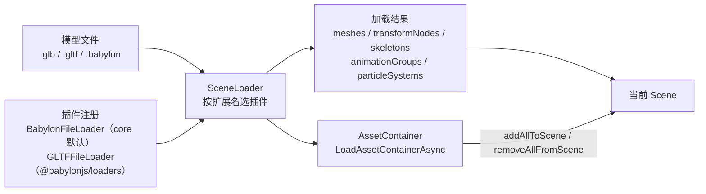

import { Canvas, Controls, Meta } from '@storybook/addon-docs/blocks';
import * as LoaderStories from './sceneloader-and-gltf.stories';

<Meta of={LoaderStories} name="Docs" />

# 加载模型

`SceneLoader` 把一份外部模型文件（`.glb` / `.gltf` / `.babylon`）解析成 Babylon 的场景对象，挂进当前 `Scene`。它本身不做解析——真正的解析交给**按扩展名注册的插件**：`.babylon` 由 `@babylonjs/core` 默认注册的 `BabylonFileLoader` 处理；glTF / GLB 要靠 `@babylonjs/loaders` 提供的 `GLTFFileLoader`，用副作用导入 `import '@babylonjs/loaders/glTF'` 注册。理解了"文件 → 插件 → 加载结果"这条链，加载、遍历、成组卸载和错误处理就都有落点了。

加载结果不是单个对象，而是一组资产：`meshes`、`transformNodes`、`skeletons`、`animationGroups`、`particleSystems`、`geometries`、`lights`、`spriteManagers`。glTF 模型还会多出一个 `__root__` 根 `TransformNode`，所有顶层节点挂在它下面。需要"整组加载、整组卸载、多次实例化"时，改用 `SceneLoader.LoadAssetContainerAsync` 把结果装进 `AssetContainer`，再用 `addAllToScene` / `removeAllFromScene` 切换可见性，或 `instantiateModelsToScene` 复制出另一份。



| 对象或参数 | 默认 / 常用起点 | 改变后要注意什么 |
| --- | --- | --- |
| `SceneLoader.ImportMeshAsync` | `(meshNames, rootUrl, sceneFilename, scene)` → `Promise<result>` | 推荐的 Promise 形式；`meshNames` 传 `''` / `null` 加载全部，传名字数组只筛选这些 Mesh |
| `SceneLoader.AppendAsync` | `(rootUrl, sceneFilename, scene)` → `Promise<Scene>` | 把整个文件追加到 scene（含相机、光、动画组），返回同一个 scene |
| `SceneLoader.LoadAssetContainerAsync` | `(rootUrl, sceneFilename, scene)` → `Promise<AssetContainer>` | 资产进容器、**不自动**挂到场景；要手动 `addAllToScene()` 才看得见 |
| `rootUrl` | 资源根 URL（目录），含尾部 `/` | `.gltf` 的外部 `.bin` 和贴图按它拼接；写错会批量 404 |
| `sceneFilename` | 文件名，或 `data:` 前缀的字符串化数据，或 `File` | 以 `data:` 开头时被视为内联数据而非 URL |
| glTF 插件 | 未注册（core 不含） | 必须 `import '@babylonjs/loaders/glTF'`；缺失时报 `no loader available` |
| `.babylon` 插件 | core 默认注册 | 无需额外导入；可直接加载 |
| result 结构 | 8 个数组字段 | glTF 模型的顶层节点在 `transformNodes` 里的 `__root__` 下，不在 `meshes` 顶层 |
| `AssetContainer.addAllToScene` | 一次性把容器资产挂进 scene | 与 `removeAllFromScene` 成对；切换时容器内资产计数不变，变的是 scene 的集合 |

## 快速上手

最小闭环：拿到一个 `.glb` 的 URL，`ImportMeshAsync` 解析后把 `result.meshes` 留在当前 scene，并在加载前后处理错误与相机构图。

```ts
import { SceneLoader } from '@babylonjs/core';
import '@babylonjs/loaders/glTF'; // 注册 glTF / GLB 插件，副作用导入

try {
  const result = await SceneLoader.ImportMeshAsync('', '/models/', 'cart.glb', scene);
  // result.meshes 是导入的网格；transformNodes 含 glTF 的 __root__ 根节点。
  console.log(result.meshes.length, result.animationGroups.length);
} catch (err) {
  console.error('模型加载失败：', err);
}
```

第一参 `meshNames` 传空串表示加载全部；`rootUrl` 是资源目录（含尾部 `/`），`sceneFilename` 是文件名。`@babylonjs/loaders/glTF` 的副作用导入必须在第一次加载 glTF 之前完成——它向 `SceneLoader` 注册 `GLTFFileLoader`，否则按 `.glb` 扩展名找不到插件。

`SceneLoader` 的静态方法在新版本里被标记为 `@deprecated`，推荐用同名模块级函数（`ImportMeshAsync`、`AppendSceneAsync`、`LoadAssetContainerAsync` 等，签名改为 `(source, scene, options?)`）获得更好的打包裁剪；两类 API 行为一致，本文示例沿用 `SceneLoader.*` 写法。

## SceneLoader 家族

四个常用入口分成"是否筛选 Mesh"和"是否成组装入容器"两个维度。回调形式传入 `onSuccess` / `onError`；Promise 形式（方法名加 `Async`）返回结果或抛错，是现代代码的首选。

| 方法 | 是否筛选 Mesh | 落点 | 返回 / 回调数据 |
| --- | --- | --- | --- |
| `ImportMesh` / `ImportMeshAsync` | 是（第一参 `meshNames`） | 当前 `Scene` | `result`（8 个资产数组） |
| `Append` / `AppendAsync` | 否（整文件） | 当前 `Scene` | `Scene`（资产已挂进 scene） |
| `LoadAssetContainer` / `LoadAssetContainerAsync` | 否 | `AssetContainer`（不挂进 scene） | `AssetContainer` |

`ImportMesh` 适合"只想要几个 Mesh"的场景：`meshNames` 传名字或名字数组，未命中的 Mesh 不导入。`Append` 把整个文件（含文件自带的相机、光、动画）原样追加进 scene，适合整场景加载。两者都直接写进当前 scene，加载完立刻可见；想要"先备好、再决定何时显示"则用 `LoadAssetContainerAsync`。

```ts
// 回调形式：ImportMesh(meshNames, rootUrl, sceneFilename, scene, onSuccess, onError)
SceneLoader.ImportMesh(
  '',
  '/models/',
  'cart.glb',
  scene,
  (meshes, particleSystems, skeletons, animationGroups, transformNodes) => {
    // 成功：meshes 是导入的网格数组
  },
  null,
  (scene, message, exception) => {
    console.error('加载失败：', message, exception);
  },
);

// Promise 形式（推荐）：AppendAsync(rootUrl, sceneFilename, scene)
const loadedScene = await SceneLoader.AppendAsync('/models/', 'cart.glb', scene);
```

`onSuccess` 回调一口气收到 8 个数组（`meshes`、`particleSystems`、`skeletons`、`animationGroups`、`transformNodes`、`geometries`、`lights`、`spriteManagers`），与 `ImportMeshAsync` 返回的 `result` 对象字段一致；`onError` 的签名是 `(scene, message, exception?)`，注意它收到的第一参是 scene 而不是错误对象。

### 加载结果的结构

`ImportMeshAsync` 返回的 `result` 是一份"加载到了什么"的清单，每个字段都是数组：

| 字段 | 含义 | 何时非空 |
| --- | --- | --- |
| `meshes` | 导入的网格（`AbstractMesh[]`） | 静态模型必有；glTF 的顶层节点是 `__root__` 下的子 Mesh |
| `transformNodes` | 变换节点（`TransformNode[]`） | glTF 模型会含一个名为 `__root__` 的根节点，组织顶层层级 |
| `skeletons` | 骨骼（`Skeleton[]`） | 蒙皮角色模型；详见 [骨骼与蒙皮](?path=/docs/skeleton-and-bones--docs) |
| `animationGroups` | 动画组（`AnimationGroup[]`） | 导出时烘焙的关键帧动画；播放见 [动画](?path=/docs/animation-system--docs) |
| `particleSystems` | 粒子系统 | 模型内置粒子时；`.babylon` 文件常带 |
| `geometries` | 几何资源 | 顶点 / 索引数据，可被多个 Mesh 共享 |
| `lights` | 光源 | glTF 经 `KHR_lights_punctual` 扩展导出时 |
| `spriteManagers` | 精灵管理器 | `.babylon` 文件携带时 |

`Append` / `AppendAsync` 不返回清单，而是把资产直接挂进 scene 后返回该 scene——需要遍历时改读 `scene.meshes`、`scene.transformNodes`、`scene.animationGroups` 等集合。

glTF 模型加载后多出一个名为 `__root__` 的 `TransformNode`，它是 glTF 场景根的容器；你"看到的顶层 Mesh"其实是 `__root__` 的子节点。整组移动、缩放、旋转时操作 `__root__`，而不是逐个 Mesh。下面"根节点与变换层级"会展开。

## 插件与格式

`SceneLoader` 按文件扩展名挑选已注册的插件。三类常见格式各有注册方式：

| 格式 | 特点 | 插件注册 |
| --- | --- | --- |
| `.glb` | 单一二进制文件，含几何 + 贴图；部署最简单 | `import '@babylonjs/loaders/glTF'` |
| `.gltf` | JSON + 外部 `.bin` + 外部贴图；移动时整组一起搬 | 同上（同一个 `GLTFFileLoader`） |
| `.babylon` | Babylon 原生格式；可携带相机、光、粒子等场景对象 | `@babylonjs/core` 默认注册，无需额外导入 |

```ts
// glTF / GLB：副作用导入注册 GLTFFileLoader。导入路径必须出现在真正加载之前。
import '@babylonjs/loaders/glTF';
import { SceneLoader } from '@babylonjs/core';

await SceneLoader.ImportMeshAsync('', '/assets/', 'robot.glb', scene);
```

`.babylon` 文件可以被 `@babylonjs/core` 直接读，因为 `BabylonFileLoader` 默认注册；glTF / GLB 则必须由 `@babylonjs/loaders` 提供。glTF 的压缩扩展（DRACO 几何、KTX2 纹理等）由 `GLTFFileLoader` 内部处理，必要时通过加载选项传入解码器；这与 three.js 需要手工给 `GLTFLoader` 挂 `DRACOLoader` 的方式不同。具体压缩扩展配置以 `@babylonjs/loaders` 当前版本的文档为准。

> **本课 Canvas 的离线约束：** 这个 Storybook 工作区只装了 `@babylonjs/core`，没有 `@babylonjs/loaders`，所以在 Canvas 里无法真正加载 `.glb`。下面的交互实例用 `MeshBuilder` 程序化构造了一个**占位模型**——结构与真实 glTF 加载结果一致（根 `TransformNode` + 子 Mesh + `AnimationGroup`）——并使用**真实的** `AssetContainer` / `addAllToScene` / `removeAllFromScene` 演示成组加载与卸载。真实 `SceneLoader` 用法以上文代码片段为准。

## 根节点与变换层级

glTF 加载结果里的 `meshes` 不一定是顶层节点——`GLTFFileLoader` 会创建一个名为 `__root__` 的 `TransformNode`，把文件里的顶层场景节点挂在它下面。因此：

- 整体移动 / 缩放 / 旋转模型时，操作 `__root__`（在 `transformNodes` 里找，或经 `mesh.parent` 上溯），不要逐个 Mesh 改。
- 想列出"模型的顶层 Mesh"，先定位 `__root__`，再取它的子节点；直接遍历 `result.meshes` 会把深层 Mesh 也包含进来。

```ts
const result = await SceneLoader.ImportMeshAsync('', '/models/', 'cart.glb', scene);

// glTF 的 __root__：整组变换动它一个。
const root = result.transformNodes.find((n) => n.name === '__root__');
root?.scaling.setAll(0.5); // 整体缩到一半
root?.position.x += 2;
```

模型加载后常需要两步修正：**单位**和**构图**。不同导出器使用的单位差异较大，整体 `scaling.setScalar(factor)` 统一尺度；模型不一定以原点为中心或贴地，用 `getHierarchyBoundingVectors` 算世界包围盒再平移、缩放，并把相机对准中心。本课实例的"加载后对准模型"开关演示的就是这一步。

```ts
// 算模型世界包围盒，把相机 target 设到中心、radius 设到刚好包住。
const { min, max } = root.getHierarchyBoundingVectors(true);
const center = min.add(max).scale(0.5);
const size = max.subtract(min);
camera.setTarget(center);
camera.radius = Math.max(size.x, size.y, size.z) * 1.6 + 2;
```

骨骼层级（`skeletons`、`bones`）是另一条独立的变换链，用来驱动蒙皮 Mesh，详见 [骨骼与蒙皮](?path=/docs/skeleton-and-bones--docs)；动画组如何驱动这些节点见 [动画](?path=/docs/animation-system--docs)。

## AssetContainer 成组加载

直接 `ImportMesh` / `Append` 会把资产立刻写进 scene，无法"先备好再显示"或"整组卸载"。`AssetContainer` 把一份加载结果当成可整体挂载 / 摘除的资产包：`LoadAssetContainerAsync` 把文件解析进容器，资产**不会**自动出现在场景里；之后 `addAllToScene()` 一次性挂进 scene，`removeAllFromScene()` 一次性摘下。

```ts
import '@babylonjs/loaders/glTF';
import { SceneLoader } from '@babylonjs/core';

// 加载进容器，此时画面看不到模型。
const container = await SceneLoader.LoadAssetContainerAsync('/models/', 'cart.glb', scene);

// 需要时整组挂上：meshes / transformNodes / animationGroups 一并就位。
container.addAllToScene();

// 不需要时整组摘下：画面里模型消失，但容器里的资产仍在，可以再 addAllToScene。
container.removeAllFromScene();

// 不再使用时释放显存与事件。
container.dispose();
```

容器本身持有和 Scene 同名的资产集合（`meshes`、`transformNodes`、`animationGroups`、`skeletons`、`materials`、`geometries`、`lights`、`textures`、`rootNodes` 等）。`addAllToScene` / `removeAllFromScene` 改变的是这些资产是否登记在 scene 的集合里——容器的资产计数**始终不变**，变的是 `scene.meshes.length` 这类读数。这正是"成组加载 / 卸载"的核心。

`instantiateModelsToScene` 在不重复加载的前提下复制出另一份实例（同一份几何 / 材质，新的节点和动画组），返回 `InstantiatedEntries`（含 `rootNodes`、`skeletons`、`animationGroups`，并提供 `dispose()`）。适合一个模型在场景里出现多次：加载一次到容器，再多次实例化。

```ts
const entries = container.instantiateModelsToScene(
  (sourceName) => `${sourceName}_clone`,
);
entries.animationGroups.forEach((ag) => ag.start(true));
```

下面的实例用程序化占位模型演示这套机制：把占位模型资产收入 `AssetContainer`（相机、光、地面留在场景），切「加载状态」触发 `addAllToScene` / `removeAllFromScene`；读数同时给出**容器**资产计数（恒定）和**场景** meshes 数（随状态变化）。

<Canvas of={LoaderStories.Loader} />

<Controls of={LoaderStories.Loader} />

| 读者操作 | 可观察证据 |
| --- | --- |
| 切「加载状态」到 `loaded` | 占位推车出现、`AnimationGroup` 播放（自转）；读数「场景 meshes」回升 |
| 切「加载状态」到 `unloaded` | 推车整组消失、动画停止；读数「场景 meshes」下降，但「容器 meshes / transformNodes / animationGroups」恒定——证明容器持有资产，与是否挂到场景无关 |
| 勾选「加载后对准模型」并重新加载 | 相机 target 落到模型中心、radius 刚好包住，模拟加载后自动构图 |
| 读数「根节点」 | 一直是 `modelRoot`（占位模型的根 TransformNode，对应真实 glTF 的 `__root__`） |
| 打开 Show code | 看到该 Canvas 实际执行的 `example.ts`：`AssetContainer` + `moveAllFromScene` + `addAllToScene` / `removeAllFromScene` |

实例离屏时停止渲染循环、回到视口附近再恢复；调度策略见 [渲染循环与时间](?path=/docs/render-loop-and-timing--docs)。

## 路径与 baseURL

`rootUrl` 和 `sceneFilename` 分开传是 Babylon 的约定：`rootUrl` 是资源目录（含尾部 `/`），用来解析外部依赖；`sceneFilename` 是文件名。`SceneLoader` 把两者拼成完整 URL。

```ts
// rootUrl = '/models/cart/'，sceneFilename = 'cart.gltf'
await SceneLoader.ImportMeshAsync('', '/models/cart/', 'cart.gltf', scene);
```

`.glb` 自包含，一个 URL 即可；`.gltf` 内部以相对路径引用 `.bin` 和贴图，依赖文件必须和 JSON 里写的相对路径对得上——移动 `.gltf` 时整组（JSON + `.bin` + 贴图目录）一起搬，否则会批量 404。生产部署的常见做法：把整个模型目录原样放到静态服务器，`rootUrl` 指向该目录。

`sceneFilename` 还支持三种非 URL 形态：以 `data:` 开头的字符串被视为字符串化的场景数据（适合 `.babylon` 内联）；也可直接传 `File` 对象（用户上传）或 `ArrayBufferView`（已读入内存的二进制）。`?url`（Vite）等打包器把本地资产转成带哈希的 URL，可以在组件里拿到模型的真实路径再传给 `SceneLoader`，避免手写公开路径。

## 加载错误处理

Promise 形式用 `try / catch`，回调形式用 `onError`。两者覆盖的失败路径相同：插件未注册、网络 / HTTP 错误、文件格式不合法、外部依赖 404、压缩扩展无法解码。

```ts
// Promise：try / catch
try {
  const result = await SceneLoader.ImportMeshAsync('', '/models/', 'cart.glb', scene);
} catch (err) {
  console.error('加载失败：', err);
}

// 回调：onError 是第六参之后的 (scene, message, exception?)
SceneLoader.ImportMesh('', '/models/', 'cart.glb', scene, onSuccess, null, onError);
```

| 错误特征 | 可能原因 | 处理方向 |
| --- | --- | --- |
| `no loader available` / 找不到插件 | 没导入 `@babylonjs/loaders/glTF` | 在加载前 `import '@babylonjs/loaders/glTF'` 副作用注册 |
| HTTP 404 / 403 | URL 错或权限不足 | 核对 `rootUrl`（含尾部 `/`）与 `sceneFilename`；`.gltf` 还要核对 `.bin` 和贴图路径 |
| 把 HTML 错误页当成模型解析失败 | 部署时 SPA 回退把 404 返回成 `index.html` | 直接打开 URL 看返回内容；让服务器对模型文件返回正确 MIME 与 404 |
| 加载完成但看不见模型 | 单位过大 / 过小、`__root__` 偏移、相机没对准、缺光照 | 打印 `getHierarchyBoundingVectors` 的 `min/max`，先 reframe 相机，再查光照 |
| glTF 材质偏暗 | glTF 用 PBR，缺环境光或环境贴图 | 给场景加 `environmentTexture` 或至少一盏光；详见 [PBR 与环境](?path=/docs/pbr-and-environment--docs) |

`onError` 的第一参是 `scene`、第二参是 `message` 字符串、第三参是可选 `exception`——别按 `try / catch` 里 `(err)` 的习惯只读第一参。回调形式里 `onSuccess` 也是按位置传，中间不用的 `onProgress` 要用 `null` 占位。

## 最佳实践

- 部署优先用 `.glb` 单文件；多文件 `.gltf` 移动时整组（JSON + `.bin` + 贴图）一起搬，避免相对路径断链。
- 在应用入口（而不是每个加载点）一次性 `import '@babylonjs/loaders/glTF'`，保证第一次加载 glTF 前插件已注册。
- 新代码优先用 Promise 形式（`ImportMeshAsync` / `AppendAsync` / `LoadAssetContainerAsync`），用 `try / catch` 覆盖错误；追求更小打包体积时改用模块级同名函数。
- 加载后先用 `getHierarchyBoundingVectors` 检查模型大小与位置，必要时整体 `scaling` / 平移并 reframe 相机，再进入正常渲染。
- 整组变换操作 glTF 的 `__root__`，不要逐个改顶层 Mesh；遍历顶层节点也以 `__root__` 的子节点为入口。
- 需要"按需显示 / 隐藏"或"同模型多次出现"时用 `AssetContainer`：加载一次，`addAllToScene` / `removeAllFromScene` 切换可见性，`instantiateModelsToScene` 复制实例；不再用 `container.dispose()`。
- 卸载模型时别只摘节点：用 `AssetContainer.dispose()` 或对容器内几何 / 材质 / 纹理逐类释放，否则显存不下降；完整 dispose 策略见 [性能](?path=/docs/performance-and-disposal--docs)。

## 常见问题

- 为什么报 `no loader available` 或找不到 glTF 插件？
  core 默认只注册 `.babylon` 插件；glTF / GLB 要在加载前 `import '@babylonjs/loaders/glTF'` 副作用注册 `GLTFFileLoader`。
- 为什么 `.gltf` 模型的贴图和 `.bin` 全部 404？
  `.gltf` 内部以相对路径引用依赖文件，`SceneLoader` 用 `rootUrl`（目录，含尾部 `/`）拼接它们。核对 `rootUrl` 是否指向模型所在目录，以及 JSON 里写的相对路径与实际文件布局是否一致。
- 为什么加载成功却完全看不见模型？
  先打印 `root.getHierarchyBoundingVectors(true)` 的 `min/max`，确认是否单位过大 / 过小、`__root__` 是否偏离原点、相机是否对准；再检查场景是否有光照或环境贴图（glTF 用 PBR，缺光会偏暗甚至看似不可见）。
- 为什么 `result.meshes` 里找不到"顶层"Mesh？
  glTF 的顶层节点挂在 `__root__`（一个 `TransformNode`）下，`result.meshes` 包含的是它的子 Mesh 及更深层 Mesh。要列顶层，先在 `transformNodes` 里找 `__root__`，再取它的子节点。
- 为什么 `ImportMesh` 的 `onError` 第一参不是错误对象？
  它的签名是 `(scene, message, exception?)`——第一参是 scene，错误信息在第二参字符串。只读第一参会拿到 scene 而非错误。
- 为什么 `Append` 之后在 `onSuccess` 里拿不到 `result.meshes`？
  `Append` 不返回结果清单，而是把资产直接挂进 scene 后返回该 scene。遍历改读 `scene.meshes` / `scene.transformNodes` / `scene.animationGroups` 等集合；想要清单用 `ImportMeshAsync`。
- 为什么切了 `removeAllFromScene`，显存没明显下降？
  `removeAllFromScene` 只把资产从 scene 集合里摘下，GPU 资源仍保留在容器里以便再挂回去。彻底释放要 `container.dispose()`；完整策略见 [性能](?path=/docs/performance-and-disposal--docs)。

## 总结回顾

摘要：

`SceneLoader` 按扩展名选插件加载模型：`.babylon` 由 core 默认注册的 `BabylonFileLoader` 处理，glTF / GLB 需要 `import '@babylonjs/loaders/glTF'` 副作用注册 `GLTFFileLoader`。`ImportMeshAsync` / `AppendAsync` / `LoadAssetContainerAsync` 是推荐的 Promise 入口，分别对应"筛选 Mesh 进 scene"、"整文件进 scene"和"进容器不挂 scene"；回调形式用 `onSuccess` / `onError`，`onError` 签名是 `(scene, message, exception?)`。加载结果是 8 个资产数组（`meshes`、`transformNodes`、`skeletons`、`animationGroups`、`particleSystems`、`geometries`、`lights`、`spriteManagers`），glTF 模型的顶层节点挂在 `transformNodes` 里的 `__root__` 下。`AssetContainer` 用 `addAllToScene` / `removeAllFromScene` 成组切换可见性、`instantiateModelsToScene` 复制实例，容器资产计数恒定，变的是 scene 的集合。`rootUrl`（含尾部 `/`）决定 `.gltf` 外部依赖的解析基目录。

一句话：

> 文件经插件变成资产清单，`__root__` 决定怎么整体变换，`AssetContainer` 决定何时整组上场和下场。

知识要点：

- `SceneLoader` 怎样按扩展名选插件？glTF / GLB 与 `.babylon` 各自如何注册？
- `ImportMeshAsync` / `AppendAsync` / `LoadAssetContainerAsync` 在落点、返回值和"是否筛选 Mesh"上有什么差别？
- 加载结果有哪 8 个字段？glTF 模型的顶层节点为什么在 `transformNodes` 的 `__root__` 下而不是 `meshes` 顶层？
- `AssetContainer.addAllToScene` / `removeAllFromScene` / `instantiateModelsToScene` 各自改变什么？为什么容器资产计数恒定？
- `rootUrl` 和 `sceneFilename` 如何分工？`.gltf` 的外部依赖按哪个拼接？
- `onError` 回调的签名是什么？为什么不能按 `try / catch` 的 `(err)` 习惯只读第一参？

## 参考资料

- [Babylon.js TypeDoc：SceneLoader（ImportMesh / Append / ImportMeshAsync / AppendAsync / LoadAssetContainerAsync）](https://doc.babylonjs.com/typedoc/classes/BABYLON.SceneLoader)
- [Babylon.js TypeDoc：AssetContainer（addAllToScene / removeAllFromScene / instantiateModelsToScene / moveAllFromScene）](https://doc.babylonjs.com/typedoc/classes/BABYLON.AssetContainer)
- [Babylon.js Features：Loading Files（SceneLoader 入口与插件选择）](https://doc.babylonjs.com/features/featuresDeepDive/importers/loadingFileTypes)
- [Babylon.js Features：glTF Files（GLTFFileLoader 与扩展）](https://doc.babylonjs.com/features/featuresDeepDive/importers/glTF)
- [Babylon.js Features：Asset Containers（成组加载 / 卸载 / 实例化）](https://doc.babylonjs.com/features/featuresDeepDive/scene/assetContainers)
- [@babylonjs/loaders on npm（glTF 插件副作用导入）](https://www.npmjs.com/package/@babylonjs/loaders)
- [glTF 2.0 Specification](https://registry.khronos.org/glTF/specs/2.0/glTF-2.0.html)
